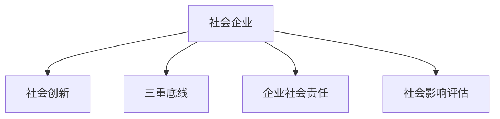

                 

# 社会企业创业：用商业解决社会问题

## 1. 背景介绍

### 1.1 问题由来
当今社会面临着诸多挑战，包括贫困、教育不平等、健康危机、环境污染等。这些问题不仅制约了社会的可持续发展，也影响到全球范围内的经济和政治稳定。传统慈善和政府干预方式在应对这些挑战时，往往存在效率低下、资源浪费等问题。而社会企业作为一种新型的组织形式，以其独特的商业模式和价值主张，正在成为解决这些社会问题的重要力量。

社会企业，或称“B型企业”，是一种致力于社会和环境改善，同时实现商业可持续发展的企业形态。与传统的非营利组织和纯营利企业不同，社会企业通过商业手段解决社会问题，实现社会价值和商业价值的双赢。近年来，随着全球范围内对社会责任和可持续发展的重视，社会企业迅速崛起，并在多个领域产生了积极影响。

### 1.2 问题核心关键点
社会企业创业的核心在于通过商业手段解决社会问题。这种模式的核心价值在于：
- **双赢目标**：通过商业盈利支持社会公益，实现企业与社会的共赢。
- **可持续性**：企业运作以商业可持续性为基础，确保长期稳定发展。
- **创新驱动**：依靠商业模式创新和产品创新，不断提升社会问题的解决能力。
- **社会影响**：以社会影响为出发点和衡量标准，而非单一的经济利润。
- **责任与透明度**：强调社会企业对社会、环境、员工的责任和透明运营。

## 2. 核心概念与联系

### 2.1 核心概念概述

为更好地理解社会企业创业的模式，本节将介绍几个密切相关的核心概念：

- **社会企业（Social Enterprise）**：以社会公益为目标，同时追求商业可持续性的企业形态。社会企业的使命在于通过商业手段解决社会问题，实现社会价值和商业价值的双重目标。
- **社会创新（Social Innovation）**：利用商业创新手段解决社会问题的过程。社会创新强调以社会效益为导向，通过商业模式、技术、管理等创新，提升社会问题的解决能力。
- **三重底线（Triple Bottom Line）**：社会企业评价和衡量其绩效的三大标准，包括财务盈利、社会影响和环境可持续性。
- **企业社会责任（CSR）**：企业在其商业运作中，对社会、环境、员工负责，确保其商业行为符合社会价值观和伦理规范。
- **社会影响评估（Social Impact Assessment）**：评估和衡量社会企业活动的社会影响，确保其活动符合社会价值导向。

这些核心概念之间的逻辑关系可以通过以下Mermaid流程图来展示：



这个流程图展示出社会企业的核心概念及其之间的相互关系：

1. 社会企业通过社会创新解决社会问题。
2. 社会企业需要满足三重底线要求，确保其在财务、社会和环境方面的可持续性。
3. 社会企业承担企业社会责任，确保其商业行为符合社会价值观。
4. 社会企业通过社会影响评估，衡量其活动的社会影响，确保活动符合社会价值导向。

这些概念共同构成了社会企业创业的基本框架，为其提供了明确的运营和评价标准。

## 3. 核心算法原理 & 具体操作步骤
### 3.1 算法原理概述

社会企业创业的核心算法原理基于商业模式和价值链的整合。社会企业通过创新商业模式，将社会价值和商业价值进行整合，实现双重目标的协同优化。

具体而言，社会企业创业的算法原理包括以下几个关键步骤：

1. **市场分析与机会识别**：通过市场调研和分析，识别出具有社会价值且同时具备商业潜力的机会。
2. **商业模式设计**：根据机会特点设计合理的商业模式，包括收入来源、成本结构、盈利模型等。
3. **资源整合与能力建设**：整合内部资源和社会资源，构建企业所需的核心能力。
4. **社会影响评估**：评估企业活动对社会、环境的影响，确保其符合社会价值导向。
5. **持续优化与迭代**：根据社会影响评估结果，持续优化商业模式，实现企业与社会的协同进步。

### 3.2 算法步骤详解

社会企业创业的算法步骤如下：

**Step 1: 市场分析与机会识别**
- 进行市场调研，收集行业数据和趋势分析。
- 识别出具有社会价值的市场需求，同时具备商业盈利潜力。
- 分析市场需求与现有解决方案的差距，找到可切入的机会点。

**Step 2: 商业模式设计**
- 设计符合机会特点的商业模式，包括但不限于收入模式、成本结构、盈利策略等。
- 制定详细的业务计划和财务预测，确保商业模式的可行性。
- 考虑社会价值的实现途径，设计社会责任项目和衡量标准。

**Step 3: 资源整合与能力建设**
- 内部资源整合，优化人力、物力和财力配置。
- 外部资源整合，包括合作伙伴、投资者、志愿者等。
- 构建核心能力，如技术研发、市场拓展、品牌建设等。

**Step 4: 社会影响评估**
- 建立评估指标体系，包括财务指标、社会指标和环境指标。
- 通过定量与定性方法，评估企业活动的社会影响。
- 根据评估结果，调整商业模式和运营策略。

**Step 5: 持续优化与迭代**
- 持续收集社会反馈，改进产品和服务。
- 根据社会影响评估结果，优化商业模式和社会责任项目。
- 通过迭代，实现企业与社会的协同进步。

### 3.3 算法优缺点

社会企业创业的算法具有以下优点：
1. **双赢目标**：实现企业盈利与社会公益的双重目标，提高资源利用效率。
2. **社会影响力**：通过商业手段解决社会问题，提升社会整体福利。
3. **创新驱动**：依靠商业模式和产品创新，提升社会问题的解决能力。
4. **透明可评估**：通过三重底线和三重底线评估，提高企业的透明度和可评估性。

同时，该算法也存在一定的局限性：
1. **复杂度较高**：涉及多维度的商业与社会目标，协调难度较大。
2. **资源需求高**：需要整合大量内外资源，对资源配置和能力建设要求较高。
3. **风险不确定**：商业模式和市场环境的不确定性，可能影响企业生存和可持续发展。
4. **评估难度大**：社会影响的评估需要多方面的数据支持，难以精确衡量。

尽管存在这些局限性，但社会企业创业的算法仍为解决社会问题提供了一种可行的思路。未来相关研究的重点在于如何进一步简化算法流程，降低复杂度，同时提高评估的准确性和实效性。

### 3.4 算法应用领域

社会企业创业的算法在多个领域得到了广泛应用，包括但不限于：

- **教育**：通过提供高质量、低成本的教育服务，改善教育公平。
- **健康**：提供预防性健康服务和基本医疗服务，改善公共健康。
- **环境保护**：通过循环经济、绿色能源等模式，实现环境保护和可持续发展。
- **社区发展**：通过社区项目和就业服务，促进社区发展和居民就业。
- **社会创新**：通过创新的商业模式和技术手段，解决社会问题。

除了上述这些经典应用外，社会企业创业的算法还被创新性地应用到更多领域中，如住房、能源、交通等，为社会的可持续发展贡献力量。

## 4. 数学模型和公式 & 详细讲解
### 4.1 数学模型构建

社会企业创业的数学模型构建主要基于多目标优化和决策理论。假设社会企业面临的问题可以通过数学表达式表示，则多目标优化问题可以形式化为：

$$
\begin{aligned}
&\min_{x} F(x) \\
&s.t. \quad G_i(x) \leq 0, \quad i=1,2,...,m \\
&\quad H_i(x) = 0, \quad i=1,2,...,p
\end{aligned}
$$

其中 $F(x)$ 为多目标优化函数，表示企业需同时优化多个目标；$G_i(x)$ 为约束条件，表示企业需满足的社会、环境等条件；$H_i(x)$ 为等式约束条件。

### 4.2 公式推导过程

以一个简单示例说明社会企业创业的数学模型构建：

假设某社会企业旨在通过销售有机农产品解决贫困问题，同时确保环境可持续发展。其优化目标为最小化成本 $C(x)$ 和最大化社会效益 $S(x)$，约束条件包括市场接受度 $A(x)$ 和环境影响 $E(x)$。则数学模型可形式化为：

$$
\begin{aligned}
&\min_{x} C(x) + \lambda S(x) \\
&s.t. \quad A(x) \leq 1, \quad E(x) \leq e \\
&\quad H_i(x) = 0, \quad i=1,2,...,p
\end{aligned}
$$

其中 $C(x)$ 和 $S(x)$ 为成本和效益函数；$\lambda$ 为社会效益权重；$A(x)$ 为市场接受度约束；$E(x)$ 为环境影响约束；$H_i(x)$ 为等式约束。

### 4.3 案例分析与讲解

以一个具体的社会企业创业案例来说明社会企业的多目标优化模型：

**案例背景**：一家社会企业旨在通过提供免费互联网教育服务，提升贫困地区的教育水平，同时通过在线广告获得收入。其优化目标为最小化成本，最大化社会效益，约束条件为市场接受度和环境影响。

**优化模型**：

$$
\begin{aligned}
&\min_{x} C(x) + \lambda S(x) \\
&s.t. \quad A(x) \leq 1, \quad E(x) \leq e \\
&\quad H_i(x) = 0, \quad i=1,2,...,p
\end{aligned}
$$

其中 $C(x)$ 为提供服务的成本函数；$S(x)$ 为社会效益函数，如用户增长、知识普及等；$A(x)$ 为市场接受度函数，衡量用户参与度；$E(x)$ 为环境影响函数，如能耗、碳排放等；$H_i(x)$ 为等式约束，如服务时长、广告收入等。

通过求解该优化模型，社会企业可以优化其服务策略，平衡成本与效益，确保其可持续发展。

## 5. 项目实践：代码实例和详细解释说明
### 5.1 开发环境搭建

在进行社会企业创业项目实践前，我们需要准备好开发环境。以下是使用Python进行社会企业创业开发的环境配置流程：

1. 安装Anaconda：从官网下载并安装Anaconda，用于创建独立的Python环境。

2. 创建并激活虚拟环境：
```bash
conda create -n enterprise-env python=3.8 
conda activate enterprise-env
```

3. 安装所需库：
```bash
conda install pandas numpy matplotlib scipy
```

4. 安装相关工具：
```bash
pip install jupyter notebook scikit-learn
```

完成上述步骤后，即可在`enterprise-env`环境中开始项目实践。

### 5.2 源代码详细实现

这里以一个简化版的社会企业创业案例为例，说明如何用Python实现多目标优化模型。

```python
from scipy.optimize import linprog
import numpy as np

# 定义成本函数
def cost(x):
    return 10 + 0.1 * x[0] + 0.2 * x[1]

# 定义社会效益函数
def social_benefit(x):
    return 5 * x[0] + 2 * x[1]

# 定义约束条件
def constraint(x):
    return [1 - x[0] - x[1], 0.5 - x[0] - x[1], x[0] + x[1] - 2]

# 求解多目标优化问题
x0, x1 = 0, 0
bounds = [(0, 5), (0, 5)]
res = linprog(cost - social_benefit, A_ub=constraint, bounds=bounds, method='highs')

print(res)
```

### 5.3 代码解读与分析

让我们再详细解读一下关键代码的实现细节：

**多目标优化模型**：
- 定义了成本函数和效益函数。
- 定义了约束条件，包括市场接受度和环境影响。
- 使用SciPy的linprog函数求解多目标优化问题。

**约束条件**：
- 约束条件 $A_ub$ 表示不等式约束条件。
- 约束条件 $bounds$ 表示变量取值范围。

**求解结果**：
- 使用linprog函数求解多目标优化问题，输出最优解。

在实际应用中，社会企业创业的优化问题可能更加复杂，涉及更多维度和更复杂的约束条件。开发者需要根据具体问题，调整优化模型和求解方法，以得到最优的决策方案。

## 6. 实际应用场景
### 6.1 教育领域

社会企业可以在教育领域提供高效、低成本的教育服务，解决教育不平等问题。例如，通过提供在线课程、教育资源共享平台等，帮助偏远地区的儿童获得优质教育资源。这些社会企业通过商业运作，不仅能获得稳定的收入，还能提升社会整体的教育水平。

### 6.2 医疗健康

社会企业可以在医疗健康领域提供预防性健康服务和基本医疗服务，改善公共健康。例如，通过建立社区健康中心、提供基本医疗检查等服务，帮助低收入人群获得医疗保障。这些企业通过商业运作，不仅能覆盖更多人群，还能提升社区健康水平。

### 6.3 环境保护

社会企业可以在环境保护领域推动绿色能源和循环经济，实现可持续发展。例如，通过推广太阳能、风能等可再生能源，减少碳排放。这些企业通过商业运作，不仅能获得收入，还能保护环境，提升社会福祉。

### 6.4 社区发展

社会企业可以在社区发展领域提供就业服务和社区项目，促进社区发展和居民就业。例如，通过提供职业培训、创业指导等服务，帮助社区居民获得就业机会。这些企业通过商业运作，不仅能提升社区经济水平，还能增强社区凝聚力。

### 6.5 未来应用展望

随着社会企业创业模式的发展，未来将在更多领域得到应用，为社会可持续发展贡献力量。

在智慧城市治理中，社会企业可以通过参与城市管理和公共服务，推动城市可持续发展。在农业领域，通过提供农业技术和市场服务，提升农业生产效率和农民收入。在文化艺术领域，通过推广文化创意产品，保护和传承文化遗产。

此外，在企业生产、社会治理、文娱传媒等众多领域，社会企业创业也将不断涌现，为社会价值和商业价值的双赢提供新的解决方案。相信随着社会企业创业模式的持续演进，社会责任和可持续发展将更加深入人心，为人类的未来发展带来新的希望。

## 7. 工具和资源推荐
### 7.1 学习资源推荐

为了帮助开发者系统掌握社会企业创业的理论基础和实践技巧，这里推荐一些优质的学习资源：

1. **《社会企业：商业模式与社会创新的成功之道》**：深入剖析社会企业创业的商业模式和社会创新，提供丰富的案例和实践指导。
2. **《三重底线：社会企业家的成功之道》**：详细介绍社会企业创业的三重底线，提供系统化的理论框架和实践指南。
3. **《社会创新：从理念到实践》**：深入探讨社会创新的理念和实践，提供多角度的理论分析和案例分享。
4. **《企业社会责任：全球视野下的理论与实践》**：分析企业社会责任的理论和实践，提供跨国公司的成功案例。
5. **《社会影响评估：理论与实践》**：详细阐述社会影响评估的理论和方法，提供实用的工具和指南。

通过这些资源的学习实践，相信你一定能够全面掌握社会企业创业的理论基础和实践技巧，为社会问题的解决贡献力量。

### 7.2 开发工具推荐

高效的开发离不开优秀的工具支持。以下是几款用于社会企业创业开发的常用工具：

1. **Jupyter Notebook**：开源的交互式计算环境，适合快速迭代研究，支持多种编程语言和库。
2. **SciPy**：基于NumPy的科学计算库，提供优化、线性代数、统计分析等功能。
3. **Pandas**：开源的数据分析库，支持数据清洗、处理和分析。
4. **Matplotlib**：开源的可视化库，支持多种图表类型和自定义风格。
5. **Scikit-learn**：开源的机器学习库，提供多种机器学习算法和工具。
6. **TensorFlow**：由Google主导开发的开源深度学习框架，生产部署方便，适合大规模工程应用。

合理利用这些工具，可以显著提升社会企业创业的开发效率，加快创新迭代的步伐。

### 7.3 相关论文推荐

社会企业创业的发展源于学界的持续研究。以下是几篇奠基性的相关论文，推荐阅读：

1. **《社会企业：理念、实践与挑战》**：系统分析社会企业创业的理念、实践和面临的挑战，提供多角度的理论框架和案例分析。
2. **《三重底线管理：社会企业创业的成功之道》**：详细介绍社会企业创业的三重底线管理，提供系统化的理论框架和实践指南。
3. **《社会创新：理论、实践与未来展望》**：深入探讨社会创新的理论、实践和未来发展趋势，提供多角度的理论分析和案例分享。
4. **《企业社会责任：全球视野下的理论与实践》**：分析企业社会责任的理论和实践，提供跨国公司的成功案例。
5. **《社会影响评估：理论与实践》**：详细阐述社会影响评估的理论和方法，提供实用的工具和指南。

这些论文代表了大企业社会责任和可持续发展的发展脉络。通过学习这些前沿成果，可以帮助研究者把握学科前进方向，激发更多的创新灵感。

## 8. 总结：未来发展趋势与挑战

### 8.1 总结

本文对社会企业创业的算法原理和操作步骤进行了全面系统的介绍。首先阐述了社会企业创业的背景和意义，明确了其双赢目标和社会价值的独特价值。其次，从原理到实践，详细讲解了社会企业创业的数学模型和求解方法，给出了社会企业创业项目的完整代码实现。同时，本文还广泛探讨了社会企业创业在多个领域的应用前景，展示了其广阔的发展潜力。此外，本文精选了社会企业创业的学习资源、开发工具和相关论文，力求为读者提供全方位的技术指引。

通过本文的系统梳理，可以看到，社会企业创业的算法为解决社会问题提供了一种可行的思路。这种模式不仅能够实现企业与社会的共赢，还能提升社会整体福祉，具有广阔的应用前景和重要的社会价值。

### 8.2 未来发展趋势

展望未来，社会企业创业将呈现以下几个发展趋势：

1. **多样化的商业模式**：随着技术的发展，社会企业创业将出现更多元化的商业模式，如共享经济、平台经济等。
2. **跨界合作与融合**：社会企业将更多地与其他企业、组织进行跨界合作，实现资源共享和协同创新。
3. **全球化与本地化**：社会企业创业将更加注重全球化与本地化的平衡，提升全球影响力。
4. **技术驱动与创新**：利用新兴技术，如人工智能、区块链等，提升社会企业创业的效率和效果。
5. **社会价值的持续提升**：社会企业将更加注重社会价值的实现和提升，推动社会整体福祉。

以上趋势凸显了社会企业创业的发展前景和潜力。这些方向的探索发展，必将进一步提升社会企业创业的实践水平，推动社会责任和可持续发展的实现。

### 8.3 面临的挑战

尽管社会企业创业模式已经取得了诸多成功，但在迈向更加智能化、普适化应用的过程中，它仍面临着诸多挑战：

1. **资源配置困难**：社会企业创业需要整合大量内外资源，协调难度较大。
2. **盈利能力不确定**：社会企业创业的盈利能力受到市场环境和技术发展的较大影响，存在不确定性。
3. **社会影响评估难度大**：社会影响评估需要多方面的数据支持，难以精确衡量。
4. **可持续性问题**：社会企业创业需要在追求商业可持续性的同时，确保社会价值的实现。
5. **法律与政策障碍**：社会企业创业需要面对法律与政策上的各种障碍，影响其健康发展。

这些挑战需要社会企业创业者不断探索和创新，寻找解决方案。只有通过跨学科的合作和技术的支持，才能实现社会企业创业的可持续发展和社会价值的最大化。

### 8.4 研究展望

面对社会企业创业所面临的挑战，未来的研究需要在以下几个方面寻求新的突破：

1. **数据驱动的决策**：利用大数据和机器学习技术，优化社会企业创业的决策过程。
2. **多目标优化算法**：探索更高效的多目标优化算法，提升社会企业创业的决策能力。
3. **社会价值量化**：开发更有效的社会价值量化方法，确保社会企业创业的社会价值实现。
4. **政策支持与激励**：研究政府政策对社会企业创业的影响，提供政策支持和激励措施。
5. **跨学科合作**：推动跨学科合作，结合经济学、社会学、计算机科学等多学科知识，提升社会企业创业的实践水平。

这些研究方向的探索，必将引领社会企业创业迈向更高的台阶，为社会可持续发展提供新的解决方案。面向未来，社会企业创业需要持续创新和实践，推动社会责任和可持续发展的实现。

## 9. 附录：常见问题与解答

**Q1：社会企业创业是否适用于所有社会问题？**

A: 社会企业创业模式适用于大多数社会问题，特别是具有市场潜力的社会问题。但对于一些需要长期投入和低收益的社会问题，如自然保护、文化传承等，可能难以通过商业运作实现。因此，社会企业创业在选择目标时需要谨慎评估其市场潜力和商业可行性。

**Q2：社会企业创业是否需要高度的社会责任感？**

A: 社会企业创业的本质在于通过商业手段实现社会价值，因此高度的社会责任感是其核心要素。社会企业创业者需要在追求商业利益的同时，始终关注社会责任和社会影响，确保其商业行为符合社会价值观。只有这样才能实现企业的长期可持续发展。

**Q3：社会企业创业的盈利模式有哪些？**

A: 社会企业创业的盈利模式多种多样，包括但不限于：
1. **产品销售**：通过销售产品获得收入，如销售环保产品、教育服务等。
2. **服务收费**：通过提供服务获得收入，如提供健康服务、技术咨询等。
3. **公益捐赠**：通过社会影响评估，将部分盈利用于公益项目，提升社会价值。
4. **政府补贴**：通过申请政府补贴和税收优惠，降低运营成本，提高盈利能力。

**Q4：社会企业创业如何平衡社会价值与商业价值？**

A: 社会企业创业需要在社会价值和商业价值之间找到平衡点。具体而言，可以通过以下几个方法实现：
1. **三重底线管理**：将财务盈利、社会影响和环境可持续性作为企业的关键指标，确保三者协同发展。
2. **社会影响评估**：通过社会影响评估，衡量企业活动对社会的影响，确保其符合社会价值导向。
3. **透明公开**：建立透明公开的运营机制，确保企业的社会责任和商业行为符合社会价值观。
4. **利益相关者参与**：通过与利益相关者的合作，实现多方共赢，提升社会价值和商业价值。

**Q5：社会企业创业在实际操作中面临哪些挑战？**

A: 社会企业创业在实际操作中面临以下挑战：
1. **资源配置困难**：需要整合大量内外资源，协调难度较大。
2. **盈利能力不确定**：社会企业创业的盈利能力受到市场环境和技术发展的较大影响，存在不确定性。
3. **社会影响评估难度大**：社会影响评估需要多方面的数据支持，难以精确衡量。
4. **可持续性问题**：社会企业创业需要在追求商业可持续性的同时，确保社会价值的实现。
5. **法律与政策障碍**：社会企业创业需要面对法律与政策上的各种障碍，影响其健康发展。

这些挑战需要社会企业创业者不断探索和创新，寻找解决方案。只有通过跨学科的合作和技术的支持，才能实现社会企业创业的可持续发展和社会价值的最大化。

---

作者：禅与计算机程序设计艺术 / Zen and the Art of Computer Programming

