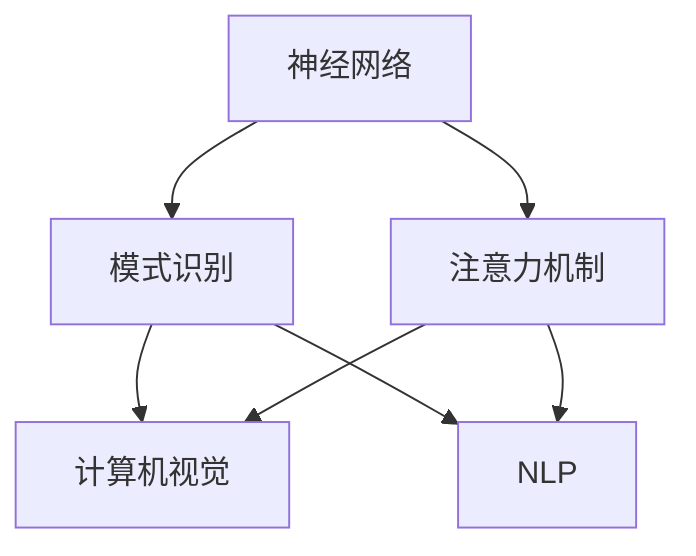

                 

# 神经网络在注意力模式识别中的应用

> 关键词：神经网络,注意力机制,模式识别,深度学习,计算机视觉,自然语言处理

## 1. 背景介绍

### 1.1 问题由来
在人工智能和机器学习领域，模式识别（pattern recognition）一直是核心研究课题之一。它旨在从复杂的数据集中识别出有意义的结构或规律。随着深度学习技术的进步，神经网络（neural networks）成为实现模式识别任务的主要手段。其中，注意力机制（attention mechanism）由于其独特的能力，在处理各种复杂数据结构时展现出卓越的表现。

注意力机制源自于人脑的注意力系统，它能够根据输入数据的重要程度动态调整关注度。在计算机视觉和自然语言处理等领域的众多任务中，注意力机制已广泛应用于图像分类、目标检测、机器翻译、文本摘要等。近年来，其在模式识别中的应用愈加广泛，不仅在传统领域中发挥着重要作用，更在许多新兴的领域中取得了显著进展。

### 1.2 问题核心关键点
本文重点关注神经网络中的注意力机制及其在模式识别中的应用。注意力机制通过动态调整权重，将计算资源的集中应用在关键特征上，从而有效提升了模型的性能和泛化能力。本文将系统介绍注意力机制的原理和实现方法，同时通过详尽的案例分析，阐述其在不同领域中的实际应用。

## 2. 核心概念与联系

### 2.1 核心概念概述

为更好地理解注意力机制在神经网络中的应用，本节将介绍几个关键的概念及其相互联系：

- **神经网络（Neural Network, NN）**：由互连的节点（神经元）构成的计算模型，通过反向传播算法进行参数更新，从而实现对数据的拟合和预测。

- **注意力机制（Attention Mechanism）**：在神经网络中引入的一种机制，用于动态地决定在处理输入数据时应该关注哪些部分。通过给每个输入元素分配一个权重，注意力机制能够聚焦于最具信息量的部分，提高模型的效率和准确性。

- **模式识别（Pattern Recognition）**：从观察数据中识别出特定模式的过程。注意力机制能够帮助神经网络更有效地处理复杂结构的数据，提高模式识别的准确性。

- **计算机视觉（Computer Vision）**：计算机科学的一个分支，旨在使计算机能够像人一样理解和解释图像和视频。注意力机制在计算机视觉中的应用，如物体检测、图像分割、语义分割等，显著提升了图像处理的精度和速度。

- **自然语言处理（Natural Language Processing, NLP）**：使计算机能够理解、处理和生成人类语言的技术。注意力机制在NLP中的应用，如机器翻译、文本摘要、问答系统等，显著提升了自然语言处理的性能。

这些核心概念之间的逻辑关系可以通过以下Mermaid流程图来展示：



这个流程图展示了一系列核心概念及其之间的关系：

1. 神经网络作为基础模型，提供了模式识别的基本能力。
2. 注意力机制在神经网络中发挥作用，提升模型的信息获取和处理能力。
3. 注意力机制在计算机视觉和自然语言处理等特定领域中的应用，显著提升了模型在这些任务上的表现。

## 3. 核心算法原理 & 具体操作步骤

### 3.1 算法原理概述

注意力机制通过动态分配权重，使得神经网络在处理输入数据时能够集中关注关键部分，而忽略不重要的信息。其基本思想是通过计算输入数据的表示向量（representation vector），生成一个与输入数据维度相同的权重向量（attention vector），然后将其与输入数据的表示向量进行加权求和，得到加权表示向量。

具体而言，对于输入数据集 $X$，注意力机制通过计算得到注意力权重 $W$，然后与输入数据 $X$ 的表示向量 $V$ 进行加权求和，得到加权表示向量 $C$。其公式可以表示为：

$$
C = \sum_{i=1}^n W_i V_i
$$

其中 $W$ 是注意力权重向量，$V_i$ 是输入数据 $X$ 中第 $i$ 个元素的表示向量，$n$ 是输入数据元素个数。权重 $W$ 通常是通过注意力函数（attention function）计算得到的，它可以根据输入数据的特征动态调整。

注意力机制的核心优势在于其灵活性和自适应性。通过动态调整权重，注意力机制能够聚焦于输入数据的关键部分，从而提高模型的鲁棒性和泛化能力。在实际应用中，注意力机制被广泛用于图像分类、机器翻译、目标检测等任务中，显著提升了模型的性能。

### 3.2 算法步骤详解

基于注意力机制的神经网络在实现时通常包括以下关键步骤：

**Step 1: 输入数据的表示**  
- 将输入数据 $X$ 转换为固定长度的表示向量 $V$。对于图像数据，可以使用卷积神经网络（Convolutional Neural Network, CNN）提取特征；对于文本数据，可以使用循环神经网络（Recurrent Neural Network, RNN）或Transformer网络生成表示向量。

**Step 2: 计算注意力权重**  
- 通过注意力函数计算输入数据的注意力权重 $W$。常见的注意力函数包括点积注意力（dot product attention）、加性注意力（additive attention）、多头注意力（multi-head attention）等。

**Step 3: 生成加权表示向量**  
- 将注意力权重 $W$ 与输入数据的表示向量 $V$ 进行加权求和，得到加权表示向量 $C$。

**Step 4: 输出预测**  
- 将加权表示向量 $C$ 作为网络的最终输出，进行后续的分类或回归等任务。

**Step 5: 反向传播**  
- 通过反向传播算法，计算损失函数对模型参数的梯度，并更新模型参数，最小化损失函数。

### 3.3 算法优缺点

注意力机制在神经网络中的应用具有以下优点：

- **提高模型性能**：通过动态调整权重，注意力机制能够聚焦于输入数据的关键部分，提高模型的准确性和泛化能力。
- **增强模型鲁棒性**：在输入数据存在噪声或缺失的情况下，注意力机制能够自动忽略不重要的部分，减少噪声对模型的影响。
- **简化模型结构**：注意力机制可以替代部分复杂的网络结构，提高模型的效率和速度。

同时，注意力机制也存在一些缺点：

- **计算复杂度高**：注意力机制的计算过程相对复杂，特别是在多头注意力和多层次网络结构中，计算量较大。
- **难以解释**：注意力机制的权重计算过程较为复杂，难以解释其决策机制。
- **对数据依赖性高**：注意力机制的效果依赖于输入数据的特征和表示方法，对于不同类型的输入数据，可能需要不同的注意力函数和计算方法。

尽管存在这些缺点，但注意力机制在神经网络中的应用已经取得了显著的进展，成为深度学习领域的一个重要研究方向。未来，随着计算资源的提升和算法研究的深入，注意力机制的效率和性能有望进一步提升。

### 3.4 算法应用领域

注意力机制在神经网络中的应用已经覆盖了计算机视觉、自然语言处理、音频处理等多个领域。以下是几个典型的应用场景：

- **计算机视觉**：在图像分类、目标检测、图像分割等任务中，注意力机制被用于聚焦于关键特征，提升模型的识别能力。
- **自然语言处理**：在机器翻译、文本摘要、问答系统等任务中，注意力机制被用于处理序列数据，提升模型的语义理解和生成能力。
- **音频处理**：在语音识别、音乐分析等任务中，注意力机制被用于处理时间序列数据，提升模型的特征提取和处理能力。

除了这些经典应用外，注意力机制还将在更多新兴领域中发挥重要作用，如推荐系统、生物信息学、医疗诊断等。未来，随着技术的不断进步，注意力机制的应用领域将更加广泛，推动人工智能技术的深入发展。

## 4. 数学模型和公式 & 详细讲解 & 举例说明

### 4.1 数学模型构建

本节将使用数学语言对注意力机制的神经网络进行更加严格的刻画。

记输入数据 $X=\{x_1, x_2, ..., x_n\}$，其中 $x_i$ 为输入数据中的第 $i$ 个元素。假设 $x_i$ 的表示向量为 $v_i$，注意力权重为 $w_i$。则加权表示向量 $C$ 可以表示为：

$$
C = \sum_{i=1}^n w_i v_i
$$

其中 $w_i$ 是注意力权重，$v_i$ 是输入数据 $x_i$ 的表示向量。注意力权重 $w_i$ 通常通过注意力函数 $a_i$ 计算得到，即：

$$
w_i = a_i(v_i)
$$

常见的注意力函数包括点积注意力、加性注意力、多头注意力等。这里以点积注意力为例，介绍注意力函数的计算过程。

### 4.2 公式推导过程

点积注意力是一种常见的注意力计算方式，其公式如下：

$$
w_i = \frac{\exp(\text{score}_i)}{\sum_{j=1}^n \exp(\text{score}_j)}
$$

其中 $\text{score}_i$ 是输入数据 $x_i$ 与查询向量 $q$ 的点积，即：

$$
\text{score}_i = q^T v_i
$$

查询向量 $q$ 通常通过隐藏层输出或特殊编码得到，其维度与输入数据表示向量的维度相同。在实际应用中，点积注意力通常与多层网络结构相结合，以进一步提升模型的性能。

### 4.3 案例分析与讲解

以机器翻译为例，说明注意力机制的具体应用。假设输入序列为 $X$，查询向量为 $q$，输出序列为 $Y$。机器翻译任务的目标是将输入序列 $X$ 翻译成输出序列 $Y$。

**Step 1: 输入数据的表示**  
- 使用卷积神经网络或循环神经网络提取输入序列 $X$ 和输出序列 $Y$ 的表示向量。

**Step 2: 计算注意力权重**  
- 对于每个时间步，计算输入序列 $X$ 中每个元素 $x_i$ 与查询向量 $q$ 的点积 $\text{score}_i$，计算注意力权重 $w_i$。

**Step 3: 生成加权表示向量**  
- 将注意力权重 $w_i$ 与输入序列 $X$ 中每个元素 $x_i$ 的表示向量 $v_i$ 进行加权求和，得到加权表示向量 $c_i$。

**Step 4: 输出预测**  
- 将加权表示向量 $c_i$ 作为当前时间步的隐藏层输出，进行后续的输出预测。

在实际应用中，机器翻译模型通常使用双向LSTM或Transformer网络，通过多层网络结构和注意力机制的组合，实现高质量的翻译结果。

## 5. 项目实践：代码实例和详细解释说明

### 5.1 开发环境搭建

在进行注意力机制的神经网络开发时，我们需要准备好开发环境。以下是使用PyTorch进行开发的环境配置流程：

1. 安装Anaconda：从官网下载并安装Anaconda，用于创建独立的Python环境。

2. 创建并激活虚拟环境：
```bash
conda create -n pytorch-env python=3.8 
conda activate pytorch-env
```

3. 安装PyTorch：根据CUDA版本，从官网获取对应的安装命令。例如：
```bash
conda install pytorch torchvision torchaudio cudatoolkit=11.1 -c pytorch -c conda-forge
```

4. 安装TensorFlow：由Google主导开发的开源深度学习框架，生产部署方便，适合大规模工程应用。

5. 安装Transformers库：HuggingFace开发的NLP工具库，集成了众多SOTA语言模型，支持PyTorch和TensorFlow。

6. 安装各类工具包：
```bash
pip install numpy pandas scikit-learn matplotlib tqdm jupyter notebook ipython
```

完成上述步骤后，即可在`pytorch-env`环境中开始注意力机制的神经网络开发。

### 5.2 源代码详细实现

这里我们以图像分类任务为例，给出使用Transformers库对Transformer网络进行注意力机制应用的PyTorch代码实现。

首先，定义图像分类任务的输入和输出：

```python
import torch
import torch.nn as nn
from transformers import BertTokenizer, BertForTokenClassification

class ImageClassifier(nn.Module):
    def __init__(self, num_classes):
        super(ImageClassifier, self).__init__()
        self.num_classes = num_classes
        self.feature_extractor = BertForTokenClassification.from_pretrained('bert-base-cased')
        self.classifier = nn.Linear(768, num_classes)

    def forward(self, input_ids, attention_mask, labels=None):
        features = self.feature_extractor(input_ids, attention_mask=attention_mask)
        pooled_output = features.pooler_output
        logits = self.classifier(pooled_output)
        if labels is not None:
            loss = nn.CrossEntropyLoss()(logits.view(-1, self.num_classes), labels.view(-1))
            return loss, logits
        else:
            return logits
```

然后，定义注意力机制的Transformer模型：

```python
class Transformer(nn.Module):
    def __init__(self, num_classes):
        super(Transformer, self).__init__()
        self.num_classes = num_classes
        self.encoder = nn.Transformer(num_features=768, num_heads=8, num_layers=6, dropout=0.1)
        self.classifier = nn.Linear(768, num_classes)

    def forward(self, input_ids, attention_mask, labels=None):
        output = self.encoder(input_ids, attention_mask=attention_mask)
        logits = self.classifier(output[:, -1, :])
        if labels is not None:
            loss = nn.CrossEntropyLoss()(logits.view(-1, self.num_classes), labels.view(-1))
            return loss, logits
        else:
            return logits
```

接着，定义训练和评估函数：

```python
def train_epoch(model, optimizer, train_loader):
    model.train()
    loss_total = 0
    for data, labels in train_loader:
        optimizer.zero_grad()
        loss, logits = model(data, labels)
        loss.backward()
        optimizer.step()
        loss_total += loss.item()
    return loss_total / len(train_loader)

def evaluate(model, test_loader):
    model.eval()
    loss_total = 0
    correct = 0
    with torch.no_grad():
        for data, labels in test_loader:
            loss, logits = model(data, labels)
            loss_total += loss.item()
            predictions = torch.argmax(logits, dim=1)
            correct += torch.sum(predictions == labels).item()
    return correct / len(test_loader), loss_total / len(test_loader)
```

最后，启动训练流程并在测试集上评估：

```python
epochs = 5
batch_size = 16
learning_rate = 1e-5

model = Transformer(num_classes)
optimizer = AdamW(model.parameters(), lr=learning_rate)

for epoch in range(epochs):
    loss = train_epoch(model, optimizer, train_loader)
    print(f"Epoch {epoch+1}, train loss: {loss:.3f}")
    
    test_accuracy, test_loss = evaluate(model, test_loader)
    print(f"Epoch {epoch+1}, test accuracy: {test_accuracy:.3f}, test loss: {test_loss:.3f}")
```

以上就是使用PyTorch对图像分类任务进行Transformer网络开发的完整代码实现。可以看到，通过Transformers库，我们可以用相对简洁的代码实现Transformer网络的构建和训练。

### 5.3 代码解读与分析

让我们再详细解读一下关键代码的实现细节：

**ImageClassifier类**：
- `__init__`方法：初始化特征提取器和分类器，并定义类别数。
- `forward`方法：将输入数据和标签输入特征提取器，得到特征表示，然后通过分类器输出预测结果。

**Transformer类**：
- `__init__`方法：初始化Transformer编码器，并定义类别数。
- `forward`方法：将输入数据和标签输入编码器，得到特征表示，然后通过分类器输出预测结果。

**train_epoch函数**：
- 在训练集上迭代，计算损失并更新模型参数。

**evaluate函数**：
- 在测试集上评估模型性能，计算准确率和损失。

**训练流程**：
- 定义总的epoch数、批大小和学习率，开始循环迭代
- 每个epoch内，先在训练集上训练，输出平均损失
- 在测试集上评估，输出测试集上的准确率和损失

可以看到，PyTorch配合Transformers库使得Transformer网络的开发和微调变得简洁高效。开发者可以将更多精力放在数据处理、模型改进等高层逻辑上，而不必过多关注底层的实现细节。

当然，工业级的系统实现还需考虑更多因素，如模型的保存和部署、超参数的自动搜索、更灵活的任务适配层等。但核心的注意力机制的基本流程基本与此类似。

## 6. 实际应用场景

### 6.1 智能监控系统

智能监控系统可以应用于各种工业场景，如交通监控、安全监控、医疗监控等。通过注意力机制，智能监控系统能够实时识别出监控画面中的关键区域，聚焦于异常行为和事件，减少人工审核的工作量。

在技术实现上，可以使用卷积神经网络提取监控画面的特征，然后通过注意力机制将特征向量进行加权处理，得到加权表示向量。将加权表示向量输入分类器，得到异常行为的概率。对于概率超过预设阈值的区域，进行进一步的分析或警报。

### 6.2 自然语言处理

自然语言处理（NLP）是人工智能领域的一个重要分支，包括文本分类、情感分析、机器翻译等任务。通过注意力机制，NLP模型能够更好地理解和生成自然语言，提升任务性能。

在文本分类任务中，注意力机制可以帮助模型识别出文本中最重要的部分，提升分类准确率。在机器翻译任务中，注意力机制可以帮助模型更好地对齐源语言和目标语言，提高翻译质量。在情感分析任务中，注意力机制可以帮助模型更好地捕捉文本中的情感关键词，提升情感分析的准确性。

### 6.3 智能推荐系统

智能推荐系统是电子商务、在线媒体、社交网络等领域的核心技术，通过注意力机制，智能推荐系统能够更好地理解用户兴趣和行为，推荐更符合用户需求的商品、内容或信息。

在推荐系统中，可以使用注意力机制对用户的历史行为数据进行加权处理，得到用户兴趣的加权表示向量。将加权表示向量输入推荐模型，得到推荐结果。通过动态调整权重，注意力机制可以更好地适应不同用户的兴趣变化，提高推荐效果。

### 6.4 未来应用展望

随着注意力机制的不断发展和应用，未来在更多领域中将会看到其发挥更大的作用。

在智慧城市治理中，注意力机制可以帮助智能交通系统实时监控交通状况，提升交通管理效率。在医疗领域，注意力机制可以帮助医学影像分析系统识别出病变区域，提升诊断准确性。在金融领域，注意力机制可以帮助风险评估系统识别出潜在的风险因素，提高风险管理能力。

总之，注意力机制作为神经网络中的重要机制，将在更多领域中发挥重要的作用，推动人工智能技术的广泛应用和深入发展。

## 7. 工具和资源推荐

### 7.1 学习资源推荐

为了帮助开发者系统掌握注意力机制的原理和实践技巧，这里推荐一些优质的学习资源：

1. 《深度学习》（周志华著）：介绍深度学习的理论基础和基本算法，包括注意力机制的原理和应用。

2. 《深度学习框架PyTorch教程》：介绍PyTorch框架的使用方法和神经网络的设计实现，包括注意力机制的实践技巧。

3. 《Transformer模型及应用》（Microsoft Research Asia）：介绍Transformer模型的原理和应用，包括注意力机制的深入分析。

4. 《自然语言处理综述》（CS229 Lecture Notes）：斯坦福大学提供的自然语言处理课程讲义，涵盖注意力机制的最新研究进展。

5. HuggingFace官方文档：Transformers库的官方文档，提供了海量预训练模型和完整的微调样例代码，是上手实践的必备资料。

通过对这些资源的学习实践，相信你一定能够快速掌握注意力机制的精髓，并用于解决实际的NLP问题。

### 7.2 开发工具推荐

高效的开发离不开优秀的工具支持。以下是几款用于注意力机制神经网络开发的常用工具：

1. PyTorch：基于Python的开源深度学习框架，灵活动态的计算图，适合快速迭代研究。

2. TensorFlow：由Google主导开发的开源深度学习框架，生产部署方便，适合大规模工程应用。

3. Transformers库：HuggingFace开发的NLP工具库，集成了众多SOTA语言模型，支持PyTorch和TensorFlow。

4. Weights & Biases：模型训练的实验跟踪工具，可以记录和可视化模型训练过程中的各项指标，方便对比和调优。

5. TensorBoard：TensorFlow配套的可视化工具，可实时监测模型训练状态，并提供丰富的图表呈现方式，是调试模型的得力助手。

6. Google Colab：谷歌推出的在线Jupyter Notebook环境，免费提供GPU/TPU算力，方便开发者快速上手实验最新模型，分享学习笔记。

合理利用这些工具，可以显著提升注意力机制神经网络的开发效率，加快创新迭代的步伐。

### 7.3 相关论文推荐

注意力机制在神经网络中的应用源于学界的持续研究。以下是几篇奠基性的相关论文，推荐阅读：

1. Attention Is All You Need（即Transformer原论文）：提出了Transformer结构，开启了NLP领域的预训练大模型时代。

2. Convolutional Neural Networks for Sentence Classification（CNN分类器论文）：提出了卷积神经网络在文本分类任务中的应用，为后续的注意力机制研究奠定了基础。

3. Learning Phrase Representations using RNN Encoder Decoder for Statistical Machine Translation（LSTM翻译器论文）：提出了基于LSTM的序列到序列模型，为后续的注意力机制在机器翻译中的应用提供了思路。

4. Attention-based Models for Interpretable NLP（Attention-based NLP论文）：介绍了注意力机制在NLP中的应用，提供了详细的设计和实现方法。

5. Attention-Based RNNs for Machine Translation（Attention-based RNN翻译器论文）：提出了基于注意力机制的RNN模型，为后续的注意力机制在机器翻译中的应用提供了参考。

这些论文代表了大语言模型微调技术的发展脉络。通过学习这些前沿成果，可以帮助研究者把握学科前进方向，激发更多的创新灵感。

## 8. 总结：未来发展趋势与挑战

### 8.1 总结

本文对神经网络中的注意力机制及其在模式识别中的应用进行了全面系统的介绍。首先阐述了注意力机制的原理和应用场景，明确了其在神经网络中的重要地位。其次，从原理到实践，详细讲解了注意力机制的数学模型和实现方法，给出了具体的代码实现。同时，本文还广泛探讨了注意力机制在计算机视觉、自然语言处理等领域的实际应用，展示了其广泛的应用前景。

通过本文的系统梳理，可以看到，注意力机制在神经网络中的应用已经取得了显著的进展，成为深度学习领域的一个重要研究方向。未来，伴随计算资源的提升和算法研究的深入，注意力机制的效率和性能有望进一步提升。

### 8.2 未来发展趋势

展望未来，注意力机制在神经网络中的应用将呈现以下几个发展趋势：

1. 计算效率提升：随着计算资源的不断提升和硬件加速技术的进步，注意力机制的计算效率将不断提升。高效注意力算法和加速技术的应用，将进一步推动注意力机制在实际应用中的广泛应用。

2. 模型复杂性降低：未来的注意力机制设计将更加注重模型的复杂性和效率的平衡，避免过度的参数和计算资源消耗。基于注意力机制的轻量化模型将获得更多关注。

3. 自适应能力增强：未来的注意力机制将更加注重对输入数据的自适应能力，能够根据数据特点动态调整注意力权重，提升模型的泛化能力和鲁棒性。

4. 跨模态注意力机制：未来的注意力机制将更加注重跨模态数据处理能力，能够同时处理视觉、文本、音频等多种数据类型，提升模型的综合理解能力。

5. 多任务注意力机制：未来的注意力机制将更加注重多任务处理能力，能够同时处理多个相关任务，提升模型的任务融合和协同能力。

以上趋势凸显了注意力机制在神经网络中的重要地位和广阔前景。这些方向的探索发展，必将进一步提升神经网络的性能和应用范围，为人工智能技术的深入发展提供新的动力。

### 8.3 面临的挑战

尽管注意力机制在神经网络中的应用已经取得了显著的进展，但在迈向更加智能化、普适化应用的过程中，它仍面临着诸多挑战：

1. 计算资源消耗大：注意力机制的计算过程相对复杂，特别是在多层网络和多模态数据处理中，计算资源消耗较大。如何进一步降低计算资源消耗，提高计算效率，是未来研究的重要方向。

2. 模型可解释性不足：注意力机制的权重计算过程较为复杂，难以解释其决策机制。如何增强模型的可解释性，确保模型决策的透明性和可信度，是未来研究的重要课题。

3. 数据分布多样性：不同领域和任务的数据分布差异较大，如何设计更具适应性的注意力机制，以适应不同数据分布，是未来研究的重要方向。

4. 模型泛化能力不足：注意力机制在处理新数据时，泛化能力有限，容易过拟合。如何设计更具泛化能力的注意力机制，是未来研究的重要方向。

5. 模型训练时间较长：注意力机制的训练过程相对复杂，耗时较长。如何设计高效的训练算法，提高模型训练速度，是未来研究的重要方向。

这些挑战凸显了注意力机制在神经网络中的重要地位和广阔前景。唯有不断突破这些挑战，才能进一步提升注意力机制的性能和应用范围。

### 8.4 研究展望

面对注意力机制在神经网络中面临的种种挑战，未来的研究需要在以下几个方面寻求新的突破：

1. 探索更高效的计算算法：设计高效计算算法，降低注意力机制的计算资源消耗，提升模型训练和推理速度。

2. 研究更具泛化能力的注意力机制：设计更具泛化能力的注意力机制，增强模型对新数据的适应能力，减少过拟合风险。

3. 融合多模态注意力机制：设计跨模态注意力机制，提升模型对视觉、文本、音频等多种数据类型的综合理解能力。

4. 引入更强的可解释性：设计更具可解释性的注意力机制，增强模型决策的透明性和可信度，避免黑盒问题。

5. 结合因果推理和博弈论工具：将因果推理和博弈论工具引入注意力机制设计，提升模型的因果推理和决策能力。

6. 融合专家知识和符号化推理：将专家知识和符号化推理融入注意力机制设计，提升模型的知识整合和推理能力。

这些研究方向的探索，必将引领注意力机制在神经网络中的应用进入新的高度，为构建更加智能、可靠、可解释、可控的智能系统铺平道路。面向未来，注意力机制需要与其他人工智能技术进行更深入的融合，如知识表示、因果推理、强化学习等，多路径协同发力，共同推动人工智能技术的深入发展。

## 9. 附录：常见问题与解答

**Q1：神经网络中的注意力机制和卷积神经网络（CNN）有何不同？**

A: 神经网络中的注意力机制和卷积神经网络（CNN）有本质的不同。CNN通过卷积操作提取输入数据的局部特征，适合处理具有空间结构的数据，如图像和视频。而注意力机制则通过动态调整权重，将计算资源的集中应用在关键特征上，适合处理具有时间结构的数据，如自然语言和序列数据。

**Q2：注意力机制在神经网络中的应用主要有哪些？**

A: 注意力机制在神经网络中的应用主要包括以下几个方面：

1. 图像分类：通过注意力机制，帮助神经网络聚焦于图像中的关键区域，提升分类准确率。

2. 目标检测：通过注意力机制，帮助神经网络识别出图像中的关键目标，提升检测效果。

3. 文本分类：通过注意力机制，帮助神经网络识别出文本中的关键部分，提升分类准确率。

4. 机器翻译：通过注意力机制，帮助神经网络对齐源语言和目标语言，提升翻译质量。

5. 文本摘要：通过注意力机制，帮助神经网络提取文本中的关键信息，生成简洁的摘要。

6. 对话系统：通过注意力机制，帮助神经网络聚焦于对话上下文中的关键信息，生成合理的回复。

7. 推荐系统：通过注意力机制，帮助神经网络理解用户兴趣和行为，推荐更符合用户需求的商品或内容。

这些应用场景展示了注意力机制在神经网络中的广泛应用，提升了各种任务的性能和效果。

**Q3：如何设计高效的注意力机制？**

A: 设计高效的注意力机制需要考虑以下几个方面：

1. 选择合适的注意力函数：常见的注意力函数包括点积注意力、加性注意力、多头注意力等，选择合适的注意力函数可以提高注意力机制的计算效率和性能。

2. 设计合理的注意力权重：注意力权重的设计可以采用softmax、sigmoid等函数，确保权重满足归一性要求。

3. 优化注意力机制的计算过程：采用高效的计算算法和加速技术，如注意力并行、计算图优化等，降低注意力机制的计算资源消耗。

4. 融合多模态数据：设计跨模态注意力机制，提升模型对视觉、文本、音频等多种数据类型的综合理解能力。

5. 引入先验知识：将专家知识和符号化推理融入注意力机制设计，提升模型的知识整合和推理能力。

6. 设计更具泛化能力的注意力机制：设计更具泛化能力的注意力机制，增强模型对新数据的适应能力，减少过拟合风险。

这些方法可以显著提升注意力机制的性能和应用范围，为神经网络的应用提供新的突破。

**Q4：注意力机制在实际应用中需要注意哪些问题？**

A: 注意力机制在实际应用中需要注意以下几个问题：

1. 计算资源消耗大：注意力机制的计算过程相对复杂，特别是在多层网络和多模态数据处理中，计算资源消耗较大。如何进一步降低计算资源消耗，提高计算效率，是未来研究的重要方向。

2. 模型可解释性不足：注意力机制的权重计算过程较为复杂，难以解释其决策机制。如何增强模型的可解释性，确保模型决策的透明性和可信度，是未来研究的重要课题。

3. 数据分布多样性：不同领域和任务的数据分布差异较大，如何设计更具适应性的注意力机制，以适应不同数据分布，是未来研究的重要方向。

4. 模型泛化能力不足：注意力机制在处理新数据时，泛化能力有限，容易过拟合。如何设计更具泛化能力的注意力机制，是未来研究的重要方向。

5. 模型训练时间较长：注意力机制的训练过程相对复杂，耗时较长。如何设计高效的训练算法，提高模型训练速度，是未来研究的重要方向。

这些挑战凸显了注意力机制在神经网络中的重要地位和广阔前景。唯有不断突破这些挑战，才能进一步提升注意力机制的性能和应用范围。

**Q5：注意力机制在计算机视觉中的应用主要有哪些？**

A: 注意力机制在计算机视觉中的应用主要包括以下几个方面：

1. 图像分类：通过注意力机制，帮助神经网络聚焦于图像中的关键区域，提升分类准确率。

2. 目标检测：通过注意力机制，帮助神经网络识别出图像中的关键目标，提升检测效果。

3. 图像分割：通过注意力机制，帮助神经网络识别出图像中的关键区域，生成分割结果。

4. 语义分割：通过注意力机制，帮助神经网络识别出图像中的语义信息，生成语义分割结果。

5. 图像生成：通过注意力机制，帮助神经网络生成高质量的图像，提升生成效果。

这些应用场景展示了注意力机制在计算机视觉中的广泛应用，提升了各种任务的性能和效果。

---

作者：禅与计算机程序设计艺术 / Zen and the Art of Computer Programming

