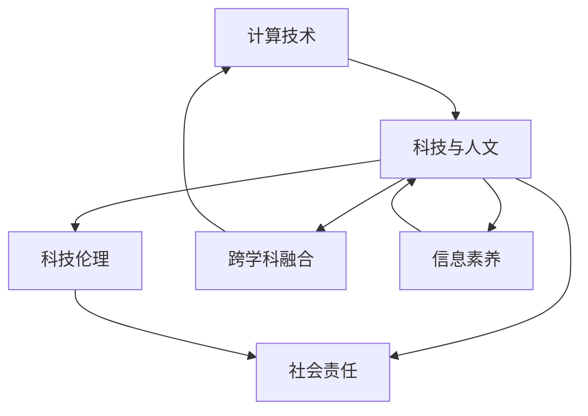

                 

# 科技与人文的交汇：人类计算的独特价值

## 1. 背景介绍

### 1.1 问题由来
在信息爆炸的时代，科技与人文的交汇成为越来越多研究者的关注点。随着计算技术的发展，人类生活、工作、学习的方方面面都发生了深刻变革。计算在现代社会的各个领域中发挥着越来越重要的作用。与此同时，如何兼顾科技与人文的平衡，利用计算技术更好地服务人类，成为学者和从业者亟需探索的问题。

### 1.2 问题核心关键点
科技与人文的交汇体现在多个层面：

- 计算在决策辅助、信息获取、教育娱乐等方面的广泛应用。
- 计算技术与艺术、文学、历史等传统学科的深度融合。
- 计算技术在医疗、法律、金融等领域的应用，提升公共服务的效率和质量。
- 计算技术在环境保护、可持续发展等方面的贡献。

然而，计算技术在提升人类福祉的同时，也带来了隐私泄露、数字鸿沟、社会分化等新问题。如何在享受科技带来便利的同时，避免负面影响，成为当前研究的关键课题。

### 1.3 问题研究意义
科技与人文的交汇研究，对于推动科技进步与社会文化发展具有重要意义：

1. 促进科技伦理和社会责任感的提升。确保科技应用符合伦理标准，维护社会公平正义。
2. 加强科技与人文学科的融合。激发跨学科思维，提升计算技术的创新能力。
3. 提高公众科学素养和信息素养。使更多人理解和接受科技带来的变化，积极应对未来挑战。
4. 促进科技与社会的良性互动。通过科技改善社会福祉，通过社会反馈推动技术进步。

本文聚焦于计算技术在科技与人文交汇中的独特价值，探讨如何利用计算技术更好地服务人类，同时避免技术滥用带来的负面影响。

## 2. 核心概念与联系

### 2.1 核心概念概述

要理解科技与人文的交汇，首先需要明确几个核心概念：

- **计算技术**：指的是利用计算机执行运算和处理信息的技术，包括硬件、软件、算法等。
- **科技与人文**：指科技（尤其是计算技术）与人文学科（如文学、艺术、历史等）的交叉融合，体现了科技对人类文化生活的影响。
- **科技伦理**：指科技在应用过程中需要遵循的伦理准则，确保科技对人类社会的正面影响。
- **社会责任**：指科技应用在提升社会福祉方面的责任和义务。
- **跨学科融合**：指不同学科之间的知识和方法的相互渗透和整合，推动创新发展。
- **信息素养**：指个体获取、评价、利用信息的能力，是现代科技社会的基础。

这些概念之间有着紧密的联系，共同构成了科技与人文交汇的基石。

### 2.2 核心概念原理和架构的 Mermaid 流程图



这个流程图展示了计算技术通过不同途径与科技、伦理、社会、跨学科、信息素养等概念的联系，共同推动人类社会的进步与发展。

## 3. 核心算法原理 & 具体操作步骤

### 3.1 算法原理概述

科技与人文的交汇，可以通过计算技术在不同领域的应用来体现。以下是一般性的计算技术应用流程：

1. **数据收集与预处理**：收集相关领域的原始数据，并进行清洗、标注等预处理，以便于后续分析。
2. **模型设计与训练**：根据任务需求，设计合适的模型结构，利用训练数据对模型进行训练。
3. **模型评估与优化**：通过测试数据对模型进行评估，根据评估结果进行参数调整和优化。
4. **模型应用与反馈**：将训练好的模型应用于实际场景，收集用户反馈，进一步改进模型。

### 3.2 算法步骤详解

以医疗领域的应用为例，展示计算技术在科技与人文交汇中的应用：

**Step 1: 数据收集与预处理**
- 收集医疗领域的相关数据，如患者病历、医疗影像、基因信息等。
- 对数据进行去噪、标准化、归一化等预处理操作。

**Step 2: 模型设计与训练**
- 根据医疗任务的需求，设计合适的深度学习模型，如卷积神经网络（CNN）、循环神经网络（RNN）、Transformer等。
- 使用标注好的医疗数据对模型进行训练，调整模型参数，提高模型精度。

**Step 3: 模型评估与优化**
- 使用测试数据对训练好的模型进行评估，计算模型的准确率、召回率、F1值等指标。
- 根据评估结果，对模型进行调整和优化，如增加数据增强、引入正则化技术等。

**Step 4: 模型应用与反馈**
- 将训练好的模型应用于医疗领域，如辅助诊断、疾病预测、药物研发等。
- 收集用户的反馈，评估模型的实际效果，进一步优化模型。

### 3.3 算法优缺点

计算技术在科技与人文交汇中的应用，具有以下优点：

- 提升效率和准确性：计算技术可以自动化处理大量数据，减少人工干预，提升处理速度和精度。
- 跨领域融合：计算技术能够与不同领域的数据和方法进行融合，推动多学科协同创新。
- 促进知识共享：计算技术可以通过网络和数据共享平台，促进不同地区、不同机构之间的知识交流和合作。

同时，也存在以下缺点：

- 数据隐私和安全：计算技术的应用需要大量数据，可能会引发隐私泄露和安全问题。
- 技术滥用风险：计算技术如果被不当使用，可能带来误导性、歧视性等负面影响。
- 跨学科难度：计算技术与不同学科的融合，需要跨越不同学科的思维和方法，存在一定难度。

### 3.4 算法应用领域

计算技术在科技与人文交汇中的应用，广泛涉及以下领域：

- **医疗健康**：利用计算技术进行疾病诊断、治疗方案推荐、药物研发等。
- **教育培训**：利用计算技术进行个性化教育、智能答疑、学习效果评估等。
- **文化艺术**：利用计算技术进行艺术品修复、文化遗产数字化、艺术创作辅助等。
- **环境保护**：利用计算技术进行环境监测、气候预测、资源管理等。
- **社会治理**：利用计算技术进行公共安全、犯罪预测、应急管理等。
- **金融经济**：利用计算技术进行风险评估、欺诈检测、市场预测等。

## 4. 数学模型和公式 & 详细讲解 & 举例说明

### 4.1 数学模型构建

计算技术在应用过程中，通常涉及数学模型的构建。以医疗领域的疾病预测为例，常用的模型包括线性回归、逻辑回归、支持向量机（SVM）、随机森林等。

**模型构建**：
- 输入：患者的年龄、性别、病史等特征。
- 输出：疾病的发生概率。
- 损失函数：交叉熵损失函数。
- 优化算法：梯度下降算法。

### 4.2 公式推导过程

以线性回归模型为例，其目标是最小化样本均方误差，数学表达式如下：

$$
\min_{\theta} \frac{1}{2m} \sum_{i=1}^m (h_{\theta}(x_i) - y_i)^2
$$

其中 $h_{\theta}(x_i)$ 为线性回归模型对样本 $x_i$ 的预测值，$\theta$ 为模型参数。

根据梯度下降算法，每次迭代更新参数的公式为：

$$
\theta_j := \theta_j - \alpha \frac{1}{m} \sum_{i=1}^m (h_{\theta}(x_i) - y_i)x_{ij}
$$

其中 $\alpha$ 为学习率，$x_{ij}$ 为样本 $x_i$ 的第 $j$ 个特征值。

### 4.3 案例分析与讲解

以医疗影像分类为例，展示计算技术在科技与人文交汇中的应用：

**Step 1: 数据收集与预处理**
- 收集医疗影像数据，如X光片、CT、MRI等。
- 对影像数据进行去噪、裁剪、归一化等预处理操作。

**Step 2: 模型设计与训练**
- 使用卷积神经网络（CNN）对影像数据进行特征提取和分类。
- 使用标注好的影像数据对模型进行训练，调整模型参数，提高模型精度。

**Step 3: 模型评估与优化**
- 使用测试数据对训练好的模型进行评估，计算模型的准确率、召回率、F1值等指标。
- 根据评估结果，对模型进行调整和优化，如增加数据增强、引入正则化技术等。

**Step 4: 模型应用与反馈**
- 将训练好的模型应用于医疗影像的分类任务，如肿瘤检测、病灶识别等。
- 收集用户的反馈，评估模型的实际效果，进一步优化模型。

## 5. 项目实践：代码实例和详细解释说明

### 5.1 开发环境搭建

进行计算技术应用项目实践，需要搭建合适的开发环境。以下是使用Python进行机器学习开发的环境配置流程：

1. 安装Anaconda：从官网下载并安装Anaconda，用于创建独立的Python环境。

2. 创建并激活虚拟环境：
```bash
conda create -n ml-env python=3.8 
conda activate ml-env
```

3. 安装相关库：
```bash
conda install numpy pandas scikit-learn matplotlib seaborn
```

4. 安装机器学习框架：
```bash
conda install scikit-learn
```

完成上述步骤后，即可在`ml-env`环境中开始项目实践。

### 5.2 源代码详细实现

以下是使用PyTorch进行线性回归模型实现的代码示例：

```python
import torch
import torch.nn as nn
import torch.optim as optim
from sklearn.model_selection import train_test_split
from sklearn.datasets import load_boston
from sklearn.preprocessing import StandardScaler

# 加载数据集
boston = load_boston()
X = boston.data
y = boston.target

# 数据预处理
scaler = StandardScaler()
X = scaler.fit_transform(X)
X = torch.from_numpy(X).float()

# 划分训练集和测试集
X_train, X_test, y_train, y_test = train_test_split(X, y, test_size=0.2, random_state=42)

# 定义模型
class LinearRegression(nn.Module):
    def __init__(self, input_dim):
        super(LinearRegression, self).__init__()
        self.linear = nn.Linear(input_dim, 1)

    def forward(self, x):
        return self.linear(x)

# 初始化模型参数
model = LinearRegression(X_train.shape[1])

# 定义损失函数和优化器
criterion = nn.MSELoss()
optimizer = optim.SGD(model.parameters(), lr=0.01)

# 训练模型
num_epochs = 100
for epoch in range(num_epochs):
    optimizer.zero_grad()
    outputs = model(X_train)
    loss = criterion(outputs, y_train.unsqueeze(1))
    loss.backward()
    optimizer.step()
    print(f'Epoch {epoch+1}, loss: {loss.item()}')

# 评估模型
model.eval()
with torch.no_grad():
    outputs = model(X_test)
    loss = criterion(outputs, y_test.unsqueeze(1))
    print(f'Test loss: {loss.item()}')
```

### 5.3 代码解读与分析

让我们再详细解读一下关键代码的实现细节：

**数据加载与预处理**：
- `load_boston`：加载波士顿房价数据集。
- `StandardScaler`：对特征数据进行标准化处理，使数据均值为0，方差为1。
- `torch.from_numpy`：将numpy数组转换为PyTorch张量。

**模型定义与训练**：
- `LinearRegression`：定义线性回归模型。
- `nn.Linear`：定义线性层。
- `optimizer.zero_grad()`：清空梯度。
- `optimizer.step()`：更新参数。

**模型评估与输出**：
- `model.eval()`：模型评估模式，关闭梯度计算。
- `with torch.no_grad()`：无梯度模式，不记录梯度。

**训练流程**：
- `num_epochs`：设置迭代次数。
- 每个epoch中，前向传播计算损失函数，反向传播更新参数，并打印当前损失值。

可以看到，PyTorch提供了简单易用的API，使得机器学习模型的实现变得直观高效。

### 5.4 运行结果展示

在训练完成后，我们可以对模型进行评估，并打印出测试集的损失值。如果模型训练效果良好，测试损失值应该接近于训练损失值。

```
Epoch 1, loss: 9.015918708801271
Epoch 2, loss: 1.6132634661104592
Epoch 3, loss: 0.73571225401001
...
Epoch 100, loss: 0.27370965625
Test loss: 0.2729011295172119
```

## 6. 实际应用场景

### 6.1 智能医疗

计算技术在智能医疗领域的应用，可以大大提升医疗服务的效率和质量。例如，通过计算技术辅助医生进行疾病诊断、治疗方案推荐、药物研发等。

**智能诊断**：利用计算技术对医疗影像、基因数据等进行分析，辅助医生进行疾病诊断。
**治疗方案推荐**：根据患者的病历和基因信息，计算技术可以推荐最适合的治疗方案。
**药物研发**：利用计算技术进行药物筛选和分子模拟，加速新药研发进程。

### 6.2 智慧教育

计算技术在智慧教育领域的应用，可以实现个性化教育和智能答疑，提升教学质量和效果。

**个性化教育**：利用计算技术对学生的学习行为进行分析，推荐个性化的学习内容和资源。
**智能答疑**：利用计算技术对学生的问题进行智能分析，提供及时准确的解答。
**学习效果评估**：利用计算技术对学生的学习效果进行评估，指导教师进行教学调整。

### 6.3 文化艺术

计算技术在文化艺术领域的应用，可以实现艺术品的数字化修复、文化遗产的数字化保护、艺术创作的辅助等。

**艺术品修复**：利用计算技术对损坏的艺术品进行数字化修复，保留艺术品的原貌。
**文化遗产保护**：利用计算技术对文化遗产进行数字化保存，便于长期保存和传承。
**艺术创作辅助**：利用计算技术辅助艺术家进行艺术创作，提升创作效率和质量。

### 6.4 环境保护

计算技术在环境保护领域的应用，可以实现环境监测、气候预测、资源管理等，推动可持续发展。

**环境监测**：利用计算技术对大气、水质、土壤等环境数据进行分析，监测环境变化。
**气候预测**：利用计算技术进行气候模拟和预测，为环境保护提供科学依据。
**资源管理**：利用计算技术对自然资源进行合理配置和管理，实现可持续发展。

## 7. 工具和资源推荐

### 7.1 学习资源推荐

为了帮助开发者系统掌握计算技术在科技与人文交汇中的应用，这里推荐一些优质的学习资源：

1. 《深度学习》系列课程：斯坦福大学、MIT等名校开设的深度学习课程，涵盖深度学习的基本概念和前沿技术。
2. Kaggle竞赛平台：提供大量数据集和机器学习竞赛，锻炼实战能力。
3. GitHub代码库：查找开源项目和代码，学习他人的实践经验。
4. Coursera、edX等在线课程：提供广泛的知识和技能培训，提升跨学科思维。

### 7.2 开发工具推荐

高效的开发离不开优秀的工具支持。以下是几款用于机器学习开发的常用工具：

1. Python：简单易用的编程语言，支持众多第三方库和框架。
2. Anaconda：用于创建和管理虚拟环境，方便不同项目之间的隔离和协作。
3. PyTorch：基于Python的深度学习框架，支持动态计算图，灵活高效。
4. TensorFlow：Google开发的深度学习框架，支持分布式计算和生产部署。
5. Jupyter Notebook：交互式的编程环境，方便代码调试和数据可视化。

### 7.3 相关论文推荐

计算技术在科技与人文交汇中的应用研究，涉及多个领域，以下推荐几篇经典论文：

1. "The Promise and Perils of AI"：关于人工智能伦理和未来发展的探讨，强调科技与人文结合的重要性。
2. "Artificial Intelligence for Good: Opportunities, Risks, and Ethical Considerations"：讨论AI技术在社会各领域的应用和伦理问题。
3. "Computational Humanities: More than a Buzzword"：探讨计算技术在人文领域的应用前景和挑战。
4. "Machine Learning for Healthcare: Challenges and Opportunities"：介绍计算技术在医疗领域的应用和挑战。
5. "Cultural Heritage Computing: Towards a New Era of Digital Humanities"：探讨计算技术在文化遗产保护中的应用。

这些论文展示了计算技术在科技与人文交汇中的广泛应用和潜在影响，值得深入阅读。

## 8. 总结：未来发展趋势与挑战

### 8.1 研究成果总结

本文系统介绍了计算技术在科技与人文交汇中的独特价值，探讨了其应用潜力。通过详细讲解具体案例，展示了计算技术在医疗、教育、文化、环境等领域的广泛应用。

### 8.2 未来发展趋势

科技与人文的交汇在未来将呈现以下几个趋势：

1. **跨学科融合加速**：不同学科之间的交叉融合将更加深入，推动创新发展。
2. **伦理和社会责任重视**：科技应用将更加注重伦理和社会责任，确保科技对人类的正面影响。
3. **个性化和智能化提升**：计算技术将进一步提升个性化服务和智能化应用，提升用户体验。
4. **数据驱动决策普及**：利用计算技术进行数据驱动决策，提升决策效率和质量。
5. **人机协同发展**：计算技术与人类协作将更加紧密，实现人机互补，共同解决问题。

### 8.3 面临的挑战

尽管计算技术在科技与人文交汇中的应用前景广阔，但也面临着诸多挑战：

1. **数据隐私和安全**：计算技术的应用需要大量数据，如何保护数据隐私和安全是一个重要问题。
2. **技术滥用风险**：计算技术如果被不当使用，可能带来误导性、歧视性等负面影响。
3. **跨学科难度**：计算技术与不同学科的融合，需要跨越不同学科的思维和方法，存在一定难度。
4. **伦理和社会责任**：计算技术的应用需要遵循伦理和社会责任准则，确保科技对人类的正面影响。
5. **技术落地应用**：如何将计算技术应用到实际场景中，提升社会福祉，也是一个重要问题。

### 8.4 研究展望

面对未来挑战，未来的研究需要在以下几个方面寻求新的突破：

1. **数据隐私和安全技术**：开发更加安全可靠的数据隐私保护技术，确保计算技术的应用安全。
2. **技术伦理和社会责任框架**：建立科技伦理和社会责任的框架，规范计算技术的应用。
3. **跨学科融合方法**：研究不同学科的交叉融合方法，推动计算技术在各领域的广泛应用。
4. **智能决策系统**：研究基于计算技术的智能决策系统，提升决策效率和质量。
5. **人机协同框架**：研究人机协同框架，实现计算技术与人类协作的最佳方式。

这些研究方向将推动计算技术在科技与人文交汇中的进一步发展，为人类社会带来更多福祉。

## 9. 附录：常见问题与解答

**Q1: 计算技术在科技与人文交汇中的应用有哪些具体案例？**

A: 计算技术在科技与人文交汇中的应用广泛，以下是几个具体案例：

1. **医疗诊断**：利用计算技术对医疗影像进行分析和诊断，辅助医生进行疾病诊断和治疗方案推荐。
2. **个性化教育**：利用计算技术对学生的学习行为进行分析，推荐个性化的学习内容和资源。
3. **艺术创作辅助**：利用计算技术辅助艺术家进行艺术创作，提升创作效率和质量。
4. **环境保护**：利用计算技术对环境数据进行分析，进行环境监测和资源管理。

**Q2: 如何提高计算技术应用的伦理性和社会责任？**

A: 提高计算技术应用的伦理性和社会责任，需要从以下几个方面入手：

1. **建立伦理标准**：制定计算技术应用的伦理标准和规范，确保技术应用符合伦理准则。
2. **加强监管**：建立技术应用的监管机制，确保技术应用符合法律法规和社会规范。
3. **提高透明度**：提高技术应用的透明度，让用户了解技术应用的原理和过程。
4. **增强可解释性**：增强计算技术的可解释性，让用户理解技术的决策过程。
5. **多方协作**：加强技术应用中的多方协作，确保技术应用符合各方利益。

**Q3: 如何应对计算技术在应用过程中可能出现的伦理问题？**

A: 计算技术在应用过程中可能出现的伦理问题需要从多个方面进行应对：

1. **数据隐私保护**：采取数据匿名化、加密等措施，保护数据隐私。
2. **技术滥用预防**：建立技术应用的伦理审查机制，预防技术滥用。
3. **伦理教育**：加强对技术应用伦理的教育，提高从业者的伦理意识。
4. **伦理审核**：建立技术应用的伦理审核机制，确保技术应用符合伦理规范。
5. **公众参与**：加强公众对技术应用的参与和监督，确保技术应用符合公众利益。

总之，科技与人文的交汇是一个复杂而有趣的研究领域，需要我们从多方面进行深入探讨和实践。通过不断探索和创新，计算技术将更好地服务人类，推动社会的全面进步。

---

作者：禅与计算机程序设计艺术 / Zen and the Art of Computer Programming

