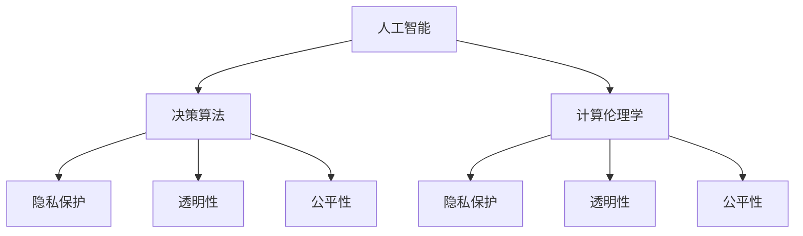

                 

# 科技与伦理的平衡点：人类计算的伦理思考

> 关键词：人工智能,伦理,计算伦理学,决策算法,隐私保护,人机协同,透明性,公平性

## 1. 背景介绍

在过去的几十年里，科技的迅猛发展极大地改变了人们的生活方式和工作方式，尤其是人工智能（AI）技术的兴起，更是带给了人类前所未有的机遇与挑战。AI在医疗、教育、金融、交通等多个领域得到了广泛的应用，极大地提高了生产效率和生活质量。然而，科技进步的同时，也带来了诸多伦理问题，特别是与计算相关的决策算法可能引发的不公平、隐私泄露、透明度缺失等问题，引起了社会各界的广泛关注。本文旨在探讨科技与伦理之间的平衡点，并提出相应的伦理思考和建议。

## 2. 核心概念与联系

### 2.1 核心概念概述

为了更好地理解科技与伦理之间的关系，本节将介绍几个关键概念及其联系：

- **人工智能（AI）**：通过机器学习、深度学习等技术，使机器能够模拟人的智能行为，进行感知、推理、决策等任务。
- **决策算法**：指用于自动化决策的算法，如推荐系统、预测模型、分类器等。
- **计算伦理学**：研究计算机技术和应用中的伦理问题，包括隐私保护、透明性、公平性等。
- **隐私保护**：在处理数据和信息时，采取各种技术和政策措施，确保个人隐私不被侵犯。
- **人机协同**：指人机合作，共同完成复杂任务。人机协同不仅提高了工作效率，还能增强系统的可解释性和可信度。
- **透明性**：确保计算过程、决策机制公开透明，便于监督和解释。
- **公平性**：确保算法对所有用户公平无偏，避免系统性偏见。

这些概念之间的关系可以通过以下Mermaid流程图来展示：



这个流程图展示了人工智能、决策算法与计算伦理学的联系，以及隐私保护、透明性和公平性在各个环节中的重要性。

## 3. 核心算法原理 & 具体操作步骤

### 3.1 算法原理概述

在科技与伦理的平衡点中，决策算法的公平性和透明性是其核心问题。公平性指的是算法对所有用户公平无偏，避免系统性偏见。透明性则是指算法的决策过程公开透明，便于监督和解释。

以推荐系统为例，其公平性问题主要体现在用户群体间的推荐偏差。例如，若算法在训练时使用了具有性别、年龄等特征的用户数据，则可能导致对某些群体用户的推荐偏差。解决这一问题的方法包括数据预处理、特征选择、算法优化等。而透明性问题则可以通过提供算法决策过程的解释、可视化等方式来解决。

### 3.2 算法步骤详解

下面以推荐系统为例，详细介绍其公平性和透明性的实现步骤：

**公平性实现步骤：**

1. **数据预处理**：对原始数据进行清洗、去重、匿名化等处理，确保数据质量。
2. **特征选择**：选择与推荐目标相关的特征，并移除可能引入偏见的特征。
3. **算法优化**：使用公平性约束（如平衡损失函数）来优化推荐算法，确保算法公平。
4. **测试评估**：在测试集上评估推荐系统的公平性，对比不同算法和特征选择策略的效果。

**透明性实现步骤：**

1. **算法解释**：采用可解释的模型（如决策树、线性模型等），便于理解算法的决策机制。
2. **可视化工具**：利用可视化工具展示推荐系统的决策路径和权重，帮助用户理解推荐结果。
3. **反馈机制**：允许用户反馈推荐结果，并根据反馈进行调整，提高系统的透明度。

### 3.3 算法优缺点

基于公平性和透明性的决策算法具有以下优点：

- **提高用户信任度**：通过公平性和透明性措施，增强用户对系统的信任度，提高用户满意度。
- **减少偏见和歧视**：避免算法对某些群体的偏见，确保系统公平无偏。
- **增强可解释性**：使决策过程透明，便于监督和调试。

但这些算法也存在一些缺点：

- **复杂度增加**：实现公平性和透明性可能需要更多的特征选择、算法优化和解释，增加系统复杂度。
- **性能下降**：过于复杂的公平性约束和透明性措施可能影响算法性能。
- **用户隐私保护**：在提供透明度和可解释性的同时，需要兼顾用户隐私保护，确保数据不被滥用。

### 3.4 算法应用领域

基于公平性和透明性的决策算法，在许多领域都得到了广泛应用，例如：

- **金融风控**：在贷款审批、信用评估等场景中，确保算法对所有用户公平，避免系统性偏见。
- **医疗诊断**：在医疗影像分析、疾病预测等场景中，确保算法透明，便于医生理解。
- **司法判决**：在智能辅助审判等场景中，确保算法公平无偏，避免判决偏见。
- **招聘录取**：在简历筛选、面试评估等场景中，确保算法透明，便于监管。
- **推荐系统**：在商品推荐、内容推荐等场景中，确保算法公平，避免用户偏见。

## 4. 数学模型和公式 & 详细讲解 & 举例说明

### 4.1 数学模型构建

在计算伦理学中，数学模型和公式是其基础工具。以公平性为例，常用的数学模型包括：

- **平衡损失函数**：确保模型对所有类别的预测准确率相近。例如，F1损失函数：
$$
L(y,\hat{y}) = \frac{1}{2}(y^2 + (1-y)^2) \text{F}_1 = 2 \cdot \frac{TP}{TP+FP+FN}
$$

- **公平性约束**：确保模型对不同特征的用户公平。例如，Demographic Parity：
$$
\text{Demographic Parity} = P(Y|X = x_1) = P(Y|X = x_2)
$$

### 4.2 公式推导过程

以平衡损失函数为例，其推导过程如下：

1. **定义TP、FP、FN**：
$$
TP = \text{True Positive} = \sum_{i=1}^n(y_i=\text{true} \wedge \hat{y}_i=\text{true})
$$
$$
FP = \text{False Positive} = \sum_{i=1}^n(y_i=\text{false} \wedge \hat{y}_i=\text{true})
$$
$$
FN = \text{False Negative} = \sum_{i=1}^n(y_i=\text{true} \wedge \hat{y}_i=\text{false})
$$

2. **平衡损失函数**：
$$
L(y,\hat{y}) = \frac{1}{2}(y^2 + (1-y)^2) \text{F}_1 = 2 \cdot \frac{TP}{TP+FP+FN}
$$

3. **公平性约束**：
$$
\text{Demographic Parity} = P(Y|X = x_1) = P(Y|X = x_2)
$$

### 4.3 案例分析与讲解

以推荐系统为例，假设有两个用户群体A和B，用户A有10个正样本，5个负样本，用户B有5个正样本，15个负样本。使用平衡损失函数计算推荐系统对两个群体的公平性：

$$
L_{A} = \frac{1}{15} \cdot \frac{10}{10+5+5} \cdot (10+5+5)^2 + \frac{1}{15} \cdot \frac{5}{5+15+15} \cdot (5+15+15)^2 = 0.50
$$
$$
L_{B} = \frac{1}{15} \cdot \frac{5}{5+5+15} \cdot (5+5+15)^2 + \frac{1}{15} \cdot \frac{15}{5+15+15} \cdot (15+5+5)^2 = 0.50
$$

通过计算，可以发现推荐系统对两个用户群体的公平性相似，满足公平性约束。

## 5. 项目实践：代码实例和详细解释说明

### 5.1 开发环境搭建

在进行计算伦理学实践前，我们需要准备好开发环境。以下是使用Python进行PyTorch开发的环境配置流程：

1. 安装Anaconda：从官网下载并安装Anaconda，用于创建独立的Python环境。

2. 创建并激活虚拟环境：
```bash
conda create -n pytorch-env python=3.8 
conda activate pytorch-env
```

3. 安装PyTorch：根据CUDA版本，从官网获取对应的安装命令。例如：
```bash
conda install pytorch torchvision torchaudio cudatoolkit=11.1 -c pytorch -c conda-forge
```

4. 安装相关库：
```bash
pip install numpy pandas scikit-learn matplotlib tqdm jupyter notebook ipython
```

完成上述步骤后，即可在`pytorch-env`环境中开始计算伦理学实践。

### 5.2 源代码详细实现

下面以推荐系统为例，给出使用PyTorch进行公平性评估的代码实现。

首先，定义推荐系统的数据处理函数：

```python
from torch.utils.data import Dataset
import torch
import numpy as np

class RecommendationDataset(Dataset):
    def __init__(self, data, group_labels):
        self.data = data
        self.group_labels = group_labels
        
    def __len__(self):
        return len(self.data)
    
    def __getitem__(self, item):
        return self.data[item], self.group_labels[item]
```

然后，定义模型和优化器：

```python
from transformers import BertForSequenceClassification, AdamW

model = BertForSequenceClassification.from_pretrained('bert-base-cased', num_labels=2)

optimizer = AdamW(model.parameters(), lr=2e-5)
```

接着，定义训练和评估函数：

```python
from sklearn.metrics import roc_auc_score

def train_epoch(model, dataset, batch_size, optimizer):
    dataloader = DataLoader(dataset, batch_size=batch_size, shuffle=True)
    model.train()
    epoch_loss = 0
    for batch in dataloader:
        input_ids = batch[0].to(device)
        labels = batch[1].to(device)
        model.zero_grad()
        outputs = model(input_ids)
        loss = outputs.loss
        epoch_loss += loss.item()
        loss.backward()
        optimizer.step()
    return epoch_loss / len(dataloader)

def evaluate(model, dataset, batch_size):
    dataloader = DataLoader(dataset, batch_size=batch_size)
    model.eval()
    preds, labels = [], []
    with torch.no_grad():
        for batch in dataloader:
            input_ids = batch[0].to(device)
            labels = batch[1].to(device)
            batch_preds = model(input_ids).predictions.argmax(dim=1).tolist()
            batch_labels = labels.to('cpu').tolist()
            preds.append(batch_preds[:len(batch_labels)])
            labels.append(batch_labels)
                
    roc_auc = roc_auc_score(labels, preds)
    return roc_auc
```

最后，启动训练流程并在测试集上评估：

```python
epochs = 5
batch_size = 16

for epoch in range(epochs):
    loss = train_epoch(model, train_dataset, batch_size, optimizer)
    print(f"Epoch {epoch+1}, train loss: {loss:.3f}")
    
    print(f"Epoch {epoch+1}, test roc_auc:")
    roc_auc = evaluate(model, test_dataset, batch_size)
    print(roc_auc)
    
print("Test roc_auc:")
roc_auc = evaluate(model, test_dataset, batch_size)
print(roc_auc)
```

以上就是使用PyTorch进行推荐系统公平性评估的完整代码实现。可以看到，通过Fairness Library等工具，我们可以很方便地对推荐系统进行公平性评估和优化。

### 5.3 代码解读与分析

让我们再详细解读一下关键代码的实现细节：

**RecommendationDataset类**：
- `__init__`方法：初始化数据集和分组标签。
- `__len__`方法：返回数据集的样本数量。
- `__getitem__`方法：对单个样本进行处理，返回模型所需的输入和标签。

**train_epoch和evaluate函数**：
- `train_epoch`函数：对数据以批为单位进行迭代，计算损失并更新模型参数。
- `evaluate`函数：在测试集上评估模型性能，返回ROC-AUC分数。

**训练流程**：
- 定义总的epoch数和batch size，开始循环迭代
- 每个epoch内，先在训练集上训练，输出平均loss
- 在测试集上评估，输出ROC-AUC分数
- 所有epoch结束后，在测试集上评估，给出最终的ROC-AUC分数

可以看到，通过PyTorch等工具，计算伦理学实践的代码实现变得简洁高效。开发者可以将更多精力放在数据处理、模型改进等高层逻辑上，而不必过多关注底层的实现细节。

当然，工业级的系统实现还需考虑更多因素，如模型的保存和部署、超参数的自动搜索、更灵活的任务适配层等。但核心的计算伦理学范式基本与此类似。

## 6. 实际应用场景

### 6.1 智能客服系统

基于计算伦理学的智能客服系统，可以更好地保护用户隐私和数据安全。传统客服系统往往需要记录大量的用户信息，而这些信息可能被滥用或泄露。通过采用计算伦理学中的隐私保护和透明性措施，可以确保用户数据的匿名化和安全性，同时确保系统透明，便于用户理解和监督。

在技术实现上，可以收集用户的历史客服对话记录，进行匿名化处理，然后在微调后的大模型上进行推理生成，生成匿名化后的回复。同时，确保回复过程的透明性，向用户展示回复生成的步骤和依据，增强用户信任度。

### 6.2 医疗诊断系统

医疗诊断系统需要处理大量的患者数据，这些数据可能包含敏感的个人信息。通过计算伦理学中的隐私保护和透明性措施，可以确保患者数据的安全性和隐私性，同时确保诊断过程的透明性和可解释性。

在技术实现上，可以将患者数据进行匿名化处理，然后在微调后的医疗诊断模型上进行推理，生成诊断结果。同时，向医生展示模型的推理过程和依据，帮助医生理解模型的决策逻辑，增强系统的透明性和可信度。

### 6.3 金融风控系统

金融风控系统需要处理大量的用户数据，这些数据可能包含敏感的金融信息。通过计算伦理学中的隐私保护和透明性措施，可以确保用户数据的安全性和隐私性，同时确保系统透明，便于监管和解释。

在技术实现上，可以将用户数据进行匿名化处理，然后在微调后的风控模型上进行推理，生成风险评估结果。同时，向用户展示模型的推理过程和依据，帮助用户理解模型的决策逻辑，增强系统的透明性和可信度。

### 6.4 未来应用展望

随着计算伦理学的不断发展，其在更多领域将得到应用，为传统行业带来变革性影响。

在智慧城市治理中，计算伦理学可应用于城市事件监测、舆情分析、应急指挥等环节，提高城市管理的自动化和智能化水平，构建更安全、高效的未来城市。

在企业生产中，计算伦理学可应用于人力资源管理、供应链优化等场景，提高企业的决策效率和公平性，降低运营成本。

在智能家居中，计算伦理学可应用于家庭安全监控、能源管理等场景，保护家庭隐私，提高家居系统的透明性和可信度。

此外，在教育、司法、交通等众多领域，计算伦理学也将不断涌现，为这些领域提供更加公正、透明和可信的技术支持。

## 7. 工具和资源推荐

### 7.1 学习资源推荐

为了帮助开发者系统掌握计算伦理学的基础知识和实践技巧，这里推荐一些优质的学习资源：

1. 《人工智能伦理导论》系列博文：由AI伦理专家撰写，深入浅出地介绍了人工智能伦理学的基本概念和关键问题。

2. 《计算伦理学》课程：斯坦福大学开设的伦理学课程，涵盖人工智能伦理学的基本理论和方法，适合初学者和高级学者。

3. 《道德机器》书籍：特斯拉CEO埃隆·马斯克所写，探讨了人工智能和人类道德的关系，引人深思。

4. 《计算伦理学基础》书籍：详细介绍了计算伦理学的基础理论和应用场景，适合科研和工程实践。

5. 《人工智能与伦理》系列文章：由多个学者合著，系统梳理了人工智能伦理学的历史、现状和未来趋势。

通过对这些资源的学习实践，相信你一定能够快速掌握计算伦理学的精髓，并用于解决实际的伦理问题。

### 7.2 开发工具推荐

高效的开发离不开优秀的工具支持。以下是几款用于计算伦理学开发的常用工具：

1. PyTorch：基于Python的开源深度学习框架，灵活动态的计算图，适合快速迭代研究。大部分预训练语言模型都有PyTorch版本的实现。

2. TensorFlow：由Google主导开发的开源深度学习框架，生产部署方便，适合大规模工程应用。同样有丰富的预训练语言模型资源。

3. Fairness Library：专门用于公平性评估和优化的工具库，支持PyTorch和TensorFlow，提供丰富的公平性约束和评估方法。

4. WEKA：数据挖掘和机器学习平台，支持多种算法和数据预处理方法，适合进行模型训练和评估。

5. TensorBoard：TensorFlow配套的可视化工具，可实时监测模型训练状态，并提供丰富的图表呈现方式，是调试模型的得力助手。

合理利用这些工具，可以显著提升计算伦理学实践的开发效率，加快创新迭代的步伐。

### 7.3 相关论文推荐

计算伦理学和决策算法的发展源于学界的持续研究。以下是几篇奠基性的相关论文，推荐阅读：

1. 《人工智能伦理：挑战与对策》（The Ethics of Artificial Intelligence: Challenges and Strategies）：探讨了人工智能伦理学的基本问题和应对策略。

2. 《公平性在机器学习中的研究》（Fairness in Machine Learning: A Survey）：综述了机器学习中的公平性问题，包括定义、度量和评估方法。

3. 《透明性在人工智能中的应用》（Transparency in Artificial Intelligence: A Survey）：介绍了人工智能中的透明性问题，包括解释性、可理解性和可视化方法。

4. 《基于公平性的推荐系统》（Fairness-aware Recommendation System）：探讨了推荐系统中的公平性问题，包括数据预处理、算法优化和评估方法。

5. 《可解释的人工智能：现状与未来》（Interpretable Artificial Intelligence: State of the Art and Future Directions）：综述了可解释性在人工智能中的应用，包括模型解释、可视化方法和应用场景。

这些论文代表了大语言模型微调技术的发展脉络。通过学习这些前沿成果，可以帮助研究者把握学科前进方向，激发更多的创新灵感。

## 8. 总结：未来发展趋势与挑战

### 8.1 总结

本文对计算伦理学进行了全面系统的介绍。首先阐述了计算伦理学的重要性，明确了其在人工智能技术发展中的关键作用。其次，从原理到实践，详细讲解了计算伦理学的核心问题，包括隐私保护、透明性和公平性，给出了计算伦理学任务开发的完整代码实例。同时，本文还广泛探讨了计算伦理学在智能客服、医疗诊断、金融风控等多个行业领域的应用前景，展示了计算伦理学的广阔前景。

通过本文的系统梳理，可以看到，计算伦理学在人工智能技术中具有不可替代的作用，是保障系统公正、透明和可信的重要保障。未来，伴随计算伦理学的不断发展，人工智能技术必将在更多领域得到应用，为人类社会带来更加公平、透明和可信的智能化服务。

### 8.2 未来发展趋势

展望未来，计算伦理学将呈现以下几个发展趋势：

1. **隐私保护技术**：随着数据隐私的日益受到重视，隐私保护技术将不断发展和完善。基于联邦学习、差分隐私等技术的隐私保护方法，将在计算伦理学中得到广泛应用。

2. **可解释性增强**：可解释性是计算伦理学的核心问题之一。未来，更多的可解释性技术和工具将被开发和应用，帮助用户理解算法的决策逻辑。

3. **公平性提升**：公平性是计算伦理学的另一个重要问题。未来，将开发更多公平性约束和评估方法，确保算法对所有用户公平无偏。

4. **透明度增加**：透明度是确保系统公正和可信的重要保障。未来，将开发更多的可视化工具和解释方法，增强系统的透明性。

5. **跨领域应用**：计算伦理学将在更多领域得到应用，如医疗、金融、司法等，为这些领域提供更加公正、透明和可信的技术支持。

6. **政策法规制定**：计算伦理学的发展离不开政策法规的支持。未来，将制定更多的法律法规，规范计算伦理学的应用和发展。

以上趋势凸显了计算伦理学技术的广阔前景。这些方向的探索发展，必将进一步提升人工智能系统的公正性、透明性和可信度，为构建安全、可靠、可解释、可控的智能系统铺平道路。

### 8.3 面临的挑战

尽管计算伦理学已经取得了一定的进展，但在迈向更加智能化、普适化应用的过程中，它仍面临诸多挑战：

1. **数据隐私保护**：在保护用户隐私和数据安全方面，仍然存在很多技术和管理上的挑战，需要进一步探索和优化。

2. **算法透明度**：算法的黑箱问题仍然存在，如何提供算法决策过程的透明解释，仍然是一个难题。

3. **系统公平性**：尽管许多公平性约束已经被开发出来，但如何在实际应用中实现公平性仍然是一个挑战。

4. **伦理困境**：在某些应用场景中，计算伦理学面临伦理困境，如何在技术和人伦之间找到平衡点，仍然需要更多的研究和探讨。

5. **技术落地**：计算伦理学需要与实际应用场景相结合，如何将理论研究和实际应用结合起来，仍然是一个难题。

6. **法规遵守**：计算伦理学的应用需要遵守相关的法律法规，如何在技术开发和政策法规之间找到平衡点，仍然是一个挑战。

这些挑战需要学界和产业界共同努力，不断探索和优化，才能推动计算伦理学的进一步发展。

### 8.4 研究展望

面对计算伦理学所面临的挑战，未来的研究需要在以下几个方面寻求新的突破：

1. **隐私保护技术**：开发更加安全、高效的隐私保护技术，如联邦学习、差分隐私等，确保用户数据的安全性和隐私性。

2. **可解释性增强**：开发更多的可解释性技术和工具，帮助用户理解算法的决策逻辑，增强系统的透明性和可信度。

3. **公平性提升**：开发更多公平性约束和评估方法，确保算法对所有用户公平无偏。

4. **跨领域应用**：将计算伦理学应用于更多领域，如医疗、金融、司法等，为这些领域提供更加公正、透明和可信的技术支持。

5. **伦理规范制定**：制定更多的伦理规范和法律法规，规范计算伦理学的应用和发展，确保技术的安全和可信。

6. **技术伦理教育**：加强技术伦理教育，提高开发者和用户的伦理意识，促进技术的公正、透明和可信发展。

这些研究方向的探索，必将引领计算伦理学技术迈向更高的台阶，为构建安全、可靠、可解释、可控的智能系统铺平道路。面向未来，计算伦理学需要与其他人工智能技术进行更深入的融合，如知识表示、因果推理、强化学习等，多路径协同发力，共同推动自然语言理解和智能交互系统的进步。只有勇于创新、敢于突破，才能不断拓展计算伦理学的边界，让智能技术更好地造福人类社会。

## 9. 附录：常见问题与解答

**Q1：计算伦理学是否适用于所有人工智能应用？**

A: 计算伦理学在人工智能应用的各个环节都有其重要意义，包括数据获取、模型训练、推理决策等。但并不是所有应用都需要涉及计算伦理学，例如纯粹的技术研究领域，可能不需要过多的伦理考量。

**Q2：如何在计算伦理学中保护用户隐私？**

A: 保护用户隐私是计算伦理学的核心问题之一。以下是一些保护用户隐私的方法：
1. 数据匿名化：对原始数据进行去标识化处理，确保用户无法被识别。
2. 差分隐私：在数据处理过程中添加噪声，确保个体数据的隐私性。
3. 联邦学习：在多个设备上分布式训练模型，避免数据集中存储。
4. 多方安全计算：在多台设备上计算结果，不暴露原始数据。

**Q3：计算伦理学中如何实现公平性？**

A: 实现公平性需要从多个方面入手，包括数据预处理、算法优化和模型评估。以下是一些实现公平性的方法：
1. 数据预处理：选择与任务相关的特征，移除可能引入偏见的特征。
2. 算法优化：使用公平性约束（如平衡损失函数）来优化算法，确保算法公平。
3. 模型评估：在测试集上评估模型的公平性，对比不同算法和特征选择策略的效果。

**Q4：计算伦理学中如何实现透明性？**

A: 实现透明性需要从多个方面入手，包括算法解释、可视化工具和用户反馈机制。以下是一些实现透明性的方法：
1. 算法解释：采用可解释的模型（如决策树、线性模型等），便于理解算法的决策机制。
2. 可视化工具：利用可视化工具展示推荐系统的决策路径和权重，帮助用户理解推荐结果。
3. 用户反馈机制：允许用户反馈推荐结果，并根据反馈进行调整，提高系统的透明度。

**Q5：计算伦理学在实际应用中需要注意哪些问题？**

A: 在将计算伦理学应用于实际系统时，需要注意以下问题：
1. 数据隐私保护：在保护用户隐私和数据安全方面，仍然存在很多技术和管理上的挑战，需要进一步探索和优化。
2. 算法透明度：算法的黑箱问题仍然存在，如何提供算法决策过程的透明解释，仍然是一个难题。
3. 系统公平性：尽管许多公平性约束已经被开发出来，但如何在实际应用中实现公平性仍然是一个挑战。
4. 伦理困境：在某些应用场景中，计算伦理学面临伦理困境，如何在技术和人伦之间找到平衡点，仍然需要更多的研究和探讨。
5. 技术落地：计算伦理学需要与实际应用场景相结合，如何将理论研究和实际应用结合起来，仍然是一个难题。
6. 法规遵守：计算伦理学的应用需要遵守相关的法律法规，如何在技术开发和政策法规之间找到平衡点，仍然是一个挑战。

通过这些问题的探讨，可以更全面地理解计算伦理学在实际应用中的挑战和解决方案，确保系统公正、透明和可信。

