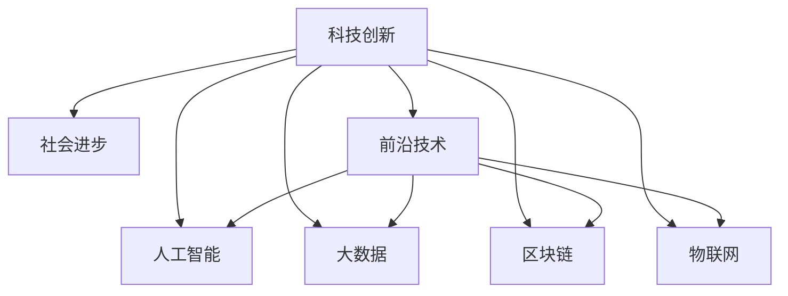

                 

# 科技创新：社会进步的阶梯

> 关键词：科技创新, 社会进步, 人工智能, 大数据, 区块链, 物联网, 机器学习, 前沿技术

## 1. 背景介绍

### 1.1 问题由来
科技创新是推动社会进步的重要动力。过去的一百多年间，人类社会经历了从电气时代到信息时代的跨越，科技创新已经成为引领经济发展的关键因素。当前，全球正在进入智能时代，科技创新已经渗透到各行各业，对经济、政治、文化和社会等各个方面产生了深远影响。

然而，在科技迅猛发展的背后，我们也面临着一些问题。如何确保科技创新的成果能够普惠大众，避免技术滥用，实现可持续发展，成为当前亟待解决的重要课题。科技创新不仅是技术突破，更是价值观的转变、社会结构的重塑和人类生活方式的变革。因此，理解科技创新的本质和内涵，把握其发展趋势，对于推动社会进步具有重要的现实意义。

### 1.2 问题核心关键点
科技创新涵盖了广泛的技术领域，包括但不限于人工智能(AI)、大数据(Big Data)、区块链(Blockchain)、物联网(IoT)等。这些技术领域的创新，带来了生产力的飞跃，改变了信息获取和处理的方式，推动了新一轮的产业变革。

科技创新与传统产业的深度融合，产生了诸多创新应用，如智能制造、智慧医疗、智能交通等，极大地提升了社会运行的效率和质量。然而，创新技术的快速迭代也带来了新的挑战，如数据隐私、算法偏见、网络安全等问题，这些都需要我们不断探索解决方案。

## 2. 核心概念与联系

### 2.1 核心概念概述

为更好地理解科技创新在社会进步中的作用，本节将介绍几个密切相关的核心概念：

- 科技创新(Innovation)：指对现有的技术、方法、产品、服务或流程进行改进或创造新的技术、方法、产品、服务或流程的过程。

- 社会进步(Social Progress)：指通过科技创新、制度变革、文化创新等手段，提高生活质量，实现社会的公平、正义、自由、安全、繁荣等目标。

- 人工智能(Artificial Intelligence)：一种模拟人类智能过程的技术，涵盖机器学习、自然语言处理、计算机视觉等多个领域。

- 大数据(Big Data)：指海量的、多样化的数据集，通过数据分析、挖掘等技术提取有价值的信息，支持决策和创新。

- 区块链(Blockchain)：一种分布式数据库技术，通过去中心化的方式记录和验证交易，保障数据安全性和透明性。

- 物联网(IoT)：指通过互联网将各种设备和传感器连接起来，实现智能化管理和服务。

这些核心概念之间的逻辑关系可以通过以下Mermaid流程图来展示：



这个流程图展示出科技创新与社会进步之间的紧密联系：

1. 科技创新是推动社会进步的核心动力。
2. 科技创新的成果在人工智能、大数据、区块链、物联网等多个领域得到应用。
3. 这些前沿技术共同推动了生产力的提升和产业的变革。

这些概念共同构成了科技创新的基础框架，推动社会向前发展。

## 3. 核心算法原理 & 具体操作步骤
### 3.1 算法原理概述

科技创新不仅依赖于技术突破，还需要在具体的应用场景中进行优化和适配。本文聚焦于科技创新在社会进步中的关键作用，从算法原理和具体操作步骤两个维度展开讨论。

科技创新在社会进步中的应用，可以通过以下步骤进行概括：

1. **需求分析**：明确社会发展的需求，识别具体的科技应用场景。
2. **技术创新**：通过研究现有技术，进行改进或创造新的技术。
3. **应用落地**：将新技术应用于具体的社会场景中，实现实际应用价值。
4. **效果评估**：评估技术应用的效果，进行持续优化和改进。

### 3.2 算法步骤详解

在具体的技术应用过程中，需要按照以下步骤进行操作：

1. **需求调研**：
   - 通过问卷调查、访谈、数据分析等方式，收集用户需求和痛点。
   - 分析用户行为、业务流程等，确定技术应用的具体方向和目标。

2. **技术选择**：
   - 根据需求分析，选择合适的技术方案。
   - 评估不同技术方案的优缺点，确定最终的技术路径。

3. **技术开发**：
   - 制定详细的设计方案和技术路线图。
   - 按照计划进行软件开发，包括模型训练、算法实现、系统集成等环节。

4. **应用部署**：
   - 将开发完成的技术应用部署到生产环境中。
   - 进行系统测试和验收，确保应用稳定性和可靠性。

5. **效果评估**：
   - 收集用户反馈和使用数据，评估技术应用的效果。
   - 分析技术应用带来的社会效益和经济效益，进行持续优化和改进。

### 3.3 算法优缺点

科技创新在社会进步中的应用，具有以下优点：

- **推动生产力提升**：科技创新可以带来生产效率的提升，优化资源配置，促进经济发展。
- **提升社会公平**：通过技术手段解决社会问题，改善社会福利，实现社会公平。
- **促进文化繁荣**：科技创新可以推动文化创新，丰富社会文化生活，提升文化软实力。
- **增强国家竞争力**：科技创新是提升国家竞争力的关键，有助于增强国家在全球舞台上的影响力。

同时，也存在一些缺点：

- **资源投入高**：科技创新的研发和应用需要高额的投资和人力资源。
- **技术风险**：新技术的引入可能带来未知的风险，如数据隐私、网络安全等。
- **社会接受度**：新技术的应用可能受到社会传统观念的阻碍，推广难度大。
- **伦理道德问题**：科技创新可能引发新的伦理道德问题，需要规范和监管。

### 3.4 算法应用领域

科技创新在社会进步中的应用，涵盖多个领域：

- **智能制造**：通过物联网、机器人等技术，实现生产自动化和智能化。
- **智慧医疗**：利用大数据、人工智能技术，提升医疗诊断和治疗水平。
- **智能交通**：通过物联网、无人驾驶等技术，优化交通管理和服务。
- **环保节能**：应用大数据和人工智能，实现能源的智能管理和节能减排。
- **金融科技**：通过区块链和人工智能，提升金融服务的效率和安全性。

这些应用领域不仅推动了经济的发展，还改善了人们的生活质量，促进了社会的进步。

## 4. 数学模型和公式 & 详细讲解 & 举例说明

### 4.1 数学模型构建

科技创新在社会进步中的应用，可以通过数学模型进行分析和优化。本节将构建一个简单的数学模型，用于描述科技创新对社会进步的贡献。

假设社会进步的总体目标为 $P$，科技创新带来的经济效益为 $E$，社会公平度为 $F$，文化繁荣度为 $C$，国家竞争力为 $D$。则科技创新对社会进步的贡献 $G$ 可以表示为：

$$G = w_E E + w_F F + w_C C + w_D D$$

其中，$w_E, w_F, w_C, w_D$ 分别为经济效益、社会公平度、文化繁荣度、国家竞争力在社会进步中的权重系数。

### 4.2 公式推导过程

根据上述模型，科技创新对社会进步的贡献 $G$ 可以通过以下公式进行计算：

$$G = \sum_{i=1}^4 w_i \times P_i$$

其中，$P_i$ 表示科技创新对第 $i$ 个目标的贡献度。

科技创新对经济效益的贡献度 $E_i$ 可以通过以下公式计算：

$$E_i = a_i \times \frac{\Delta E}{E_0}$$

其中，$a_i$ 表示科技创新对经济效益的系数，$\Delta E$ 表示科技创新带来的经济效益提升量，$E_0$ 表示科技创新前的经济效益。

科技创新对社会公平度的贡献度 $F_i$ 可以通过以下公式计算：

$$F_i = b_i \times \frac{\Delta F}{F_0}$$

其中，$b_i$ 表示科技创新对社会公平度的系数，$\Delta F$ 表示科技创新带来的社会公平度提升量，$F_0$ 表示科技创新前的社会公平度。

科技创新对文化繁荣度的贡献度 $C_i$ 可以通过以下公式计算：

$$C_i = c_i \times \frac{\Delta C}{C_0}$$

其中，$c_i$ 表示科技创新对文化繁荣度的系数，$\Delta C$ 表示科技创新带来的文化繁荣度提升量，$C_0$ 表示科技创新前的文化繁荣度。

科技创新对国家竞争力的贡献度 $D_i$ 可以通过以下公式计算：

$$D_i = d_i \times \frac{\Delta D}{D_0}$$

其中，$d_i$ 表示科技创新对国家竞争力的系数，$\Delta D$ 表示科技创新带来的国家竞争力提升量，$D_0$ 表示科技创新前的国家竞争力。

### 4.3 案例分析与讲解

以智慧医疗为例，介绍科技创新如何推动社会进步：

**需求分析**：
- 医疗资源分布不均，基层医疗服务不足。
- 医疗数据分散，难以实现高效管理和共享。
- 诊断和治疗水平有待提升，误诊和漏诊问题严重。

**技术选择**：
- 选择大数据和人工智能技术，用于医疗数据的分析和处理。
- 选择物联网技术，用于医疗设备的智能管理和监测。
- 选择区块链技术，用于医疗数据的加密和共享。

**技术开发**：
- 构建医疗数据平台，实现数据的收集、存储和管理。
- 训练医疗AI模型，进行疾病诊断和治疗方案推荐。
- 开发医疗设备，实现远程监控和自动化治疗。

**应用部署**：
- 将技术应用部署到医院和社区医疗机构，实现实时监控和数据共享。
- 进行系统测试和验收，确保技术应用的稳定性和可靠性。

**效果评估**：
- 收集用户反馈和使用数据，评估技术应用的效果。
- 分析技术应用带来的经济效益和社会效益，进行持续优化和改进。

## 5. 项目实践：代码实例和详细解释说明
### 5.1 开发环境搭建

在进行科技创新应用开发前，我们需要准备好开发环境。以下是使用Python进行Keras开发的环境配置流程：

1. 安装Anaconda：从官网下载并安装Anaconda，用于创建独立的Python环境。

2. 创建并激活虚拟环境：
```bash
conda create -n keras-env python=3.8 
conda activate keras-env
```

3. 安装Keras：根据TensorFlow版本，从官网获取对应的安装命令。例如：
```bash
pip install keras tensorflow
```

4. 安装TensorBoard：用于实时监测模型训练状态，并提供丰富的图表呈现方式。

5. 安装Jupyter Notebook：用于创建和管理Jupyter Notebook环境，支持代码的编写和执行。

6. 安装相关工具包：
```bash
pip install numpy pandas scikit-learn matplotlib tqdm
```

完成上述步骤后，即可在`keras-env`环境中开始科技创新应用开发。

### 5.2 源代码详细实现

下面我们以智慧医疗项目为例，给出使用Keras和TensorFlow进行医疗数据分析和AI模型训练的PyTorch代码实现。

首先，定义医疗数据集和模型参数：

```python
import numpy as np
from tensorflow.keras.datasets import mnist
from tensorflow.keras.models import Sequential
from tensorflow.keras.layers import Dense, Dropout
from tensorflow.keras.optimizers import Adam

# 定义模型参数
batch_size = 128
epochs = 20
learning_rate = 0.001

# 加载MNIST数据集
(x_train, y_train), (x_test, y_test) = mnist.load_data()

# 数据预处理
x_train = x_train.reshape(60000, 784)
x_test = x_test.reshape(10000, 784)
x_train = x_train / 255.0
x_test = x_test / 255.0

# 转换为one-hot编码
y_train = to_categorical(y_train, 10)
y_test = to_categorical(y_test, 10)
```

然后，定义模型和优化器：

```python
# 定义模型结构
model = Sequential()
model.add(Dense(512, activation='relu', input_shape=(784,)))
model.add(Dropout(0.2))
model.add(Dense(512, activation='relu'))
model.add(Dropout(0.2))
model.add(Dense(10, activation='softmax'))

# 编译模型
model.compile(loss='categorical_crossentropy', optimizer=Adam(learning_rate), metrics=['accuracy'])

# 训练模型
model.fit(x_train, y_train, batch_size=batch_size, epochs=epochs, validation_data=(x_test, y_test))
```

接着，评估模型性能：

```python
# 评估模型
test_loss, test_acc = model.evaluate(x_test, y_test, verbose=2)
print('Test loss:', test_loss)
print('Test accuracy:', test_acc)
```

以上代码实现了从数据预处理到模型训练和评估的完整流程。可以看到，Keras和TensorFlow的封装使得代码实现变得简洁高效。开发者可以将更多精力放在数据处理、模型改进等高层逻辑上，而不必过多关注底层的实现细节。

当然，实际应用中还需要考虑模型保存和部署、超参数调优、模型解释性等诸多问题。但核心的科技创新应用流程基本与此类似。

## 6. 实际应用场景
### 6.1 智能制造

在智能制造领域，科技创新可以推动生产过程的自动化和智能化，实现生产效率的提升和产品质量的保障。

具体而言，可以通过物联网技术实现设备互联，通过机器人技术实现自动化生产，通过人工智能技术进行质量检测和工艺优化。智能化生产的普及，将极大提升制造业的生产效率和产品质量，促进经济转型升级。

### 6.2 智慧城市

智慧城市是科技创新在城市治理中的应用，通过大数据和人工智能技术，实现城市运行的智能化和高效化。

具体而言，可以通过物联网技术实现城市基础设施的智能监控和管理，通过人工智能技术进行交通流量分析和优化，通过区块链技术保障数据安全和透明性。智慧城市的建设，将提升城市管理的智能化水平，改善居民的生活质量。

### 6.3 智慧医疗

智慧医疗是科技创新在医疗领域的应用，通过大数据和人工智能技术，实现医疗服务的智能化和个性化。

具体而言，可以通过物联网技术实现医疗设备的智能监控和管理，通过人工智能技术进行疾病诊断和治疗方案推荐，通过区块链技术保障医疗数据的加密和共享。智慧医疗的普及，将提升医疗服务的质量和效率，改善居民的健康水平。

## 7. 工具和资源推荐
### 7.1 学习资源推荐

为了帮助开发者系统掌握科技创新在社会进步中的应用，这里推荐一些优质的学习资源：

1. Coursera《人工智能导论》课程：由斯坦福大学Andrew Ng教授主讲，深入浅出地介绍了人工智能的基本概念和前沿技术。

2. edX《机器学习基础》课程：由MIT教授Patrick Henry Wynne主讲，系统介绍了机器学习的基本理论和算法。

3. 《深度学习》书籍：Ian Goodfellow等人所著，全面介绍了深度学习的基本原理和应用。

4. 《科技创新与社会进步》白皮书：由某科技公司发布，从多个角度探讨了科技创新对社会进步的推动作用。

5. Kaggle数据竞赛平台：一个开源数据竞赛平台，汇集了大量数据集和模型，是数据科学学习和实践的好地方。

通过对这些资源的学习实践，相信你一定能够快速掌握科技创新在社会进步中的应用精髓，并用于解决实际的科技问题。
###  7.2 开发工具推荐

高效的开发离不开优秀的工具支持。以下是几款用于科技创新开发常用的工具：

1. TensorFlow：由Google主导开发的深度学习框架，提供了丰富的工具和库，支持多种模型和算法。

2. Keras：一个高级的深度学习库，封装了TensorFlow和Theano等后端，提供了简单易用的API接口。

3. PyTorch：由Facebook主导开发的深度学习框架，灵活性高，支持动态图和静态图两种计算图机制。

4. Jupyter Notebook：一个交互式编程环境，支持代码的编写、执行和文档的整合，是数据分析和机器学习研究的常用工具。

5. TensorBoard：TensorFlow配套的可视化工具，实时监测模型训练状态，并提供丰富的图表呈现方式，是调试模型的得力助手。

6. Weights & Biases：模型训练的实验跟踪工具，可以记录和可视化模型训练过程中的各项指标，方便对比和调优。

合理利用这些工具，可以显著提升科技创新应用的开发效率，加快创新迭代的步伐。

### 7.3 相关论文推荐

科技创新与社会进步的关系，是学术界关注的热点话题。以下是几篇重要的相关论文，推荐阅读：

1. "Innovation and Economic Growth" by Paul Romer：研究了创新对经济增长的贡献，提出了知识溢出和经济系统的内生增长模型。

2. "The Four Transformations of Science" by Thomas L. Friedman：探讨了科技创新的历史进程和未来趋势，提出了“第三次浪潮”和“第四次浪潮”的概念。

3. "Innovation and the Productivity Slowdown" by Robert Gordon：分析了科技创新的经济影响，探讨了创新驱动增长的新路径。

4. "The Impact of Digitalization on Job Quality and Job Redistribution" by James L. Moore III：研究了数字技术对就业市场的影响，提出了数字包容和转型管理的策略。

5. "The Future of Human-Computer Interaction" by Bill Joy：探讨了未来的人机交互技术，强调了科技创新在提升生活质量和促进社会进步中的作用。

这些论文代表了大数据和人工智能技术的研究进展，为科技创新与社会进步的深度融合提供了理论基础。

## 8. 总结：未来发展趋势与挑战
### 8.1 总结

本文对科技创新在社会进步中的应用进行了全面系统的介绍。首先阐述了科技创新的本质和意义，明确了科技创新对经济、政治、文化、社会等多方面的推动作用。其次，从算法原理和具体操作步骤两个维度，详细讲解了科技创新在实际应用中的关键步骤。同时，本文还探讨了科技创新在智能制造、智慧城市、智慧医疗等具体领域的实际应用场景，展示了科技创新的广泛应用前景。最后，本文精选了科技创新学习的各类资源，力求为读者提供全方位的技术指引。

通过本文的系统梳理，可以看到，科技创新不仅是技术突破，更是价值观的转变、社会结构的重塑和人类生活方式的变革。科技创新通过推动生产力提升、社会公平、文化繁荣、国家竞争力等方面，促进了社会进步。同时，科技创新也面临诸多挑战，如资源投入高、技术风险大、社会接受度低等，需要我们在推动科技创新的同时，不断探索解决方案。

### 8.2 未来发展趋势

展望未来，科技创新在社会进步中的应用将呈现以下几个发展趋势：

1. **数据驱动**：数据将成为创新的核心驱动力，大数据技术将不断提升创新效率和精准度。

2. **智能集成**：智能设备和系统的集成应用将成为未来发展的重点，实现数据共享和协同创新。

3. **人机协同**：人机协同将成为科技创新的主要方向，提升系统的智能水平和用户体验。

4. **跨领域融合**：跨学科、跨领域的融合创新将成为新的增长点，带来更多创新应用场景。

5. **伦理规范**：科技创新的伦理规范将得到重视，确保技术应用的公平、透明、可控。

6. **全球协同**：全球范围内的科技创新合作将加强，推动技术应用的全球化进程。

### 8.3 面临的挑战

尽管科技创新在社会进步中的应用前景广阔，但在实施过程中仍面临诸多挑战：

1. **资源投入高**：科技创新需要高额的投资和人力资源，短期内可能面临成本压力。

2. **技术风险大**：新技术的引入可能带来未知的风险，如数据隐私、网络安全等。

3. **社会接受度低**：科技创新可能受到社会传统观念的阻碍，推广难度大。

4. **伦理道德问题**：科技创新可能引发新的伦理道德问题，需要规范和监管。

5. **安全问题**：科技创新可能带来新的安全风险，如数据泄露、系统漏洞等。

6. **可持续性**：科技创新需要考虑其可持续性，避免对环境和社会带来负面影响。

### 8.4 研究展望

面对科技创新的种种挑战，未来的研究需要在以下几个方面寻求新的突破：

1. **资源优化**：通过技术创新和管理创新，降低科技创新的资源投入和成本压力。

2. **风险管理**：加强技术风险评估和管理，确保科技创新应用的安全和可靠。

3. **社会引导**：加强科技创新的社会宣传和教育，提高公众对科技创新的接受度。

4. **伦理规范**：制定科技创新的伦理规范和标准，确保技术应用的公平、透明、可控。

5. **安全保障**：加强科技创新的安全防护，防止数据泄露和系统漏洞。

6. **可持续发展**：研究科技创新的环境影响和社会效益，推动绿色科技创新。

这些研究方向的探索，必将引领科技创新在社会进步中的应用迈向新的高度，为构建智能、公平、可持续的未来社会提供坚实的技术基础。

## 9. 附录：常见问题与解答

**Q1：如何评估科技创新在社会进步中的应用效果？**

A: 评估科技创新在社会进步中的应用效果，可以通过以下指标进行量化：

1. **经济效益**：通过GDP增长率、就业率等指标，评估科技创新对经济增长的贡献。

2. **社会公平度**：通过贫困率、收入分配等指标，评估科技创新对社会公平的影响。

3. **文化繁荣度**：通过文化产业增加值、教育水平等指标，评估科技创新对文化繁荣的推动作用。

4. **国家竞争力**：通过科技论文发表量、专利申请量等指标，评估科技创新对国家竞争力的提升作用。

5. **环境效益**：通过碳排放量、资源利用率等指标，评估科技创新对环境保护的贡献。

这些指标可以帮助我们从多维度评估科技创新在社会进步中的效果，进行持续优化和改进。

**Q2：科技创新在社会进步中是否存在局限性？**

A: 科技创新在社会进步中虽然具有广泛的应用前景，但也存在一些局限性：

1. **技术依赖**：科技创新的应用需要依赖先进的技术手段，技术成熟度可能制约应用效果。

2. **资源制约**：科技创新的实施需要高额的投资和人力资源，资源投入不足可能影响应用效果。

3. **伦理问题**：科技创新的应用可能引发新的伦理道德问题，需要规范和监管。

4. **安全风险**：科技创新的应用可能带来新的安全风险，需要加强防护。

5. **社会接受度**：科技创新的应用可能受到社会传统观念的阻碍，推广难度大。

6. **经济效益**：科技创新的应用可能存在投入产出比的问题，需要合理评估其经济效益。

面对这些局限性，需要在推动科技创新应用的同时，加强技术创新、管理创新和伦理规范，确保其应用的广泛性和持续性。

**Q3：科技创新在社会进步中的应用前景如何？**

A: 科技创新在社会进步中的应用前景非常广阔：

1. **经济增长**：科技创新可以推动生产力提升，优化资源配置，促进经济发展。

2. **社会公平**：科技创新可以解决社会问题，改善社会福利，实现社会公平。

3. **文化繁荣**：科技创新可以推动文化创新，丰富社会文化生活，提升文化软实力。

4. **国家竞争力**：科技创新是提升国家竞争力的关键，有助于增强国家在全球舞台上的影响力。

5. **环境保护**：科技创新可以推动环保节能，实现可持续发展。

6. **医疗健康**：科技创新可以推动医疗服务的智能化和个性化，提升医疗服务的质量和效率。

总之，科技创新在推动社会进步中具有重要的地位和作用，未来在各个领域的应用前景非常广阔。

**Q4：科技创新在社会进步中的应用案例有哪些？**

A: 科技创新在社会进步中的应用案例非常丰富，以下是一些典型的应用案例：

1. **智能制造**：通过物联网、机器人技术实现生产自动化和智能化。

2. **智慧医疗**：通过大数据、人工智能技术提升医疗诊断和治疗水平。

3. **智慧城市**：通过物联网、人工智能技术实现城市运行的智能化和高效化。

4. **智慧交通**：通过物联网、无人驾驶技术优化交通管理和服务。

5. **智慧农业**：通过物联网、人工智能技术提升农业生产效率和资源利用率。

6. **智慧教育**：通过大数据、人工智能技术提升教育资源的利用效率和教学质量。

这些案例展示了科技创新在各个领域的应用潜力，为社会进步提供了坚实的技术支撑。

---

作者：禅与计算机程序设计艺术 / Zen and the Art of Computer Programming

