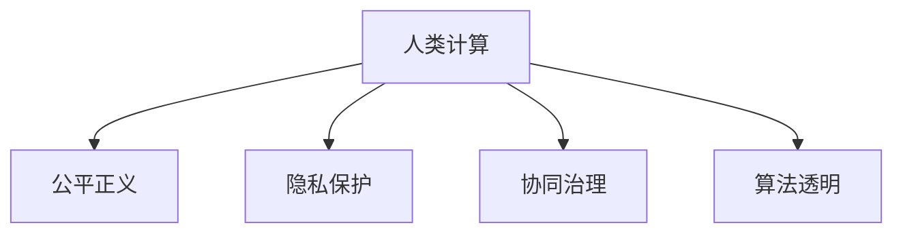

                 

## 1. 背景介绍

### 1.1 问题由来
在数字化时代，科技的快速发展在带来便利的同时，也带来了诸多挑战。科技在推动人类社会进步的同时，如何确保其向善发展，利用科技力量造福人类，成为一个重要的议题。人类计算，特别是通过人工智能、大数据等先进技术，可以赋能各种公共服务和社会治理，提升人们的生活质量和幸福感。本文将从科技向善的视角，探讨利用人类计算造福人类的方法和策略。

### 1.2 问题核心关键点
科技向善的核心在于将科技作为推动社会公平、正义和可持续发展的工具。具体到人类计算，其关键点包括：

- 数据驱动：利用大数据技术，洞察社会现象，揭示问题本质，制定科学的决策。
- 算法透明：确保算法透明和可解释性，避免算法偏见和歧视，保障决策公正。
- 隐私保护：在数据使用和算法设计中注重隐私保护，防止数据滥用和隐私泄露。
- 安全保障：构建安全可靠的系统，防止系统被攻击和滥用，确保社会稳定。
- 协同治理：通过技术手段，推动政府、企业、社区等多方协同治理，提升社会治理效能。

### 1.3 问题研究意义
探讨科技向善的实现路径，不仅有助于推动科技与社会责任的结合，还能提升科技的应用价值，促进社会的全面进步。具体而言：

- 推动公平正义：通过科技手段解决社会不公问题，提升弱势群体的福利和参与感。
- 促进可持续发展：利用科技手段提高资源利用效率，减少环境污染，推动绿色发展。
- 提升治理效能：通过大数据、人工智能等技术，提升政府和企业的决策效率和质量。
- 增强社会信任：通过透明和可解释的算法，增强公众对科技应用的信任和接受度。

## 2. 核心概念与联系

### 2.1 核心概念概述

为更好地理解科技向善的实现机制，本节将介绍几个密切相关的核心概念：

- **人类计算**：指利用先进计算技术，尤其是人工智能、大数据等技术，解决人类面临的复杂问题，提升社会治理和公共服务水平。
- **公平正义**：在科技应用中，确保不同群体获得平等的待遇和机会，避免算法偏见和歧视。
- **隐私保护**：在数据收集和处理中，确保用户隐私不受侵犯，防止数据滥用和隐私泄露。
- **协同治理**：通过技术手段，推动政府、企业、社区等多元主体协同治理，提升社会治理效能。
- **算法透明**：确保算法决策过程透明可解释，避免“黑箱”算法带来的不透明和不可控。

这些核心概念之间的逻辑关系可以通过以下Mermaid流程图来展示：



这个流程图展示了人类计算的核心概念及其之间的关系：

1. 人类计算通过先进技术解决社会问题，推动公平正义。
2. 在数据和算法应用中注重隐私保护。
3. 通过技术手段实现多方协同治理。
4. 确保算法决策过程透明可解释。

这些概念共同构成了人类计算向善发展的框架，使其能够在多个层面推动社会进步。

## 3. 核心算法原理 & 具体操作步骤
### 3.1 算法原理概述

科技向善的实现通常依赖于先进算法和技术的支持。其核心思想是：通过数据驱动、算法透明、隐私保护等原则，利用人类计算技术，实现公平正义和协同治理。

具体而言，人类计算向善的实现包括以下几个关键步骤：

1. **数据收集与预处理**：利用大数据技术，收集各类社会数据，包括人口统计、医疗健康、教育就业等，并进行数据清洗和预处理。
2. **算法设计**：根据社会问题，设计透明可解释的算法模型，如决策树、神经网络等，用于数据分析和决策。
3. **模型训练与优化**：在确保数据隐私和安全的前提下，利用标注数据训练模型，并通过交叉验证等方法优化模型性能。
4. **应用与评估**：将训练好的模型应用于社会治理和公共服务中，并通过实际效果评估模型效果和公平性。
5. **持续改进**：根据反馈信息，持续改进算法模型，确保其适应社会变化，提升治理效能。

### 3.2 算法步骤详解

以下是科技向善实现的主要操作步骤，以一个社会健康监测项目为例：

**Step 1: 数据收集与预处理**

1. **数据收集**：通过各类传感器、问卷调查、公共数据库等渠道，收集与健康相关的数据，如人口统计、医疗记录、环境指标等。
2. **数据清洗**：去除噪声数据，处理缺失值，确保数据质量和一致性。
3. **特征工程**：提取有意义的特征，如年龄、性别、居住环境等，为后续建模提供支持。

**Step 2: 算法设计**

1. **模型选择**：根据项目需求，选择合适的算法模型，如线性回归、随机森林、深度学习等。
2. **算法透明**：确保算法设计和实现过程透明可解释，避免“黑箱”算法带来的不透明和不可控。

**Step 3: 模型训练与优化**

1. **模型训练**：利用标注数据，训练模型，优化模型参数。
2. **交叉验证**：通过交叉验证，评估模型泛化能力，避免过拟合。
3. **调参优化**：根据验证结果，调整模型参数，确保模型效果最优。

**Step 4: 应用与评估**

1. **应用部署**：将训练好的模型集成到健康监测系统中，实时监测和预测健康风险。
2. **效果评估**：通过实际应用效果，评估模型性能和公平性，确保模型向善。

**Step 5: 持续改进**

1. **反馈机制**：建立反馈机制，收集用户和系统运行数据。
2. **模型更新**：根据反馈信息，持续更新模型，确保其适应社会变化。

### 3.3 算法优缺点

人类计算向善的实现方法具有以下优点：

- **高效性**：利用大数据和先进算法，可以高效处理和分析大规模数据，提升决策效率。
- **透明度**：确保算法透明可解释，增强用户信任和社会认可。
- **灵活性**：模型可以根据反馈信息进行动态调整，适应社会变化。

同时，该方法也存在以下局限性：

- **数据隐私**：在数据收集和处理中，需要严格保护用户隐私，防止数据滥用和泄露。
- **算法偏见**：如果数据和算法设计不当，可能会引入算法偏见，导致不公平问题。
- **资源依赖**：需要先进技术和大量资源支持，推广应用成本较高。

尽管存在这些局限性，但总体而言，人类计算向善的方法在提升社会治理效能和公平正义方面具有重要意义。

### 3.4 算法应用领域

人类计算向善的方法已经广泛应用于多个领域，如公共卫生、城市治理、环境保护等，具体如下：

- **公共卫生**：通过大数据分析，预测疾病传播趋势，制定科学的防控策略。
- **城市治理**：利用智能监控和数据分析，提升城市管理水平，如交通管制、公共安全等。
- **环境保护**：通过数据分析和建模，监测环境污染，制定环保政策。
- **社会福利**：利用数据分析，评估社会福利项目效果，优化资源分配。
- **灾害预警**：利用大数据和机器学习，预测自然灾害，提前采取预防措施。

## 4. 数学模型和公式 & 详细讲解 & 举例说明

### 4.1 数学模型构建

本节将使用数学语言对科技向善实现的主要步骤进行更加严格的刻画。

假设有一个社会健康监测项目，其目标是根据用户的历史健康数据，预测未来健康风险。模型的输入为历史健康数据 $X$，输出为未来健康风险 $Y$。模型的目标是最大化预测准确率 $L(Y,\hat{Y})$。

### 4.2 公式推导过程

以线性回归模型为例，其数学模型为：

$$
\hat{Y} = \beta_0 + \beta_1 X_1 + \beta_2 X_2 + \cdots + \beta_n X_n
$$

其中 $\beta_0, \beta_1, \cdots, \beta_n$ 为模型参数，$X_1, X_2, \cdots, X_n$ 为输入特征。

模型的损失函数为：

$$
L(Y,\hat{Y}) = \frac{1}{N} \sum_{i=1}^N (Y_i - \hat{Y}_i)^2
$$

其中 $N$ 为样本数量，$Y_i$ 为真实标签，$\hat{Y}_i$ 为模型预测值。

通过最小化损失函数，求解模型参数：

$$
\hat{\beta} = \mathop{\arg\min}_{\beta} L(Y,\hat{Y})
$$

常用的求解方法包括梯度下降法、最小二乘法等。

### 4.3 案例分析与讲解

以一个社会福利项目为例，该项目旨在通过数据分析，优化社会福利资源的分配，提升贫困人口的生活质量。

- **数据收集**：收集贫困人口的收入、教育、健康等数据。
- **数据清洗**：去除噪声数据，处理缺失值。
- **特征工程**：提取有意义的特征，如收入水平、教育程度、健康状况等。
- **模型选择**：选择线性回归模型，用于预测贫困人口的生活质量。
- **模型训练**：利用标注数据，训练模型，优化模型参数。
- **模型评估**：通过实际应用效果，评估模型性能和公平性，确保模型向善。

## 5. 项目实践：代码实例和详细解释说明

### 5.1 开发环境搭建

在进行科技向善项目开发前，我们需要准备好开发环境。以下是使用Python进行TensorFlow开发的环境配置流程：

1. 安装Anaconda：从官网下载并安装Anaconda，用于创建独立的Python环境。

2. 创建并激活虚拟环境：
```bash
conda create -n tf-env python=3.8 
conda activate tf-env
```

3. 安装TensorFlow：根据CUDA版本，从官网获取对应的安装命令。例如：
```bash
conda install tensorflow -c conda-forge -c pypi
```

4. 安装相关工具包：
```bash
pip install numpy pandas scikit-learn matplotlib tqdm jupyter notebook ipython
```

完成上述步骤后，即可在`tf-env`环境中开始科技向善项目的开发。

### 5.2 源代码详细实现

这里我们以社会健康监测项目为例，给出使用TensorFlow进行线性回归模型的PyTorch代码实现。

首先，定义数据处理函数：

```python
import tensorflow as tf
from tensorflow.keras.datasets import boston_housing

def load_data():
    (train_X, train_Y), (test_X, test_Y) = boston_housing.load_data()
    train_X = train_X / 10.0
    test_X = test_X / 10.0
    return (train_X, train_Y), (test_X, test_Y)
```

然后，定义模型和优化器：

```python
from tensorflow.keras.models import Sequential
from tensorflow.keras.layers import Dense
from tensorflow.keras.optimizers import Adam

def build_model(input_dim):
    model = Sequential()
    model.add(Dense(64, activation='relu', input_dim=input_dim))
    model.add(Dense(64, activation='relu'))
    model.add(Dense(1))
    return model

model = build_model(input_dim=13)
optimizer = Adam(lr=0.001)
```

接着，定义训练和评估函数：

```python
def train_model(model, train_X, train_Y, epochs=10, batch_size=32):
    model.compile(optimizer=optimizer, loss='mse', metrics=['mae'])
    model.fit(train_X, train_Y, epochs=epochs, batch_size=batch_size, validation_split=0.2)
    return model

def evaluate_model(model, test_X, test_Y):
    loss, mae = model.evaluate(test_X, test_Y)
    return loss, mae
```

最后，启动训练流程并在测试集上评估：

```python
(train_X, train_Y), (test_X, test_Y) = load_data()

train_model(model, train_X, train_Y)

loss, mae = evaluate_model(model, test_X, test_Y)
print(f"Mean Absolute Error: {mae:.2f}")
```

以上就是使用TensorFlow进行线性回归模型训练的完整代码实现。可以看到，通过TensorFlow的高级API，模型的定义、训练和评估变得简洁高效。

### 5.3 代码解读与分析

让我们再详细解读一下关键代码的实现细节：

**load_data函数**：
- 加载Boston Housing数据集，并进行数据标准化处理。

**build_model函数**：
- 定义模型架构，包括输入层、隐藏层和输出层，使用ReLU激活函数和Adam优化器。

**train_model函数**：
- 编译模型，指定损失函数和评估指标。
- 使用fit方法进行模型训练，指定训练轮数和批大小。
- 使用validation_split参数进行数据划分，确保训练集和验证集的比例。

**evaluate_model函数**：
- 使用evaluate方法评估模型在测试集上的表现，返回均方误差和平均绝对误差。

**训练流程**：
- 加载数据集，启动模型训练。
- 在训练集上训练模型，输出训练结果。
- 在测试集上评估模型性能，输出均方误差。

可以看到，TensorFlow提供了丰富的高级API，使得模型训练和评估的代码实现变得简洁高效。开发者可以将更多精力放在模型改进和应用优化上，而不必过多关注底层的实现细节。

当然，工业级的系统实现还需考虑更多因素，如模型的保存和部署、超参数的自动搜索、更多的正则化技术等。但核心的科技向善方法基本与此类似。

## 6. 实际应用场景
### 6.1 社会健康监测

科技向善在社会健康监测中的应用，可以通过大数据分析和模型预测，实时监测和预测健康风险，制定科学的防控策略。

在技术实现上，可以收集社会健康相关的各类数据，如人口统计、医疗记录、环境指标等。通过数据清洗和特征工程，构建数据集。然后，设计透明可解释的算法模型，如线性回归、随机森林等，用于数据分析和决策。在模型训练和优化过程中，注重数据隐私和安全保护。最后，将训练好的模型应用于社会健康监测系统，实时监测和预测健康风险。

### 6.2 城市交通管理

科技向善在城市交通管理中的应用，可以通过智能监控和数据分析，提升城市管理水平，如交通管制、公共安全等。

在技术实现上，可以收集交通流量、事故记录、天气等数据。通过数据清洗和特征工程，构建数据集。然后，设计透明可解释的算法模型，如深度学习、强化学习等，用于交通流量预测和事故风险评估。在模型训练和优化过程中，注重数据隐私和安全保护。最后，将训练好的模型应用于城市交通管理系统，实时监测和预测交通状况，优化交通管理策略。

### 6.3 环境保护

科技向善在环境保护中的应用，可以通过数据分析和建模，监测环境污染，制定环保政策。

在技术实现上，可以收集各类环境监测数据，如空气质量、水质、噪音等。通过数据清洗和特征工程，构建数据集。然后，设计透明可解释的算法模型，如回归模型、时间序列模型等，用于环境污染预测和风险评估。在模型训练和优化过程中，注重数据隐私和安全保护。最后，将训练好的模型应用于环境保护系统，实时监测和预测环境污染，制定环保政策。

### 6.4 未来应用展望

随着科技向善的方法不断发展和应用，未来在更多领域将迎来新的突破。

在智慧医疗领域，通过科技向善的实现路径，利用大数据和先进技术，提升医疗服务的智能化水平，辅助医生诊疗，加速新药开发进程。

在智能教育领域，科技向善的应用可以推动因材施教，促进教育公平，提高教学质量。

在智慧城市治理中，科技向善的实现手段将提升城市管理的自动化和智能化水平，构建更安全、高效的未来城市。

此外，在企业生产、社会治理、文娱传媒等众多领域，科技向善的应用也将不断涌现，为传统行业数字化转型升级提供新的技术路径。相信随着技术的日益成熟，科技向善的方法将成为推动社会进步的重要手段。

## 7. 工具和资源推荐
### 7.1 学习资源推荐

为了帮助开发者系统掌握科技向善的理论基础和实践技巧，这里推荐一些优质的学习资源：

1. **《人类计算与社会治理》系列博文**：由科技向善领域的专家撰写，深入浅出地介绍了人类计算和科技向善的理论基础和实践方法。

2. **Coursera《数据科学与社会治理》课程**：由知名大学开设的在线课程，涵盖大数据、人工智能在社会治理中的应用，帮助你掌握相关技术和方法。

3. **《社会计算与人工智能》书籍**：系统介绍大数据、人工智能在社会治理中的应用，涵盖数据驱动、算法透明、隐私保护等多个方面。

4. **OpenAI官方文档**：提供丰富的社会治理和大数据应用案例，展示科技向善的实际应用效果。

5. **HuggingFace官方文档**：提供先进的自然语言处理技术和工具，支持科技向善应用中的文本分析和建模。

通过对这些资源的学习实践，相信你一定能够快速掌握科技向善的精髓，并用于解决实际的公共服务和社会治理问题。

### 7.2 开发工具推荐

高效的开发离不开优秀的工具支持。以下是几款用于科技向善开发的常用工具：

1. **TensorFlow**：开源深度学习框架，生产部署方便，适合大规模工程应用。

2. **PyTorch**：基于Python的开源深度学习框架，灵活动态的计算图，适合快速迭代研究。

3. **Jupyter Notebook**：开源的交互式计算环境，支持多种编程语言和数据处理库，方便研究和开发。

4. **Weights & Biases**：模型训练的实验跟踪工具，可以记录和可视化模型训练过程中的各项指标，方便对比和调优。

5. **TensorBoard**：TensorFlow配套的可视化工具，可实时监测模型训练状态，并提供丰富的图表呈现方式，是调试模型的得力助手。

合理利用这些工具，可以显著提升科技向善项目的开发效率，加快创新迭代的步伐。

### 7.3 相关论文推荐

科技向善的发展源于学界的持续研究。以下是几篇奠基性的相关论文，推荐阅读：

1. **《社会计算：大数据在社会治理中的应用》**：介绍大数据在社会治理中的应用，强调数据驱动和社会公平的重要性。

2. **《算法透明：提升人工智能系统可信度的策略》**：探讨算法透明和可解释性，如何确保人工智能系统的公平性和可信度。

3. **《数据隐私保护技术》**：综述数据隐私保护技术，探讨在科技向善应用中如何保护用户隐私。

4. **《协同治理：多主体协同的社会治理模型》**：研究多主体协同治理的模型和算法，提升社会治理效能。

5. **《科技向善：人工智能与社会发展》**：探讨人工智能在社会发展中的应用，强调科技向善的实现路径。

这些论文代表了大规模计算技术在社会治理中的应用前景，通过学习这些前沿成果，可以帮助研究者把握学科前进方向，激发更多的创新灵感。

## 8. 总结：未来发展趋势与挑战
### 8.1 总结

本文对科技向善的实现路径进行了全面系统的介绍。首先阐述了科技向善的背景和意义，明确了人类计算在推动社会进步和公平正义方面的独特价值。其次，从原理到实践，详细讲解了科技向善的数学模型和关键步骤，给出了科技向善项目开发的完整代码实例。同时，本文还广泛探讨了科技向善方法在社会健康监测、城市交通管理、环境保护等多个领域的应用前景，展示了科技向善范式的巨大潜力。此外，本文精选了科技向善技术的各类学习资源，力求为读者提供全方位的技术指引。

通过本文的系统梳理，可以看到，科技向善在提升社会治理效能和公平正义方面具有重要意义。人类计算技术通过大数据和先进算法，可以在多个层面推动社会进步，构建更加公平、正义、可持续的未来。未来，伴随科技向善方法的持续演进，相信科技在推动社会进步方面将发挥更大的作用，为人类社会带来更多的福祉。

### 8.2 未来发展趋势

展望未来，科技向善的方法将呈现以下几个发展趋势：

1. **数据驱动决策**：大数据技术的不断成熟，将使科技向善应用更加依赖数据驱动决策，提升决策的科学性和精准性。

2. **算法透明和可信**：随着人工智能技术的发展，透明可解释的算法将成为科技向善的重要组成部分，确保算法的公平性和可信度。

3. **隐私保护技术**：在数据使用和算法设计中，隐私保护技术将得到更广泛的应用，保障用户隐私不受侵犯。

4. **多主体协同治理**：通过技术手段，推动政府、企业、社区等多方协同治理，提升社会治理效能。

5. **智能决策支持**：利用人工智能技术，提升社会决策的智能化水平，如智能预警、智能推荐等。

6. **跨领域融合**：科技向善将与区块链、物联网等技术结合，推动更多领域的创新应用。

以上趋势凸显了科技向善的广阔前景。这些方向的探索发展，必将进一步提升科技向善的应用价值，推动社会的全面进步。

### 8.3 面临的挑战

尽管科技向善技术已经取得了瞩目成就，但在迈向更加智能化、普适化应用的过程中，它仍面临诸多挑战：

1. **数据隐私**：在数据收集和处理中，需要严格保护用户隐私，防止数据滥用和泄露。

2. **算法偏见**：如果数据和算法设计不当，可能会引入算法偏见，导致不公平问题。

3. **资源依赖**：需要先进技术和大量资源支持，推广应用成本较高。

4. **模型复杂性**：大规模模型和高精度需求使得模型复杂度增加，部署和维护难度加大。

5. **可信性**：如何确保科技向善应用的透明性和可信度，避免误导和滥用。

6. **社会接受度**：如何提高公众对科技向善应用的接受度，增强信任和参与感。

尽管存在这些挑战，但总体而言，科技向善的方法在提升社会治理效能和公平正义方面具有重要意义。

### 8.4 研究展望

面对科技向善面临的这些挑战，未来的研究需要在以下几个方面寻求新的突破：

1. **数据隐私保护技术**：研究更加高效和安全的隐私保护方法，确保数据使用和处理过程中的隐私安全。

2. **算法透明和可信**：开发透明可解释的算法，确保算法决策过程的透明性和可信度。

3. **跨领域融合技术**：探索跨领域融合方法，如大数据与人工智能、区块链与物联网等，推动更多领域的创新应用。

4. **多主体协同治理模型**：研究多主体协同治理的模型和算法，提升社会治理效能。

5. **智能决策支持系统**：开发智能决策支持系统，利用人工智能技术提升社会决策的智能化水平。

这些研究方向的探索，必将引领科技向善技术迈向更高的台阶，为构建公平、正义、可持续的社会提供新的技术路径。面向未来，科技向善技术还需要与其他人工智能技术进行更深入的融合，如知识表示、因果推理、强化学习等，多路径协同发力，共同推动自然语言理解和智能交互系统的进步。只有勇于创新、敢于突破，才能不断拓展科技向善的边界，让科技更好地造福人类社会。

## 9. 附录：常见问题与解答
### Q1：数据隐私如何保障？

A: 数据隐私保护是科技向善应用中至关重要的一环。以下是几种常见的数据隐私保护技术：

1. **差分隐私**：在数据收集和处理过程中，通过添加噪声、扰动等手段，防止数据泄露。

2. **联邦学习**：多模型联合训练，数据在本地处理，不集中存储，保护数据隐私。

3. **同态加密**：对数据进行加密处理，使其在加密状态下可以进行计算，保护数据隐私。

4. **多方安全计算**：多个参与方在不共享数据的前提下，共同计算结果，保护数据隐私。

5. **匿名化处理**：通过数据匿名化处理，去除个人标识信息，保护用户隐私。

通过这些技术手段，可以在科技向善应用中有效保障数据隐私，防止数据滥用和泄露。

### Q2：如何应对算法偏见？

A: 算法偏见是科技向善应用中需要特别关注的问题。以下是几种应对算法偏见的方法：

1. **数据集多样化**：在数据集构建过程中，尽量涵盖不同群体和场景，防止数据偏见。

2. **公平性指标**：在模型评估过程中，引入公平性指标，如等组差异、机会均等等，评估模型公平性。

3. **算法透明**：确保算法设计和实现过程透明可解释，便于发现和纠正算法偏见。

4. **多模型融合**：通过多个模型融合，提升模型的泛化能力和公平性。

5. **持续监控和调整**：建立持续监控机制，及时发现和调整模型中的偏见。

通过这些方法，可以有效应对算法偏见，确保科技向善应用的公平性和公正性。

### Q3：如何确保模型的可信度？

A: 模型的可信度是科技向善应用中的关键问题。以下是几种确保模型可信度的方法：

1. **算法透明**：确保算法设计和实现过程透明可解释，便于发现和纠正算法问题。

2. **多模型验证**：通过多个模型验证结果的一致性，提升模型可信度。

3. **用户反馈**：建立用户反馈机制，及时收集用户意见和反馈，优化模型性能。

4. **模型解释**：利用可解释性技术，提供模型决策的解释，增强用户信任。

5. **模型评估**：通过独立第三方评估，确保模型性能和公平性。

通过这些方法，可以有效确保科技向善应用的可信度，提升用户信任和接受度。

### Q4：科技向善在实际应用中面临哪些挑战？

A: 科技向善在实际应用中面临以下挑战：

1. **数据隐私**：在数据收集和处理中，需要严格保护用户隐私，防止数据滥用和泄露。

2. **算法偏见**：如果数据和算法设计不当，可能会引入算法偏见，导致不公平问题。

3. **资源依赖**：需要先进技术和大量资源支持，推广应用成本较高。

4. **模型复杂性**：大规模模型和高精度需求使得模型复杂度增加，部署和维护难度加大。

5. **可信性**：如何确保科技向善应用的透明性和可信度，避免误导和滥用。

6. **社会接受度**：如何提高公众对科技向善应用的接受度，增强信任和参与感。

尽管存在这些挑战，但总体而言，科技向善的方法在提升社会治理效能和公平正义方面具有重要意义。

---

作者：禅与计算机程序设计艺术 / Zen and the Art of Computer Programming

