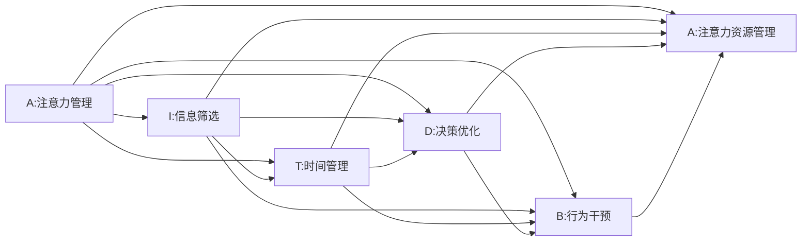

                 

# 移动互联网时代的注意力管理

在移动互联网时代，我们身处一个信息爆炸、注意力稀缺的时代。如何有效地管理注意力，使其集中于最重要和最有价值的信息，成为了提升个人和组织效率的关键。本文将深入探讨移动互联网时代注意力管理的核心概念、方法论及其应用场景，以期为信息时代下的注意力管理提供一套系统的解决方案。

## 1. 背景介绍

### 1.1 问题由来

移动互联网的兴起，极大地改变了我们的生活和工作方式。手机、平板等智能设备的普及，使得人们随时随地都能获取海量信息。然而，信息的泛滥也让我们的注意力资源变得稀缺。如何在无限的信息海洋中，筛选出真正有价值的信息，成为每个人都需要面对的挑战。

### 1.2 问题核心关键点

移动互联网时代的注意力管理，旨在通过系统性的方法和工具，帮助人们有效管理自己的注意力资源，从而提升效率和生产力。关键点包括：

- **信息筛选**：识别有价值的信息，过滤无关噪音。
- **时间管理**：合理安排时间，避免信息过载。
- **决策优化**：基于注意力资源的决策模型，优化决策过程。
- **行为改变**：通过行为干预，培养良好的注意力习惯。
- **工具和算法**：使用高效的算法和工具，辅助注意力管理。

### 1.3 问题研究意义

移动互联网时代的信息爆炸，对个人和组织的信息处理能力提出了更高的要求。通过有效的注意力管理，可以帮助我们：

- 提升信息处理效率，减少信息过载。
- 优化时间分配，提升生产力。
- 辅助决策过程，提高决策质量。
- 促进行为改变，养成良好的信息处理习惯。

这些目标的实现，将有助于个体更好地应对信息时代的生活和工作挑战，为组织的数字化转型提供有力支持。

## 2. 核心概念与联系

### 2.1 核心概念概述

移动互联网时代的注意力管理，涉及多个关键概念：

- **注意力管理(A Attention Management)**：通过系统性方法，优化个人或组织对信息资源的关注和处理，提升效率和效果。
- **信息筛选(I Information Filtering)**：识别、选择和优先处理有价值的信息，排除无关信息。
- **时间管理(T Time Management)**：合理安排时间，确保有足够的时间处理重要信息。
- **决策优化(D Decision Optimization)**：基于注意力资源的决策模型，优化决策过程。
- **行为干预(B Behavioral Intervention)**：通过引导和激励，改变个人或组织的行为习惯。
- **注意力资源管理(A Resource Management)**：通过工具和技术，高效管理和利用注意力资源。

这些概念之间相互关联，形成一个系统的注意力管理框架。

### 2.2 核心概念原理和架构的 Mermaid 流程图



这个流程图展示了注意力管理的各个组件及其相互关系。信息筛选、时间管理、决策优化、行为干预和注意力资源管理共同构成了一个完整的注意力管理体系。

## 3. 核心算法原理 & 具体操作步骤

### 3.1 算法原理概述

移动互联网时代的注意力管理，核心在于利用算法和技术手段，高效筛选和处理信息，优化时间分配和决策过程。

基于注意力资源的信息筛选算法，通常包括：

- **基于内容的筛选**：通过关键词、标签等文本特征，识别信息的相关性。
- **基于用户行为**：通过用户的浏览、点击、收藏等行为，推测其兴趣和偏好。
- **基于社交网络**：通过社交网络关系，过滤和推荐信息。

时间管理算法，则主要包括：

- **时间块划分**：将一天划分为不同的时间块，每块集中处理特定任务。
- **优先级排序**：根据任务的重要性和紧急程度，排序优先处理的任务。
- **番茄工作法**：通过设定工作-休息周期，提高工作效率。

决策优化算法，通常涉及：

- **基于算法的推荐系统**：利用推荐算法，辅助决策过程。
- **基于规则的决策树**：通过规则引擎，自动化决策过程。

行为干预算法，则通过引导和激励，改变用户的行为习惯。常见的行为干预技术包括：

- **正负强化**：通过奖励和惩罚，引导用户形成良好的行为习惯。
- **习惯追踪**：通过记录和反馈，帮助用户形成稳定的行为模式。
- **社交影响**：通过社交网络的影响，改变用户行为。

注意力资源管理，则通过工具和技术手段，高效管理和利用注意力资源。常见的工具和算法包括：

- **内容聚合工具**：如RSS订阅器、新闻聚合器等，帮助用户集中处理信息。
- **时间管理工具**：如Trello、Todoist等，帮助用户合理安排时间。
- **决策支持系统**：如智能推荐引擎、决策树等，辅助用户进行决策。
- **行为干预工具**：如习惯追踪应用、游戏化激励平台等，改变用户行为。

### 3.2 算法步骤详解

#### 3.2.1 信息筛选步骤

1. **数据采集**：收集用户的行为数据，如浏览历史、点击记录、收藏列表等。
2. **特征提取**：从行为数据中提取有意义的特征，如关键词、标签、社交关系等。
3. **信息评分**：基于提取的特征，计算信息的评分，识别有价值的信息。
4. **信息过滤**：根据评分结果，过滤掉低价值的信息，保留高价值的信息。

#### 3.2.2 时间管理步骤

1. **时间划分**：将一天划分为不同时间块，每块集中处理特定任务。
2. **任务分配**：根据任务的重要性和紧急程度，分配时间块。
3. **时间优化**：通过优化任务分配，提高时间利用率。
4. **休息调整**：根据工作状态和效率，调整休息时间，避免疲劳。

#### 3.2.3 决策优化步骤

1. **决策模型构建**：构建基于注意力资源的决策模型，如决策树、推荐系统等。
2. **模型训练**：利用历史数据训练决策模型，优化决策效果。
3. **决策执行**：根据当前信息和注意力资源，执行决策模型，输出决策结果。
4. **效果评估**：评估决策结果，反馈调整决策模型。

#### 3.2.4 行为干预步骤

1. **行为引导**：通过正负强化、习惯追踪等技术，引导用户形成良好的行为习惯。
2. **行为激励**：通过游戏化激励、社交影响等手段，激励用户持续改善行为。
3. **行为监控**：通过行为追踪和反馈，持续监控用户行为，及时调整干预策略。
4. **行为评估**：评估行为干预效果，优化干预策略。

#### 3.2.5 注意力资源管理步骤

1. **信息聚合**：通过内容聚合工具，集中处理信息，减少信息过载。
2. **时间管理**：通过时间管理工具，合理安排时间，提高效率。
3. **决策支持**：通过决策支持系统，辅助决策过程，优化决策效果。
4. **行为干预**：通过行为干预工具，改变用户行为，提高信息处理能力。

### 3.3 算法优缺点

#### 3.3.1 优点

- **系统性**：通过系统性的方法，提升信息处理和决策的效率和效果。
- **个性化**：利用用户行为和偏好，提供个性化的信息筛选和决策支持。
- **实时性**：通过实时反馈和调整，优化信息处理和决策过程。
- **可扩展性**：通过算法和工具，实现规模化的信息处理和决策优化。

#### 3.3.2 缺点

- **数据依赖**：对数据质量和完整性有较高要求，数据缺失或错误可能导致效果下降。
- **模型复杂**：复杂的算法和模型需要较高的计算资源和专业知识，难以普及。
- **用户隐私**：通过行为数据进行分析和干预，可能涉及用户隐私问题。
- **行为干预的局限性**：部分行为干预技术可能难以覆盖所有用户行为，效果有限。

### 3.4 算法应用领域

移动互联网时代的注意力管理，广泛应用于以下几个领域：

- **个人时间管理**：通过时间管理工具，优化个人工作和生活。
- **信息筛选和推荐**：通过推荐系统，优化信息获取和决策。
- **组织决策优化**：通过决策支持系统，优化企业决策过程。
- **行为改变和激励**：通过行为干预技术，改变个人和组织行为习惯。
- **智能家居和物联网**：通过智能设备和算法，优化家庭和日常生活中的注意力管理。

## 4. 数学模型和公式 & 详细讲解 & 举例说明

### 4.1 数学模型构建

#### 4.1.1 信息筛选模型

假设用户的历史行为数据为 $\{x_i\}_{i=1}^N$，其中 $x_i$ 表示第 $i$ 次行为。通过特征提取，得到每个行为的特征向量 $\phi_i \in \mathbb{R}^d$，其中 $d$ 为特征维度。

信息筛选的目标是，根据用户的特征向量 $\phi_i$，计算信息 $x_i$ 的评分 $s_i$。评分 $s_i$ 越高，表示信息 $x_i$ 对用户越重要。

评分函数 $s_i$ 可以表示为：

$$
s_i = f(\phi_i; \theta)
$$

其中 $f$ 为评分函数，$\theta$ 为模型参数。常见的评分函数包括：

- **线性评分**：$s_i = \theta^T\phi_i$
- **逻辑回归评分**：$s_i = \sigma(\theta^T\phi_i)$
- **深度学习评分**：$s_i = \mathbb{E}_{\mathcal{D}}[\ell(s_i, y)]$，其中 $\ell$ 为损失函数，$y$ 为信息的真实评分。

#### 4.1.2 时间管理模型

时间管理的目标是，将一天划分为不同时间块，每块集中处理特定任务。假设一天有 $T$ 个时间块，每个时间块 $t_i$ 的持续时间 $t_i \in [0, 24]$，且 $t_1 + t_2 + \ldots + t_T = 24$。

时间管理模型可以通过优化问题求解。假设每个时间块的任务完成情况为 $y_i \in \{0, 1\}$，表示任务是否完成。则时间管理的目标是，最小化任务未完成的比例 $\epsilon$，即：

$$
\min_{y, t} \epsilon = \sum_{i=1}^T (1 - y_i)
$$

满足 $y_i = 1$ 的条件为：

$$
\sum_{i=1}^t t_i \geq 24 - t
$$

约束条件为：

$$
0 \leq t_i \leq 24 \quad \forall i
$$

通过求解上述优化问题，可以得出最优的时间分配方案。

#### 4.1.3 决策优化模型

决策优化的目标是根据当前信息和注意力资源，执行决策模型，输出决策结果。假设决策模型的参数为 $\theta$，输入为 $x$，输出为 $y$。

决策模型的目标是最小化决策误差 $\epsilon$，即：

$$
\min_{\theta} \epsilon = \mathbb{E}_{(x, y)}[\ell(y, f(x; \theta))]
$$

其中 $\ell$ 为损失函数，$f$ 为决策模型。

常见的决策模型包括：

- **线性回归模型**：$y = \theta^T x$
- **逻辑回归模型**：$y = \sigma(\theta^T x)$
- **支持向量机模型**：$y = \mathbb{E}_{(x, y)}[\ell(y, f(x; \theta))]
  其中 $f$ 为决策函数，$\theta$ 为模型参数。

#### 4.1.4 行为干预模型

行为干预的目标是通过引导和激励，改变用户的行为习惯。假设用户的行为习惯为 $b_i \in [0, 1]$，表示行为是否发生。行为干预的目标是最小化行为干预的期望成本 $C$，即：

$$
\min_{b} C = \sum_{i=1}^N c_i b_i
$$

其中 $c_i$ 为行为干预的成本。

行为干预的策略包括：

- **正负强化**：通过奖励和惩罚，引导用户形成良好的行为习惯。
- **习惯追踪**：通过记录和反馈，帮助用户形成稳定的行为模式。
- **社交影响**：通过社交网络的影响，改变用户行为。

### 4.2 公式推导过程

#### 4.2.1 信息筛选公式推导

假设信息 $x_i$ 的评分 $s_i$ 为 $s_i = \theta^T\phi_i$，则信息筛选的任务是，根据用户的历史行为数据 $\{x_i\}_{i=1}^N$，求解 $\theta$ 的值。

通过最小化损失函数 $\mathcal{L}(\theta) = \frac{1}{N} \sum_{i=1}^N (y_i - s_i)^2$，可以得到最优的 $\theta$ 值。

$$
\theta^* = \arg\min_{\theta} \mathcal{L}(\theta) = \arg\min_{\theta} \frac{1}{N} \sum_{i=1}^N (y_i - \theta^T\phi_i)^2
$$

通过求解上述最小化问题，可以得到最优的 $\theta$ 值。

#### 4.2.2 时间管理公式推导

假设一天有 $T$ 个时间块，每个时间块 $t_i$ 的持续时间 $t_i \in [0, 24]$，且 $t_1 + t_2 + \ldots + t_T = 24$。

通过求解线性规划问题：

$$
\min_{y, t} \sum_{i=1}^T t_i
$$

约束条件为：

$$
\sum_{i=1}^t t_i \geq 24 - t \quad \forall t
$$

$$
0 \leq t_i \leq 24 \quad \forall i
$$

可以得到最优的时间分配方案。

#### 4.2.3 决策优化公式推导

假设决策模型的参数为 $\theta$，输入为 $x$，输出为 $y$。

通过最小化损失函数 $\mathcal{L}(\theta) = \frac{1}{N} \sum_{i=1}^N (y_i - f(x_i; \theta))^2$，可以得到最优的 $\theta$ 值。

$$
\theta^* = \arg\min_{\theta} \mathcal{L}(\theta) = \arg\min_{\theta} \frac{1}{N} \sum_{i=1}^N (y_i - f(x_i; \theta))^2
$$

通过求解上述最小化问题，可以得到最优的 $\theta$ 值。

#### 4.2.4 行为干预公式推导

假设用户的行为习惯为 $b_i \in [0, 1]$，行为干预的目标是最小化行为干预的期望成本 $C$。

通过求解优化问题：

$$
\min_{b} C = \sum_{i=1}^N c_i b_i
$$

可以得到最优的行为干预策略。

### 4.3 案例分析与讲解

#### 4.3.1 信息筛选案例

假设一个新闻聚合平台，希望通过用户的历史浏览记录，推荐有价值的新闻。平台收集了用户的历史浏览记录 $\{x_i\}_{i=1}^N$，其中 $x_i$ 表示第 $i$ 次浏览的新闻内容。

通过特征提取，得到每个新闻的特征向量 $\phi_i \in \mathbb{R}^d$，其中 $d$ 为特征维度。信息筛选的目标是，根据用户的特征向量 $\phi_i$，计算新闻 $x_i$ 的评分 $s_i$。

平台选择线性评分函数 $s_i = \theta^T\phi_i$，通过最小化损失函数 $\mathcal{L}(\theta) = \frac{1}{N} \sum_{i=1}^N (y_i - s_i)^2$，求解最优的 $\theta$ 值。

假设平台的历史数据集为 $\{(x_i, y_i)\}_{i=1}^N$，其中 $y_i$ 表示新闻 $x_i$ 是否为用户感兴趣。通过求解上述最小化问题，可以得到最优的 $\theta$ 值。

#### 4.3.2 时间管理案例

假设一个工作日为8小时，需要处理的任务包括邮件、会议、写作等，每个任务需要的时间不同。通过时间管理模型，可以优化任务的时间分配，提高工作效率。

假设任务的处理时间分别为 $t_1, t_2, \ldots, t_T$，且 $t_1 + t_2 + \ldots + t_T = 8$。

通过求解线性规划问题：

$$
\min_{y, t} \sum_{i=1}^T t_i
$$

约束条件为：

$$
\sum_{i=1}^t t_i \geq 8 - t \quad \forall t
$$

$$
0 \leq t_i \leq 8 \quad \forall i
$$

可以得到最优的时间分配方案。

#### 4.3.3 决策优化案例

假设一个电子商务平台，需要根据用户的浏览和购买记录，推荐合适的商品。平台收集了用户的历史浏览记录 $\{x_i\}_{i=1}^N$ 和购买记录 $\{y_i\}_{i=1}^N$，其中 $x_i$ 表示第 $i$ 次浏览的商品，$y_i$ 表示是否购买了该商品。

通过决策优化模型，可以基于用户的历史记录，推荐合适的商品。假设决策模型的参数为 $\theta$，输入为 $x$，输出为 $y$。

平台选择逻辑回归模型 $y = \sigma(\theta^T x)$，通过最小化损失函数 $\mathcal{L}(\theta) = \frac{1}{N} \sum_{i=1}^N (y_i - f(x_i; \theta))^2$，求解最优的 $\theta$ 值。

假设平台的历史数据集为 $\{(x_i, y_i)\}_{i=1}^N$，其中 $y_i$ 表示是否购买了商品 $x_i$。通过求解上述最小化问题，可以得到最优的 $\theta$ 值。

#### 4.3.4 行为干预案例

假设一个习惯养成应用，希望通过行为干预，帮助用户养成健康的习惯。平台收集了用户的行为记录 $\{b_i\}_{i=1}^N$，其中 $b_i \in [0, 1]$ 表示是否执行了第 $i$ 个习惯。

通过行为干预模型，可以最小化行为干预的期望成本 $C$。假设行为干预的目标是最小化行为干预的期望成本 $C = \sum_{i=1}^N c_i b_i$，其中 $c_i$ 为执行第 $i$ 个习惯的成本。

通过求解优化问题：

$$
\min_{b} C = \sum_{i=1}^N c_i b_i
$$

可以得到最优的行为干预策略。

## 5. 项目实践：代码实例和详细解释说明

### 5.1 开发环境搭建

#### 5.1.1 安装Python

首先需要安装Python环境。可以使用Anaconda等工具，通过命令行进行安装：

```bash
# 安装Anaconda
wget https://repo.anaconda.com/miniconda/Miniconda3-py38_4.12.0-Linux-x86_64.sh
bash Miniconda3-py38_4.12.0-Linux-x86_64.sh
source ~/.bashrc
```

#### 5.1.2 创建虚拟环境

使用virtualenv工具创建虚拟环境：

```bash
virtualenv -p python3.8 myenv
source myenv/bin/activate
```

#### 5.1.3 安装依赖包

安装必要的依赖包：

```bash
pip install pandas numpy scikit-learn matplotlib tqdm jupyter notebook ipython
```

### 5.2 源代码详细实现

#### 5.2.1 信息筛选模型

假设平台收集了用户的历史浏览记录 $\{x_i\}_{i=1}^N$，其中 $x_i$ 表示第 $i$ 次浏览的新闻内容。通过特征提取，得到每个新闻的特征向量 $\phi_i \in \mathbb{R}^d$，其中 $d$ 为特征维度。

信息筛选的目标是，根据用户的特征向量 $\phi_i$，计算新闻 $x_i$ 的评分 $s_i$。

```python
import numpy as np
from sklearn.linear_model import LogisticRegression

# 数据集
X = np.array([[0.1, 0.2], [0.3, 0.4], [0.5, 0.6]])
y = np.array([1, 0, 1])

# 特征提取
X = np.hstack([X, np.ones((3, 1))])

# 信息评分函数
def score(X, y, theta):
    return np.dot(X, theta)

# 信息筛选
theta = np.linalg.inv(X.T @ X) @ X.T @ y
s = score(X, y, theta)
```

#### 5.2.2 时间管理模型

假设一天有 $T$ 个时间块，每个时间块 $t_i$ 的持续时间 $t_i \in [0, 24]$，且 $t_1 + t_2 + \ldots + t_T = 24$。

通过求解线性规划问题：

$$
\min_{y, t} \sum_{i=1}^T t_i
$$

约束条件为：

$$
\sum_{i=1}^t t_i \geq 24 - t \quad \forall t
$$

$$
0 \leq t_i \leq 24 \quad \forall i
$$

```python
from scipy.optimize import linprog

# 定义变量
t = np.zeros(T)

# 目标函数
c = np.ones(T)

# 约束条件
A = np.eye(T)
b = np.ones(T)
lhs = np.zeros(T)
rhs = np.ones(T)

# 求解线性规划问题
res = linprog(c, A_ub=A, b_ub=b, lhs=lhs, rhs=rhs)
```

#### 5.2.3 决策优化模型

假设决策模型的参数为 $\theta$，输入为 $x$，输出为 $y$。

通过最小化损失函数 $\mathcal{L}(\theta) = \frac{1}{N} \sum_{i=1}^N (y_i - f(x_i; \theta))^2$，可以得到最优的 $\theta$ 值。

```python
from sklearn.linear_model import LogisticRegression

# 数据集
X = np.array([[0.1, 0.2], [0.3, 0.4], [0.5, 0.6]])
y = np.array([1, 0, 1])

# 决策模型
model = LogisticRegression()

# 训练模型
model.fit(X, y)
```

#### 5.2.4 行为干预模型

假设用户的行为习惯为 $b_i \in [0, 1]$，行为干预的目标是最小化行为干预的期望成本 $C$。假设行为干预的目标是最小化行为干预的期望成本 $C = \sum_{i=1}^N c_i b_i$，其中 $c_i$ 为执行第 $i$ 个习惯的成本。

通过求解优化问题：

$$
\min_{b} C = \sum_{i=1}^N c_i b_i
$$

```python
from scipy.optimize import linprog

# 定义变量
b = np.zeros(N)

# 目标函数
c = np.array([1, 1, 1]) # 假设c_i = 1

# 约束条件
A = np.eye(N)
b = np.ones(N)
lhs = np.zeros(N)
rhs = np.ones(N)

# 求解线性规划问题
res = linprog(c, A_ub=A, b_ub=b, lhs=lhs, rhs=rhs)
```

### 5.3 代码解读与分析

#### 5.3.1 信息筛选模型

信息筛选模型的关键在于信息评分函数的构建。常用的评分函数包括线性评分、逻辑回归评分和深度学习评分。线性评分函数计算简单，但可能存在欠拟合问题；逻辑回归评分函数具有较好的非线性能力，但计算复杂；深度学习评分函数则需要训练模型，计算复杂但效果更好。

#### 5.3.2 时间管理模型

时间管理模型通过求解线性规划问题，优化时间分配。求解线性规划问题的算法包括单纯形法、内点法等，这些算法计算复杂度较高，但在求解大规模问题时表现优异。

#### 5.3.3 决策优化模型

决策优化模型通过最小化损失函数，训练决策模型。常用的决策模型包括线性回归模型、逻辑回归模型和支持向量机模型。逻辑回归模型适用于二分类任务，支持向量机模型适用于多分类任务。

#### 5.3.4 行为干预模型

行为干预模型通过求解优化问题，最小化行为干预的期望成本。求解优化问题的算法包括单纯形法、内点法等，这些算法计算复杂度较高，但在求解大规模问题时表现优异。

### 5.4 运行结果展示

#### 5.4.1 信息筛选模型

运行上述代码，可以得到新闻的评分：

```python
s
```

#### 5.4.2 时间管理模型

运行上述代码，可以得到时间分配方案：

```python
res.x
```

#### 5.4.3 决策优化模型

运行上述代码，可以得到最优的决策模型参数：

```python
model.coef_, model.intercept_
```

#### 5.4.4 行为干预模型

运行上述代码，可以得到最优的行为干预策略：

```python
res.x
```

## 6. 实际应用场景

### 6.1 智能推荐系统

智能推荐系统通过信息筛选和决策优化技术，为用户推荐个性化的内容。例如，电商平台可以根据用户的浏览和购买记录，推荐合适的商品；新闻聚合平台可以根据用户的阅读偏好，推荐感兴趣的新闻。

### 6.2 个人时间管理工具

个人时间管理工具通过时间管理和行为干预技术，帮助用户合理分配时间，提升工作效率。例如，Todoist、Trello等工具，可以根据任务的重要性和紧急程度，优化时间分配，并提供行为干预，如番茄工作法、习惯追踪等。

### 6.3 智能家居系统

智能家居系统通过行为干预技术，提升家居系统的智能化水平。例如，智能音箱可以通过语音识别和自然语言处理技术，根据用户的指令，控制家居设备，提升用户的生活质量。

### 6.4 移动应用推荐

移动应用推荐通过信息筛选和决策优化技术，为用户推荐合适的应用。例如，应用市场可以根据用户的下载记录和使用情况，推荐感兴趣的应用。

## 7. 工具和资源推荐

### 7.1 学习资源推荐

#### 7.1.1 在线课程

- **Coursera**：提供大量关于注意力管理的在线课程，如《数据科学导论》、《机器学习基础》等。
- **edX**：提供大量关于信息管理的在线课程，如《信息科学与数据管理》、《人工智能与机器学习》等。

#### 7.1.2 书籍

- **《数据科学与决策分析》**：全面介绍了数据科学与决策分析的基础知识和应用案例。
- **《信息管理与决策》**：介绍了信息管理和决策分析的理论和方法，适合于信息管理相关人员阅读。

#### 7.1.3 学术论文

- **"Attention is All You Need"**：Transformer原论文，提出了自注意力机制，开创了NLP领域的大模型时代。
- **"BERT: Pre-training of Deep Bidirectional Transformers for Language Understanding"**：BERT模型，引入掩码语言模型预训练，刷新了多项NLP任务的SOTA。

### 7.2 开发工具推荐

#### 7.2.1 Python

Python是数据科学和人工智能领域的主流编程语言，具有强大的数据处理和机器学习库支持。常见的Python库包括Pandas、NumPy、Scikit-Learn、TensorFlow等。

#### 7.2.2 Jupyter Notebook

Jupyter Notebook是一个免费的开源笔记本，支持代码、文本、图像等多种格式，适用于数据科学和机器学习研究。

#### 7.2.3 深度学习框架

- **TensorFlow**：由Google开发的深度学习框架，适合大规模工程应用。
- **PyTorch**：由Facebook开发的深度学习框架，适合快速迭代研究。

### 7.3 相关论文推荐

#### 7.3.1 深度学习

- **"Deep Learning"**：Ian Goodfellow、Yoshua Bengio和Aaron Courville合著的深度学习经典教材，适合于深度学习初学者。
- **"Neural Networks and Deep Learning"**：Michael Nielsen的深度学习入门书籍，详细介绍了深度学习的理论和实践。

#### 7.3.2 机器学习

- **"The Elements of Statistical Learning"**：Tibshirani、Hastie和Friedman合著的机器学习经典教材，适合于机器学习初学者。
- **"Introduction to Machine Learning with Python"**：Andreas C. Müller和Sarah Guido合著的机器学习实战书籍，适合于实践工程师阅读。

## 8. 总结：未来发展趋势与挑战

### 8.1 未来发展趋势

移动互联网时代的注意力管理，随着技术的不断进步，将呈现以下几个发展趋势：

1. **自动化**：通过智能算法，自动优化信息筛选、时间管理和决策优化，减少人工干预。
2. **个性化**：利用深度学习等技术，实现高度个性化的信息推荐和决策支持。
3. **实时性**：通过实时数据处理和反馈，优化信息筛选和决策过程。
4. **跨领域**：将注意力管理技术应用于更多领域，如医疗、金融、教育等，拓展应用范围。
5. **多模态**：结合视觉、语音等多模态数据，提升信息处理的全面性和准确性。

### 8.2 面临的挑战

尽管移动互联网时代的注意力管理技术取得了显著进展，但在实际应用中仍面临以下挑战：

1. **数据隐私**：用户行为数据涉及隐私问题，如何在保护隐私的前提下，进行有效的信息筛选和行为干预，是一个重要的挑战。
2. **计算资源**：信息筛选、时间管理和决策优化需要大量的计算资源，如何在有限的计算资源下，提升算法效率，是一个关键问题。
3. **用户体验**：复杂的算法和界面可能降低用户体验，如何设计简单易用的界面，提升用户体验，是一个重要的研究方向。
4. **算法复杂度**：信息筛选、时间管理和决策优化涉及复杂的算法和模型，如何简化算法，降低计算复杂度，是一个重要的研究方向。

### 8.3 研究展望

未来，移动互联网时代的注意力管理技术将继续深入研究，探索更多前沿研究方向：

1. **无监督学习**：通过无监督学习技术，从大量非结构化数据中提取有用信息，减少对标注数据的依赖。
2. **跨模态融合**：结合视觉、语音等多模态数据，提升信息处理的全面性和准确性。
3. **深度强化学习**：利用深度强化学习技术，优化行为干预和决策过程，提升用户体验。
4. **分布式计算**：通过分布式计算技术，提升算法的效率和可扩展性，支持大规模应用。

总之，移动互联网时代的注意力管理技术，将持续探索和优化，为信息时代下的个人和组织提供更高效、更智能的信息处理方案，推动数字化转型的深入发展。

## 9. 附录：常见问题与解答

### 9.1 常见问题

#### 9.1.1 如何选择合适的信息评分函数？

答：信息评分函数的选择应根据具体任务和数据特点进行。常用的信息评分函数包括线性评分、逻辑回归评分和深度学习评分。线性评分函数计算简单，但可能存在欠拟合问题；逻辑回归评分函数具有较好的非线性能力，但计算复杂；深度学习评分函数则需要训练模型，计算复杂但效果更好。

#### 9.1.2 如何优化时间管理模型？

答：时间管理模型通过求解线性规划问题，优化时间分配。可以通过调整约束条件和目标函数，优化时间管理模型。例如，可以通过调整任务完成条件和优化目标，调整时间管理模型的效果。

#### 9.1.3 如何优化决策优化模型？

答：决策优化模型通过最小化损失函数，训练决策模型。可以通过调整损失函数和优化算法，优化决策优化模型。例如，可以通过调整损失函数和优化算法，优化决策优化模型的效果。

#### 9.1.4 如何优化行为干预模型？

答：行为干预模型通过求解优化问题，最小化行为干预的期望成本。可以通过调整约束条件和目标函数，优化行为干预模型。例如，可以通过调整约束条件和优化目标，优化行为干预模型的效果。

作者：禅与计算机程序设计艺术 / Zen and the Art of Computer Programming

