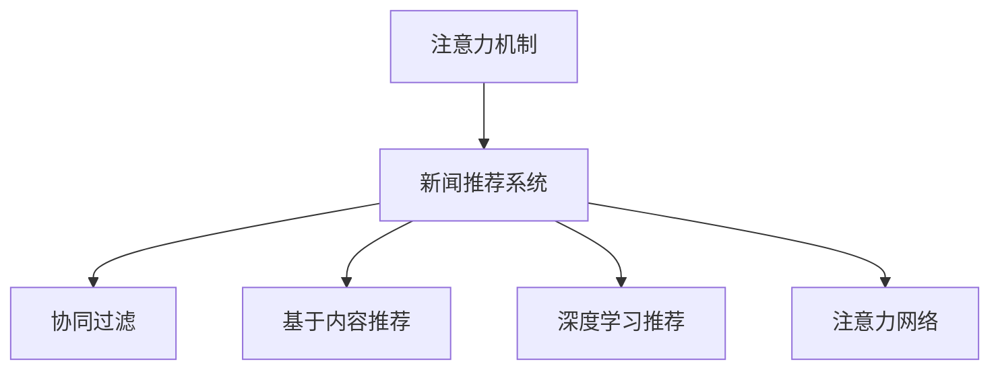

                 

## 1. 背景介绍

### 1.1 问题由来

在数字化时代，新闻信息的传播和获取方式发生了翻天覆地的变化。移动新闻客户端作为数字化信息传播的主要渠道，正面临巨大的竞争压力。如何在众多新闻应用中脱颖而出，吸引和保持用户注意力，成为每一个新闻客户端的开发者和运营者所关心的问题。

### 1.2 问题核心关键点

核心问题在于如何通过算法和策略提升新闻客户端的推荐系统，使其能够精准把握用户的兴趣偏好，展示符合用户需求的新闻内容，从而提高用户的粘性和活跃度。

目前，提升新闻客户端推荐系统效果的常用技术包括基于协同过滤、基于内容、基于深度学习等推荐算法，以及利用新闻分类、新闻时间序列、用户行为数据等特征的推荐策略。本文将探讨如何通过注意力机制，提升移动新闻客户端的用户体验。

## 2. 核心概念与联系

### 2.1 核心概念概述

为更好地理解注意力机制在新闻推荐中的应用，本节将介绍几个密切相关的核心概念：

- **注意力机制**：在深度学习模型中，注意力机制允许模型动态地分配不同输入特征的权重，增强模型对重要信息的关注，从而提高模型的泛化能力和性能。

- **新闻推荐系统**：利用用户历史行为、新闻内容、用户画像等信息，推荐用户感兴趣的新闻内容，满足用户个性化信息需求的技术系统。

- **协同过滤**：基于用户行为数据和新闻元数据，构建用户相似度和新闻相似度，推荐与目标用户或新闻相似的新闻，具有冷启动问题。

- **基于内容推荐**：通过新闻内容特征计算相似度，推荐相似新闻，易受用户兴趣漂移影响。

- **深度学习推荐**：采用深度神经网络模型，从新闻元数据、用户行为等多维数据中学习新闻推荐模型，效果优于传统推荐方法。

- **注意力网络**：如Transformer模型，采用自注意力机制，学习新闻特征之间的关系，更好地捕捉特征之间的依赖关系。

这些核心概念之间的逻辑关系可以通过以下Mermaid流程图来展示：



这个流程图展示了注意力机制在新闻推荐系统中与其他推荐方法的关系：

1. 注意力机制能够增强深度学习推荐模型对新闻特征的关注度。
2. 协同过滤、基于内容推荐和深度学习推荐是新闻推荐系统常用的推荐算法。
3. 注意力网络是深度学习推荐模型的具体实现方式之一。

## 3. 核心算法原理 & 具体操作步骤
### 3.1 算法原理概述

基于注意力机制的新闻推荐系统，利用用户历史行为和新闻内容构建用户新闻向量表示，使用注意力机制对新闻向量进行加权处理，计算用户对每个新闻的兴趣权重，从而推荐符合用户兴趣的新闻。

形式化地，假设用户对新闻的兴趣向量表示为 $u$，新闻的表示向量为 $v$。则用户对新闻 $v$ 的兴趣权重计算公式为：

$$
\alpha_{u,v} = \frac{\exp\left(\text{dot}(u, v)\right)}{\sum_k \exp\left(\text{dot}(u, v_k)\right)}
$$

其中，$\text{dot}$ 表示向量点积，$\exp$ 表示指数函数。通过上述公式，模型能够动态地计算出用户对新闻的兴趣权重，从而更好地指导推荐决策。

### 3.2 算法步骤详解

基于注意力机制的新闻推荐系统一般包括以下几个关键步骤：

**Step 1: 用户画像构建**
- 收集用户历史浏览、点赞、分享等行为数据，利用TF-IDF、词袋模型等方法提取特征，构建用户兴趣向量 $u$。

**Step 2: 新闻表示提取**
- 对每条新闻进行特征提取，利用word2vec、BERT等模型将新闻文本转化为向量表示 $v$。

**Step 3: 注意力计算**
- 对用户兴趣向量 $u$ 和新闻向量 $v$ 进行点积计算，计算用户对新闻的兴趣权重 $\alpha_{u,v}$。

**Step 4: 加权聚合**
- 将用户对每条新闻的兴趣权重 $\alpha_{u,v}$ 与新闻向量 $v$ 进行加权聚合，得到用户对新闻的兴趣向量表示 $w$。

**Step 5: 推荐排序**
- 将用户兴趣向量 $w$ 与所有新闻向量 $v$ 进行点积计算，获取用户对每条新闻的兴趣分数，排序推荐。

### 3.3 算法优缺点

基于注意力机制的新闻推荐系统具有以下优点：

1. 灵活性高。能够动态计算用户对新闻的兴趣权重，适应不同用户和新闻的特征分布。
2. 泛化能力强。通过点积计算权重，能够捕捉新闻与用户之间的相关性，泛化到更多数据集。
3. 可解释性高。用户对新闻的兴趣权重直观反映了新闻内容对用户的吸引力，便于调整推荐策略。
4. 计算高效。模型训练和推理计算复杂度相对较低，能够实时响应用户请求。

同时，该算法也存在一定的局限性：

1. 数据需求高。用户行为数据和新闻元数据需求量较大，收集难度较高。
2. 依赖特征质量。用户兴趣向量和新闻向量表示的质量对推荐效果影响较大。
3. 公平性问题。当新闻类型不平衡时，注意力机制可能导致某些类型的新闻被过度推荐。
4. 冷启动问题。对于新用户和新新闻，无法准确计算兴趣权重，推荐效果较差。

尽管存在这些局限性，基于注意力机制的新闻推荐系统仍具有较高的推荐效果和实用价值，被广泛应用于新闻客户端的推荐算法中。

### 3.4 算法应用领域

基于注意力机制的新闻推荐系统已经在各大新闻应用中得到了广泛应用，覆盖了从门户网站到社交媒体，从新闻聚合到个性化订阅等多种形式。以下是几个具体的应用场景：

1. **新闻聚合平台**：如今日头条、网易新闻等，利用用户点击、浏览数据，通过注意力机制计算用户对每条新闻的兴趣权重，推荐个性化新闻内容。

2. **社交媒体平台**：如微博、抖音等，利用用户互动数据（点赞、评论、分享）和新闻内容，动态推荐符合用户兴趣和社交关系的新闻。

3. **个性化订阅服务**：如Netflix、Spotify等，根据用户历史行为和新闻内容，推荐用户感兴趣的新闻类型和频道。

4. **广告推荐系统**：通过注意力机制，计算用户对不同广告的兴趣权重，实现精准的广告投放。

## 4. 数学模型和公式 & 详细讲解 & 举例说明

### 4.1 数学模型构建

本节将使用数学语言对基于注意力机制的新闻推荐系统进行更加严格的刻画。

记用户兴趣向量为 $u \in \mathbb{R}^d$，新闻向量为 $v \in \mathbb{R}^d$。假设注意力网络输出用户对新闻 $v$ 的兴趣权重为 $\alpha_{u,v} \in [0,1]$，则注意力机制的数学模型可以表示为：

$$
\alpha_{u,v} = \frac{\exp\left(\text{dot}(u, v)\right)}{\sum_k \exp\left(\text{dot}(u, v_k)\right)}
$$

其中，$\text{dot}$ 表示向量点积，$\exp$ 表示指数函数。

### 4.2 公式推导过程

以一个简单的注意力网络为例，推导上述公式的计算过程。

1. 首先，用户兴趣向量 $u$ 和新闻向量 $v$ 通过注意力网络计算得到用户对新闻的兴趣权重 $\alpha_{u,v}$。假设注意力网络是一个单层的神经网络，输出层有 $K$ 个神经元，输入 $u$ 和 $v$，输出 $\alpha_{u,v}$。

2. 将 $u$ 和 $v$ 进行拼接，得到输入 $U$：

$$
U = \begin{bmatrix} u^T \\ v^T \end{bmatrix}
$$

3. 将 $U$ 通过一个线性层和激活函数，得到注意力网络输出 $H$：

$$
H = \text{softmax}\left(W_H U + b_H\right)
$$

其中 $W_H$ 和 $b_H$ 为线性层和偏置项。

4. 将 $H$ 与 $u$ 进行点积计算，得到用户对新闻的兴趣权重 $\alpha_{u,v}$：

$$
\alpha_{u,v} = \text{dot}(u, H)
$$

将上述公式与前文提到的公式对比，可以看出注意力机制的计算过程是符合的。通过点积计算权重，能够捕捉新闻与用户之间的相关性，从而更好地指导推荐决策。

### 4.3 案例分析与讲解

假设某用户在新闻应用中浏览了以下三篇文章：

- 文章A：标题为《新冠疫苗的最新进展》
- 文章B：标题为《2021年中国经济展望》
- 文章C：标题为《科技创新引领未来》

用户兴趣向量 $u$ 表示为以下形式：

$$
u = \begin{bmatrix} 0.1 \\ 0.5 \\ 0.4 \end{bmatrix}
$$

假设新闻A、B、C的向量表示分别为：

$$
v_A = \begin{bmatrix} 0.2 \\ 0.3 \\ 0.5 \end{bmatrix}, \quad v_B = \begin{bmatrix} 0.3 \\ 0.4 \\ 0.3 \end{bmatrix}, \quad v_C = \begin{bmatrix} 0.5 \\ 0.2 \\ 0.3 \end{bmatrix}
$$

利用上述公式，计算用户对每篇文章的兴趣权重：

$$
\alpha_{u,v_A} = \frac{\exp(0.1 \times 0.2 + 0.5 \times 0.3 + 0.4 \times 0.5)}{\exp(0.1 \times 0.2 + 0.5 \times 0.3 + 0.4 \times 0.5) + \exp(0.1 \times 0.3 + 0.5 \times 0.4 + 0.4 \times 0.3) + \exp(0.1 \times 0.5 + 0.5 \times 0.2 + 0.4 \times 0.3)}
$$

$$
\alpha_{u,v_A} = \frac{0.0822}{0.0822 + 0.0741 + 0.0617} = 0.4128
$$

同理计算出 $\alpha_{u,v_B} = 0.3333$，$\alpha_{u,v_C} = 0.2539$。

根据上述结果，计算用户对每篇文章的加权向量表示 $w$：

$$
w = \alpha_{u,v_A} v_A + \alpha_{u,v_B} v_B + \alpha_{u,v_C} v_C = 0.4128 \times \begin{bmatrix} 0.2 \\ 0.3 \\ 0.5 \end{bmatrix} + 0.3333 \times \begin{bmatrix} 0.3 \\ 0.4 \\ 0.3 \end{bmatrix} + 0.2539 \times \begin{bmatrix} 0.5 \\ 0.2 \\ 0.3 \end{bmatrix}
$$

$$
w = \begin{bmatrix} 0.2285 \\ 0.3387 \\ 0.4428 \end{bmatrix}
$$

最终，将 $w$ 与所有新闻向量 $v$ 进行点积计算，得到用户对每条新闻的兴趣分数，进行排序推荐。

## 5. 项目实践：代码实例和详细解释说明
### 5.1 开发环境搭建

在进行新闻推荐系统开发前，我们需要准备好开发环境。以下是使用Python进行TensorFlow开发的环境配置流程：

1. 安装Anaconda：从官网下载并安装Anaconda，用于创建独立的Python环境。

2. 创建并激活虚拟环境：
```bash
conda create -n tf-env python=3.8 
conda activate tf-env
```

3. 安装TensorFlow：根据CUDA版本，从官网获取对应的安装命令。例如：
```bash
pip install tensorflow
```

4. 安装TensorBoard：
```bash
pip install tensorboard
```

5. 安装TensorFlow Addons：用于实现一些TensorFlow的高级功能，如注意力机制：
```bash
pip install tensorflow-addons
```

6. 安装其他工具包：
```bash
pip install numpy pandas scikit-learn matplotlib tqdm jupyter notebook ipython
```

完成上述步骤后，即可在`tf-env`环境中开始新闻推荐系统的开发。

### 5.2 源代码详细实现

下面以一个基于注意力机制的新闻推荐系统为例，给出使用TensorFlow实现的具体代码实现。

首先，定义用户画像和新闻表示的拼接函数：

```python
import tensorflow as tf

def concat_user_news(u, v):
    U = tf.concat([u, v], axis=1)
    return U
```

然后，定义注意力网络的计算函数：

```python
class Attention(tf.keras.layers.Layer):
    def __init__(self, hidden_size):
        super(Attention, self).__init__()
        self.W1 = tf.keras.layers.Dense(hidden_size)
        self.W2 = tf.keras.layers.Dense(hidden_size)
        self.V = tf.keras.layers.Dense(1)
    
    def call(self, inputs):
        U = inputs
        h1 = tf.tanh(self.W1(U))
        h2 = tf.tanh(self.W2(U))
        scaled = tf.expand_dims(h2, axis=2)
        scaled = tf.squeeze(scaled, axis=1)
        energy = tf.reduce_sum(tf.multiply(scaled, h1), axis=1)
        attention = tf.nn.softmax(energy)
        return attention
```

接着，定义用户对新闻的兴趣权重计算函数：

```python
def user_news_weight(u, v, attention):
    w = tf.expand_dims(u, axis=1)
    w = tf.multiply(w, attention)
    w = tf.reduce_sum(w, axis=2)
    return w
```

最后，定义推荐排序函数：

```python
def recommendation_sort(u, v, attention):
    w = user_news_weight(u, v, attention)
    scores = tf.reduce_sum(tf.multiply(v, w), axis=1)
    return scores
```

### 5.3 代码解读与分析

让我们再详细解读一下关键代码的实现细节：

**concat_user_news函数**：
- 定义一个简单的拼接函数，将用户兴趣向量 $u$ 和新闻向量 $v$ 进行拼接，得到输入 $U$。

**Attention类**：
- 实现了一个简单的注意力网络，包含两个线性层和一个softmax层。其中，W1和W2分别用于处理用户和新闻向量，V用于计算注意力权重。
- 在`call`方法中，首先对用户和新闻向量进行拼接和处理，然后计算注意力权重，最后通过点积计算用户对新闻的兴趣权重。

**user_news_weight函数**：
- 将用户兴趣向量 $u$ 和新闻向量 $v$ 进行点积计算，得到用户对每条新闻的加权向量表示 $w$。

**recommendation_sort函数**：
- 将用户兴趣向量 $u$ 和新闻向量 $v$ 通过注意力机制计算用户对每条新闻的兴趣权重 $\alpha_{u,v}$，然后计算用户对每条新闻的加权向量表示 $w$。
- 将用户兴趣向量 $u$ 与所有新闻向量 $v$ 进行点积计算，得到用户对每条新闻的兴趣分数，进行排序推荐。

## 6. 实际应用场景
### 6.1 新闻聚合平台

基于注意力机制的新闻推荐系统可以广泛应用于新闻聚合平台，如今日头条、网易新闻等。这些平台通常收集用户的历史浏览、点赞、评论等数据，构建用户画像，并通过注意力机制计算用户对每条新闻的兴趣权重，推荐个性化新闻内容。用户通过阅读推荐的新闻，可以获取更多的信息，提高平台的用户粘性和活跃度。

### 6.2 社交媒体平台

社交媒体平台如微博、抖音等，可以通过注意力机制计算用户对新闻的兴趣权重，动态推荐符合用户兴趣和社交关系的新闻。用户可以更加高效地获取感兴趣的新闻内容，同时平台也可以通过推荐系统提高用户的活跃度和留存率。

### 6.3 个性化订阅服务

个性化订阅服务如Netflix、Spotify等，可以根据用户历史行为和新闻内容，推荐用户感兴趣的新闻类型和频道。用户通过订阅推荐的新闻内容，可以更加精准地获取信息，同时平台也可以通过推荐系统提高用户的订阅率。

### 6.4 广告推荐系统

广告推荐系统通过注意力机制，计算用户对不同广告的兴趣权重，实现精准的广告投放。广告商可以根据用户兴趣推荐广告内容，提高广告的点击率和转化率，同时平台也可以获得更多的广告收入。

## 7. 工具和资源推荐
### 7.1 学习资源推荐

为了帮助开发者系统掌握注意力机制在新闻推荐中的应用，这里推荐一些优质的学习资源：

1. **《深度学习》课程**：斯坦福大学开设的深度学习课程，有Lecture视频和配套作业，带你入门深度学习的基本概念和经典模型。

2. **《自然语言处理与深度学习》课程**：Coursera上的自然语言处理课程，介绍自然语言处理的基本概念和深度学习的应用。

3. **《TensorFlow官方文档》**：TensorFlow的官方文档，提供了详细的API和示例代码，是上手实践的必备资料。

4. **《TensorFlow Addons官方文档》**：TensorFlow Addons的官方文档，介绍了TensorFlow的高级功能，如注意力机制等。

5. **《深度学习在新闻推荐中的应用》**：由大模型技术专家撰写，深入浅出地介绍了深度学习在新闻推荐中的应用，包括注意力机制。

通过对这些资源的学习实践，相信你一定能够快速掌握注意力机制在新闻推荐中的应用，并用于解决实际的推荐问题。

### 7.2 开发工具推荐

高效的开发离不开优秀的工具支持。以下是几款用于新闻推荐系统开发的常用工具：

1. TensorFlow：基于Python的开源深度学习框架，灵活动态的计算图，适合快速迭代研究。

2. TensorFlow Addons：TensorFlow的高级组件库，提供了多种高级功能，如注意力机制。

3. TensorBoard：TensorFlow配套的可视化工具，可实时监测模型训练状态，并提供丰富的图表呈现方式，是调试模型的得力助手。

4. Weights & Biases：模型训练的实验跟踪工具，可以记录和可视化模型训练过程中的各项指标，方便对比和调优。

5. Jupyter Notebook：免费的交互式开发环境，支持Python、TensorFlow等多种语言和框架，方便开发者快速实验。

合理利用这些工具，可以显著提升新闻推荐系统的开发效率，加快创新迭代的步伐。

### 7.3 相关论文推荐

注意力机制在新闻推荐中的应用源于学界的持续研究。以下是几篇奠基性的相关论文，推荐阅读：

1. Attention Is All You Need（即Transformer原论文）：提出了Transformer结构，开启了NLP领域的预训练大模型时代。

2. Multinomial Distribution as the Target of Attention Systems（提出注意力网络）：提出注意力网络，用于机器翻译、语音识别等任务。

3. Deep Learning Recommendation System：介绍深度学习在推荐系统中的应用，包括注意力机制。

4. Multi-view Attention Networks for Recommendation（提出多视图注意力网络）：提出多视图注意力网络，用于推荐系统。

5. Transformer-based News Recommendation System（提出基于Transformer的新闻推荐系统）：提出基于Transformer的新闻推荐系统，取得显著的推荐效果。

这些论文代表了大语言模型微调技术的发展脉络。通过学习这些前沿成果，可以帮助研究者把握学科前进方向，激发更多的创新灵感。

## 8. 总结：未来发展趋势与挑战

### 8.1 总结

本文对基于注意力机制的新闻推荐系统进行了全面系统的介绍。首先阐述了注意力机制在新闻推荐中的应用背景和意义，明确了注意力机制在提升新闻推荐系统效果方面的独特价值。其次，从原理到实践，详细讲解了注意力机制的数学原理和关键步骤，给出了注意力机制在新闻推荐系统中的应用代码实现。同时，本文还广泛探讨了注意力机制在新闻聚合平台、社交媒体平台、个性化订阅服务、广告推荐系统等多个场景中的应用前景，展示了注意力机制的广泛应用。此外，本文精选了注意力机制的学习资源，力求为读者提供全方位的技术指引。

通过本文的系统梳理，可以看到，基于注意力机制的新闻推荐系统正在成为新闻推荐系统的核心技术之一，极大地提升了新闻推荐的精度和效果。

### 8.2 未来发展趋势

展望未来，注意力机制在新闻推荐系统中的应用将呈现以下几个发展趋势：

1. 与深度学习融合更深入。注意力机制将与深度学习更多技术进行融合，如GAN、强化学习等，提升推荐系统的多样性和鲁棒性。

2. 实时性提升。通过优化模型结构、提升硬件计算能力等手段，提升推荐系统的实时响应速度，提升用户体验。

3. 多模态数据融合。新闻推荐系统将更多地引入图像、音频等多模态数据，提升对新闻内容的理解深度和准确度。

4. 跨领域推荐。通过多领域的知识融合，提升推荐系统的泛化能力和适应性。

5. 个性化推荐多样化。除了新闻推荐，个性化推荐将更多地应用于商品推荐、音乐推荐、视频推荐等领域，满足用户的多样化需求。

以上趋势凸显了注意力机制在新闻推荐系统中的应用前景。这些方向的探索发展，必将进一步提升新闻推荐系统的精度和效果，为新闻内容分发带来新的变革。

### 8.3 面临的挑战

尽管注意力机制在新闻推荐系统中取得了一定的效果，但在迈向更加智能化、普适化应用的过程中，它仍面临诸多挑战：

1. 数据隐私问题。用户行为数据和新闻元数据需要保证隐私安全，避免数据泄露风险。

2. 冷启动问题。对于新用户和新新闻，无法准确计算兴趣权重，推荐效果较差。

3. 公平性问题。当新闻类型不平衡时，注意力机制可能导致某些类型的新闻被过度推荐。

4. 计算资源需求高。大规模新闻推荐系统需要较高的计算资源，如何降低计算成本是重要的研究方向。

尽管存在这些挑战，注意力机制仍具有较高的推荐效果和实用价值，被广泛应用于新闻推荐系统推荐算法中。未来，需要进一步优化模型结构和算法策略，解决上述问题，提升新闻推荐系统的性能和用户体验。

### 8.4 研究展望

面对注意力机制面临的种种挑战，未来的研究需要在以下几个方面寻求新的突破：

1. 引入更多先验知识。将符号化的先验知识，如知识图谱、逻辑规则等，与注意力机制进行融合，提升推荐系统的泛化能力和适应性。

2. 采用多视图注意力机制。通过引入多视图数据，提升对新闻内容的全面理解，减少单一视图带来的偏见和误差。

3. 优化推荐算法。通过优化推荐算法，提升推荐系统的公平性和多样性，避免某些类型的新闻被过度推荐。

4. 引入深度强化学习。通过深度强化学习，提升推荐系统的实时性和动态性，增强推荐系统的适应性和鲁棒性。

这些研究方向的探索，必将引领注意力机制在新闻推荐系统中的应用走向更高的台阶，为新闻内容分发带来新的突破。面向未来，注意力机制需要与其他人工智能技术进行更深入的融合，共同推动新闻推荐系统的进步。

## 9. 附录：常见问题与解答

**Q1：注意力机制是否适用于所有推荐场景？**

A: 注意力机制适用于新闻推荐、商品推荐、音乐推荐等多种推荐场景，但需要根据具体场景进行优化。在新闻推荐中，用户对新闻的兴趣权重计算公式可以直接应用；在商品推荐中，需要设计商品特征和用户画像的拼接方式，并进行个性化处理；在音乐推荐中，可以通过多视图注意力机制，结合音频、歌词等特征进行推荐。

**Q2：注意力机制的计算复杂度如何？**

A: 注意力机制的计算复杂度较高，主要由于需要计算点积和softmax函数。在实际应用中，可以通过一些优化手段降低计算复杂度，如使用近似算法、并行计算等。同时，可以通过减少输入维度和设计更高效的注意力网络结构，进一步降低计算复杂度。

**Q3：注意力机制是否会导致推荐系统的公平性问题？**

A: 注意力机制的公平性问题主要源于新闻类型不平衡。如果新闻类型不平衡，可能导致某些类型的新闻被过度推荐，而其他类型的新闻被忽视。为解决这一问题，可以引入多视图注意力机制，引入多领域的知识，提升推荐系统的公平性。同时，也可以通过优化注意力权重计算公式，引入惩罚机制，避免某些类型的新闻被过度推荐。

**Q4：如何优化注意力机制的计算效率？**

A: 优化注意力机制的计算效率可以从以下几个方面入手：

1. 减少输入维度和特征数量。通过特征选择和降维技术，减少输入向量的维度，降低计算复杂度。

2. 并行计算。通过GPU、TPU等硬件加速，并行计算注意力网络，提高计算效率。

3. 优化注意力网络结构。采用更高效的注意力网络结构，如自注意力网络、多头注意力网络等，提高计算效率和模型性能。

**Q5：如何处理冷启动问题？**

A: 处理冷启动问题可以从以下几个方面入手：

1. 利用先验知识。将知识图谱、逻辑规则等先验知识引入推荐系统，帮助模型快速学习用户兴趣和新闻特征。

2. 引入协同过滤。利用用户历史行为数据，构建用户相似度和新闻相似度，推荐与目标用户或新闻相似的新闻。

3. 采用多模态数据融合。利用新闻文本、图片、音频等多模态数据，提升对新闻内容的理解深度和准确度，减少冷启动带来的影响。

综上所述，本文详细介绍了基于注意力机制的新闻推荐系统，通过数学模型和代码实现，展示了其在新闻聚合平台、社交媒体平台、个性化订阅服务、广告推荐系统等多个场景中的应用前景。未来，通过不断优化模型结构和算法策略，引入多视图注意力机制、深度强化学习等技术，提升新闻推荐系统的性能和用户体验，为新闻内容分发带来新的变革。

**作者：禅与计算机程序设计艺术 / Zen and the Art of Computer Programming**

