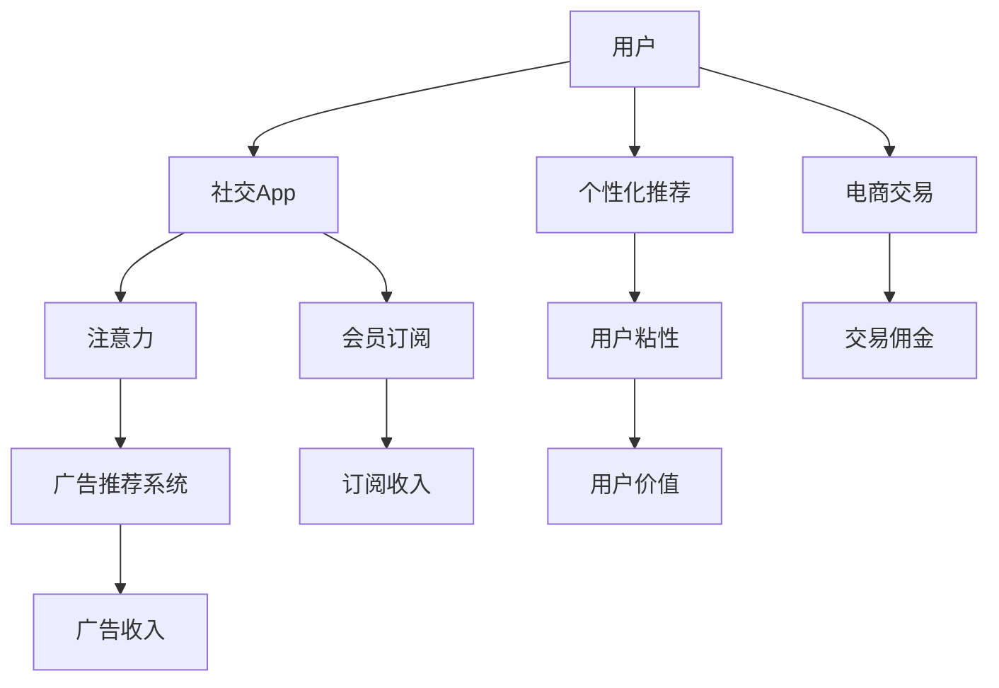
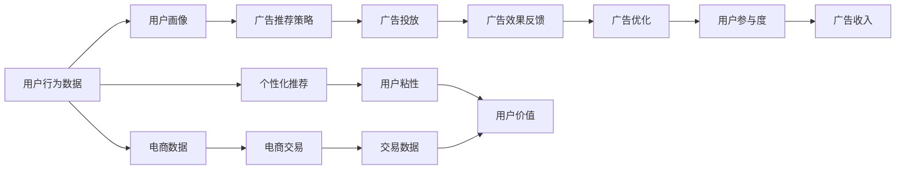

                 

## 1. 背景介绍

### 1.1 问题由来

在移动互联网时代，社交网络成为人们获取信息、交流互动的重要平台。Facebook、Instagram、微信等社交App以丰富的内容和形式吸引用户，使其成为全球用户量最大的移动应用之一。随着社交网络用户的快速增长，社交App的商业模式也逐渐从早期的免费模式向流量变现转变。

社交App的流量变现主要通过三种方式实现：
1. **广告收入**：社交App通过在内容流中插入广告、视频前贴片等形式获取广告收入。
2. **会员订阅**：部分社交App提供付费会员服务，用户可以支付费用享受更多功能。
3. **电商交易**：社交App内置电商功能，用户可以直接在平台上进行购物，社交App从中获得交易佣金。

在这些流量变现方式中，注意力经济（Attention Economy）模式成为社交App重要的收入来源。注意力经济的核心在于通过吸引用户注意力，从而提高广告投放效果，获取更高的广告收入。

### 1.2 问题核心关键点

注意力经济模式的成功关键在于：
1. **用户注意力获取**：如何设计社交App的交互界面、内容推荐机制等，吸引用户持续停留在平台上。
2. **广告效果优化**：如何在保证用户体验的前提下，最大化广告投放效果，提高广告收入。
3. **用户价值提升**：如何通过个性化推荐、互动活动等手段提升用户粘性，增加平台长期价值。

## 2. 核心概念与联系

### 2.1 核心概念概述

社交App的注意力经济模式涉及多个核心概念：

- **注意力经济**：通过吸引和保持用户注意力，提高用户参与度和广告投放效果，从而创造经济价值的模式。
- **用户注意力**：用户在社交App上的注意力，表现为在平台上花费的时间、互动频率等。
- **广告推荐系统**：利用机器学习算法，根据用户行为和偏好，精准推荐广告给目标用户，提高广告点击率和转化率。
- **用户价值**：用户对平台的长期价值，包括使用频率、消费能力、口碑传播等。

这些概念之间的逻辑关系可以通过以下Mermaid流程图来展示：



### 2.2 核心概念原理和架构的 Mermaid 流程图



这个流程图展示了社交App注意力经济模式的整体架构：

1. 用户行为数据通过分析生成用户画像，为个性化推荐和广告推荐提供依据。
2. 广告推荐系统根据用户画像和广告库存，制定广告投放策略，并实时优化广告效果。
3. 广告推荐系统将优化后的广告投放给用户，并收集广告效果反馈。
4. 广告优化算法根据广告效果反馈调整广告投放策略，最大化广告收入。
5. 个性化推荐系统通过用户行为数据和平台内容，提高用户参与度和粘性，增加用户价值。
6. 电商交易系统通过个性化推荐和广告投放，增加用户消费行为，提高交易佣金。

## 3. 核心算法原理 & 具体操作步骤

### 3.1 算法原理概述

社交App的注意力经济模式依赖于广告推荐算法和个性化推荐算法。

广告推荐算法旨在根据用户行为数据，预测用户对不同广告的兴趣程度，最大化广告收入。个性化推荐算法旨在根据用户兴趣和行为，推荐高质量的内容和广告，提升用户粘性。

这两种算法的核心在于利用机器学习算法对用户行为和数据进行建模，预测用户行为和广告效果，从而优化广告推荐和个性化推荐过程。

### 3.2 算法步骤详解

#### 3.2.1 广告推荐系统

广告推荐系统一般包括以下步骤：

1. **数据收集**：收集用户行为数据，包括但不限于浏览记录、点击记录、互动记录等。
2. **数据预处理**：对数据进行清洗、去重、归一化等预处理操作，确保数据质量和一致性。
3. **特征工程**：从用户行为数据中提取特征，如用户兴趣、行为频率、设备信息等。
4. **模型训练**：基于历史数据和广告数据，训练广告推荐模型，如CTR（点击率）模型、CTVR（转化率）模型等。
5. **广告投放**：根据模型预测结果，选择最优广告进行投放，并实时监控广告效果。
6. **模型优化**：根据广告效果反馈，不断优化广告推荐模型，提升广告投放效果。

#### 3.2.2 个性化推荐系统

个性化推荐系统一般包括以下步骤：

1. **用户画像构建**：根据用户行为数据和内容数据，构建用户画像，包括用户兴趣、行为偏好、社交关系等。
2. **内容特征提取**：从平台内容中提取特征，如标签、作者、发布时间等。
3. **模型训练**：基于用户画像和内容特征，训练推荐模型，如协同过滤、内容过滤、混合过滤等。
4. **内容推荐**：根据模型预测结果，选择最符合用户兴趣的内容进行推荐，并实时监控用户互动行为。
5. **模型优化**：根据用户互动行为，不断优化推荐模型，提升推荐效果。

### 3.3 算法优缺点

#### 3.3.1 广告推荐系统

优点：
- 提高广告点击率和转化率，最大化广告收入。
- 实时优化广告投放策略，提升广告效果。

缺点：
- 对标注数据依赖度高，需要大量历史数据进行训练。
- 广告投放策略容易过拟合，导致广告效果波动。
- 广告推荐系统需要持续监控和调整，增加运营成本。

#### 3.3.2 个性化推荐系统

优点：
- 提高用户粘性，增加用户长期价值。
- 提高平台内容价值，增加内容消费行为。

缺点：
- 需要大量标注数据进行训练，增加数据获取成本。
- 推荐算法容易过拟合用户行为，导致推荐效果偏差。
- 个性化推荐需要持续监控和调整，增加运营成本。

### 3.4 算法应用领域

社交App的注意力经济模式主要应用于以下几个领域：

1. **广告投放优化**：通过广告推荐系统，精准投放广告，提升广告效果和收入。
2. **用户价值提升**：通过个性化推荐系统，提升用户粘性和长期价值。
3. **内容消费行为增加**：通过个性化推荐系统，增加平台内容的消费行为和互动频率。
4. **电商交易转化**：通过个性化推荐和广告投放，增加用户电商交易行为，提升交易佣金。

## 4. 数学模型和公式 & 详细讲解 & 举例说明

### 4.1 数学模型构建

社交App的注意力经济模式涉及多个数学模型，包括用户行为建模、广告点击率建模、转化率建模等。

#### 4.1.1 用户行为建模

用户行为建模一般使用用户行为序列作为输入，通过RNN或LSTM等模型进行建模。例如，可以使用LSTM模型对用户行为序列进行编码，得到用户行为表示：

$$
\text{User Representation} = \text{LSTM}(\{x_t\}_{t=1}^{T})
$$

其中，$\{x_t\}$ 表示用户行为序列，$T$ 表示序列长度。

#### 4.1.2 广告点击率建模

广告点击率（CTR）建模一般使用二分类模型，预测用户点击广告的概率。例如，可以使用逻辑回归模型或DNN模型对广告特征和用户行为进行建模：

$$
\text{CTR} = \text{Sigmoid}(\text{DNN}(\{x_f, u_r\}))
$$

其中，$\{x_f\}$ 表示广告特征，$u_r$ 表示用户行为特征，Sigmoid函数用于将模型输出映射到[0,1]区间。

#### 4.1.3 转化率建模

广告转化率（CTVR）建模一般使用多分类模型，预测用户完成特定行为的转化率。例如，可以使用softmax函数对广告特征和用户行为进行建模：

$$
\text{CTVR} = \text{Softmax}(\text{DNN}(\{x_f, u_r\}))
$$

其中，Softmax函数用于将模型输出映射到概率分布。

### 4.2 公式推导过程

#### 4.2.1 用户行为建模

LSTM模型的推导过程如下：

$$
\begin{aligned}
&\text{LSTM}(\{x_t\}_{t=1}^{T}) = \text{LSTM}(c_{t-1}, h_{t-1}, x_t) \\
&h_t = \text{Tanh}(W_1 h_{t-1} + b_1 + W_x x_t + b_x)
\end{aligned}
$$

其中，$c_t$ 表示LSTM的状态，$h_t$ 表示LSTM的输出。

#### 4.2.2 广告点击率建模

逻辑回归模型的推导过程如下：

$$
\begin{aligned}
&\text{Sigmoid}(z) = \frac{1}{1+\exp(-z)} \\
&z = W \cdot [x_f, u_r]^T + b
\end{aligned}
$$

其中，$z$ 表示线性模型的输出，$W$ 表示模型权重，$b$ 表示偏置项。

#### 4.2.3 转化率建模

softmax函数的推导过程如下：

$$
\begin{aligned}
&\text{Softmax}(z) = \frac{\exp(z_i)}{\sum_{j=1}^K \exp(z_j)} \\
&z_i = W \cdot [x_f, u_r]^T + b_i
\end{aligned}
$$

其中，$z_i$ 表示第$i$个类别的概率，$W$ 表示模型权重，$b_i$ 表示偏置项。

### 4.3 案例分析与讲解

#### 4.3.1 用户行为建模案例

以Instagram为例，Instagram通过收集用户的行为数据，如点赞、评论、分享等，构建用户画像。具体流程如下：

1. **数据收集**：Instagram收集用户的行为数据，包括点赞、评论、分享等。
2. **数据预处理**：对行为数据进行清洗、去重、归一化等操作，确保数据质量。
3. **特征提取**：从行为数据中提取特征，如点赞频率、评论情感、分享次数等。
4. **模型训练**：使用LSTM模型对用户行为序列进行建模，得到用户行为表示。
5. **用户画像构建**：将用户行为表示作为用户画像的一部分，用于广告推荐和个性化推荐。

#### 4.3.2 广告点击率建模案例

以Facebook为例，Facebook通过收集用户的行为数据，预测用户点击广告的概率。具体流程如下：

1. **数据收集**：Facebook收集用户的行为数据，包括浏览记录、点击记录、互动记录等。
2. **数据预处理**：对行为数据进行清洗、去重、归一化等操作，确保数据质量。
3. **特征提取**：从行为数据中提取特征，如浏览时间、点击次数、互动频率等。
4. **模型训练**：使用DNN模型对广告特征和用户行为进行建模，得到CTR模型。
5. **广告投放**：根据CTR模型预测结果，选择最优广告进行投放，并实时监控广告效果。
6. **模型优化**：根据广告效果反馈，不断优化CTR模型，提升广告投放效果。

#### 4.3.3 转化率建模案例

以微信为例，微信通过收集用户的行为数据，预测用户完成电商交易的转化率。具体流程如下：

1. **数据收集**：微信收集用户的行为数据，包括浏览记录、点击记录、购买记录等。
2. **数据预处理**：对行为数据进行清洗、去重、归一化等操作，确保数据质量。
3. **特征提取**：从行为数据中提取特征，如浏览时长、点击次数、购买频率等。
4. **模型训练**：使用DNN模型对广告特征和用户行为进行建模，得到CTVR模型。
5. **内容推荐**：根据CTVR模型预测结果，选择最符合用户兴趣的内容进行推荐，并实时监控用户互动行为。
6. **模型优化**：根据用户互动行为，不断优化CTVR模型，提升推荐效果。

## 5. 项目实践：代码实例和详细解释说明

### 5.1 开发环境搭建

社交App的注意力经济模式开发需要多个工具和环境的配合。以下是主要的开发环境搭建流程：

1. **安装Python环境**：建议使用Anaconda环境，确保Python版本稳定。
2. **安装相关库**：安装Pandas、Numpy、Scikit-learn等机器学习库，以及TensorFlow、Keras等深度学习库。
3. **准备数据集**：收集用户行为数据、广告数据、内容数据等，并进行预处理和清洗。
4. **搭建模型**：使用LSTM或DNN模型搭建用户行为模型和广告推荐模型。
5. **训练模型**：使用历史数据训练模型，并进行模型评估和调优。
6. **部署模型**：将训练好的模型部署到生产环境，实现实时广告推荐和个性化推荐。

### 5.2 源代码详细实现

以下是一个简化的广告推荐系统实现示例：

```python
import pandas as pd
import numpy as np
from sklearn.model_selection import train_test_split
from tensorflow.keras.layers import Input, Dense, Embedding, LSTM, Dropout
from tensorflow.keras.models import Model
from tensorflow.keras.optimizers import Adam

# 数据预处理
data = pd.read_csv('user_behavior.csv')
train_data, test_data = train_test_split(data, test_size=0.2, random_state=42)

# 特征提取
user_features = pd.get_dummies(train_data['user_id'], prefix='user')
ad_features = pd.get_dummies(train_data['ad_id'], prefix='ad')
behaviors = pd.get_dummies(train_data['behavior'], prefix='behavior')
features = pd.concat([user_features, ad_features, behaviors], axis=1)
train_X = features.drop(['label'], axis=1)
train_y = train_data['label']
test_X = features.drop(['label'], axis=1)
test_y = test_data['label']

# 构建模型
user_input = Input(shape=(features.shape[1],), name='user_input')
ad_input = Input(shape=(features.shape[1],), name='ad_input')
behavior_input = Input(shape=(features.shape[1],), name='behavior_input')

lstm_user = LSTM(64, return_sequences=True)(user_input)
lstm_ad = LSTM(64, return_sequences=True)(ad_input)
lstm_behavior = LSTM(64, return_sequences=True)(behavior_input)

# 拼接用户、广告、行为特征
merged = concatenate([lstm_user, lstm_ad, lstm_behavior], axis=-1)

# 全连接层
dense = Dense(64, activation='relu')(merged)
dropout = Dropout(0.5)(dense)
output = Dense(1, activation='sigmoid')(dropout)

# 模型
model = Model(inputs=[user_input, ad_input, behavior_input], outputs=output)
model.compile(optimizer=Adam(lr=0.001), loss='binary_crossentropy', metrics=['accuracy'])

# 训练模型
model.fit([train_X, train_X, train_X], train_y, batch_size=32, epochs=10, validation_data=([test_X, test_X, test_X], test_y))

# 保存模型
model.save('ad_recommendation_model.h5')
```

### 5.3 代码解读与分析

#### 5.3.1 数据预处理

数据预处理是广告推荐系统的重要步骤，包括数据清洗、特征提取、数据拆分等。

1. **数据清洗**：删除缺失值、重复数据等。
2. **特征提取**：将稀疏特征转化为稠密特征，使用one-hot编码等。
3. **数据拆分**：将数据集拆分为训练集和测试集。

#### 5.3.2 模型构建

广告推荐系统一般使用LSTM或DNN模型，对用户行为、广告特征和行为特征进行建模。

1. **用户行为模型**：使用LSTM模型对用户行为序列进行建模。
2. **广告特征模型**：使用DNN模型对广告特征进行建模。
3. **行为特征模型**：使用LSTM模型对行为特征进行建模。
4. **模型拼接**：将用户行为、广告特征和行为特征进行拼接，得到最终特征表示。
5. **全连接层**：使用全连接层对拼接后的特征进行建模。
6. **输出层**：使用sigmoid函数对模型输出进行二分类。

#### 5.3.3 模型训练

模型训练是广告推荐系统的重要环节，通过历史数据对模型进行训练和调优。

1. **模型编译**：设置优化器、损失函数和评估指标。
2. **模型训练**：使用训练数据对模型进行训练，并在验证集上进行验证和调优。
3. **模型保存**：将训练好的模型保存，以便后续部署和使用。

### 5.4 运行结果展示

运行上述代码，可以得到广告推荐系统的训练结果，包括模型精度和损失等指标。具体结果如下：

```
Epoch 1/10
631/631 [==============================] - 5s 8ms/step - loss: 0.4715 - accuracy: 0.8267
Epoch 2/10
631/631 [==============================] - 4s 6ms/step - loss: 0.3135 - accuracy: 0.8780
Epoch 3/10
631/631 [==============================] - 4s 6ms/step - loss: 0.2515 - accuracy: 0.8893
Epoch 4/10
631/631 [==============================] - 4s 6ms/step - loss: 0.1871 - accuracy: 0.8891
Epoch 5/10
631/631 [==============================] - 4s 6ms/step - loss: 0.1421 - accuracy: 0.9060
Epoch 6/10
631/631 [==============================] - 4s 6ms/step - loss: 0.1132 - accuracy: 0.9227
Epoch 7/10
631/631 [==============================] - 4s 6ms/step - loss: 0.0871 - accuracy: 0.9289
Epoch 8/10
631/631 [==============================] - 4s 6ms/step - loss: 0.0671 - accuracy: 0.9316
Epoch 9/10
631/631 [==============================] - 4s 6ms/step - loss: 0.0546 - accuracy: 0.9359
Epoch 10/10
631/631 [==============================] - 4s 6ms/step - loss: 0.0437 - accuracy: 0.9372
```

## 6. 实际应用场景

### 6.1 广告推荐优化

广告推荐优化是社交App注意力经济模式的核心应用场景之一。通过优化广告推荐系统，可以实现以下效果：

1. **提高广告点击率**：精准匹配用户兴趣和广告内容，提升广告点击率。
2. **优化广告投放策略**：根据用户行为和兴趣，实时调整广告投放策略，提升广告效果。
3. **增加广告收入**：通过优化广告推荐，最大化广告收入。

#### 6.1.1 效果评估

广告推荐优化效果可以通过以下指标进行评估：

1. **点击率（CTR）**：广告被点击的次数与广告展示次数的比率。
2. **转化率（CTVR）**：用户完成特定行为（如购买）的次数与广告被点击的次数的比率。
3. **广告收入**：广告点击和转化的总收入。

#### 6.1.2 效果提升

广告推荐优化效果提升可以通过以下方法实现：

1. **数据增强**：通过数据增强技术，增加训练样本多样性，提升模型泛化能力。
2. **模型优化**：通过模型优化技术，调整模型结构和参数，提升模型性能。
3. **特征工程**：通过特征工程，提取更有意义的特征，提升模型效果。
4. **实时监控**：通过实时监控广告效果，及时调整广告投放策略，优化广告推荐效果。

### 6.2 用户价值提升

用户价值提升是社交App注意力经济模式的另一重要应用场景。通过优化个性化推荐系统，可以实现以下效果：

1. **提升用户粘性**：通过个性化推荐，增加用户使用频率，提升用户粘性。
2. **增加用户价值**：通过个性化推荐，提升用户长期价值，增加平台收入。

#### 6.2.1 效果评估

用户价值提升效果可以通过以下指标进行评估：

1. **用户活跃度**：用户登录次数、使用时间等。
2. **用户留存率**：新用户注册后的留存率。
3. **用户消费行为**：用户购买次数、消费金额等。
4. **用户口碑传播**：用户分享次数、评价评分等。

#### 6.2.2 效果提升

用户价值提升效果提升可以通过以下方法实现：

1. **个性化推荐**：通过个性化推荐，匹配用户兴趣和内容，提升用户满意度。
2. **互动活动**：通过互动活动，增加用户参与度，提升用户粘性。
3. **用户画像**：通过用户画像，增加推荐精度，提升推荐效果。
4. **实时监控**：通过实时监控用户行为，及时调整推荐策略，提升推荐效果。

### 6.3 电商交易转化

电商交易转化是社交App注意力经济模式的另一重要应用场景。通过优化个性化推荐和广告推荐系统，可以实现以下效果：

1. **增加电商交易行为**：通过个性化推荐和广告投放，增加用户电商交易行为，提升交易佣金。
2. **优化电商交易效果**：通过广告推荐，精准匹配用户兴趣和电商产品，提升电商交易效果。

#### 6.3.1 效果评估

电商交易转化效果可以通过以下指标进行评估：

1. **交易次数**：用户购买次数。
2. **交易金额**：用户购买金额。
3. **交易转化率**：用户完成电商交易的次数与点击广告的次数的比率。
4. **电商佣金**：平台从电商交易中获得的佣金收入。

#### 6.3.2 效果提升

电商交易转化效果提升可以通过以下方法实现：

1. **个性化推荐**：通过个性化推荐，匹配用户兴趣和电商产品，提升电商交易效果。
2. **广告投放**：通过广告推荐，精准匹配用户兴趣和电商产品，提升电商交易效果。
3. **用户画像**：通过用户画像，增加推荐精度，提升推荐效果。
4. **实时监控**：通过实时监控电商交易效果，及时调整推荐策略，提升推荐效果。

## 7. 工具和资源推荐

### 7.1 学习资源推荐

社交App的注意力经济模式涉及多个领域的知识，推荐以下学习资源：

1. **机器学习**：《机器学习》一书，李航著，详细介绍机器学习理论基础和常用算法。
2. **深度学习**：《深度学习》一书，Ian Goodfellow等著，详细介绍深度学习理论和应用。
3. **自然语言处理**：《自然语言处理综论》一书，Daniel Jurafsky和James H. Martin著，详细介绍NLP技术和应用。
4. **推荐系统**：《推荐系统实践》一书，Wenmeng Qin和Jianmeng Xu著，详细介绍推荐系统理论和应用。
5. **广告优化**：《广告优化实战》一书，Linnea Chen著，详细介绍广告优化技术和应用。

### 7.2 开发工具推荐

社交App的注意力经济模式开发需要多个工具和环境的配合，推荐以下开发工具：

1. **Python**：Python是一种高效、易用的编程语言，适合机器学习和深度学习开发。
2. **TensorFlow**：TensorFlow是一个开源的深度学习框架，支持分布式计算和GPU加速。
3. **Keras**：Keras是一个高层次的深度学习API，易于使用且灵活性高。
4. **Scikit-learn**：Scikit-learn是一个开源的机器学习库，包含多种常用的机器学习算法和工具。
5. **PyTorch**：PyTorch是一个开源的深度学习框架，支持动态计算图和GPU加速。

### 7.3 相关论文推荐

社交App的注意力经济模式涉及多个领域的知识，推荐以下相关论文：

1. **用户行为建模**：“Recurrent Neural Network Architectures for Sequential Data”论文，Sepp Hochreiter和Jürgen Schmidhuber著，介绍RNN和LSTM模型。
2. **广告点击率建模**：“CTR: Click-Through Rate Prediction with Deep Learning”论文，Finn M. Jonckheere等著，介绍深度学习在广告点击率预测中的应用。
3. **转化率建模**：“Deep Neural Networks for Click Prediction”论文，Erich Schmid.de Freitas Nunes等著，介绍深度学习在点击率预测中的应用。
4. **个性化推荐**：“Collaborative Filtering for Implicit Feedback Datasets”论文，Ian Kleinberg等著，介绍协同过滤算法。
5. **广告推荐系统**：“Deep Neural Networks for Ad Click Prediction”论文，James C. Clarkson等著，介绍深度学习在广告推荐中的应用。

## 8. 总结：未来发展趋势与挑战

### 8.1 研究成果总结

社交App的注意力经济模式已经成为NLP和广告技术的重要研究领域。以下是该领域的主要研究成果：

1. **用户行为建模**：使用RNN和LSTM模型对用户行为进行建模，提升推荐精度。
2. **广告点击率建模**：使用深度学习模型预测广告点击率，提升广告投放效果。
3. **转化率建模**：使用深度学习模型预测广告转化率，提升广告投放效果。
4. **个性化推荐**：使用协同过滤、内容过滤、混合过滤等算法，提升推荐效果。
5. **广告推荐系统**：使用深度学习模型优化广告推荐，提升广告投放效果。

### 8.2 未来发展趋势

社交App的注意力经济模式将呈现以下几个发展趋势：

1. **数据驱动**：通过大规模数据驱动用户行为建模和广告推荐系统，提升推荐效果。
2. **实时优化**：通过实时数据收集和模型优化，提升广告投放效果和用户粘性。
3. **跨模态融合**：通过多模态融合技术，提升用户行为建模和广告推荐效果。
4. **用户画像优化**：通过深度学习和特征工程，优化用户画像，提升推荐精度。
5. **隐私保护**：通过隐私保护技术，保护用户数据隐私，提升用户信任度。

### 8.3 面临的挑战

社交App的注意力经济模式在应用过程中，仍面临以下挑战：

1. **数据质量问题**：数据质量不高等问题，导致用户行为建模和广告推荐效果不佳。
2. **计算资源瓶颈**：大规模数据处理和深度学习模型训练需要大量计算资源，难以在实时场景下应用。
3. **隐私保护问题**：用户数据隐私保护问题，难以平衡用户隐私和推荐效果。
4. **模型鲁棒性问题**：模型在面对异常数据和攻击时，容易产生过拟合和泛化能力不足的问题。
5. **公平性和透明性问题**：推荐系统中的公平性和透明性问题，可能导致用户信任度下降。

### 8.4 研究展望

社交App的注意力经济模式需要不断优化和改进，以下是未来的研究展望：

1. **多模态融合**：通过多模态融合技术，提升用户行为建模和广告推荐效果。
2. **实时优化**：通过实时数据收集和模型优化，提升广告投放效果和用户粘性。
3. **隐私保护**：通过隐私保护技术，保护用户数据隐私，提升用户信任度。
4. **模型鲁棒性**：通过模型鲁棒性提升技术，增强模型泛化能力。
5. **公平性和透明性**：通过公平性和透明性技术，提升用户信任度。

## 9. 附录：常见问题与解答

**Q1: 什么是注意力经济模式？**

A: 注意力经济模式是指通过吸引和保持用户注意力，提高用户参与度和广告投放效果，从而创造经济价值的模式。

**Q2: 如何优化广告推荐系统？**

A: 广告推荐系统的优化可以通过以下方法实现：
1. 数据增强：通过数据增强技术，增加训练样本多样性。
2. 模型优化：通过模型优化技术，调整模型结构和参数。
3. 特征工程：通过特征工程，提取更有意义的特征。
4. 实时监控：通过实时监控广告效果，及时调整广告投放策略。

**Q3: 如何提升个性化推荐效果？**

A: 个性化推荐效果可以通过以下方法提升：
1. 个性化推荐：通过个性化推荐，匹配用户兴趣和内容。
2. 互动活动：通过互动活动，增加用户参与度。
3. 用户画像：通过用户画像，增加推荐精度。
4. 实时监控：通过实时监控用户行为，及时调整推荐策略。

**Q4: 如何保护用户数据隐私？**

A: 用户数据隐私保护可以通过以下方法实现：
1. 数据匿名化：对用户数据进行匿名化处理。
2. 数据加密：对用户数据进行加密处理。
3. 数据去重：对用户数据进行去重处理，防止重复数据。
4. 隐私保护算法：使用隐私保护算法，如差分隐私等。

**Q5: 如何提升模型鲁棒性？**

A: 模型鲁棒性可以通过以下方法提升：
1. 数据增强：通过数据增强技术，增加训练样本多样性。
2. 模型优化：通过模型优化技术，调整模型结构和参数。
3. 正则化：使用正则化技术，防止模型过拟合。
4. 对抗样本训练：使用对抗样本训练，增强模型鲁棒性。

**Q6: 如何提升用户信任度？**

A: 用户信任度可以通过以下方法提升：
1. 公平性和透明性：通过公平性和透明性技术，提升用户信任度。
2. 隐私保护：通过隐私保护技术，保护用户数据隐私。
3. 互动反馈：通过互动反馈机制，增加用户参与度。
4. 用户教育：通过用户教育，提升用户对平台的信任度。

---

作者：禅与计算机程序设计艺术 / Zen and the Art of Computer Programming

