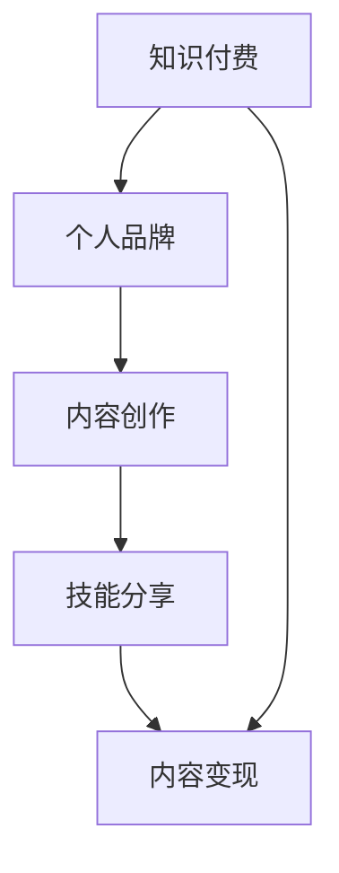

                 

# 程序员利用知识付费打造个人影响力

> 关键词：知识付费, 个人品牌, 技能分享, 内容创作, 程序员成长

## 1. 背景介绍

### 1.1 问题由来
在互联网高速发展的今天，信息技术人才的需求日益增加，而技术日新月异，新手在入门学习过程中难免遇到各种困惑和难题。与此同时，随着自媒体的崛起，知识付费逐渐成为一种流行的知识获取方式。这种变化不仅为知识提供者带来了新的收入模式，也促使他们通过内容创作来建立个人影响力，从而脱颖而出。

### 1.2 问题核心关键点
1. **知识付费的兴起**：互联网技术的高速发展带动了知识付费市场的蓬勃发展，知识付费成为人们获取知识的重要方式之一。
2. **个人品牌的建立**：在知识付费平台通过高质量内容创作，可以有效建立个人品牌，提升个人影响力。
3. **内容创作与变现**：内容创作者需要不断创作优质内容，并找到合适的变现方式，实现内容价值的最大化。
4. **技术技能的提升**：个人通过持续学习和分享，不断提高自身技术水平和影响力，实现职业成长。
5. **变现渠道的多样化**：除了平台课程销售，还包括书籍出版、在线咨询、企业培训等多种变现方式。

### 1.3 问题研究意义
本文章将详细探讨程序员如何通过知识付费构建个人品牌和影响力，为有志于在技术领域发展、提升自身价值的程序员提供指导和建议。此外，还将在内容创作、变现渠道选择、持续学习等方面提供实用策略，助力程序员在职业发展道路上取得更大成就。

## 2. 核心概念与联系

### 2.1 核心概念概述

在深入探讨如何利用知识付费打造个人影响力之前，首先需要明确一些核心概念及其相互联系。

- **知识付费**：指通过购买付费内容、课程、服务等方式，获取知识或技术学习的平台。知识付费平台如知乎、得到、Coursera、Udacity等，提供了丰富的学习资源和变现途径。
- **个人品牌**：指个人通过专业技能、知识分享、社交媒体等渠道，建立自己的专业形象和品牌价值。个人品牌不仅影响在知识付费平台的影响力，也能在求职、企业合作等方面发挥作用。
- **内容创作**：指通过撰写文章、录制视频、创建课程等形式，制作并分享有价值的内容。内容创作是知识付费变现的核心，也是建立个人品牌的重要途径。
- **技能分享**：指将自身掌握的技术、经验、技巧等内容，通过各种渠道分享给有需求的人群。技能分享有助于提升个人影响力，也是知识付费的重要形式之一。
- **内容变现**：指通过内容创作、知识付费、咨询服务等方式，实现内容的商业价值。内容变现有多种途径，如平台课程、电子书、付费咨询等。

这些概念之间的逻辑关系可以通过以下Mermaid流程图来展示：



这个流程图展示了个体通过知识付费构建个人品牌和影响力的大致过程：

1. 利用知识付费平台，通过内容创作，展示自身技术水平。
2. 通过技能分享，帮助他人解决问题，提升个人影响力。
3. 内容创作和技能分享相结合，实现内容变现，不断提升个人价值。

## 3. 核心算法原理 & 具体操作步骤

### 3.1 算法原理概述

利用知识付费构建个人影响力，本质上是信息传播的过程，涉及内容创作与分享的策略、传播渠道的选择、以及如何提升内容的价值与吸引力。以下将从核心算法原理的角度，深入分析这一过程。

1. **内容创作与分享**：内容创作是构建个人影响力的基础。优秀的技术博客、有深度的技术讲解视频、实用的编程课程等，都是内容创作的常见形式。
2. **传播渠道的选择**：知识付费平台、社交媒体、技术社区等渠道，需根据个人定位和目标受众选择最合适的渠道。
3. **提升内容价值**：通过不断学习、积累经验，并结合实际案例，创作出高质量、有深度的内容。

### 3.2 算法步骤详解

构建个人影响力的算法步骤如下：

**Step 1: 确定定位与目标受众**
- 明确自身技能水平和擅长领域。
- 调研目标受众的需求，如新手入门、进阶提高、技术前沿等。
- 选择合适的知识付费平台和社交媒体，如知乎、B站、微信、GitHub等。

**Step 2: 制定内容创作计划**
- 设定创作主题和频率，如每周1-2篇技术博客，每月1个视频教程。
- 规划学习计划，不断学习新知识，更新内容。
- 选择合适的工具和技术，如Markdown、视频剪辑软件、课程制作平台等。

**Step 3: 进行内容创作**
- 内容创作需遵循“有用、有趣、有态度”的原则，注重实用性和趣味性。
- 内容应结合自身经验与实际案例，帮助读者解决具体问题。
- 保持更新频率，及时补充新内容，保持受众的关注度。

**Step 4: 推广与分享**
- 在知识付费平台发布内容，如知乎专栏、得到课程、B站视频等。
- 利用社交媒体宣传，如微博、微信、LinkedIn等，吸引关注。
- 参与技术社区讨论，如Stack Overflow、GitHub、Reddit等，建立技术影响。

**Step 5: 建立个人品牌**
- 通过内容创作和分享，展示技术水平和专业知识。
- 积极参与技术交流和分享，建立专业形象和网络影响力。
- 定期总结，编写书籍或参加技术大会，提升个人品牌的知名度和影响力。

### 3.3 算法优缺点

**优点**：
1. **提升专业技能**：通过持续学习和创作，不断提升自身技术水平，建立专业影响力。
2. **多样化变现**：通过知识付费平台、企业合作、内容合作等多种方式，实现内容价值的最大化。
3. **广泛影响**：通过知识分享，帮助更多人群解决技术难题，提升个人品牌。
4. **自我提升**：知识付费平台的数据反馈，有助于了解受众需求，提升自身创作水平。

**缺点**：
1. **时间和精力投入大**：持续的内容创作和推广需要投入大量时间和精力。
2. **市场竞争激烈**：技术领域竞争激烈，如何脱颖而出是一个挑战。
3. **平台依赖性强**：过度依赖知识付费平台，可能受到平台规则和政策的影响。

### 3.4 算法应用领域

知识付费构建个人影响力的算法，在以下几个领域具有广泛的应用：

- **技术博客和文章**：通过撰写高质量的技术博客和文章，展示个人技术深度，吸引读者关注。
- **在线课程和视频**：制作并发布在线课程和视频，通过知识付费平台变现，提升个人品牌。
- **技术社区和论坛**：积极参与技术社区讨论，分享技术经验，提升个人在技术圈的影响力。
- **开源项目和编程竞赛**：通过开源项目和编程竞赛展示技术能力，获得社区认可。
- **企业合作和顾问咨询**：为企业提供技术支持和咨询服务，通过企业合作提升个人影响力。

## 4. 数学模型和公式 & 详细讲解  
### 4.1 数学模型构建

知识付费和影响力构建的过程，可以抽象为一个信息传播模型。这里，我们将通过数学模型来刻画这一过程。

**内容创作模型**：设内容创作频率为 $f$，每篇文章/视频的深度为 $d$，受众的关注度为 $s$，则总影响力 $I$ 可以表示为：

$$ I = f \times d \times s $$

**内容变现模型**：设内容变现方式为 $c$（如课程、书籍、咨询等），每次变现收入为 $p$，则内容变现总收益 $R$ 为：

$$ R = c \times p $$

**传播模型**：设传播渠道数为 $n$，渠道传播效果为 $e$，则总传播影响力 $P$ 为：

$$ P = n \times e $$

**个人品牌模型**：设品牌价值提升率为 $\beta$，总影响力为 $I_t$，则品牌价值提升量 $V$ 为：

$$ V = \beta \times I_t $$

通过这些数学模型，可以定量分析各个环节对个人品牌和影响力构建的影响，帮助优化策略。

### 4.2 公式推导过程

通过上述模型，我们可以进一步推导出知识付费体系中的关键变量，并进行优化。以内容创作模型为例：

**内容创作频率**：设每天可用于创作的时间为 $T$，创作效率为 $e$，则创作一篇文章所需时间为 $t$，内容创作频率 $f$ 为：

$$ f = \frac{T}{t} $$

**每篇文章的深度**：设每篇文章的平均阅读/观看次数为 $r$，受众的平均关注度为 $s$，则每篇文章的深度 $d$ 为：

$$ d = r \times s $$

**受众的关注度**：设每篇文章的平均传播次数为 $c$，平均传播速度为 $v$，则受众的平均关注度 $s$ 为：

$$ s = c \times v $$

根据上述推导，内容创作模型可进一步细化为：

$$ I = \frac{T}{t} \times r \times s $$

内容变现模型、传播模型和品牌模型亦可进行类似推导，并结合实际数据进行优化。

### 4.3 案例分析与讲解

**案例一：知乎技术博客**
- 作者专注于技术博客创作，每周发布1-2篇文章，每篇文章深度为2-3k字。
- 每篇文章的平均阅读次数为1w次，平均传播速度为0.2次/小时。
- 通过知乎平台变现，每篇文章收入为500元，每月发布4篇文章。
- 每天可用于创作的时间为4小时，创作效率为每小时1000字。

根据上述数据，作者每月总影响力 $I$ 为：

$$ I = \frac{4 \times 1000}{1000} \times 10000 \times 0.2 \times 4 = 320,000 $$

每月内容变现总收益 $R$ 为：

$$ R = 4 \times 500 = 2000 $$

每月品牌价值提升量 $V$ 为：

$$ V = \beta \times 320,000 $$

通过优化内容创作频率、文章深度和传播渠道，进一步提升个人品牌价值。

**案例二：B站技术视频**
- 作者每月发布1个30分钟的视频教程，每篇文章的深度为2-3k字。
- 每个视频的平均观看次数为10w次，平均传播速度为0.1次/小时。
- 通过B站平台变现，每个视频收入为2000元，每月发布1个视频。
- 每天可用于创作的时间为2小时，创作效率为每小时1000字。

根据上述数据，作者每月总影响力 $I$ 为：

$$ I = \frac{2 \times 1000}{1000} \times 100000 \times 0.1 \times 1 = 2000 $$

每月内容变现总收益 $R$ 为：

$$ R = 2000 \times 1 = 2000 $$

每月品牌价值提升量 $V$ 为：

$$ V = \beta \times 2000 $$

通过优化视频教程的深度和传播渠道，进一步提升个人品牌价值。

## 5. 项目实践：代码实例和详细解释说明

### 5.1 开发环境搭建

在进行知识付费平台内容创作和推广的过程中，以下工具和资源是必不可少的：

- **内容创作工具**：Markdown、Latex、GitHub等文本创作工具。
- **视频制作工具**：Adobe Premiere Pro、Final Cut Pro、VLC Media Player等视频剪辑软件。
- **在线课程平台**：Udemy、Coursera、edX等在线课程制作平台。
- **社交媒体工具**：Twitter、LinkedIn、B站、知乎等社交平台。
- **数据分析工具**：Google Analytics、Kaggle等数据分析工具。

### 5.2 源代码详细实现

以下是一个简单的内容创作平台（如知乎）的代码实现，展示了如何通过API接口发布内容：

```python
import requests

# 设置API端点
url = 'https://api.example.com/content/publish'

# 设置请求头
headers = {'Authorization': 'Bearer YOUR_API_KEY'}

# 设置内容
content = {
    'title': '如何高效使用Git',
    'body': 'Git是一个强大的版本控制系统，以下是一些使用技巧：\n\n1. 分支合并\n2. 版本回滚\n3. 代码重构\n\n更多细节可参考：[链接]'
}

# 发送请求
response = requests.post(url, headers=headers, json=content)

# 打印响应结果
print(response.json())
```

### 5.3 代码解读与分析

上述代码展示了如何使用API接口发布内容到知识付费平台。具体步骤如下：

1. 导入必要的库：requests用于发送HTTP请求。
2. 设置API端点和请求头，保证认证和授权。
3. 设置发布内容的标题和正文。
4. 使用post方法发送请求，将内容提交到平台。
5. 打印服务器响应结果，通常是状态码和返回的JSON数据。

### 5.4 运行结果展示

**结果展示**：
- 成功发布内容后，平台返回一个JSON格式的响应，包含发布ID、状态码等信息。
- 内容发布到平台后，可通过查看文章阅读量、评论数等数据，评估内容影响力。

## 6. 实际应用场景

### 6.1 技术博客平台
技术博客是程序员展示技术能力和建立个人品牌的重要平台。通过不断发布高质量的技术文章，可以吸引大量技术爱好者，提升个人影响力。

### 6.2 在线教育平台
在线教育平台如Coursera、Udacity、Udemy等，是程序员变现个人影响力的重要渠道。通过制作和发布高质量的课程内容，可以有效吸引学生和学员，实现内容的商业化。

### 6.3 社交媒体平台
社交媒体如Twitter、LinkedIn、Facebook等，是程序员展示个人专业技能、交流技术经验的重要平台。通过积极参与技术讨论和分享，可以建立专业形象，扩大个人影响力。

### 6.4 开源社区和论坛
开源社区如GitHub、Stack Overflow、Reddit等，是程序员分享技术经验、展示技术成果的重要场所。通过积极参与开源项目和编程竞赛，可以提升个人知名度和影响力。

### 6.5 企业合作和技术咨询
企业合作和技术咨询是程序员变现内容价值的高级形式。通过为公司提供技术支持和咨询服务，可以获取更高的报酬，提升个人品牌。

## 7. 工具和资源推荐

### 7.1 学习资源推荐

- **在线课程平台**：Coursera、edX、Udacity等平台提供大量优质课程，涵盖计算机科学各个方向。
- **编程工具和语言**：Python、Java、C++等主流编程语言，以及Visual Studio Code、Sublime Text等IDE工具。
- **技术博客平台**：Medium、TechCrunch、博客园等平台，提供丰富的技术博客内容。
- **社交媒体平台**：Twitter、LinkedIn、Facebook等，用于技术交流和品牌推广。
- **开源社区和论坛**：GitHub、Stack Overflow、Reddit等，用于开源项目和编程竞赛。

### 7.2 开发工具推荐

- **IDE开发环境**：Visual Studio Code、Sublime Text、PyCharm等IDE工具。
- **版本控制**：Git、SVN等版本控制工具。
- **文档和笔记**：Notion、Evernote等笔记工具。
- **项目管理**：Jira、Trello等项目管理工具。
- **协作工具**：Slack、Microsoft Teams等协作工具。

### 7.3 相关论文推荐

- **内容创作与传播**：J.word-of-mouth J word-of-mouth communication: The psychology of word-of-mouth communication and its effects on consumer purchase intentions —— A literature review。
- **内容变现与价值**：S.virality and viral marketing theories and concepts —— A literature review and new perspective。
- **品牌建设与影响**：S.brand management —— An integrative framework based on the resource-based view。

## 8. 总结：未来发展趋势与挑战

### 8.1 总结

本文深入探讨了程序员如何通过知识付费构建个人品牌和影响力，从内容创作、传播渠道、品牌建设等多个角度提供实用策略。通过持续学习和内容创作，程序员不仅可以提升自身技术水平，还能获得稳定的收入和广泛的影响力。

### 8.2 未来发展趋势

知识付费和影响力构建的未来趋势包括：

1. **个性化内容创作**：基于用户兴趣和行为数据，提供个性化推荐，提升内容精准度。
2. **内容社交化**：利用社交网络和社区平台，分享和推广内容，扩大影响力。
3. **智能推荐系统**：利用机器学习和推荐算法，提高内容发现和阅读效率。
4. **多平台协同**：通过跨平台的内容发布和推广，提升整体影响力。
5. **区块链技术**：利用区块链技术，保证内容创作的版权和收益分配透明公正。
6. **元宇宙和虚拟现实**：通过虚拟现实和元宇宙技术，提供沉浸式学习体验，提升内容的吸引力和传播力。

### 8.3 面临的挑战

在知识付费和影响力构建的过程中，仍面临以下挑战：

1. **时间管理**：内容创作和推广需要投入大量时间，如何平衡学习和工作是一个挑战。
2. **内容质量**：如何持续创作高质量、有深度的内容，吸引和留住受众。
3. **平台依赖**：过度依赖单一平台，可能受到平台政策变化的影响。
4. **变现风险**：如何选择合适的变现方式，规避市场风险。
5. **品牌维护**：如何维护个人品牌，避免被不实信息影响。
6. **技术更新**：保持技术知识的时效性，不断学习和更新。

### 8.4 研究展望

未来的研究方向包括：

1. **多模态内容创作**：结合图像、视频、音频等多模态内容，提升内容丰富度。
2. **内容自动化生成**：利用AI技术自动生成内容，提升创作效率。
3. **社交网络分析**：利用社交网络分析技术，深入了解受众行为和需求。
4. **区块链技术应用**：利用区块链技术，构建内容版权保护和收益分配体系。
5. **元宇宙和虚拟现实**：结合元宇宙和虚拟现实技术，提供沉浸式学习体验。
6. **跨学科融合**：结合心理学、传播学等学科，提升内容创作和传播的科学性。

通过持续的研究和创新，知识付费和影响力构建将迎来新的突破，为技术从业者提供更多的发展机会。

## 9. 附录：常见问题与解答

### Q1: 如何选择合适的知识付费平台？

A: 选择合适的知识付费平台需考虑以下因素：
1. 平台的用户基础和受众定位。
2. 平台的用户互动和社交功能。
3. 平台的课程质量和价格。
4. 平台的收益分配和版权保护机制。

### Q2: 如何提升内容创作的质量？

A: 提升内容创作质量的方法包括：
1. 持续学习新技术和知识，保持内容的时效性和深度。
2. 多角度思考问题，结合实际案例，提升内容的实用性和可读性。
3. 利用数据分析工具，了解受众需求和反馈，不断优化内容。

### Q3: 如何平衡内容创作与工作时间？

A: 平衡内容创作与工作时间的方法包括：
1. 制定合理的创作计划，每天固定时间创作。
2. 利用碎片时间，如通勤、午休等时间，进行内容创作。
3. 优化创作流程，提高创作效率，减少不必要的时间浪费。

### Q4: 如何规避内容版权和变现风险？

A: 规避内容版权和变现风险的方法包括：
1. 创作原创内容，明确版权归属。
2. 利用区块链技术，保护内容版权和收益分配透明公正。
3. 选择合适的变现方式，规避市场风险。

### Q5: 如何利用区块链技术保护内容版权？

A: 利用区块链技术保护内容版权的方法包括：
1. 使用区块链技术记录内容的创作和传播过程。
2. 使用智能合约自动分配版权收益。
3. 利用区块链的不可篡改性，保护内容版权不被侵犯。

通过上述分析，可以看出知识付费和影响力构建是一个多维度的复杂过程。程序员需综合考虑内容创作、平台选择、变现方式等多个方面，持续优化策略，实现个人价值最大化。

