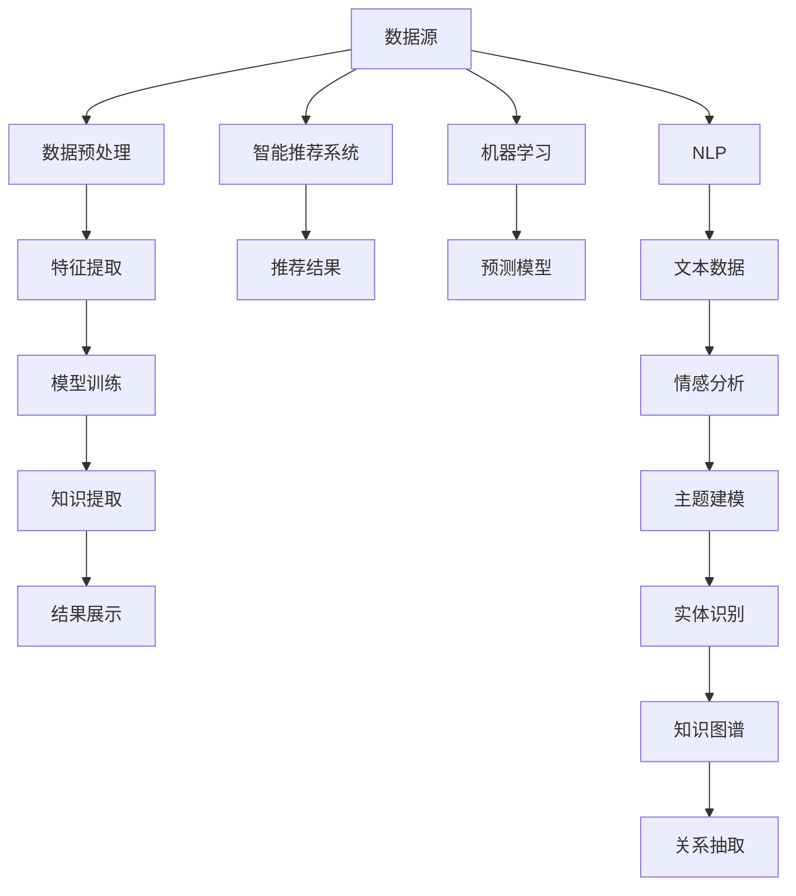

                 

# 程序员利用知识发现引擎提高竞争优势

> 关键词：知识发现引擎、智能推荐、数据挖掘、自然语言处理(NLP)、机器学习、竞争优势、个性化推荐系统

## 1. 背景介绍

在当今激烈的市场竞争中，程序员和企业都在不断寻求提升竞争优势的策略。随着大数据和人工智能技术的迅猛发展，利用知识发现引擎技术成为许多企业的首选方案。知识发现引擎（Knowledge Discovery Engine, KDE）是一种从大量数据中挖掘和提取知识的软件系统，能够帮助程序员和企业快速找到有价值的信息，提高决策效率和竞争力。

### 1.1 问题由来

数据挖掘是大数据分析的重要组成部分，通过从大数据中提取出有价值的信息，为企业决策提供支持。然而，传统的数据挖掘方法往往需要大量的人力资源和时间，且难以处理复杂非结构化数据。随着人工智能技术的进步，知识发现引擎利用机器学习和自然语言处理（NLP）等技术，从大规模数据中自动发现模式和关联，提升了数据挖掘的效率和精度。

### 1.2 问题核心关键点

知识发现引擎的核心思想是利用数据挖掘技术，从海量数据中自动提取和发现知识。其关键点包括：

- 数据源：包括结构化数据、非结构化数据、多模态数据等。
- 数据预处理：对数据进行清洗、归一化、特征工程等预处理操作，以适应机器学习模型的要求。
- 特征提取：利用文本、图像、音频等不同类型数据，提取特征向量或特征表示。
- 模型训练：选择适当的机器学习模型，训练模型参数。
- 知识提取：通过数据挖掘算法，从模型中提取有价值的知识模式和关联。
- 结果展示：以可视化、报表、推荐系统等方式展示挖掘结果，辅助决策。

知识发现引擎的成功依赖于数据质量、算法选择、模型训练等多个因素。如何有效地处理和分析大规模数据，如何从数据中提取有价值的信息，是知识发现引擎应用中的核心挑战。

### 1.3 问题研究意义

知识发现引擎技术在提升程序员和企业竞争力方面具有重要意义：

1. **快速决策**：通过自动化的知识发现过程，程序员和企业可以快速找到关键信息，缩短决策周期，提高响应速度。
2. **提升效率**：减少人工干预，降低数据挖掘成本，提升工作效率和准确性。
3. **增强竞争力**：基于数据驱动的决策，能够更好地理解和适应市场需求，优化产品和服务，增强市场竞争力。
4. **推动创新**：知识发现引擎能够帮助发现创新点，激发新的业务模式和商业机会。
5. **风险控制**：通过分析历史数据，识别潜在风险，提高风险管理能力。

## 2. 核心概念与联系

### 2.1 核心概念概述

为更好地理解知识发现引擎的原理和应用，本节将介绍几个核心概念及其相互关系：

- **知识发现引擎（KDE）**：一种利用数据挖掘技术，从大规模数据中提取和发现知识的软件系统。
- **机器学习（ML）**：利用数据和算法构建预测模型的过程，知识发现引擎的核心技术之一。
- **自然语言处理（NLP）**：处理和分析自然语言的技术，用于从文本数据中提取关键信息和模式。
- **数据挖掘（DM）**：从数据中自动发现模式的统计学方法和工具。
- **智能推荐系统（Recommendation System）**：根据用户历史行为，推荐相关产品或内容的系统，常应用于电商、社交媒体等场景。

这些核心概念之间的逻辑关系可以通过以下Mermaid流程图来展示：



这个流程图展示了知识发现引擎的工作流程：

1. 从数据源获取数据。
2. 数据预处理，清洗和归一化数据。
3. 特征提取，从数据中提取出有意义的特征。
4. 模型训练，选择合适的机器学习模型进行训练。
5. 知识提取，从训练好的模型中发现知识模式和关联。
6. 结果展示，将发现的知识以可视化、报表等方式展示。

同时，知识发现引擎还与智能推荐系统紧密相关。通过分析用户行为数据，智能推荐系统可以推荐相关产品或内容，而知识发现引擎可以用于发现用户兴趣和行为模式，进一步优化推荐效果。

## 3. 核心算法原理 & 具体操作步骤

### 3.1 算法原理概述

知识发现引擎的核心算法原理包括数据挖掘、机器学习和自然语言处理等多个方面。其总体框架如下：

1. **数据预处理**：清洗、归一化、特征工程等操作，准备输入数据。
2. **特征提取**：根据数据类型，选择合适的特征提取方法，提取出有意义的特征。
3. **模型训练**：选择合适的机器学习模型，训练模型参数。
4. **知识提取**：利用数据挖掘算法，从训练好的模型中提取有价值的知识模式和关联。
5. **结果展示**：将发现的知识以可视化、报表等方式展示，辅助决策。

### 3.2 算法步骤详解

以下是一个典型的知识发现引擎算法流程：

**Step 1: 数据预处理**

1. 数据清洗：删除无关、重复、错误的数据。
2. 数据归一化：将数据缩放到相同的范围，提高模型的稳定性。
3. 特征工程：根据任务需求，选择或构造特征，减少数据维度，提高模型效果。

**Step 2: 特征提取**

1. 文本特征提取：利用NLP技术，从文本中提取关键词、主题、情感等信息。
2. 图像特征提取：使用卷积神经网络（CNN）等技术，从图像中提取特征。
3. 音频特征提取：使用循环神经网络（RNN）等技术，从音频中提取特征。

**Step 3: 模型训练**

1. 选择合适的机器学习算法，如回归、分类、聚类等。
2. 设定训练参数，包括学习率、迭代次数等。
3. 训练模型，调整参数以最小化损失函数。

**Step 4: 知识提取**

1. 利用关联规则挖掘算法，如Apriori、FP-Growth等，发现数据中的模式和关联。
2. 利用聚类算法，如K-means、DBSCAN等，对数据进行分组和分类。
3. 利用分类算法，如支持向量机（SVM）、随机森林等，进行分类预测。

**Step 5: 结果展示**

1. 利用可视化工具，如Tableau、PowerBI等，展示挖掘结果。
2. 生成报表，记录分析结果，提供决策依据。
3. 集成智能推荐系统，根据挖掘结果推荐相关产品或内容。

### 3.3 算法优缺点

知识发现引擎的优点包括：

- 自动化程度高：能够自动从数据中发现知识，减少人工干预。
- 处理能力强大：可以处理大规模数据，挖掘深层信息。
- 结果可解释：发现的知识可以可视化展示，易于理解。
- 广泛应用：适用于电商推荐、金融分析、健康医疗等多个领域。

同时，知识发现引擎也存在一些缺点：

- 对数据质量要求高：数据源和数据质量直接影响算法效果。
- 模型选择复杂：不同类型的数据需要不同的特征提取和模型训练方法。
- 解释性不足：挖掘出的知识往往缺乏可解释性，难以理解其内在的逻辑关系。
- 计算资源消耗大：处理大规模数据需要强大的计算资源，部署成本高。

### 3.4 算法应用领域

知识发现引擎在多个领域得到了广泛应用，包括但不限于：

- **电子商务**：通过分析用户行为数据，优化推荐系统，提升用户体验和销售额。
- **金融分析**：利用大数据分析，识别风险和机会，优化投资策略。
- **医疗健康**：通过分析医疗数据，预测疾病风险，提高诊断效率。
- **智能客服**：利用自然语言处理技术，自动分析用户问题，提供个性化回答。
- **市场营销**：分析客户数据，优化营销策略，提升广告投放效果。
- **资源管理**：利用数据挖掘技术，优化资源分配，提升运营效率。

以上领域只是冰山一角，随着技术的不断发展，知识发现引擎的应用场景将会更加广泛。

## 4. 数学模型和公式 & 详细讲解 & 举例说明

### 4.1 数学模型构建

知识发现引擎的数学模型主要包括以下几个部分：

- 数据预处理：利用归一化、标准化等方法，将数据转换到标准形式。
- 特征提取：利用TF-IDF、Word2Vec等技术，将文本数据转换为特征向量。
- 模型训练：利用回归、分类、聚类等算法，训练预测模型。
- 知识提取：利用关联规则挖掘算法，发现数据中的模式和关联。

### 4.2 公式推导过程

以文本分类任务为例，推导知识发现引擎的数学模型。

假设有一个文本分类任务，目标是将文本分为正面、负面、中性三类。已知训练集 $D=\{(x_i,y_i)\}_{i=1}^N$，其中 $x_i$ 为文本，$y_i$ 为分类标签。利用NLP技术，从文本中提取特征，构建特征向量 $x_i \in R^d$。

定义分类模型为 $M(x;\theta) = sigmoid(Wx + b)$，其中 $W \in R^{d \times 3}$，$b \in R^3$ 为模型参数，$sigmoid$ 函数将模型输出映射到 [0,1] 区间，表示属于正类的概率。

模型的损失函数为交叉熵损失函数：

$$
\mathcal{L}(\theta) = -\frac{1}{N} \sum_{i=1}^N [y_i\log M(x_i;\theta) + (1-y_i)\log(1-M(x_i;\theta))]
$$

利用梯度下降等优化算法，最小化损失函数：

$$
\theta \leftarrow \theta - \eta \nabla_{\theta}\mathcal{L}(\theta)
$$

其中 $\eta$ 为学习率。

### 4.3 案例分析与讲解

以智能推荐系统为例，分析知识发现引擎的实际应用。

假设有一个电商网站，用户可以通过浏览、购买等行为产生数据。利用知识发现引擎，可以从用户行为数据中发现用户的兴趣和偏好，推荐相关商品。

具体步骤如下：

1. 数据预处理：清洗用户行为数据，删除异常值和重复记录。
2. 特征提取：从用户行为数据中提取特征，如浏览时间、浏览次数、购买金额等。
3. 模型训练：使用协同过滤算法（如基于用户的协同过滤、基于物品的协同过滤），训练推荐模型。
4. 知识提取：利用聚类算法，将用户分为不同的兴趣群体。
5. 结果展示：通过可视化工具，展示用户兴趣和推荐结果，辅助决策。

## 5. 项目实践：代码实例和详细解释说明

### 5.1 开发环境搭建

在进行知识发现引擎项目实践前，我们需要准备好开发环境。以下是使用Python进行知识发现引擎开发的环境配置流程：

1. 安装Anaconda：从官网下载并安装Anaconda，用于创建独立的Python环境。

2. 创建并激活虚拟环境：
```bash
conda create -n kde-env python=3.8 
conda activate kde-env
```

3. 安装必要的工具包：
```bash
pip install pandas numpy scikit-learn matplotlib seaborn jupyter notebook ipython
```

4. 安装推荐系统库：
```bash
pip install scipy pyamg
```

完成上述步骤后，即可在`kde-env`环境中开始知识发现引擎的实践。

### 5.2 源代码详细实现

下面我们以电商推荐系统为例，给出使用Python和Scikit-learn库构建知识发现引擎的代码实现。

```python
import pandas as pd
from sklearn.model_selection import train_test_split
from sklearn.metrics import accuracy_score
from sklearn.feature_extraction.text import TfidfVectorizer
from sklearn.ensemble import RandomForestClassifier
from sklearn.metrics import classification_report
from sklearn.pipeline import make_pipeline

# 加载数据
df = pd.read_csv('user_behavior.csv')

# 数据预处理
X = df.drop(['user_id', 'item_id'], axis=1)
y = df['label']

# 划分训练集和测试集
X_train, X_test, y_train, y_test = train_test_split(X, y, test_size=0.2, random_state=42)

# 特征提取
tfidf = TfidfVectorizer(max_features=1000, stop_words='english')
X_train_tfidf = tfidf.fit_transform(X_train)
X_test_tfidf = tfidf.transform(X_test)

# 模型训练
clf = RandomForestClassifier(n_estimators=100, random_state=42)
clf.fit(X_train_tfidf, y_train)

# 模型评估
y_pred = clf.predict(X_test_tfidf)
print('Accuracy:', accuracy_score(y_test, y_pred))
print(classification_report(y_test, y_pred))
```

在这个示例中，我们使用了Scikit-learn库构建了一个基于随机森林的推荐系统。首先加载用户行为数据，进行数据预处理和特征提取，然后使用随机森林模型进行训练和评估。

### 5.3 代码解读与分析

让我们再详细解读一下关键代码的实现细节：

**数据加载与预处理**

```python
# 加载数据
df = pd.read_csv('user_behavior.csv')

# 数据预处理
X = df.drop(['user_id', 'item_id'], axis=1)
y = df['label']
```

我们首先使用Pandas库加载用户行为数据，然后使用drop方法删除无关的列，保留用户行为和标签。

**特征提取**

```python
# 特征提取
tfidf = TfidfVectorizer(max_features=1000, stop_words='english')
X_train_tfidf = tfidf.fit_transform(X_train)
X_test_tfidf = tfidf.transform(X_test)
```

我们使用了TF-IDF特征提取器，将文本数据转换为特征向量。max_features参数指定了最大特征数，stop_words参数指定了停用词列表，去除了无关的词。

**模型训练**

```python
# 模型训练
clf = RandomForestClassifier(n_estimators=100, random_state=42)
clf.fit(X_train_tfidf, y_train)
```

我们选择了随机森林模型，使用了100棵决策树，并设定了随机状态。然后使用fit方法进行模型训练。

**模型评估**

```python
# 模型评估
y_pred = clf.predict(X_test_tfidf)
print('Accuracy:', accuracy_score(y_test, y_pred))
print(classification_report(y_test, y_pred))
```

我们使用准确率和分类报告对模型进行评估，打印出评估结果。

## 6. 实际应用场景

### 6.1 智能推荐系统

智能推荐系统是知识发现引擎最常见的应用场景之一。电商、视频、音乐等平台通过分析用户行为数据，推荐相关商品、视频或歌曲，提升用户体验和平台收益。

知识发现引擎在智能推荐系统中的应用流程如下：

1. 数据收集：收集用户行为数据，包括浏览记录、购买记录、评分等。
2. 数据清洗和预处理：删除无关、重复数据，处理缺失值和异常值。
3. 特征提取：从用户行为数据中提取特征，如浏览时间、购买金额、评分等。
4. 模型训练：选择合适的推荐算法，如协同过滤、基于内容的推荐、深度学习推荐等，训练推荐模型。
5. 知识提取：利用聚类算法，将用户分为不同的兴趣群体。
6. 结果展示：通过可视化工具，展示用户兴趣和推荐结果，辅助决策。

智能推荐系统通过自动化的知识发现过程，减少了人工干预，提升了推荐效果和用户满意度。

### 6.2 金融分析

金融分析是知识发现引擎在企业中的应用之一。通过分析历史金融数据，企业可以发现市场趋势、识别风险和机会，优化投资策略。

知识发现引擎在金融分析中的应用流程如下：

1. 数据收集：收集历史金融数据，包括股票价格、交易量、经济指标等。
2. 数据清洗和预处理：删除无关、重复数据，处理缺失值和异常值。
3. 特征提取：从金融数据中提取特征，如股票价格波动、市场情绪、经济指标等。
4. 模型训练：选择合适的机器学习算法，如回归、分类、聚类等，训练预测模型。
5. 知识提取：利用关联规则挖掘算法，发现市场趋势和异常情况。
6. 结果展示：通过可视化工具，展示市场趋势和风险分析结果，辅助决策。

金融分析通过自动化的知识发现过程，帮助企业从海量数据中提取有价值的信息，优化投资策略，降低风险。

### 6.3 医疗健康

医疗健康是知识发现引擎的重要应用领域之一。通过分析医疗数据，医疗机构可以预测疾病风险、优化诊疗方案，提高医疗质量。

知识发现引擎在医疗健康中的应用流程如下：

1. 数据收集：收集医疗数据，包括病历、检查报告、临床数据等。
2. 数据清洗和预处理：删除无关、重复数据，处理缺失值和异常值。
3. 特征提取：从医疗数据中提取特征，如病历描述、检查结果、症状等。
4. 模型训练：选择合适的机器学习算法，如回归、分类、聚类等，训练预测模型。
5. 知识提取：利用关联规则挖掘算法，发现疾病模式和风险因素。
6. 结果展示：通过可视化工具，展示疾病风险分析和诊疗方案推荐结果，辅助决策。

医疗健康通过自动化的知识发现过程，帮助医疗机构从海量医疗数据中提取有价值的信息，预测疾病风险，优化诊疗方案。

## 7. 工具和资源推荐

### 7.1 学习资源推荐

为了帮助开发者系统掌握知识发现引擎的理论基础和实践技巧，这里推荐一些优质的学习资源：

1. 《Python数据科学手册》：介绍Python数据科学的基础知识，包括Pandas、NumPy、Scikit-learn等库的使用。
2. 《数据挖掘导论》：介绍数据挖掘的基本概念和算法，适合初学者入门。
3. 《机器学习实战》：通过实战案例，介绍机器学习模型的构建和应用。
4. 《Python自然语言处理》：介绍NLP技术的基本概念和应用，适合NLP初学者。
5. 《推荐系统实战》：介绍推荐系统的基本概念和算法，适合推荐系统开发人员。

通过对这些资源的学习实践，相信你一定能够快速掌握知识发现引擎的精髓，并用于解决实际的业务问题。

### 7.2 开发工具推荐

高效的开发离不开优秀的工具支持。以下是几款用于知识发现引擎开发的常用工具：

1. Python：简单易学的脚本语言，适合快速迭代研究。
2. Pandas：强大的数据分析库，适合数据清洗和预处理。
3. Scikit-learn：机器学习库，适合模型训练和评估。
4. PyTorch：深度学习框架，适合复杂模型的训练和推理。
5. TensorBoard：可视化工具，适合监测模型训练状态。
6. Weights & Biases：实验跟踪工具，适合记录和分析模型训练过程。

合理利用这些工具，可以显著提升知识发现引擎开发的效率，加快创新迭代的步伐。

### 7.3 相关论文推荐

知识发现引擎的研究源于学界的持续研究。以下是几篇奠基性的相关论文，推荐阅读：

1. 《A Framework for Relational Reasoning and Knowledge Discovery》：提出了知识发现的基本框架，包括数据挖掘和关联规则挖掘算法。
2. 《Knowledge Discovery in Databases》：介绍数据挖掘的各个阶段和技术，适合全面了解知识发现引擎的理论基础。
3. 《Machine Learning》：介绍机器学习的基本概念和算法，适合学习知识发现引擎的算法实现。
4. 《Deep Learning for Recommender Systems》：介绍深度学习在推荐系统中的应用，适合学习深度学习推荐模型的实现。
5. 《Natural Language Processing with Python》：介绍NLP技术的基本概念和应用，适合学习NLP技术的实现。

这些论文代表了大数据挖掘领域的发展脉络。通过学习这些前沿成果，可以帮助研究者把握学科前进方向，激发更多的创新灵感。

## 8. 总结：未来发展趋势与挑战

### 8.1 总结

本文对知识发现引擎的原理和应用进行了全面系统的介绍。首先阐述了知识发现引擎的核心思想和应用背景，明确了知识发现引擎在提升程序员和企业竞争力方面的重要意义。其次，从原理到实践，详细讲解了知识发现引擎的数学模型和关键步骤，给出了实际应用中的代码实例。同时，本文还探讨了知识发现引擎在电商、金融、医疗等多个领域的应用场景，展示了其在提升决策效率和竞争优势方面的巨大潜力。

通过本文的系统梳理，可以看到，知识发现引擎作为数据挖掘技术的核心工具，在提升程序员和企业竞争力方面具有重要价值。未来，随着数据量的不断增长和技术的不断进步，知识发现引擎的应用场景将更加广泛，其对程序员和企业的助力也将更加显著。

### 8.2 未来发展趋势

展望未来，知识发现引擎技术将呈现以下几个发展趋势：

1. **自动化程度提高**：知识发现引擎将更加自动化，能够自动从大规模数据中发现知识，减少人工干预。
2. **跨领域应用扩展**：知识发现引擎将拓展到更多领域，如医疗健康、智能制造、智慧城市等，提升跨领域应用能力。
3. **多模态数据融合**：知识发现引擎将更好地处理多模态数据，融合文本、图像、音频等不同类型的数据，提高挖掘效果。
4. **实时性提升**：知识发现引擎将具备更强的实时处理能力，能够及时响应业务需求，提升决策速度。
5. **可解释性增强**：知识发现引擎将更好地解释挖掘出的知识，提供更易理解的结果。
6. **集成AI技术**：知识发现引擎将与AI技术深度融合，提升模型效果和应用场景。

以上趋势凸显了知识发现引擎技术的广阔前景。这些方向的探索发展，必将进一步提升知识发现引擎的效率和精度，为程序员和企业带来更多的竞争优势。

### 8.3 面临的挑战

尽管知识发现引擎技术已经取得了显著成就，但在迈向更加智能化、普适化应用的过程中，它仍面临着诸多挑战：

1. **数据质量问题**：数据源和数据质量直接影响算法效果，如何保证数据质量和数据完整性，是知识发现引擎应用的瓶颈。
2. **算法选择复杂**：不同类型的数据需要不同的特征提取和模型训练方法，如何选择和优化算法，是知识发现引擎应用的难点。
3. **模型解释性不足**：挖掘出的知识往往缺乏可解释性，难以理解其内在的逻辑关系，如何提升模型解释性，是知识发现引擎应用的挑战。
4. **计算资源消耗大**：处理大规模数据需要强大的计算资源，部署成本高，如何优化资源消耗，是知识发现引擎应用的关键。

### 8.4 研究展望

面向未来，知识发现引擎技术需要在以下几个方面寻求新的突破：

1. **探索新的数据源**：如何从更多的数据源中发现知识，提升知识发现引擎的覆盖范围和应用效果。
2. **引入AI技术**：如何将AI技术引入知识发现引擎，提升算法的精度和实时性。
3. **增强模型解释性**：如何提升知识发现引擎的模型解释性，提供更易理解的结果。
4. **优化算法选择**：如何根据数据类型和业务需求，选择和优化算法，提高知识发现引擎的效果。
5. **降低计算资源消耗**：如何优化知识发现引擎的计算资源消耗，降低部署成本。

这些研究方向将推动知识发现引擎技术向更高的台阶发展，为程序员和企业带来更多的竞争优势。相信随着技术的发展和应用的深入，知识发现引擎必将在各个领域发挥更大的作用。

## 9. 附录：常见问题与解答

**Q1：知识发现引擎和数据挖掘有什么区别？**

A: 知识发现引擎是数据挖掘技术的高级形式，强调从数据中发现和提取知识，用于辅助决策。而数据挖掘主要关注数据的统计特征和规律，较少关注知识提取和应用。

**Q2：知识发现引擎在应用中需要注意哪些问题？**

A: 知识发现引擎在应用中需要注意以下问题：
1. 数据质量：确保数据源的准确性和完整性。
2. 数据预处理：清洗、归一化、特征工程等操作。
3. 算法选择：选择合适的算法和模型。
4. 模型解释性：确保模型结果的可解释性。
5. 计算资源：优化资源消耗，降低部署成本。

**Q3：如何提升知识发现引擎的解释性？**

A: 提升知识发现引擎的解释性，可以通过以下方法：
1. 增加模型可解释性：使用可解释的模型，如决策树、线性回归等。
2. 可视化结果：通过可视化工具展示挖掘结果，提供易理解的结论。
3. 结合业务知识：结合业务领域的知识，解释模型输出的原因。

这些方法可以帮助提升知识发现引擎的解释性，提高其应用效果和可信度。

---

作者：禅与计算机程序设计艺术 / Zen and the Art of Computer Programming

