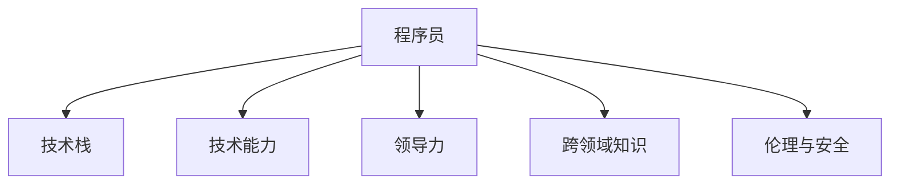

                 

# 程序员在知识经济时代的职业定位与发展

## 1. 背景介绍

### 1.1 问题由来
随着信息技术的飞速发展，全球正处于一个前所未有的知识经济时代。人工智能(AI)、大数据、云计算等前沿技术的普及，使得程序员这一传统职业面临新的挑战和机遇。

近年来，由于机器学习、深度学习等先进技术的出现，传统的软件开发模式正在发生深刻变化。数据分析、机器学习、智能系统设计等知识技能已成为新型程序员必备的能力。

### 1.2 问题核心关键点
程序员在知识经济时代的职业定位与发展，关键在于如何提升自身能力，适应新的技术和行业需求。

1. **技术深度与广度：** 在深度方面，掌握某种编程语言、框架或技术的底层原理；在广度方面，跨领域知识学习，如数据科学、机器学习、云计算等。
2. **团队协作与领导力：** 除了技术能力，强大的团队协作和领导力对于跨职能团队的合作也至关重要。
3. **终身学习与创新能力：** 技术日新月异，程序员必须不断学习新技能，保持创新思维。
4. **跨界融合能力：** 信息技术与其他行业结合，如医疗、金融、教育等，程序员需具备跨界融合能力。
5. **伦理与安全性：** 开发系统的安全性、公平性、隐私保护等伦理问题，程序员必须重视。

### 1.3 问题研究意义
对于程序员而言，准确把握职业定位和发展方向，不仅能提升个人职业发展前景，还能促进整个行业健康发展。在知识经济时代，程序员的价值将不仅仅局限于代码编写，而是涉及多方面的技术与管理能力。

## 2. 核心概念与联系

### 2.1 核心概念概述

为更好地理解程序员在知识经济时代的职业定位与发展，本节将介绍几个密切相关的核心概念：

- **程序员（Programmer）**：指那些能够编写、测试、调试计算机程序，并将其转化为可执行软件的人。程序员不仅是技术开发者，也是问题解决者。
- **技术栈（Technology Stack）**：程序员所掌握的技术组合，包括编程语言、框架、工具和库等。技术栈的宽度与深度影响程序员解决复杂问题的能力。
- **技术能力与领导力（Technical Skill & Leadership）**：技术能力是指编程、算法设计等专业技能；领导力则是协调团队、管理项目的能力。
- **跨领域知识（Cross-Disciplinary Knowledge）**：程序员需具备跨学科的知识，如数据科学、人工智能、云计算等，以适应技术发展的需要。
- **伦理与安全（Ethics & Security）**：编程应注重道德和法律问题，避免不道德行为，确保系统的安全性与隐私保护。

这些核心概念之间的逻辑关系可以通过以下Mermaid流程图来展示：



这个流程图展示了的核心概念及其之间的关系：

1. 程序员是技术栈的掌握者。
2. 程序员的技术能力是核心竞争力。
3. 领导力是团队协作的关键。
4. 跨领域知识是应对复杂问题的利器。
5. 伦理与安全是编程中的重要考量。

## 3. 核心算法原理 & 具体操作步骤
### 3.1 算法原理概述

程序员在知识经济时代的职业定位与发展，本质上是一个持续学习与技能提升的过程。其核心思想是：通过不断学习新技术、新知识，提升个人能力，同时结合团队协作与领导力，实现技术与管理能力的全面提升。

形式化地，假设程序员在某一时刻具备的技能集为 $S_t$，通过学习与实践，其技能集在下一个时刻变为 $S_{t+1}$。则提升技能的过程可以表示为：

$$
S_{t+1} = f(S_t, L)
$$

其中 $L$ 为学习机会与实践经验，$f$ 为技能提升的映射函数。

### 3.2 算法步骤详解

程序员职业定位与发展的具体步骤包括：

**Step 1: 评估现有技能与需求差距**
- 定期评估个人技能，包括技术能力、团队协作能力、跨领域知识等。
- 确定当前技能与职业目标之间的差距，明确需要提升的技能方向。

**Step 2: 制定学习与发展计划**
- 根据评估结果，制定短期和长期的学习计划，包括在线课程、书籍、项目实践等。
- 设定具体目标，如掌握新语言、完成特定项目等。

**Step 3: 执行与反馈**
- 执行学习计划，参与相关项目或实践，积累经验。
- 定期进行技能评估，及时调整学习策略。

**Step 4: 持续优化与迭代**
- 根据实际情况与反馈，持续优化学习与发展计划。
- 学习新技术、新工具，不断迭代，提升综合能力。

### 3.3 算法优缺点

基于持续学习与技能提升的算法，其优点包括：
1. 动态适应新技术。通过不断学习，程序员能够适应快速变化的技术环境。
2. 全面提升职业能力。除了技术能力，还包括团队协作、领导力等多方面能力的提升。
3. 促进职业发展。通过不断学习，程序员能够积累丰富的经验，逐步实现职业晋升。

但该方法也存在一定的局限性：
1. 学习成本较高。需要投入大量时间与精力，同时也需要相应的学习资源。
2. 效果不一定立竿见影。技能提升是一个渐进的过程，短期内可能难以看到明显效果。
3. 个人与团队平衡。在追求个人技能提升的同时，还需注意与团队的协调与合作。

### 3.4 算法应用领域

基于持续学习与技能提升的算法，程序员在知识经济时代的多个领域都得到了广泛应用，例如：

- **软件开发**：程序员通过学习新技术、新框架，提升软件开发的效率与质量。
- **数据分析与机器学习**：程序员掌握数据分析与机器学习技能，进行数据挖掘与模型构建。
- **云计算与DevOps**：程序员掌握云平台操作与DevOps技能，提升系统部署与运维效率。
- **智能系统与物联网**：程序员结合人工智能、物联网技术，开发智能系统与物联网设备。
- **教育培训**：程序员开发在线教育平台，提供高质量编程课程与培训服务。

## 4. 数学模型和公式 & 详细讲解 & 举例说明（备注：数学公式请使用latex格式，latex嵌入文中独立段落使用 $$，段落内使用 $)
### 4.1 数学模型构建

基于持续学习与技能提升的算法，其数学模型可以表示为：

$$
S_{t+1} = f(S_t, L)
$$

其中 $S_t$ 为程序员在时刻 $t$ 具备的技能集，$L$ 为学习机会与实践经验，$f$ 为技能提升的映射函数。

### 4.2 公式推导过程

为了更直观地理解上述模型，我们以编程技能提升为例进行推导。设编程技能为 $S$，学习机会与实践经验为 $L$，则提升编程技能的公式可表示为：

$$
S_{t+1} = S_t + \alpha L
$$

其中 $\alpha$ 为技能提升的比例系数，表示学习与实践对技能提升的贡献率。

### 4.3 案例分析与讲解

假设某程序员在某一时刻具备编程技能 $S_t = 60$，预期技能提升 $S_{t+1} = 70$。通过合理的学习与实践，最终能够提升编程技能。

- 如果通过在线课程学习提升技能，学习机会 $L = 10$，则技能提升 $S_{t+1} = S_t + 10 = 70$。
- 如果通过项目实践提升技能，实践经验 $L = 10$，则技能提升 $S_{t+1} = S_t + 10 \times 0.5 = 70$，其中 $0.5$ 为技能提升比例系数。

## 5. 项目实践：代码实例和详细解释说明
### 5.1 开发环境搭建

在进行持续学习与技能提升的项目实践前，我们需要准备好开发环境。以下是使用Python进行项目实践的环境配置流程：

1. 安装Anaconda：从官网下载并安装Anaconda，用于创建独立的Python环境。

2. 创建并激活虚拟环境：
```bash
conda create -n py-env python=3.8 
conda activate py-env
```

3. 安装必要的Python包：
```bash
pip install numpy pandas matplotlib IPython
```

4. 安装项目所需的Python包：
```bash
pip install requests beautifulsoup4 sklearn
```

完成上述步骤后，即可在`py-env`环境中开始项目实践。

### 5.2 源代码详细实现

下面以构建一个简单的推荐系统为例，给出持续学习与技能提升的代码实现。

首先，定义推荐系统类：

```python
from sklearn.ensemble import RandomForestClassifier
from sklearn.metrics import accuracy_score
import pandas as pd
import numpy as np

class RecommendationSystem:
    def __init__(self, data_path):
        self.data = pd.read_csv(data_path)
        self.model = RandomForestClassifier(n_estimators=100, random_state=42)
    
    def train(self, train_path):
        self.model.fit(self.data[self.data['target'] == 1][['feature1', 'feature2', 'feature3']], self.data[self.data['target'] == 1]['target'])
    
    def evaluate(self, test_path):
        test_data = pd.read_csv(test_path)
        predictions = self.model.predict(test_data[['feature1', 'feature2', 'feature3']])
        accuracy = accuracy_score(test_data['target'], predictions)
        return accuracy
    
    def save(self, save_path):
        joblib.dump(self.model, save_path)
    
    def load(self, load_path):
        self.model = joblib.load(load_path)
```

然后，编写训练与评估脚本：

```python
from recommendation import RecommendationSystem

rs = RecommendationSystem('data.csv')
rs.train('train.csv')
accuracy = rs.evaluate('test.csv')
print('Accuracy:', accuracy)

rs.save('model.pkl')
```

### 5.3 代码解读与分析

让我们再详细解读一下关键代码的实现细节：

**RecommendationSystem类**：
- `__init__`方法：初始化推荐系统类，加载数据集。
- `train`方法：使用随机森林模型训练推荐系统，根据目标变量拟合特征。
- `evaluate`方法：评估推荐系统在测试集上的准确率。
- `save`方法：保存模型到文件。
- `load`方法：加载模型文件。

**训练与评估脚本**：
- 创建推荐系统对象，加载训练数据，训练模型，评估模型在测试集上的准确率，保存模型文件。

通过以上代码，可以看出Python的简单性与高效性。开发者可以很方便地进行数据加载、模型训练、评估与保存等操作，同时也能够灵活地扩展与定制模型算法。

当然，工业级的系统实现还需考虑更多因素，如数据预处理、模型超参数优化、分布式训练等。但核心的持续学习与技能提升思想基本与此类似。

## 6. 实际应用场景
### 6.1 软件开发

在软件开发领域，持续学习与技能提升尤为重要。软件开发是一个动态变化的过程，新技术、新框架层出不穷。程序员需要不断学习新技能，保持技术领先，才能适应行业发展。

例如，Java开发人员需要掌握新的Java版本、Spring框架、Docker容器等技术，同时还需要了解云计算、微服务架构等前沿技术。通过持续学习与技能提升，开发人员能够快速掌握新技术，提高开发效率与质量。

### 6.2 数据分析与机器学习

数据分析与机器学习领域也高度依赖程序员的技能提升。随着大数据、深度学习等技术的普及，数据分析与机器学习的应用场景不断扩展，对于数据挖掘、模型构建、算法优化等能力的需求也在不断提升。

例如，数据科学家需要掌握Python、R等编程语言，同时还需要掌握机器学习、深度学习、数据可视化等技能。通过持续学习与技能提升，数据科学家能够更好地解决实际问题，提升分析与预测能力。

### 6.3 云计算与DevOps

云计算与DevOps是当前IT领域的热点。云计算技术改变了传统的IT基础设施建设方式，DevOps则推动了软件开发流程的自动化与效率提升。

程序员需要掌握云计算平台（如AWS、阿里云、腾讯云等）的操作与维护，同时还需要掌握DevOps工具（如Jenkins、Docker、Kubernetes等）的使用与优化。通过持续学习与技能提升，程序员能够更好地管理云环境，优化开发流程，提高系统稳定性。

### 6.4 智能系统与物联网

智能系统与物联网技术的快速发展，为程序员带来了新的挑战与机遇。智能系统需要结合人工智能、物联网、大数据等技术，实现复杂的功能与交互。

例如，智能家居系统需要整合多种传感器数据，实现语音控制、场景感知等功能。程序员需要掌握物联网技术、传感器数据处理、人工智能算法等技能。通过持续学习与技能提升，程序员能够更好地开发智能系统，提升用户体验。

### 6.5 教育培训

教育培训领域也需要程序员具备跨领域知识。在线教育平台需要整合多种数据源、技术栈，开发高质量课程内容，同时还需要进行用户数据分析与个性化推荐。

程序员需要掌握Web开发、数据分析、推荐算法等技能。通过持续学习与技能提升，程序员能够开发高质量在线课程，提升教育质量，同时还能够实现个性化推荐，提升用户体验。

## 7. 工具和资源推荐
### 7.1 学习资源推荐

为了帮助程序员系统掌握持续学习与技能提升的方法，这里推荐一些优质的学习资源：

1. Coursera与edX平台：提供大量在线课程，涵盖编程语言、数据科学、机器学习等前沿技术。
2. Udemy平台：提供大量实战项目课程，帮助程序员将理论知识应用于实践。
3. GitHub平台：提供开源项目与代码，程序员可以学习优秀代码实现，同时也可以分享自己的代码。
4. Stack Overflow社区：程序员可以提问、回答问题，学习解决实际问题的方法。
5. Medium平台：程序员可以撰写技术文章，分享技术见解与实践经验。

通过对这些资源的学习实践，相信程序员能够不断提升自身能力，实现职业发展。

### 7.2 开发工具推荐

高效的开发离不开优秀的工具支持。以下是几款用于持续学习与技能提升的常用工具：

1. Visual Studio Code：轻量级且功能强大的代码编辑器，支持多种编程语言，适用于开发、测试与调试。
2. Git与GitHub：版本控制系统，支持多人协作开发，便于代码管理与共享。
3. JIRA与Trello：项目管理工具，帮助程序员进行任务分配、进度跟踪。
4. Slack与Microsoft Teams：团队沟通工具，便于团队协作与知识共享。
5. Docker与Kubernetes：容器技术与云平台，便于应用程序部署与运维。

合理利用这些工具，可以显著提升程序员的开发效率，加快技能提升的速度。

### 7.3 相关论文推荐

持续学习与技能提升的研究源于学界的持续探索。以下是几篇奠基性的相关论文，推荐阅读：

1. "Lifelong Learning with Confidence: An AIMA Approach"（持续学习与信心的研究）：探讨了如何通过持续学习与知识管理，实现技能提升与创新。
2. "The Learning Human"（学习人类）：讨论了人类学习的过程，以及如何将其应用于计算机系统的设计中。
3. "Deep Learning with Transferable Skills"（深度学习与可迁移技能的研究）：探讨了如何在深度学习过程中，同时学习技能与知识，提升系统性能。

这些论文代表了大规模学习与技能提升的研究进展，程序员可以通过学习这些前沿成果，不断拓展自身能力边界。

## 8. 总结：未来发展趋势与挑战

### 8.1 总结

本文对程序员在知识经济时代的职业定位与发展进行了全面系统的介绍。首先阐述了程序员面临的新技术环境与挑战，明确了技能提升与持续学习的重要性。其次，从原理到实践，详细讲解了持续学习与技能提升的算法模型与操作步骤，给出了代码实现。同时，本文还探讨了持续学习与技能提升在软件开发、数据分析、云计算、智能系统等多个领域的应用，展示了其广泛的应用前景。最后，本文推荐了相关学习资源、开发工具与论文，力求为程序员提供全方位的技术指引。

通过本文的系统梳理，可以看到，持续学习与技能提升已经成为程序员职业发展的关键所在。在知识经济时代，程序员需要不断学习新技术、新知识，提升自身能力，同时结合团队协作与领导力，实现技术与管理能力的全面提升。未来，伴随信息技术与各行各业的深度融合，程序员将扮演更加重要的角色，为社会的数字化转型提供坚实的基础。

### 8.2 未来发展趋势

展望未来，程序员在知识经济时代的职业定位与发展将呈现以下几个趋势：

1. **跨界融合能力增强**：信息技术与其他行业结合，形成跨领域的复合型人才。程序员需要具备更广泛的知识背景，具备跨界融合能力。
2. **智能化与自动化**：随着人工智能与自动化技术的发展，程序员需要掌握更多的AI与自动化工具，提升开发效率与系统性能。
3. **全球化与国际化**：全球化市场要求程序员具备国际化的视野与跨文化沟通能力。
4. **社会责任与伦理**：程序员开发的软件系统将直接影响社会的各个方面，程序员需要具备社会责任与伦理意识，确保系统的公平性与安全性。
5. **技术创新与创业**：技术创新驱动下，程序员可以转型为技术创业者，推动技术应用与行业发展。

这些趋势凸显了程序员职业发展的广阔前景。持续学习与技能提升将使程序员成为知识经济时代的中坚力量，推动社会的进步与创新。

### 8.3 面临的挑战

尽管持续学习与技能提升在职业发展中具有重要意义，但在迈向更加智能化、普适化应用的过程中，程序员仍面临诸多挑战：

1. **知识更新速度快**：新技术、新工具不断涌现，程序员需要快速学习与适应。
2. **跨领域知识难度大**：跨领域知识的学习与整合，需要耗费大量时间和精力。
3. **技术与应用结合难**：理论知识与实际应用结合，需要不断积累经验与实践。
4. **心理与生理压力大**：持续学习与技能提升带来的高强度工作，可能带来心理与生理的负担。
5. **技术伦理与安全问题**：软件开发中的伦理与安全问题，如数据隐私、算法公平性等，程序员需要重视。

### 8.4 未来突破

面对持续学习与技能提升所面临的种种挑战，程序员需要在以下几个方面寻求新的突破：

1. **构建终身学习体系**：通过在线课程、社区学习、项目实践等多种形式，构建终身学习体系。
2. **优化学习策略**：根据自身情况与职业目标，选择有效的学习策略与路径。
3. **技术与团队协同**：结合团队协作与领导力，提升团队工作效率与系统性能。
4. **技术与伦理并重**：在技术开发中，注重社会责任与伦理问题，确保系统的公平性与安全性。
5. **技术与商业结合**：结合技术创新与市场应用，推动技术商业化，实现技术价值最大化。

这些研究方向的探索，必将引领程序员职业发展迈向更高的台阶，为构建技术创新与商业价值的良性循环提供新的思路。

## 9. 附录：常见问题与解答

**Q1：程序员如何构建终身学习体系？**

A: 构建终身学习体系需要系统化地安排学习时间与内容，以下是一些建议：
1. 在线课程与社区学习：选择适合自己职业目标的在线课程与社区，持续学习。
2. 项目实践与技术积累：通过实际项目积累经验，掌握新技术。
3. 定期总结与复盘：定期总结学习内容，回顾技术进展。
4. 学习小组与交流：加入学习小组，与同行交流学习经验。
5. 职业规划与目标设定：制定明确的职业目标，进行系统规划。

**Q2：程序员如何优化学习策略？**

A: 优化学习策略需要结合自身情况与职业目标，以下是一些建议：
1. 确定学习目标：明确职业目标，选择相关课程与项目。
2. 时间管理：合理分配学习时间，避免过于紧张与疲劳。
3. 学习方法：选择适合自己的学习方法，如阅读、视频、实践等。
4. 反馈机制：及时反馈学习效果，调整学习策略。
5. 跨领域学习：结合跨领域知识，提升综合能力。

**Q3：程序员如何技术与团队协同？**

A: 技术与团队协同需要良好的沟通与协作，以下是一些建议：
1. 团队沟通：使用Slack与Microsoft Teams等工具，进行团队沟通与协作。
2. 任务分配：使用JIRA与Trello等项目管理工具，分配任务与进度跟踪。
3. 技术分享：定期进行技术分享与讨论，提升团队技术水平。
4. 团队协作：使用代码仓库与版本控制系统，协同开发。
5. 领导力培养：提升团队管理能力，优化团队结构。

**Q4：程序员如何技术与伦理并重？**

A: 技术与伦理并重需要重视数据隐私、算法公平性等伦理问题，以下是一些建议：
1. 数据隐私：确保数据隐私与安全，避免数据泄露。
2. 算法公平性：关注算法公平性问题，避免算法歧视。
3. 伦理意识：增强伦理意识，确保系统的公平性与安全性。
4. 法规遵循：遵守相关法律法规，确保合法合规。
5. 技术责任：承担技术责任，确保系统透明与可信。

**Q5：程序员如何技术与商业结合？**

A: 技术与商业结合需要系统化地进行技术商业化，以下是一些建议：
1. 市场需求调研：了解市场需求，制定技术商业化方案。
2. 产品设计与开发：结合市场需求，进行产品设计与开发。
3. 市场推广：进行市场推广与营销，扩大产品影响力。
4. 客户反馈：收集客户反馈，优化产品与技术。
5. 技术创新：持续进行技术创新，保持技术领先。

通过这些问题的解答，程序员能够更好地理解如何在知识经济时代进行职业定位与发展，提升自身能力，实现技术与管理能力的全面提升。

---

作者：禅与计算机程序设计艺术 / Zen and the Art of Computer Programming

