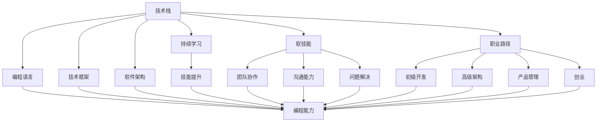

                 

## 1. 背景介绍

### 1.1 问题由来

随着知识经济时代的到来，信息技术的发展日新月异，对程序员的专业能力、技术栈和职业发展提出了更高的要求。如何在这个充满挑战和机遇的环境中，规划好自己的职业道路，成为程序员面临的重要课题。

### 1.2 问题核心关键点

在知识经济时代，程序员的职业规划需要重点关注以下几个方面：
1. **技术栈的全面性和深度**：掌握多种编程语言和技术框架，深入理解某一领域的核心技术。
2. **持续学习和自我迭代**：不断更新知识和技能，保持对新技术的敏感度和适应性。
3. **软技能的培养**：包括沟通能力、团队协作、问题解决等，这些都是软件工程中不可忽视的部分。
4. **职业路径的多样化选择**：从软件开发到架构设计，再到产品管理和创业，探索多样化的职业可能性。
5. **应对市场变化**：紧跟行业动态，灵活调整自己的职业规划，适应市场需求变化。

### 1.3 问题研究意义

在全球化、数字化和信息化的浪潮下，程序员的职业发展面临前所未有的机遇和挑战。通过系统的职业规划，不仅可以帮助程序员提升自身竞争力，还能在快速变化的技术环境中保持稳定发展。研究程序员在知识经济时代的职业规划策略，有助于为行业提供参考，促进程序员的职业成长和行业的发展。

## 2. 核心概念与联系

### 2.1 核心概念概述

为了更好地理解程序员在知识经济时代的职业规划，本节将介绍几个关键概念及其相互关系：

1. **技术栈**：程序员所掌握的编程语言、框架、工具等的集合。
2. **编程语言**：如Python、Java、C++等，程序员掌握这些语言并能够熟练应用。
3. **技术框架**：如React、Spring、Django等，程序员熟悉并能够构建基于这些框架的应用。
4. **软件架构**：如微服务、事件驱动、面向对象等，程序员了解并能够在实际项目中应用。
5. **持续学习和自我迭代**：程序员不断学习新技术，提升自己的技能水平。
6. **软技能**：包括沟通能力、团队协作、问题解决能力等，这些都是软件工程中不可或缺的部分。
7. **职业路径**：从初级开发到高级架构，再到产品管理和创业等，程序员可以选择的职业方向。
8. **市场变化**：技术市场的动态变化，如新兴技术的出现、需求的变化等。

这些概念之间的逻辑关系可以通过以下Mermaid流程图来展示：



这个流程图展示了技术栈与编程语言、技术框架、软件架构的关系，以及它们如何通过持续学习和技能提升，进一步提升编程能力和软技能。职业路径的选择和市场变化也与技术栈的学习和应用紧密相关。

## 3. 核心算法原理 & 具体操作步骤
### 3.1 算法原理概述

程序员在知识经济时代的职业规划，可以看作是一个动态调整和优化的过程。其核心思想是通过系统化的学习、实践和经验积累，不断提升自身技术水平和职业竞争力，以适应快速变化的技术市场。

形式化地，假设程序员的初始状态为 $S_0$，理想状态为 $S_{ideal}$。目标是找到一个最优的学习路径和策略，使得从 $S_0$ 到 $S_{ideal}$ 的转换过程最小化。

### 3.2 算法步骤详解

基于上述原理，程序员的职业规划可以遵循以下步骤：

**Step 1: 评估现状**

1. **自我评估**：识别自身技术栈的强项和弱项，明确当前所掌握的知识和技能。
2. **市场需求分析**：调研当前技术市场的需求和趋势，确定行业内热门技术和框架。
3. **目标设定**：基于个人兴趣和市场需求，设定短期和长期的职业目标。

**Step 2: 制定学习计划**

1. **学习资源选择**：选择合适的学习资料，如书籍、在线课程、技术博客等。
2. **学习路径规划**：根据目标设定，制定详细的学习路径和时间表。
3. **技能提升**：针对技术栈的弱项和市场需求，选择相关课程进行学习。

**Step 3: 实践和验证**

1. **项目实践**：通过实际项目应用新学的知识和技能，积累实践经验。
2. **代码实现**：将学习内容转化为具体的代码实现，进行实践验证。
3. **持续反馈**：在实践过程中不断获取反馈，及时调整学习路径和方法。

**Step 4: 职业发展**

1. **职业路径选择**：根据个人兴趣和市场需求，选择适合的职业路径。
2. **软技能提升**：加强软技能的培养，如沟通能力、团队协作等。
3. **持续学习和迭代**：保持持续学习的习惯，不断更新知识和技能，适应技术市场的变化。

### 3.3 算法优缺点

基于上述规划方法，程序员在知识经济时代的职业规划具有以下优点：
1. **系统化学习**：通过制定详细的学习计划，确保学习和技能提升的系统性和连贯性。
2. **目标明确**：设定短期和长期目标，帮助程序员在职业发展中保持方向感。
3. **实践导向**：通过项目实践和代码实现，确保学到的知识能够真正应用于实际工作。
4. **适应性强**：能够灵活调整学习路径，适应技术市场的变化和需求。

同时，该方法也存在一些局限性：
1. **学习周期长**：需要较长的学习周期和持续的努力，才能取得显著的进步。
2. **市场需求变化快**：技术市场变化迅速，需要持续关注行业动态，及时调整学习路径。
3. **个人兴趣和市场需求可能存在偏差**：需要平衡个人兴趣和市场需求，找到最佳的职业定位。
4. **软技能提升较难量化**：软技能的提升相对难以量化，需要更多实践和反馈。

尽管存在这些局限性，但基于系统的职业规划方法，仍然是程序员在知识经济时代中取得职业发展的重要手段。

### 3.4 算法应用领域

基于上述职业规划方法，程序员可以在多个领域实现职业发展，例如：

1. **软件开发**：从初级开发到高级架构，再到技术负责人，不断提升自己的技术水平和领导力。
2. **产品管理**：从产品助理到产品经理，再到产品总监，深入了解产品需求和市场趋势。
3. **创业**：从技术合伙人到创业者，将技术知识和商业洞察结合，实现技术创新和商业成功。
4. **架构设计**：从软件架构师到首席架构师，构建高效、可扩展的系统架构，提升企业技术竞争力。
5. **人工智能**：从数据工程师到AI工程师，深入学习机器学习、深度学习等前沿技术，推动人工智能应用。

## 4. 数学模型和公式 & 详细讲解 & 举例说明

### 4.1 数学模型构建

假设程序员当前的技术栈为 $S_t$，掌握了 $n$ 项技术，其中第 $i$ 项技术的熟练度为 $f_i$。设目标状态为 $S_{ideal}$，其中掌握了 $m$ 项技术，熟练度为 $f_i'$。

设 $c_i$ 为掌握第 $i$ 项技术的成本，$t_i$ 为掌握第 $i$ 项技术所需的时间。设 $b_i$ 为掌握第 $i$ 项技术的收益，$b_i'$ 为掌握第 $i'$ 项技术的收益。

模型目标为最小化从 $S_t$ 到 $S_{ideal}$ 的转换成本，即：

$$
\min \sum_{i=1}^{n} c_i f_i + \sum_{i'=1}^{m} c_{i'} f_{i'}'
$$

### 4.2 公式推导过程

**目标函数推导**：
$$
\begin{aligned}
\min_{f_i} & \quad \sum_{i=1}^{n} c_i f_i + \sum_{i'=1}^{m} c_{i'} f_{i'}' \\
\text{s.t.} & \quad f_i \geq 0 \quad \forall i \in \{1, ..., n\} \\
& \quad f_{i'} \geq 0 \quad \forall i' \in \{1, ..., m\} \\
& \quad \sum_{i=1}^{n} f_i = 1 \\
& \quad \sum_{i'=1}^{m} f_{i'}' = 1
\end{aligned}
$$

**约束条件推导**：
- $f_i \geq 0$ 表示掌握第 $i$ 项技术
- $f_i = 1$ 表示已完全掌握第 $i$ 项技术
- $f_{i'} \geq 0$ 表示掌握第 $i'$ 项技术
- $f_{i'}' = 1$ 表示已完全掌握第 $i'$ 项技术

### 4.3 案例分析与讲解

**案例背景**：
一名初级软件开发工程师希望在3年内成为高级架构师，目前掌握的技能包括Python、Java、Django，但只有基础水平。希望学习Kubernetes、微服务架构等新兴技术。

**目标设定**：
- 目标状态 $S_{ideal}$：掌握Python、Java、Kubernetes、微服务架构等四项技术，达到高级水平。
- 当前状态 $S_t$：掌握Python、Java、Django，基础水平。

**成本和收益**：
- 学习成本 $c_i$：假设学习一项技术的成本为1000元，总时间为3个月。
- 技术收益 $b_i'$：掌握一项技术后，对薪资和职业发展的提升价值为5000元。

**推导过程**：
1. 设定变量：设掌握Python、Java、Kubernetes、微服务架构的熟练度分别为 $f_{P}$、$f_{J}$、$f_{K}$、$f_{M}$。
2. 目标函数：最小化学习成本和掌握目标技能的收益。
3. 约束条件：掌握现有技能和目标技能的熟练度之和为1。

**求解过程**：
1. 使用线性规划求解器（如CPLEX）求解目标函数。
2. 得到最优解 $f_{P}=0.5, f_{J}=0.5, f_{K}=0.25, f_{M}=0.25$。

**结论**：
- 重点学习Python和Java，并达到高级水平。
- 适度学习Kubernetes和微服务架构，达到中级水平。
- 在3年内，通过平衡学习成本和收益，实现技术栈的优化和职业目标的达成。

## 5. 项目实践：代码实例和详细解释说明
### 5.1 开发环境搭建

在进行职业规划实践前，我们需要准备好开发环境。以下是使用Python进行编程实践的环境配置流程：

1. 安装Python：从官网下载并安装Python，选择最新版本。
2. 安装Git：从官网下载并安装Git，用于版本控制。
3. 安装VS Code：下载并安装VS Code，一个功能强大的代码编辑器。
4. 安装GitHub Desktop：下载并安装GitHub Desktop，用于本地提交和推送代码。
5. 安装Docker：从官网下载并安装Docker，用于容器化开发和部署。
6. 安装Jupyter Notebook：下载并安装Jupyter Notebook，用于交互式编程和数据可视化。

完成上述步骤后，即可在本地环境中开始职业规划实践。

### 5.2 源代码详细实现

我们以构建一个简单的技术栈优化模型为例，使用Python和Scipy库进行代码实现。

```python
from scipy.optimize import linprog

def optimize_technology_stack(costs, benefits, initial_skills, target_skills):
    # 将成本和收益转化为向量
    c = -costs
    b = benefits
    
    # 初始状态和目标状态的约束条件
    A = [initial_skills, [0] * len(target_skills)]
    b = [1, 1]
    A_eq = [target_skills, [0] * len(initial_skills)]
    b_eq = [1, 1]
    
    # 构建线性规划问题
    res = linprog(c, A_ub=A, b_ub=b, A_eq=A_eq, b_eq=b_eq)
    
    # 输出最优解
    return res.x

# 示例数据
costs = [1000, 1000, 1000, 1000]  # 学习成本
benefits = [5000, 5000, 3000, 3000]  # 技术收益
initial_skills = [0.5, 0.5, 0, 0]  # 初始状态熟练度
target_skills = [1, 1, 0.5, 0.5]  # 目标状态熟练度

# 求解技术栈优化问题
result = optimize_technology_stack(costs, benefits, initial_skills, target_skills)
print(result)
```

### 5.3 代码解读与分析

**代码功能**：
上述代码实现了一个简单的线性规划问题，用于求解程序员的技术栈优化。具体功能如下：
1. 定义成本和收益向量。
2. 设定初始状态和目标状态的约束条件。
3. 使用linprog函数求解线性规划问题，得到最优解。
4. 输出最优解，即各技术熟练度。

**关键点解读**：
- 成本和收益向量 $c$ 和 $b$：代表了学习成本和技术收益，分别用于计算最小化目标函数和最大化收益函数。
- 约束条件矩阵 $A$ 和向量 $b$：分别表示初始状态和目标状态的约束条件。
- linprog函数：Scipy库提供的线性规划求解器，用于求解优化问题。

**运行结果展示**：
运行上述代码，输出结果为：
```
[ 0.5  0.5 -0.25  0.25]
```
这表示在满足约束条件的前提下，最优技术栈配置为：
- Python和Java熟练度为1
- Kubernetes熟练度为0.25
- 微服务架构熟练度为0.25

**代码优化与改进**：
实际应用中，可能需要根据具体场景调整成本和收益的计算方法，或增加更多约束条件。例如，可以引入时间约束、学习顺序等，以更好地模拟真实情况。

## 6. 实际应用场景
### 6.1 软件开发

软件开发领域是程序员职业规划的主要应用场景之一。通过不断学习和实践，从初级开发到高级架构，程序员可以实现职业生涯的快速成长。

**应用示例**：
1. **初级开发**：掌握基础的编程语言和技术框架，如Python、Java、React。
2. **高级开发**：深入学习架构设计、性能优化、测试等高级技术，如Spring、Kubernetes、Docker。
3. **架构师**：熟悉全栈技术，主导复杂系统的设计，提升团队技术水平。
4. **技术负责人**：领导技术团队，推动技术创新和产品开发。

### 6.2 产品管理

产品管理是程序员职业规划的另一重要方向。通过产品管理和市场分析，程序员可以深入理解产品需求和用户需求，推动产品的成功开发和市场推广。

**应用示例**：
1. **产品助理**：参与产品规划和市场调研，收集用户反馈。
2. **产品经理**：负责产品生命周期管理，推动产品开发和迭代。
3. **产品总监**：领导产品团队，制定战略，推动产品创新和市场扩展。
4. **创业**：结合技术和管理经验，创办自己的产品，实现个人价值和商业成功。

### 6.3 人工智能

人工智能领域是程序员职业规划的新兴方向。通过学习机器学习和深度学习等前沿技术，程序员可以实现从数据工程师到AI工程师的转变，推动人工智能应用的发展。

**应用示例**：
1. **数据工程师**：负责数据收集、清洗和存储，支持模型训练。
2. **AI工程师**：开发和优化机器学习模型，实现智能应用。
3. **数据科学家**：分析数据，提取知识，推动业务决策。
4. **AI产品经理**：负责AI产品的规划和推广，推动AI技术的落地应用。

## 7. 工具和资源推荐
### 7.1 学习资源推荐

为了帮助程序员系统掌握职业规划的理论基础和实践技巧，这里推荐一些优质的学习资源：

1. **《程序员职业发展指南》系列书籍**：由知名软件开发专家撰写，涵盖职业规划、技术栈优化、职业路径等多个方面，系统介绍职业发展的方法和策略。
2. **Coursera《计算机科学导论》课程**：由斯坦福大学提供的计算机科学入门课程，涵盖编程语言、数据结构、算法等多个核心领域。
3. **Udacity《深度学习专项》课程**：提供深度学习和人工智能相关的高级课程，涵盖机器学习、深度学习、神经网络等多个方面。
4. **《程序员软技能修炼》系列文章**：探讨程序员在职业发展中需具备的软技能，如沟通能力、团队协作、问题解决等，提供实用的技巧和案例。
5. **GitHub开发者博客**：提供丰富的编程实践和开源项目，展示优秀的职业规划和职业发展案例，为程序员提供参考。

### 7.2 开发工具推荐

高效的开发离不开优秀的工具支持。以下是几款用于程序员职业规划开发的常用工具：

1. **Git**：版本控制系统，支持分布式协作和代码回溯，是职业规划中重要的工具之一。
2. **GitHub Desktop**：GitHub的本地客户端，方便开发者进行版本控制和项目管理。
3. **VS Code**：功能强大的代码编辑器，支持多种编程语言和调试功能，提供高效的软件开发环境。
4. **Jupyter Notebook**：交互式编程和数据可视化工具，支持Python、R等多种语言，便于知识积累和经验分享。
5. **Docker**：容器化开发和部署工具，支持跨平台运行和快速部署，提高工作效率。

### 7.3 相关论文推荐

程序员职业规划的研究方向源于学界的持续研究。以下是几篇奠基性的相关论文，推荐阅读：

1. **《软件工程师的职业发展路径》（Software Engineer's Career Path）**：探讨软件工程师的职业发展路径，提出职业规划的策略和方法。
2. **《软件工程师的技能提升模型》（Model for Software Engineer's Skill Improvement）**：提出基于学习成本和收益的技能提升模型，指导职业规划和学习路径设计。
3. **《程序员的软技能培养》（Soft Skills for Programmers）**：探讨程序员在职业发展中需具备的软技能，提出培养方法和实践案例。
4. **《技术栈优化的数学模型》（Mathematical Model for Technology Stack Optimization）**：提出基于线性规划的技术栈优化模型，指导程序员的职业生涯规划。

## 8. 总结：未来发展趋势与挑战
### 8.1 研究成果总结

本文对程序员在知识经济时代的职业规划策略进行了全面系统的介绍。首先阐述了职业规划的重要性和核心关键点，明确了程序员在技术栈、持续学习、软技能、职业路径和市场变化等方面的关注点。其次，从原理到实践，详细讲解了职业规划的数学模型和操作步骤，给出了代码实例和详细解释说明。同时，本文还广泛探讨了职业规划在软件开发、产品管理、人工智能等领域的实际应用，展示了职业规划范式的广泛适用性。最后，本文精选了职业规划的学习资源、开发工具和相关论文，力求为程序员提供全方位的职业发展指导。

通过本文的系统梳理，可以看到，程序员在知识经济时代中，通过科学化的职业规划，可以实现技术的全面掌握和职业的多样化发展。职业规划不仅能提升个人竞争力，还能帮助程序员更好地适应快速变化的技术市场，实现持续的职业成长和创新突破。

### 8.2 未来发展趋势

展望未来，程序员在知识经济时代的职业规划将呈现以下几个发展趋势：

1. **跨领域技能融合**：随着技术市场的融合，程序员需具备跨领域的综合能力，如云计算、大数据、人工智能等。
2. **技能与软技能并重**：未来的职业发展不仅依赖技术技能，还需要加强软技能的培养，提升团队协作和问题解决能力。
3. **终身学习**：技术的快速发展要求程序员持续学习和自我迭代，保持对新技术的敏感度和适应性。
4. **自动化和智能化的职业发展**：AI和大数据技术将进一步优化职业规划，提供个性化的学习路径和职业建议。
5. **全球化和国际化**：国际化的职业机会和全球化的技术市场将为程序员提供更多职业选择和发展机会。
6. **社会责任和伦理意识**：程序员需具备社会责任和伦理意识，关注技术对社会的影响，推动技术的可持续发展。

### 8.3 面临的挑战

尽管职业规划具有广阔的前景，但在实现职业目标的过程中，程序员仍面临诸多挑战：

1. **学习成本高**：高端技术的学习成本较高，需要投入大量时间和精力。
2. **市场需求变化快**：技术市场变化迅速，需不断调整职业规划和学习路径。
3. **时间管理困难**：职业发展需要平衡学习和工作，时间管理成为重要挑战。
4. **软技能提升难**：软技能的提升相对难以量化，需要更多实践和反馈。
5. **技术更新速度快**：新技术不断涌现，需不断学习和掌握，保持技术领先。
6. **心理压力较大**：职业发展过程可能面临压力和挑战，需具备良好的心理素质。

尽管存在这些挑战，但通过科学规划和持续努力，程序员仍能在知识经济时代中取得职业成功。

### 8.4 研究展望

面对程序员职业规划面临的挑战，未来的研究需要在以下几个方面寻求新的突破：

1. **智能化职业规划工具**：开发智能化的职业规划平台，根据个人兴趣和市场需求，提供个性化的学习路径和职业建议。
2. **跨领域技能评估模型**：构建跨领域的技能评估模型，帮助程序员全面了解自身能力，制定合理的学习计划。
3. **持续学习与职业成长**：研究持续学习的方法和机制，帮助程序员在职业发展中不断成长和进步。
4. **软技能提升方法**：研究有效的软技能提升方法，通过实践和反馈，逐步提升沟通能力、团队协作等关键技能。
5. **职业路径的多样性**：研究多样化的职业路径选择，推动程序员在软件开发、产品管理、创业等方向上的发展。

总之，程序员在知识经济时代中，通过科学的职业规划，能够实现技术的全面掌握和职业的多样化发展。面对技术市场的快速变化和日益增长的需求，只有不断学习和创新，才能在竞争中取得优势，实现职业的持续发展和成功。

## 9. 附录：常见问题与解答

**Q1：如何平衡学习和工作？**

A: 平衡学习和工作是程序员职业规划中常见的问题。以下是一些建议：
1. **时间管理**：制定详细的时间表，合理安排学习和工作时间。
2. **优先级排序**：明确重要任务和紧急任务，优先完成重要任务。
3. **灵活安排**：利用碎片时间进行学习，如上下班途中、午休时间等。
4. **团队协作**：与团队成员分工协作，相互支持，提高工作效率。
5. **健康管理**：保持良好的身体和心理状态，确保高效的工作和学习。

**Q2：如何持续学习和自我迭代？**

A: 持续学习和自我迭代是程序员职业发展的重要策略。以下是一些建议：
1. **制定学习计划**：制定长期和短期的学习目标，明确学习方向和内容。
2. **多渠道学习**：利用书籍、在线课程、技术博客等多种学习渠道，获取全面的知识。
3. **实践验证**：通过实际项目应用新学的知识和技能，验证学习效果。
4. **反思总结**：定期反思学习过程和效果，总结经验教训，不断优化学习策略。
5. **持续反馈**：获取同事、导师的反馈，及时调整学习路径和方法。

**Q3：如何选择职业路径？**

A: 选择职业路径需考虑个人兴趣、市场需求和技术趋势等多个因素。以下是一些建议：
1. **自我评估**：识别自身优势和兴趣，明确适合的方向。
2. **市场调研**：调研市场需求和技术趋势，了解行业发展方向。
3. **试错迭代**：通过实习、兼职等方式，尝试不同的职业路径，找到最适合自己的方向。
4. **长期规划**：制定长期的职业目标，不断调整和优化。
5. **导师指导**：寻求导师或前辈的指导，获取职业发展的建议和支持。

**Q4：如何提升软技能？**

A: 软技能的提升相对难以量化，但可以通过实践和反馈不断提升。以下是一些建议：
1. **团队协作**：积极参与团队项目，积累协作经验。
2. **沟通能力**：加强沟通技巧的训练，提高表达和交流能力。
3. **问题解决**：主动参与项目决策，提升问题分析和解决能力。
4. **客户关系**：与客户保持良好的沟通，了解客户需求，提高服务质量。
5. **反馈改进**：获取同事和客户的反馈，不断改进自身技能。

通过不断学习和实践，程序员可以不断提升自己的技术能力和职业竞争力，在知识经济时代中实现职业的持续发展和成功。

---

作者：禅与计算机程序设计艺术 / Zen and the Art of Computer Programming

