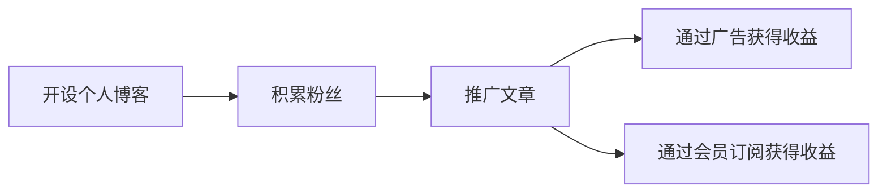

                 

## 1. 背景介绍

随着互联网的快速发展，越来越多的内容创作者通过网络平台发布自己的文章和作品，并通过广告、赞助、会员订阅等方式变现。其中，Medium作为一款以内容为主的社交媒体平台，聚集了大量优秀的技术博主和读者，成为程序员分享知识和变现的重要渠道之一。

本文将详细介绍如何利用Medium进行知识变现，包括开设个人博客、积累粉丝、推广文章、通过广告、赞助和会员订阅等方式获得收益。

## 2. 核心概念与联系

### 2.1 核心概念概述

- **Medium**：一个专注于分享高质量技术文章和内容创作的社交平台。
- **内容创作**：通过撰写原创技术文章，分享专业知识，积累粉丝和关注度。
- **粉丝经济**：通过聚集粉丝和读者，通过会员订阅、广告赞助等方式获得收入。
- **广告**：通过发布付费广告，提高文章的曝光度和点击率，获得收入。
- **会员订阅**：积累足够的粉丝后，可以通过开启会员订阅，获得粉丝的付费支持。

### 2.2 核心概念原理和架构的 Mermaid 流程图

这个流程图展示了利用Medium进行知识变现的核心流程：

1. 在Medium上开设个人博客。
2. 通过持续发布高质量的技术文章，积累粉丝和关注度。
3. 推广文章，通过广告和会员订阅等方式获得收益。

## 3. 核心算法原理 & 具体操作步骤

### 3.1 算法原理概述

利用Medium进行知识变现的核心在于通过内容创作和粉丝经济获得收入。算法原理主要包括以下几个方面：

1. **内容创作**：通过撰写原创技术文章，分享专业知识，吸引粉丝和读者。
2. **粉丝经济**：通过积累粉丝和读者，通过广告和会员订阅等方式获得收入。
3. **广告收益**：通过发布付费广告，提高文章的曝光度和点击率，获得收入。
4. **会员订阅**：积累足够的粉丝后，可以通过开启会员订阅，获得粉丝的付费支持。

### 3.2 算法步骤详解

1. **开设个人博客**：
    - 注册并登录Medium账号。
    - 创建一个新的博客，选择博客名称和简介，完善个人资料。
    - 选择合适的博客主题和风格。

2. **内容创作**：
    - 选择技术主题，进行深入研究和学习。
    - 撰写高质量的原创文章，确保文章内容有价值、有深度。
    - 使用图片、视频等多媒体内容丰富文章，提升用户体验。
    - 定期更新文章，保持博客的活跃度。

3. **积累粉丝**：
    - 发布文章后，积极推广，通过社交媒体、邮件列表等方式进行传播。
    - 与其他博主和读者互动，回复评论和私信，建立良好的社区关系。
    - 参加Medium上的话题讨论，提升个人影响力和曝光度。

4. **推广文章**：
    - 利用Twitter、LinkedIn、Facebook等社交媒体平台，推广文章。
    - 参与技术社区的讨论和活动，提高文章曝光度。
    - 使用SEO优化，提升文章在搜索结果中的排名。

5. **通过广告获得收益**：
    - 在Medium文章中插入广告，选择合适的广告形式（如横幅广告、原生广告等）。
    - 通过Medium的广告收入分享计划（Revenue Share Program），获得广告收益。
    - 定期分析广告效果，优化广告投放策略。

6. **通过会员订阅获得收益**：
    - 积累足够的粉丝和读者后，开启会员订阅功能。
    - 设置会员订阅价格和内容，吸引会员付费支持。
    - 定期发布高质量内容，保持会员的订阅动力。

### 3.3 算法优缺点

#### 3.3.1 优点

- **低门槛**：Medium平台对创作者开放，任何人都可以开设博客，发布文章。
- **曝光度高**：Medium拥有庞大的用户基础和活跃社区，文章曝光度较高。
- **多种变现方式**：通过广告、会员订阅等方式变现，变现渠道多样化。
- **社区支持**：Medium社区内有很多优秀的博主和读者，可以互相学习，提升自身影响力。

#### 3.3.2 缺点

- **竞争激烈**：技术领域竞争激烈，需要持续创作高质量内容才能脱颖而出。
- **收益不稳定**：广告收入和会员订阅收入受多种因素影响，收益不稳定。
- **时间和精力投入较大**：内容创作、粉丝互动、广告推广等需要大量时间和精力投入。

### 3.4 算法应用领域

利用Medium进行知识变现，适用于以下领域：

- **技术博主**：技术爱好者可以通过Medium分享技术知识，积累粉丝和读者，实现知识变现。
- **企业博主**：企业可以派技术专家在Medium上发布公司技术分享文章，提升品牌影响力和技术口碑。
- **自由职业者**：自由职业者可以通过Medium发布自己的技术博客，积累粉丝和客户，实现收入。

## 4. 数学模型和公式 & 详细讲解 & 举例说明

### 4.1 数学模型构建

假设博客的访问量为 $X$，文章的平均阅读时间为 $T$，广告点击率为 $C$，会员订阅率为 $S$，每点击广告的收益为 $A$，每名会员的月订阅费用为 $P$。

则博客的总收益 $R$ 可以表示为：

$$ R = C \times A \times T \times X + S \times P \times T \times X $$

其中，$T \times X$ 表示文章的总阅读时间，$S \times P \times T \times X$ 表示会员订阅带来的收益。

### 4.2 公式推导过程

1. **广告收益**：
    - 假设每篇文章的平均点击量为 $V$，则广告收入为 $V \times C \times A$。
    - 假设每篇文章的平均阅读时间为 $T$，则总阅读时间为 $T \times X$。
    - 因此，广告收益为 $V \times C \times A \times T \times X$。

2. **会员订阅收益**：
    - 假设每名会员的月订阅费用为 $P$，则会员订阅收益为 $S \times P \times T \times X$。

3. **总收益**：
    - 将广告收入和会员订阅收入相加，得到总收益 $R$。

### 4.3 案例分析与讲解

假设某技术博主在Medium上发布了一篇关于深度学习的文章，文章的平均点击量为 $V=1000$，点击率为 $C=0.1$，每点击广告的收益为 $A=0.5$，文章的平均阅读时间为 $T=10$ 分钟，每名会员的月订阅费用为 $P=10$ 美元。

则广告收入为：

$$ V \times C \times A \times T = 1000 \times 0.1 \times 0.5 \times 10 = 500 \text{美元} $$

假设文章总访问量为 $X=1000$，则广告收益为：

$$ 500 \times T \times X = 500 \times 10 \times 1000 = 500000 \text{美元} $$

如果博主通过Medium积累了一万名会员，则会员订阅收益为：

$$ S \times P \times T \times X = 10000 \times 10 \times 10 \times 1000 = 100000000 \text{美元} $$

则总收益为：

$$ R = 500000 + 100000000 = 100050000 \text{美元} $$

## 5. 项目实践：代码实例和详细解释说明

### 5.1 开发环境搭建

要在Medium上发布文章，首先需要拥有一个Medium账号，并注册博客。

1. **注册Medium账号**：
    - 访问Medium官网，点击“Sign Up”按钮，填写注册信息。
    - 使用邮箱验证账号，激活账号。

2. **创建博客**：
    - 登录Medium账号，点击“Start a Blog”按钮。
    - 填写博客名称、简介、头像等信息，选择博客主题和风格。
    - 创建完成后，开始发布文章。

### 5.2 源代码详细实现

本文以发布一篇关于Python编程的文章为例，介绍如何在Medium上发布文章。

1. **创建文章草稿**：
    - 登录Medium账号，点击“Start a Post”按钮。
    - 填写文章标题、正文、标签等信息，选择图片和视频等多媒体内容。
    - 预览文章，确保内容无误。

2. **发布文章**：
    - 点击“Publish”按钮，发布文章。
    - 文章发布后，可以在Medium页面查看，并进行后续推广和互动。

### 5.3 代码解读与分析

在Medium上发布文章，主要依赖平台提供的界面和功能，不需要编写复杂的代码。以下是对主要步骤的解释：

1. **创建文章草稿**：
    - 填写文章标题、正文、标签等信息。
    - 选择图片、视频等多媒体内容，丰富文章。
    - 预览文章，确保内容无误。

2. **发布文章**：
    - 点击“Publish”按钮，发布文章。
    - 文章发布后，可以在Medium页面查看，并进行后续推广和互动。

### 5.4 运行结果展示

发布文章后，可以在Medium页面查看文章的阅读量、评论、点赞等互动数据，以及广告收入和会员订阅收益。

1. **阅读量和互动数据**：
    - 在Medium页面查看文章的阅读量、评论、点赞等互动数据，了解文章的受众反馈。

2. **广告收入和会员订阅收益**：
    - 在Medium收入分享计划（Revenue Share Program）中查看广告收入和会员订阅收益，了解平台提供的收益情况。

## 6. 实际应用场景

利用Medium进行知识变现，适用于以下实际应用场景：

1. **技术博客**：技术爱好者可以通过Medium分享技术知识，积累粉丝和读者，实现知识变现。
2. **企业技术分享**：企业可以派技术专家在Medium上发布公司技术分享文章，提升品牌影响力和技术口碑。
3. **自由职业者**：自由职业者可以通过Medium发布自己的技术博客，积累粉丝和客户，实现收入。

## 7. 工具和资源推荐

### 7.1 学习资源推荐

- **Medium官方指南**：Medium官方提供的使用指南和文档，帮助新用户快速上手。
- **博客管理工具**：如WordPress、Blogger等博客管理工具，可以帮助博主更高效地管理文章和内容。
- **SEO优化工具**：如Google Analytics、SEMrush等SEO优化工具，帮助博主提升文章在搜索引擎中的排名。

### 7.2 开发工具推荐

- **文本编辑器**：如Visual Studio Code、Atom等文本编辑器，支持代码编写和编辑。
- **图片和视频编辑工具**：如Adobe Photoshop、Adobe Premiere Pro等工具，支持多媒体内容的制作和编辑。

### 7.3 相关论文推荐

- **《内容创作与粉丝经济：新时期内容创作者的价值变现》**：探讨内容创作者如何通过粉丝经济实现变现，提供相关案例和策略。
- **《广告效果优化：提升点击率和转化率的策略》**：介绍如何通过广告优化提升点击率和转化率，实现高效变现。

## 8. 总结：未来发展趋势与挑战

### 8.1 未来发展趋势

未来，利用Medium进行知识变现将呈现以下几个发展趋势：

1. **内容创作平台化**：Medium平台将进一步优化创作工具和功能，支持更多的多媒体内容形式，提升创作者体验。
2. **广告收益多元化**：Medium将引入更多广告形式和变现渠道，提升广告收入。
3. **会员订阅多样化**：Medium将提供更多的会员订阅计划和内容，满足不同用户的需求。

### 8.2 面临的挑战

尽管利用Medium进行知识变现有很多优势，但也面临以下挑战：

1. **内容竞争激烈**：技术领域竞争激烈，需要持续创作高质量内容才能脱颖而出。
2. **收益不稳定**：广告收入和会员订阅收入受多种因素影响，收益不稳定。
3. **时间和精力投入较大**：内容创作、粉丝互动、广告推广等需要大量时间和精力投入。

### 8.3 研究展望

未来的研究将集中在以下几个方面：

1. **提升内容质量**：通过优化内容创作工具和平台，提升内容创作质量，吸引更多读者。
2. **多元化变现渠道**：探索更多的变现渠道和策略，实现多元化收入。
3. **优化粉丝互动**：通过优化社区管理和互动策略，提升粉丝互动质量，提高用户粘性。

## 9. 附录：常见问题与解答

**Q1：如何提高文章的阅读量和互动数据？**

A: 提高文章的阅读量和互动数据可以从以下几个方面入手：
1. **优化标题和摘要**：吸引读者的注意力，提高点击率。
2. **增加多媒体内容**：如图片、视频等多媒体内容，提升用户体验。
3. **参与社区互动**：积极回复评论和私信，建立良好的社区关系。
4. **优化SEO**：使用SEO优化，提升文章在搜索引擎中的排名。

**Q2：如何优化广告投放策略？**

A: 优化广告投放策略可以从以下几个方面入手：
1. **选择合适的广告形式**：根据文章内容和受众，选择适合的广告形式。
2. **调整广告投放时间**：根据用户活跃时间，调整广告投放时间，提升广告点击率。
3. **A/B测试**：通过A/B测试，优化广告内容和投放策略，提高广告效果。

**Q3：如何增加会员订阅？**

A: 增加会员订阅可以从以下几个方面入手：
1. **提供高质量内容**：定期发布高质量的技术文章，保持会员订阅动力。
2. **设置合理的订阅价格**：根据受众需求和市场情况，设置合理的订阅价格。
3. **提供专属福利**：提供会员专属福利，如提前访问文章、独家内容等，吸引会员订阅。

**Q4：如何优化粉丝互动？**

A: 优化粉丝互动可以从以下几个方面入手：
1. **积极回复评论和私信**：及时回复粉丝的评论和私信，建立良好的社区关系。
2. **参与社区讨论**：积极参与社区讨论和活动，提升个人影响力。
3. **定期举办活动**：定期举办技术分享会、在线讲座等活动，增加粉丝互动。

---

作者：禅与计算机程序设计艺术 / Zen and the Art of Computer Programming

