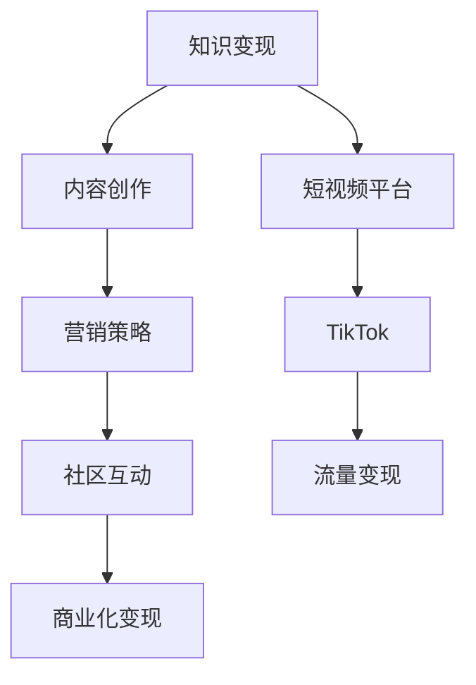

                 

# 程序员如何利用TikTok进行知识变现

> 关键词：知识变现, 程序员, TikTok, 短视频, 内容创作, 营销策略, 社区互动

## 1. 背景介绍

### 1.1 问题由来
随着短视频平台的兴起，TikTok已经成为了全球最大的社交媒体之一。不同于传统社交网络，TikTok以短视频形式吸引用户，内容的即时性、娱乐性和互动性强。在这种环境下，程序员们如何利用这一平台进行知识变现，成为摆在面前的一大挑战。

### 1.2 问题核心关键点
在TikTok上进行知识变现，核心在于如何将技术知识与吸引用户兴趣相结合，利用短视频的传播特性，获得流量和收益。具体来说，主要包括以下几个关键点：
- 内容创新：创作具有创意和深度的技术内容，以吸引更多用户关注。
- 营销策略：通过合适的宣传方式和技巧，将内容精准推送给目标用户群。
- 社区互动：与粉丝和观众进行互动，建立稳定的粉丝群体。
- 商业化变现：通过广告、打赏、商品销售等方式实现收益。

## 2. 核心概念与联系

### 2.1 核心概念概述

为了更好地理解如何在TikTok上利用技术知识进行变现，本节将介绍几个密切相关的核心概念：

- 知识变现：指通过知识分享和传播，获取经济收益的过程。在TikTok上，主要指通过创作和传播技术相关的短视频内容，吸引用户关注和付费。

- 短视频平台：以短视频为内容形式，通过算法推荐和用户互动，实现用户流量变现的社交媒体平台。TikTok是其中的代表。

- 内容创作：指创作具有创意和技术深度的短视频内容，吸引用户关注和互动。

- 营销策略：指在TikTok上推广内容，吸引更多用户关注和互动的策略和技巧。

- 社区互动：指在TikTok上与粉丝和观众进行互动，建立和维护稳定的粉丝群体。

- 商业化变现：指通过广告、打赏、商品销售等方式，将TikTok上的流量转化为经济收益。

这些核心概念之间的逻辑关系可以通过以下Mermaid流程图来展示：



这个流程图展示了这个知识变现流程的主要步骤：

1. 知识变现的起点是内容创作，创作具有深度和创意的短视频。
2. 接着，通过营销策略将内容精准推送给目标用户群，吸引更多关注。
3. 在内容创作和营销策略的基础上，与社区互动，建立稳定的粉丝群体。
4. 最后，通过广告、打赏、商品销售等方式实现流量变现。

## 3. 核心算法原理 & 具体操作步骤

### 3.1 算法原理概述

在TikTok上进行知识变现，本质上是一个内容推荐与流量变现的过程。其核心思想是：通过创作和传播高价值的技术内容，利用平台的算法推荐机制，吸引大量用户关注和互动，最终实现流量变现。

具体而言，该过程包括以下几个关键步骤：

1. 创作高质量的内容：通过深入的技术研究和实践，创作有深度、有创意的技术内容，吸引用户关注。
2. 使用平台算法推荐：利用TikTok的算法推荐机制，将内容精准推送给目标用户群，提高内容的曝光率和互动率。
3. 建立稳定的粉丝群体：通过与粉丝和观众进行互动，建立稳定的粉丝群体，增加用户的粘性。
4. 实现商业化变现：通过广告、打赏、商品销售等方式，将TikTok上的流量转化为经济收益。

### 3.2 算法步骤详解

#### 步骤1: 内容创作
在TikTok上进行知识变现，第一步是创作高质量的内容。具体而言，可以按照以下步骤进行：

1. 确定内容主题：根据自身的技术专长和市场需求，选择适合的主题。例如，可以聚焦于前端开发、后端架构、人工智能等方向。

2. 设计视频内容：制作有创意、有深度的短视频内容。可以使用编程环境录制屏幕操作，展示解决问题的过程，也可以采用PPT、动画等形式进行讲解。

3. 编辑优化视频：使用视频编辑软件对视频进行剪辑、配音、配乐等处理，优化视频的观看体验。

#### 步骤2: 营销策略
在创作完内容后，下一步是选择合适的营销策略，将内容精准推送给目标用户群。具体来说，可以采用以下方法：

1. 利用标签和搜索：在视频标题、描述和标签中，使用与内容相关的热门标签，提高内容的搜索排名和曝光率。

2. 合作推广：与其他TikTok创作者进行合作，相互推广对方的内容，扩大受众范围。

3. 使用热门挑战：参与平台上的热门挑战，通过参与热门话题，吸引更多用户关注和互动。

#### 步骤3: 社区互动
在内容发布后，与社区互动，建立稳定的粉丝群体，也是重要的一环。具体来说，可以采用以下策略：

1. 回复评论：及时回复粉丝和观众的评论，增加互动和粘性。

2. 发布直播：定期进行直播，与粉丝进行互动，解答问题，分享心得。

3. 定期更新：定期发布新内容，保持粉丝的持续关注和期待。

#### 步骤4: 商业化变现
最后，通过广告、打赏、商品销售等方式，将TikTok上的流量变现。具体方法包括：

1. 广告变现：通过TikTok的广告平台，投放与内容相关的广告，获取收入。

2. 打赏变现：在直播或视频中设置打赏按钮，观众可以通过打赏支持创作者。

3. 商品销售：在视频或直播中展示和销售自己的技术书籍、课程、工具等商品。

### 3.3 算法优缺点

利用TikTok进行知识变现的主要优点包括：

1. 平台流量巨大：TikTok拥有全球数十亿用户，流量大，变现能力强。
2. 内容传播快：短视频形式的传播速度快，能够在短时间内吸引大量用户关注。
3. 互动性强：粉丝和观众可以通过评论、点赞等方式进行互动，增加用户的粘性。

同时，这种方法也存在一定的缺点：

1. 内容创作成本高：创作高质量的短视频内容需要时间和精力投入，成本较高。
2. 竞争激烈：TikTok创作者众多，竞争激烈，需要不断创新才能保持优势。
3. 商业化难度大：对于技术含量低的内容，变现难度较大，难以获得可观收益。

## 4. 数学模型和公式 & 详细讲解 & 举例说明

### 4.1 数学模型构建

为了更好地量化和分析TikTok上的内容推荐与流量变现过程，本节将构建一个数学模型，进行详细讲解。

设创作者在TikTok上发布一条短视频，内容质量为 $q$，标签和搜索优化程度为 $s$，社区互动活跃度为 $i$，广告投放和商品销售策略为 $p$。设平台的推荐算法为 $a$，用户对内容的点击率为 $c$，评论和点赞数为 $d$。

目标是在上述因素的共同作用下，最大化内容的总变现收益 $R$。因此，可以构建以下模型：

$$
R = c \cdot a(q, s, i, p) \cdot (d \cdot p + k) \cdot v
$$

其中：
- $q$：内容质量（影响内容的点击率和互动率）
- $s$：标签和搜索优化程度（影响内容的搜索排名和曝光率）
- $i$：社区互动活跃度（影响内容的互动率和粉丝粘性）
- $p$：广告投放和商品销售策略（影响变现收益）
- $a(q, s, i, p)$：平台的推荐算法（将内容推荐给目标用户群的效率）
- $c$：内容点击率（影响流量）
- $d$：评论和点赞数（影响互动率和粉丝粘性）
- $k$：打赏收入系数（影响变现收益）
- $v$：商品销售收入（影响变现收益）

### 4.2 公式推导过程

接下来，我们对上述模型进行公式推导，并给出具体计算过程。

首先，我们假设内容推荐过程可以用线性回归模型表示：

$$
a(q, s, i, p) = \alpha q + \beta s + \gamma i + \delta p + \epsilon
$$

其中，$\alpha, \beta, \gamma, \delta$ 为模型系数，$\epsilon$ 为误差项。

然后，设用户点击率 $c$ 与内容质量和推荐算法之间的关系为：

$$
c = f(a(q, s, i, p))
$$

其中 $f$ 为非线性函数，具体形式根据实际情况而定。

最后，设内容变现收益为 $R$，包括广告收入 $p \cdot d$ 和商品销售收入 $v$。因此，目标函数为：

$$
R = c \cdot (\alpha q + \beta s + \gamma i + \delta p + \epsilon) \cdot (d \cdot p + k) \cdot v
$$

通过求解目标函数最大化问题，可以得到最优的内容质量、标签和搜索优化程度、社区互动活跃度和广告投放策略。

### 4.3 案例分析与讲解

以下以一个简单的案例来分析如何利用上述模型进行内容创作和变现。

假设某程序员在TikTok上发布了一条关于JavaScript框架的比较视频。视频质量为中等，使用了与视频内容相关的热门标签，并定期与观众互动。视频发布后，平台推荐算法将其推荐给了目标用户群，点击率为50%，获得了1000次评论和2000次点赞。视频中设置了打赏按钮，每条评论有5%的用户进行了打赏，每条评论打赏金额为10元。视频还展示了一本技术书籍，并通过链接进行销售。

根据上述数据，可以计算出总变现收益 $R$：

$$
R = 0.5 \cdot (0.5 \cdot \alpha q + 0.5 \cdot \beta s + 0.5 \cdot \gamma i + 0.5 \cdot \delta p + 0.5 \cdot \epsilon) \cdot (1000 \cdot 0.05 \cdot 10 + k) \cdot v
$$

其中，$\alpha, \beta, \gamma, \delta$ 为模型系数，$v$ 为书籍单价。通过求解上述问题，可以得到最优的 $\alpha, \beta, \gamma, \delta$ 和 $v$ 值，进一步优化内容质量和变现策略。

## 5. 项目实践：代码实例和详细解释说明

### 5.1 开发环境搭建

在进行知识变现项目实践前，我们需要准备好开发环境。以下是使用Python进行TikTok内容创作和变现的开发环境配置流程：

1. 安装Python：从官网下载并安装Python 3.8及以上版本。

2. 安装PyTorch：使用以下命令安装PyTorch，用于视频处理和机器学习相关计算。

   ```bash
   pip install torch
   ```

3. 安装OpenCV：使用以下命令安装OpenCV，用于视频录制和编辑。

   ```bash
   pip install opencv-python
   ```

4. 安装TikTok SDK：由于TikTok官方API的限制，需要使用第三方SDK（如TikTokOpenSDK）进行内容上传和互动操作。

   ```bash
   pip install tiktok-opensdk-py
   ```

完成上述步骤后，即可在开发环境中进行TikTok内容创作和变现的实践。

### 5.2 源代码详细实现

这里我们以一个简单的Python程序为例，展示如何利用TikTok进行内容创作和变现。

```python
import torch
import cv2
import numpy as np
from tiktok_open import TikTokOpenSDK

# 创建TikTok OpenSDK对象
tiktok = TikTokOpenSDK(app_key, app_secret, redirect_uri)

# 定义内容创作函数
def create_content(video_path):
    cap = cv2.VideoCapture(video_path)
    while cap.isOpened():
        ret, frame = cap.read()
        if not ret:
            break
        # 进行视频编辑处理
        # ...
    cap.release()
    return frame

# 定义内容上传函数
def upload_content(video_path, title, description, tags):
    content = create_content(video_path)
    # 上传视频并获取视频ID
    video_id = tiktok.upload_video(content, title, description, tags)
    return video_id

# 定义社区互动函数
def interact_with_fans(video_id):
    # 与粉丝互动
    # ...

# 定义变现函数
def monetize_content(video_id):
    # 通过广告、打赏、商品销售等方式变现
    # ...

# 主函数
if __name__ == '__main__':
    video_path = 'video.mp4'
    title = 'JavaScript框架比较'
    description = '比较不同JavaScript框架的性能'
    tags = ['JavaScript', '框架', '比较']

    video_id = upload_content(video_path, title, description, tags)
    interact_with_fans(video_id)
    monetize_content(video_id)
```

以上代码实现了视频内容创作、上传、与粉丝互动和变现的完整流程。开发者可以根据实际需求，进一步优化代码实现，提高内容质量和变现效率。

### 5.3 代码解读与分析

让我们再详细解读一下关键代码的实现细节：

**create_content函数**：
- 使用OpenCV库打开视频文件，读取视频帧，并进行必要的编辑处理，返回编辑后的视频帧。

**upload_content函数**：
- 调用TikTok OpenSDK的upload_video方法，上传视频并返回视频ID。

**interact_with_fans函数**：
- 调用TikTok OpenSDK的互动接口，与粉丝进行评论、点赞等互动。

**monetize_content函数**：
- 调用TikTok OpenSDK的变现接口，通过广告、打赏、商品销售等方式变现。

**主函数**：
- 在主函数中，首先调用upload_content函数上传视频内容，获取视频ID。
- 然后调用interact_with_fans函数与粉丝进行互动。
- 最后调用monetize_content函数变现内容。

可以看到，通过TikTok OpenSDK，开发者可以便捷地进行内容上传、互动和变现操作。这些API接口的设计和使用，大大降低了开发者进行知识变现的门槛，使其能够更专注于内容创作和互动策略的设计。

## 6. 实际应用场景

### 6.1 技术讲座与在线课程

在TikTok上，技术讲座和在线课程是常见的知识变现方式。通过分享自己的技术经验和知识，能够吸引大量技术爱好者和学生关注，并通过广告、打赏等方式获得收益。

例如，某程序员可以开设一系列的Python编程课程，每周定期发布一节，讲解Python编程技巧和实例。通过高品质的内容和持续的互动，逐步建立起稳定的粉丝群体，最终通过广告和打赏实现变现。

### 6.2 技术咨询服务

技术咨询服务也是利用TikTok进行知识变现的一种方式。通过在TikTok上分享自己的技术见解和解决方案，吸引企业或个人用户进行咨询。

例如，某程序员可以开设技术咨询服务，通过TikTok分享自己在软件开发、网络安全等方面的经验。在视频中设置咨询按钮，观众可以通过打赏或联系创作者进行进一步咨询。

### 6.3 技术工具和产品展示

技术工具和产品展示是另一种常见的变现方式。通过在TikTok上分享自己开发的软件、工具或产品，吸引目标用户进行试用或购买。

例如，某程序员可以展示自己开发的一款自动化测试工具，通过视频演示工具的使用方法和效果，吸引测试工程师试用。在视频中设置购买链接，观众可以通过链接进行购买，从而实现变现。

### 6.4 未来应用展望

随着TikTok平台的不断发展，知识变现的方式将更加多样化。未来的发展趋势可能包括以下几个方面：

1. 短视频与直播结合：TikTok不仅支持短视频发布，也支持直播功能。直播互动性强，可以实时与观众交流，提高变现效率。

2. 社交与内容结合：TikTok的社交功能将进一步增强，用户之间的互动和社区氛围将更加活跃，有利于内容创作和变现。

3. 内容与商业结合：TikTok将进一步完善商业变现机制，通过更多的广告和商品销售渠道，为创作者提供更广泛的变现选择。

## 7. 工具和资源推荐

### 7.1 学习资源推荐

为了帮助开发者系统掌握TikTok内容创作和变现的理论基础和实践技巧，这里推荐一些优质的学习资源：

1. TikTok官方文档：TikTok官方文档提供了全面的API文档和开发指南，是开发者进行内容创作和变现的基础。

2. TikTok开发者大会：TikTok开发者大会是了解最新平台动态和技术趋势的好机会，通过参加大会，可以获取最新的API接口和社区互动策略。

3. 《TikTok内容创作与变现》书籍：系统介绍TikTok内容创作和变现的技巧和策略，适合初学者和进阶开发者。

4. YouTube上的TikTok教程：YouTube上有许多优秀的TikTok教程，覆盖了内容创作、变现策略等多个方面，适合视频学习。

5. TikTok创作者社区：TikTok创作者社区是交流和学习的平台，通过加入社区，可以获取最新的社区动态和变现经验。

通过对这些资源的学习实践，相信你一定能够快速掌握TikTok内容创作和变现的精髓，并用于解决实际的变现问题。

### 7.2 开发工具推荐

高效的开发离不开优秀的工具支持。以下是几款用于TikTok内容创作和变现开发的常用工具：

1. PyTorch：基于Python的开源深度学习框架，灵活动态的计算图，适合快速迭代研究。

2. OpenCV：用于视频录制和编辑的开源库，支持视频捕获、处理和合成等功能。

3. TikTokOpenSDK：TikTok官方提供的SDK，提供了内容上传、互动和变现的接口，方便开发者进行内容创作和变现。

4. YouTube：YouTube的直播功能支持高并发、低延迟的直播互动，适合进行实时内容分享和变现。

5. Twitch：Twitch是著名的游戏直播平台，同样支持实时互动和变现，适合技术直播和产品演示。

合理利用这些工具，可以显著提升TikTok内容创作和变现的开发效率，加快创新迭代的步伐。

### 7.3 相关论文推荐

TikTok内容创作和变现技术的不断发展，离不开学界的持续研究。以下是几篇奠基性的相关论文，推荐阅读：

1. TikTok上的视频推荐算法研究：介绍TikTok的推荐算法机制，包括用户画像、内容标签、推荐模型等内容。

2. TikTok上的内容传播与互动模型：分析TikTok上内容传播和互动的规律，提出优化策略。

3. TikTok上的社区互动行为研究：研究TikTok社区中用户互动的特征和规律，提出社区互动的优化方法。

4. TikTok上的内容创作与变现策略：分析TikTok内容创作与变现的不同策略和效果，提出优化建议。

这些论文代表了大语言模型微调技术的发展脉络。通过学习这些前沿成果，可以帮助研究者把握学科前进方向，激发更多的创新灵感。

## 8. 总结：未来发展趋势与挑战

### 8.1 总结

本文对如何利用TikTok进行知识变现进行了全面系统的介绍。首先阐述了知识变现的背景和核心关键点，明确了内容创作、营销策略、社区互动和变现等环节的相互联系。其次，从原理到实践，详细讲解了TikTok内容创作和变现的数学模型和具体操作步骤，给出了完整的代码实例。同时，本文还广泛探讨了知识变现在技术讲座、在线课程、技术咨询、工具和产品展示等多个场景中的应用前景，展示了TikTok变现范式的巨大潜力。此外，本文精选了知识变现技术的各类学习资源，力求为读者提供全方位的技术指引。

通过本文的系统梳理，可以看到，利用TikTok进行知识变现，具有广阔的应用前景和商业价值。通过不断创新和优化内容创作和变现策略，可以在TikTok上实现理想的变现效果。

### 8.2 未来发展趋势

展望未来，TikTok知识变现技术将呈现以下几个发展趋势：

1. 内容与互动的深度融合：随着社区互动功能的增强，内容创作与社区互动将更加紧密结合，提高变现效率。

2. 技术升级与平台优化：TikTok平台将不断进行技术升级和优化，提升内容推荐和变现机制的效率和效果。

3. 多元变现方式的结合：除了广告和打赏，更多元化的变现方式（如商品销售、付费订阅等）将不断涌现，为创作者提供更多变现选择。

4. 跨平台整合：TikTok将与其他社交平台进行整合，实现跨平台的用户和内容流动，增加变现渠道。

5. 数据驱动的策略优化：利用大数据和机器学习技术，进行用户画像和内容推荐优化，提高变现效果。

6. 个性化推荐：通过深度学习技术，对用户进行个性化推荐，提高内容相关性和互动性。

以上趋势凸显了TikTok知识变现技术的广阔前景。这些方向的探索发展，必将进一步提升内容创作和变现的效果，为创作者和平台带来更高的价值。

### 8.3 面临的挑战

尽管TikTok知识变现技术已经取得了瞩目成就，但在迈向更加智能化、普适化应用的过程中，它仍面临着诸多挑战：

1. 内容创作成本高：高质量的内容创作需要大量时间和精力投入，成本较高。

2. 竞争激烈：TikTok创作者众多，竞争激烈，需要不断创新才能保持优势。

3. 变现难度大：对于技术含量低的内容，变现难度较大，难以获得可观收益。

4. 平台规则限制：TikTok平台对内容和变现方式有严格的规则限制，需要开发者严格遵守。

5. 技术门槛高：需要具备一定的编程和机器学习技术才能进行内容创作和变现，门槛较高。

6. 用户互动不足：部分用户互动不足，影响内容的变现效果。

这些挑战需要开发者不断学习和探索，才能在TikTok知识变现的道路上取得成功。

### 8.4 研究展望

面对TikTok知识变现所面临的种种挑战，未来的研究需要在以下几个方面寻求新的突破：

1. 内容创作自动化：开发自动化的内容创作工具，降低内容创作的成本和时间。

2. 互动增强技术：利用机器学习和自然语言处理技术，增强社区互动，提高内容的变现效率。

3. 多元变现策略：除了传统的广告和打赏，探索更多元化的变现方式，增加变现渠道。

4. 内容推荐优化：通过深度学习和推荐算法，优化内容推荐机制，提高内容的曝光率和互动率。

5. 用户画像分析：利用大数据和机器学习技术，进行用户画像分析，提高变现效果。

6. 平台规则适应：研究如何适应TikTok平台的规则限制，在合规的前提下进行变现。

这些研究方向的探索，必将引领TikTok知识变现技术迈向更高的台阶，为创作者和平台带来更高的价值。面向未来，TikTok知识变现技术还需要与其他人工智能技术进行更深入的融合，如知识图谱、因果推理、强化学习等，多路径协同发力，共同推动知识变现的创新与发展。

## 9. 附录：常见问题与解答

**Q1：TikTok上的内容推荐算法如何工作？**

A: TikTok的内容推荐算法主要基于协同过滤和深度学习技术。通过分析用户的历史行为数据和内容特征，推荐算法能够识别出用户的兴趣偏好，并将相关的视频推荐给用户。此外，TikTok还采用了内容多样性策略，防止用户陷入内容同质化的陷阱。

**Q2：如何优化TikTok上的内容变现策略？**

A: 优化TikTok上的内容变现策略，主要从以下几个方面入手：
1. 提高内容质量：创作高质量、有深度的内容，吸引更多用户关注和互动。
2. 优化互动策略：积极回复评论和私信，与粉丝建立稳定的互动关系。
3. 多元化变现方式：除了广告和打赏，还可以探索商品销售、付费订阅等多种变现方式。
4. 利用大数据分析：通过大数据和机器学习技术，进行用户画像和内容推荐优化。
5. 遵守平台规则：严格遵守TikTok平台的规则限制，确保内容合规。

**Q3：如何利用TikTok进行技术咨询？**

A: 利用TikTok进行技术咨询，主要通过以下步骤进行：
1. 创建技术咨询账号，发布技术相关内容，吸引目标用户关注。
2. 在视频中设置咨询按钮，观众可以通过打赏或联系创作者进行咨询。
3. 定期进行直播，解答观众的疑问，分享技术心得。
4. 建立私人交流渠道，与用户进行一对一交流，提高咨询效果。

**Q4：TikTok上如何进行数据分析？**

A: TikTok提供了丰富的数据分析工具，开发者可以使用API接口获取用户互动、流量、变现等数据。通过数据分析，可以评估内容创作和变现策略的效果，及时进行调整和优化。具体方法包括：
1. 使用API接口获取数据分析：TikTok提供了开发者接口，可以获取用户互动、流量、变现等数据。
2. 利用可视化工具进行数据分析：使用可视化工具（如Tableau、Power BI等）对数据进行可视化展示，便于数据分析和决策。
3. 进行A/B测试：对不同的内容创作和变现策略进行A/B测试，评估其效果并进行优化。

这些工具和方法，可以帮助开发者更好地进行TikTok数据分析，提高变现效果。

---

作者：禅与计算机程序设计艺术 / Zen and the Art of Computer Programming

