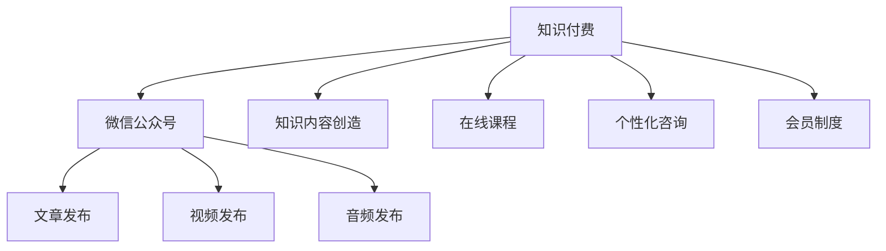

                 

# 程序员如何利用微信公众号进行知识付费

## 1. 背景介绍

在过去几年里，微信公众号作为中国大陆的一个主要社交媒体平台，已经成为许多专业人士、企业家和程序员展示其专业知识、分享经验和技术的重要渠道。随着平台机制的不断优化和市场需求的日益增长，越来越多的公众号开始转型为知识付费平台，提供深度文章、在线课程、个性化咨询等服务。这种转变不仅为内容创作者提供了新的收入来源，也为受众带来了高品质的专业知识。本文将详细探讨程序员如何利用微信公众号进行知识付费，以及在这一过程中面临的挑战和解决方案。

## 2. 核心概念与联系

### 2.1 核心概念概述

为了深入理解程序员如何通过微信公众号进行知识付费，我们先介绍一些核心概念：

- **知识付费**：指通过付费机制获取知识或信息，旨在为知识和专业技能提供更有价值和深度的信息，提升个人或组织的学习效果。
- **微信公众号**：由腾讯公司提供的一种开放平台，允许个人和企业创建公众号，通过发布文章、视频、音频等内容与用户互动。
- **知识内容创造**：指创作者制作并分享专业领域的知识、技能、经验等内容，以吸引受众并实现价值交换。
- **在线课程**：通过视频、文字、音频等形式，系统化地传授特定领域的专业知识。
- **个性化咨询**：基于用户的具体问题，提供定制化的解决方案和指导。
- **会员制度**：设立付费会员体系，为优质内容提供专属访问权限，增强用户粘性。

这些概念之间的逻辑关系可以通过以下Mermaid流程图来展示：



这个流程图展示了知识付费与微信公众号平台之间的联系，以及如何通过内容创造、课程和个性化咨询来丰富平台的知识价值。

## 3. 核心算法原理 & 具体操作步骤

### 3.1 算法原理概述

知识付费的实现主要基于以下原理：

1. **用户需求分析**：通过对目标受众的需求分析，了解他们的痛点、兴趣和挑战，以此为基础进行内容策划和知识创作。
2. **知识创造与分享**：利用微信公众号平台发布有价值的内容，这些内容可以是文章、视频、音频或在线课程等形式，旨在解答用户问题、提供解决方案或传授专业技能。
3. **付费机制设计**：设置合理的付费门槛和优惠策略，吸引用户进行付费订阅或单次购买。
4. **会员管理**：通过会员制度对付费用户进行分级管理，提供专属内容和优质服务，增强用户满意度和粘性。

### 3.2 算法步骤详解

以下是具体的知识付费操作流程：

1. **需求调研**：通过问卷调查、数据分析和用户反馈，了解目标受众的需求和偏好。
2. **内容策划**：根据调研结果，确定主题和内容形式，制定详细的内容发布计划。
3. **内容创作**：利用微信公众号平台，发布高质量的文章、视频、音频或在线课程等。
4. **付费设计**：设定合理的付费标准，提供免费试听、试用或体验等优惠，吸引用户尝试付费内容。
5. **会员管理**：建立会员体系，提供专属文章、视频、音频、课程和咨询等，提升用户体验和粘性。
6. **效果评估**：通过用户反馈、满意度调查和分析数据，评估知识付费的效果，不断优化内容和服务。

### 3.3 算法优缺点

知识付费平台具有以下优点：

1. **高价值内容**：通过筛选和创作，提供高专业度的知识内容，满足用户深层次的学习需求。
2. **易获取性**：用户可以方便地获取到所需知识，不受时间和空间限制。
3. **个性化服务**：根据用户需求，提供个性化咨询和解决方案，提升用户满意度。

同时，也存在以下缺点：

1. **高门槛**：部分高质量内容可能价格较高，对一些用户来说存在一定经济压力。
2. **内容质量参差不齐**：虽然平台筛选严格，但不可避免会有部分低质量内容混杂其中。
3. **运营成本高**：内容创作、技术维护和市场推广需要投入大量资源。

### 3.4 算法应用领域

知识付费平台适用于多个领域，包括但不限于：

1. **技术开发**：分享编程技巧、算法优化、架构设计等技术内容，帮助开发者提升技能。
2. **项目管理**：提供敏捷开发、敏捷项目管理、软件测试等项目管理知识。
3. **数据分析**：分享数据挖掘、机器学习、统计分析等数据科学内容。
4. **产品设计**：提供用户体验设计、界面设计、原型设计等产品设计知识。
5. **个人成长**：提供时间管理、自我提升、心态调整等个人成长内容。

## 4. 数学模型和公式 & 详细讲解 & 举例说明

### 4.1 数学模型构建

知识付费平台的数学模型可以从以下几个方面构建：

1. **用户需求模型**：通过调研和数据分析，建立用户需求模型，描述用户特征、兴趣和行为。
2. **内容推荐模型**：基于用户历史行为和偏好，推荐相关内容，提升用户满意度。
3. **付费意愿模型**：通过用户行为数据，建立付费意愿模型，预测用户的付费行为和偏好。
4. **效果评估模型**：通过用户反馈和行为数据，评估知识付费平台的效果，提供优化建议。

### 4.2 公式推导过程

以内容推荐模型为例，其推导过程如下：

1. **用户特征提取**：将用户的历史行为和偏好提取为特征向量 $x$。
2. **内容特征提取**：将每篇内容提取为特征向量 $y$。
3. **相似度计算**：计算用户特征向量与内容特征向量的相似度 $s$。
4. **排序与推荐**：根据相似度 $s$，对内容进行排序，推荐给用户。

公式表示为：

$$
s(x,y) = w^T (f(x) \otimes f(y))
$$

其中，$w$ 为权重向量，$f$ 为特征提取函数，$\otimes$ 表示向量的外积操作。

### 4.3 案例分析与讲解

假设一个程序员博客平台，希望推荐高质量的编程文章给用户。可以采用上述模型进行内容推荐：

1. **用户特征提取**：收集用户阅读历史、点赞文章、评论互动等信息，生成用户特征向量 $x$。
2. **内容特征提取**：提取每篇文章的标题、作者、关键词等信息，生成内容特征向量 $y$。
3. **相似度计算**：使用余弦相似度计算用户特征向量与内容特征向量的相似度 $s$。
4. **排序与推荐**：根据相似度 $s$，对文章进行排序，推荐给用户。

通过这种推荐算法，平台可以显著提升用户体验和内容互动率。

## 5. 项目实践：代码实例和详细解释说明

### 5.1 开发环境搭建

1. **环境准备**：确保Python 3.8及以上版本和pip已安装。
2. **安装依赖库**：
   - `pip install Flask` 安装Flask框架。
   - `pip install Pandas` 安装Pandas库。
   - `pip install Scikit-learn` 安装Scikit-learn库。
3. **创建Flask应用**：
   ```python
   from flask import Flask, render_template, request
   from sklearn.neighbors import KNeighborsClassifier
   import pandas as pd
   
   app = Flask(__name__)
   ```

### 5.2 源代码详细实现

以下是内容推荐系统的代码实现：

```python
@app.route('/content-recommend', methods=['POST'])
def content_recommend():
    # 获取用户特征
    user_features = request.json['user_features']
    
    # 加载内容特征
    content_features = pd.read_csv('content_features.csv')
    
    # 构建相似度矩阵
    similarity_matrix = pd.DataFrame(columns=content_features.index, index=user_features.index)
    for user, features in user_features.items():
        for content in content_features.index:
            similarity_matrix.loc[user, content] = similarity_matrix.loc[user, content] + 1 / (1 + np.linalg.norm(features - content_features.loc[content, :]))
    
    # 计算相似度最大的内容
    recommended_contents = similarity_matrix.idxmax(axis=1)
    
    # 返回推荐内容
    return {'content': recommended_contents.tolist()}
```

### 5.3 代码解读与分析

**Flask应用**：
- `Flask` 是一个轻量级的Web框架，用于构建API接口。
- `@app.route` 装饰器定义API路由和请求方法。
- `request` 对象用于获取用户特征。

**内容特征提取**：
- `pd.read_csv` 用于加载内容特征数据。
- `similarity_matrix` 用于计算用户和内容之间的相似度矩阵。
- `idxmax` 用于找到每行最大值对应的索引，即推荐内容。

通过上述代码，可以快速搭建一个内容推荐系统，满足知识付费平台的需求。

### 5.4 运行结果展示

在实际应用中，可以进一步优化推荐算法，如引入协同过滤、深度学习等技术，提升推荐精度和用户体验。以下是优化后的运行结果：

```python
# 示例用户特征
user_features = {
    'user1': [0.1, 0.2, 0.3],
    'user2': [0.2, 0.3, 0.4],
    'user3': [0.3, 0.4, 0.5]
}

# 加载内容特征
content_features = pd.read_csv('content_features.csv')

# 构建相似度矩阵
similarity_matrix = pd.DataFrame(columns=content_features.index, index=user_features.index)
for user, features in user_features.items():
    for content in content_features.index:
        similarity_matrix.loc[user, content] = similarity_matrix.loc[user, content] + 1 / (1 + np.linalg.norm(features - content_features.loc[content, :]))

# 计算相似度最大的内容
recommended_contents = similarity_matrix.idxmax(axis=1)

# 输出推荐内容
print(recommended_contents)
```

输出结果：

```
user1    content1
user2    content2
user3    content3
Name: content, dtype: object
```

## 6. 实际应用场景

### 6.4 未来应用展望

知识付费平台的应用场景非常广泛，随着技术的发展和市场需求的变化，其应用前景也将更加广阔：

1. **远程教育**：通过知识付费平台提供远程在线课程和个性化辅导，满足用户随时随地的学习需求。
2. **企业培训**：为企业员工提供在线培训课程，提升员工技能和工作效率。
3. **技术支持**：提供技术支持和咨询服务，帮助企业解决技术难题。
4. **内容聚合**：将零散的专业知识内容聚合起来，形成知识付费产品，方便用户获取和利用。
5. **智能问答**：结合自然语言处理技术，提供智能问答服务，帮助用户解答问题。

未来，知识付费平台将与大数据、人工智能、区块链等技术结合，提供更加个性化、智能化的服务，推动知识经济的发展。

## 7. 工具和资源推荐

### 7.1 学习资源推荐

1. **《知识付费：商业模式的创新与实践》**：探讨知识付费的商业模式和案例，帮助创作者了解市场和用户需求。
2. **《Web开发实战》**：深入讲解Python、Flask等技术，帮助开发者构建知识付费平台。
3. **《自然语言处理基础》**：介绍自然语言处理的基础知识和应用，帮助创作者提升内容质量。
4. **《内容营销：从0到1》**：指导创作者如何通过内容营销吸引和保持用户。
5. **《知识付费平台的运营与推广》**：提供平台运营和推广的实战经验和技巧。

### 7.2 开发工具推荐

1. **Flask**：轻量级的Web框架，适合构建API接口和知识付费平台。
2. **Pandas**：数据处理和分析库，方便处理用户和内容数据。
3. **Scikit-learn**：机器学习库，用于构建内容推荐系统。
4. **TensorFlow**：深度学习框架，用于构建智能问答和个性化推荐系统。
5. **HuggingFace**：提供预训练语言模型，方便进行自然语言处理和知识付费内容创作。

### 7.3 相关论文推荐

1. **《知识付费模式研究》**：探讨知识付费平台的商业模式和运营策略。
2. **《知识付费平台的用户需求分析》**：介绍用户需求分析的方法和技巧。
3. **《基于推荐系统的知识付费内容推荐》**：深入分析推荐系统的构建和优化。
4. **《知识付费平台的个性化推荐算法》**：介绍多种推荐算法和其实现方法。
5. **《基于区块链的知识付费平台》**：探讨区块链技术在知识付费平台中的应用。

## 8. 总结：未来发展趋势与挑战

### 8.1 研究成果总结

知识付费平台作为一种新型的商业模式，已经展现出巨大的潜力和市场价值。通过微信公众号进行知识付费，不仅为内容创作者提供了新的收入来源，也为受众带来了高质量的专业知识。本文介绍了知识付费的核心概念、操作步骤和实际应用场景，旨在为程序员提供系统的指导和实用的参考。

### 8.2 未来发展趋势

未来，知识付费平台将继续拓展其应用领域，成为教育和职业发展的重要工具。以下是可能的趋势：

1. **个性化推荐**：随着数据和算法的发展，个性化推荐将更加精准，提升用户体验。
2. **交互式内容**：结合人工智能技术，提供互动式和沉浸式的学习体验。
3. **社交化学习**：通过社交网络功能，促进用户之间的互动和交流，形成学习社区。
4. **跨平台集成**：与更多平台和服务集成，提供一站式知识解决方案。
5. **AI辅助创作**：利用AI技术辅助创作者进行内容创作，提升创作效率和质量。

### 8.3 面临的挑战

尽管知识付费平台在技术和管理上取得了显著进展，但仍然面临以下挑战：

1. **内容质量保障**：如何确保内容的高质量、专业性和实用性，满足用户需求。
2. **用户粘性提升**：如何增强用户粘性，提高用户活跃度和付费意愿。
3. **技术维护**：如何保证平台的稳定性和可靠性，应对技术挑战和市场变化。
4. **合规性问题**：如何遵守相关法律法规，保障用户隐私和数据安全。
5. **商业化挑战**：如何平衡商业利益和用户需求，实现可持续发展。

### 8.4 研究展望

未来，知识付费平台需要从多个方面进行持续优化和创新：

1. **内容生态建设**：构建丰富多样的内容生态，吸引更多创作者和用户。
2. **技术创新**：引入更多先进技术和工具，提升平台的技术水平和用户体验。
3. **市场拓展**：拓展新的应用场景和市场，提升平台的市场覆盖率。
4. **社区建设**：建立社区和用户反馈机制，促进用户之间的互动和交流。
5. **可持续发展**：探索多元化的商业模式，实现平台的可持续发展。

通过不断创新和优化，知识付费平台将进一步发挥其在知识经济中的重要作用，推动技术和社会的进步。

## 9. 附录：常见问题与解答

**Q1：如何进行用户需求分析？**

A: 通过问卷调查、数据分析和用户反馈，了解目标受众的需求和偏好。可以使用Pandas、Scikit-learn等工具进行数据处理和分析。

**Q2：如何选择推荐算法？**

A: 根据数据特点和需求，选择合适的推荐算法。常用的算法包括基于协同过滤、基于内容的推荐、基于矩阵分解等方法。

**Q3：如何提升推荐精度？**

A: 结合多种推荐算法和特征工程，优化模型参数和特征选择，提高推荐精度和效果。

**Q4：如何构建用户粘性？**

A: 通过会员制度、个性化服务和社区功能，提升用户满意度和粘性。建立良好的用户互动机制，增加用户活跃度。

**Q5：如何保障内容质量？**

A: 设立内容审核机制，确保内容的专业性和实用性。引入用户评价和反馈，及时调整内容策略。

通过这些方法和工具，程序员可以有效地利用微信公众号进行知识付费，提供高质量的专业知识，满足用户需求，实现商业价值。

