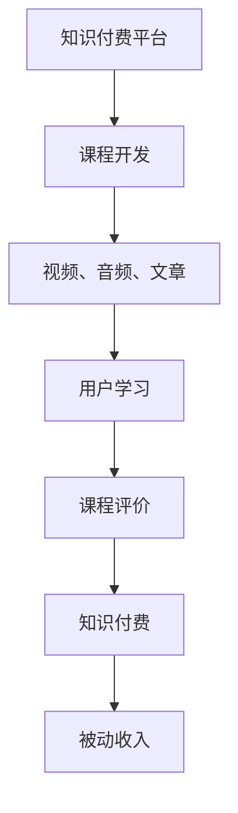

                 

# 程序员如何利用知识付费获得被动收入

在数字化时代，互联网赋予了人们更多追求自我成长和实现经济独立的机会。尤其是在IT技术领域，不断涌现出新的技术、工具和框架，要求程序员持续学习，跟上行业的发展步伐。然而，传统的“打工”模式已经无法满足程序员对时间自由和经济收益的双重需求。这时，知识付费便成为一种值得探索的收入方式，它不仅可以帮助程序员积累经验，还能提供稳定的被动收入来源。

## 1. 背景介绍

### 1.1 知识付费的时代背景

随着互联网的普及和数字技术的不断发展，知识付费成为越来越多人的选择。不同于传统的教育培训，知识付费强调即时性和实用性的结合，通过一对一咨询、专题培训、项目实战等方式，解决实际工作中的问题。对程序员而言，知识付费能够提供量身定制的学习内容和解决方案，帮助他们提升技能，增强竞争力。

### 1.2 知识付费的优势

- **个性化学习**：知识付费平台能够根据用户需求推荐相应的课程和资料，提供个性化的学习路径。
- **高效学习**：通过视频、音频、文章等多种形式，知识付费可以更灵活、便捷地进行学习，缩短学习时间和成本。
- **实用性高**：知识付费的内容往往是实战导向的，能够帮助学员解决实际工作中的问题，提升工作效率。
- **收益潜力大**：知识付费市场正在迅速扩大，优质内容拥有高溢价空间，能够带来稳定的收入。

### 1.3 程序员的行业优势

- **技术积累**：程序员具备扎实的技术基础和实践经验，能够提供有价值的知识内容。
- **时间自由**：相比于传统的“打工”模式，程序员有更多的自由时间，可以进行知识付费。
- **社交网络**：程序员通常拥有广泛的社交网络，能够接触到更多潜在的学习需求者。

## 2. 核心概念与联系

### 2.1 核心概念概述

- **知识付费**：指通过付费方式获取知识和信息，包括课程、文档、咨询等。
- **知识分享**：指将个人所掌握的知识和经验分享给他人，获取回报的过程。
- **被动收入**：指不需要主动投入时间和精力，即通过知识付费等形式获得的收入。
- **专业培训**：指针对特定技能或知识领域的系统性学习和训练。
- **项目实战**：指在真实项目中进行实践，提升解决实际问题的能力。

这些概念之间存在紧密的联系，知识付费是知识分享的一种形式，而被动收入则是知识付费带来的经济效益。专业培训和项目实战则是知识付费的重要内容，能够帮助创作者提供高质量的课程和资料。

### 2.2 核心概念原理和架构的 Mermaid 流程图



此流程图展示了知识付费的基本流程：平台提供课程，用户购买后学习，通过评价反馈，创作者获得报酬，最终实现被动收入。

## 3. 核心算法原理 & 具体操作步骤

### 3.1 算法原理概述

知识付费的核心算法原理在于通过用户行为数据进行个性化推荐和收益分配。具体来说，平台会根据用户的学习历史、评价反馈、支付行为等数据，推荐最适合的学习内容和课程。创作者则通过平台的数据分析系统，获取收益，实现被动收入。

### 3.2 算法步骤详解

#### 3.2.1 课程开发

- **选题规划**：根据市场需求和个人兴趣，选择合适的课程主题。
- **内容制作**：制作课程视频、音频、文档等学习资料，并进行编辑、校对和测试。
- **平台发布**：将制作好的课程上传至知识付费平台，并进行推广。

#### 3.2.2 用户学习

- **平台注册**：用户通过平台注册账号，选择感兴趣的课程。
- **课程购买**：用户支付费用购买课程，开始学习。
- **进度跟踪**：用户可以查看学习进度，完成各个阶段的任务。

#### 3.2.3 课程评价

- **实时反馈**：用户在课程学习过程中，可以进行实时评价，给出意见和建议。
- **数据分析**：平台对评价数据进行分析，生成统计报告。

#### 3.2.4 收益分配

- **分成计算**：平台根据用户购买次数和评价反馈，计算创作者的收益。
- **资金结算**：平台将收益打入创作者指定的账户。

### 3.3 算法优缺点

#### 3.3.1 优点

- **灵活自由**：创作者可以根据自己的兴趣和市场需求，灵活安排课程内容。
- **收益稳定**：通过平台的数据分析，创作者可以获得稳定的收益。
- **高效传播**：平台具有强大的用户流量，能够迅速传播高质量课程。

#### 3.3.2 缺点

- **竞争激烈**：知识付费市场竞争激烈，需要不断创新和优化课程内容。
- **平台抽成**：平台通常会抽取一定比例的费用作为服务费，创作者收益可能受影响。
- **用户信任**：创作者需要建立良好的口碑和信誉，才能吸引更多用户。

### 3.4 算法应用领域

知识付费在多个领域都有广泛的应用，主要集中在以下几个方面：

- **技术开发**：提供编程语言、框架、工具等的学习和实战课程。
- **项目管理**：教授敏捷开发、项目管理、团队协作等知识。
- **数据分析**：讲解数据科学、机器学习、大数据等领域的知识和技能。
- **软技能提升**：如沟通技巧、领导力、时间管理等软技能的学习。

## 4. 数学模型和公式 & 详细讲解 & 举例说明

### 4.1 数学模型构建

知识付费的收益模型可以简单表示为：

$$ \text{创作者收益} = \text{用户购买次数} \times \text{单次购买金额} \times (1-\text{平台抽成比例}) $$

其中，平台抽成比例通常在30%到50%之间。

### 4.2 公式推导过程

以某知识付费平台为例，设单次课程价格为 $P$，平台抽成比例为 $\alpha$，用户购买次数为 $N$。则创作者总收益为：

$$ \text{创作者收益} = N \times P \times (1-\alpha) $$

假设每门课程平均有 $M$ 位用户购买，则总购买次数 $N$ 可以表示为：

$$ N = M \times \text{课程曝光量} \times \text{转化率} $$

其中，课程曝光量和转化率受多种因素影响，如平台广告投放、课程内容质量等。

### 4.3 案例分析与讲解

假设一门课程的单价为99元，平台抽成比例为40%，每门课程平均有1000位用户购买。则每门课程的创作者收益为：

$$ \text{创作者收益} = 1000 \times 99 \times (1-0.4) = 5400 \text{元} $$

这意味着，只要课程有稳定的用户购买，创作者就能获得可观的被动收入。

## 5. 项目实践：代码实例和详细解释说明

### 5.1 开发环境搭建

首先，我们需要搭建一个开发环境，进行课程开发和测试。推荐使用Python编程语言和Flask框架，实现一个简单的知识付费平台。

#### 5.1.1 安装Python和Flask

- **Python安装**：从官网下载并安装Python 3.x版本。
- **Flask安装**：使用pip安装Flask框架，命令为 `pip install Flask`。

#### 5.1.2 配置开发环境

- **创建项目目录**：创建项目文件夹，并初始化Flask应用。
- **配置数据库**：配置SQLite数据库，用于存储课程、用户等数据。

### 5.2 源代码详细实现

以下是一个简单的课程发布和用户学习流程的Flask应用代码实现：

```python
from flask import Flask, render_template, request
from flask_sqlalchemy import SQLAlchemy
import random

app = Flask(__name__)
app.config['SQLALCHEMY_DATABASE_URI'] = 'sqlite:///course.db'
db = SQLAlchemy(app)

class Course(db.Model):
    id = db.Column(db.Integer, primary_key=True)
    title = db.Column(db.String(100))
    content = db.Column(db.Text)
    price = db.Column(db.Float)

class User(db.Model):
    id = db.Column(db.Integer, primary_key=True)
    name = db.Column(db.String(100))
    courses = db.relationship('Course', backref='users')

@app.route('/')
def index():
    courses = Course.query.all()
    return render_template('index.html', courses=courses)

@app.route('/purchase', methods=['POST'])
def purchase():
    course_id = request.form['course_id']
    user_id = request.form['user_id']
    course = Course.query.get(course_id)
    user = User.query.get(user_id)
    if user.courses.count() < 3:  # 限制每个用户最多购买3门课程
        user.courses.append(course)
        db.session.commit()
        return 'Purchase successful'
    else:
        return 'Purchase failed: Max limit reached'

@app.route('/learn', methods=['GET', 'POST'])
def learn():
    user_id = request.form['user_id']
    user = User.query.get(user_id)
    courses = user.courses
    return render_template('learn.html', courses=courses)

if __name__ == '__main__':
    app.run(debug=True)
```

### 5.3 代码解读与分析

#### 5.3.1 数据库设计

- **Course模型**：定义课程表，包含课程ID、标题、内容、价格等字段。
- **User模型**：定义用户表，包含用户ID、姓名、已购买课程ID等字段。

#### 5.3.2 课程发布

- **指数页面**：展示所有课程，用户可以选择购买。
- **购买页面**：用户选择要购买的课程和用户ID，提交购买请求。
- **学习页面**：展示用户已购买的课程，并进行学习。

### 5.4 运行结果展示

运行以上代码后，可以在浏览器中访问`localhost:5000`，进入指数页面，进行课程发布和购买操作。成功购买课程后，可以在学习页面中查看已购买课程，进行学习。

## 6. 实际应用场景

### 6.1 技术开发课程

以Web开发为例，一个典型的技术开发课程可以包括：

- **HTML/CSS基础**：讲解HTML标签、CSS样式、布局等基础内容。
- **JavaScript编程**：讲解JavaScript基础语法、DOM操作、事件处理等。
- **框架实战**：使用流行的Web框架，如Django、Flask等，进行项目实战。

### 6.2 项目管理课程

项目管理课程可以包括：

- **敏捷开发**：讲解敏捷开发的原则、流程和工具。
- **Scrum**：讲解Scrum框架的具体应用和实践。
- **团队协作**：讲解团队沟通、任务管理、版本控制等。

### 6.3 数据分析课程

数据分析课程可以包括：

- **数据清洗**：讲解数据预处理、特征工程等。
- **机器学习**：讲解常用机器学习算法和应用场景。
- **大数据技术**：讲解Hadoop、Spark等大数据技术。

### 6.4 未来应用展望

随着知识付费市场的不断发展，未来可能会出现更多创新的应用形式：

- **虚拟现实课程**：通过VR技术，提供更加沉浸式的学习体验。
- **个性化推荐系统**：利用AI技术，推荐最适合用户的学习内容。
- **社区互动**：建立学习社区，促进用户之间的交流和互动。

## 7. 工具和资源推荐

### 7.1 学习资源推荐

- **Coursera**：提供大量高质量的在线课程，涵盖多个技术领域。
- **Udemy**：提供实用性强、实战导向的课程，适合快速学习。
- **Pluralsight**：提供软件开发、IT运维、项目管理等课程，内容详实。

### 7.2 开发工具推荐

- **PyCharm**：功能强大的Python IDE，支持多种语言和框架。
- **Visual Studio Code**：轻量级的代码编辑器，支持多种插件和扩展。
- **Git**：版本控制系统，用于代码管理和团队协作。

### 7.3 相关论文推荐

- **Knowledge Is Power: Using Online Learning Platforms to Promote Skills**：探讨在线学习平台如何促进个人技能提升。
- **Content Creation in the E-Learning Platform: How to Create Effective Courses**：提供高质量课程开发的具体方法和技巧。
- **Monetizing Online Content**：探讨在线内容创作者的收益模式和策略。

## 8. 总结：未来发展趋势与挑战

### 8.1 研究成果总结

知识付费作为一种新兴的收入方式，为程序员提供了新的经济机会和发展方向。通过知识付费，程序员不仅可以积累经验、提升技能，还能获得稳定的被动收入。然而，知识付费市场竞争激烈，创作者需要不断创新和优化课程内容，才能获得用户青睐。

### 8.2 未来发展趋势

- **市场规模扩大**：随着知识付费市场的不断成熟，用户对高质量课程的需求将增加，创作者收益有望进一步提升。
- **内容多样化**：知识付费内容将更加多样化，涵盖更多领域的知识和技能。
- **技术手段丰富**：AI、VR等新技术将应用于知识付费平台，提升用户体验和学习效果。

### 8.3 面临的挑战

- **内容质量**：创作者需要不断提升课程质量，避免内容同质化。
- **用户获取**：平台需要采用多种营销手段，吸引更多用户。
- **市场监管**：需要建立完善的市场监管机制，保护创作者和用户的权益。

### 8.4 研究展望

未来的知识付费将更加注重个性化、互动化和实用化。创作者需要深入理解用户需求，提供量身定制的课程内容。平台则需要利用AI和大数据技术，实现更精准的课程推荐和收益分配。

## 9. 附录：常见问题与解答

**Q1: 知识付费平台的盈利模式有哪些？**

A: 知识付费平台的盈利模式主要有以下几种：

1. **课程销售**：用户购买课程，创作者获得分成。
2. **会员订阅**：用户订阅会员，获得专属课程和资源。
3. **广告收入**：平台在课程页面展示广告，获得广告收入。
4. **增值服务**：提供额外的增值服务，如专属咨询、个性化指导等。

**Q2: 知识付费的内容质量如何保证？**

A: 知识付费的内容质量可以通过以下几个方面保证：

1. **专业认证**：要求课程开发者具备专业认证或实际工作经验。
2. **用户评价**：用户可以对课程进行评价，平台根据评价结果推荐优质课程。
3. **定期更新**：定期更新课程内容，保持课程的时效性和实用性。

**Q3: 如何提高知识付费课程的曝光量和转化率？**

A: 提高课程曝光量和转化率的关键在于：

1. **课程推广**：通过平台广告、社交媒体等渠道推广课程。
2. **精准定位**：根据用户行为数据，精准定位潜在用户。
3. **营销活动**：定期举办营销活动，如限时优惠、免费试用等。

**Q4: 如何应对知识付费市场中的竞争？**

A: 应对知识付费市场竞争的策略包括：

1. **差异化**：提供与众不同的课程内容，满足用户独特需求。
2. **品牌建设**：建立良好的品牌声誉，提升用户信任感。
3. **持续创新**：不断优化课程内容和教学方法，保持竞争力。

**Q5: 知识付费平台如何选择合适的内容创作者？**

A: 知识付费平台选择内容创作者时，应考虑以下几个方面：

1. **专业背景**：具备相关领域的专业知识和实际经验。
2. **用户评价**：过往课程的评价和用户反馈。
3. **实战能力**：能够提供实用的技能和工具。

通过系统地回答这些问题，相信读者能对知识付费有更深入的理解和认识，同时也能够掌握利用知识付费获得被动收入的关键技能。

---

作者：禅与计算机程序设计艺术 / Zen and the Art of Computer Programming

