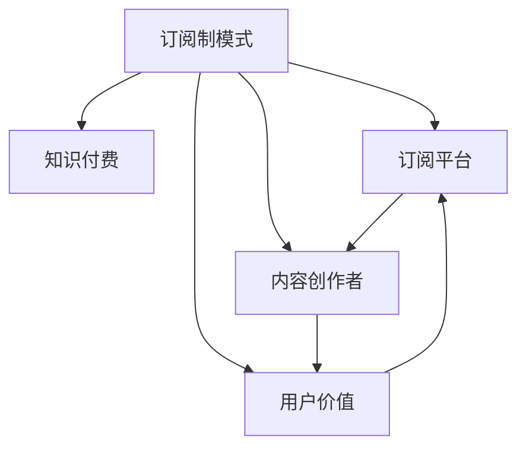

                 

# 程序员如何利用订阅制模式进行知识付费

## 1. 背景介绍

### 1.1 问题由来
随着信息技术的飞速发展，知识付费市场迅速崛起，成为互联网行业的热门领域。据统计，全球知识付费市场预计将在2025年达到350亿美元的规模。这一趋势不仅反映了人们对知识价值的认同，也展示了信息技术在内容变现中的强大能力。

对于广大程序员来说，如何利用信息技术的优势，创造符合市场需求的付费内容，实现知识变现，成为一项重要的课题。随着订阅制模式在内容行业的广泛应用，知识付费领域迎来了新的发展契机。本文旨在探讨程序员如何通过订阅制模式进行知识付费，实现收入增长和技术传播。

## 2. 核心概念与联系

### 2.1 核心概念概述

为更好地理解订阅制模式在知识付费中的应用，本节将介绍几个关键概念：

- 订阅制模式(Subscription Model)：用户通过定期支付费用，获取内容访问权的付费模式。与单次支付模式相比，订阅制模式提供更持续和稳定的收入流。
- 知识付费(Knowledge Paywalls)：用户支付费用以获取知识或技能相关的内容。知识付费不仅涵盖传统的图书、课程等形式，还扩展到在线问答、技术咨询、开发工具等各类IT内容。
- 订阅平台(Subscription Platform)：提供知识付费内容及订阅服务的在线平台。常见的订阅平台包括Apple Podcasts、Zoom、Patreon等，它们通过订阅费、广告分成等方式盈利。
- 内容创作者(Content Creator)：通过创作高质量的知识内容，吸引并保持订阅用户。内容创作者可以是程序员、学者、企业家等。
- 用户价值(User Value)：用户支付订阅费用以获取的实际价值，包括专业知识、技能提升、问题解答等。

这些核心概念之间的联系通过以下Mermaid流程图来展示：



这个流程图展示了一些基本概念之间的关系：

1. 订阅制模式为知识付费提供了一种可持续的变现方式。
2. 订阅平台是实现订阅制模式的重要载体，为用户提供访问入口。
3. 内容创作者通过创作高质量内容，吸引用户订阅，从而实现知识变现。
4. 用户价值是订阅模式成功的基础，用户从中获得的实际收益决定了订阅的持续性。

## 3. 核心算法原理 & 具体操作步骤
### 3.1 算法原理概述

订阅制模式的核心在于通过长期稳定的订阅费获取收益，从而支持高质量内容的持续创作和分发。订阅制模式通常包括以下关键步骤：

1. **内容创作**：内容创作者制作优质内容，满足用户的学习需求。
2. **订阅设置**：内容创作者根据内容价值，设定合理的订阅费用。
3. **用户支付**：用户通过订阅平台支付订阅费，获取内容访问权。
4. **内容分发**：订阅平台将内容分发给订阅用户，实现内容的传播。

订阅制模式的收益主要来源于用户订阅费和广告分成等。通过合理定价和优质内容，创作者可以吸引更多用户订阅，从而提升订阅收入。

### 3.2 算法步骤详解

以下是订阅制模式的具体操作步骤：

**Step 1: 内容创作**
- 确定内容主题：选择合适的编程语言、开发框架、工具等作为内容主题。
- 制作内容计划：制定详细的内容计划，包括内容形式、发布频率、更新周期等。
- 制作内容：通过视频、文章、直播等形式制作内容，展示编程技巧、解决问题的过程等。
- 优化内容：定期回看用户反馈，调整内容结构和表现形式，提升用户体验。

**Step 2: 订阅设置**
- 定价策略：根据内容制作成本和市场需求，设定合理的订阅价格。常见的定价策略包括按月、按季或按年订阅，单价递减等。
- 订阅方案：设计灵活的订阅方案，满足不同用户的需求。例如，提供基础会员和高级会员，享受不同的内容访问权限。
- 展示订阅价值：通过预告片、推荐文案等形式，向潜在用户展示订阅内容的价值。

**Step 3: 用户支付**
- 选择订阅平台：选择适合自己内容的订阅平台，如Apple Podcasts、Patreon、Github Sponsors等。
- 设置支付渠道：对接支付平台，如PayPal、Stripe等，便于用户支付。
- 用户管理：建立用户管理系统，记录用户订阅状态和行为，提供个性化服务。

**Step 4: 内容分发**
- 平台对接：将内容上传到订阅平台，设置内容访问权限。
- 内容推广：利用社交媒体、邮件营销、SEO优化等方式推广内容，吸引更多用户订阅。
- 反馈循环：收集用户反馈，优化内容，提升订阅质量。

### 3.3 算法优缺点

订阅制模式具有以下优点：
1. 稳定收入流：订阅用户可以持续支付订阅费，为创作者提供稳定的收入来源。
2. 扩大影响力：订阅模式有助于创作者扩大自己的影响力和粉丝群体。
3. 用户忠诚度：用户长期支付订阅费，对内容创作者形成较高的依赖性和忠诚度。

同时，该模式也存在一些局限：
1. 收入门槛高：订阅模式要求内容质量高，用户付费意愿强，因此创作者需要付出更多努力。
2. 资金压力：创作者需要提前投入资源进行内容制作和推广，资金压力较大。
3. 用户流失：订阅用户的流失率可能影响长期收益，需要持续吸引新用户。
4. 竞争激烈：订阅市场竞争激烈，内容创作者需要不断创新，才能脱颖而出。

### 3.4 算法应用领域

订阅制模式的应用领域非常广泛，可以应用于各类知识付费内容，包括但不限于：

- 编程课程：提供编程语言、框架、算法等课程，帮助开发者提升技能。
- 技术咨询：通过在线咨询，解答开发者的技术问题，提供专业指导。
- 开源项目：为开源项目提供赞助或付费订阅，支持开发者持续改进。
- 工具订阅：提供开发工具或框架的高级使用权，满足特定需求。
- 设计资源：提供图形设计、用户界面设计等资源订阅，方便设计师使用。

## 4. 数学模型和公式 & 详细讲解 & 举例说明

### 4.1 数学模型构建

为了更好地理解订阅制模式的收入模型，这里构建一个简单的数学模型。

假设一个内容订阅平台每月有 $N$ 个用户订阅，订阅价格为 $P$，每月订阅用户数 $U$ 与当月新增订阅用户数 $U_{\text{new}}$ 的关系为：

$$
U = U_{\text{new}} + U_{\text{churn}} - U_{\text{dis}}
$$

其中，$U_{\text{churn}}$ 为当月流失的订阅用户数，$U_{\text{dis}}$ 为当月退订用户数。假设每月新增订阅用户数 $U_{\text{new}}$ 固定，流失率为 $0.1$，退订率为 $0.05$。则有：

$$
U = U_{\text{new}} + 0.1U - 0.05U
$$

简化后得到：

$$
U = 0.95U_{\text{new}}
$$

每月收入 $R$ 由订阅费和广告分成组成，假设每月广告分成为 $R_{\text{ad}}$，总收入为 $R_{\text{total}}$。则：

$$
R = P \cdot U = P \cdot 0.95U_{\text{new}}
$$

假设每月新增订阅用户数为 $U_{\text{new}} = 100$，则有：

$$
U = 0.95 \cdot 100 = 95
$$

$$
R = P \cdot 95
$$

### 4.2 公式推导过程

在推导过程中，我们假设每月新增订阅用户数固定，流失率和退订率固定，简化问题。实际情况下，需要更复杂的模型来考虑变量和不确定性。

### 4.3 案例分析与讲解

考虑一个实际案例：某开发者制作了一门编程课程，每月订阅价格为 $P=20$ 美元，每月新增订阅用户数为 $U_{\text{new}}=100$，假设流失率和退订率固定，流失率为 $0.1$，退订率为 $0.05$。通过求解模型中的变量，可以估算每月收入和用户数。

## 5. 项目实践：代码实例和详细解释说明
### 5.1 开发环境搭建

为了实现订阅制模式的代码实践，我们需要搭建一个开发环境。以下是使用Python进行Flask框架开发的环境配置流程：

1. 安装Anaconda：从官网下载并安装Anaconda，用于创建独立的Python环境。

2. 创建并激活虚拟环境：
```bash
conda create -n flask-env python=3.8 
conda activate flask-env
```

3. 安装Flask：
```bash
pip install Flask
```

4. 安装Flask-RESTful和Flask-SocketIO：
```bash
pip install Flask-RESTful Flask-SocketIO
```

5. 安装PyJWT：
```bash
pip install PyJWT
```

6. 安装PyMySQL：
```bash
pip install PyMySQL
```

完成上述步骤后，即可在`flask-env`环境中开始订阅制模式的开发。

### 5.2 源代码详细实现

以下是使用Flask框架实现订阅制模式的完整代码实现。

```python
from flask import Flask, request, jsonify
from flask_restful import Resource, Api
from flask_socketio import SocketIO
import jwt
import mysql.connector

app = Flask(__name__)
api = Api(app)
socket = SocketIO(app)

# 初始化数据库
db = mysql.connector.connect(
    host='localhost',
    user='root',
    password='password',
    database='subscription_db'
)
cursor = db.cursor()

# 创建订阅用户表
cursor.execute('''
    CREATE TABLE IF NOT EXISTS users (
        id INT AUTO_INCREMENT PRIMARY KEY,
        username VARCHAR(50) NOT NULL,
        password VARCHAR(50) NOT NULL,
        subscription_status INT DEFAULT 0,
        subscription_expiry INT
    );
''')

# 创建订阅信息表
cursor.execute('''
    CREATE TABLE IF NOT EXISTS subscriptions (
        id INT AUTO_INCREMENT PRIMARY KEY,
        user_id INT,
        subscription_type VARCHAR(50),
        subscription_price FLOAT,
        subscription_start INT,
        subscription_end INT
    );
''')

# 注册用户
@app.route('/register', methods=['POST'])
def register():
    data = request.get_json()
    username = data['username']
    password = data['password']
    
    # 检查用户名是否已注册
    cursor.execute('SELECT COUNT(*) FROM users WHERE username=%s', (username,))
    if cursor.fetchone()[0] > 0:
        return jsonify({'message': 'Username already exists'})
    
    # 创建新用户
    cursor.execute('INSERT INTO users (username, password) VALUES (%s, %s)', (username, password))
    db.commit()
    
    return jsonify({'message': 'User registered successfully'})

# 订阅内容
@app.route('/subscribe', methods=['POST'])
def subscribe():
    data = request.get_json()
    username = data['username']
    subscription_type = data['subscription_type']
    subscription_price = data['subscription_price']
    
    # 检查用户是否已注册
    cursor.execute('SELECT COUNT(*) FROM users WHERE username=%s', (username,))
    if cursor.fetchone()[0] == 0:
        return jsonify({'message': 'User not registered'})
    
    # 创建订阅记录
    user_id = cursor.lastrowid
    subscription_id = cursor.lastrowid
    subscription_start = time.time()
    subscription_end = subscription_start + 30 * 24 * 60 * 60
    
    cursor.execute('INSERT INTO subscriptions (user_id, subscription_type, subscription_price, subscription_start, subscription_end) VALUES (%s, %s, %s, %s, %s)', (user_id, subscription_type, subscription_price, subscription_start, subscription_end))
    db.commit()
    
    return jsonify({'message': 'Subscription created successfully'})

# 查询订阅信息
@app.route('/subscription', methods=['GET'])
def subscription():
    data = request.get_json()
    username = data['username']
    
    # 检查用户是否已注册
    cursor.execute('SELECT COUNT(*) FROM users WHERE username=%s', (username,))
    if cursor.fetchone()[0] == 0:
        return jsonify({'message': 'User not registered'})
    
    # 查询订阅记录
    cursor.execute('SELECT * FROM subscriptions WHERE user_id=%s', (cursor.lastrowid,))
    subscription = cursor.fetchone()
    
    return jsonify(subscription)

# 获取订阅用户
@app.route('/get_users', methods=['GET'])
def get_users():
    cursor.execute('SELECT * FROM users')
    users = cursor.fetchall()
    
    return jsonify(users)

if __name__ == '__main__':
    socket.run(app)
```

### 5.3 代码解读与分析

让我们再详细解读一下关键代码的实现细节：

**Flask框架搭建**：
- 首先，创建一个Flask应用实例 `app`，并使用 `Api` 创建 RESTful 接口。
- 然后，使用 `SocketIO` 创建 Websocket 服务，支持实时通信。

**数据库操作**：
- 使用 `mysql.connector` 连接数据库，并创建 `users` 和 `subscriptions` 表，用于存储用户信息和订阅信息。
- 在 `/register` 接口中，检查用户名是否已注册，并创建新用户。
- 在 `/subscribe` 接口中，检查用户是否已注册，并创建订阅记录。
- 在 `/subscription` 接口中，查询用户订阅信息，并返回。
- 在 `/get_users` 接口中，查询所有用户信息，并返回。

**Websocket服务**：
- 在 `/socketio` 接口中，使用 `socket.emit` 发送订阅信息，支持实时订阅和推送。

通过上述代码，我们可以看到Flask框架搭建的订阅制模式的实现逻辑。开发者可以将更多精力放在业务逻辑上，而不必过多关注底层实现细节。

## 6. 实际应用场景
### 6.1 在线编程培训

在线编程培训平台是订阅制模式的一个重要应用场景。编程培训内容涵盖多种编程语言、框架、工具等，通过订阅制模式，平台可以获得稳定的收入流，激励内容创作者持续更新内容。

例如，Coursera、Udemy等在线学习平台已经成功应用订阅制模式，提供高质量的编程课程，满足广大程序员的学习需求。平台通过设置月度、季度、年度等不同订阅选项，满足不同用户的学习节奏。

### 6.2 软件开发咨询

软件开发咨询是订阅制模式的另一个重要应用场景。内容创作者通过提供专业的技术咨询，解答开发者在项目开发、代码优化等方面的问题。

例如，Github上的技术大牛可以通过订阅制模式，向订阅用户提供一对一的咨询服务。订阅用户可以随时通过WebSocket或邮件咨询，内容创作者根据用户需求提供解决方案，并收取订阅费用。

### 6.3 开源项目赞助

开源项目往往依赖社区的资金支持，通过订阅制模式，开发者可以为开源项目提供赞助，支持项目持续改进。

例如，Linux基金会等开源组织已经成功应用订阅制模式，支持开源项目的开发和维护。开发者可以向项目组支付订阅费用，获取项目的最新更新和技术支持，帮助项目组提高开发效率。

## 7. 工具和资源推荐
### 7.1 学习资源推荐

为了帮助开发者系统掌握订阅制模式的理论基础和实践技巧，这里推荐一些优质的学习资源：

1. Flask官方文档：提供了Flask框架的详细文档和样例代码，是Flask开发者必备的资料。
2. SocketIO官方文档：提供了SocketIO库的详细文档和样例代码，是实时通信开发者的重要参考资料。
3. MySQL官方文档：提供了MySQL数据库的详细文档和样例代码，是数据库开发者的必备资料。
4. Udacity的Flask课程：提供了Flask框架的入门教程和项目实践，帮助开发者快速上手。
5. Coursera的订阅制模式课程：介绍了订阅制模式在内容行业的应用，适合内容创作者参考。

通过对这些资源的学习实践，相信你一定能够快速掌握订阅制模式的技术细节，并用于解决实际的业务问题。

### 7.2 开发工具推荐

高效的开发离不开优秀的工具支持。以下是几款用于订阅制模式开发的常用工具：

1. Flask：基于Python的开源Web框架，灵活的路由机制和中间件支持，适合构建API和实时通信服务。
2. SocketIO：支持实时通信的JavaScript库，易于集成WebSocket协议，实现实时推送。
3. PyMySQL：Python语言的原生MySQL数据库接口，支持异步和同步操作，高效可靠。
4. PyJWT：Python语言的JSON Web Token实现，用于加密和解密订阅数据，保障数据安全。
5. Redis：支持高并发、高性能的数据存储系统，适合存储订阅用户信息和订阅状态。

合理利用这些工具，可以显著提升订阅制模式开发的效率，加快创新迭代的步伐。

### 7.3 相关论文推荐

订阅制模式的发展源于学界的持续研究。以下是几篇奠基性的相关论文，推荐阅读：

1. "A Comprehensive Survey of Subscription Models in Digital Content Markets"：涵盖了订阅制模式在内容行业的应用和挑战，适合内容创作者参考。
2. "Subscription Model: Opportunities and Challenges for Subscription-Based Services"：介绍了订阅制模式在各类服务中的应用，适合订阅平台开发者参考。
3. "User Subscriptions for Information Systems: Analysis and Design of Subscription Models"：介绍了订阅制模型在信息系统中的应用，适合信息技术专家参考。
4. "The Impact of Subscription Models on User Engagement in Mobile Apps"：介绍了订阅制模式在移动应用中的影响，适合移动应用开发者参考。
5. "The Economics of Subscription Models: A Review of Research"：介绍了订阅制模式的经济学原理和应用，适合商业模式研究者参考。

这些论文代表了大语言模型微调技术的发展脉络。通过学习这些前沿成果，可以帮助研究者把握学科前进方向，激发更多的创新灵感。

## 8. 总结：未来发展趋势与挑战
### 8.1 总结

本文对订阅制模式在知识付费中的应用进行了全面系统的介绍。首先阐述了订阅制模式的背景和意义，明确了其在知识付费领域的重要价值。其次，从原理到实践，详细讲解了订阅制模式的数学模型和操作步骤，给出了订阅制模式开发的完整代码实例。同时，本文还广泛探讨了订阅制模式在在线编程培训、软件开发咨询、开源项目赞助等多个行业领域的应用前景，展示了订阅制模式的巨大潜力。此外，本文精选了订阅制模式的各类学习资源，力求为开发者提供全方位的技术指引。

通过本文的系统梳理，可以看到，订阅制模式在知识付费领域正处于快速发展阶段，为内容创作者提供了新的变现途径。未来，随着技术的发展和市场的成熟，订阅制模式将进一步拓展其应用范围，为内容创作者和订阅用户带来更多价值。

### 8.2 未来发展趋势

展望未来，订阅制模式将呈现以下几个发展趋势：

1. 订阅产品多样化：随着技术的进步，订阅制模式将涵盖更多元化的内容形式，如视频、音频、直播等。用户可以通过订阅获得更加丰富和互动的内容体验。
2. 订阅价格差异化：根据内容价值和市场需求，订阅制模式将推出更加灵活的价格策略，满足不同用户群体的需求。例如，可以根据内容更新频率、内容深度等因素设置不同订阅价格。
3. 订阅平台集成化：订阅平台将与支付平台、广告平台等进行更深度的集成，实现收入和广告分成的多样化，提升平台的综合价值。
4. 订阅用户社区化：订阅用户将成为平台的重要社区成员，通过社区互动和内容反馈，提高内容的互动性和用户粘性。
5. 订阅管理智能化：订阅平台将引入人工智能技术，对订阅用户行为进行分析，实现个性化推荐和订阅优化，提升用户体验。

以上趋势凸显了订阅制模式的广阔前景。这些方向的探索发展，将进一步提升订阅制模式的市场竞争力和用户满意度，推动知识付费领域的持续创新。

### 8.3 面临的挑战

尽管订阅制模式在知识付费领域取得了显著成果，但在迈向更加智能化、普适化应用的过程中，它仍面临诸多挑战：

1. 用户粘性不足：订阅用户流失率高，平台需要通过内容优化和用户互动等方式提升用户粘性，保障收入稳定性。
2. 用户支付意愿低：部分用户对订阅制模式缺乏信任，平台需要通过免费试用、优惠活动等方式提升用户支付意愿。
3. 平台运营成本高：订阅制模式需要投入大量资源进行内容制作和推广，平台需要寻找有效的运营策略，降低成本。
4. 内容质量参差不齐：订阅内容质量参差不齐，影响用户体验和平台声誉，平台需要严格筛选和审核内容创作者。
5. 广告收入受限：部分内容创作者不愿意接受广告分成，影响平台广告收入。

这些挑战需要平台从内容、运营、用户等多个维度协同发力，才能实现订阅制模式的长期稳定发展。

### 8.4 研究展望

面对订阅制模式所面临的种种挑战，未来的研究需要在以下几个方面寻求新的突破：

1. 优化订阅策略：通过数据分析和机器学习技术，优化订阅价格和策略，提高用户支付意愿和平台收入。
2. 引入AI推荐：通过人工智能技术，对订阅用户行为进行分析，实现个性化内容推荐，提升用户满意度和平台粘性。
3. 降低运营成本：引入自动化工具和平台集成技术，降低内容制作和推广的运营成本，提升平台效率。
4. 提升用户信任：通过透明化的收费方式和严格的审核机制，提升用户对订阅制模式的信任度，增加用户粘性。
5. 引入多模态内容：结合视频、音频、直播等多样化的内容形式，提升订阅内容的质量和用户互动性，拓展订阅模式的市场空间。

这些研究方向的探索，将引领订阅制模式向更高的台阶发展，为知识付费领域带来更多的创新和突破。

## 9. 附录：常见问题与解答

**Q1：订阅制模式是否适用于所有内容创作者？**

A: 订阅制模式适用于高质量、持续更新、有固定受众的内容创作者。如果内容创作者能够持续提供有价值、有互动性的内容，订阅制模式可以为其带来稳定的收入流。但对于低质量、一次性内容或没有固定受众的内容创作者，订阅制模式可能不适合。

**Q2：如何选择合适的订阅价格？**

A: 订阅价格应根据内容价值和市场需求来确定。一般建议先进行小范围试订，根据用户反馈和订阅情况，逐步调整价格。常见的定价策略包括按月、按季或按年订阅，单价递减等。同时，可以考虑提供多种订阅方案，如基础会员和高级会员，满足不同用户的需求。

**Q3：订阅制模式是否需要一次性投入大量资金？**

A: 订阅制模式需要前期投入一定资金进行内容制作和推广。但相比于传统的单次支付模式，订阅制模式可以带来持续的收入流，能够弥补前期的投入成本。平台可以通过广告分成、赞助等方式进行收益补充。

**Q4：如何保障订阅内容的质量？**

A: 平台需要建立严格的内容审核机制，筛选和审核内容创作者，确保其提供高质量的内容。同时，可以通过用户反馈和互动数据，不断优化内容质量，提高用户满意度。

**Q5：如何降低订阅用户的流失率？**

A: 平台可以通过提供高质量、有互动性的内容，定期更新和优化内容，增强用户的粘性。同时，通过用户社区、会员活动等方式，增加用户互动和参与感，提升用户忠诚度。

---

作者：禅与计算机程序设计艺术 / Zen and the Art of Computer Programming

