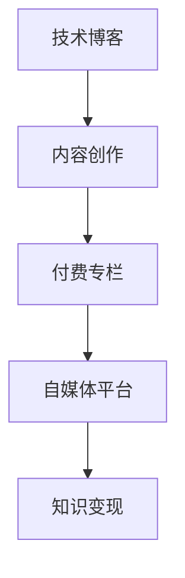

                 

# 程序员如何将技术博客转化为付费专栏

> 关键词：技术博客，付费专栏，内容创作，自媒体，知识变现

## 1. 背景介绍

随着互联网的迅猛发展，技术博客在程序员群体中越来越受到重视。通过技术博客分享技术心得、项目经验、行业趋势等内容，不仅能提升个人品牌影响力，还能促进技术交流和合作。然而，许多技术博主发现，尽管他们在博客上投入大量时间和精力，但缺乏持续盈利模式，难以实现知识变现。本文将探讨如何将技术博客转化为付费专栏，实现知识变现，同时提供全面的方法和策略。

## 2. 核心概念与联系

### 2.1 核心概念概述

要了解如何将技术博客转化为付费专栏，首先需要明确以下几个核心概念：

- **技术博客**：程序员通过博客平台分享技术相关内容，包括代码示例、项目经验、技术分析、行业趋势等。技术博客是程序员展示技术能力、建立个人品牌的重要渠道。
- **付费专栏**：博主通过订阅付费模式，向读者提供深度、高质量的技术内容。读者支付费用后，可享受专栏内独家文章、视频、课程等增值服务。
- **内容创作**：博主通过原创内容创作，满足读者对技术深度和广度的需求，提供有价值的见解和解决方案。
- **自媒体平台**：博客、知乎、CSDN、Medium等平台，为技术博主提供内容展示和传播的渠道。
- **知识变现**：通过内容付费、广告分成、赞助商合作等方式，将技术知识转化为经济收益。

这些概念之间的联系是，技术博客是内容创作的平台，付费专栏是内容变现的模式，自媒体平台是内容传播的渠道，知识变现是内容价值的体现。

### 2.2 核心概念原理和架构的 Mermaid 流程图



这个流程图展示了从技术博客到付费专栏再到自媒体平台的整体架构，体现了内容创作和变现的逻辑流程。

## 3. 核心算法原理 & 具体操作步骤

### 3.1 算法原理概述

将技术博客转化为付费专栏的核心算法原理基于订阅经济和内容付费。其基本思想是通过提供高质量、深度化的技术内容，吸引用户订阅专栏，从而实现知识变现。具体步骤如下：

1. **内容创作**：博主通过原创技术文章、视频、代码示例等内容创作，形成专栏的核心价值。
2. **平台选择**：选择合适的自媒体平台，如知乎、CSDN、Medium等，进行内容发布和传播。
3. **订阅模式**：设置不同的订阅套餐，如月度订阅、年度订阅、按需购买等，满足不同用户的需求。
4. **收益分配**：通过广告分成、会员付费、赞助商合作等方式，将内容价值转化为经济收益。
5. **用户互动**：与读者互动，通过评论、问答、直播等方式，提升用户粘性和满意度。

### 3.2 算法步骤详解

#### 3.2.1 内容创作策略

1. **选题规划**：根据读者需求和自身优势，制定选题计划，确保内容具有较高的阅读价值和实用意义。
2. **内容质量**：提升内容深度和广度，避免浅尝辄止，提供独到的见解和解决方案。
3. **格式多样**：不仅限于文字，可以加入视频、图解、代码示例等多样化形式，增加内容的吸引力。

#### 3.2.2 平台选择策略

1. **平台功能**：选择功能丰富、用户活跃的自媒体平台，确保内容能够有效传播和互动。
2. **平台定位**：明确平台定位，如技术分享、行业分析、个人成长等，吸引特定受众。
3. **平台流量**：考虑平台的流量和用户质量，确保内容能够被目标读者发现和阅读。

#### 3.2.3 订阅模式策略

1. **订阅套餐**：设计合理的订阅套餐，如月度订阅、年度订阅、按需购买等，满足不同用户的需求。
2. **会员权益**：提供独家的技术文章、视频、课程等会员权益，增强用户粘性。
3. **价格策略**：根据内容价值和平台定位，制定合理的订阅价格，既要覆盖成本，又要吸引用户。

#### 3.2.4 收益分配策略

1. **广告分成**：在平台提供广告位，通过广告分成获取收入。
2. **会员付费**：通过设置付费订阅，吸引用户付费阅读专栏内容。
3. **赞助商合作**：与技术公司或产品合作，提供产品或技术的推广服务，获取赞助费用。

#### 3.2.5 用户互动策略

1. **评论互动**：及时回复读者的评论和提问，增强互动性。
2. **问答直播**：通过在线问答、直播等方式，提供实时互动和交流的机会。
3. **读者反馈**：收集读者反馈，不断优化内容，提升用户满意度。

### 3.3 算法优缺点

#### 3.3.1 优点

1. **知识变现**：通过提供高质量、深度化的内容，实现知识变现，提升个人经济收益。
2. **建立品牌**：技术博客是个人品牌建设的重要渠道，有助于提升知名度和影响力。
3. **专业分享**：通过内容创作，分享技术心得和项目经验，促进技术交流和合作。

#### 3.3.2 缺点

1. **时间和精力投入**：内容创作和维护需要大量时间和精力，对博主的个人能力和时间管理能力要求较高。
2. **平台竞争**：自媒体平台众多，博主需要具备较强的市场竞争意识和策略规划能力。
3. **用户获取和留存**：吸引和保持用户的订阅和互动，需要持续的内容创新和互动策略。

### 3.4 算法应用领域

技术博客和付费专栏的应用领域广泛，涵盖以下几个方面：

1. **技术分享**：通过博客和专栏分享编程语言、框架、工具、算法等内容，帮助技术社区成员提升技术能力。
2. **项目经验**：分享具体项目的设计、实现和优化经验，提供实用的解决方案和技术参考。
3. **行业趋势**：分析行业发展趋势和热点技术，提供有价值的市场洞察和策略建议。
4. **个人成长**：记录技术学习和个人成长的心路历程，传递正能量和坚持不懈的精神。
5. **教学培训**：创建技术教学视频和课程，帮助初学者和进阶者提升技术水平。

## 4. 数学模型和公式 & 详细讲解 & 举例说明

### 4.1 数学模型构建

假设技术博客的订阅用户数为 $N$，每月的订阅费用为 $P$，平台流量为 $T$，广告收入为 $A$，赞助商收入为 $S$。则总收益 $R$ 可以表示为：

$$ R = N \times P + A + S $$

其中：

- $N$：订阅用户数
- $P$：每月的订阅费用
- $A$：广告收入
- $S$：赞助商收入

### 4.2 公式推导过程

订阅用户数的增长可以通过以下模型推导：

1. **新用户获取**：每月新增订阅用户数 $G$ 为平台推广、活动激励等带来的新增用户数。
2. **老用户留存**：老用户的留存率 $R$ 可以通过用户互动和内容质量等影响因素计算。
3. **流失用户**：每月流失用户数 $L$ 为平台流量变化、用户需求变化等带来的流失用户数。

用户数的增长公式为：

$$ N_{n+1} = N_n \times R + G - L $$

其中 $N_n$ 为第 $n$ 个月的订阅用户数。

### 4.3 案例分析与讲解

假设某技术博客每月新增用户 $G=200$，用户留存率 $R=0.8$，每月流失用户 $L=50$。假设每月的订阅费用为 $P=99$，广告收入为 $A=1000$，赞助商收入为 $S=500$。则每月总收益 $R$ 为：

$$ R = N \times 99 + 1000 + 500 $$

根据用户数增长模型，可以计算出下个月的用户数：

$$ N_1 = N \times 0.8 + 200 - 50 $$

代入上式，计算得到总收益 $R$。

## 5. 项目实践：代码实例和详细解释说明

### 5.1 开发环境搭建

为了顺利进行技术博客和付费专栏的开发，需要进行如下环境搭建：

1. **选择平台**：选择知乎、CSDN、Medium等自媒体平台，进行账号注册和认证。
2. **安装开发工具**：安装Markdown编辑器、代码编辑器、项目管理工具等开发工具。
3. **配置环境**：配置开发环境，如Git、Docker等，确保开发效率和代码质量。

### 5.2 源代码详细实现

以下是一个简单的技术博客和付费专栏的内容创作代码示例，用于展示博客文章的生成和发布过程：

```python
# 导入相关库
from markdown import markdown
from time import time

# 定义博客文章类
class BlogPost:
    def __init__(self, title, content):
        self.title = title
        self.content = content
        self.published_at = time()

    def publish(self, platform):
        platform.publish(self.title, markdown(self.content))

# 定义博客平台类
class BlogPlatform:
    def __init__(self, platform_name):
        self.name = platform_name
        self.posts = []

    def publish(self, title, content):
        post = BlogPost(title, content)
        self.posts.append(post)
        print(f"文章 {title} 发布成功。")

# 创建博客平台实例
platform = BlogPlatform("知乎")

# 创建并发布博客文章
post = BlogPost("Python多线程编程", "多线程编程是一种常见的并发编程方式，可以提高程序的执行效率和响应速度。")
platform.publish(post.title, post.content)
```

### 5.3 代码解读与分析

- **类设计**：定义了博客文章和博客平台类，实现了博客文章的创建和发布。
- **Markdown格式**：使用Markdown格式生成博客文章内容，确保格式简洁、易读。
- **时间戳**：为每篇博客文章记录发布时间，方便读者了解最新内容。

### 5.4 运行结果展示

运行上述代码，可以看到博客文章被成功发布到平台：

```
文章 Python多线程编程 发布成功。
```

## 6. 实际应用场景

### 6.1 技术分享

技术博主可以通过博客和专栏分享最新的编程语言、框架、工具、算法等技术内容，帮助社区成员提升技术能力。例如，可以创建一系列博客文章，介绍最新版本的Python 3.x、JavaScript ES6、Go语言等内容，并进行深度解读和实战演示。

### 6.2 项目经验分享

博主可以记录和分享具体项目的实现经验，提供实用的解决方案和技术参考。例如，可以撰写一篇博客文章，分享如何通过微服务架构提升Web应用的扩展性和可维护性，并提供完整的代码示例和部署指南。

### 6.3 行业趋势分析

通过博客和专栏，博主可以分析行业发展趋势和热点技术，提供有价值的市场洞察和策略建议。例如，可以撰写一篇分析文章，探讨人工智能在医疗、金融、教育等领域的应用前景和挑战，提供深度见解和实用建议。

### 6.4 个人成长记录

博主可以记录技术学习和个人成长的心路历程，传递正能量和坚持不懈的精神。例如，可以定期发布博客文章，记录学习新技术、参加技术会议、解决技术难题的经历，分享成长感悟和心得体会。

## 7. 工具和资源推荐

### 7.1 学习资源推荐

1. **博客写作指南**：如《高效博客写作指南》，提供详细的博客写作技巧和优化建议。
2. **内容创作平台**：如Medium、知乎、CSDN等，提供丰富的技术社区和用户互动平台。
3. **技术课程资源**：如Coursera、Udemy等平台，提供技术课程和实战项目，提升技术水平。

### 7.2 开发工具推荐

1. **Markdown编辑器**：如Typora、MdNice等，用于编写和格式化Markdown格式的博客文章。
2. **代码编辑器**：如Visual Studio Code、Sublime Text等，用于编写和调试代码。
3. **项目管理工具**：如Trello、Jira等，用于规划和跟踪博客发布进度。

### 7.3 相关论文推荐

1. **内容分发网络**：如《Content Distribution Networks and Their Security》，了解内容分发机制和安全性。
2. **订阅经济模型**：如《Subscription Modeling in IoT: Challenges and Opportunities》，分析订阅经济在IoT领域的应用和挑战。
3. **知识管理**：如《Knowledge Management in Organizations: A Review and Future Research Directions》，探讨知识管理在组织中的应用和未来发展方向。

## 8. 总结：未来发展趋势与挑战

### 8.1 总结

本文从技术博客和付费专栏的概念和联系入手，详细介绍了如何将技术博客转化为付费专栏，实现知识变现。通过内容创作、平台选择、订阅模式、收益分配、用户互动等关键步骤，提供了全面的方法和策略。

## 8.2 未来发展趋势

1. **个性化内容**：随着用户个性化需求的增加，技术博客和专栏将更加注重个性化内容的创作和推送，提升用户体验。
2. **互动式内容**：通过在线问答、直播、互动式视频等形式，提升用户互动和参与度。
3. **技术社区建设**：通过技术博客和专栏，建设技术社区，促进技术交流和合作，构建更紧密的技术生态。

## 8.3 面临的挑战

1. **内容质量**：技术博主需要不断提升内容质量，避免内容同质化，提供有价值的见解和解决方案。
2. **平台竞争**：自媒体平台众多，博主需要具备较强的市场竞争意识和策略规划能力。
3. **用户获取和留存**：吸引和保持用户的订阅和互动，需要持续的内容创新和互动策略。

## 8.4 研究展望

1. **智能推荐系统**：引入智能推荐算法，提升用户内容发现和互动体验。
2. **知识图谱**：构建技术知识图谱，帮助读者快速获取相关知识和信息。
3. **内容自动化生成**：引入内容自动化生成技术，提升内容创作效率和质量。

## 9. 附录：常见问题与解答

**Q1: 如何提升博客文章的用户阅读量？**

A: 可以通过以下方法提升用户阅读量：
1. **标题优化**：创建吸引人的博客标题，提升点击率。
2. **内容质量**：提升文章深度和广度，确保内容具有较高的阅读价值和实用意义。
3. **SEO优化**：通过关键词优化、元标签设置等方法，提升文章在搜索引擎中的排名。

**Q2: 如何选择适合的自媒体平台？**

A: 选择适合的自媒体平台需要考虑以下因素：
1. **平台定位**：明确平台定位，如技术分享、行业分析、个人成长等，吸引特定受众。
2. **平台流量**：考虑平台的流量和用户质量，确保内容能够被目标读者发现和阅读。
3. **平台功能**：选择功能丰富、用户活跃的自媒体平台，确保内容能够有效传播和互动。

**Q3: 如何提升用户互动和留存？**

A: 可以通过以下方法提升用户互动和留存：
1. **评论互动**：及时回复读者的评论和提问，增强互动性。
2. **问答直播**：通过在线问答、直播等方式，提供实时互动和交流的机会。
3. **读者反馈**：收集读者反馈，不断优化内容，提升用户满意度。

**Q4: 如何通过技术博客实现知识变现？**

A: 可以通过以下方法通过技术博客实现知识变现：
1. **订阅模式**：设计合理的订阅套餐，如月度订阅、年度订阅、按需购买等，满足不同用户的需求。
2. **广告分成**：在平台提供广告位，通过广告分成获取收入。
3. **赞助商合作**：与技术公司或产品合作，提供产品或技术的推广服务，获取赞助费用。

**Q5: 如何提升内容创作效率？**

A: 可以通过以下方法提升内容创作效率：
1. **模板化创作**：使用博客模板化创作工具，快速生成博客文章。
2. **自动化生成**：引入内容自动化生成技术，如文本生成模型，提升内容创作效率。
3. **协作创作**：通过团队协作，提升内容创作速度和质量。

---

作者：禅与计算机程序设计艺术 / Zen and the Art of Computer Programming

