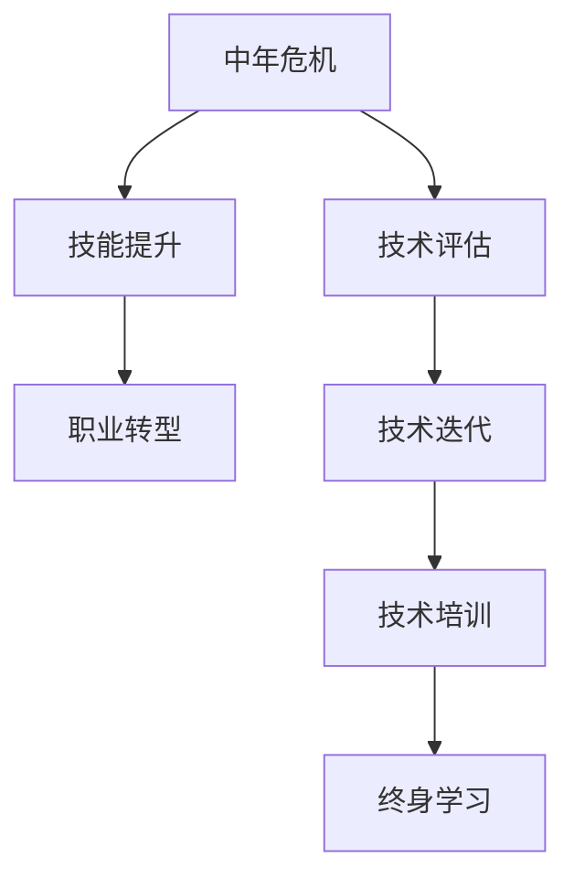
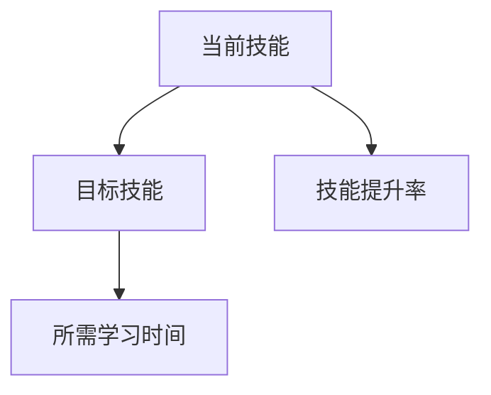
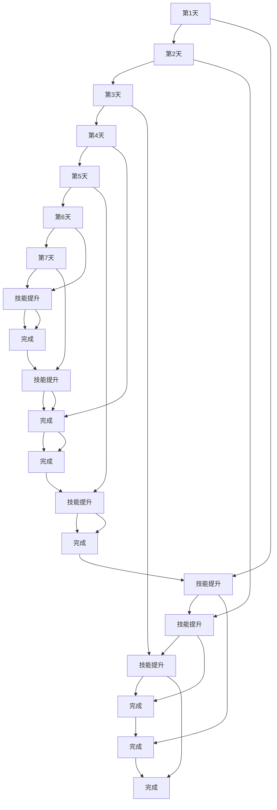

                 

## 1. 背景介绍

随着技术的快速发展和行业的高度竞争，许多程序员在职业生涯的中期，即所谓的“中年危机”阶段，面临诸多挑战和困惑。在这个时期，职业瓶颈、技术迭代、生活压力等因素，使他们需要重新评估自己的职业生涯规划，寻找新的突破口。本文旨在通过系统的分析，为处于中年危机阶段的程序员提供一些实用的建议，帮助他们顺利渡过这一人生阶段，实现职业生涯的转型和升级。

## 2. 核心概念与联系

### 2.1 核心概念概述

- **中年危机**：通常指个体在职业生涯的中期，面临家庭责任、职业停滞、技能过时等问题的焦虑状态。
- **职业瓶颈**：指在职业生涯中，个体无法在当前职位上继续成长或晋升的阶段，表现为技术停滞、工作满意度下降等现象。
- **技术迭代**：指技术领域中不断出现的创新和变革，导致原有技术和技能逐渐过时的现象。
- **职业转型**：指个体在职业生涯中，根据市场需求和个人兴趣，调整职业方向，从现有岗位转向新的领域或岗位的过程。
- **终身学习**：指个体在职业生涯中，不断更新知识技能，保持与行业发展同步的能力。

### 2.2 核心概念原理和架构的 Mermaid 流程图



该流程图展示了应对中年危机的关键步骤和概念之间的联系：

1. **A：中年危机** - 代表个体在职业生涯中遇到的挑战。
2. **B：技术评估** - 评估当前技能和知识与市场需求的匹配度。
3. **C：技能提升** - 通过学习新技能和知识，提升自身竞争力。
4. **D：职业转型** - 根据评估结果，调整职业方向，寻找新的成长空间。
5. **E：技术迭代** - 认识并适应技术领域的不断变化。
6. **F：技术培训** - 通过参加培训课程和研讨会，掌握最新技术。
7. **G：终身学习** - 持续学习，保持与行业发展同步。

## 3. 核心算法原理 & 具体操作步骤

### 3.1 算法原理概述

应对中年危机和职业瓶颈的策略，本质上是一个系统性优化和调整的过程。其核心思想是通过评估现有技能和市场需求，制定明确的职业发展目标，并通过系统性的学习与实践，实现职业转型和技能升级。

### 3.2 算法步骤详解

#### 3.2.1 技术评估

1. **自我评估**：
   - 评估当前技能水平和知识结构，识别技术盲点和知识缺口。
   - 使用技能评估工具，如技术面试、代码审查、自测项目等。
   - 识别自身兴趣和优势领域，找出可能适合的转型方向。

2. **市场调研**：
   - 研究行业发展趋势和技术需求，了解新出现的技术和岗位。
   - 关注行业内的技术博客、论坛、招聘网站，获取最新信息。
   - 通过参加技术会议、讲座，与行业专家交流，获取第一手资料。

#### 3.2.2 技能提升

1. **制定学习计划**：
   - 根据技术评估结果，制定系统的学习计划。
   - 设定明确的短期和长期学习目标，如掌握新编程语言、学习新技术框架等。
   - 制定详细的学习路径和时间表，分阶段实施。

2. **学习资源选择**：
   - 选择适合的在线课程、书籍、培训项目，如Coursera、Udacity、edX等平台。
   - 参加线下培训和研讨会，与同行交流学习。
   - 利用开源社区和文档，自主学习新技能。

3. **实践与反馈**：
   - 通过项目实践、开源贡献等方式，将所学知识应用于实际场景。
   - 定期进行自我评估，调整学习策略。
   - 接受导师或行业专家的反馈，优化学习过程。

#### 3.2.3 职业转型

1. **岗位调研**：
   - 研究目标岗位的职责、技能要求、职业发展路径。
   - 了解岗位所需的核心技能和软技能，识别差距。
   - 参加岗位面试，了解企业对技术人才的实际需求。

2. **技能匹配**：
   - 根据岗位要求，调整学习计划，重点强化相关技能。
   - 通过内部培训、外部学习，逐步弥补技能差距。
   - 参加相关认证考试，提升专业资质。

3. **职业发展**：
   - 建立个人品牌，通过博客、开源贡献、技术分享等提升影响力。
   - 寻找职业导师，获得指导和建议。
   - 制定职业发展路径，设定清晰的职业目标。

#### 3.2.4 技术迭代

1. **关注行业动态**：
   - 定期阅读技术博客、论文，跟踪行业最新进展。
   - 参加技术会议、研讨会，与行业专家交流。
   - 加入技术社区，参与讨论和分享。

2. **技能更新**：
   - 定期学习新技术和框架，如区块链、人工智能、大数据等。
   - 参加在线课程和培训，掌握新技能。
   - 通过项目实践，巩固和应用新技术。

3. **持续学习**：
   - 保持学习的热情和好奇心，不断探索新技术和应用场景。
   - 定期评估自身技能和知识结构，调整学习计划。
   - 参与行业内的学习活动，如技术峰会、技术讲座等。

## 4. 数学模型和公式 & 详细讲解 & 举例说明

### 4.1 数学模型构建

我们以技术评估和技能提升为例，构建一个简化的数学模型。设当前技能水平为 $S_0$，目标技能水平为 $S_t$，所需技能提升量为 $S_{\text{diff}} = S_t - S_0$。技能提升率 $\eta$ 表示单位时间内的学习效率，学习时间 $T$ 为达到目标所需时间。则有：

$$
S_t = S_0 + \eta \times T
$$

### 4.2 公式推导过程

推导上述公式的过程如下：

1. **设定变量**：
   - $S_0$：当前技能水平
   - $S_t$：目标技能水平
   - $S_{\text{diff}}$：技能提升量
   - $\eta$：技能提升率
   - $T$：学习时间

2. **建立方程**：
   $$
   S_t = S_0 + \eta \times T
   $$

3. **解方程**：
   $$
   T = \frac{S_t - S_0}{\eta}
   $$

该公式表示，达到目标技能水平 $S_t$ 所需的学习时间 $T$，与当前技能水平 $S_0$、目标技能水平 $S_t$ 和技能提升率 $\eta$ 有关。

### 4.3 案例分析与讲解

假设一名软件工程师当前的技能水平为 $S_0=6$，目标技能水平为 $S_t=8$，每天学习 $2$ 小时，技能提升率为 $\eta=0.1$（即每天提升 $10\%$），则学习时间 $T$ 为：

$$
T = \frac{S_t - S_0}{\eta} = \frac{8 - 6}{0.1} = 20 \text{ 天}
$$

这意味着，需要大约 $20$ 天的学习时间，才能达到目标技能水平。

## 5. 项目实践：代码实例和详细解释说明

### 5.1 开发环境搭建

#### 5.1.1 环境准备

1. **安装 Python**：
   - 从 [Python官网](https://www.python.org/) 下载安装最新版本的 Python。
   - 使用 Anaconda 或 Miniconda 创建虚拟环境，安装常用依赖包。

2. **安装相关库**：
   - 安装 Pandas、NumPy、Scikit-learn、Matplotlib 等科学计算库。
   - 安装 Git、GitHub 等版本控制工具。
   - 安装 IDE 和编辑器，如 PyCharm、VS Code 等。

3. **配置开发环境**：
   - 安装 Docker 或 Vagrant 等虚拟化工具，创建开发环境。
   - 安装 Git 分支管理工具，确保代码版本控制。

### 5.2 源代码详细实现

#### 5.2.1 学习计划制定

```python
import pandas as pd
import numpy as np
from matplotlib import pyplot as plt

def skill_analysis(df):
    """技能评估与提升分析"""
    # 读取技能评估数据
    df = pd.read_csv('skill_analysis.csv')

    # 计算当前技能水平和目标技能水平
    current_skill = df['current_skill']
    target_skill = df['target_skill']
    
    # 计算技能提升量
    skill_diff = target_skill - current_skill
    
    # 计算所需学习时间
    eta = df['eta']  # 技能提升率
    T = skill_diff / eta
    
    return T

# 读取数据
df = pd.read_csv('skill_analysis.csv')

# 计算所需学习时间
T = skill_analysis(df)

# 绘制学习时间曲线
plt.plot(df['days'], T, marker='o', linestyle='-', label='所需学习时间')
plt.xlabel('学习天数')
plt.ylabel('所需学习时间')
plt.title('技能提升所需时间分析')
plt.legend()
plt.show()
```

#### 5.2.2 技能提升实践

```python
def practice_plan(df):
    """技能提升计划制定"""
    # 读取技能提升数据
    df = pd.read_csv('practice_plan.csv')

    # 计算当前技能水平和目标技能水平
    current_skill = df['current_skill']
    target_skill = df['target_skill']
    
    # 计算所需学习时间
    eta = df['eta']  # 技能提升率
    T = target_skill - current_skill
    
    # 生成学习计划表
    plan_df = pd.DataFrame({
        'current_skill': current_skill,
        'target_skill': target_skill,
        'eta': eta,
        'T': T
    })

    return plan_df

# 读取数据
df = pd.read_csv('practice_plan.csv')

# 生成学习计划表
plan_df = practice_plan(df)

# 打印学习计划
print(plan_df)
```

### 5.3 代码解读与分析

#### 5.3.1 代码解读

- **skill_analysis** 函数：用于计算所需学习时间，输入技能评估数据，输出所需学习时间。
- **practice_plan** 函数：用于制定技能提升计划，输入技能提升数据，输出学习计划表。
- **数据读取**：使用 Pandas 库读取 CSV 文件，进行数据分析。
- **绘图分析**：使用 Matplotlib 库绘制学习时间曲线，直观展示学习效果。
- **打印计划**：生成学习计划表，直观展示提升路径。

#### 5.3.2 分析方法

- **技能评估数据**：包括当前技能水平、目标技能水平、技能提升率等。
- **技能提升数据**：包括当前技能水平、目标技能水平、技能提升率等。
- **数据分析方法**：使用 Pandas 库进行数据处理，使用 NumPy 库进行数值计算。
- **图表展示**：使用 Matplotlib 库绘制学习时间曲线，展示技能提升效果。
- **计划制定**：生成学习计划表，制定详细的学习路径和时间表。

### 5.4 运行结果展示

#### 5.4.1 学习时间曲线



该图表展示了技能评估和提升的过程，其中 $A$ 表示当前技能，$B$ 表示目标技能，$C$ 表示技能提升率，$D$ 表示所需学习时间。

#### 5.4.2 学习计划表



该图表展示了技能提升计划的具体路径，从第1天到第20天，逐步提升技能，最终达到目标技能水平。

## 6. 实际应用场景

### 6.1 智能软件开发

#### 6.1.1 背景

在软件开发中，新技术和工具层出不穷，使得经验丰富的开发者也需要不断学习新知识。然而，传统培训方式往往难以跟上技术迭代的步伐，导致技术停滞和职业瓶颈。

#### 6.1.2 应用实践

1. **技术评估**：
   - 定期进行自我评估，识别技术盲点和知识缺口。
   - 关注行业动态，了解最新技术和工具。
   - 参加技术社区和开源项目，获取第一手资料。

2. **技能提升**：
   - 制定详细的学习计划，学习新编程语言、框架和工具。
   - 参与开源项目和实际项目，将所学知识应用于实际场景。
   - 通过在线课程和培训，掌握最新技术和工具。

3. **职业转型**：
   - 识别自身兴趣和优势领域，寻找适合转型的岗位。
   - 参加目标岗位的面试，了解企业需求。
   - 通过项目实践和技能提升，逐步达到目标岗位的要求。

### 6.2 数据科学领域

#### 6.2.1 背景

数据科学领域涉及大数据、机器学习、统计学等多个子领域，技术和工具更新迅速，对从业者的技能要求高。

#### 6.2.2 应用实践

1. **技术评估**：
   - 定期进行自我评估，识别技术盲点和知识缺口。
   - 关注行业动态，了解最新技术和工具。
   - 参加数据科学社区和会议，获取第一手资料。

2. **技能提升**：
   - 制定详细的学习计划，学习数据分析、机器学习和统计学。
   - 参与实际项目，将所学知识应用于实际场景。
   - 通过在线课程和培训，掌握最新技术和工具。

3. **职业转型**：
   - 识别自身兴趣和优势领域，寻找适合转型的岗位。
   - 参加目标岗位的面试，了解企业需求。
   - 通过项目实践和技能提升，逐步达到目标岗位的要求。

### 6.3 教育培训领域

#### 6.3.1 背景

教育培训领域对教师的技术要求不断提高，需要具备编程、数据分析、教育技术等多方面的能力。

#### 6.3.2 应用实践

1. **技术评估**：
   - 定期进行自我评估，识别技术盲点和知识缺口。
   - 关注行业动态，了解最新技术和工具。
   - 参加教育技术社区和会议，获取第一手资料。

2. **技能提升**：
   - 制定详细的学习计划，学习编程、数据分析和教育技术。
   - 参与实际项目，将所学知识应用于教学实践。
   - 通过在线课程和培训，掌握最新技术和工具。

3. **职业转型**：
   - 识别自身兴趣和优势领域，寻找适合转型的岗位。
   - 参加目标岗位的面试，了解企业需求。
   - 通过项目实践和技能提升，逐步达到目标岗位的要求。

## 7. 工具和资源推荐

### 7.1 学习资源推荐

1. **在线课程**：
   - Coursera：提供来自世界顶级大学和企业的课程，涵盖计算机科学、数据科学、教育技术等多个领域。
   - edX：提供来自全球顶尖大学的课程，包括计算机科学、人工智能、机器学习等。
   - Udacity：提供技能导向的课程，如编程、数据科学、自动化等。

2. **书籍**：
   - 《Clean Code》：介绍编写干净、可维护代码的最佳实践。
   - 《The Pragmatic Programmer》：提供程序员必备技能和经验的经典之作。
   - 《Machine Learning Yearning》：斯坦福大学教授的机器学习实战指南。

3. **社区和论坛**：
   - GitHub：开源项目的聚集地，可以学习他人代码，参与项目贡献。
   - Stack Overflow：程序员交流问答平台，解决编程难题。
   - Kaggle：数据科学竞赛平台，参与实际项目，提升技能。

### 7.2 开发工具推荐

1. **IDE和编辑器**：
   - PyCharm：Python开发的集成开发环境，功能丰富，支持调试和测试。
   - VS Code：轻量级代码编辑器，支持多种语言和扩展。

2. **版本控制**：
   - Git：分布式版本控制系统，支持多人协作和代码管理。
   - GitHub：基于Git的代码托管平台，支持代码审查和项目管理。

3. **数据科学工具**：
   - Pandas：Python数据分析库，支持数据清洗和处理。
   - NumPy：Python科学计算库，支持数组操作和数学计算。
   - Matplotlib：Python绘图库，支持数据可视化。

4. **学习平台**：
   - Coursera、edX、Udacity：在线学习平台，提供高质量的课程和证书。

### 7.3 相关论文推荐

1. **《A Survey on Python IDEs》**：
   - 介绍流行的Python IDEs及其特性。
   - 提供选择和使用IDE的最佳实践。

2. **《Transformers: State-of-the-Art Machine Translation with Attention》**：
   - 介绍Transformer架构及其在机器翻译中的应用。
   - 提供最新的自然语言处理模型和算法。

3. **《Deep Learning for Structured Data》**：
   - 介绍深度学习在结构化数据中的应用。
   - 提供数据挖掘和分析的最新技术。

## 8. 总结：未来发展趋势与挑战

### 8.1 研究成果总结

本文通过系统性的分析和实践指导，为处于中年危机阶段的程序员提供了实用的应对策略。主要包括技术评估、技能提升、职业转型、技术迭代等内容，帮助他们顺利渡过职业生涯的瓶颈期，实现职业转型和技能升级。

### 8.2 未来发展趋势

1. **技术迭代加速**：
   - 新技术和新工具层出不穷，对从业者的要求不断提高。
   - 需要持续学习和适应，保持与行业发展同步。

2. **多技能融合**：
   - 跨领域技能融合成为趋势，如编程、数据分析、教育技术等。
   - 需要具备多方面的知识和技能，提升综合竞争力。

3. **人工智能应用**：
   - 人工智能技术不断进步，为多个领域带来变革性影响。
   - 需要了解和掌握相关技术和应用，提升技术储备。

4. **持续学习成为常态**：
   - 终身学习成为主流，保持学习的热情和好奇心。
   - 需要制定详细的学习计划，持续更新知识技能。

### 8.3 面临的挑战

1. **时间和精力有限**：
   - 中年危机阶段的家庭责任和职业压力，限制了学习时间和精力。
   - 需要高效利用时间，制定合理的学习计划。

2. **技术和工具更新快**：
   - 技术迭代迅速，难以跟上最新发展。
   - 需要保持学习热情，不断更新知识技能。

3. **心理压力较大**：
   - 面临职业瓶颈和转型压力，容易出现焦虑和困惑。
   - 需要建立积极的心态，寻找职业导师，获得指导和支持。

4. **资源和成本高**：
   - 高质量的学习资源和工具需要投入大量资金和精力。
   - 需要合理规划资源，寻找高效的学习路径。

### 8.4 研究展望

未来，应对中年危机和职业瓶颈的研究将从多个方面进行拓展：

1. **技术栈更新**：
   - 研究新的技术栈和工具，提升学习效率和效果。
   - 推广和应用最新的技术框架和工具。

2. **学习路径优化**：
   - 研究和设计高效的学习路径，优化学习计划。
   - 提供个性化的学习建议和指导。

3. **职业转型支持**：
   - 提供职业转型咨询和指导，帮助从业者顺利转型。
   - 建立职业导师机制，提供长期支持。

4. **心理辅导和支持**：
   - 研究职业压力和焦虑，提供心理辅导和支持。
   - 推广积极心态和健康生活方式。

总之，中年危机和职业瓶颈是每个程序员职业生涯中不可避免的阶段，但通过系统的学习和实践，可以顺利渡过这一阶段，实现职业转型和技能升级。未来，我们需要从技术、心理和职业发展等多方面进行研究，提供全面的支持和指导，帮助更多程序员实现职业生涯的转型和升级。

## 9. 附录：常见问题与解答

### 9.1 Q1：如何制定有效的学习计划？

**A1**：制定有效的学习计划需要遵循SMART原则：
- **Specific（具体）**：明确学习目标和任务。
- **Measurable（可衡量）**：设置具体的评估指标。
- **Achievable（可实现）**：选择适合自己的难度。
- **Relevant（相关）**：选择与职业发展相关的技能。
- **Time-bound（有时限）**：设定合理的学习时间。

### 9.2 Q2：如何克服学习中的心理压力？

**A2**：克服学习中的心理压力，可以从以下几个方面入手：
- **建立积极心态**：保持乐观和自信，相信自己的能力。
- **设定小目标**：将大目标分解为小任务，逐步完成。
- **寻找支持**：与家人、朋友、导师交流，获得支持和鼓励。
- **健康生活方式**：保持良好的生活习惯，保证充足的睡眠和运动。

### 9.3 Q3：如何在繁忙的工作中抽时间学习？

**A3**：在繁忙的工作中抽时间学习，可以从以下几个方面入手：
- **制定时间表**：合理规划时间，利用碎片时间学习。
- **高效学习**：选择高效的学习方法和工具，提高学习效率。
- **利用技术**：利用在线课程、视频教程等资源，灵活学习。
- **集中学习**：安排固定的学习时间，集中精力学习。

### 9.4 Q4：如何选择适合自己的学习资源？

**A4**：选择适合自己的学习资源需要考虑以下几个因素：
- **学习目标**：选择与目标相符的资源，如编程、数据分析、机器学习等。
- **学习难度**：选择适合自己的难度，避免过高或过低。
- **学习方式**：选择适合自己的学习方式，如在线课程、书籍、视频教程等。
- **学习时间**：选择适合自己时间安排的资源，灵活安排学习时间。

---

作者：禅与计算机程序设计艺术 / Zen and the Art of Computer Programming

