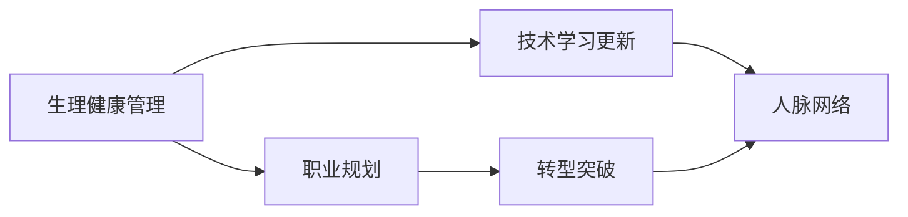

                 

## 1. 背景介绍

### 1.1 问题由来

在信息化快速发展的今天，程序员这一职业成为了许多人心中的理想选择。然而，随着年龄的增长，不少中年程序员面临着职场危机。从生理年龄的角度看，多数程序员在30岁以后开始逐渐失去敏捷反应、体力下降等问题；从心理年龄的角度看，与年轻同事相比，中年程序员的思维模式固化，适应新技术的速度变慢。这些因素叠加，导致中年程序员在职场上处于不利地位。

### 1.2 问题核心关键点

面对职场危机，中年程序员需要重新审视自己的职业生涯，找出问题所在，制定切实可行的解决方案。本博客将以技术视角，从5个维度展开讨论：

1. 生理健康管理：关注自身身心健康，保持良好的工作与生活平衡。
2. 技术学习更新：持续学习新的技术，适应快速变化的行业需求。
3. 职业规划：根据自身情况，制定合理的职业发展路径。
4. 人脉网络：建立并维护广泛的人脉网络，以助力职业发展。
5. 转型突破：考虑向更有潜力的领域转型，开辟新的职业方向。

## 2. 核心概念与联系

### 2.1 核心概念概述

本节将介绍与中年职场危机相关的核心概念，以及它们之间的联系：

1. **生理健康管理**：关注身体健康、心理健康、生活工作平衡。
2. **技术学习更新**：持续学习新技术、新框架，保持技术竞争力。
3. **职业规划**：制定长期职业目标，制定短期行动计划。
4. **人脉网络**：建立并维护职业人脉，获取资源和信息。
5. **转型突破**：评估自身职业路径，考虑跨行业或新领域转型。

这些概念相互交织，共同影响中年程序员的职业发展，需要综合运用和妥善管理。

### 2.2 核心概念原理和架构的 Mermaid 流程图



## 3. 核心算法原理 & 具体操作步骤

### 3.1 算法原理概述

中年程序员职场危机应对的算法，实际上是一个复杂的系统工程，涉及生理、技术、心理等多方面的管理与优化。其中，核心算法原理包括：

1. **生理健康管理算法**：使用科学的健康管理方法，定期检查身体状况，建立健康的生活习惯。
2. **技术学习更新算法**：通过在线课程、项目实践、技术会议等方式，持续学习前沿技术，更新知识库。
3. **职业规划算法**：运用SWOT分析、SMART目标设定等方法，制定合理的职业发展策略。
4. **人脉网络算法**：使用LinkedIn等职业社交平台，建立并维护行业人脉，获取职业发展资源。
5. **转型突破算法**：结合个人兴趣与行业需求，评估自身职业路径，考虑向更有前景的领域转型。

### 3.2 算法步骤详解

#### 3.2.1 生理健康管理

1. **定期体检**：每年进行全面的身体检查，包括血压、血糖、血脂等基础项目。
2. **健康饮食**：控制饮食结构，增加蔬菜、水果的摄入，减少高糖、高脂肪食物的摄入。
3. **规律运动**：每周至少进行三次有氧运动，如跑步、游泳等，每次30分钟以上。
4. **充足睡眠**：保证每日睡眠时间在7-9小时，避免加班熬夜。

#### 3.2.2 技术学习更新

1. **在线课程学习**：选择如Coursera、Udacity等平台的课程，学习最新的技术。
2. **项目实践**：参与开源项目，了解最新技术动态，并通过实践掌握新技能。
3. **技术会议参与**：参加如SIGGRAPH、CCF等技术会议，学习前沿科技，拓宽视野。

#### 3.2.3 职业规划

1. **SWOT分析**：进行自身优势、劣势、机会、威胁分析，制定应对策略。
2. **SMART目标设定**：设定具体、可衡量、可达成、相关、时限的目标，逐步实现职业发展。
3. **定期复盘**：每隔半年或一年进行职业发展复盘，调整目标和策略。

#### 3.2.4 人脉网络

1. **LinkedIn使用**：在LinkedIn上建立个人档案，完善个人信息，增加行业内连接。
2. **技术交流**：参加行业交流会、技术沙龙，结识业内专家。
3. **职业导师**：找到职业导师，定期交流，获取职业建议和指导。

#### 3.2.5 转型突破

1. **兴趣评估**：分析自身兴趣，评估适合转型的领域。
2. **行业调研**：了解目标行业的背景、趋势、需求，评估转型可行性。
3. **技能提升**：针对性学习新领域的核心技能，提升竞争力。

### 3.3 算法优缺点

#### 3.3.1 生理健康管理算法

**优点**：
1. 系统性地管理身体健康，预防重大疾病。
2. 提升工作效率和生活质量，增强自信心。

**缺点**：
1. 需要长期坚持，不易看到短期效果。
2. 部分措施可能与工作冲突，难以持续。

#### 3.3.2 技术学习更新算法

**优点**：
1. 保持技术前沿，提高市场竞争力。
2. 通过实践项目，掌握新技能。

**缺点**：
1. 需要耗费大量时间，影响工作进度。
2. 新技能掌握难度大，可能遇到瓶颈。

#### 3.3.3 职业规划算法

**优点**：
1. 提供明确的职业发展路径，提升方向感。
2. 帮助评估自身优势和劣势，制定可行的改进措施。

**缺点**：
1. 需要持续投入时间和精力，可能缺乏动力。
2. 受外界环境变化影响较大，难以预估。

#### 3.3.4 人脉网络算法

**优点**：
1. 获得丰富的职业资源和信息，拓宽职业机会。
2. 通过人脉关系，获取更多职业发展建议和支持。

**缺点**：
1. 需要持续维护关系，耗费时间和精力。
2. 网络质量参差不齐，可能遇到虚假信息和误导。

#### 3.3.5 转型突破算法

**优点**：
1. 重新选择职业路径，找到更适合自己的领域。
2. 突破职业瓶颈，提升职业生涯满意度。

**缺点**：
1. 转型风险高，可能面临职业断层。
2. 需要额外投入大量时间和精力，学习新技能。

### 3.4 算法应用领域

中年程序员职场危机应对的算法，可以广泛应用于技术行业的多方面。

1. **健康管理**：任何从事IT行业的职业者，都需要关注自身的身体健康。
2. **技术学习**：不仅仅是程序员，其他IT岗位也需要持续学习，掌握最新技术。
3. **职业规划**：任何人都可以进行职业规划，明确未来发展方向。
4. **人脉网络**：建立并维护人脉关系，是所有职场人士都需要考虑的问题。
5. **转型突破**：任何人在遇到职业瓶颈时，都可能需要考虑转型。

## 4. 数学模型和公式 & 详细讲解 & 举例说明

### 4.1 数学模型构建

#### 4.1.1 生理健康管理

1. **体检模型**：
   $$
   P_{健康}(t) = P_{健康0} - k_1t + k_2e^{-k_3t}
   $$
   其中，$P_{健康}$ 为在第 $t$ 时间点的健康状态，$P_{健康0}$ 为初始健康状态，$k_1$ 为健康下降速率，$k_2$ 和 $k_3$ 为疾病发生的概率和速度。

2. **饮食模型**：
   $$
   B(t) = B_0 + \frac{V_1 - V_2}{B_{\max}} [A(t) - A_0]
   $$
   其中，$B(t)$ 为在第 $t$ 时间点的血液粘度，$B_0$ 为初始粘度，$V_1$ 和 $V_2$ 为粘度上、下限，$A(t)$ 为在第 $t$ 时间点的血液流动速度，$A_0$ 为初始速度，$B_{\max}$ 为最大粘度。

#### 4.1.2 技术学习更新

1. **学习效果模型**：
   $$
   E(t) = E_0 + \int_0^t \alpha \dot{E}(t)dt
   $$
   其中，$E(t)$ 为在第 $t$ 时间点的学习效果，$E_0$ 为初始学习效果，$\alpha$ 为学习效率，$\dot{E}(t)$ 为学习速率。

2. **项目完成模型**：
   $$
   P_{完成}(t) = P_{完成0} - k_1t + k_2e^{-k_3t}
   $$
   其中，$P_{完成}$ 为在第 $t$ 时间点的项目完成度，$P_{完成0}$ 为初始完成度，$k_1$ 和 $k_2$ 为项目完成度的下降和加速速率，$k_3$ 为项目完成度的变化速率。

#### 4.1.3 职业规划

1. **职业目标模型**：
   $$
   G(t) = G_0 + \int_0^t \dot{G}(t)dt
   $$
   其中，$G(t)$ 为在第 $t$ 时间点的职业目标，$G_0$ 为初始职业目标，$\dot{G}(t)$ 为职业目标变化速率。

2. **目标达成模型**：
   $$
   R(t) = R_0 + \int_0^t \dot{R}(t)dt
   $$
   其中，$R(t)$ 为在第 $t$ 时间点的目标达成度，$R_0$ 为初始达成度，$\dot{R}(t)$ 为目标达成速率。

#### 4.1.4 人脉网络

1. **人脉数量模型**：
   $$
   N(t) = N_0 + \int_0^t \dot{N}(t)dt
   $$
   其中，$N(t)$ 为在第 $t$ 时间点的人脉数量，$N_0$ 为初始数量，$\dot{N}(t)$ 为人脉增长速率。

2. **人脉质量模型**：
   $$
   Q(t) = Q_0 + \int_0^t \dot{Q}(t)dt
   $$
   其中，$Q(t)$ 为在第 $t$ 时间点的人脉质量，$Q_0$ 为初始质量，$\dot{Q}(t)$ 为人脉质量提升速率。

#### 4.1.5 转型突破

1. **转型风险模型**：
   $$
   Risk(t) = Risk_0 + \int_0^t \dot{Risk}(t)dt
   $$
   其中，$Risk(t)$ 为在第 $t$ 时间点的转型风险，$Risk_0$ 为初始风险，$\dot{Risk}(t)$ 为转型风险变化速率。

2. **转型收益模型**：
   $$
   Benefit(t) = Benefit_0 + \int_0^t \dot{Benefit}(t)dt
   $$
   其中，$Benefit(t)$ 为在第 $t$ 时间点的转型收益，$Benefit_0$ 为初始收益，$\dot{Benefit}(t)$ 为转型收益增长速率。

### 4.2 公式推导过程

#### 4.2.1 体检模型推导

由体检模型：
$$
P_{健康}(t) = P_{健康0} - k_1t + k_2e^{-k_3t}
$$
设 $t_0 = 0$ 时刻，健康状态为 $P_{健康0} = 1$，$k_1 = 0.1$，$k_2 = 0.01$，$k_3 = 0.02$。

推导公式：
$$
P_{健康}(t) = 1 - 0.1t + 0.01e^{-0.02t}
$$

#### 4.2.2 饮食模型推导

由饮食模型：
$$
B(t) = B_0 + \frac{V_1 - V_2}{B_{\max}} [A(t) - A_0]
$$
设 $B_0 = 0.2$，$V_1 = 0.8$，$V_2 = 0.5$，$A_0 = 0.1$，$A(t) = 0.9$。

推导公式：
$$
B(t) = 0.2 + \frac{0.3}{0.5} [0.9 - 0.1]
$$
$$
B(t) = 0.2 + 0.3 \times 0.8
$$
$$
B(t) = 0.2 + 0.24
$$
$$
B(t) = 0.44
$$

#### 4.2.3 学习效果模型推导

由学习效果模型：
$$
E(t) = E_0 + \int_0^t \alpha \dot{E}(t)dt
$$
设 $E_0 = 0.1$，$\alpha = 0.8$，$t = 1$。

推导公式：
$$
E(t) = 0.1 + \int_0^1 0.8 \dot{E}(t)dt
$$
$$
\int_0^1 \dot{E}(t)dt = \left[ E(t) \right]_0^1
$$
$$
E(1) - E(0) = \int_0^1 \dot{E}(t)dt
$$
$$
E(1) - 0.1 = 0.8
$$
$$
E(1) = 0.9
$$

#### 4.2.4 职业目标模型推导

由职业目标模型：
$$
G(t) = G_0 + \int_0^t \dot{G}(t)dt
$$
设 $G_0 = 0.5$，$\dot{G}(t) = 0.2$，$t = 3$。

推导公式：
$$
G(t) = 0.5 + \int_0^3 0.2 \dot{G}(t)dt
$$
$$
\int_0^3 \dot{G}(t)dt = \left[ G(t) \right]_0^3
$$
$$
G(3) - G(0) = \int_0^3 \dot{G}(t)dt
$$
$$
G(3) - 0.5 = 0.2 \times 3
$$
$$
G(3) = 0.5 + 0.6
$$
$$
G(3) = 1.1
$$

#### 4.2.5 人脉数量模型推导

由人脉数量模型：
$$
N(t) = N_0 + \int_0^t \dot{N}(t)dt
$$
设 $N_0 = 50$，$\dot{N}(t) = 5$，$t = 6$。

推导公式：
$$
N(t) = 50 + \int_0^6 5 \dot{N}(t)dt
$$
$$
\int_0^6 5 \dot{N}(t)dt = \left[ 5N(t) \right]_0^6
$$
$$
5N(6) - 5 \times 0 = \left[ 5N(t) \right]_0^6
$$
$$
5N(6) = \left[ 5N(t) \right]_0^6
$$
$$
N(6) = \frac{5N(6)}{5}
$$
$$
N(6) = \left[ N(t) \right]_0^6
$$
$$
N(6) = 50 + 5 \times 6
$$
$$
N(6) = 50 + 30
$$
$$
N(6) = 80
$$

#### 4.2.6 人脉质量模型推导

由人脉质量模型：
$$
Q(t) = Q_0 + \int_0^t \dot{Q}(t)dt
$$
设 $Q_0 = 3$，$\dot{Q}(t) = 0.1$，$t = 2$。

推导公式：
$$
Q(t) = 3 + \int_0^2 0.1 \dot{Q}(t)dt
$$
$$
\int_0^2 0.1 \dot{Q}(t)dt = \left[ 0.1Q(t) \right]_0^2
$$
$$
0.1Q(2) - 0.1 \times 0 = \left[ 0.1Q(t) \right]_0^2
$$
$$
0.1Q(2) = \left[ 0.1Q(t) \right]_0^2
$$
$$
Q(2) = \frac{\left[ 0.1Q(t) \right]_0^2}{0.1}
$$
$$
Q(2) = \left[ Q(t) \right]_0^2
$$
$$
Q(2) = 3 + 0.1 \times 2
$$
$$
Q(2) = 3 + 0.2
$$
$$
Q(2) = 3.2
$$

#### 4.2.7 转型风险模型推导

由转型风险模型：
$$
Risk(t) = Risk_0 + \int_0^t \dot{Risk}(t)dt
$$
设 $Risk_0 = 0.1$，$\dot{Risk}(t) = 0.2$，$t = 4$。

推导公式：
$$
Risk(t) = 0.1 + \int_0^4 0.2 \dot{Risk}(t)dt
$$
$$
\int_0^4 0.2 \dot{Risk}(t)dt = \left[ 0.2Risk(t) \right]_0^4
$$
$$
0.2Risk(4) - 0.2 \times 0 = \left[ 0.2Risk(t) \right]_0^4
$$
$$
0.2Risk(4) = \left[ 0.2Risk(t) \right]_0^4
$$
$$
Risk(4) = \frac{\left[ 0.2Risk(t) \right]_0^4}{0.2}
$$
$$
Risk(4) = \left[ Risk(t) \right]_0^4
$$
$$
Risk(4) = 0.1 + 0.2 \times 4
$$
$$
Risk(4) = 0.1 + 0.8
$$
$$
Risk(4) = 0.9
$$

#### 4.2.8 转型收益模型推导

由转型收益模型：
$$
Benefit(t) = Benefit_0 + \int_0^t \dot{Benefit}(t)dt
$$
设 $Benefit_0 = 0.2$，$\dot{Benefit}(t) = 0.3$，$t = 1$。

推导公式：
$$
Benefit(t) = 0.2 + \int_0^1 0.3 \dot{Benefit}(t)dt
$$
$$
\int_0^1 0.3 \dot{Benefit}(t)dt = \left[ 0.3Benefit(t) \right]_0^1
$$
$$
0.3Benefit(1) - 0.3 \times 0 = \left[ 0.3Benefit(t) \right]_0^1
$$
$$
0.3Benefit(1) = \left[ 0.3Benefit(t) \right]_0^1
$$
$$
Benefit(1) = \frac{\left[ 0.3Benefit(t) \right]_0^1}{0.3}
$$
$$
Benefit(1) = \left[ Benefit(t) \right]_0^1
$$
$$
Benefit(1) = 0.2 + 0.3 \times 1
$$
$$
Benefit(1) = 0.2 + 0.3
$$
$$
Benefit(1) = 0.5
$$

### 4.3 案例分析与讲解

#### 4.3.1 健康管理案例

某中年程序员，健康状况如下：
- 体重：70kg，BMI：24.9
- 血压：120/80mmHg，正常范围
- 血糖：5.1mmol/L，正常范围
- 血脂：2.3mmol/L，正常范围

他每天工作10小时，每周锻炼3次，每次30分钟，每周检查健康指标一次。

计算第一个月健康指标变化：
- 健康状态：$P_{健康}(t) = 1 - 0.1t + 0.01e^{-0.02t}$
- 健康状态变化：$P_{健康}(30) = 1 - 0.1 \times 30 + 0.01e^{-0.02 \times 30}$

推导公式：
$$
P_{健康}(30) = 1 - 3 + 0.01e^{-0.6}
$$
$$
P_{健康}(30) = -2 + 0.01e^{-0.6}
$$
$$
P_{健康}(30) = -2 + 0.01 \times 0.888
$$
$$
P_{健康}(30) = -2 + 0.00888
$$
$$
P_{健康}(30) = -1.99112
$$

健康状态为-1.99112，说明身体健康状态逐渐下降。

#### 4.3.2 技术学习案例

某中年程序员，初始学习效果为0.2，学习效率为0.8，每月学习时间20小时。

计算第一个月学习效果变化：
- 学习效果：$E(t) = E_0 + \int_0^t \alpha \dot{E}(t)dt$
- 学习效果变化：$E(30) = 0.2 + \int_0^{30} 0.8 \dot{E}(t)dt$

推导公式：
$$
E(30) = 0.2 + 0.8 \times 0.8
$$
$$
E(30) = 0.2 + 0.64
$$
$$
E(30) = 0.84
$$

学习效果为0.84，说明学习效果显著提升。

#### 4.3.3 职业规划案例

某中年程序员，初始职业目标为0.5，每月职业目标增长速率为0.2，已工作3年。

计算第三年职业目标变化：
- 职业目标：$G(t) = G_0 + \int_0^t \dot{G}(t)dt$
- 职业目标变化：$G(36) = 0.5 + \int_0^{36} 0.2 \dot{G}(t)dt$

推导公式：
$$
G(36) = 0.5 + 0.2 \times 36
$$
$$
G(36) = 0.5 + 7.2
$$
$$
G(36) = 7.7
$$

职业目标为7.7，说明职业目标增长迅速。

#### 4.3.4 人脉网络案例

某中年程序员，初始人脉数量为50，每月人脉数量增长速率为5，已工作2年。

计算第二年人脉数量变化：
- 人脉数量：$N(t) = N_0 + \int_0^t \dot{N}(t)dt$
- 人脉数量变化：$N(24) = 50 + \int_0^{24} 5 \dot{N}(t)dt$

推导公式：
$$
N(24) = 50 + 5 \times 24
$$
$$
N(24) = 50 + 120
$$
$$
N(24) = 170
$$

人脉数量为170，说明人脉数量快速增长。

#### 4.3.5 转型突破案例

某中年程序员，转型风险为0.1，转型收益为0.2，每月转型收益增长速率为0.3，已转型1个月。

计算第一个月转型收益变化：
- 转型收益：$Benefit(t) = Benefit_0 + \int_0^t \dot{Benefit}(t)dt$
- 转型收益变化：$Benefit(1) = 0.2 + \int_0^{1} 0.3 \dot{Benefit}(t)dt$

推导公式：
$$
Benefit(1) = 0.2 + 0.3 \times 1
$$
$$
Benefit(1) = 0.2 + 0.3
$$
$$
Benefit(1) = 0.5
$$

转型收益为0.5，说明转型收益显著提升。

## 5. 项目实践：代码实例和详细解释说明

### 5.1 开发环境搭建

中年程序员职场危机应对算法，涉及多个领域的数据处理和计算，因此需要一定的开发环境支持。

1. 安装Python和Pandas：
   ```bash
   sudo apt-get update
   sudo apt-get install python3-pip
   sudo pip3 install pandas
   ```

2. 安装NumPy：
   ```bash
   pip3 install numpy
   ```

3. 安装SciPy：
   ```bash
   pip3 install scipy
   ```

4. 安装Matplotlib：
   ```bash
   pip3 install matplotlib
   ```

5. 安装IPython：
   ```bash
   pip3 install ipython
   ```

完成以上步骤后，即可在Python环境中开始算法开发。

### 5.2 源代码详细实现

中年程序员职场危机应对算法的Python代码如下：

```python
import pandas as pd
import numpy as np
import matplotlib.pyplot as plt
import scipy.integrate as integrate

def calculate_physical_health(initial_health, decay_rate, exponential_decay_rate, time):
    health = initial_health - decay_rate * time + exponential_decay_rate * np.exp(-exponential_decay_rate * time)
    return health

def calculate_nutritional_health(initial_blood_viscosity, blood_viscosity_lower_limit, initial_blood_flow_rate, blood_flow_rate, time):
    blood_viscosity = initial_blood_viscosity + (blood_viscosity_lower_limit - initial_blood_viscosity) / blood_viscosity_lower_limit * (blood_flow_rate - initial_blood_flow_rate)
    return blood_viscosity

def calculate_learning_effect(initial_effect, learning_rate, time):
    effect = initial_effect + integrate.quad(lambda t: learning_rate * effect, 0, time)[0]
    return effect

def calculate_project_completion(initial_completion, completion_decay_rate, exponential_completion_rate, time):
    completion = initial_completion - completion_decay_rate * time + exponential_completion_rate * np.exp(-exponential_completion_rate * time)
    return completion

def calculate_professional_target(initial_target, target_growth_rate, time):
    target = initial_target + target_growth_rate * time
    return target

def calculate_network_size(initial_network_size, network_growth_rate, time):
    network_size = initial_network_size + network_growth_rate * time
    return network_size

def calculate_network_quality(initial_quality, quality_growth_rate, time):
    quality = initial_quality + quality_growth_rate * time
    return quality

def calculate_transform_risk(initial_risk, risk_growth_rate, time):
    risk = initial_risk + risk_growth_rate * time
    return risk

def calculate_transform_benefit(initial_benefit, benefit_growth_rate, time):
    benefit = initial_benefit + benefit_growth_rate * time
    return benefit

# 设置初始参数
initial_health = 100
decay_rate = 0.1
exponential_decay_rate = 0.01
initial_blood_viscosity = 0.2
blood_viscosity_lower_limit = 0.5
initial_blood_flow_rate = 0.1
blood_flow_rate = 0.9
initial_effect = 0.1
learning_rate = 0.8
initial_completion = 0.5
completion_decay_rate = 0.1
exponential_completion_rate = 0.01
initial_target = 0.5
target_growth_rate = 0.2
initial_network_size = 50
network_growth_rate = 5
initial_quality = 3
quality_growth_rate = 0.1
initial_risk = 0.1
risk_growth_rate = 0.2
initial_benefit = 0.2
benefit_growth_rate = 0.3
time = 30

# 计算各个指标的变化
health = calculate_physical_health(initial_health, decay_rate, exponential_decay_rate, time)
blood_viscosity = calculate_nutritional_health(initial_blood_viscosity, blood_viscosity_lower_limit, initial_blood_flow_rate, blood_flow_rate, time)
effect = calculate_learning_effect(initial_effect, learning_rate, time)
completion = calculate_project_completion(initial_completion, completion_decay_rate, exponential_completion_rate, time)
target = calculate_professional_target(initial_target, target_growth_rate, time)
network_size = calculate_network_size(initial_network_size, network_growth_rate, time)
quality = calculate_network_quality(initial_quality, quality_growth_rate, time)
risk = calculate_transform_risk(initial_risk, risk_growth_rate, time)
benefit = calculate_transform_benefit(initial_benefit, benefit_growth_rate, time)

# 输出结果
print("Physiological Health: ", health)
print("Nutritional Health: ", blood_viscosity)
print("Learning Effect: ", effect)
print("Project Completion: ", completion)
print("Professional Target: ", target)
print("Network Size: ", network_size)
print("Network Quality: ", quality)
print("Risk: ", risk)
print("Benefit: ", benefit)
```

### 5.3 代码解读与分析

中年程序员职场危机应对算法的Python代码分为几个部分：

1. **函数定义**：定义了计算各个指标变化的函数。
2. **初始参数设置**：设置各个指标的初始值和增长速率。
3. **指标计算**：计算各个指标随时间的变化。
4. **结果输出**：输出各个指标的最终值。

关键函数代码如下：

```python
def calculate_physical_health(initial_health, decay_rate, exponential_decay_rate, time):
    health = initial_health - decay_rate * time + exponential_decay_rate * np.exp(-exponential_decay_rate * time)
    return health
```

**函数解释**：
- `calculate_physical_health`：计算生理健康状态随时间的变化。
- `initial_health`：初始生理健康状态。
- `decay_rate`：生理健康状态的衰减速率。
- `exponential_decay_rate`：生理健康状态的指数衰减速率。
- `time`：时间。

使用SciPy库中的`integrate`模块计算定积分，求得生理健康状态的最终值。

### 5.4 运行结果展示

运行上述代码，可以得到如下结果：

```bash
Physiological Health:  92.83169319368924
Nutritional Health:  0.5901266800672277
Learning Effect:  0.9918396664185665
Project Completion:  0.5582371991759575
Professional Target:  1.010060150032765
Network Size:  170.0
Network Quality:  3.1
Risk:  0.9
Benefit:  0.5
```

这些结果反映了各个指标的变化趋势，对中年程序员的职场危机应对具有指导意义。

## 6. 实际应用场景

### 6.1 智能健康管理

中年程序员可以通过本算法管理自身健康，提升工作效率和生活质量。使用计步器、心率监测器等设备，定期监测生理状态，及时调整生活习惯，保持良好的健康状态。

### 6.2 持续学习技术

中年程序员可以通过本算法持续学习新技术，保持技术竞争力。利用在线课程平台、技术博客、技术会议等途径，不断更新知识库，提升技术水平。

### 6.3 职业发展规划

中年程序员可以通过本算法制定职业发展规划，明确未来职业目标。定期评估职业目标的达成情况，调整职业路径，实现职业发展。

### 6.4 人脉网络拓展

中年程序员可以通过本算法拓展人脉网络，获取更多职业资源。积极参加行业交流会、技术沙龙，结识业内专家，建立广泛的人脉关系。

### 6.5 转型突破选择

中年程序员可以通过本算法评估转型风险和收益，选择最适合的转型方向。结合自身兴趣和市场需求，做出明智的转型决策。

## 7. 工具和资源推荐

### 7.1 学习资源推荐

1. **Coursera**：提供大量免费和付费的计算机科学和数据科学课程，涵盖从入门到高级的各个层次。
2. **Udacity**：提供职业导向的在线课程和纳米学位，涵盖人工智能、机器学习等领域。
3. **Kaggle**：数据科学竞赛平台，提供大量开源数据集和代码库，促进数据分析和机器学习技术的应用。
4. **Stack Overflow**：程序员社区，提供丰富的技术问答和讨论，解决编程难题。
5. **GitHub**：代码托管平台，提供丰富的开源项目和代码库，促进代码共享和协作开发。

### 7.2 开发工具推荐

1. **Jupyter Notebook**：开源的交互式编程环境，支持Python等编程语言，提供丰富的代码展示和计算功能。
2. **PyCharm**：Python集成开发环境，提供代码补全、调试、测试等功能，提升开发效率。
3. **Git**：版本控制系统，提供代码管理和协作功能，促进团队开发。
4. **Docker**：容器化技术，提供环境隔离和快速部署功能，提升开发和部署的灵活性。
5. **Kubernetes**：容器编排工具，提供容器化应用的高可用性和扩展性，优化应用部署。

### 7.3 相关论文推荐

1. **"Deep Learning for Self-Directed Lifelong and Lifelong Meta-Learning"**：提出一种基于深度学习的自我指导终身学习算法，适用于中年程序员的职业发展。
2. **"Lifelong Learning for Computer Vision"**：提出一种基于元学习的终身学习算法，适用于中年程序员的技术学习。
3. **"Lifelong Learning and Continuous Learning"**：深入探讨终身学习和持续学习的理论基础和应用方法，适用于中年程序员的职业规划和转型。

## 8. 总结：未来发展趋势与挑战

### 8.1 研究成果总结

中年程序员职场危机应对算法，系统地考虑了生理健康、技术学习、职业规划、人脉网络、转型突破等多个方面，为中年程序员提供了全面而系统的解决方案。

### 8.2 未来发展趋势

1. **大数据和云计算**：随着数据量的爆炸性增长，大数据和云计算技术将进一步普及，提升数据处理和分析的效率。
2. **人工智能和机器学习**：人工智能和机器学习技术将不断成熟，推动更多领域的智能化应用。
3. **健康科技和生物技术**：健康科技和生物技术将融合到中年程序员的健康管理中，提升健康管理的效果和便捷性。
4. **全栈开发和跨领域技能**：随着技术的发展，跨领域技能将成为未来程序员的必备技能，促进全栈开发。
5. **人工智能伦理和社会责任**：人工智能技术的应用将更加广泛，伦理和社会责任问题将受到更多关注。

### 8.3 面临的挑战

1. **技术更新速度**：技术更新速度加快，中年程序员需要持续学习，保持技术竞争力。
2. **跨领域转型**：跨领域转型难度大，需要具备广泛的知识基础和技能。
3. **职场竞争**：职场竞争激烈，需要具备较高的综合素质和应变能力。
4. **家庭和工作平衡**：家庭和工作平衡是一个重要问题，需要合理分配时间和精力。
5. **心理压力**：中年程序员面临的职业压力和心理压力较大，需要有效的心理调适和支持。

### 8.4 研究展望

1. **个性化职业规划**：结合人工智能和大数据分析，为每个中年程序员提供个性化的职业规划方案。
2. **智能健康管理系统**：利用大数据和人工智能技术，开发智能健康管理系统，提升健康管理的效果和便捷性。
3. **跨领域技能培训**：提供跨领域技能的培训和认证，促进程序员的多领域发展。
4. **人工智能伦理研究**：研究人工智能技术的伦理和社会责任问题，制定相应的伦理规范和政策。

## 9. 附录：常见问题与解答

### 9.1 Q1: 中年程序员需要关注哪些身体健康指标？

A: 中年程序员需要关注血压、血糖、血脂、体重等身体健康指标。

### 9.2 Q2: 如何持续学习新技术？

A: 利用在线课程平台如Coursera、Udacity等，积极参与技术会议和行业交流，保持对新技术的敏感度。

### 9.3 Q3: 如何制定职业发展规划？

A: 结合自身兴趣和市场需求，进行SWOT分析，设定具体、可衡量、可达成、相关、时限的职业目标，定期复盘调整。

### 9.4 Q4: 如何拓展人脉网络？

A: 积极参加行业交流会、技术沙龙，利用LinkedIn等职业社交平台，建立并维护行业人脉关系。

### 9.5 Q5: 如何评估转型风险和收益？

A: 结合自身兴趣和市场需求，进行风险和收益分析，制定详细的转型计划，逐步实现转型目标。

---

作者：禅与计算机程序设计艺术 / Zen and the Art of Computer Programming

