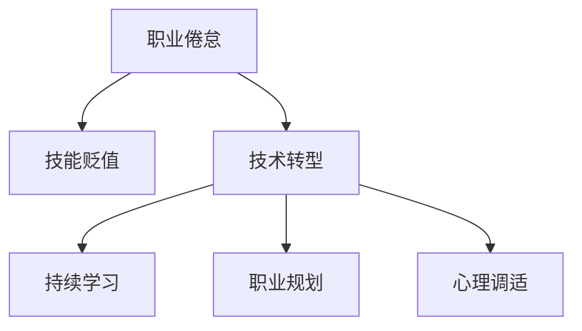

                 

# 程序员如何应对中年职场危机

> 关键词：中年危机,职场发展,技术转型,持续学习,职业规划,心理调适

## 1. 背景介绍

### 1.1 问题由来

职业倦怠、技能贬值、行业变化快...随着职业生涯进入中期，许多程序员开始感受到职场中的多重压力。“中年危机”一词，便形象地描述了这一阶段普遍存在的焦虑情绪。面对技术的迅速更迭和市场环境的变化，如何保持竞争力，找到新的职业发展方向，成为了摆在每个中年程序员面前的难题。本文将深入探讨这一问题，并提出一套系统的应对策略，帮助程序员平稳度过职业中期，实现职业转型和个人成长。

### 1.2 问题核心关键点

中年程序员面临的职场危机核心问题包括：

- **技能陈旧**：未能跟上技术发展，导致专业技能贬值，难以胜任新任务。
- **职业倦怠**：长期重复工作，缺乏成长感和挑战，对工作失去热情。
- **行业淘汰**：新兴技术层出不穷，传统技术逐渐被边缘化，面临被淘汰的风险。
- **心理压力**：面对未来的不确定性，容易产生焦虑、恐惧等心理问题。

## 2. 核心概念与联系

### 2.1 核心概念概述

为更好地理解如何应对中年职场危机，本节将介绍几个密切相关的核心概念：

- **职业倦怠**：指长期工作压力导致的职业热情减退、工作满意度下降、效率降低等现象。
- **技能贬值**：指随着时间的推移，某些技术技能逐渐过时，不再具有市场竞争力。
- **技术转型**：指通过学习和实践新技能，从旧技术领域转向新技术领域的过程。
- **持续学习**：指终身学习，不断更新知识和技能，保持与时代同步。
- **职业规划**：指对职业生涯的长期规划，明确发展方向和目标，制定实现路径。
- **心理调适**：指调整心态，应对职场中的各种压力和挑战，保持积极向上的工作态度。

这些核心概念之间的逻辑关系可以通过以下Mermaid流程图来展示：



这个流程图展示了一系列概念之间的逻辑关系：

1. 职业倦怠是技术转型和持续学习的直接触发点。
2. 技术转型包括学习新技能和应用新知识，是保持竞争力的关键。
3. 持续学习是技术转型的前提，通过不断学习，才能掌握新技能。
4. 职业规划为技术转型和持续学习提供方向，帮助制定具体的行动计划。
5. 心理调适有助于克服技术转型中的各种心理障碍，保持积极心态。

## 3. 核心算法原理 & 具体操作步骤

### 3.1 算法原理概述

应对中年职场危机的方法，本质上是一种系统的持续学习与职业规划过程。其核心思想是：通过持续学习新技能，制定明确的职业规划，调整心理状态，逐步实现技术转型和职业发展。

形式化地，假设程序员的初始技能集为 $S_0$，在面对中年职场危机时，需要通过持续学习获得新的技能集 $S_1$，以提升其市场竞争力。具体步骤包括：

1. **识别问题**：评估当前技能水平和市场需求，识别出需要掌握的新技能。
2. **制定计划**：根据新技能要求，制定详细的学习计划，选择合适的学习资源和路径。
3. **持续学习**：通过在线课程、书籍、项目实践等途径，不断学习和实践新技能。
4. **应用实践**：在实际工作中应用新技能，积累经验，验证学习效果。
5. **心理调整**：通过心理调适，克服学习过程中遇到的困难和挑战，保持积极心态。

### 3.2 算法步骤详解

应对中年职场危机的具体步骤如下：

**Step 1: 识别问题**

1. **自我评估**：通过项目回顾、同事反馈等方式，全面评估自身技能水平和职业倦怠程度。
2. **市场需求调研**：关注行业动态和招聘信息，了解新兴技术和市场变化趋势。
3. **制定需求清单**：列出需要掌握的新技能，对照市场需求，明确优先级和重点。

**Step 2: 制定计划**

1. **选择学习资源**：根据需求清单，选择适合的在线课程、书籍、培训项目等学习资源。
2. **制定学习路径**：设计详细的学习计划，划分阶段，设置学习目标和时间节点。
3. **资源配置**：安排学习时间和环境，选择合适的工具和设备，如电脑、在线平台等。

**Step 3: 持续学习**

1. **学习新技能**：根据学习路径，分阶段进行系统学习，掌握新技能的核心知识和应用方法。
2. **实践应用**：在项目中应用新技能，通过实际问题驱动学习，提升解决复杂问题的能力。
3. **评估反馈**：定期自我评估学习效果，调整学习方法和路径，确保学习目标的实现。

**Step 4: 应用实践**

1. **主动求变**：在工作中积极寻求新技术和新项目，探索新技能的应用场景。
2. **跨部门合作**：与不同部门的同事合作，了解行业其他领域的知识和技术，拓宽视野。
3. **项目实践**：参与新项目，将新技能应用到实际工作中，验证和优化。

**Step 5: 心理调整**

1. **认知重塑**：认识到技术发展是必然趋势，调整心态，接受职业变化。
2. **情绪管理**：学习心理调适技巧，如冥想、运动、社交等，缓解职业倦怠和心理压力。
3. **积极心态**：保持乐观和积极的态度，相信自己的能力，迎接新挑战。

### 3.3 算法优缺点

应对中年职场危机的算法具有以下优点：

- **系统性**：从识别问题到制定计划，再到持续学习和应用实践，形成了一套系统的应对策略。
- **灵活性**：根据个人情况和学习进度，灵活调整学习路径和方法。
- **目标明确**：通过职业规划，明确发展方向和目标，避免盲目学习。
- **心理支持**：通过心理调适，帮助克服学习和适应中的心理障碍。

但该方法也存在以下局限性：

- **投入时间**：持续学习需要大量时间和精力，对工作和生活有一定影响。
- **学习资源**：获取高质量学习资源和培训机会，可能面临一定的成本和难度。
- **工作环境**：如果当前工作环境不支持新技术应用，可能会限制职业转型的步伐。
- **心理负担**：面对未知和新挑战，容易产生心理压力和焦虑情绪。

尽管存在这些局限性，但该方法提供了系统的思路和策略，能够帮助程序员在职业生涯中不断成长，提升竞争力。未来，相关研究的重点在于如何更高效地利用现有资源，降低学习成本，同时兼顾心理支持，确保职业转型的顺利进行。

### 3.4 算法应用领域

应对中年职场危机的方法在软件开发、数据科学、人工智能、项目管理等多个领域都有广泛的应用。例如：

- **软件开发**：通过学习新编程语言、框架和工具，提升编程技能，参与新项目和技术栈迁移。
- **数据科学**：掌握数据分析、机器学习等新技能，应对数据科学领域的技术更新和应用场景变化。
- **人工智能**：学习深度学习、自然语言处理等前沿技术，进入人工智能领域，从事智能应用开发和模型优化。
- **项目管理**：通过学习敏捷开发、项目管理的最佳实践，提升项目管理能力，优化团队合作和项目管理流程。

除了这些经典领域，应对中年职场危机的方法同样适用于其他技术和管理岗位，帮助员工在职业生涯中不断进步。

## 4. 数学模型和公式 & 详细讲解 & 举例说明

### 4.1 数学模型构建

设程序员初始技能水平为 $S_0$，需要掌握的新技能为 $S_1$。假设学习过程中每阶段掌握的技能比例为 $p$，学习周期为 $T$，则经过 $n$ 阶段学习后，技能掌握度为：

$$
S_n = S_0 \times (1 + p)^n
$$

### 4.2 公式推导过程

假设初始技能水平 $S_0$ 为 1，每阶段学习掌握新技能的比例为 $p=0.5$，学习周期 $T=2$ 年。则经过 $n$ 阶段学习后，技能掌握度为：

$$
S_n = 1 \times (1 + 0.5)^n = (1.5)^n
$$

### 4.3 案例分析与讲解

**案例：小明是一名前端开发工程师，面临中年职场危机，希望转型为后端工程师。**

1. **自我评估**：小明发现自己在后端技术上的知识储备不足，同时对现有工作感到倦怠。
2. **市场需求调研**：通过招聘网站和行业报告，了解到后端技术的需求在增长，尤其是 Node.js、Go、Django 等技术栈。
3. **制定需求清单**：小明决定优先学习 Node.js 和 Django，其次是 Go。
4. **选择学习资源**：小明选择了 Udemy、Coursera 上的相关课程，以及 GitHub 上的开源项目进行实践。
5. **制定学习路径**：将学习周期分为 6 个月，每 3 个月掌握一种技术栈。
6. **持续学习**：小明通过课程学习理论知识，并通过项目实践巩固技能，每月完成一个个人小项目，逐步积累经验。
7. **应用实践**：在项目中应用新技能，通过调试和优化，提升技术能力。
8. **心理调整**：小明通过心理调适，缓解学习过程中的压力和焦虑，保持积极心态。

经过一年的学习，小明掌握了 Node.js 和 Django 技术，成功转型为后端工程师，并在新工作中获得认可。

## 5. 项目实践：代码实例和详细解释说明

### 5.1 开发环境搭建

在进行技术转型实践前，我们需要准备好开发环境。以下是使用 Python 进行 Flask 开发的环境配置流程：

1. 安装 Python：从官网下载并安装 Python 3.8。
2. 安装 Flask：使用 pip 安装 Flask 框架及其依赖。
```bash
pip install flask
```
3. 安装相关依赖库：安装需要的库，如 requests、Flask-SQLAlchemy 等。
```bash
pip install requests Flask-SQLAlchemy
```

完成上述步骤后，即可在 Python 环境中开始技术转型实践。

### 5.2 源代码详细实现

这里我们以学习 Flask 框架为例，给出代码实现。

首先，创建 Flask 应用：

```python
from flask import Flask

app = Flask(__name__)

@app.route('/')
def hello_world():
    return 'Hello, World!'
```

然后，运行应用：

```python
if __name__ == '__main__':
    app.run(debug=True)
```

完整代码如下：

```python
from flask import Flask

app = Flask(__name__)

@app.route('/')
def hello_world():
    return 'Hello, World!'

if __name__ == '__main__':
    app.run(debug=True)
```

通过 Flask 应用，小明可以熟悉 Web 开发的基础知识和 Flask 框架的使用，为后续学习 Node.js、Django 等技术打下基础。

### 5.3 代码解读与分析

**Flask 应用**：
- `from flask import Flask`：导入 Flask 模块。
- `app = Flask(__name__)`：创建 Flask 应用实例。
- `@app.route('/')`：定义路由，将访问根路径映射到 `hello_world` 函数。
- `def hello_world()`: 定义函数，返回字符串。
- `if __name__ == '__main__':`：判断是否为脚本直接运行，如果是则启动应用。

**代码运行**：
- `app.run(debug=True)`：启动应用，设置调试模式，便于调试和测试。

**分析**：
- Flask 框架提供了简洁的 Web 开发接口，可以帮助开发者快速构建简单的 Web 应用。
- 通过编写 Flask 应用，小明可以学习到 Web 开发的基本流程和 Flask 的使用方法。
- 在此基础上，可以进一步学习 Django、Node.js 等后端技术，实现更复杂的项目。

## 6. 实际应用场景

### 6.1 智能产品开发

面对快速变化的市场和技术环境，许多公司需要不断更新产品功能和用户体验，以保持竞争力。技术转型可以帮助程序员掌握新的技术和工具，提升工作效率，推动产品创新。

在实践中，可以通过学习新兴技术，如人工智能、大数据、区块链等，开发智能产品，满足用户需求。例如，利用机器学习算法优化产品推荐，通过数据分析提升用户体验，实现产品智能化升级。

### 6.2 企业数字化转型

随着数字化转型的深入，企业对技术人才的需求也在不断增加。技术转型可以帮助程序员适应新型的企业数字化环境，提升企业的数字化能力，实现业务升级。

在实践中，可以通过学习云计算、大数据、人工智能等技术，提升企业的数字化水平，优化业务流程，提高运营效率。例如，通过部署云计算平台，实现数据集中管理和高效处理；通过机器学习算法，提升客户洞察和营销效果；通过人工智能技术，构建智能客服和自动化流程。

### 6.3 个人品牌打造

技术转型不仅能提升职业竞争力，还能帮助程序员打造个人品牌，建立专业形象。通过掌握新技能和参与新项目，可以在技术社区和社交媒体上展示自己的能力，吸引更多关注和合作机会。

在实践中，可以通过博客、视频、开源项目等方式，分享学习心得和项目成果，建立专业形象和影响力。例如，在博客上撰写技术文章，分享项目经验和心得，提升个人影响力；在视频平台上发布技术讲解视频，展示技术实力；通过参与开源项目，贡献代码和解决方案，提升个人知名度。

### 6.4 未来应用展望

随着技术发展的不断加速，未来职场对程序员的要求将更高。通过持续学习和技术转型，程序员可以在职业生涯中保持竞争力和成长性，适应未来的职场需求。

1. **多技术融合**：未来技术将更注重跨学科融合，程序员需要掌握多种技术，实现多技术融合，提升技术竞争力。
2. **数据驱动**：数据将成为未来的核心资源，程序员需要掌握数据科学和数据分析技能，提升数据驱动决策能力。
3. **人工智能应用**：人工智能技术将在更多领域得到应用，程序员需要掌握 AI 技术，参与智能应用的开发和优化。
4. **持续学习**：技术发展日新月异，持续学习将成为程序员职业生涯的重要环节，保持学习热情和动力。
5. **跨领域合作**：未来的工作环境将更加跨学科，程序员需要具备跨领域合作的能力，与不同领域的专家进行合作。

## 7. 工具和资源推荐

### 7.1 学习资源推荐

为了帮助程序员系统掌握技术转型的相关知识，这里推荐一些优质的学习资源：

1. **Coursera**：提供大量在线课程，涵盖编程、数据科学、人工智能等领域，适合系统学习。
2. **Udemy**：提供丰富的技术课程，包括 Python、Java、Web 开发等，适合快速入门。
3. **edX**：提供多种在线课程，涵盖计算机科学、数据科学等，适合继续教育。
4. **Stack Overflow**：技术问答社区，可以快速获取技术解决方案和行业动态。
5. **GitHub**：代码托管平台，可以学习开源项目，了解行业最佳实践。
6. **Kaggle**：数据科学竞赛平台，可以参与数据科学项目，提升实战能力。

通过这些资源的学习，相信程序员可以系统掌握技术转型的知识和技能，为职业发展奠定坚实基础。

### 7.2 开发工具推荐

高效的开发离不开优秀的工具支持。以下是几款用于技术转型开发的常用工具：

1. **Visual Studio Code**：轻量级的开发编辑器，支持多种语言和插件，方便快速开发。
2. **Jupyter Notebook**：交互式编程环境，支持代码块、数据可视化和结果展示，适合数据分析和机器学习项目。
3. **Git**：版本控制系统，支持协作开发和代码版本管理，适合团队合作。
4. **Docker**：容器化平台，支持应用部署和环境隔离，适合开发和部署复杂应用。
5. **PyCharm**：Python 开发工具，提供代码提示、调试和自动化测试功能，适合 Python 项目开发。

合理利用这些工具，可以显著提升技术转型的开发效率，加快创新迭代的步伐。

### 7.3 相关论文推荐

技术转型是一个涉及多个学科领域的研究方向，以下是几篇奠基性的相关论文，推荐阅读：

1. **《编程语言设计原则》**：由 Bjarne Stroustrup 撰写，介绍了编程语言设计的哲学和方法，帮助程序员理解不同编程语言的特点和适用场景。
2. **《深度学习入门》**：由斋藤康毅撰写，介绍了深度学习的原理和应用，帮助程序员掌握深度学习技术。
3. **《数据科学实战》**：由 Jake VanderPlas 撰写，介绍了数据科学的基础知识和实战技能，帮助程序员掌握数据科学技能。
4. **《持续学习的算法与实现》**：介绍了持续学习的基本概念和算法实现，帮助程序员掌握持续学习的思想和方法。
5. **《Web 前端开发实战》**：介绍了前端开发的基础知识和实战技能，帮助程序员掌握前端开发技能。

这些论文代表了大语言模型微调技术的发展脉络。通过学习这些前沿成果，可以帮助研究者把握学科前进方向，激发更多的创新灵感。

## 8. 总结：未来发展趋势与挑战

### 8.1 研究成果总结

本文对应对中年职场危机的技术转型方法进行了全面系统的介绍。首先阐述了中年程序员面临的职场危机，明确了技能陈旧、职业倦怠、行业淘汰等核心问题。其次，从原理到实践，详细讲解了持续学习、技术转型、职业规划和心理调适等关键步骤，给出了技术转型的完整代码实例。同时，本文还广泛探讨了技术转型在智能产品开发、企业数字化转型和个人品牌打造等多个领域的应用前景，展示了技术转型的巨大潜力。此外，本文精选了技术转型的各类学习资源，力求为读者提供全方位的技术指引。

通过本文的系统梳理，可以看到，技术转型为程序员提供了一条突破中年职场危机的有效路径。通过持续学习和技术应用，程序员可以在职业生涯中不断成长，提升竞争力，迎接新的挑战。未来，伴随技术发展的不断加速，技术转型将成为程序员职业生涯的重要组成部分。

### 8.2 未来发展趋势

展望未来，技术转型将呈现以下几个发展趋势：

1. **技术融合**：随着技术的发展，未来技术将更加注重跨学科融合，程序员需要掌握多种技术，实现多技术融合，提升技术竞争力。
2. **数据驱动**：数据将成为未来的核心资源，程序员需要掌握数据科学和数据分析技能，提升数据驱动决策能力。
3. **人工智能应用**：人工智能技术将在更多领域得到应用，程序员需要掌握 AI 技术，参与智能应用的开发和优化。
4. **持续学习**：技术发展日新月异，持续学习将成为程序员职业生涯的重要环节，保持学习热情和动力。
5. **跨领域合作**：未来的工作环境将更加跨学科，程序员需要具备跨领域合作的能力，与不同领域的专家进行合作。
6. **新兴技术**：随着新兴技术的发展，如量子计算、脑机接口等，程序员需要关注和掌握这些前沿技术，保持技术的前沿性。

以上趋势凸显了技术转型的广阔前景。这些方向的探索发展，必将进一步提升程序员的竞争力，推动技术应用创新。

### 8.3 面临的挑战

尽管技术转型方法已经取得了显著成效，但在迈向更加智能化、普适化应用的过程中，它仍面临着诸多挑战：

1. **学习成本高**：技术转型的学习周期较长，需要投入大量时间和精力，对工作和生活有一定影响。
2. **资源匮乏**：获取高质量学习资源和培训机会，可能面临一定的成本和难度。
3. **应用场景复杂**：新技术的应用场景复杂，需要开发者具备较高的实践经验和能力。
4. **心理压力**：面对未知和新挑战，容易产生心理压力和焦虑情绪。

尽管存在这些挑战，但该方法提供了系统的思路和策略，能够帮助程序员在职业生涯中不断成长，提升竞争力。未来，相关研究的重点在于如何更高效地利用现有资源，降低学习成本，同时兼顾心理支持，确保技术转型的顺利进行。

### 8.4 研究展望

面向未来，技术转型的研究需要在以下几个方面寻求新的突破：

1. **多技术融合**：探索如何将多种技术进行有效融合，提升技术应用的灵活性和实用性。
2. **数据驱动**：研究如何通过数据科学提升技术决策能力，增强技术的科学性和可靠性。
3. **AI 技术应用**：研究如何将 AI 技术应用到实际问题中，提升技术应用的智能化水平。
4. **跨学科合作**：探索如何通过跨学科合作，提升技术创新的质量和速度。
5. **新兴技术探索**：关注和探索新兴技术的发展趋势，保持技术的前沿性。

这些研究方向的研究成果，必将进一步提升技术转型的有效性，推动技术应用创新，推动技术发展的加速前进。

## 9. 附录：常见问题与解答

**Q1：技术转型需要多长时间？**

A: 技术转型的时间因个体情况而异，具体取决于学习目标、学习资源和实际工作负荷。建议制定详细的学习计划，并根据进展调整时间和方法。

**Q2：如何平衡工作和学习？**

A: 制定明确的学习计划，划分阶段性目标，合理分配时间。利用工作间隙或周末时间进行学习，逐步积累知识，避免因时间不足而产生的压力。

**Q3：如何克服学习中的心理障碍？**

A: 建立积极的学习态度，设定小目标和里程碑，逐步实现学习进展，增强成就感。与同事、朋友交流学习心得，获得情感支持。

**Q4：如何选择学习资源？**

A: 选择与学习目标和自身情况相匹配的资源，如在线课程、书籍、项目实践等。优先选择评价高、内容丰富的资源，如Coursera、Udemy等平台上的课程。

**Q5：如何评估学习效果？**

A: 通过项目实践和评估工具，如GitHub、Kaggle等平台，验证和改进学习效果。定期进行自我评估，调整学习策略和路径，确保学习目标的实现。

**Q6：如何应对技术转型的风险？**

A: 制定详细的风险管理计划，提前识别潜在风险，并制定应对策略。建立学习小组，共同学习和探讨，分担风险和压力。

通过这些常见问题的解答，相信程序员可以更清晰地理解技术转型的挑战和应对方法，顺利实现职业转型和个人成长。

---

作者：禅与计算机程序设计艺术 / Zen and the Art of Computer Programming

