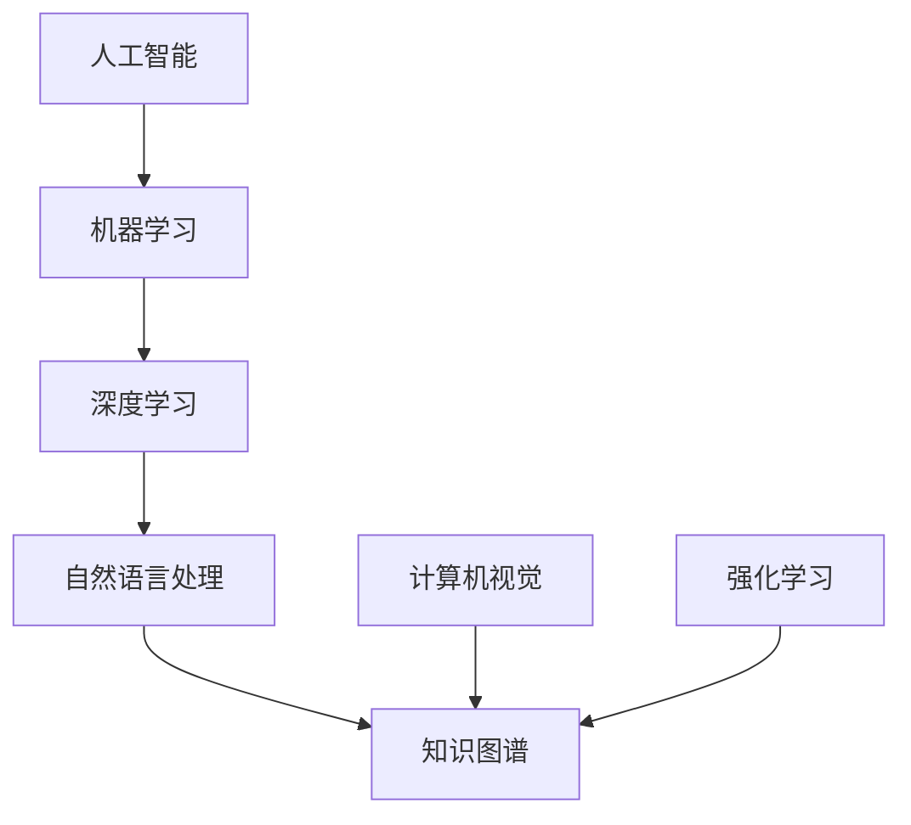

                 

# 程序员如何应对人工智能带来的挑战

## 1. 背景介绍

### 1.1 问题由来
人工智能（AI）正在以前所未有的速度改变各行各业。无论是制造业、金融业还是医疗领域，AI的触角正在触及每一个角落。对程序员来说，这既是机遇，也是挑战。人工智能的快速发展不仅要求我们掌握更先进的技术，还需要我们具备跨学科的知识和技能。

### 1.2 问题核心关键点
当前，AI的主要挑战集中在以下几个方面：

- **技术发展迅猛**：AI技术日新月异，新的算法、模型和工具层出不穷，程序员需要不断学习以跟上技术潮流。
- **数据依赖**：AI系统需要大量的数据进行训练，如何获取、处理和存储这些数据成为程序员面临的重要问题。
- **性能优化**：AI模型往往庞大复杂，如何在大规模数据集上高效训练和推理是技术难点。
- **伦理与安全**：AI系统的决策过程缺乏透明度，如何确保其公平性、安全性和可解释性是社会关注的焦点。
- **跨领域应用**：AI技术需要与其他学科知识相结合，才能在实际应用中发挥最大价值。

### 1.3 问题研究意义
掌握如何应对人工智能带来的挑战，不仅有助于程序员提高自身技能，更能推动AI技术在各行各业的应用和落地。这不仅能够提升工作效率，还能开辟新的职业机会，促进社会的数字化转型。

## 2. 核心概念与联系

### 2.1 核心概念概述

为了更好地理解如何应对AI带来的挑战，本节将介绍几个关键概念及其相互联系：

- **人工智能（AI）**：指模拟人类智能过程的技术，涵盖机器学习、深度学习、自然语言处理等方向。
- **机器学习（ML）**：指通过算法让计算机从数据中学习，自动提高性能。
- **深度学习（DL）**：一种特殊的机器学习方法，通过多层神经网络进行数据建模和预测。
- **自然语言处理（NLP）**：使计算机能够理解和处理人类语言的技术。
- **计算机视觉（CV）**：使计算机能够“看”和“理解”图像和视频的技术。
- **强化学习（RL）**：通过智能体与环境的交互，使智能体最大化某种奖励信号。
- **知识图谱**：一种结构化知识表示方式，用于存储和查询实体之间的关系。

这些概念之间的逻辑关系可以通过以下Mermaid流程图来展示：



这个流程图展示了几大学科之间的联系和互动：

1. 人工智能涵盖了机器学习、深度学习、自然语言处理和计算机视觉等方向。
2. 机器学习和深度学习为AI提供技术支持。
3. 自然语言处理和计算机视觉进一步推动AI在特定应用领域的落地。
4. 强化学习通过与环境的交互，实现更智能的决策系统。
5. 知识图谱为AI提供结构化知识，增强其推理能力。

## 3. 核心算法原理 & 具体操作步骤

### 3.1 算法原理概述

AI的核心算法原理通常包括以下几个关键步骤：

1. **数据预处理**：清洗、标准化和增强数据，以便于模型训练。
2. **模型选择**：根据问题特点选择合适的模型，如线性回归、神经网络、卷积神经网络等。
3. **模型训练**：利用训练数据集训练模型，通过优化算法调整模型参数。
4. **模型评估**：在验证集上评估模型性能，选择最佳模型。
5. **模型部署**：将训练好的模型部署到生产环境中，进行实际应用。

这些步骤需要程序员具备深厚的理论知识和实践经验，才能确保模型的高效和可靠。

### 3.2 算法步骤详解

**Step 1: 数据预处理**
- **数据清洗**：处理缺失值、异常值，去除噪声数据。
- **数据标准化**：将数据转换为标准分布，提高模型的收敛速度。
- **数据增强**：通过旋转、翻转、裁剪等手段扩充数据集，提高模型泛化能力。

**Step 2: 模型选择**
- **选择合适的模型**：根据问题类型和数据特点选择适当的模型结构。
- **设计损失函数**：损失函数用于衡量模型预测与真实标签之间的差异。
- **优化器选择**：如Adam、SGD等，用于调整模型参数。

**Step 3: 模型训练**
- **划分数据集**：将数据集分为训练集、验证集和测试集。
- **设置训练参数**：如学习率、批大小、迭代轮数等。
- **反向传播**：通过前向传播计算损失函数，反向传播计算梯度，更新模型参数。

**Step 4: 模型评估**
- **计算评估指标**：如准确率、召回率、F1分数等。
- **交叉验证**：使用交叉验证评估模型泛化能力。

**Step 5: 模型部署**
- **模型优化**：如剪枝、量化等，优化模型性能。
- **模型保存**：将模型保存为可部署的格式。
- **API封装**：封装模型为API接口，便于其他系统调用。

### 3.3 算法优缺点

AI算法的优点包括：

1. **高效**：能够处理大规模数据集，自动提取特征。
2. **可扩展**：模型可以通过增加层数和节点进行扩展。
3. **自适应**：模型能够自动适应新数据。

但同时，AI算法也存在一些缺点：

1. **黑盒问题**：模型决策过程缺乏透明度，难以解释。
2. **数据依赖**：模型性能高度依赖于数据质量。
3. **资源消耗大**：训练和推理过程需要大量计算资源。
4. **模型过拟合**：在大规模数据集上训练的模型，可能在新数据上表现不佳。

### 3.4 算法应用领域

AI算法在众多领域得到了广泛应用，例如：

- **计算机视觉**：图像识别、目标检测、人脸识别等。
- **自然语言处理**：机器翻译、文本生成、情感分析等。
- **语音识别**：语音转文本、自动摘要等。
- **推荐系统**：个性化推荐、广告投放等。
- **金融风控**：信用评估、欺诈检测等。
- **医疗诊断**：医学影像分析、疾病预测等。

这些领域的应用展示了AI技术的广泛影响力和巨大潜力。

## 4. 数学模型和公式 & 详细讲解 & 举例说明

### 4.1 数学模型构建

以线性回归模型为例，其数学模型可以表示为：

$$ y = \theta_0 + \theta_1 x_1 + \theta_2 x_2 + \cdots + \theta_n x_n + \epsilon $$

其中，$y$为输出变量，$x_i$为输入变量，$\theta_i$为模型参数，$\epsilon$为噪声。

### 4.2 公式推导过程

线性回归的损失函数通常采用均方误差（MSE）：

$$ L(\theta) = \frac{1}{2m} \sum_{i=1}^m (y_i - \hat{y}_i)^2 $$

其中，$m$为样本数量，$\hat{y}_i$为模型预测值。

使用梯度下降算法进行优化：

$$ \theta_j = \theta_j - \alpha \frac{\partial L(\theta)}{\partial \theta_j} $$

其中，$\alpha$为学习率。

### 4.3 案例分析与讲解

假设我们有一个包含年龄、收入和购买金额的数据集，目标是预测购买金额。我们可以使用线性回归模型进行训练，具体步骤如下：

1. 数据预处理：将数据标准化，去除异常值。
2. 模型选择：选择线性回归模型。
3. 训练模型：将数据集划分为训练集和验证集，使用梯度下降算法优化模型参数。
4. 评估模型：在验证集上计算MSE，选择最佳模型。
5. 部署模型：将模型保存并封装为API接口，供其他系统调用。

## 5. 项目实践：代码实例和详细解释说明

### 5.1 开发环境搭建

使用Python和TensorFlow搭建AI项目环境。以下是安装TensorFlow的步骤：

1. 安装Python和pip。
2. 安装TensorFlow：
   ```
   pip install tensorflow
   ```
3. 安装其他依赖库：
   ```
   pip install numpy pandas scikit-learn matplotlib
   ```

### 5.2 源代码详细实现

以下是一个简单的线性回归模型代码实现：

```python
import tensorflow as tf
import numpy as np
import matplotlib.pyplot as plt

# 准备数据
X = np.array([[1], [2], [3], [4], [5]])
y = np.array([2, 4, 6, 8, 10])

# 定义模型
model = tf.keras.Sequential([
    tf.keras.layers.Dense(1, input_shape=(1,))
])

# 编译模型
model.compile(optimizer=tf.keras.optimizers.SGD(learning_rate=0.01),
              loss='mse', metrics=['mae'])

# 训练模型
model.fit(X, y, epochs=100, verbose=0)

# 评估模型
test_X = np.array([[6], [7], [8]])
test_y = model.predict(test_X)
plt.plot(X, y, 'o', test_X, test_y, 'r-')
plt.show()
```

### 5.3 代码解读与分析

- **数据准备**：使用NumPy创建输入变量和输出变量数组。
- **模型定义**：使用TensorFlow的Sequential模型定义线性回归模型。
- **模型编译**：选择SGD优化器，设置损失函数和评估指标。
- **模型训练**：使用fit函数训练模型，指定训练轮数和输出级别。
- **模型评估**：使用predict函数进行预测，并使用Matplotlib可视化预测结果。

## 6. 实际应用场景

### 6.1 智能客服系统

智能客服系统可以通过AI技术提高服务效率和质量。例如，使用语音识别技术，将客户电话语音转换为文本，然后通过自然语言处理技术进行分析，最后生成回答。这不仅能够提升服务效率，还能减少人力成本。

### 6.2 金融风控

金融风控领域可以通过AI技术进行信用评估、欺诈检测等。例如，使用机器学习算法分析客户的信用记录和行为数据，预测其还款能力和欺诈风险，从而提高贷款审批和风险控制的效果。

### 6.3 医疗诊断

AI技术可以用于医疗诊断，例如，使用图像识别技术分析医学影像，自动识别病灶位置和大小，辅助医生进行诊断。此外，使用自然语言处理技术，可以从电子病历中提取关键信息，帮助医生制定更科学的诊疗方案。

### 6.4 未来应用展望

未来，AI技术将更加普及，将在更多领域得到应用。例如，自动驾驶、智能家居、工业自动化等。这些技术将极大地提升生产力和生活质量，带来革命性的变化。

## 7. 工具和资源推荐

### 7.1 学习资源推荐

为了帮助程序员掌握AI技术，以下是一些优质的学习资源：

1. **《深度学习》书籍**：由Ian Goodfellow等专家所著，全面介绍了深度学习的理论和实践。
2. **Coursera《机器学习》课程**：由Andrew Ng讲授，涵盖机器学习的基本概念和算法。
3. **Kaggle竞赛平台**：提供大量真实世界的机器学习竞赛，帮助程序员实践和提升技能。
4. **GitHub开源项目**：包含大量AI项目代码和文档，便于学习和参考。

### 7.2 开发工具推荐

以下是一些常用的AI开发工具：

1. **Jupyter Notebook**：提供交互式编程环境，便于调试和实验。
2. **TensorFlow**：由Google开发的深度学习框架，支持分布式计算和GPU加速。
3. **PyTorch**：由Facebook开发的深度学习框架，易于使用和扩展。
4. **Scikit-learn**：Python的机器学习库，包含多种算法和工具。
5. **OpenCV**：计算机视觉库，支持图像处理和分析。

### 7.3 相关论文推荐

以下是几篇代表性的人工智能相关论文：

1. **《深度学习》书籍**：Ian Goodfellow等著。
2. **《TensorFlow实战》书籍**：Manning Publications著。
3. **《Python深度学习》书籍**：Francois Chollet著。

## 8. 总结：未来发展趋势与挑战

### 8.1 总结

本文对AI带来的挑战进行了全面系统的介绍。首先阐述了AI技术的发展背景和挑战，明确了AI在各个领域的应用前景和重要性。其次，从原理到实践，详细讲解了AI的算法步骤和关键技术，给出了完整的代码实例。同时，本文还探讨了AI在实际应用中的诸多场景，展示了其广泛的应用价值。

通过本文的系统梳理，可以看到，AI技术正在以惊人的速度改变世界，程序员需要不断学习和实践，以适应这一变化。只有不断探索和创新，才能在这一波技术浪潮中占据先机，推动社会的数字化转型。

### 8.2 未来发展趋势

未来，AI技术的发展将呈现以下几个趋势：

1. **模型规模扩大**：模型参数量将继续增加，模型复杂度将进一步提高。
2. **计算平台升级**：GPU、TPU等高性能计算平台的普及将加速AI模型的训练和推理。
3. **跨领域融合**：AI技术与物联网、大数据、云计算等技术的融合，将带来更多创新应用。
4. **自动化和智能化**：AI技术将进一步自动化和智能化，减少人工干预。
5. **伦理与安全**：AI系统将更加注重公平性、安全性和可解释性，确保其社会价值。

这些趋势凸显了AI技术的广阔前景。只有不断探索和创新，才能在这一波技术浪潮中占据先机，推动社会的数字化转型。

### 8.3 面临的挑战

尽管AI技术取得了巨大的进展，但在迈向更加智能化、普适化应用的过程中，它仍面临诸多挑战：

1. **数据质量问题**：AI系统需要高质量的数据，但数据获取和处理往往成本高昂。
2. **计算资源消耗**：大规模AI模型需要高性能计算资源，训练和推理成本高。
3. **模型复杂度**：模型复杂度增加导致训练和推理速度变慢。
4. **伦理与安全**：AI系统的决策过程缺乏透明度，存在潜在风险。
5. **跨领域融合**：不同学科知识的融合需要更多创新和实践。

这些挑战需要我们在技术、伦理和社会等多个层面进行努力，才能推动AI技术的健康发展。

### 8.4 研究展望

面对AI技术带来的挑战，未来的研究方向包括：

1. **自动化数据处理**：开发自动化的数据清洗、标注和增强工具。
2. **计算平台优化**：优化计算平台，提升AI模型的训练和推理速度。
3. **模型压缩与优化**：使用剪枝、量化等技术优化模型，提高效率。
4. **跨学科融合**：结合其他学科知识，推动AI技术的创新应用。
5. **伦理与安全研究**：加强AI系统的公平性、安全性和可解释性研究。

这些研究方向将推动AI技术的进一步发展和应用，为社会的数字化转型提供有力支撑。

## 9. 附录：常见问题与解答

**Q1：AI技术对程序员有哪些影响？**

A: AI技术对程序员的影响主要体现在以下几个方面：

1. **技能要求提高**：AI技术需要程序员掌握更多跨学科的知识，如机器学习、深度学习、自然语言处理等。
2. **工具和技术更新**：AI技术的快速发展需要程序员持续学习和使用新的工具和技术，如TensorFlow、PyTorch等。
3. **职业机会增加**：AI技术的发展将带来更多的职业机会，如数据科学家、机器学习工程师等。

**Q2：如何提升AI模型的效率和效果？**

A: 提升AI模型的效率和效果需要从多个方面进行优化：

1. **数据预处理**：清洗和标准化数据，去除噪声和异常值。
2. **模型选择**：选择合适的模型结构和算法，如卷积神经网络、循环神经网络等。
3. **超参数调优**：通过网格搜索、随机搜索等方法优化超参数。
4. **模型压缩**：使用剪枝、量化等技术优化模型，减少资源消耗。
5. **分布式训练**：使用分布式计算平台，提高训练效率。

**Q3：AI模型在实际应用中面临哪些挑战？**

A: AI模型在实际应用中面临以下挑战：

1. **数据质量问题**：数据获取和处理成本高，数据质量不稳定。
2. **计算资源消耗**：大规模模型需要高性能计算资源，训练和推理成本高。
3. **模型复杂度**：模型复杂度增加导致训练和推理速度变慢。
4. **伦理与安全**：模型决策过程缺乏透明度，存在潜在风险。
5. **跨领域融合**：不同学科知识的融合需要更多创新和实践。

**Q4：如何确保AI模型的公平性、安全性和可解释性？**

A: 确保AI模型的公平性、安全性和可解释性需要从以下几个方面进行：

1. **数据公平性**：确保数据集不包含偏见和歧视，使用多样化的数据进行训练。
2. **模型可解释性**：使用可解释模型，如决策树、逻辑回归等，增加模型的透明性和可解释性。
3. **安全保护**：加强数据加密和访问控制，防止数据泄露和滥用。
4. **伦理约束**：制定AI系统的伦理规范，确保其行为符合社会价值观和道德标准。

---

作者：禅与计算机程序设计艺术 / Zen and the Art of Computer Programming

