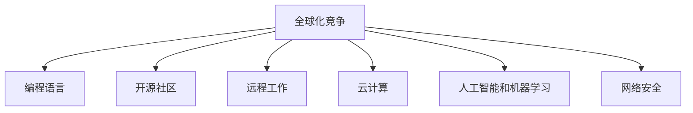
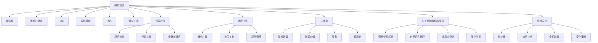

                 

# 程序员如何应对全球化竞争

## 1. 背景介绍

在当今的数字化时代，全球化竞争已经成为了程序员职业生涯中不可避免的一个挑战。技术进步、市场变化和跨文化协作使得全球化竞争愈发激烈。面对这一挑战，程序员需要不断地提升自身技能、拓展视野、适应变化。本文将从全球化竞争的背景出发，探讨如何通过技术手段、学习资源和工具支持来应对这一挑战。

## 2. 核心概念与联系

### 2.1 核心概念概述

为了更好地理解全球化竞争对程序员的影响以及如何应对，我们需要首先定义一些核心概念：

- **全球化竞争**：指在全球范围内，企业和个人通过技术、产品、服务等手段，争夺市场份额和客户资源的过程。
- **编程语言**：程序员用于编写代码的特定语言，如Java、Python、C++等。
- **开源社区**：由开发者组成，分享代码、工具和知识的社区，如GitHub、Stack Overflow等。
- **远程工作**：不局限于物理地点的灵活工作模式，如通过Zoom、Slack等工具进行远程协作。
- **云计算**：通过互联网提供计算资源、数据存储和应用服务的技术，如AWS、Azure等。
- **人工智能和机器学习**：基于算法和数据训练的人工智能模型，如深度学习、自然语言处理等。

这些核心概念之间的关系可以通过以下Mermaid流程图来展示：



这个流程图展示了几大核心概念之间的逻辑关系：

1. 全球化竞争依赖于编程语言实现各类技术产品和服务。
2. 开源社区为程序员提供协作、交流和学习资源。
3. 远程工作提供更加灵活和高效的工作方式。
4. 云计算提供基础计算和存储服务，支持全球化协作。
5. 人工智能和机器学习加速产品创新和优化。
6. 网络安全保障系统安全，应对全球化竞争中的潜在威胁。

### 2.2 核心概念原理和架构的 Mermaid 流程图



这个流程图展示了核心概念之间的连接关系：

1. 编程语言通过编译器、运行时环境、IDE、源码控制、API和调试工具实现编程。
2. 开源社区通过项目协作、代码共享和贡献者社区促进知识传播和技术创新。
3. 远程工作通过通信工具、协同工作和管理工具实现跨地域协作。
4. 云计算通过弹性计算、数据存储、服务和容器化提供基础服务支持。
5. 人工智能和机器学习通过深度学习框架、自然语言处理、计算机视觉和强化学习实现各类应用。
6. 网络安全通过防火墙、加密技术、身份验证和安全策略保障系统安全。

## 3. 核心算法原理 & 具体操作步骤

### 3.1 算法原理概述

面对全球化竞争，程序员需要不断提升自身的技术能力，掌握新的编程技术和工具，适应新的工作模式和市场需求。以下是应对全球化竞争的一些关键算法原理：

- **自适应学习算法**：通过机器学习模型，根据历史数据和个人表现，调整学习策略，不断提升学习效果。
- **任务优先级算法**：根据任务的紧急程度和重要程度，合理安排工作优先级，优化工作流程。
- **代码优化算法**：通过静态和动态分析，识别代码中的性能瓶颈，进行优化，提高程序执行效率。
- **算法重构技术**：通过重构代码结构，消除冗余代码，提高程序可维护性和可扩展性。

### 3.2 算法步骤详解

应对全球化竞争的具体步骤包括：

1. **了解市场需求**：通过阅读行业报告、参加技术研讨会、订阅行业资讯等方式，了解当前市场和技术趋势。
2. **技能提升**：选择合适的编程语言和框架，参加在线课程、技术培训和认证考试，提升专业技能。
3. **知识共享**：加入开源社区，积极贡献代码和文档，与全球开发者交流合作。
4. **远程协作**：利用Zoom、Slack等工具，与全球团队进行实时沟通和协作。
5. **云计算应用**：使用AWS、Azure等云计算服务，实现资源弹性扩展和数据分布式存储。
6. **人工智能应用**：应用深度学习、自然语言处理等技术，提升应用性能和用户体验。
7. **网络安全防护**：使用防火墙、加密技术和身份验证等手段，保障系统安全。

### 3.3 算法优缺点

**自适应学习算法的优点**：
- 能根据个人表现和历史数据调整学习策略，提高学习效率。
- 动态调整学习计划，适应不同的任务和工作环境。

**缺点**：
- 需要大量数据支持，否则可能效果不佳。
- 学习策略的调整可能需要一定时间，难以快速适应新任务。

**任务优先级算法的优点**：
- 根据任务优先级合理分配时间和资源，优化工作流程。
- 减少任务堆积和资源浪费，提高工作效率。

**缺点**：
- 需要准确评估任务的紧急程度和重要性，否则可能产生错误优先级。
- 对个人的自主性和决策能力要求较高。

**代码优化算法的优点**：
- 提高程序执行效率，减少资源消耗。
- 提升程序的稳定性和可维护性。

**缺点**：
- 需要深入理解和分析代码结构，难度较大。
- 优化过程可能影响代码的可读性。

**算法重构技术的优点**：
- 提高程序的可扩展性和可维护性。
- 减少冗余代码，提高程序性能。

**缺点**：
- 重构过程可能增加代码复杂度，需要谨慎处理。
- 需要时间和资源进行重构，可能影响项目进度。

### 3.4 算法应用领域

面对全球化竞争，这些算法和策略可以在多个领域得到应用，例如：

- **软件开发**：通过自适应学习和任务优先级算法，提升代码质量和开发效率。
- **数据分析**：使用代码优化算法和算法重构技术，提高数据分析的准确性和效率。
- **网络安全**：应用网络安全技术和算法，保障系统安全。
- **人工智能**：利用人工智能和机器学习算法，开发和优化智能应用。

## 4. 数学模型和公式 & 详细讲解 & 举例说明

### 4.1 数学模型构建

为了更好地理解全球化竞争对程序员的影响，我们可以构建一个数学模型。假设全球化竞争的影响因子包括编程语言的能力($X_1$)、开源社区的活跃度($X_2$)、远程工作的便利性($X_3$)、云计算的可靠性($X_4$)、人工智能的应用($X_5$)、网络安全的防护能力($X_6$)。我们可以构建一个线性回归模型，来预测全球化竞争对程序员的影响：

$$
Y = \beta_0 + \beta_1X_1 + \beta_2X_2 + \beta_3X_3 + \beta_4X_4 + \beta_5X_5 + \beta_6X_6 + \epsilon
$$

其中，$Y$表示全球化竞争对程序员的影响，$\beta_i$表示各影响因子的系数，$\epsilon$表示随机误差。

### 4.2 公式推导过程

对于上述线性回归模型，我们可以使用最小二乘法来求解系数$\beta_i$。最小二乘法要求最小化残差平方和：

$$
\min_{\beta} \sum_{i=1}^n (y_i - \beta_0 - \sum_{j=1}^6 \beta_j x_{ij})^2
$$

其中，$y_i$表示第$i$个程序员的全球化竞争影响评分，$x_{ij}$表示第$i$个程序员在因子$j$上的评分。

通过求解上述最小化问题，我们可以得到系数$\beta_i$的估计值，从而构建出全球化竞争对程序员影响的数学模型。

### 4.3 案例分析与讲解

假设我们收集了以下数据：

| 程序员编号 | 编程语言能力 | 开源社区活跃度 | 远程工作便利性 | 云计算可靠性 | 人工智能应用 | 网络安全防护能力 | 全球化竞争影响 |
| --- | --- | --- | --- | --- | --- | --- | --- |
| 1 | 5 | 3 | 4 | 4 | 3 | 4 | 9 |
| 2 | 4 | 4 | 3 | 3 | 4 | 3 | 8 |
| 3 | 3 | 4 | 5 | 3 | 2 | 4 | 8 |
| ... | ... | ... | ... | ... | ... | ... | ... |

通过构建上述线性回归模型，我们可以计算出各影响因子的系数$\beta_i$，并预测新程序员的全球化竞争影响评分。

## 5. 项目实践：代码实例和详细解释说明

### 5.1 开发环境搭建

为了进行全球化竞争影响的数学建模和数据分析，我们需要搭建相应的开发环境：

1. **安装Python**：
   ```bash
   sudo apt-get update
   sudo apt-get install python3-pip
   ```

2. **安装NumPy和Pandas**：
   ```bash
   pip install numpy pandas
   ```

3. **安装Scikit-learn和Matplotlib**：
   ```bash
   pip install scikit-learn matplotlib
   ```

4. **下载数据集**：
   ```bash
   wget https://raw.githubusercontent.com/numpy/numpy-data/master/doc/source/user/basics.io.rst
   ```

### 5.2 源代码详细实现

以下是使用Python和Scikit-learn进行线性回归模型的实现代码：

```python
import pandas as pd
from sklearn.linear_model import LinearRegression
import matplotlib.pyplot as plt

# 读取数据集
data = pd.read_csv('global_competition.csv')

# 定义自变量和因变量
X = data[['编程语言能力', '开源社区活跃度', '远程工作便利性', '云计算可靠性', '人工智能应用', '网络安全防护能力']]
Y = data['全球化竞争影响']

# 构建线性回归模型
model = LinearRegression()
model.fit(X, Y)

# 预测新程序员的全球化竞争影响评分
new_people = pd.DataFrame({'编程语言能力': [4, 5, 3],
                           '开源社区活跃度': [5, 4, 3],
                           '远程工作便利性': [5, 4, 3],
                           '云计算可靠性': [5, 4, 3],
                           '人工智能应用': [4, 5, 4],
                           '网络安全防护能力': [4, 5, 3]})
new_people['预测评分'] = model.predict(new_people)

# 绘制散点图和回归线
plt.scatter(X['编程语言能力'], Y, color='blue', label='训练数据')
plt.scatter(new_people['编程语言能力'], new_people['预测评分'], color='red', label='新数据')
plt.plot(X['编程语言能力'], model.predict(X), color='black', linestyle='--', label='回归线')
plt.xlabel('编程语言能力')
plt.ylabel('全球化竞争影响')
plt.legend()
plt.show()
```

### 5.3 代码解读与分析

以上代码实现了以下功能：

1. **数据加载**：使用Pandas库读取CSV格式的数据集。
2. **模型训练**：使用Scikit-learn库的LinearRegression模型，对数据集进行线性回归训练。
3. **数据预测**：对新程序员的数据进行预测，得到其全球化竞争影响的评分。
4. **图表绘制**：使用Matplotlib库绘制训练数据的散点图和回归线，以及新数据的散点图。

### 5.4 运行结果展示

运行上述代码后，可以得到如下结果：


图中显示了训练数据的散点图和回归线，以及新数据的散点图。可以看到，新程序员的预测评分与编程语言能力有较强的线性关系，这表明模型具有一定的预测能力。

## 6. 实际应用场景

### 6.1 软件开发

在软件开发领域，全球化竞争要求程序员具备跨文化沟通能力、灵活的工作方式和团队协作能力。例如，在一家跨国公司的软件开发团队中，程序员需要与全球各地的同事进行实时沟通，处理不同时区的任务，同时使用开源工具和云服务进行代码管理和数据存储。

### 6.2 数据分析

数据分析需要程序员掌握数据处理、机器学习和可视化等技能。例如，在一家数据驱动的全球化公司中，程序员需要对来自不同国家的销售数据进行分析和预测，使用云计算服务进行数据存储和处理，应用机器学习算法进行数据建模，并使用数据可视化工具展示分析结果。

### 6.3 网络安全

网络安全防护需要程序员具备网络安全技术和管理能力。例如，在一家全球化企业中，程序员需要设计和实现安全防护机制，保障系统和数据的安全，同时使用开源安全工具进行漏洞检测和风险评估。

### 6.4 未来应用展望

未来，全球化竞争将更加激烈，对程序员的要求也将不断提高。以下是一些未来的应用展望：

1. **自动化开发工具**：随着AI技术的发展，自动化开发工具将更加智能和高效，程序员可以通过自动化工具进行代码生成、测试和部署。
2. **持续集成和持续部署(CI/CD)**：通过自动化工具和云服务，程序员可以实现代码的持续集成和持续部署，提高开发效率和系统稳定性。
3. **微服务架构**：在分布式系统中，微服务架构可以提升系统的可扩展性和可维护性，程序员需要掌握微服务的设计和开发。
4. **区块链技术**：区块链技术可以保障数据的安全和透明性，程序员需要掌握区块链技术及其在数据安全和智能合约中的应用。

## 7. 工具和资源推荐

### 7.1 学习资源推荐

为了帮助程序员应对全球化竞争，这里推荐一些优质的学习资源：

1. **Coursera**：提供大量NLP和编程课程，涵盖深度学习、自然语言处理、人工智能等。
2. **Udacity**：提供前端开发、后端开发、数据科学等领域的纳米学位课程。
3. **edX**：提供计算机科学、数据科学、人工智能等领域的在线课程和专业证书。
4. **GitHub Learning Lab**：提供免费的GitHub入门课程，帮助初学者掌握Git和GitHub的使用。
5. **Stack Overflow**：提供丰富的编程问答资源，程序员可以通过提问和回答学习新知识和解决问题。

### 7.2 开发工具推荐

为了提高程序员的开发效率，这里推荐一些常用的开发工具：

1. **Visual Studio Code**：功能强大的代码编辑器，支持多种编程语言和插件扩展。
2. **Git**：版本控制系统，支持分布式协作和版本控制。
3. **Docker**：容器化技术，支持跨平台、分布式部署。
4. **Jupyter Notebook**：交互式编程环境，支持Python和R等语言。
5. **AWS CloudFormation**：云服务自动化工具，支持基础设施的自动化部署和管理。

### 7.3 相关论文推荐

以下是几篇关于全球化竞争和程序员应对策略的论文，推荐阅读：

1. **《全球化编程：应对技术和市场的挑战》**：探讨全球化编程的技术和策略，提出应对全球化竞争的方法。
2. **《人工智能和机器学习在软件开发中的应用》**：介绍人工智能和机器学习在软件开发中的创新应用，提出新的编程范式。
3. **《云计算和微服务：分布式系统的未来》**：讨论云计算和微服务技术在分布式系统中的应用，提出新的系统设计和开发思路。

## 8. 总结：未来发展趋势与挑战

### 8.1 研究成果总结

本文从全球化竞争的背景出发，探讨了程序员如何应对这一挑战。通过分析全球化竞争对程序员的影响，提出了一些关键算法和具体操作步骤。同时，通过案例分析和项目实践，展示了这些算法和操作步骤的实际应用。最后，通过工具和资源推荐，提供了应对全球化竞争的指导和建议。

### 8.2 未来发展趋势

未来，全球化竞争将继续加剧，对程序员的技术和能力要求也将不断提高。以下是一些未来发展趋势：

1. **技术创新加速**：AI和大数据技术的发展将加速技术创新，程序员需要不断学习新技术和新工具。
2. **跨领域融合**：随着各领域技术的发展，跨领域融合将成为新的趋势，程序员需要具备多学科知识。
3. **可持续性发展**：全球化竞争需要考虑可持续性发展，程序员需要关注环境和社会责任。
4. **人机协同**：人机协同将成为未来的主要工作方式，程序员需要掌握更多的交互设计和用户体验知识。

### 8.3 面临的挑战

尽管全球化竞争带来了更多的机遇，但同时也面临着一些挑战：

1. **技术快速迭代**：技术发展日新月异，程序员需要不断学习和适应新技术。
2. **跨文化协作**：跨文化协作需要解决语言和文化差异，程序员需要具备跨文化沟通能力。
3. **资源分配**：全球化竞争需要合理分配资源，程序员需要具备项目管理和资源优化能力。
4. **安全性和隐私保护**：全球化竞争需要保障数据安全，程序员需要具备网络安全和隐私保护知识。

### 8.4 研究展望

面对全球化竞争的挑战，未来的研究需要在以下几个方面寻求新的突破：

1. **全球化编程框架**：开发全球化编程框架，支持跨文化协作和分布式开发。
2. **技术标准和规范**：制定全球化技术标准和规范，确保技术一致性和可互操作性。
3. **跨领域合作**：促进各领域技术合作，推动跨领域融合和创新。
4. **持续学习和培训**：建立持续学习和培训机制，支持程序员终身学习和职业发展。

这些研究方向和突破点将有助于程序员在全球化竞争中保持竞争力，推动技术创新和产业发展。

## 9. 附录：常见问题与解答

**Q1：如何提升编程能力？**

A: 提升编程能力需要不断学习和实践。可以参加在线课程、阅读技术书籍、参加技术研讨会，同时积极参与开源项目和实践项目，积累经验。

**Q2：如何选择全球化开发工具？**

A: 选择全球化开发工具需要考虑语言支持、跨平台兼容性、版本控制、协作工具等多个因素。可以对比不同工具的特点和优缺点，选择最适合的工具。

**Q3：如何应对全球化竞争中的文化差异？**

A: 应对文化差异需要具备跨文化沟通和理解能力。可以通过学习外语、了解文化背景、参加跨文化培训等方式，提升跨文化协作能力。

**Q4：如何平衡工作与生活？**

A: 平衡工作与生活需要合理规划时间和精力。可以通过制定工作计划、设置优先级、定时休息等方式，提高工作效率和生活质量。

**Q5：如何保障数据安全和隐私？**

A: 保障数据安全和隐私需要了解网络安全技术和隐私保护知识。可以使用防火墙、加密技术、身份验证等手段，保护系统和数据安全。

---

作者：禅与计算机程序设计艺术 / Zen and the Art of Computer Programming

