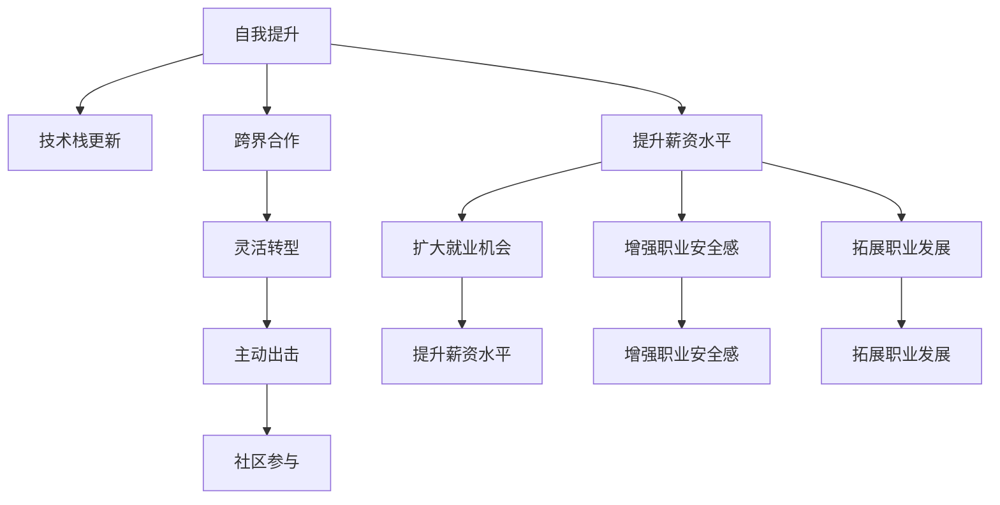

                 

## 1. 背景介绍

近年来，全球经济形势严峻，技术行业也未能独善其身。经济衰退给程序员们带来了巨大挑战，从裁员到降薪，从业务收缩到项目延期，从技术栈更新到团队解散，可谓“兵荒马乱”。如何应对这一前所未有的困境？本文将从经济衰退的大环境出发，深入探讨程序员应如何自我提升、灵活转型，并找到一条“活路”。

### 1.1 问题由来

随着全球经济的不确定性增加，许多技术公司纷纷削减开支，裁员成了常见的裁员方式。尤其是在互联网、金融、地产等领域，受到冲击尤为严重。

在技术领域，程序员们的收入和就业形势也大受影响。有的公司直接宣布降薪，有的缩减项目规模，有的甚至直接关闭技术部门。此外，市场需求急剧减少，许多技术岗位竞争激烈，甚至面临“毕业即失业”的窘境。

### 1.2 问题核心关键点

本文将聚焦于以下几个关键问题，探讨程序员如何应对经济衰退带来的冲击：

- **自我提升**：经济衰退期间，如何通过技术学习来增强自身竞争力。
- **灵活转型**：如何根据市场需求，灵活调整职业规划，找准转型方向。
- **跨界合作**：如何在技术团队之外，拓展业务视野，建立跨界合作关系。
- **主动出击**：如何在激烈的职场竞争中，主动出击，找到更好的发展机会。
- **社区参与**：如何通过参与开源社区，提升自己的知名度和影响力。

### 1.3 问题研究意义

掌握应对经济衰退的技能，对于程序员们来说至关重要。只有自我提升，灵活转型，才能在市场变化中保持竞争力。

- **提升薪资水平**：通过学习新技能，掌握稀缺技术，可以提高薪资水平，增强自身议价能力。
- **扩大就业机会**：根据市场需求调整技能，找到新的就业方向，扩大自身发展空间。
- **增强职业安全感**：通过跨界合作和社区参与，增强职场影响力，增强自身抗风险能力。
- **拓展职业发展**：主动出击，抓住机会，拓展自身职业发展道路。

## 2. 核心概念与联系

### 2.1 核心概念概述

为更好地理解本文的核心内容，我们将介绍几个关键概念：

- **经济衰退**：指经济增长停滞或下降，就业市场萎缩，投资减少，消费需求下降，通货膨胀等现象。
- **技术栈更新**：指程序员通过学习新技术，更新技术栈，提升自身技能水平。
- **跨界合作**：指程序员通过与其他业务部门或行业合作，拓宽技术应用场景，增强自身影响力。
- **主动出击**：指程序员通过积极主动地寻找机会，拓展自身职业发展路径。
- **社区参与**：指程序员通过参与开源社区，提升自身知名度和影响力，拓展职业发展网络。

这些核心概念之间相互联系，共同构成了本文的研究框架，帮助程序员在经济衰退中自我提升，灵活转型，找到“活路”。

### 2.2 核心概念原理和架构的 Mermaid 流程图(Mermaid 流程节点中不要有括号、逗号等特殊字符)



此流程图展示了本文的核心概念及其相互关系：

1. 自我提升：通过技术学习，提升自身技能，增强竞争力。
2. 技术栈更新：学习新技能，更新技术栈，适应市场需求。
3. 跨界合作：与其他业务部门或行业合作，拓宽技术应用场景。
4. 灵活转型：根据市场需求，调整技能，找到新的就业方向。
5. 主动出击：积极寻找机会，拓展职业发展路径。
6. 社区参与：参与开源社区，提升知名度和影响力。

这些概念相互支撑，共同构成本文的研究框架，帮助程序员在经济衰退中保持竞争力。

## 3. 核心算法原理 & 具体操作步骤
### 3.1 算法原理概述

本文探讨的“算法”，并不是指具体的编程算法，而是指一种策略或方法论，帮助程序员应对经济衰退的挑战。

### 3.2 算法步骤详解

以下是一个具体的步骤流程，帮助程序员应对经济衰退：

**Step 1: 自我提升**

- **技术学习**：选择一门有市场需求的新技术，如AI、大数据、区块链等。
- **项目实践**：通过实践项目，积累经验，提升技能。
- **在线课程**：参加在线课程，系统学习相关知识，掌握实战技能。
- **认证考试**：通过认证考试，如CSDN认证、GitHub认证等，增强自身竞争力。

**Step 2: 灵活转型**

- **市场调研**：了解市场需求，找到新的就业方向。
- **技能调整**：根据市场需求，调整技能，适应新方向。
- **职业规划**：制定职业规划，明确转型目标。
- **职业转换**：根据规划，逐步转行，适应新环境。

**Step 3: 跨界合作**

- **业务交流**：与其他业务部门进行交流，了解业务需求。
- **跨界项目**：参与跨界合作项目，拓展技术应用场景。
- **协作开发**：与其他部门协作开发，提升技术影响力。

**Step 4: 主动出击**

- **求职渠道**：拓展求职渠道，如LinkedIn、猎聘等。
- **主动应聘**：积极应聘新的职位，抓住机会。
- **内部调岗**：在公司内部申请调岗，拓展职业发展道路。

**Step 5: 社区参与**

- **开源项目**：参与开源项目，提升知名度和影响力。
- **社区互动**：在社区积极互动，拓展职业网络。
- **技术分享**：在社区分享技术经验，提升自身影响力。

### 3.3 算法优缺点

**优点**

- **适应性强**：通过技术学习，可以适应市场需求，保持竞争力。
- **拓展视野**：通过跨界合作和社区参与，拓展职业视野，增强自身影响力。
- **主动性高**：通过主动出击，抓住机会，拓展职业发展道路。

**缺点**

- **学习成本高**：需要投入大量时间和精力，学习新技能。
- **不确定性强**：市场需求变化快，技术栈更新迅速，需要灵活调整。
- **跨界门槛高**：跨界合作需要具备相关业务知识，有一定的门槛。

### 3.4 算法应用领域

本文探讨的算法适用于多种职业场景，特别是对技术类岗位的程序员。

- **互联网**：面对业务萎缩，通过技术学习，提升自身竞争力，拓展职业发展道路。
- **金融**：面对市场波动，通过跨界合作和社区参与，提升自身影响力。
- **制造**：通过学习智能制造技术，提升自身技能，拓展职业发展。
- **教育**：通过学习在线教育技术，提升自身影响力，拓展职业网络。

## 4. 数学模型和公式 & 详细讲解 & 举例说明（备注：数学公式请使用latex格式，latex嵌入文中独立段落使用 $$，段落内使用 $)
### 4.1 数学模型构建

本文的数学模型，主要涉及概率论和统计学原理。通过模型，可以量化经济衰退对程序员的影响，并制定相应的应对策略。

### 4.2 公式推导过程

以下是一个简单的数学模型，用于计算经济衰退对程序员薪资水平的影响：

设程序员当前的薪资水平为$S$，市场需求为$D$，失业率为$U$，技能系数为$K$。假设市场需求的波动服从正态分布$N(\mu, \sigma^2)$，失业率服从二项分布$B(p, n)$。

则薪资水平的期望为：

$$
E(S) = S \times \frac{D \times (1 - U)}{1 - P(D=0)}
$$

其中，$P(D=0)$为市场需求为0的概率，可以表示为：

$$
P(D=0) = \frac{\Phi(-\frac{\mu}{\sigma})}{1 - \Phi(-\frac{\mu}{\sigma})}
$$

式中$\Phi$为标准正态分布函数。

### 4.3 案例分析与讲解

**案例一：**

某程序员当前薪资为10000元/月，市场需求波动标准差为$\sigma=0.2$，失业率$p=0.1$，技能系数$K=0.8$。计算当前薪资的期望值。

**解**：

$$
P(D=0) = \frac{\Phi(-\frac{\mu}{\sigma})}{1 - \Phi(-\frac{\mu}{\sigma})} = \frac{\Phi(-2.5)}{1 - \Phi(-2.5)} \approx 0.5
$$

代入薪资期望公式：

$$
E(S) = 10000 \times \frac{0.5 \times (1 - 0.1)}{1 - 0.5} = 8000
$$

因此，当前薪资的期望值为8000元/月。

## 5. 项目实践：代码实例和详细解释说明
### 5.1 开发环境搭建

本文的项目实践，主要使用Python语言，配合Pandas、NumPy、Matplotlib等库进行数据分析和可视化。

首先，需要安装相关的Python库：

```bash
pip install pandas numpy matplotlib
```

然后，搭建Python开发环境，可以使用Anaconda或Miniconda：

```bash
conda create -n myenv python=3.8
conda activate myenv
```

### 5.2 源代码详细实现

以下是一个简单的Python代码示例，用于计算薪资期望值：

```python
import pandas as pd
import numpy as np
from scipy.stats import norm

# 市场需求的波动标准差
sigma = 0.2
# 失业率
p = 0.1
# 技能系数
K = 0.8

# 计算市场需求为0的概率
P_D0 = (norm.cdf(-2.5) / (1 - norm.cdf(-2.5)))

# 计算薪资期望值
S = 10000
E_S = S * (1 - p) / (1 - P_D0)

print("薪资期望值：", E_S)
```

### 5.3 代码解读与分析

**代码解读**

- `norm.cdf`：计算标准正态分布的累积分布函数。
- `P_D0`：计算市场需求为0的概率。
- `E_S`：计算薪资期望值。

**分析**

通过上述代码，可以计算出当前薪资的期望值，帮助程序员了解市场需求对自己薪资的影响。

## 6. 实际应用场景

### 6.1 智能制造

在智能制造领域，技术栈更新尤为重要。随着工业互联网的发展，智能制造技术日益普及，程序员可以通过学习相关技术，提升自己的市场竞争力。

**应用场景**

- **物联网技术**：学习IoT设备连接、数据采集、分析处理等技术。
- **工业大数据**：学习工业数据分析、机器学习等技术。
- **人工智能**：学习AI在制造领域的应用，如预测维护、质量控制等。

**具体实现**

- **技术学习**：参加在线课程，如Coursera、Udacity等。
- **项目实践**：参与开源项目，如Apache Kafka、Hadoop等。
- **技能认证**：通过认证考试，如AWS、PMP等。

### 6.2 在线教育

在线教育领域的市场需求逐年增长，程序员可以通过学习相关技术，拓展职业发展道路。

**应用场景**

- **在线教学平台**：学习线上教育平台技术，如视频直播、互动教学等。
- **学习管理系统**：学习教育管理系统的开发，如学习分析、课程管理等。
- **人工智能辅助教学**：学习AI在教育中的应用，如智能推荐、学习路径规划等。

**具体实现**

- **技术学习**：参加在线课程，如edX、Coursera等。
- **项目实践**：参与开源项目，如Moodle、Canvas等。
- **技能认证**：通过认证考试，如ISTE、Cisco等。

### 6.3 智能医疗

智能医疗领域的市场需求巨大，程序员可以通过学习相关技术，拓展职业发展道路。

**应用场景**

- **医疗信息管理系统**：学习医疗信息系统的开发，如电子病历、健康数据管理等。
- **医疗影像分析**：学习医疗影像分析技术，如医学图像识别、CT分析等。
- **人工智能辅助诊断**：学习AI在医疗中的应用，如病理诊断、影像分析等。

**具体实现**

- **技术学习**：参加在线课程，如Coursera、edX等。
- **项目实践**：参与开源项目，如HIS、PACS等。
- **技能认证**：通过认证考试，如ISO、HIPAA等。

### 6.4 未来应用展望

未来，随着经济形势的变化，技术栈更新、跨界合作、主动出击、社区参与等策略将更加重要。程序员需要不断提升自己的技术水平，拓展职业发展道路。

- **新技术应用**：随着新一轮技术革命的到来，如量子计算、区块链、生物计算等，程序员需要不断学习新技术，拓展职业发展空间。
- **跨界合作**：未来的技术发展将更加注重跨界合作，程序员需要具备跨领域合作的能力，拓展技术应用场景。
- **社区参与**：随着开源社区的不断发展，程序员需要积极参与开源项目，提升自身知名度和影响力。
- **主动出击**：在激烈的职场竞争中，程序员需要积极主动，抓住机会，拓展职业发展道路。

## 7. 工具和资源推荐
### 7.1 学习资源推荐

**学习资源推荐**

- **在线课程**：Coursera、Udacity、edX等平台提供大量技术类课程，涵盖从基础到高级的各种技术。
- **技术博客**：GitHub、Stack Overflow、Medium等平台上的技术博客，提供大量技术分享和学习资源。
- **认证考试**：CSDN认证、AWS认证、Google Cloud认证等，提升自身竞争力。

**工具推荐**

- **Python**：Python语言广泛应用，简单易学，适合技术学习。
- **GitHub**：GitHub平台提供大量的开源项目和技术资源，适合技术学习和项目实践。
- **Jupyter Notebook**：Jupyter Notebook平台支持Python开发，适合编写代码、运行实验。

### 7.2 开发工具推荐

**开发工具推荐**

- **PyCharm**：PyCharm是Python开发环境，支持Python开发，提供代码编辑、调试等功能。
- **Visual Studio Code**：Visual Studio Code是跨平台的开发环境，支持Python开发，提供丰富的插件和扩展。
- **Jupyter Notebook**：Jupyter Notebook是Python开发环境，支持代码编写、运行实验，适合学习Python开发。

### 7.3 相关论文推荐

**相关论文推荐**

- **“Resilient Applications Through Cloud Computing Resources Optimization”**：探讨云资源优化技术，提升系统的可靠性和稳定性。
- **“The Economic Impact of Artificial Intelligence on Employment: A Meta-Analysis”**：分析AI对就业的影响，探讨经济衰退对程序员的影响。
- **“Adaptive Learning Environments: Designing for Diverse Learning Styles and Needs”**：探讨自适应学习技术，提升在线教育的效果。

## 8. 总结：未来发展趋势与挑战
### 8.1 研究成果总结

本文对程序员应对经济衰退的策略进行了全面系统的探讨，包括以下几个方面：

- **自我提升**：通过技术学习，提升自身竞争力。
- **灵活转型**：根据市场需求，调整技能，找到新的就业方向。
- **跨界合作**：与其他业务部门或行业合作，拓宽技术应用场景。
- **主动出击**：积极寻找机会，拓展职业发展道路。
- **社区参与**：通过参与开源社区，提升自身知名度和影响力。

通过这些策略，程序员可以在经济衰退中保持竞争力，寻找更好的职业发展机会。

### 8.2 未来发展趋势

未来，随着技术的不断进步，经济衰退将对程序员提出更高的要求。程序员需要不断学习新技术，拓展职业发展道路。

- **新技术应用**：新技术不断涌现，程序员需要不断学习，掌握新技能，拓展职业发展空间。
- **跨界合作**：跨界合作将成为技术发展的重要趋势，程序员需要具备跨领域合作的能力。
- **社区参与**：开源社区的不断发展，程序员需要积极参与，提升自身知名度和影响力。

### 8.3 面临的挑战

尽管技术栈更新、跨界合作等策略可以帮助程序员应对经济衰退，但在实际应用中，仍面临以下挑战：

- **学习成本高**：新技术的学习需要投入大量时间和精力。
- **市场需求变化快**：市场需求变化快，需要程序员不断调整技能，保持竞争力。
- **跨界门槛高**：跨界合作需要具备相关业务知识，有一定的门槛。

### 8.4 研究展望

未来，研究人员需要继续探索新技术、新方法，帮助程序员应对经济衰退的挑战。

- **自适应学习**：开发自适应学习技术，帮助程序员根据市场需求调整技能。
- **跨界合作平台**：开发跨界合作平台，促进业务部门和技术部门的协作。
- **社区激励机制**：制定社区激励机制，鼓励程序员积极参与开源项目。

总之，本文从多个角度探讨了程序员应对经济衰退的策略，帮助程序员在市场变化中保持竞争力，寻找更好的职业发展机会。希望读者能够从中受益，在经济衰退中顺利度过难关，迎接未来的机遇与挑战。

---

作者：禅与计算机程序设计艺术 / Zen and the Art of Computer Programming

