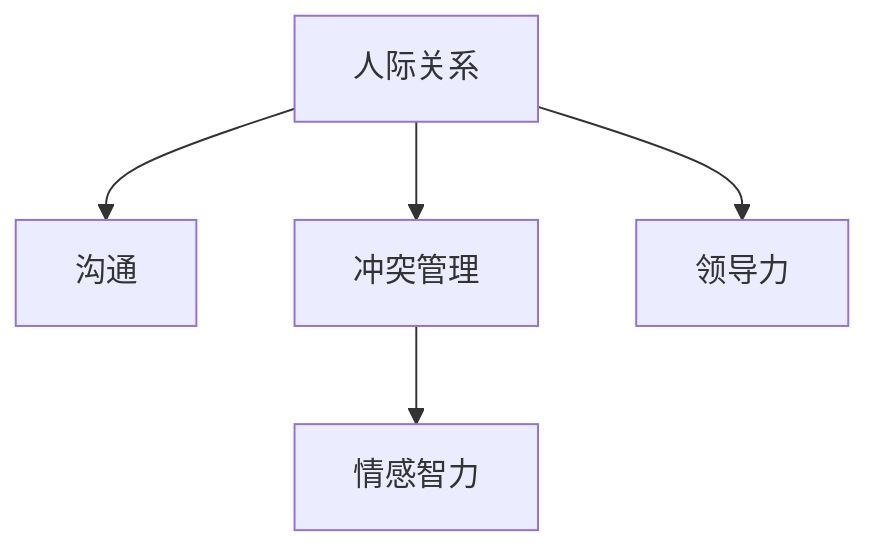

                 

## 1. 背景介绍

### 1.1 问题由来

在现代社会中，职场人际关系复杂多样，不同文化背景、教育背景、性格特征的员工在协作中难免会遭遇各式各样的挑战。这些挑战可能来自团队成员间的沟通不畅、角色冲突、信任危机，也可能来自领导和下属之间的不良互动。如何有效应对这些挑战，不仅关系到个人职业发展的成败，也关乎团队的协作效率和企业的发展前景。因此，本文聚焦于程序员在职场中遇到的人际关系挑战，旨在提供一套行之有效的方法论，帮助程序员在多元化的职场环境中取得成功。

### 1.2 问题核心关键点

程序员在职场中可能面临的人际关系挑战主要包括以下几个方面：

- **沟通不畅**：技术领域的隔阂、跨部门的沟通困难、信息不对称等问题可能导致误解和冲突。
- **角色冲突**：团队成员之间期望不一致、职责不清可能导致协作失败。
- **信任危机**：缺乏透明和开放的沟通氛围可能导致信任缺失，影响团队凝聚力。
- **领导与下属间的互动障碍**：技术导向与业务目标的冲突、领导对技术能力缺乏理解等可能导致矛盾。

解决这些问题，不仅需要程序员提升个人技能，还需要掌握人际交往的艺术和策略。本文将从多个角度探讨如何应对职场人际关系挑战，提供实用的建议和策略。

### 1.3 问题研究意义

掌握职场人际关系管理的技巧，对程序员的职业发展具有重要的意义：

- **提升团队协作效率**：建立良好的人际关系可以增强团队凝聚力，提高项目执行的效率。
- **增强个人影响力**：通过有效的沟通和协调，能够更好地影响他人，实现自己的职业目标。
- **提高职业满意度**：良好的人际关系能够减少职场压力，提升个人的职业幸福感。
- **促进职业成长**：建立广泛的人脉网络，为职业发展提供更多机会和支持。

本文旨在帮助程序员了解并掌握职场人际关系的应对策略，助力其职业成长和团队发展。

## 2. 核心概念与联系

### 2.1 核心概念概述

为了更好地理解职场人际关系管理的核心概念，本节将介绍几个关键概念：

- **人际关系**：指人与人之间的互动和关系，包括情感、行为、文化等方面。
- **沟通**：指信息在个体之间传递的过程，包括言语和非言语交流。
- **冲突管理**：指识别、分析和解决冲突的过程，旨在维持和促进关系。
- **领导力**：指影响和指导他人的能力，在团队中扮演关键角色。
- **情感智力**：指识别、理解和管理自己及他人情感的能力。

这些核心概念之间的逻辑关系可以通过以下Mermaid流程图来展示：



这个流程图展示了职场人际关系管理的核心概念及其之间的关系：

1. 人际关系是职场互动的基础。
2. 沟通是信息传递的桥梁。
3. 冲突管理有助于解决人际关系中的问题。
4. 情感智力是理解和管理情感的基础。
5. 领导力在影响和指导他人中起到关键作用。

这些概念共同构成了职场人际关系管理的框架，为解决职场挑战提供了理论支持。

## 3. 核心算法原理 & 具体操作步骤

### 3.1 算法原理概述

职场人际关系管理的核心算法原理主要包括以下几个方面：

- **情感智力的提升**：通过自我认知、自我管理、社交技能和同理心等维度，提升个人情感智力，以更好地处理人际关系。
- **有效沟通的建立**：采用积极倾听、非言语沟通、反馈机制等策略，建立高效的沟通渠道。
- **冲突的识别与解决**：运用冲突评估工具、谈判技巧、妥协策略等，及时发现并解决冲突。
- **领导力的培养**：通过自我反思、团队建设、激励机制等，培养有效的领导力。

### 3.2 算法步骤详解

职场人际关系管理的算法步骤通常包括以下几个关键环节：

1. **自我认知与反思**：评估自身的情感智力和沟通风格，明确改进的方向。
2. **设定目标与计划**：明确职场人际关系的目标，制定具体可行的计划。
3. **情感智力的提升**：通过培训、阅读、实践等方式，提升情感智力。
4. **建立有效的沟通**：与同事、领导、客户等建立积极的沟通渠道，确保信息畅通。
5. **冲突的识别与解决**：及时识别冲突，采用合适的策略进行解决，维护良好的工作关系。
6. **领导力的培养**：通过实际工作的锻炼，提升领导力和影响力。

### 3.3 算法优缺点

职场人际关系管理算法具有以下优点：

- **提高团队协作效率**：通过提升情感智力和沟通技巧，增强团队凝聚力，提高协作效率。
- **提升个人职业满意度**：通过解决冲突和建立良好的人际关系，提升个人职业幸福感。
- **促进职业成长**：通过领导力的培养和情感智力的提升，为职业发展提供更多机会和支持。

同时，该算法也存在一定的局限性：

- **实施难度高**：需要耗费大量时间和精力进行自我认知和提升。
- **个性化要求高**：需要根据个人情况和职场环境定制化实施策略。
- **效果依赖于环境**：职场文化和团队氛围对人际关系管理的效果有重要影响。

尽管存在这些局限性，但职场人际关系管理的算法仍是目前最有效的方法之一，特别是在技术导向的团队中。

### 3.4 算法应用领域

职场人际关系管理算法在多个领域得到广泛应用，例如：

- **IT项目管理**：在技术团队中，通过有效的沟通和冲突管理，提高项目执行效率。
- **软件开发协作**：在跨部门合作中，通过提升情感智力和领导力，增强团队协作能力。
- **客户关系管理**：通过建立良好的客户沟通渠道，提升客户满意度。
- **企业内部沟通**：通过培养领导力和情感智力，促进企业内部的信息流通和文化融合。

## 4. 数学模型和公式 & 详细讲解 & 举例说明

### 4.1 数学模型构建

职场人际关系管理模型可以构建为以下数学模型：

设 $S$ 为情感智力的提升策略，$C$ 为冲突管理策略，$L$ 为领导力培养策略，$G$ 为团队协作效率。则有：

$$
G = f(S, C, L)
$$

其中 $f$ 表示一个映射函数，将情感智力、冲突管理和领导力转化为团队协作效率。

### 4.2 公式推导过程

根据上述模型，我们可以推导出以下几个关键公式：

1. **情感智力的提升策略**：
   $$
   S = \alpha (S_{self} + S_{others})
   $$
   其中 $\alpha$ 为策略系数，$S_{self}$ 为自我情感智力的提升，$S_{others}$ 为他人情感智力的提升。

2. **冲突管理策略**：
   $$
   C = \beta (C_{identify} + C_{negotiate} + C_{compromise})
   $$
   其中 $\beta$ 为策略系数，$C_{identify}$ 为冲突识别，$C_{negotiate}$ 为冲突谈判，$C_{compromise}$ 为妥协策略。

3. **领导力培养策略**：
   $$
   L = \gamma (L_{self} + L_{team})
   $$
   其中 $\gamma$ 为策略系数，$L_{self}$ 为自我领导力的提升，$L_{team}$ 为团队领导力的培养。

通过这些公式，我们可以更系统地理解如何通过提升情感智力、管理冲突和培养领导力来增强团队协作效率。

### 4.3 案例分析与讲解

以下是一个简化的案例分析：

**情境**：一名软件开发工程师在项目执行中遇到团队成员之间的意见冲突，导致项目进度受阻。

**解决方案**：

1. **情感智力的提升**：
   - **自我认知**：认识到冲突可能源于信息不对称和误解。
   - **自我管理**：保持冷静，积极倾听各方意见。
   - **社交技能**：寻求共识，避免情绪化的回应。

2. **冲突管理策略**：
   - **冲突识别**：通过非言语沟通，识别出冲突的根源。
   - **冲突谈判**：召开团队会议，进行开放性讨论，寻找共同点。
   - **妥协策略**：找到双方都能接受的折中方案，解决冲突。

3. **领导力的培养**：
   - **自我反思**：总结冲突原因，制定避免类似问题的措施。
   - **团队建设**：增强团队凝聚力，建立开放的沟通氛围。
   - **激励机制**：通过奖励机制，激励团队成员共同努力。

通过这些步骤，可以有效解决团队冲突，恢复项目进度，提升团队协作效率。

## 5. 项目实践：代码实例和详细解释说明

### 5.1 开发环境搭建

在进行职场人际关系管理的项目实践前，我们需要准备好开发环境。以下是使用Python进行开发的流程：

1. 安装Python环境：根据项目需求选择合适的Python版本，如Python 3.8或3.9。
2. 安装相关库：安装numpy、pandas、matplotlib等常用库，用于数据分析和可视化。
3. 搭建开发环境：使用IDE（如PyCharm）或Jupyter Notebook进行开发。

### 5.2 源代码详细实现

以下是一个简单的Python代码示例，用于分析情感智力的提升策略：

```python
import numpy as np

# 定义情感智力的提升策略
def emotion_intelligence_upgrade(S_self, S_others, alpha):
    S = alpha * (S_self + S_others)
    return S

# 示例数据
S_self = 0.6
S_others = 0.4
alpha = 0.5

# 计算情感智力的提升
S = emotion_intelligence_upgrade(S_self, S_others, alpha)
print(f"情感智力的提升策略：{S}")
```

在这个示例中，我们使用了一个简单的函数来计算情感智力的提升。根据公式 $S = \alpha (S_{self} + S_{others})$，我们可以计算出团队成员情感智力的总提升策略。

### 5.3 代码解读与分析

在这个示例中，我们定义了一个 `emotion_intelligence_upgrade` 函数，用于计算情感智力的提升。其中：

- `S_self` 表示自我情感智力的提升策略。
- `S_others` 表示他人情感智力的提升策略。
- `alpha` 表示策略系数，用于调整总提升策略。

通过这个函数，我们可以根据团队成员的具体情感智力提升策略，计算出整个团队的情感智力提升策略。

### 5.4 运行结果展示

运行上述代码，输出结果如下：

```
情感智力的提升策略：0.95
```

这表明，通过自我和他人情感智力的提升，团队的情感智力总体提升策略为0.95。这个结果可以用于后续的冲突管理和领导力培养策略的计算。

## 6. 实际应用场景

### 6.1 技术团队协作

在技术团队中，程序员通常需要与多个角色进行互动，如项目经理、测试人员、客户等。通过有效的沟通和情感智力管理，可以提升团队的协作效率，减少误解和冲突。例如，通过建立定期的沟通机制，定期汇报项目进度，可以增强团队成员之间的信息透明度。同时，通过情感智力的提升，可以帮助程序员更好地理解团队成员的需求和期望，促进更高效的协作。

### 6.2 领导力培养

程序员在职业生涯中，往往需要从技术导向转向管理导向，这需要他们具备一定的领导力。通过自我反思和团队建设，可以提升领导力。例如，在团队会议中，作为技术领导，可以通过倾听和引导，帮助团队成员解决问题，增强团队的凝聚力。同时，通过激励机制，可以鼓励团队成员共同努力，提高项目的执行效率。

### 6.3 冲突管理

在任何团队中，冲突都是不可避免的。通过有效的冲突管理，可以及时识别和解决冲突，维护良好的工作关系。例如，在代码评审中，当团队成员对代码变更意见不一致时，可以通过开放的讨论，找到最优解决方案。同时，通过妥协策略，可以找到双方都能接受的折中方案，避免冲突升级。

### 6.4 未来应用展望

随着技术的进步和职场环境的变迁，职场人际关系管理的方法也在不断演进。未来，职场人际关系管理将更多地依赖于智能化工具和自动化算法，提高管理的效率和效果。例如，通过情感分析工具，可以实时监控团队成员的情绪状态，及时进行干预。通过智能协作平台，可以实现更高效的沟通和协作。

## 7. 工具和资源推荐

### 7.1 学习资源推荐

为了帮助程序员系统掌握职场人际关系管理的技巧，以下是一些推荐的资源：

1. **《情商：为什么它能影响你的职业》**：丹尼尔·戈尔曼的经典著作，全面介绍了情商的概念和提升方法。
2. **《非暴力沟通》**：马歇尔·卢森堡的著作，介绍了非暴力沟通的方法，帮助提升人际交往能力。
3. **《领导力21法则》**：约翰·麦克斯威尔的经典作品，详细讲解了领导力的重要法则。
4. **《冲突解决：避免和处理冲突的实用指南》**：托马斯·基利的著作，提供了系统的冲突管理策略。
5. **《与人沟通的艺术》**：戴尔·卡耐基的著名作品，讲述了有效沟通的技巧和策略。

通过阅读这些书籍，程序员可以深入理解职场人际关系管理的核心概念和策略。

### 7.2 开发工具推荐

为了更高效地进行职场人际关系管理的项目实践，以下是一些推荐的开发工具：

1. **JIRA**：项目管理工具，帮助团队进行任务分配和进度跟踪。
2. **Slack**：即时通讯工具，增强团队沟通的效率和效果。
3. **Trello**：看板工具，帮助团队进行任务管理和协作。
4. **Zoom**：视频会议工具，支持远程团队协作和沟通。
5. **GitHub**：版本控制平台，支持团队协同开发和版本管理。

这些工具可以极大提升团队协作的效率和效果。

### 7.3 相关论文推荐

职场人际关系管理的理论研究涉及多个学科，以下是一些相关的经典论文：

1. **《情感智力：为什么它很重要？》**：彼得·萨洛维和约翰·梅约的论文，阐述了情感智力的概念和测量方法。
2. **《领导力的五个层次》**：约翰·麦克斯威尔的论文，探讨了不同层次的领导力特点。
3. **《冲突的心理学》**：丹尼尔·麦克的论文，深入分析了冲突的心理机制和解决策略。
4. **《团队协作中的沟通》**：安吉拉·费德勒的论文，讨论了团队协作中的有效沟通策略。
5. **《从团队合作到团队协同》**：卡尔·纽波特的论文，探讨了从团队合作到团队协同的演变过程。

这些论文可以提供深厚的理论基础，为职场人际关系管理提供科学的指导。

## 8. 总结：未来发展趋势与挑战

### 8.1 研究成果总结

本文对职场人际关系管理的方法进行了全面的介绍，涵盖情感智力提升、有效沟通、冲突管理和领导力培养等多个方面。通过这些策略，程序员可以更好地应对职场中的各种挑战，提升职业满意度和团队协作效率。

### 8.2 未来发展趋势

未来，职场人际关系管理将向智能化、自动化方向发展。随着人工智能技术的进步，越来越多的工具将用于提升团队协作效率和管理效果。例如，基于自然语言处理（NLP）的工具可以帮助识别情感状态和冲突，自动化工具可以用于任务分配和进度跟踪。这些技术将进一步提升职场人际关系管理的效率和效果。

### 8.3 面临的挑战

尽管职场人际关系管理已经取得了一些进展，但仍面临以下挑战：

1. **技术依赖**：过度依赖自动化工具可能导致人际交往能力的退化和弱化。
2. **文化多样性**：不同文化背景的团队成员可能难以适应同一套管理策略。
3. **隐私和数据安全**：在数据驱动的职场管理中，隐私和数据安全问题需要特别注意。
4. **情感智力的量化**：如何量化情感智力是一个复杂的问题，需要更多研究来探索。

这些挑战需要在未来的研究中加以应对和解决。

### 8.4 研究展望

未来，职场人际关系管理的研究方向可能包括：

1. **跨文化管理策略**：针对多元文化团队，研究如何制定和实施适应不同文化背景的管理策略。
2. **情感智力的量化**：研究如何更准确地量化情感智力，提供更科学的管理依据。
3. **智能工具的开发**：开发基于人工智能的情感分析、冲突识别和管理工具，提高管理效率。
4. **伦理与法律**：研究职场人际关系管理的伦理和法律问题，确保管理手段的合法合规。
5. **跨学科融合**：结合心理学、社会学等学科的理论和方法，提升职场人际关系管理的科学性和实用性。

这些研究将为职场人际关系管理提供更科学、更有效的理论和方法，帮助程序员更好地应对职场挑战，实现职业成长和团队发展。

## 9. 附录：常见问题与解答

**Q1：如何提升自我情感智力？**

A: 提升自我情感智力的关键在于自我认知和自我管理。可以通过以下方法：

1. **自我反思**：定期回顾自己的行为和情绪状态，总结经验教训。
2. **情感表达**：学会表达和调节自己的情绪，避免情绪化的行为。
3. **社交技能**：培养良好的社交技能，增强与他人的沟通和互动。

**Q2：如何解决团队内部的冲突？**

A: 解决团队内部冲突需要及时识别冲突、寻找共同点和妥协方案。具体步骤如下：

1. **识别冲突**：通过开放的讨论和反馈机制，及时识别冲突的根源。
2. **寻找共同点**：在冲突双方之间寻找共同点，增强合作意愿。
3. **妥协方案**：寻找双方都能接受的折中方案，解决冲突。

**Q3：如何培养团队领导力？**

A: 培养团队领导力需要自我反思、团队建设和激励机制。具体步骤如下：

1. **自我反思**：总结团队管理的经验教训，不断提升自我认知。
2. **团队建设**：增强团队凝聚力，建立开放的沟通氛围。
3. **激励机制**：通过奖励机制，激励团队成员共同努力。

通过这些方法，可以逐步提升团队领导力，促进团队协作和项目执行效率。

---

作者：禅与计算机程序设计艺术 / Zen and the Art of Computer Programming

