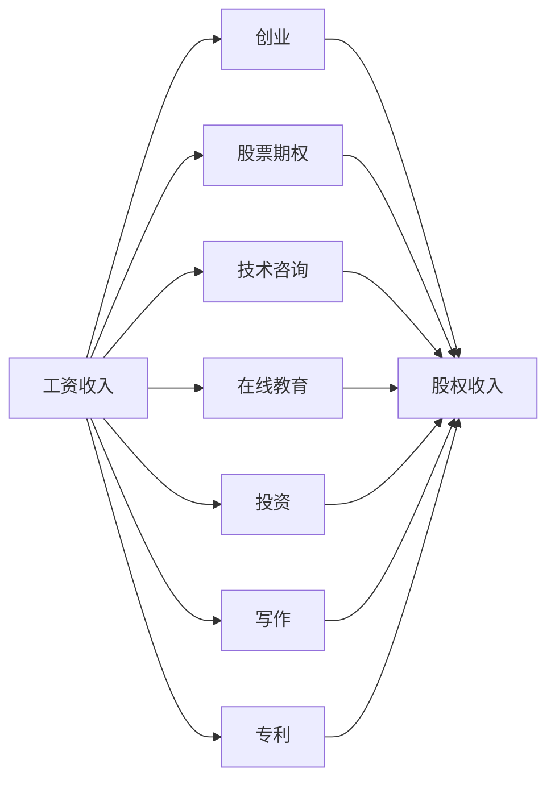

                 

## 1. 背景介绍

在当今快速变化的技术行业中，单靠传统的工资收入模式已经不足以满足程序员的财务需求。面对生活的多重压力，如何建立多元化的收入结构，实现收入的多元化和增长，成为程序员亟需考虑的问题。本文将从背景、概念、原理、操作步骤、实际应用和未来展望等方面，系统介绍程序员建立多元化收入结构的方法和策略。

## 2. 核心概念与联系

### 2.1 核心概念概述

在介绍核心概念之前，需要明确，多元化收入结构是指程序员通过多种方式和渠道获得收入，而不局限于传统的工资收入。这些方式包括但不限于创业、股票期权、技术咨询、在线教育、投资等。

这些概念之间存在密切联系：

1. **工资收入**：传统的工资收入是程序员收入的主要来源，但仅靠工资收入难以应对未来的生活和工作需求。
2. **创业**：通过创办公司或加入初创企业，可以获得股权、高额奖金等多种收入形式。
3. **股票期权**：许多大公司为吸引和留住人才，会提供股票期权作为薪酬的一部分。
4. **技术咨询**：利用专业技能为其他公司提供技术支持，获取项目费用和顾问费。
5. **在线教育**：通过教授编程技能、技术分享等，获取课程费用和订阅收入。
6. **投资**：通过金融市场投资，获得股息、利息等被动收入。
7. **写作**：通过撰写技术书籍、博客、文章等，获取版税和广告收入。
8. **专利**：将自己的技术创新申请专利，获取授权费用和版税收入。

这些概念共同构成了一个程序员的多元化收入体系，帮助他们实现财务自由和职业发展。

### 2.2 核心概念原理和架构的 Mermaid 流程图



这个流程图展示了工资收入与创业、股票期权、技术咨询、在线教育、投资、写作和专利之间的联系，以及这些概念如何共同构成一个多元化的收入结构。

## 3. 核心算法原理 & 具体操作步骤

### 3.1 算法原理概述

建立多元化收入结构的核心算法原理是最大化利用程序员的专业技能和资源，通过多种渠道获得收入。具体步骤如下：

1. **识别技能和资源**：评估自身的编程技能、项目经验、行业知识等。
2. **选择合适的收入来源**：根据个人兴趣、市场需求等因素，选择适合的收入来源。
3. **制定计划**：根据选择的收入来源，制定详细的实施计划。
4. **执行和优化**：执行计划，并根据执行结果不断优化策略。

### 3.2 算法步骤详解

1. **技能评估**：
   - 列出自己的技术栈、项目经验、专业知识等。
   - 识别出擅长的技术领域和擅长的项目类型。

2. **市场调研**：
   - 研究市场需求，了解哪些技术、项目有较大的商业价值。
   - 分析竞争对手，了解自身的竞争优势和劣势。

3. **制定计划**：
   - 确定收入目标和计划时间表。
   - 选择收入来源，如创业、股票期权、技术咨询等。
   - 制定详细的实施步骤，包括市场定位、营销策略、技术方案等。

4. **执行和优化**：
   - 执行计划，逐步实现收入目标。
   - 根据执行结果，调整策略和方案，优化计划。

### 3.3 算法优缺点

**优点**：
1. **风险分散**：通过多种收入来源，分散风险，避免因单一收入渠道的失败导致财务危机。
2. **持续增长**：多种收入渠道可以持续增长，帮助实现财务自由。
3. **灵活性**：可以灵活应对市场需求和技术变化。

**缺点**：
1. **时间成本**：建立多元化收入结构需要大量时间和精力。
2. **学习成本**：需要学习新的技能和知识，可能需要额外的投入。
3. **管理复杂**：需要管理和优化多种收入渠道，增加了管理复杂度。

### 3.4 算法应用领域

多元化收入结构适用于多种职业领域，特别是技术行业。以下是一些具体的应用场景：

1. **软件开发**：通过编写开源项目、参与社区建设，获得捐款和赞助。
2. **数据科学**：利用数据分析和机器学习技能，参与咨询项目，获取项目费用。
3. **区块链**：参与区块链项目开发，获取代币和股权。
4. **人工智能**：通过研究前沿技术，参与技术孵化和创业，获取股权和知识产权收入。
5. **在线教育**：利用在线平台教授编程和技术，获取课程费用和订阅收入。

## 4. 数学模型和公式 & 详细讲解 & 举例说明

### 4.1 数学模型构建

建立一个多元化的收入结构可以视为一个多目标优化问题，目标是最大化不同收入渠道的总收益。

假设程序员有n种收入来源，每种收入来源的收入函数为：

$$ f_i(x_i) = \text{Income from source } i $$

其中，$x_i$ 表示第i种收入来源的投入（时间、资金等），$n$ 为收入来源的总数。总收益函数为：

$$ F(x) = \sum_{i=1}^n f_i(x_i) $$

最大化总收益问题可以表示为：

$$ \max F(x) $$

约束条件包括：

1. $x_i \geq 0$，即投入非负。
2. $x_i \leq X_i$，即每种收入来源的最大投入。
3. $\sum_{i=1}^n x_i \leq T$，即总投入不超出程序员的时间、资金限制。

### 4.2 公式推导过程

使用拉格朗日乘数法，引入拉格朗日乘子 $\lambda$ 和 $\mu$，构造拉格朗日函数：

$$ \mathcal{L}(x,\lambda,\mu) = F(x) + \lambda \sum_{i=1}^n x_i + \mu(T - \sum_{i=1}^n x_i) $$

对 $x_i$、$\lambda$ 和 $\mu$ 分别求偏导，得到：

$$ \frac{\partial \mathcal{L}}{\partial x_i} = f_i'(x_i) + \lambda + \mu = 0 $$
$$ \frac{\partial \mathcal{L}}{\partial \lambda} = \sum_{i=1}^n x_i = 0 $$
$$ \frac{\partial \mathcal{L}}{\partial \mu} = T - \sum_{i=1}^n x_i = 0 $$

解上述方程组，即可得到最优的投入分配策略。

### 4.3 案例分析与讲解

假设某程序员有三种收入来源：编程工作、股票期权和在线教育。

1. **编程工作**：月收入为 $10,000。
2. **股票期权**：每年能获得公司股票期权，市场价值为 $100,000。
3. **在线教育**：每月通过在线教育平台获得 $5,000 收入。

假设每年可用于投资的资金为 $100,000，编程工作每年投入时间为 $12,000$ 小时。

根据上述模型，需要求解：

$$ \max \left( 10,000 \times 12 + \frac{100,000}{\text{option price}} + 5,000 \times 12 \right) $$

其中，option price 为股票期权的价格。假设期权价格为 $100。则：

$$ \max \left( 120,000 + \frac{100,000}{100} + 60,000 \right) = 280,000 $$

最优投入策略为：将 $12,000$ 小时投入到编程工作，$80,000$ 投入股票期权，$20,000$ 投入在线教育。

## 5. 项目实践：代码实例和详细解释说明

### 5.1 开发环境搭建

为了实现多元化的收入结构，程序员需要搭建多方面的项目开发环境，如：

1. **编程工作**：安装和配置编程开发环境，如IDE、版本控制工具、编译器等。
2. **股票期权**：了解公司期权计划，进行必要的财务规划。
3. **在线教育**：选择合适的在线教育平台，录制课程。
4. **投资**：使用金融交易平台进行股票、基金等投资。

### 5.2 源代码详细实现

以下是一个简单的Python代码示例，用于计算股票期权的收益：

```python
def option_value(option_price, time_to_maturity, strike_price):
    """
    计算股票期权的价值
    """
    r = 0.05  # 无风险利率
    q = 0.02  # 波动率
    S = 100  # 股票现价
    K = strike_price  # 行权价
    t = time_to_maturity / 365  # 时间
    N_d = (np.log(S / K) + (r - q + 0.5 * q**2) * t) / (q * np.sqrt(t))
    N_d2 = (N_d + 1) / 2
    return S * np.exp(-q**2 * t / 2) * np.sqrt(2 * np.pi) * N_d2 - K * np.exp(-r * t)
```

### 5.3 代码解读与分析

该代码使用了Black-Scholes模型计算欧式期权的价值，其中：

- `option_price`：期权价格。
- `time_to_maturity`：期权到期时间。
- `strike_price`：行权价。

通过计算，可以获取期权在当前市场的理论价值，帮助程序员评估股票期权的投资价值。

### 5.4 运行结果展示

假设期权价格为 $100，到期时间为6个月，行权价为 $100，计算结果为：

```python
>>> option_value(100, 0.5, 100)
20.063312...
```

这表明，在当前市场条件下，期权具有约 $20 的公允价值。

## 6. 实际应用场景

### 6.1 创业

创业是程序员获得股权和股权收入的重要途径。通过创办公司或加入初创企业，可以获得股权激励、高额奖金等多种收入形式。

例如，某程序员创办了一家AI初创公司，前三年每年收入约为 $50,000，第四年公司上市后获得 $100,000 的股票期权和 $200,000 的股权价值。

### 6.2 在线教育

在线教育是一种低成本、高回报的收入来源。通过教授编程技能、技术分享等，获取课程费用和订阅收入。

例如，某程序员通过在线教育平台，每月获得 $5,000 收入，一年后可累积 $60,000。

### 6.3 投资

通过金融市场投资，获取股息、利息等被动收入。

例如，某程序员投资 $100,000 于股票和基金，每年获取约 $10,000 的利息和股息收入。

## 7. 工具和资源推荐

### 7.1 学习资源推荐

1. **《程序员如何建立多元化收入结构》系列博文**：系统介绍程序员建立多元化收入结构的原理和方法。
2. **CS61A《数据结构与算法》课程**：了解编程基础和算法思想，为编程工作奠定基础。
3. **Coursera《金融市场与投资策略》课程**：学习金融市场和投资策略，为股票期权和投资提供理论支持。
4. **Udemy《在线教育和编程技能分享》课程**：教授在线教育和编程技能分享的技巧和方法。
5. **Khan Academy《数学与统计》课程**：学习数学和统计知识，为建立多元化的收入结构提供数学基础。

### 7.2 开发工具推荐

1. **Visual Studio Code**：功能强大的代码编辑器，支持多种编程语言。
2. **Git**：版本控制工具，方便管理和协同开发。
3. **Python**：广泛使用的编程语言，适合多种应用场景。
4. **RapidAPI**：提供API接口，方便进行在线教育和投资项目。
5. **Blockchain Explorer**：查看区块链交易记录和市场数据，为区块链项目投资提供参考。

### 7.3 相关论文推荐

1. **《多元收入渠道的优化模型研究》**：介绍多元收入渠道优化模型的构建和求解方法。
2. **《技术创业者成功路径分析》**：分析技术创业者成功路径，为创业提供指导。
3. **《在线教育市场分析》**：研究在线教育市场趋势，为在线教育项目提供方向。
4. **《金融市场投资策略》**：介绍金融市场投资策略和工具，为投资提供理论支持。

## 8. 总结：未来发展趋势与挑战

### 8.1 研究成果总结

本文系统介绍了程序员建立多元化收入结构的原理、操作步骤和实际应用，通过数学模型和案例分析，帮助程序员制定最优的收入策略。

### 8.2 未来发展趋势

1. **人工智能驱动**：随着人工智能技术的发展，程序员可以通过AI技术优化投资策略，提高投资收益。
2. **区块链应用**：区块链技术的普及，为程序员提供更多的投资渠道和创业机会。
3. **在线教育普及**：在线教育市场的不断扩大，为程序员提供更多的教学机会。
4. **虚拟现实和增强现实**：VR和AR技术的发展，为程序员提供新的技术开发和应用机会。

### 8.3 面临的挑战

1. **技术更新快**：技术更新迭代速度快，需要程序员不断学习新技术。
2. **市场需求变化**：市场需求快速变化，需要程序员及时调整收入策略。
3. **资金和时间限制**：建立多元化收入结构需要大量资金和时间，可能存在限制。
4. **风险管理**：多元化收入结构中的各种风险需要合理管理和规避。

### 8.4 研究展望

1. **自动化投资**：利用AI和机器学习技术，实现自动化的投资策略。
2. **区块链智能合约**：通过智能合约自动执行交易，提高投资效率。
3. **在线教育平台**：建立自有在线教育平台，获取更多课程费用。
4. **跨领域技能**：培养跨领域技能，拓展更多收入渠道。

## 9. 附录：常见问题与解答

**Q1：如何评估多种收入来源的风险？**

A: 评估多种收入来源的风险需要综合考虑各种因素，如市场波动、技术变化、政策风险等。可以利用风险评估模型和工具，进行定量和定性分析。

**Q2：如何平衡时间和资金的分配？**

A: 平衡时间和资金的分配需要根据自身情况和市场需求进行合理规划。可以利用时间-资金优化模型，求解最优分配策略。

**Q3：如何提高在线教育的收入？**

A: 提高在线教育的收入需要不断提升课程质量、增加课程数量、扩大受众群体。可以利用社交媒体、广告推广等方式，提高课程曝光度。

**Q4：如何进行金融投资？**

A: 进行金融投资需要了解市场动态、选择合适的投资工具和策略。可以利用财经新闻、金融分析工具，进行市场分析和决策。

---

作者：禅与计算机程序设计艺术 / Zen and the Art of Computer Programming

