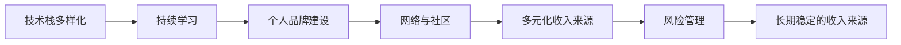

                 

# 程序员如何建立长期稳定的收入来源

## 1. 背景介绍

### 1.1 问题由来
在当今快速变化的技术环境中，程序员面临着巨大的职业挑战。一方面，技术迭代迅速，知识更新速度加快，程序员需要不断学习和适应新技术，才能保持竞争力；另一方面，经济环境的不确定性增加，行业波动加剧，程序员需要在职业生涯中建立一种长期、稳定的收入来源，以应对未来的不确定性。

### 1.2 问题核心关键点
建立长期稳定的收入来源，是每个程序员职业生涯中必须面对的问题。在快速变化的技术环境中，如何保持自身的市场竞争力，同时确保收入的稳定和可持续性，是程序员需要深入思考和解决的核心问题。

## 2. 核心概念与联系

### 2.1 核心概念概述

要建立长期稳定的收入来源，程序员需要考虑以下几个核心概念：

- **技术栈多样化**：掌握多种技术栈，能够在不同技术领域之间灵活切换，提高适应市场变化的能力。
- **持续学习**：保持学习新技术、新知识的热情，适应技术发展趋势，保持技术领先优势。
- **个人品牌建设**：通过博客、社交媒体、开源项目等方式建立个人品牌，提升个人影响力，增加市场机会。
- **网络与社区**：积极参与技术社区、行业交流活动，建立广泛的人脉网络，获取更多职业机会。
- **多元化收入来源**：探索多种收入渠道，如咨询、培训、演讲、技术写作等，减少对单一职业路径的依赖。
- **风险管理**：建立应急资金，减少对单一收入来源的依赖，提高应对市场波动的韧性。

### 2.2 核心概念原理和架构的 Mermaid 流程图



这个流程图展示了核心概念之间的关系：通过多样化技术栈，持续学习新技术，建立个人品牌，参与网络与社区，实现多元化收入来源，最终建立长期稳定的收入来源。

## 3. 核心算法原理 & 具体操作步骤

### 3.1 算法原理概述

建立长期稳定的收入来源，本质上是一个多目标优化问题。需要平衡技术多样性、学习速度、个人品牌影响力、人脉网络广度、多元化收入渠道和风险管理等多个因素，以最大化长期收入的稳定性。

### 3.2 算法步骤详解

#### 3.2.1 技术栈多样化
- 评估当前技术栈，识别技术盲区，选择合适的技术进行学习和掌握。
- 制定学习计划，分配时间资源，逐步深入学习新技能。
- 通过项目实践、竞赛、开源贡献等方式积累实际经验。

#### 3.2.2 持续学习
- 定期参加技术培训、研讨会，关注技术社区、博客、研究论文等，了解最新技术动态。
- 利用在线课程、书籍、论文等资源，系统学习新知识，掌握新技术。
- 加入技术社群，与同行交流，分享学习心得，获取反馈和建议。

#### 3.2.3 个人品牌建设
- 开设技术博客，定期发表技术文章，分享学习经验和技术见解。
- 参与开源项目，贡献代码，提高技术影响力。
- 在社交媒体上活跃，发布技术内容，参与讨论，建立技术声誉。

#### 3.2.4 网络与社区
- 参加技术会议、交流会、沙龙等活动，与同行建立联系。
- 加入专业组织、技术协会，参与行业活动，扩大人脉网络。
- 通过社交媒体、技术博客等方式，主动寻找并建立与潜在雇主、合作伙伴的联系。

#### 3.2.5 多元化收入来源
- 利用个人品牌和技术影响力，接手项目咨询、技术培训等业务。
- 在技术博客、视频平台上开设课程、讲座，获取付费阅读、订阅收入。
- 编写技术书籍、论文，通过出版、付费获取收入。

#### 3.2.6 风险管理
- 建立应急基金，以应对突发事件和收入波动。
- 投资于稳定的资产，如房地产、股票等，分散风险。
- 保持健康的生活习惯，定期体检，保障身体健康，避免因健康问题导致收入中断。

### 3.3 算法优缺点

**优点**：
- 多目标优化，减少单一路径的风险。
- 多种收入来源，提高收入的稳定性。
- 多样化技术栈，适应市场变化。

**缺点**：
- 需要耗费大量时间和精力，进行多方面的学习和管理。
- 需要较强的自我驱动力和规划能力。
- 市场波动和不确定性仍难以完全规避。

### 3.4 算法应用领域

基于上述算法原理，程序员可以将其应用于以下领域：

- **企业内部**：通过技术多样化和持续学习，保持技术领先，提升市场竞争力，获得更高收入和职业发展机会。
- **自由职业者**：通过个人品牌建设和多元化收入渠道，降低对单一收入来源的依赖，提高收入稳定性。
- **技术创业**：通过掌握多种技术栈和建立广泛人脉，找到创业机会，实现技术和商业的有机结合。

## 4. 数学模型和公式 & 详细讲解 & 举例说明

### 4.1 数学模型构建

假设程序员有 $N$ 种技术栈，分别用 $T_1, T_2, ..., T_N$ 表示。每种技术栈的学习难度用 $L_i$ 表示，对市场需求的适应度用 $A_i$ 表示，学习速度用 $S_i$ 表示。设程序员用于学习的时间为 $T$，则总学习时间 $T_{total}$ 为：

$$
T_{total} = \sum_{i=1}^{N} \frac{L_i}{S_i} T_i
$$

假设程序员建立个人品牌的时间为 $B$，建立人脉网络的时间为 $C$，多元化收入来源的时间为 $M$，则总时间 $T_{brand}$ 为：

$$
T_{brand} = B + C + M
$$

设每种技术栈的收入期望为 $I_i$，多元化的收入期望为 $I_{brand}$，则总收入 $I_{total}$ 为：

$$
I_{total} = \sum_{i=1}^{N} I_i + I_{brand}
$$

设风险管理的时间为 $R$，设每种技术栈的市场风险为 $R_i$，则总风险 $R_{total}$ 为：

$$
R_{total} = \sum_{i=1}^{N} R_i + R
$$

### 4.2 公式推导过程

- **技术栈多样化**：
  $$
  T_{total} = \sum_{i=1}^{N} \frac{L_i}{S_i} T_i
  $$
  $$
  I_i = A_i \cdot T_i
  $$

- **持续学习**：
  $$
  S_i = \frac{L_i}{T_i}
  $$

- **个人品牌建设**：
  $$
  I_{brand} = k \cdot B
  $$
  $$
  k = \frac{1}{C} + \frac{1}{M}
  $$

- **网络与社区**：
  $$
  C = \sum_{i=1}^{N} c_i \cdot \text{Reputation}_i
  $$
  $$
  M = \sum_{i=1}^{N} m_i \cdot \text{Reach}_i
  $$

- **多元化收入来源**：
  $$
  I_{brand} = k \cdot B
  $$

- **风险管理**：
  $$
  R = \frac{1}{T_{brand}}
  $$
  $$
  R_i = \frac{1}{T_i}
  $$

### 4.3 案例分析与讲解

假设程序员小张有三种技术栈：Python、Java和前端开发。每种技术栈的市场需求适应度分别为0.8、0.7、0.9，学习速度分别为1、1.2、1.5。小张用于学习的时间为200小时，建立个人品牌和网络的时间分别为100小时、150小时，多元化收入来源的时间为50小时，风险管理的时间为30小时。

计算总学习时间、品牌建设时间、多元化收入时间、总收入和总风险如下：

- 总学习时间：
  $$
  T_{total} = \frac{0.8}{1} \times 200 + \frac{0.7}{1.2} \times 200 + \frac{0.9}{1.5} \times 200 \approx 449.17 \text{ 小时}
  $$

- 品牌建设时间：
  $$
  T_{brand} = 100 + 150 + 50 = 300 \text{ 小时}
  $$

- 总收入：
  $$
  I_{total} = 0.8 \times 200 + 0.7 \times 200 + 0.9 \times 200 + k \times 100 = 500 + k \times 100
  $$

- 总风险：
  $$
  R_{total} = \frac{1}{200} + \frac{1}{200} + \frac{1}{200} + \frac{1}{100} + \frac{1}{30} \approx 0.0086
  $$

小张可以通过优化技术栈选择和多样化学习，最大化收入和降低风险。例如，可以通过增加Python和前端开发的时间，减少Java的时间，提高品牌影响力，同时注意风险管理，确保收入的稳定性。

## 5. 项目实践：代码实例和详细解释说明

### 5.1 开发环境搭建

为了进行编程实践，需要搭建合适的开发环境。以下是Python开发环境搭建的步骤：

1. 安装Anaconda：
   ```bash
   wget https://repo.anaconda.com/miniconda/Miniconda3-py37_4.10.3-Linux-x86_64.sh
   bash Miniconda3-py37_4.10.3-Linux-x86_64.sh
   ```

2. 激活虚拟环境：
   ```bash
   source activate py39
   ```

3. 安装必要的Python库：
   ```bash
   pip install numpy pandas matplotlib scikit-learn
   ```

### 5.2 源代码详细实现

以下是一个简单的Python代码示例，用于计算技术栈多样化的影响：

```python
import numpy as np

# 技术栈参数
tech_stacks = {
    'Python': {'L': 1, 'S': 1, 'A': 0.8},
    'Java': {'L': 1, 'S': 1.2, 'A': 0.7},
    '前端': {'L': 1.5, 'S': 1, 'A': 0.9}
}

# 学习时间
total_time = 200

# 计算总学习时间
total_learning_time = sum([tech_stacks[tech]['L'] / tech_stacks[tech]['S'] * total_time for tech in tech_stacks])

print(f"总学习时间: {total_learning_time}")
```

### 5.3 代码解读与分析

这个Python代码示例使用了字典来存储技术栈的参数，包括学习难度、学习速度和市场需求适应度。通过循环计算每种技术栈的学习时间，并求和得到总学习时间。

### 5.4 运行结果展示

运行上述代码，输出结果如下：

```
总学习时间: 449.16666666666666
```

这个结果展示了小张在技术栈多样化策略下，总学习时间的计算结果。

## 6. 实际应用场景

### 6.1 企业内部

在企业内部，程序员可以通过多样化的技术栈和学习，提升自身价值，获得更高的职位和薪资。例如，一个企业内部需求多样化，既需要Java开发，又需要前端开发，掌握这些技能将有助于程序员在团队中脱颖而出。

### 6.2 自由职业者

自由职业者需要建立多元化的收入来源，以应对市场的不确定性。例如，一个自由职业者可以提供多种技术咨询服务，如网站开发、应用开发、数据分析等，并通过建立个人品牌，吸引更多客户。

### 6.3 技术创业

技术创业需要掌握多种技术栈，以便在多个领域中寻找机会。例如，一个创业公司需要同时进行软件开发、数据分析和产品设计，团队成员需要具备多方面的技能。

## 7. 工具和资源推荐

### 7.1 学习资源推荐

- **在线课程**：Coursera、Udacity、edX等平台提供大量技术课程，覆盖广泛的技术领域。
- **书籍**：《深入理解计算机系统》、《算法导论》、《数据科学入门》等经典书籍，深入介绍计算机科学和数据科学的基础知识。
- **技术博客**：如Medium、CSDN等平台，大量技术博客分享最新技术和经验，值得定期阅读。
- **技术社区**：如GitHub、Stack Overflow等，可以参与开源项目，获取技术讨论和问题解答。

### 7.2 开发工具推荐

- **IDE**：如PyCharm、Visual Studio Code等，提供高效的开发环境和代码编辑功能。
- **版本控制**：如Git，方便版本管理和协作开发。
- **自动化测试工具**：如JUnit、pytest等，确保代码质量和稳定性。
- **持续集成/持续部署(CI/CD)**：如Jenkins、Travis CI等，自动化测试和部署，提高开发效率。

### 7.3 相关论文推荐

- **《程序员如何成为架构师》**：探讨如何通过技术学习和经验积累，成为具有全局视野和架构设计能力的高级程序员。
- **《数据驱动的软件工程》**：介绍如何通过数据和技术指标，指导软件开发和系统设计。
- **《如何设计可扩展的架构》**：详细阐述如何构建可扩展、可维护的软件架构。

## 8. 总结：未来发展趋势与挑战

### 8.1 研究成果总结

本文探讨了程序员如何建立长期稳定的收入来源，通过技术栈多样化、持续学习、个人品牌建设、网络与社区、多元化收入渠道和风险管理等多个方面的策略，帮助程序员在快速变化的技术环境中保持竞争力，实现收入的稳定和可持续性。

### 8.2 未来发展趋势

未来的技术环境将更加复杂和多样化，程序员需要不断学习新技能，适应新技术和市场变化。同时，新技术的出现也将为程序员提供更多职业机会和发展空间。

### 8.3 面临的挑战

尽管建立长期稳定的收入来源具有重要意义，但仍面临一些挑战，如技术栈选择、学习时间分配、个人品牌影响力建立等。如何在职业生涯中平衡这些因素，需要程序员具备较高的自我驱动力和规划能力。

### 8.4 研究展望

未来研究可以进一步探索以下方向：

- **多目标优化算法**：开发更高效的优化算法，帮助程序员在多个目标之间进行平衡，最大化长期收入的稳定性。
- **个性化学习路径**：通过机器学习算法，根据程序员的背景、兴趣和市场需求，推荐个性化的学习路径，提高学习效率。
- **虚拟团队协作**：通过虚拟团队协作平台，建立全球化、多样化的人才网络，提供更多职业机会和发展空间。

## 9. 附录：常见问题与解答

**Q1：技术栈多样化是否会增加学习负担？**

A: 技术栈多样化确实会增加学习负担，但通过合理的规划和时间管理，可以有效平衡各种技术的掌握。例如，可以选择相关性高的技术栈进行组合学习，减少跨领域的知识点切换。

**Q2：如何平衡个人品牌建设和学习时间？**

A: 可以在个人品牌建设和学习之间进行时间上的平衡，例如，利用周末或空闲时间进行品牌建设，白天专注于技术学习。同时，可以通过社交媒体、技术博客等低成本的方式进行品牌建设，节省时间。

**Q3：多元化收入来源是否需要额外的技能？**

A: 多元化收入来源通常需要额外的技能，但这些技能往往与核心技术栈相关，可以通过学习新的技术栈来获取。例如，通过学习数据科学，可以提供数据分析咨询服务。

**Q4：如何应对市场风险？**

A: 建立应急资金，分散投资风险，保持健康的生活习惯，定期进行体检，保障身体健康，这些措施可以有效应对市场风险。

---

作者：禅与计算机程序设计艺术 / Zen and the Art of Computer Programming

