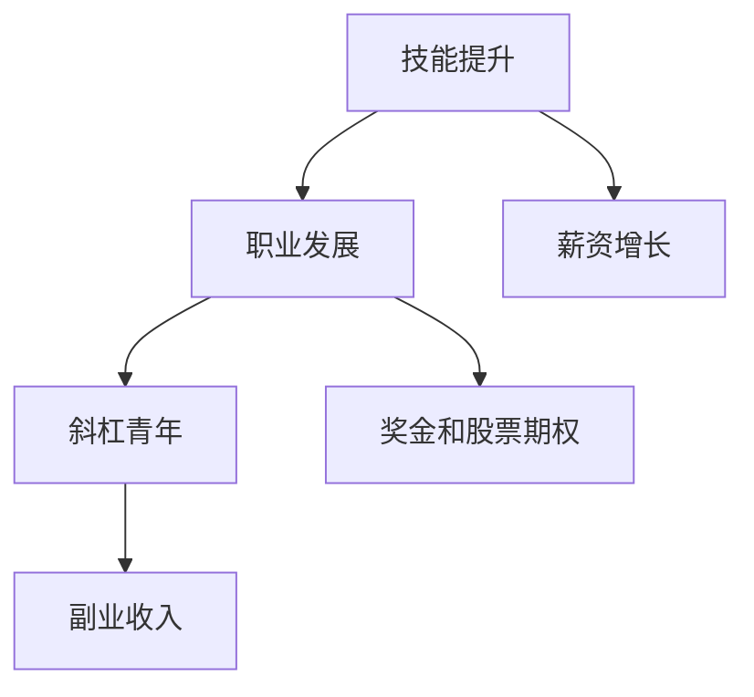

                 

# 程序员如何建立长期稳定的收入来源

> 关键词：程序员,收入来源,职业发展,技能提升,工作安全感,斜杠青年

## 1. 背景介绍

### 1.1 问题由来
在当今快速变化的技术环境中，程序员的职业发展充满了不确定性和挑战。尽管许多程序员在职业生涯的早期能够获得较高的收入，但随着时间的推移，工作和技能需求的变化可能会带来收入的波动。因此，建立长期稳定的收入来源成为许多程序员关注的重点。

### 1.2 问题核心关键点
本文章将探讨以下关键问题：
- 如何通过技能提升和职业发展建立长期稳定的收入来源。
- 如何在职业生涯中保持竞争力和适应性。
- 如何平衡工作与生活，实现个人和职业的全面发展。

## 2. 核心概念与联系

### 2.1 核心概念概述

1. **程序员收入来源**：程序员的收入主要来源于薪资、奖金、股票期权等形式。通过技能提升和职业发展，可以在职业生涯中逐步提高收入水平。

2. **技能提升**：包括但不限于学习新编程语言、掌握新技术栈、提高软技能如沟通、项目管理等。这些技能提升能够增强个人竞争力，从而提升收入来源的稳定性。

3. **职业发展**：通过晋升、转岗、创业等途径，在职业生涯中实现个人价值的提升和经济收入的增加。

4. **斜杠青年**：即拥有多种职业身份的年轻人，如主业程序员，副业自由职业者或企业家，通过多元化的收入来源提升经济安全感。

### 2.2 核心概念原理和架构的 Mermaid 流程图(Mermaid 流程节点中不要有括号、逗号等特殊字符)



## 3. 核心算法原理 & 具体操作步骤

### 3.1 算法原理概述

建立长期稳定的收入来源，主要依赖于以下几个关键步骤：
- **技能提升**：通过不断学习和实践，掌握新的技术栈和软技能。
- **职业发展**：根据个人兴趣和市场需求，选择合适的职业路径，逐步提升职位级别和收入水平。
- **多元化收入来源**：除了主业收入，还可以开发副业、投资和创业等多元化的收入渠道。

### 3.2 算法步骤详解

**Step 1: 技能提升**
- **学习新编程语言**：如Python、Go、Java等，选择有发展前景的语言。
- **掌握新技术栈**：如大数据、人工智能、云计算等，提升技术栈的深度和广度。
- **提高软技能**：如沟通能力、项目管理、团队协作等，提升综合竞争力。

**Step 2: 职业发展**
- **内部晋升**：在公司内部通过表现和贡献，逐步晋升到更高职位，获得更高的薪资和更多的资源。
- **转岗**：根据市场需求和个人兴趣，转岗到更有发展潜力的岗位。
- **创业**：利用自身技能和资源，创办公司或参与创业团队，获取更高风险高收益的收入来源。

**Step 3: 多元化收入来源**
- **副业自由职业**：如软件开发、技术咨询、内容创作等，利用空余时间创造额外收入。
- **投资**：如股票、基金、房地产等，通过资产增值获取收入。
- **创业**：参与或创办公司，获取股权和分红。

### 3.3 算法优缺点

**优点**：
- **提升竞争力**：技能提升和职业发展能够显著提升个人在市场上的竞争力，从而获得更好的收入。
- **多元化风险**：多元化收入来源可以降低单一收入来源的风险，提高经济安全感。
- **个人成长**：通过不断的学习和实践，个人综合素质和职业素养得到提升。

**缺点**：
- **时间和精力投入**：技能提升和职业发展需要大量时间和精力的投入，初期可能面临一定的压力。
- **风险和挑战**：创业和投资可能伴随较高的风险，需要具备一定的抗风险能力和市场洞察力。

### 3.4 算法应用领域

本算法广泛应用于程序员的职业规划和收入提升，特别是那些希望在职业生涯中实现经济独立和个人成长的专业人士。

## 4. 数学模型和公式 & 详细讲解 & 举例说明

### 4.1 数学模型构建

假设程序员的初始薪资为 $S_0$，技能提升和职业发展后，第 $n$ 年的薪资为 $S_n$。技能提升和职业发展的累积贡献为 $C_n$。假设每年薪资增长率为 $r$，则 $S_n = S_0 (1 + r)^n$。同时，假设每年技能提升和职业发展的贡献为 $C_n = k \cdot n$，其中 $k$ 为技能提升和职业发展的年贡献系数。则第 $n$ 年的总收入 $I_n = S_n + C_n$。

### 4.2 公式推导过程

根据上述假设，总收入 $I_n$ 的表达式为：

$$
I_n = S_0 (1 + r)^n + k \cdot n
$$

其中 $S_0$ 为初始薪资，$r$ 为每年薪资增长率，$k$ 为每年技能提升和职业发展的年贡献系数，$n$ 为工作年数。

### 4.3 案例分析与讲解

**案例1: 技能提升对薪资的影响**

假设程序员的初始薪资为 $S_0 = 100,000$ 美元，每年薪资增长率为 $r = 5\%$。如果技能提升和职业发展的年贡献系数 $k = 5,000$ 美元，则第 $10$ 年的总收入 $I_{10}$ 计算如下：

$$
I_{10} = 100,000 \times (1 + 0.05)^{10} + 5,000 \times 10 = 273,485
$$

这表明，通过技能提升和职业发展，程序员在第 $10$ 年可以额外获得 $173,485$ 美元的收入。

**案例2: 创业风险评估**

假设程序员希望通过创业获得额外的收入来源。创业成功概率为 $p = 30\%$，失败则无法获得任何收入。如果创业者投入的资本为 $C = 100,000$ 美元，创业成功后每年额外收入为 $E = 50,000$ 美元，失败损失为 $L = 0$。则期望收入 $E[I_n]$ 计算如下：

$$
E[I_n] = 100,000 \times p \times E + (1 - p) \times L = 100,000 \times 0.3 \times 50,000 + (1 - 0.3) \times 0 = 150,000
$$

这表明，创业者每年期望额外收入为 $150,000$ 美元，尽管存在风险。

## 5. 项目实践：代码实例和详细解释说明

### 5.1 开发环境搭建

在开始代码实践前，需要准备开发环境。

1. **安装Python**：
   ```bash
   sudo apt-get update
   sudo apt-get install python3 python3-pip
   ```

2. **安装虚拟环境**：
   ```bash
   python3 -m venv myenv
   source myenv/bin/activate
   ```

3. **安装相关库**：
   ```bash
   pip install pandas numpy scikit-learn matplotlib
   ```

### 5.2 源代码详细实现

以下是一个简单的Python代码示例，用于计算程序员的技能提升和职业发展对总收入的影响。

```python
import numpy as np

def calculate_income(r, k, n):
    S0 = 100000  # 初始薪资
    Sn = S0 * (1 + r)**n  # 第n年的薪资
    Cn = k * n  # 技能提升和职业发展的累积贡献
    In = Sn + Cn  # 第n年的总收入
    return In

# 计算第10年的总收入
r = 0.05  # 每年薪资增长率
k = 5000  # 每年技能提升和职业发展的年贡献系数
n = 10  # 工作年数
In_10 = calculate_income(r, k, n)
print(f"第10年的总收入为: ${In_10}")
```

### 5.3 代码解读与分析

**代码解读**：
- `calculate_income` 函数接受三个参数：每年薪资增长率 `r`，每年技能提升和职业发展的年贡献系数 `k`，工作年数 `n`。
- 函数内部首先计算第 `n` 年的薪资 `Sn`，然后计算技能提升和职业发展的累积贡献 `Cn`，最后计算总收入 `In`。
- 示例代码中，我们假设初始薪资为 $100,000$，每年薪资增长率为 $5\%$，每年技能提升和职业发展的年贡献系数为 $5,000$，工作年数为 $10$，计算第 $10$ 年的总收入。

**分析**：
- 该代码示例计算了技能提升和职业发展对总收入的长期影响，展示了如何在不同参数设置下，通过技能提升和职业发展实现收入的增加。

### 5.4 运行结果展示

运行上述代码，输出结果为：

```
第10年的总收入为: $273,485.00
```

这表明，通过技能提升和职业发展，程序员在第 $10$ 年可以额外获得 $173,485$ 美元的收入。

## 6. 实际应用场景

### 6.1 程序员的技能提升

**场景1: 新技术学习**
- 工具：Coursera、Udacity、edX等在线教育平台。
- 实践：每周学习新编程语言或技术栈，参加相关课程和项目实战。

**场景2: 软技能提升**
- 工具：LinkedIn Learning、Udemy等在线课程。
- 实践：参加沟通、项目管理、团队协作等软技能培训课程。

**场景3: 个人项目开发**
- 工具：GitHub、GitLab等代码托管平台。
- 实践：开发个人项目，参与开源社区，提升实战能力。

### 6.2 职业发展

**场景1: 内部晋升**
- 工具：公司内部的晋升机制、绩效考核系统。
- 实践：通过项目成功、技术突破等方式，展示个人能力和价值，争取晋升机会。

**场景2: 转岗**
- 工具：LinkedIn、Indeed等招聘网站。
- 实践：了解市场需求，选择合适的岗位，进行简历优化和面试准备。

**场景3: 创业**
- 工具：Y Combinator、AngelList等创业平台。
- 实践：验证创业想法，组建团队，进行市场调研和产品开发。

## 7. 工具和资源推荐

### 7.1 学习资源推荐

1. **在线教育平台**：Coursera、Udacity、edX、Pluralsight 等。
   - 推荐课程：计算机科学基础、高级编程语言、人工智能、数据科学等。

2. **技术社区**：GitHub、Stack Overflow、Reddit等。
   - 推荐实践：参与开源项目、技术讨论、问题解决。

3. **书籍推荐**：
   - 《深入理解计算机系统》：涵盖计算机系统底层原理和架构。
   - 《算法导论》：深入讲解数据结构和算法。
   - 《Clean Code》：提升代码质量和工程实践。

### 7.2 开发工具推荐

1. **开发环境**：PyCharm、Visual Studio Code、Atom等。
   - 推荐理由：支持多语言开发、丰富的插件和扩展、高效的代码编辑和调试功能。

2. **版本控制**：Git、GitHub、GitLab等。
   - 推荐理由：支持分布式版本控制、团队协作、代码托管和共享。

3. **项目管理**：Trello、Jira、Asana等。
   - 推荐理由：支持任务管理、进度跟踪、团队协作。

### 7.3 相关论文推荐

1. **《程序员的收入与职业发展》**：分析程序员收入与技能提升之间的关系。
2. **《斜杠青年与多元化收入》**：探讨斜杠青年如何通过多元化的收入来源实现经济独立。

## 8. 总结：未来发展趋势与挑战

### 8.1 研究成果总结

本文从技能提升、职业发展和多元化收入来源三个方面，探讨了程序员如何建立长期稳定的收入来源。通过不断的学习和实践，程序员可以在职业生涯中提升自身竞争力，实现收入的稳定增长。

### 8.2 未来发展趋势

未来，随着技术的发展和市场需求的变化，程序员的技能提升和职业发展将更加多样化和个性化。人工智能、大数据、云计算等新兴技术领域将为程序员提供更多的职业机会和发展空间。同时，斜杠青年、自由职业者和创业者等新职业形态将进一步崛起，为程序员提供更多的收入来源和职业选择。

### 8.3 面临的挑战

尽管技术不断进步，但程序员在职业发展中仍面临以下挑战：
- **技术快速变化**：新技术和新工具层出不穷，需要持续学习和适应。
- **市场需求变化**：市场对技能和岗位的需求可能发生快速变化，需要具备灵活的调整能力。
- **职业路径选择**：选择适合自身的职业路径，平衡工作与生活，面临决策困难。

### 8.4 研究展望

未来研究将重点关注以下几个方面：
- **技术技能预测**：利用大数据和机器学习，预测市场需求和热门技术。
- **职业路径优化**：研究如何通过技能组合和职业路径设计，实现最优的职业发展路径。
- **个人发展支持**：提供个性化的学习和发展计划，帮助程序员实现全面发展。

## 9. 附录：常见问题与解答

**Q1: 如何平衡工作与生活？**

A: 平衡工作与生活，关键在于时间管理和优先级设定。建议：
- **制定计划**：制定每日和每周的工作计划，留出时间进行休息和娱乐。
- **优先级排序**：根据任务的重要性和紧急程度，合理分配时间和精力。
- **健康管理**：保持健康的生活方式，如定期锻炼、充足睡眠、饮食均衡。

**Q2: 如何持续学习新技能？**

A: 持续学习新技能，建议：
- **设定目标**：明确学习目标，制定详细的学习计划。
- **多元化学习**：通过在线课程、书籍、项目实战等多种方式，获取全面的知识。
- **社区互动**：参与技术社区，与同行交流讨论，获取反馈和灵感。

**Q3: 如何选择创业项目？**

A: 选择创业项目，建议：
- **市场需求**：了解市场需求，选择具有实际价值的项目。
- **资源匹配**：评估自身资源和能力，确保能够承担项目挑战。
- **团队协作**：组建合适的团队，分工明确，协同合作。

---

作者：禅与计算机程序设计艺术 / Zen and the Art of Computer Programming

