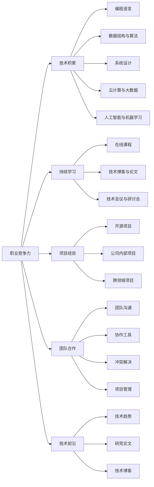

                 

# 程序员如何建立长期职业竞争力

> 关键词：职业竞争力, 技术积累, 持续学习, 项目经验, 团队合作, 技术前沿

## 1. 背景介绍

在当今快速变化的技术环境中，程序员要想保持其职业竞争力，仅仅掌握编程技能已经远远不够。持续学习、技术积累、项目经验、团队合作和技术前沿探索等几个方面都至关重要。本文将从这些维度，为程序员如何建立长期职业竞争力提供深度见解和实践指南。

## 2. 核心概念与联系

### 2.1 核心概念概述

在讨论如何建立职业竞争力之前，我们先简要概述几个核心概念：

- **职业竞争力**：指一个人在职业生涯中保持持续发展和竞争优势的综合能力，包括技术能力、项目经验、学习能力和团队合作等。

- **技术积累**：程序员通过不断的学习与实践，积累起丰富的技术知识，并能够在不同技术栈之间进行灵活切换。

- **持续学习**：不断学习新知识和新技术，以保持技能的与时俱进。

- **项目经验**：通过参与实际项目，累积实战经验，提升解决实际问题的能力。

- **团队合作**：在团队中有效协作，理解和尊重他人的工作方式，从而提升整体团队效率。

- **技术前沿**：关注最新的技术趋势和研究进展，通过研究前沿技术保持自己的竞争力。

### 2.2 核心概念原理和架构的 Mermaid 流程图(Mermaid 流程节点中不要有括号、逗号等特殊字符)



这个图表展示了各核心概念之间的联系：职业竞争力由多个要素组成，而技术积累、持续学习、项目经验、团队合作和技术前沿又是构建职业竞争力的重要组成部分。

## 3. 核心算法原理 & 具体操作步骤

### 3.1 算法原理概述

建立长期职业竞争力的算法原理可以简化为一系列的策略和步骤。我们可以将这些策略和步骤归为四个关键阶段：学习、实践、合作与创新。

1. **学习**：通过阅读、观看、实践和讨论等方式，不断学习和更新技术知识。
2. **实践**：在实际项目中应用所学知识，通过解决具体问题来提升技能。
3. **合作**：在团队中与他人协作，学习不同的工作方式和技能。
4. **创新**：关注和研究最新的技术趋势和创新，将其应用于实际项目中。

### 3.2 算法步骤详解

以下是具体的操作方法，涵盖学习、实践、合作与创新的各个方面：

#### 学习

- **在线课程与教程**：
  - 定期参加在线课程，如Coursera、Udacity、edX等。
  - 通过Kaggle等平台参加数据科学和机器学习竞赛。

- **技术博客与论文**：
  - 订阅相关技术博客和邮件列表。
  - 定期阅读和总结顶级会议和期刊的论文。

- **技术会议与研讨会**：
  - 参加本地和国际的编程会议，如PyCon、Strata Data Conference等。
  - 参加线上和线下的技术研讨会，如Meetup等。

#### 实践

- **开源项目**：
  - 参与和贡献到开源项目中，提升代码质量与实战经验。
  - 通过GitHub、Bitbucket等平台展示和分享自己的代码。

- **公司内部项目**：
  - 积极参与公司内部项目，解决实际业务问题。
  - 参与跨部门的项目，提升多领域协作能力。

#### 合作

- **团队沟通**：
  - 通过邮件、Slack和Zoom等工具，与团队成员保持良好的沟通。
  - 定期参加团队讨论，分享自己的想法和意见。

- **协作工具**：
  - 学习使用协作工具如Jira、Trello、Confluence等。
  - 遵循团队的编码标准和代码审查流程。

- **冲突解决**：
  - 在团队中发生冲突时，寻找有效的解决方式，如使用“我信息”表达方式和积极倾听。
  - 学会在团队中寻求共识和平衡。

#### 创新

- **技术趋势**：
  - 订阅最新的技术趋势报告，如Hacker News、TechCrunch等。
  - 关注业界领先的技术博客，如Medium、Towards Data Science等。

- **研究论文**：
  - 参与和发起研究项目，阅读最新的研究论文。
  - 尝试使用新技术进行项目迭代，进行实验和测试。

### 3.3 算法优缺点

**优点**：

- 系统性：通过以上步骤，可以系统地提升个人技能，保持竞争力。
- 全面性：覆盖了技术积累、持续学习、项目经验、团队合作和技术前沿等多个方面。
- 实践性：每个步骤都提供了具体的实践方法，易于实施。

**缺点**：

- 时间投入：需要大量的时间和精力来实施每个步骤，尤其是在学习和实践中。
- 适应性：不同人可能需要调整不同步骤的优先级和时间分配。
- 动机维持：长期保持这样的学习节奏可能对一些人来说是一个挑战。

### 3.4 算法应用领域

这些策略和步骤可以应用于几乎所有领域，包括但不限于软件开发、数据分析、人工智能、网络安全、系统管理等。

## 4. 数学模型和公式 & 详细讲解 & 举例说明

### 4.1 数学模型构建

我们可以通过构建一个简单的增长模型来理解职业竞争力的增长过程。假设程序员的职业竞争力为 $C(t)$，其中 $t$ 表示时间。

- **学习速率**：$L(t)$，表示程序员每天花在学习和阅读上的时间。
- **实践速率**：$P(t)$，表示程序员每天花在实践和项目上的时间。
- **团队合作速率**：$T(t)$，表示程序员每天花在团队沟通和协作上的时间。
- **技术前沿速率**：$F(t)$，表示程序员每天花在了解新技术和趋势上的时间。

因此，职业竞争力的增长模型可以表示为：

$$
C(t) = \int_{0}^{t} [L(t') + P(t') + T(t') + F(t')] dt'
$$

### 4.2 公式推导过程

- **学习速率**：$L(t)$ 的增长通常可以看作是指数增长，可以表示为：
$$
L(t) = L_0 * e^{kt}
$$
其中，$L_0$ 是初始学习时间，$k$ 是学习速率常数。

- **实践速率**：$P(t)$ 也遵循类似的增长规律，但由于实际项目的不确定性，可以采用线性增长或分段函数来模拟：
$$
P(t) = P_0 + m*t
$$
其中，$P_0$ 是初始实践时间，$m$ 是每日实践增加量。

- **团队合作速率**：$T(t)$ 同样可以采用指数增长或分段函数来表示，但由于合作的效果随时间逐渐显现，可能需要采用指数衰减的模型来描述：
$$
T(t) = T_0 * e^{-kt}
$$
其中，$T_0$ 是初始合作时间，$k$ 是合作效果衰减常数。

- **技术前沿速率**：$F(t)$ 通常为分段函数，因为新技术的出现往往是突发的，且学习和应用的周期较短：
$$
F(t) = \sum_{i=1}^{n} F_i * \delta(t - t_i)
$$
其中，$F_i$ 是第 $i$ 个新技术的影响力，$\delta$ 是单位脉冲函数。

### 4.3 案例分析与讲解

假设一个程序员每天投入3小时学习，5小时实践，2小时团队合作，2小时关注技术前沿。假设初始状态和增长参数如下：

- 初始学习时间 $L_0 = 3$ 小时/天
- 学习速率常数 $k = 0.05$
- 初始实践时间 $P_0 = 5$ 小时/天
- 每日实践增加量 $m = 0.2$ 小时/天
- 初始合作时间 $T_0 = 2$ 小时/天
- 合作效果衰减常数 $k = 0.1$
- 新技术出现周期 $t_i$ 为随机变量，每次事件影响力 $F_i$ 均为1小时。

我们可以计算该程序员在1000天后的职业竞争力。

假设每天发生1次新技术事件，每次事件影响力为1小时，则：

$$
F(t) = 1 * \delta(t - t_i) + 1 * \delta(t - (t_i + 1)) + ...
$$

根据上述模型，我们可以计算 $t = 1000$ 时的职业竞争力 $C(1000)$。

```python
import sympy as sp

# 定义变量
t = sp.symbols('t')

# 初始值
L_0 = 3
P_0 = 5
T_0 = 2
F_0 = 1

# 增长速率
k_L = 0.05
k_P = 0.2
k_T = 0.1
k_F = 1

# 计算职业竞争力
C = sp.integrate(L_0 * sp.exp(k_L * t) + P_0 + T_0 * sp.exp(k_T * t) + sp.integrate(F_0 * sp.exp(k_F * t), (t, sp.S.Piecewise(sp.oo, 0)), t)

# 评估1000天后的职业竞争力
C_1000 = C.subs(t, 1000)
print("程序员在1000天后的职业竞争力：", C_1000)
```

通过这个简单的数学模型，我们可以看到程序员如何通过持续的学习、实践、合作和关注技术前沿来提升其职业竞争力。

## 5. 项目实践：代码实例和详细解释说明

### 5.1 开发环境搭建

- **安装编程环境**：使用Python作为主要编程语言，安装Anaconda或Miniconda以创建虚拟环境。
- **安装必要的库**：
  - `pip install flask`
  - `pip install SQLAlchemy`
  - `pip install pandas`
  - `pip install requests`

### 5.2 源代码详细实现

我们以一个简单的博客系统为例，展示如何通过持续学习和实践来提升职业竞争力。

**博客系统架构**：

- 前端：使用HTML/CSS/JavaScript，如React或Vue.js。
- 后端：使用Flask框架，搭建RESTful API。
- 数据库：使用SQLite或PostgreSQL，记录博客内容和访问记录。

**代码示例**：

1. **创建虚拟环境**：
```bash
conda create -n blog_env python=3.8
conda activate blog_env
```

2. **安装Flask**：
```bash
pip install Flask
```

3. **搭建Flask应用**：
```python
from flask import Flask, request, jsonify

app = Flask(__name__)

# 定义路由
@app.route('/api/blogs', methods=['POST'])
def create_blog():
    data = request.json
    # 将博客内容存储到数据库中
    # ...
    return jsonify({'message': 'Blog created successfully'}), 201

@app.route('/api/blogs', methods=['GET'])
def get_blogs():
    # 从数据库中查询所有博客，并返回给前端
    # ...
    return jsonify(blogs), 200

if __name__ == '__main__':
    app.run(debug=True)
```

4. **数据库操作**：
```python
from sqlalchemy import create_engine
from sqlalchemy.orm import sessionmaker

engine = create_engine('sqlite:///blog.db')
Session = sessionmaker(bind=engine)
session = Session()

# 创建数据库表
class Blog(Base):
    __tablename__ = 'blogs'
    id = Column(Integer, primary_key=True)
    title = Column(String)
    content = Column(String)

# 创建新博客
blog = Blog(title='My First Blog', content='This is my first blog.')
session.add(blog)
session.commit()
```

### 5.3 代码解读与分析

**代码解读**：

1. **创建虚拟环境**：通过conda创建Python环境，隔离应用依赖。
2. **安装Flask**：使用pip安装Flask，构建Web应用框架。
3. **搭建Flask应用**：定义路由和处理函数，处理API请求。
4. **数据库操作**：使用SQLAlchemy进行数据库操作，如创建表、插入数据等。

**代码分析**：

- **虚拟环境**：隔离应用依赖，避免不同项目间的冲突。
- **Flask**：轻量级Web框架，支持RESTful API设计，方便前后端分离。
- **数据库操作**：使用SQLAlchemy，方便地与多种数据库交互。

### 5.4 运行结果展示

运行应用后，可以通过访问API来创建和获取博客。例如：

```bash
$ curl -X POST -H "Content-Type: application/json" -d '{"title": "My First Blog", "content": "This is my first blog."}' http://localhost:5000/api/blogs
```

```python
$ curl http://localhost:5000/api/blogs
```

这些代码和步骤展示了如何通过实际项目来提升职业竞争力，通过构建和维护一个博客系统，程序员可以掌握Web开发、数据库管理等多个技能。

## 6. 实际应用场景

### 6.1 软件开发

软件开发是程序员最常见的应用场景，通过持续学习新技术和实践项目，程序员可以不断提升自己的开发能力和职业竞争力。例如，参与开源项目，如GitHub上的TensorFlow或Python等，通过贡献代码和文档，提升个人技术栈和项目经验。

### 6.2 数据分析

数据分析师需要通过持续学习和实践来提升自己的技术能力。例如，学习新的数据分析工具如Pandas、NumPy、Scikit-learn等，参与Kaggle比赛，通过解决实际问题来提升分析能力。

### 6.3 人工智能与机器学习

人工智能与机器学习是当前最热门的技术之一，通过持续学习和实践，掌握深度学习、自然语言处理、计算机视觉等前沿技术，提升职业竞争力。例如，参与TensorFlow或PyTorch等框架的实践项目，参与AI相关的开源项目和论文阅读。

### 6.4 未来应用展望

未来，随着人工智能和大数据技术的进一步发展，程序员需要不断学习和实践最新的技术趋势，如量子计算、区块链、边缘计算等。同时，也需要关注跨领域的合作，如AI与医疗、金融等领域的结合，提升自身的综合能力。

## 7. 工具和资源推荐

### 7.1 学习资源推荐

- **在线课程**：
  - Coursera：提供多种编程和数据科学课程。
  - edX：提供包括MIT、Harvard等知名大学的多门课程。
  - Udacity：提供AI、机器学习、数据科学等专业课程。

- **技术博客与论文**：
  - Medium：各种技术领域的最新研究和实践。
  - Towards Data Science：涵盖数据科学和机器学习的博客。
  - arXiv：最新的科研论文和预印本。

- **技术会议与研讨会**：
  - PyCon：Python开发者大会。
  - Strata Data Conference：数据科学与大洲会议。
  - TensorFlow Dev Summit：TensorFlow开发者大会。

### 7.2 开发工具推荐

- **IDE**：
  - PyCharm：Python开发IDE，功能强大且易用。
  - Visual Studio Code：轻量级但功能丰富的代码编辑器。
  - IntelliJ IDEA：Java开发者常用的IDE。

- **版本控制**：
  - Git：最常用的版本控制系统。
  - GitHub/GitLab：常用的代码托管平台。

- **协作工具**：
  - Jira：任务管理工具。
  - Trello：看板式项目管理工具。
  - Slack：团队沟通工具。

### 7.3 相关论文推荐

- **学习理论**：
  - "The Skills of Experts" by Ericsson et al.（专家的技能）：研究专家学习过程的里程碑论文。
  - "A Theory of General Adaptiveness" by Ericsson et al.（一般适应性理论）：进一步探讨专家学习的理论模型。

- **实践方法**：
  - "Deep Learning Specialization" by Andrew Ng（深度学习专项课程）：涵盖深度学习的多个主题。
  - "The Python Software Foundation's Effective Python"（Python软件基金会的有效Python）：实践Python编程的最佳实践。

- **团队合作**：
  - "The Five Dysfunctions of a Team" by Patrick Lencioni（团队的五大致命缺陷）：通过解决团队问题来提升合作效率。
  - "Crucial Conversations" by Kerry Patterson et al.（关键对话）：提升团队沟通和冲突解决能力。

## 8. 总结：未来发展趋势与挑战

### 8.1 研究成果总结

本文探讨了程序员如何通过持续学习和实践来提升职业竞争力。通过系统介绍技术积累、持续学习、项目经验、团队合作和技术前沿等关键概念，为程序员提供了明确的实践路径。

### 8.2 未来发展趋势

1. **技术栈多样化**：随着技术的发展，程序员需要掌握更多技术栈，如云计算、大数据、区块链等。
2. **跨领域合作**：技术和行业之间的融合将更加紧密，程序员需要具备跨领域的合作能力。
3. **自动化和效率提升**：自动化工具和框架的普及将提升开发效率，程序员需要掌握相关的自动化技术。
4. **伦理和安全性**：技术的发展需要考虑伦理和安全性，程序员需要关注这些方面的最新进展。

### 8.3 面临的挑战

1. **快速变化的技术环境**：技术更新迭代快，需要持续学习以保持竞争力。
2. **跨领域知识**：新技术往往需要跨领域的知识，需要不断学习和实践。
3. **团队协作**：跨团队协作复杂，需要良好的沟通和合作技巧。
4. **伦理和安全问题**：技术发展需要关注伦理和安全问题，避免技术滥用。

### 8.4 研究展望

未来需要进一步研究如何更有效地进行持续学习和实践，提升团队协作和跨领域知识，并解决伦理和安全问题。同时，通过引入新型的学习方法和工具，提升职业竞争力，成为更具竞争力的程序员。

## 9. 附录：常见问题与解答

**Q1: 程序员应该如何平衡学习与工作？**

A: 合理规划时间，每天分配固定时间用于学习。利用碎片时间，如上下班通勤、午休等，进行阅读和观看在线课程。同时，通过项目实践，将学习到的知识应用到实际工作中。

**Q2: 如何高效地管理项目时间？**

A: 使用项目管理工具，如Trello、Jira等，记录项目任务和进度。设置合理的优先级，合理分配时间，确保每个项目都能按时完成。同时，定期回顾和调整时间管理策略。

**Q3: 如何提升团队协作能力？**

A: 参加团队建设活动，增进成员之间的了解和信任。使用协作工具，如Slack、Confluence等，进行有效的沟通和信息共享。遵循团队规范和流程，确保项目顺利进行。

**Q4: 如何应对技术快速变化带来的挑战？**

A: 保持持续学习，关注最新技术动态，订阅技术博客和邮件列表。定期参加技术会议和研讨会，与同行交流和学习。同时，不断参与实践项目，积累实际经验。

---

作者：禅与计算机程序设计艺术 / Zen and the Art of Computer Programming

