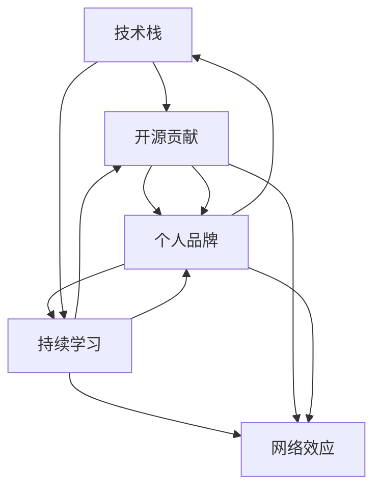

                 

# 程序员如何打造个人影响力

在当今信息爆炸的时代，技术日新月异，程序员如何在这个信息潮流中建立并保持个人影响力，成为一个备受关注的话题。本文将系统探讨这一问题，从核心概念、算法原理到实际操作、未来趋势，带你全面了解如何打造并维系个人影响力。

## 1. 背景介绍

### 1.1 问题由来
随着互联网和人工智能技术的发展，程序员的影响力在不断增强。从开源社区到技术博客，从编程论坛到社交媒体，程序员通过分享知识、解决问题，逐渐成为技术社区的中坚力量。然而，如何在这个纷繁复杂的技术生态中脱颖而出，成为有影响力的技术专家，却并非易事。

### 1.2 问题核心关键点
打造个人影响力的关键在于以下几个方面：
1. **专业技能的深度和广度**：持续学习和积累，掌握多门编程语言和技术框架，了解行业动态。
2. **社区贡献和影响力**：积极参与开源项目、技术讨论、技术讲座，帮助他人解决技术难题，建立个人品牌。
3. **个人品牌和网络效应**：创建个人博客、Github、Twitter等平台，分享技术见解，与同行建立联系。
4. **创新思维和持续输出**：不断探索新技术、新方法，通过博客、视频、课程等形式，将知识传递给他人。
5. **个人道德和职业操守**：保持诚信、正直，抵制抄袭、侵权等不正当行为，树立良好职业形象。

## 2. 核心概念与联系

### 2.1 核心概念概述

本节将介绍几个密切相关的核心概念，以帮助我们更好地理解如何打造个人影响力：

- **技术栈**：指一个程序员掌握的技术工具、编程语言、框架和库等。
- **开源贡献**：指程序员通过贡献代码、编写文档、参与社区讨论等方式，对开源项目做出贡献的行为。
- **个人品牌**：程序员通过技术博客、社交媒体、技术讲座等渠道，建立并推广自己的技术形象和声誉。
- **持续学习**：程序员通过阅读技术书籍、参加培训、实践项目等形式，不断更新和扩展自己的技术知识库。
- **网络效应**：随着影响力的提升，个人在社区中的号召力和信任度会进一步增强，形成良性循环。

这些概念之间存在相互促进的关系，通过不断提升技术栈、贡献开源社区、创建个人品牌、持续学习和利用网络效应，个人影响力可以逐步建立和增强。

### 2.2 核心概念原理和架构的 Mermaid 流程图(Mermaid 流程节点中不要有括号、逗号等特殊字符)



这个流程图展示了核心概念之间的关系：通过提升技术栈和持续学习，积极参与开源贡献，建立个人品牌，并通过网络效应不断巩固影响力。

## 3. 核心算法原理 & 具体操作步骤
### 3.1 算法原理概述

打造个人影响力的过程，可以视为一个动态的反馈系统。在这个系统中，程序员通过不断的学习、实践和分享，逐渐建立起自己在技术社区中的声誉和影响力。

### 3.2 算法步骤详解

#### 3.2.1 技术栈提升

1. **目标设定**：根据自身职业规划，选择相关领域的技术栈，如Web开发、人工智能、区块链等。
2. **学习资源选择**：选择高质量的在线课程、书籍、博客、论坛等学习资源，如Coursera、edX、Stack Overflow、GitHub等。
3. **系统学习**：按照课程或书籍的体系进行系统学习，逐步掌握基础知识和高级技巧。
4. **实践项目**：通过实践项目，将所学知识应用于实际开发中，加深理解。
5. **反思总结**：定期反思学习进展，总结经验教训，调整学习策略。

#### 3.2.2 开源贡献

1. **选择合适的项目**：选择与自己技术栈和兴趣相关的开源项目，如TensorFlow、React等。
2. **阅读文档和代码**：理解项目的架构和技术细节，熟悉代码风格和规范。
3. **提交代码**：查找感兴趣的问题，提交高质量的代码，并通过代码审查。
4. **编写文档**：编写项目文档、API文档等，提升项目可维护性。
5. **参与讨论**：在项目讨论区活跃，解答其他开发者的疑问，提升社区影响力。

#### 3.2.3 个人品牌创建

1. **选择平台**：创建或选择适合自己的个人品牌平台，如博客、Github、Twitter等。
2. **内容创作**：定期发布技术文章、项目总结、学习心得等内容，分享专业知识。
3. **互动交流**：积极回复评论、参与讨论，与同行建立联系，拓展人脉。
4. **建立联系**：参与技术讲座、技术会议，与技术大咖建立联系，获取更多学习资源。
5. **持续改进**：根据反馈和互动，不断优化个人品牌形象和内容质量。

### 3.3 算法优缺点

**优点**：
1. **提升技能**：通过持续学习和实践，不断提升技术水平。
2. **扩展人脉**：通过开源贡献和个人品牌建设，扩大社交圈，获取更多资源。
3. **增强影响力**：通过分享知识和解决问题，建立专业声誉。
4. **实现自我价值**：在技术社区中树立个人品牌，实现职业成长。

**缺点**：
1. **时间成本高**：需要大量时间和精力投入学习和实践。
2. **知识更新快**：技术变化迅速，需要不断更新知识和技能。
3. **信息过载**：海量信息和资源容易让人分心，难以专注。
4. **网络安全风险**：在社交平台分享时，需要注意隐私和安全问题。

### 3.4 算法应用领域

个人影响力的打造和维护，适用于各个技术领域和职业阶段。无论是初入职场的新手程序员，还是资深技术专家，都可以通过以下方式提升自身影响力：

- **技术博客**：通过撰写技术博客，分享编程经验和技术见解，建立个人品牌。
- **Github**：在Github上发布开源项目和代码，积极参与社区讨论，积累技术贡献。
- **技术讲座**：参加或组织技术讲座和研讨会，与同行交流学习，提升专业声誉。
- **社交媒体**：在LinkedIn、Twitter等社交媒体上活跃，分享技术心得，建立职业网络。
- **技术会议**：参加技术会议和Hackathon，展示项目成果，与行业大咖交流。

## 4. 数学模型和公式 & 详细讲解 & 举例说明

### 4.1 数学模型构建

本文的数学模型将围绕个人影响力的提升进行构建，假设程序员的技术栈和影响力可以用 $I$ 表示，其提升过程可以表示为一个动态系统，其中 $\dot{I} = f(I)$，其中 $f$ 表示影响力提升的函数。

### 4.2 公式推导过程

根据个人影响力的提升机制，可以推导出以下模型：

$$
\dot{I} = \alpha (K - I) - \beta I
$$

其中 $\alpha$ 表示学习效率，$K$ 表示知识上限，$I$ 表示当前影响力，$\beta$ 表示影响力衰减系数。

根据模型，可以看出，当 $I < K$ 时，影响力上升，反之则下降。因此，要提升影响力，需要不断学习新知识，同时保持高频率的贡献和互动。

### 4.3 案例分析与讲解

以GitHub上的技术博客为例，分析其影响力提升的机制：

1. **初始状态**：程序员通过Github创建一个个人仓库，开始撰写技术博客。
2. **学习输入**：程序员不断阅读高质量的博客、书籍、文档等，更新知识库。
3. **影响力提升**：每篇博客发布后，根据阅读量、评论量、引用量等指标，提升其影响力。
4. **反馈调整**：根据反馈和互动，调整博客内容，吸引更多关注。
5. **影响力衰减**：如果不定期更新内容，影响力将逐渐下降。

通过模型分析，可以看出，定期更新和互动是保持影响力的关键。

## 5. 项目实践：代码实例和详细解释说明
### 5.1 开发环境搭建

要开展个人品牌建设，首先需要搭建一个适合技术分享和互动的平台。以下是一份基本的开发环境配置流程：

1. **选择平台**：选择GitHub、WordPress等平台，创建个人博客或仓库。
2. **域名注册**：注册个人域名，如 `john.doe.blog`。
3. **服务器配置**：配置个人服务器或使用云服务，如AWS、Google Cloud等。
4. **网站部署**：将博客或仓库部署到服务器上，确保可访问。
5. **安全配置**：配置SSL证书，保护网站安全。

### 5.2 源代码详细实现

以下是一个简化的技术博客平台搭建流程，包括博客创建、内容发布和互动功能的实现：

1. **博客创建**：
```python
# 使用Python Flask框架创建博客平台
from flask import Flask, render_template, request

app = Flask(__name__)

@app.route('/')
def index():
    return render_template('index.html')

@app.route('/post', methods=['GET', 'POST'])
def post():
    if request.method == 'POST':
        # 处理内容发布逻辑
        pass
    return render_template('post.html')

if __name__ == '__main__':
    app.run(debug=True)
```

2. **内容发布**：
```python
# 使用Markdown格式发布博客内容
class Post:
    def __init__(self, title, content):
        self.title = title
        self.content = content

# 保存博客内容到数据库
def save_post(post):
    # 数据库保存逻辑
    pass

# 显示博客列表
def show_posts():
    # 数据库查询逻辑
    pass
```

3. **互动功能**：
```python
# 添加评论功能
class Comment:
    def __init__(self, content, author):
        self.content = content
        self.author = author

# 保存评论到数据库
def save_comment(comment):
    # 数据库保存逻辑
    pass

# 显示评论列表
def show_comments():
    # 数据库查询逻辑
    pass
```

### 5.3 代码解读与分析

通过上述代码，可以看到一个基本的博客平台的搭建流程：

1. **Flask框架**：使用Flask框架创建Web应用，提供前后端分离的开发体验。
2. **Markdown格式**：使用Markdown格式发布博客内容，提高可读性和易用性。
3. **数据库存储**：将博客和评论数据存储到数据库中，提高数据访问效率。
4. **互动功能**：添加评论功能，增强用户互动，提升平台粘性。

## 6. 实际应用场景

### 6.1 开源项目贡献

开源项目是程序员展示技术实力的重要平台。通过参与开源项目，程序员不仅能够提升自身技能，还能在社区中获得认可和声誉。

- **GitHub**：选择感兴趣的开源项目，提交高质量的代码和文档。
- **Bug修复**：修复项目中的Bug，提升代码质量。
- **功能开发**：添加新功能，扩展项目能力。
- **社区互动**：积极参与社区讨论，解答开发者疑问，建立技术声誉。

### 6.2 技术讲座和研讨会

技术讲座和研讨会是程序员分享知识、展示才华的重要途径。通过参与这些活动，程序员可以提升自身影响力，同时获取更多学习资源。

- **主题选择**：选择感兴趣的技术主题，如机器学习、人工智能、区块链等。
- **内容准备**：准备详细的讲稿和演示，确保内容质量。
- **互动交流**：与听众互动，解答问题，获取反馈。
- **后续跟进**：将讲座内容整理成博客、视频等形式，扩大影响范围。

### 6.3 技术博客和文章

技术博客和文章是程序员建立个人品牌的重要手段。通过定期发布高质量的技术文章，程序员可以吸引更多关注，建立专业声誉。

- **内容选题**：选择感兴趣的技术话题，如最新技术趋势、编程技巧、项目总结等。
- **写作风格**：保持文章风格一致，易于阅读和理解。
- **互动回复**：积极回复评论和留言，建立互动关系。
- **推广分享**：通过社交媒体和邮件列表，推广技术博客，扩大读者群体。

## 7. 工具和资源推荐
### 7.1 学习资源推荐

要全面提升技术栈和影响力，推荐以下学习资源：

1. **在线课程**：Coursera、edX、Udacity等平台提供大量高质量的在线课程。
2. **书籍和文档**：选择经典技术书籍，如《代码大全》、《深度学习》、《Clean Code》等，掌握基础知识。
3. **博客和社区**：Stack Overflow、GitHub、Medium等平台，提供丰富的技术文章和讨论。
4. **技术会议**：参加如Google I/O、AWS re:Invent、Microsoft Build等技术会议，获取最新行业动态。
5. **技术讲座**：参加技术讲座和研讨会，如Meetup、TechMeetup等，扩展人脉。

### 7.2 开发工具推荐

技术影响力的打造离不开合适的开发工具。以下是一些推荐的开发工具：

1. **IDE**：Visual Studio Code、IntelliJ IDEA等，提供丰富的代码编辑和调试功能。
2. **版本控制**：Git、SVN等，确保代码协作和版本管理。
3. **文档工具**：Markdown、LaTeX等，用于撰写技术文章和文档。
4. **云服务**：AWS、Google Cloud等，提供高效的云服务和资源管理。
5. **协作平台**：Slack、Microsoft Teams等，方便团队协作和交流。

### 7.3 相关论文推荐

技术影响力的打造也需要理论支持。以下是一些相关论文推荐：

1. **个人品牌构建**："Personal Branding in the Digital Age: Strategies for Success"，Linda Banting, Sally Copeland。
2. **影响力传播**："The Impact of Technical Blogging on Developer Visibility"，Karen E. Loudon, 2009。
3. **社交网络效应**："Network Effects and the Spread of Information"，David M. Easley, Michael Kearns。
4. **知识共享**："Knowledge Sharing: Why Do It? Why Don't We?"，Leif Edwards。
5. **开源贡献**："Collaboration, Participation and Success in Open Source"，Liz Zhao, David N. Krauter。

## 8. 总结：未来发展趋势与挑战
### 8.1 研究成果总结

本文从核心概念、算法原理到操作步骤，全面介绍了程序员如何打造个人影响力。通过技术栈提升、开源贡献、个人品牌建设等方法，程序员可以在技术社区中逐步建立和增强自身影响力。

### 8.2 未来发展趋势

未来的技术影响力打造将面临以下几个发展趋势：

1. **AI驱动**：AI技术将更多地用于影响力提升，如推荐系统、个性化内容生成等。
2. **数据驱动**：通过大数据分析，了解用户需求和行为，优化影响力传播策略。
3. **社区互动**：社交媒体和社区平台将进一步融合，形成更高效的互动环境。
4. **多模态交互**：结合文本、图像、视频等多种信息形式，提升影响力传播效果。
5. **知识图谱**：通过知识图谱技术，整合更多外部知识，增强影响力内容质量。

### 8.3 面临的挑战

虽然技术影响力的打造前景广阔，但仍面临诸多挑战：

1. **技术更新快**：技术变化迅速，需要不断学习新技术，适应新趋势。
2. **信息过载**：海量信息和资源容易让人分心，难以专注。
3. **隐私和安全**：在社交平台分享时，需要注意隐私和安全问题。
4. **网络噪声**：社区中存在大量噪声信息，影响个人品牌的建立。

### 8.4 研究展望

未来的影响力打造研究需要关注以下几个方向：

1. **个性化推荐**：通过推荐系统，帮助程序员发现更多高质量的学习资源和合作机会。
2. **知识图谱融合**：将知识图谱与编程技术相结合，提升影响力内容的质量和深度。
3. **互动模型优化**：优化社区互动模型，增强用户粘性和参与度。
4. **隐私保护技术**：研究隐私保护技术，确保技术分享和互动过程中的数据安全。
5. **情绪分析**：通过情绪分析技术，了解社区反馈，优化个人品牌策略。

## 9. 附录：常见问题与解答

**Q1: 如何平衡技术学习和影响力提升？**

A: 合理分配时间和精力，根据自身职业规划，设定优先级。可以先集中精力提升技术栈，再逐步扩展影响力。同时，两者可以相辅相成，技术提升可以为影响力提供更多内容支持。

**Q2: 如何选择合适的技术分享平台？**

A: 选择与自己技术栈和兴趣相关的平台，如GitHub、Medium、个人博客等。可以参考其他同行和社区推荐，选择适合的平台进行内容分享。

**Q3: 如何应对社交媒体上的负面评论？**

A: 保持积极态度，理性应对负面评论。可以通过私信与评论者沟通，理解其意见，并适时调整个人品牌策略。同时，加强正面内容的发布，建立良好的品牌形象。

**Q4: 如何保持技术博客的持续更新？**

A: 设定固定更新频率，如每周一篇文章。保持内容质量，注重内容深度和实用性。可以通过读者反馈和互动，不断调整和优化内容方向。

通过本文的系统梳理，可以看到，程序员可以通过多种方式逐步建立并增强个人影响力，从而在技术社区中脱颖而出。未来的技术影响力打造，还需要我们持续探索和创新，才能更好地适应技术变革，实现个人职业成长。

---

作者：禅与计算机程序设计艺术 / Zen and the Art of Computer Programming

