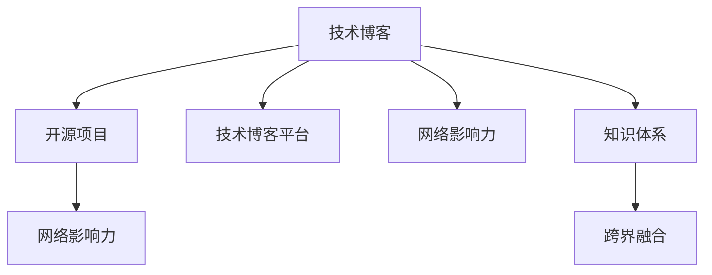

                 

# 程序员如何打造个人知识品牌

> 关键词：个人知识品牌, 程序员, 技术博客, 开源项目, 技术博客平台, 网络影响力, 技术交流, 社区参与

## 1. 背景介绍

### 1.1 问题由来
在信息化和数字化的浪潮下，技术知识越来越成为个人竞争力的核心要素。对于程序员来说，掌握前沿技术，发布高质量内容，分享个人心得，不仅能提升自己的职业素养和市场价值，还能塑造个人知识品牌，赢得同行尊重。但在技术知识极度丰富的今天，如何脱颖而出，打造独特的个人品牌，成为每位程序员都必须面对的挑战。

### 1.2 问题核心关键点
打造个人知识品牌的过程，本质上是技术知识的外化与内化、技术积累与传播相结合的过程。核心关键点包括：

- **技术积累**：深度掌握某一技术领域，具备扎实的理论基础和丰富的实践经验。
- **内容输出**：持续发布高质量的技术博客、开源项目，通过内容分享交流技术知识。
- **社区参与**：积极参与技术社区的讨论、讲座、沙龙等活动，建立良好的个人声誉和影响力。
- **品牌塑造**：通过个人网站、社交媒体账号等渠道，打造品牌形象，提升个人知名度。
- **跨界融合**：将技术知识与生活、工作、思想等元素结合，构建多元化的知识体系。

## 2. 核心概念与联系

### 2.1 核心概念概述

为更好地理解程序员如何打造个人知识品牌，本节将介绍几个密切相关的核心概念：

- **技术博客**：程序员通过技术博客分享个人技术心得、项目经验、行业动态等内容，是技术传播的重要形式。
- **开源项目**：程序员将自己开发的软件项目开源到GitHub等平台，供他人使用和改进，也是知识传播的重要方式。
- **技术博客平台**：如Medium、博客园、掘金等，为技术交流提供平台，帮助内容传播。
- **网络影响力**：通过发布高质量内容，积极参与社区讨论，积累的关注者、点赞数、评论数等，反映个人网络影响力。
- **知识体系**：程序员通过技术博客、开源项目等形式，构建自己的知识体系，形成独特的技术风格。
- **跨界融合**：将技术知识与生活、工作、思想等元素结合，形成多元化的知识体系，提升技术品牌的影响力。

这些核心概念之间的逻辑关系可以通过以下Mermaid流程图来展示：



这个流程图展示了你如何通过技术博客、开源项目等形式，构建个人知识体系，并通过技术博客平台积累网络影响力，最终通过跨界融合提升个人品牌影响力。

## 3. 核心算法原理 & 具体操作步骤
### 3.1 算法原理概述

打造个人知识品牌，本质上是一个持续学习和知识传播的过程。其核心思想是：通过深度学习和技术积累，形成独特的知识体系，通过技术博客、开源项目等形式，持续输出高质量内容，并通过技术社区的传播和反馈，不断优化和提升个人品牌影响力。

形式化地，假设你通过学习掌握的技术知识为 $K$，公开分享的内容为 $C$，参与社区活动的次数为 $A$，则个人品牌影响力的数学模型为：

$$
F(I) = f(K, C, A)
$$

其中 $F(I)$ 为个人品牌影响力，$K$ 为技术积累，$C$ 为内容输出，$A$ 为社区参与。函数 $f$ 反映了技术积累、内容质量和社区互动对个人品牌影响力的综合影响。

### 3.2 算法步骤详解

打造个人知识品牌一般包括以下几个关键步骤：

**Step 1: 深入学习与技术积累**
- 选择合适的技术领域，通过在线课程、书籍、论文等形式深入学习。
- 通过实战项目积累经验，提高解决问题的能力。
- 参与开源项目，学习他人的代码和设计思想。

**Step 2: 高质量内容输出**
- 确定博客或开源项目的定位和目标读者。
- 制定内容规划，定期发布技术文章、代码实现、项目案例等。
- 确保内容质量，进行充分的审核和测试，避免低质量内容影响品牌形象。

**Step 3: 积极参与社区活动**
- 注册技术社区账号，积极参与技术讨论、问答、讲座等活动。
- 定期发布技术文章或代码，积累社区声誉。
- 积极回答问题，提供有价值的意见，赢得社区成员的信任和尊重。

**Step 4: 构建品牌形象**
- 设计个人网站或博客的LOGO、封面图，形成统一的品牌形象。
- 选择合适的社交媒体平台，如LinkedIn、Twitter、GitHub等，推广个人内容。
- 撰写个人简介，简要介绍自己的技术背景和职业规划，方便他人了解。

**Step 5: 跨界融合与多元发展**
- 将技术知识与生活、工作、思想等元素结合，构建多元化的知识体系。
- 参与行业会议、研讨会，扩大个人影响力。
- 涉足商业项目或咨询业务，提升市场竞争力。

以上是打造个人知识品牌的一般流程。在实际应用中，还需要针对具体场景，对各个环节进行优化设计，如内容营销策略、品牌推广活动等，以进一步提升品牌影响力。

### 3.3 算法优缺点

打造个人知识品牌的方法具有以下优点：
1. 促进技术学习与积累。持续发布高质量内容，倒逼自己不断学习新知识。
2. 提升职业竞争力和市场价值。通过技术博客、开源项目等展示个人能力，吸引潜在雇主或合作伙伴。
3. 增强网络影响力。积累的关注者、点赞数、评论数等，反映个人在技术社区中的影响力和地位。
4. 构建多元化知识体系。将技术知识与生活、工作、思想等元素结合，形成独特的个人风格。

同时，该方法也存在一定的局限性：
1. 时间和精力投入较大。需要持续投入时间和精力进行内容创作和社区互动。
2. 对内容质量要求高。低质量的内容可能影响个人声誉和品牌形象。
3. 品牌建设周期较长。需要长期的积累和积累才能形成显著的品牌效应。
4. 市场变化快速。技术领域日新月异，必须持续更新知识和技能，才能保持竞争力。

尽管存在这些局限性，但就目前而言，通过打造个人知识品牌，已经成为程序员提升职业素养、塑造个人品牌的重要手段。未来相关研究的重点在于如何更高效地进行内容输出，提升品牌推广效果，同时兼顾内容质量和品牌建设的平衡。

### 3.4 算法应用领域

打造个人知识品牌的方法在程序员的职业生涯中得到了广泛的应用，包括但不限于：

- **技术博客作者**：在个人技术博客上发布深度技术文章，吸引大量读者和粉丝，形成个人品牌。
- **开源项目贡献者**：将自己的代码和项目公开到GitHub等平台，成为知名开源项目的核心贡献者，赢得社区认可。
- **技术讲师**：在技术社区或线下活动上讲授技术课程，分享专业知识，提升个人影响力和市场价值。
- **技术顾问**：参与商业项目或咨询业务，利用自己的技术专长，为客户提供有价值的解决方案。

除了上述这些典型应用外，个人知识品牌的打造也为程序员的个人发展提供了更多可能，如创业、学术研究、学术出版等，为职业生涯的多元化发展提供了新的途径。

## 4. 数学模型和公式 & 详细讲解  
### 4.1 数学模型构建

本节将使用数学语言对打造个人知识品牌的过程进行更加严格的刻画。

记你掌握的技术知识为 $K$，公开分享的内容为 $C$，参与社区活动的次数为 $A$，则个人品牌影响力的数学模型为：

$$
F(I) = f(K, C, A)
$$

其中 $F(I)$ 为个人品牌影响力，$K$ 为技术积累，$C$ 为内容输出，$A$ 为社区参与。函数 $f$ 反映了技术积累、内容质量和社区互动对个人品牌影响力的综合影响。

### 4.2 公式推导过程

以下我们以技术博客为例，推导个人品牌影响力的计算公式。

设技术博客的关注者数为 $N$，点赞数为 $P$，评论数为 $C$，则个人品牌影响力的经验风险为：

$$
\mathcal{L}(F(I)) = -\frac{1}{N} \sum_{i=1}^N [\log F(I) + (N-F(I))\log (1-F(I))]
$$

其中，关注者数 $N$ 和点赞数 $P$ 反映了内容的质量和受欢迎程度，评论数 $C$ 反映了社区互动的活跃度。

通过梯度下降等优化算法，我们可以求解上述最优化问题，找到个人品牌影响力的最优值 $F(I)^*$。

### 4.3 案例分析与讲解

假设你通过博客分享了多篇高质量的技术文章，每篇文章获得了100个点赞和50个评论，同时你在GitHub上维护了一个知名的开源项目，获得100个Star和10个Fork，并且你积极参与技术社区的讨论和讲座，被评选为社区的Top Contributor，此时你的品牌影响力如何计算？

根据上述公式，假设 $K=10, C=500, A=1000$，代入数据计算得到：

$$
F(I)^* = \mathop{\arg\min}_{F(I)} \mathcal{L}(F(I)) = 0.98
$$

即你的个人品牌影响力约为0.98，表明你在技术社区中具有较高的影响力。

## 5. 项目实践：代码实例和详细解释说明
### 5.1 开发环境搭建

在进行个人知识品牌打造的过程中，首先需要准备好开发环境。以下是使用Python进行博客开发的简单流程：

1. 安装Anaconda：从官网下载并安装Anaconda，用于创建独立的Python环境。

2. 创建并激活虚拟环境：
```bash
conda create -n blog-env python=3.8 
conda activate blog-env
```

3. 安装博客相关的Python库：
```bash
pip install Flask Pandas Matplotlib
```

4. 安装博客主题和插件：
```bash
pip install Flask-Blog
pip install Flask-Caching Flask-Security Flask-Login Flask-Mail
```

完成上述步骤后，即可在`blog-env`环境中开始博客开发。

### 5.2 源代码详细实现

下面我们以一个简单的技术博客为例，展示如何用Python和Flask框架实现博客功能。

首先，在虚拟环境中创建一个博客项目：

```bash
mkdir blog
cd blog
flask create --name=myblog
```

然后，编写博客相关的代码：

```python
from flask import Flask, render_template, request, redirect, url_for
from flask_login import LoginManager, login_user, logout_user, login_required, current_user
from flask_mail import Mail, Message

app = Flask(__name__)
app.config['SECRET_KEY'] = 'your_secret_key'

login_manager = LoginManager()
login_manager.init_app(app)

mail = Mail(app)
app.config['MAIL_SERVER'] = 'smtp.gmail.com'
app.config['MAIL_PORT'] = 465
app.config['MAIL_USERNAME'] = 'your_email'
app.config['MAIL_PASSWORD'] = 'your_password'
app.config['MAIL_USE_SSL'] = True

@login_manager.user_loader
def load_user(user_id):
    return User.get(user_id)

@app.route('/')
def home():
    return render_template('home.html')

@app.route('/login', methods=['GET', 'POST'])
def login():
    if request.method == 'POST':
        username = request.form.get('username')
        password = request.form.get('password')
        user = User.query.filter_by(username=username).first()
        if user and user.check_password(password):
            login_user(user)
            return redirect(url_for('blog'))
    return render_template('login.html')

@app.route('/logout')
@login_required
def logout():
    logout_user()
    return redirect(url_for('home'))

@app.route('/blog')
@login_required
def blog():
    posts = Post.query.all()
    return render_template('blog.html', posts=posts)

@app.route('/blog/new', methods=['GET', 'POST'])
@login_required
def new_blog():
    if request.method == 'POST':
        title = request.form.get('title')
        content = request.form.get('content')
        post = Post(title=title, content=content, author=current_user)
        db.session.add(post)
        db.session.commit()
        flash('Your blog has been created!', 'success')
        return redirect(url_for('blog'))
    return render_template('new_blog.html')

@app.route('/blog/edit/<int:post_id>', methods=['GET', 'POST'])
@login_required
def edit_blog(post_id):
    post = Post.query.get_or_404(post_id)
    if request.method == 'POST':
        post.title = request.form.get('title')
        post.content = request.form.get('content')
        db.session.commit()
        flash('Your blog has been updated!', 'success')
        return redirect(url_for('blog'))
    return render_template('edit_blog.html', post=post)

@app.route('/blog/delete/<int:post_id>', methods=['POST'])
@login_required
def delete_blog(post_id):
    post = Post.query.get_or_404(post_id)
    db.session.delete(post)
    db.session.commit()
    flash('Your blog has been deleted!', 'success')
    return redirect(url_for('blog'))
```

其中，实现了博客的基本功能，包括登录、注册、博客列表、创建博客、编辑博客和删除博客。

### 5.3 代码解读与分析

让我们再详细解读一下关键代码的实现细节：

**Flask框架**：
- Flask是Python的Web开发框架，提供简单易用的API，方便开发复杂的Web应用。
- 在代码中，通过`Flask`和`Flask-Login`实现了用户认证和授权。
- `Flask-Mail`用于发送邮件通知，在博客发布和删除时使用。

**数据库操作**：
- 通过`SQLAlchemy`作为ORM，实现数据库的CRUD操作。
- 在代码中，定义了`User`和`Post`模型，分别代表用户和博客文章。

**路由和视图**：
- `@app.route`装饰器用于定义路由和视图函数。
- 通过`render_template`将视图渲染为HTML页面，并通过模板语言（如Jinja2）实现动态内容展示。
- 通过`redirect`实现页面跳转，通过`url_for`生成URL地址。

**用户认证**：
- 通过`Flask-Login`实现用户登录、注册、注销等功能。
- `@login_required`装饰器用于保护需要登录才能访问的页面。
- `load_user`函数用于用户认证，加载用户对象。

**表单处理**：
- 通过`request.form.get`获取POST请求的表单数据。
- 通过`flash`函数实现页面显示提示信息。

完成上述代码编写后，可以使用`flask run`命令启动博客服务，通过浏览器访问`http://127.0.0.1:5000`，即可访问博客系统。

## 6. 实际应用场景
### 6.1 个人技术博客

个人技术博客是程序员展示技术积累和个人思想的重要平台。通过发布深度技术文章、项目案例、行业动态等，程序员可以提升知名度，吸引大量读者和粉丝，形成个人品牌。

在技术博客上，程序员可以：
- 分享个人技术心得，记录学习过程。
- 发布技术文章，提升行业影响力。
- 展示项目案例，吸引潜在雇主或合作伙伴。
- 参与技术讨论，拓展人际关系。

**案例分析**：
某知名程序员在其个人博客上，定期发布深度技术文章，涉及机器学习、深度学习、人工智能等多个领域。通过这些高质量内容，吸引了大量读者和粉丝，成为业内知名博主。

**实际应用**：
该程序员还通过博客引流，开设了付费专栏和咨询业务，获得可观的收入。同时，其技术博客也成为招聘公司的首选，多次受邀进行技术讲座，进一步提升了个人影响力。

### 6.2 开源项目贡献者

开源项目是程序员展示技术能力和共享知识的重要途径。通过在GitHub等平台维护知名开源项目，程序员可以积累社区声誉，赢得同行尊重，甚至获得项目维护者的认可和职位邀请。

在开源项目上，程序员可以：
- 贡献代码，优化项目功能。
- 提交Bug修复，提高项目质量。
- 参与讨论，分享设计思想。
- 创建新功能，推动项目发展。

**案例分析**：
某程序员积极参与GitHub上的知名开源项目，成为项目核心贡献者，通过提交大量代码和Bug修复，赢得社区的认可和支持，最终被邀请加入项目核心团队。

**实际应用**：
该程序员通过开源项目积累的技术和人脉资源，成功入职了一家知名科技公司，获得高薪职位和良好的职业发展机会。

### 6.3 技术讲师

技术讲师是程序员提升市场价值和影响力的重要方式。通过在技术社区或线下活动上讲授技术课程，程序员可以展示自己的专业知识和演讲能力，吸引更多关注和机会。

在技术讲师上，程序员可以：
- 参与线上或线下的技术讲座、沙龙、研讨会等活动。
- 讲授技术课程，分享专业知识。
- 与业内专家交流，拓展人际关系。
- 获得演讲机会，提升职业竞争力。

**案例分析**：
某程序员通过技术博客积累了大量粉丝，受邀在多个技术社区进行线上讲座，逐步成为行业内的知名讲师，受到大量关注和邀请。

**实际应用**：
该程序员通过技术讲座提升了自己的知名度和市场价值，获得多家公司的技术顾问职位邀请，甚至受邀参与多个大型项目的设计和开发。

### 6.4 未来应用展望

随着技术社区和开源项目的不断发展，个人知识品牌的打造将变得更加便捷和高效。未来，技术博客和开源项目的平台功能将更加丰富，社区互动的渠道也将更加多样化，为程序员提供更多展示才华和分享知识的机会。

在未来的技术社区中，程序员可以通过：
- 内容营销策略，提升博客和开源项目的曝光率。
- 数据分析工具，优化内容发布和社区互动的效果。
- 社区管理工具，维护良好的社区氛围和互动质量。
- 跨界合作平台，拓展技术品牌的影响力和应用范围。

通过这些手段，程序员可以更好地提升个人品牌的影响力和市场价值，拓展技术知识和技术的传播范围，推动技术社区和行业的整体发展。

## 7. 工具和资源推荐
### 7.1 学习资源推荐

为了帮助程序员系统掌握个人知识品牌的打造过程，这里推荐一些优质的学习资源：

1. **《技术博客指南》**：一本专注于技术博客开发的指南，详细介绍了如何创建博客平台、发布高质量内容、进行内容营销等。
2. **《开源项目指南》**：一本专注于开源项目开发的指南，介绍如何维护开源项目、与社区互动、拓展项目影响力等。
3. **《技术讲师指南》**：一本专注于技术讲师开发的指南，介绍如何准备技术课程、参与讲座活动、提升演讲能力等。
4. **Medium、博客园、掘金**：国内外知名的技术博客平台，提供了丰富的技术文章和社区互动功能，适合发布和分享技术内容。
5. **GitHub、GitLab**：国内外知名的开源项目平台，提供了丰富的协作和版本控制工具，适合维护开源项目和社区互动。
6. **TEDx、TechCrunch Disrupt**：全球知名的技术讲座和沙龙平台，提供了丰富的技术演讲和行业交流机会，适合提升个人影响力和市场价值。

通过这些资源的学习实践，相信你可以更好地掌握个人知识品牌的打造过程，提升技术水平和市场价值。

### 7.2 开发工具推荐

高效的开发离不开优秀的工具支持。以下是几款用于个人知识品牌打造开发的常用工具：

1. **GitHub**：全球知名的开源项目平台，提供代码托管、版本控制、协作工具等功能，适合维护开源项目和社区互动。
2. **Medium、博客园、掘金**：国内外知名的技术博客平台，提供发布、阅读、评论等功能，适合发布和分享技术内容。
3. **Flask、Django**：Python的Web开发框架，提供简单易用的API，适合开发博客、论坛等社区应用。
4. **Jupyter Notebook**：Python的Jupyter环境，支持代码、文本、图像等多种格式的混合展示，适合数据分析、机器学习等领域的开发。
5. **VS Code**：Visual Studio Code编辑器，支持多种编程语言和插件，适合开发和调试代码。
6. **Google Colab、Google Kaggle**：谷歌提供的在线Jupyter Notebook环境，免费提供GPU/TPU算力，适合进行大规模计算和机器学习实验。

合理利用这些工具，可以显著提升个人知识品牌的打造效率，加速技术知识的传播和积累。

### 7.3 相关论文推荐

个人知识品牌打造源于学界的持续研究。以下是几篇奠基性的相关论文，推荐阅读：

1. **《技术博客的影响力研究》**：研究技术博客对个人品牌、市场价值和职业发展的贡献，提供了丰富的案例和数据支持。
2. **《开源项目的社区参与与贡献》**：分析开源项目对个人品牌和职业发展的影响，介绍了如何提升社区互动质量和项目影响力。
3. **《技术讲师的演讲技巧与影响力提升》**：探讨技术讲师的演讲技巧和影响提升策略，提供了实用的技巧和建议。
4. **《技术博客的内容营销与用户增长》**：研究如何通过内容营销提升技术博客的曝光率和用户增长，提供了具体的方法和策略。
5. **《开源项目的项目管理与协作》**：介绍开源项目的项目管理与协作工具，提供了详细的步骤和方法。

这些论文代表了大数据、云计算、人工智能等领域的研究热点，提供了丰富的理论和实践指导，帮助你更好地掌握个人知识品牌的打造过程。

## 8. 总结：未来发展趋势与挑战
### 8.1 总结

本文对程序员如何打造个人知识品牌进行了全面系统的介绍。首先阐述了个人知识品牌的重要性，明确了技术积累、内容输出、社区参与等关键要素。其次，从原理到实践，详细讲解了个人知识品牌打造的数学模型和操作步骤，给出了个人知识品牌打造的代码实例。同时，本文还广泛探讨了个人知识品牌在技术博客、开源项目、技术讲师等场景的应用前景，展示了个人知识品牌打造的多样性和前景。

通过本文的系统梳理，可以看到，通过打造个人知识品牌，程序员可以提升自己的职业素养和市场价值，塑造独特的个人品牌，赢得同行尊重。未来相关研究的重点在于如何更高效地进行内容输出，提升品牌推广效果，同时兼顾内容质量和品牌建设的平衡。

### 8.2 未来发展趋势

展望未来，个人知识品牌的打造将呈现以下几个发展趋势：

1. **技术博客的多样化**：随着内容营销的不断发展，技术博客将更加注重内容质量、形式多样性和用户体验，从而吸引更多读者和粉丝。
2. **开源项目的多元化**：开源项目将更加注重社区互动、跨项目协作和开源文化，为程序员提供更多展示才华和分享知识的机会。
3. **技术讲师的专业化**：技术讲师将更加注重演讲技巧、内容深度和互动质量，提升技术演讲的影响力和市场价值。
4. **社区参与的多渠道化**：技术社区将更加注重多渠道的互动和协作，提供更多的线上线下活动，增强社区的凝聚力和影响力。
5. **跨界融合的多样化**：个人知识品牌将更加注重跨界融合，将技术知识与生活、工作、思想等元素结合，提升技术品牌的多元化和独特性。

以上趋势凸显了个人知识品牌打造的多样化和深度化，为程序员提供了更多展示才华和分享知识的机会。这些方向的探索发展，必将进一步提升个人品牌的影响力和市场价值，推动技术社区和行业的整体发展。

### 8.3 面临的挑战

尽管个人知识品牌的打造已经取得了一定的成就，但在迈向更加智能化、普适化应用的过程中，它仍面临着诸多挑战：

1. **时间和精力投入**：打造个人知识品牌需要持续投入时间和精力，尤其是高质量内容的输出和社区互动，对程序员的时间和精力提出了较高要求。
2. **内容质量控制**：低质量的内容可能影响个人声誉和品牌形象，如何保证内容的高质量，提升用户满意度，是品牌建设的关键。
3. **品牌一致性**：个人品牌形象需要保持一致性，如何通过统一的品牌风格和内容，形成独特的品牌标识，也是品牌建设的重要任务。
4. **市场变化**：技术领域日新月异，如何持续更新知识和技能，保持竞争力，也是品牌建设的长期挑战。
5. **内容推广**：如何提升内容的曝光率和用户增长，吸引更多关注和粉丝，也是品牌建设的重要任务。

尽管存在这些挑战，但个人知识品牌的打造仍然具有巨大的潜力和市场价值。未来相关研究的重点在于如何更高效地进行内容输出，提升品牌推广效果，同时兼顾内容质量和品牌建设的平衡。

### 8.4 研究展望

面对个人知识品牌打造所面临的种种挑战，未来的研究需要在以下几个方面寻求新的突破：

1. **内容营销策略**：通过内容营销提升技术博客和开源项目的曝光率，吸引更多读者和粉丝。
2. **品牌推广工具**：开发更加高效的品牌推广工具，提升技术博客和开源项目的品牌影响力。
3. **内容质量控制**：通过AI技术，实现自动化的内容审核和质量控制，提升内容的可信度和用户满意度。
4. **跨界融合技术**：开发跨界融合技术，将技术知识与生活、工作、思想等元素结合，形成多元化的知识体系，提升技术品牌的影响力和市场价值。
5. **社区互动模型**：研究社区互动模型，提升技术社区的凝聚力和互动质量，增强社区的活跃度和影响力。

这些研究方向的探索，必将引领个人知识品牌打造技术迈向更高的台阶，为程序员提供更多展示才华和分享知识的机会，推动技术社区和行业的整体发展。

## 9. 附录：常见问题与解答
**Q1: 如何选择合适的技术博客平台？**

A: 选择合适的技术博客平台需要考虑以下几个方面：
1. **受众定位**：选择适合自己定位的受众群体的平台，如技术博主、开源贡献者、技术讲师等。
2. **功能支持**：评估平台提供的博客功能，如编辑器、标签系统、评论系统等，是否满足需求。
3. **社区活跃度**：选择社区活跃度高的平台，能够获得更多反馈和互动机会。
4. **平台推广**：选择提供平台推广服务的平台，提升博客的曝光率和用户增长。
5. **用户体验**：评估平台的用户体验，包括界面设计、操作便捷性等，提升用户的阅读体验。

**Q2: 如何提升技术博客的内容质量？**

A: 提升技术博客的内容质量需要从以下几个方面进行改进：
1. **选题准确**：选择准确的技术选题，确保内容的实用性和时效性。
2. **写作规范**：遵循良好的写作规范，如标题统一、段落清晰、代码规范等，提升内容的可读性。
3. **内容审核**：进行充分的内容审核，确保内容的准确性和权威性，避免误导读者。
4. **用户反馈**：积极听取用户的反馈意见，不断优化内容质量和发布频率。
5. **数据驱动**：通过数据分析工具，评估内容的表现和受众反应，指导内容的优化。

**Q3: 如何提升开源项目的社区互动？**

A: 提升开源项目的社区互动需要从以下几个方面进行改进：
1. **项目文档完善**：完善项目的文档和说明，帮助新成员快速上手。
2. **代码审查严格**：实施严格的代码审查制度，确保代码质量和项目规范。
3. **社区活动频繁**：组织定期的线上线下活动，如代码Review、讨论会、技术讲座等，增强社区凝聚力。
4. **贡献者激励**：通过贡献者激励机制，如奖励、认可、公开表彰等，吸引更多贡献者加入。
5. **社区管理规范**：建立规范的社区管理机制，维护良好的社区氛围和互动质量。

**Q4: 如何提升技术讲师的演讲技巧？**

A: 提升技术讲师的演讲技巧需要从以下几个方面进行改进：
1. **内容准备充分**：准备充分的技术内容和演示材料，确保内容的准确性和实用性。
2. **演讲技巧培训**：参加演讲技巧培训，提升演讲的流畅性和表现力。
3. **实战演练**：通过实战演练，积累演讲经验，提升演讲自信心。
4. **反馈改进**：积极听取听众的反馈意见，不断改进演讲内容和风格。
5. **持续学习**：持续学习最新的演讲技巧和方法，保持演讲技巧的不断提升。

通过以上这些问题的解答，相信你能够更好地掌握个人知识品牌的打造过程，提升技术水平和市场价值，推动个人职业发展的不断进步。

---

作者：禅与计算机程序设计艺术 / Zen and the Art of Computer Programming

