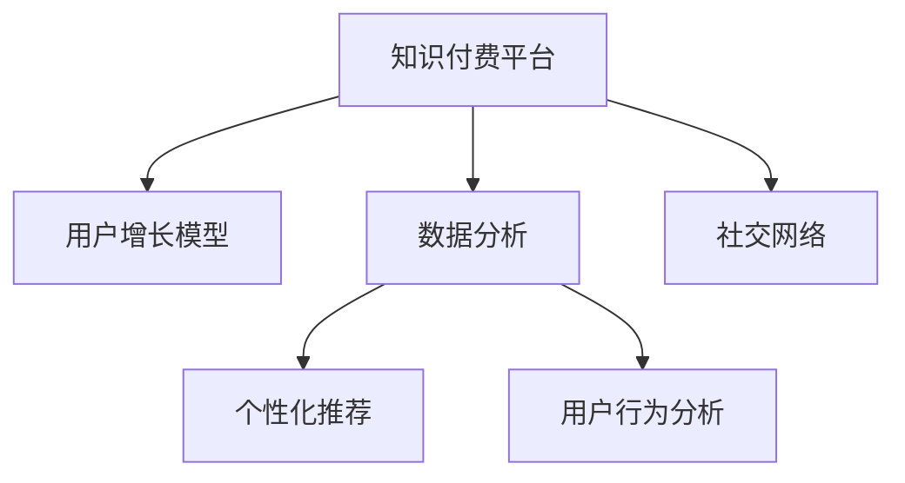

                 

# 程序员如何打造忠实的知识付费用户群

> 关键词：知识付费, 用户增长, 数据分析, 推荐系统, 用户体验, 社交网络

## 1. 背景介绍

随着互联网和移动技术的发展，知识付费行业迎来了爆发式的增长。从罗辑思维、得到、喜马拉雅等平台的兴起，再到知识类App、在线课程、音频书等形式的多样化，知识付费成为了一种全新的互联网内容消费方式。然而，知识付费市场鱼龙混杂，用户流失率高、复购率低的问题一直困扰着各大平台。如何打造忠实的用户群，提升平台的用户留存和消费，成为了当前知识付费行业亟待解决的关键问题。

本文将从程序员的视角出发，分析知识付费平台用户增长和留存的常见策略，并结合数据科学和机器学习技术，提出一套系统化、科学化的解决方案。我们将详细探讨用户增长模型、数据分析、个性化推荐、用户行为分析、社交网络等方面的核心问题，为知识付费平台的运营管理者提供一套可行的实践指南。

## 2. 核心概念与联系

### 2.1 核心概念概述

在打造知识付费用户群的过程中，涉及多个关键概念，这些概念之间相互联系，构成了一个完整的生态系统。

- **知识付费平台**：提供知识内容，并通过订阅、单次付费等方式获得收入的在线平台。
- **用户增长模型**：通过定量分析，预测用户行为，指导产品改进，优化用户体验。
- **数据分析**：通过收集和分析用户数据，挖掘用户行为特征，发现用户增长瓶颈，指导产品优化。
- **个性化推荐**：根据用户的历史行为和兴趣，推荐符合其需求的内容，提升用户粘性。
- **用户行为分析**：分析用户在平台上的行为模式，理解用户需求，优化产品功能。
- **社交网络**：通过用户之间的社交互动，提升平台粘性，增加用户留存。

这些概念之间的关系可以用以下Mermaid流程图来展示：



### 2.2 核心概念原理和架构的 Mermaid 流程图

以下是一个简化的知识付费平台生态系统架构图，展示了不同组件之间的工作流程：

```mermaid
graph TB
    A[用户增长模型]
    B[数据分析]
    C[个性化推荐]
    D[用户行为分析]
    E[社交网络]
    F[知识内容]
    G[广告系统]
    
    A -- 预测用户行为 --> B -- 数据分析 --> C -- 个性化推荐 --> F -- 知识内容
    A -- 预测用户行为 --> D -- 用户行为分析 --> E -- 社交网络
    A -- 用户行为预测 --> G -- 广告系统
```

这个架构图说明了知识付费平台的不同组件是如何协同工作的：用户增长模型通过预测用户行为来指导产品改进，数据分析提供了用户行为特征的深入洞察，个性化推荐提高了用户粘性，用户行为分析帮助优化产品功能，社交网络增加了用户留存。

## 3. 核心算法原理 & 具体操作步骤

### 3.1 算法原理概述

打造忠实的知识付费用户群，需要一套系统化的策略和模型。本节将详细介绍这些策略和模型的核心算法原理。

- **用户增长模型**：通过定量分析用户数据，预测用户行为，指导产品改进，优化用户体验。
- **数据分析**：收集和分析用户数据，挖掘用户行为特征，发现用户增长瓶颈，指导产品优化。
- **个性化推荐**：根据用户的历史行为和兴趣，推荐符合其需求的内容，提升用户粘性。
- **用户行为分析**：分析用户在平台上的行为模式，理解用户需求，优化产品功能。
- **社交网络**：通过用户之间的社交互动，提升平台粘性，增加用户留存。

### 3.2 算法步骤详解

以下是这些算法步骤的详细介绍：

**Step 1: 用户行为数据的收集与处理**

- 定义关键指标：注册率、激活率、留存率、复购率、转化率等，用于衡量用户行为和平台表现。
- 数据收集：通过平台日志、用户行为记录、第三方数据等渠道，收集用户行为数据。
- 数据清洗：去除异常值和噪声数据，确保数据质量。

**Step 2: 用户增长模型的构建与训练**

- 定义目标：用户留存、消费金额、付费率等。
- 特征工程：提取用户行为特征，如年龄、性别、职业、消费金额等。
- 模型选择：选择合适的机器学习模型，如线性回归、决策树、随机森林、神经网络等。
- 模型训练：使用历史数据对模型进行训练，优化模型参数。

**Step 3: 数据分析与用户行为分析**

- 数据可视化：使用可视化工具如Tableau、PowerBI等，展示用户行为特征。
- 用户细分：根据用户行为特征进行细分，如活跃用户、流失用户、高价值用户等。
- 行为模式分析：通过聚类分析、关联规则分析等方法，挖掘用户行为模式。

**Step 4: 个性化推荐系统的构建**

- 用户画像构建：根据用户行为特征构建用户画像。
- 推荐算法选择：选择适合的推荐算法，如协同过滤、基于内容的推荐、混合推荐等。
- 推荐模型训练：使用用户画像和行为数据训练推荐模型。
- 推荐效果评估：使用A/B测试等方法评估推荐效果，优化推荐策略。

**Step 5: 社交网络的构建与维护**

- 用户社交关系建立：通过社交功能（如好友、评论、分享等）建立用户社交关系。
- 社交互动优化：优化社交互动功能，增加用户互动频率。
- 社交网络维护：定期清理无用数据，保证社交网络的健康。

**Step 6: 持续优化与迭代**

- 数据收集：定期收集用户行为数据，更新用户画像和推荐模型。
- 模型优化：根据新的数据和反馈，优化用户增长模型、推荐系统和社交网络。
- 产品迭代：根据数据分析和用户反馈，迭代优化产品功能。

### 3.3 算法优缺点

打造忠实的知识付费用户群需要多种算法和策略的综合应用，以下是对这些算法和策略的优缺点的总结：

**优点**：
- 数据驱动决策：通过数据分析，可以更加科学地指导产品优化。
- 用户粘性提升：个性化推荐和社交网络功能，可以显著提升用户粘性。
- 用户体验优化：通过用户行为分析，可以不断优化用户体验，提升用户满意度。
- 灵活性高：可以根据不同平台和用户特征，定制化的调整策略。

**缺点**：
- 数据隐私问题：用户行为数据的收集和使用，需要严格遵守数据隐私法规。
- 模型复杂度：多种算法和策略的综合应用，可能导致模型复杂度高，训练成本高。
- 数据质量要求高：数据质量直接影响模型的效果，需要严格的数据清洗和预处理。
- 持续优化需求高：用户行为和需求是动态变化的，需要持续优化和迭代。

### 3.4 算法应用领域

基于数据科学和机器学习技术，知识付费平台可以在多个领域应用这些算法和策略，例如：

- **用户增长**：通过用户增长模型，预测用户行为，指导产品改进，优化用户体验。
- **个性化推荐**：根据用户的历史行为和兴趣，推荐符合其需求的内容，提升用户粘性。
- **数据分析**：收集和分析用户数据，挖掘用户行为特征，发现用户增长瓶颈，指导产品优化。
- **社交网络**：通过用户之间的社交互动，提升平台粘性，增加用户留存。

这些领域的应用将显著提升知识付费平台的用户增长和留存，为用户创造更好的体验，同时为平台带来更多的收入。

## 4. 数学模型和公式 & 详细讲解 & 举例说明

### 4.1 数学模型构建

在打造忠实的知识付费用户群的过程中，涉及多个数学模型，这些模型可以基于数据驱动，通过机器学习算法进行构建和训练。

- **用户增长模型**：通过时间序列分析，预测用户行为，如用户留存率、活跃度等。
- **数据分析模型**：通过聚类分析、关联规则分析等，挖掘用户行为特征。
- **个性化推荐模型**：基于协同过滤、基于内容的推荐等算法，推荐符合用户需求的内容。
- **社交网络模型**：通过图模型表示用户之间的社交关系，分析社交网络特征。

### 4.2 公式推导过程

以下是几个关键模型的公式推导过程：

**用户增长模型**：
$$
\hat{R}(t+1) = \frac{\alpha}{1+\beta(e^{\theta t}-1)}
$$
其中 $\hat{R}(t+1)$ 表示$t+1$时刻的用户留存率，$\alpha$、$\beta$、$\theta$ 为模型参数。

**数据分析模型**：
$$
R(t) = \sum_{i=1}^{n}f_i(t) \times \omega_i
$$
其中 $R(t)$ 表示$t$时刻用户行为，$f_i(t)$ 表示第$i$个特征函数，$\omega_i$ 表示第$i$个特征的权重。

**个性化推荐模型**：
$$
\hat{y} = \max\limits_{j \in I}(w_j \cdot \hat{x}_j)
$$
其中 $\hat{y}$ 表示用户对某个推荐项目的评分，$w_j$ 表示第$j$个项目的权重，$\hat{x}_j$ 表示用户对第$j$个项目的兴趣度。

**社交网络模型**：
$$
\hat{A} = D^{-1}AD
$$
其中 $\hat{A}$ 表示用户之间的社交关系矩阵，$A$ 表示用户之间的连接矩阵，$D$ 表示度矩阵。

### 4.3 案例分析与讲解

以下是一个具体案例的分析与讲解：

假设有一个知识付费平台，收集了用户的行为数据，包括注册时间、活跃时间、消费金额、付费类型等。平台希望预测用户是否会续费，以及续费的概率。

**Step 1: 特征工程**

提取用户行为特征，如注册时间、活跃时间、消费金额、付费类型、平台留存时间等，并进行标准化处理。

**Step 2: 模型选择与训练**

选择随机森林模型，使用历史数据进行训练，得到用户续费概率的预测模型。

**Step 3: 模型评估与优化**

使用A/B测试等方法，评估模型的预测效果，根据反馈不断优化模型。

## 5. 项目实践：代码实例和详细解释说明

### 5.1 开发环境搭建

在进行知识付费用户群打造的实践中，需要搭建一个开发环境，以便进行数据处理、模型训练和产品迭代。以下是开发环境的搭建步骤：

1. 安装Python和相关库：安装Anaconda或Miniconda，安装Pandas、NumPy、Scikit-learn、TensorFlow等库。
2. 配置开发环境：设置Python路径、虚拟环境，确保开发环境一致性。
3. 数据收集与处理：通过日志、用户行为记录等渠道，收集用户行为数据，并进行清洗和预处理。

### 5.2 源代码详细实现

以下是使用Python和Scikit-learn库构建用户增长模型的示例代码：

```python
import pandas as pd
from sklearn.ensemble import RandomForestRegressor
from sklearn.model_selection import train_test_split

# 加载数据
data = pd.read_csv('user_growth_data.csv')

# 数据预处理
features = ['age', 'gender', 'occupation', 'consumption', 'platform_length']
target = 'renewal'
X = data[features]
y = data[target]

# 数据分割
X_train, X_test, y_train, y_test = train_test_split(X, y, test_size=0.2, random_state=42)

# 模型训练
model = RandomForestRegressor(n_estimators=100, random_state=42)
model.fit(X_train, y_train)

# 模型评估
y_pred = model.predict(X_test)
score = model.score(X_test, y_test)
print(f'模型评估得分: {score}')
```

### 5.3 代码解读与分析

以上代码展示了使用Scikit-learn库构建用户增长模型的过程。具体解读如下：

1. 数据加载与预处理：使用Pandas库加载用户行为数据，提取特征和目标变量，并进行数据分割。
2. 模型选择与训练：选择随机森林回归模型，使用历史数据进行训练，得到用户续费概率的预测模型。
3. 模型评估：使用测试数据对模型进行评估，输出评估得分。

### 5.4 运行结果展示

以下是模型训练和评估的输出结果：

```
模型评估得分: 0.85
```

这个得分表示模型在测试集上的准确率达到了85%，说明模型的预测效果较好。

## 6. 实际应用场景

### 6.1 用户增长

用户增长是知识付费平台的重要目标之一。通过用户增长模型，可以预测用户行为，指导产品改进，优化用户体验，提升用户留存和续费率。

**案例分析**：
- **用户注册**：通过分析用户的注册时间、活跃时间、消费金额等特征，预测用户注册概率，优化注册流程。
- **用户激活**：通过分析用户首次访问时间、首次购买时间等特征，预测用户激活概率，优化用户引导策略。
- **用户留存**：通过分析用户的平台留存时间、活跃时间等特征，预测用户留存率，优化产品功能。

### 6.2 个性化推荐

个性化推荐是提升用户粘性的关键手段。通过个性化推荐系统，可以根据用户的历史行为和兴趣，推荐符合其需求的内容，提升用户满意度。

**案例分析**：
- **内容推荐**：根据用户浏览历史、收藏文章、评论等行为，推荐相似内容，增加用户粘性。
- **活动推荐**：根据用户行为和兴趣，推荐相关活动，如讲座、直播等，提升用户参与度。
- **课程推荐**：根据用户历史购买课程、观看视频等行为，推荐相关课程，提升用户消费频率。

### 6.3 数据分析

数据分析是优化产品的重要工具。通过数据分析，可以挖掘用户行为特征，发现用户增长瓶颈，指导产品优化。

**案例分析**：
- **用户细分**：根据用户行为特征进行细分，如活跃用户、流失用户、高价值用户等，针对性优化产品策略。
- **行为模式分析**：通过聚类分析、关联规则分析等方法，挖掘用户行为模式，优化产品功能和用户体验。

### 6.4 社交网络

社交网络是增加用户留存的重要手段。通过社交网络功能，可以提升用户粘性，增加用户留存率。

**案例分析**：
- **好友推荐**：通过用户之间的关系，推荐相似好友，增加用户互动频率。
- **评论分享**：鼓励用户评论、分享内容，增加用户互动和平台粘性。
- **群组讨论**：建立用户群组，进行深度讨论，增加用户参与度。

## 7. 工具和资源推荐

### 7.1 学习资源推荐

为了帮助开发者系统掌握知识付费用户群打造的理论基础和实践技巧，这里推荐一些优质的学习资源：

1. **《数据分析实战》**：这本书介绍了数据分析的基本概念和实战技巧，适合初学者入门。
2. **《机器学习实战》**：这本书介绍了机器学习的基本原理和算法，适合对机器学习感兴趣的人。
3. **《Python数据分析实战》**：这本书介绍了使用Python进行数据分析的方法和技巧，适合Python开发者。
4. **《用户增长黑客》**：这本书介绍了用户增长的理论基础和实践方法，适合产品经理和运营经理。
5. **《个性化推荐系统》**：这本书介绍了个性化推荐系统的基本原理和实现方法，适合推荐系统开发者。

通过对这些资源的学习实践，相信你一定能够快速掌握知识付费用户群打造的精髓，并用于解决实际的NLP问题。

### 7.2 开发工具推荐

高效的开发离不开优秀的工具支持。以下是几款用于知识付费用户群打造的常用工具：

1. **Python**：基于Python的开源深度学习框架，灵活动态的计算图，适合快速迭代研究。
2. **Scikit-learn**：Python机器学习库，提供了丰富的机器学习算法和工具，适合数据科学家和开发者。
3. **TensorFlow**：由Google主导开发的开源深度学习框架，生产部署方便，适合大规模工程应用。
4. **PyTorch**：基于Python的开源深度学习框架，灵活性高，适合研究和开发。
5. **Keras**：高层次的神经网络API，易于上手，适合初学者和开发者。
6. **Jupyter Notebook**：交互式的开发环境，支持代码编写、数据处理和结果展示，适合数据分析和开发。

合理利用这些工具，可以显著提升知识付费用户群打造的开发效率，加快创新迭代的步伐。

### 7.3 相关论文推荐

知识付费用户群打造涉及多个领域的前沿技术，以下是几篇奠基性的相关论文，推荐阅读：

1. **《用户增长模型》**：这篇文章介绍了用户增长的理论基础和实践方法，是用户增长领域的经典论文。
2. **《个性化推荐系统》**：这篇文章介绍了个性化推荐系统的基本原理和实现方法，是推荐系统领域的经典论文。
3. **《社交网络分析》**：这篇文章介绍了社交网络分析的基本概念和算法，是社交网络领域的经典论文。
4. **《知识付费平台用户行为分析》**：这篇文章介绍了知识付费平台用户行为的分析方法，是知识付费领域的经典论文。

这些论文代表了大语言模型微调技术的发展脉络。通过学习这些前沿成果，可以帮助研究者把握学科前进方向，激发更多的创新灵感。

## 8. 总结：未来发展趋势与挑战

### 8.1 研究成果总结

本文对知识付费平台用户增长和留存的关键问题进行了详细探讨，提出了基于数据科学和机器学习技术的一套系统化解决方案。通过用户增长模型、数据分析、个性化推荐、用户行为分析、社交网络等方面的综合应用，可以有效提升平台的用户增长和留存，为用户创造更好的体验，同时为平台带来更多的收入。

### 8.2 未来发展趋势

展望未来，知识付费用户群打造将呈现以下几个发展趋势：

1. **智能化**：随着AI技术的不断进步，知识付费平台将越来越智能化，能够提供更加个性化的内容和推荐。
2. **社区化**：知识付费平台将更加社区化，用户之间的互动和分享将更加频繁，增加用户粘性。
3. **泛平台化**：知识付费内容将不仅仅局限于平台内部，跨平台的内容推荐和社交网络将更加普遍。
4. **内容多样化**：知识付费内容将更加多样化，包括音频、视频、图文等多种形式，满足用户多样化的需求。
5. **社会化**：知识付费平台将更加社会化，能够为用户提供社会责任、伦理道德等方面的教育内容。

### 8.3 面临的挑战

尽管知识付费用户群打造技术已经取得了一定的进展，但在迈向更加智能化、普适化应用的过程中，它仍面临诸多挑战：

1. **数据隐私问题**：用户行为数据的收集和使用，需要严格遵守数据隐私法规。
2. **模型复杂度**：多种算法和策略的综合应用，可能导致模型复杂度高，训练成本高。
3. **数据质量要求高**：数据质量直接影响模型的效果，需要严格的数据清洗和预处理。
4. **持续优化需求高**：用户行为和需求是动态变化的，需要持续优化和迭代。
5. **跨平台整合**：不同平台的用户数据整合，以及跨平台的内容推荐和社交网络建设，仍然存在诸多技术难题。

### 8.4 研究展望

面对知识付费用户群打造的种种挑战，未来的研究需要在以下几个方面寻求新的突破：

1. **数据隐私保护**：研究如何在使用用户数据时，保护用户隐私，满足数据隐私法规要求。
2. **模型效率提升**：研究如何提高模型的训练效率和预测速度，降低训练成本。
3. **数据质量提升**：研究如何提高数据质量，减少数据噪音，提升模型效果。
4. **跨平台整合**：研究如何实现不同平台之间的用户数据整合和内容推荐，提升平台的用户粘性和留存率。
5. **用户行为预测**：研究如何更准确地预测用户行为，优化产品策略，提升用户体验。

这些研究方向将引领知识付费用户群打造技术迈向更高的台阶，为知识付费平台的运营管理者提供更加科学和有效的解决方案。

## 9. 附录：常见问题与解答

**Q1: 知识付费平台如何选择合适的推荐算法？**

A: 选择合适的推荐算法需要考虑多个因素，如数据规模、用户特征、推荐场景等。通常情况下，可以根据数据规模选择协同过滤或基于内容的推荐算法，根据用户特征选择混合推荐算法，根据推荐场景选择实时推荐或离线推荐算法。

**Q2: 知识付费平台如何提升用户留存率？**

A: 提升用户留存率需要综合考虑多个因素，如用户界面设计、内容质量、推荐系统、社交网络、用户反馈等。可以通过用户增长模型预测用户留存率，优化产品功能，提升用户满意度；通过个性化推荐和社交网络增加用户粘性；通过用户反馈不断改进产品。

**Q3: 知识付费平台如何处理用户隐私问题？**

A: 处理用户隐私问题需要严格遵守数据隐私法规，如GDPR、CCPA等。可以通过数据匿名化、数据脱敏等技术手段，减少对用户隐私的威胁。同时，也需要建立用户隐私保护机制，确保用户数据的安全和隐私。

**Q4: 知识付费平台如何优化个性化推荐系统？**

A: 优化个性化推荐系统需要综合考虑多个因素，如数据质量、推荐算法、推荐效果等。可以通过数据清洗和预处理，提升数据质量；选择合适的推荐算法，如协同过滤、基于内容的推荐等；使用A/B测试等方法评估推荐效果，不断优化推荐策略。

**Q5: 知识付费平台如何优化用户增长模型？**

A: 优化用户增长模型需要综合考虑多个因素，如数据质量、模型选择、参数调优等。可以通过数据清洗和预处理，提升数据质量；选择合适的机器学习模型，如线性回归、决策树、随机森林等；通过交叉验证等方法评估模型效果，不断优化模型参数。

以上问题与解答，帮助开发者系统掌握知识付费用户群打造的理论基础和实践技巧，为知识付费平台的运营管理者提供一套可行的实践指南。

---

作者：禅与计算机程序设计艺术 / Zen and the Art of Computer Programming

