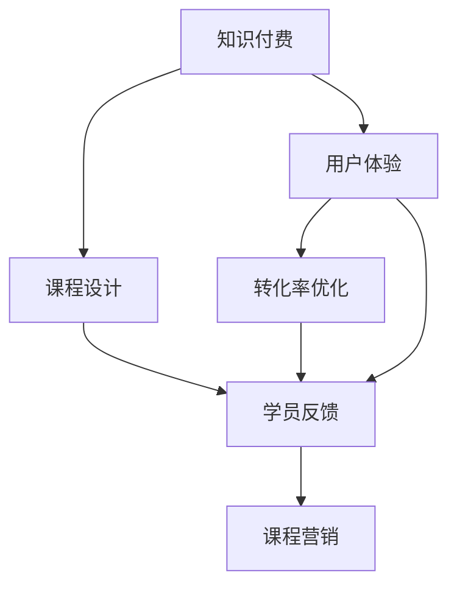

                 

# 程序员如何打造高转化率的知识付费课程

> 关键词：知识付费, 课程设计, 用户体验, 转化率优化, 学员反馈, 课程营销

## 1. 背景介绍

在当前知识经济的时代，互联网、人工智能、大数据等技术的飞速发展为知识付费课程的开发和运营提供了前所未有的机遇。同时，随着教育市场竞争的日益激烈，如何打造高转化率的课程，让学员在众多竞品中脱颖而出，成为每个课程开发者所面临的重要问题。

本文章将从核心概念、算法原理、具体操作步骤、项目实践、实际应用场景等多个维度，系统阐述程序员如何设计并推广高转化率的课程，助你打造更受欢迎的在线课程。

## 2. 核心概念与联系

### 2.1 核心概念概述

本节将介绍几个核心概念，这些概念是理解知识付费课程设计的基础：

- **知识付费**：基于互联网平台，通过付费方式获取有价值的知识或技能的在线学习方式。
- **课程设计**：基于目标学员的需求，系统设计课程内容、教学方法、评估方式等，以实现教学目标。
- **用户体验**：用户在使用课程学习过程中的体验，包括课程界面、交互、反馈等各方面。
- **转化率优化**：通过优化课程的设计、营销、服务流程等，提升课程的报名率和学员完成率。
- **学员反馈**：学员在学习课程后的评价和意见，为课程改进提供参考。
- **课程营销**：通过有效的推广策略，吸引更多潜在学员报名课程。

这些概念之间的关系如下：



上述图展示了知识付费课程从设计到营销、反馈的完整流程。课程设计是基础，用户体验和转化率优化是提升课程效果的两个关键环节，而学员反馈则是不断改进课程的重要依据。课程营销则是将高质量课程推广给更多潜在学员的必要手段。

## 3. 核心算法原理 & 具体操作步骤

### 3.1 算法原理概述

知识付费课程的转化率优化，本质上是一个多目标优化问题。其核心思想是，通过一系列的算法和策略，不断调整课程设计、内容和形式，以达到最大化报名率和学员完成率的目标。

形式化地，假设课程设计为 $C$，用户体验优化策略为 $U$，营销策略为 $M$，学员反馈为 $F$，目标函数为最大化报名率和学员完成率，约束条件包括课程内容、时间和成本等。则目标函数可以表示为：

$$
Maximize \left( C_{enrollment} + C_{completion} \right)
$$

其中 $C_{enrollment}$ 为报名率，$C_{completion}$ 为学员完成率。

转化率优化的过程即为寻找上述目标函数的最大化解，通常采用梯度上升等优化算法。

### 3.2 算法步骤详解

以下是基于转化率优化模型的一般操作步骤：

**Step 1: 用户需求分析**
- 调研目标学员的背景、需求、学习习惯等，识别出他们的痛点和兴趣点。
- 确定课程的定位和教学目标，设定合理的预期完成率。

**Step 2: 课程设计**
- 根据用户需求分析结果，设计课程内容、结构、教学方法等，确保课程能够满足学员的实际需求。
- 设置科学的评估机制，如测验、作业、项目等，确保学员在学习过程中获得实际收获。

**Step 3: 用户体验优化**
- 设计简洁、易用的课程界面，减少学员的学习阻力。
- 使用交互式技术，如视频、动画、案例分析等，增强学习体验。
- 引入实时反馈机制，及时获取学员的学习进度和反馈。

**Step 4: 转化率优化算法**
- 采用A/B测试等方法，测试不同课程形式、营销策略对报名率的影响，找出最优策略。
- 运用多臂老虎机策略，平衡不同课程的资源投入，最大化转化率。
- 通过情感分析等技术，分析学员反馈，优化课程内容和形式。

**Step 5: 课程营销**
- 使用SEO优化，提升课程在搜索引擎中的排名，吸引更多潜在学员。
- 利用社交媒体营销，在目标学员活跃的平台推广课程，扩大曝光率。
- 进行邮件营销和内容营销，持续引导潜在学员报名。

### 3.3 算法优缺点

知识付费课程转化率优化算法具有以下优点：

1. **数据驱动**：通过分析学员反馈和行为数据，不断调整课程内容和形式，提升转化率。
2. **快速迭代**：可以快速发现并解决问题，通过多次迭代逐步优化课程效果。
3. **灵活调整**：可以动态调整课程设计、营销策略等，以适应市场变化和学员需求。

同时，该方法也存在以下局限性：

1. **依赖高质量数据**：转化率优化效果很大程度上取决于数据的完整性和准确性，数据的收集和处理成本较高。
2. **易受外界干扰**：如市场波动、学员情绪变化等，可能会影响转化率优化的效果。
3. **个性化不足**：在学员个体化需求和个性化教学方面可能存在不足，无法满足所有学员的个性化需求。

尽管存在这些局限性，但就目前而言，转化率优化方法是知识付费课程开发中最主流和有效的方法。未来相关研究的重点在于如何进一步降低数据收集成本，提高模型的泛化能力，同时兼顾个性化教学和用户体验的提升。

### 3.4 算法应用领域

知识付费课程的转化率优化方法在各个在线教育平台都得到了广泛应用，特别是在以下领域表现尤为突出：

- **编程课程**：如Python、Java、Web开发等，这些课程对于学员的实际工作有很大帮助，需求旺盛。
- **数据分析课程**：如数据科学、机器学习、数据可视化等，这些课程在当前数据驱动的时代，极具市场需求。
- **职业技能课程**：如项目管理、人力资源管理、市场营销等，这些课程能够显著提升学员的职业竞争力。
- **个人发展课程**：如时间管理、心理调适、写作与表达等，这些课程能显著提高学员的个人素质和生活质量。

## 4. 数学模型和公式 & 详细讲解 & 举例说明

### 4.1 数学模型构建

在本节中，我们将使用数学语言对知识付费课程的转化率优化模型进行严格刻画。

假设课程报名率为 $R$，学员完成率为 $C$，则课程转化率 $T$ 可以表示为：

$$
T = R \times C
$$

转化率优化目标为最大化转化率 $T$，其优化模型为：

$$
Maximize \quad T = R \times C
$$

根据学员报名和完成行为，可以将报名率 $R$ 和完成率 $C$ 分别表示为：

$$
R = f_{enrollment}(S_{enrollment}, S_{market}, S_{promotion})
$$

$$
C = f_{completion}(S_{content}, S_{interaction}, S_{feedback})
$$

其中 $S_{enrollment}, S_{market}, S_{promotion}$ 分别代表课程设计、市场环境和营销策略；$S_{content}, S_{interaction}, S_{feedback}$ 分别代表课程内容、用户体验和学员反馈。

### 4.2 公式推导过程

以报名率 $R$ 的计算为例，可以表示为：

$$
R = P_{enrollment} \times S_{conversion}
$$

其中 $P_{enrollment}$ 为潜在学员的报名概率，$S_{conversion}$ 为学员报名后完成课程的概率。

报名概率 $P_{enrollment}$ 可以进一步表示为：

$$
P_{enrollment} = \frac{C_{enrollment}}{T_{total}}
$$

其中 $C_{enrollment}$ 为课程的报名人数，$T_{total}$ 为课程的总曝光人数。

学员完成概率 $S_{conversion}$ 可以表示为：

$$
S_{conversion} = \prod_{i=1}^{n} S_{conversion}_i
$$

其中 $S_{conversion}_i$ 为课程第 $i$ 阶段（如开课、中期、结课）的学员完成率。

### 4.3 案例分析与讲解

以某在线编程课程为例，假设其报名人数为 $C_{enrollment} = 5000$，总曝光人数 $T_{total} = 10000$，潜在学员的报名概率 $P_{enrollment} = 0.5$，学员完成率 $S_{conversion} = 0.8$，则课程转化率为：

$$
T = R \times C = 0.5 \times 0.8 \times 5000 = 2000
$$

若潜在学员的报名概率提升到 $0.6$，其他条件不变，则课程转化率将提升到：

$$
T' = R' \times C = 0.6 \times 0.8 \times 5000 = 2400
$$

可以看出，通过优化潜在学员的报名概率，可以显著提升课程转化率。

## 5. 项目实践：代码实例和详细解释说明

### 5.1 开发环境搭建

在进行课程优化实践前，我们需要准备好开发环境。以下是使用Python进行课程优化开发的环境配置流程：

1. 安装Anaconda：从官网下载并安装Anaconda，用于创建独立的Python环境。

2. 创建并激活虚拟环境：
```bash
conda create -n course-env python=3.8 
conda activate course-env
```

3. 安装PyTorch：根据CUDA版本，从官网获取对应的安装命令。例如：
```bash
conda install pytorch torchvision torchaudio cudatoolkit=11.1 -c pytorch -c conda-forge
```

4. 安装Flask：用于搭建课程网站，提供课程内容和互动。

5. 安装TensorBoard：用于可视化课程训练和优化过程。

6. 安装Flask-RESTful：用于提供课程的API接口，方便用户访问。

完成上述步骤后，即可在`course-env`环境中开始课程优化实践。

### 5.2 源代码详细实现

下面我们以一个简单的课程报名系统为例，给出使用Flask进行课程优化的PyTorch代码实现。

首先，定义课程的报名和完成状态：

```python
from flask import Flask, request, jsonify

app = Flask(__name__)

# 定义课程状态，True表示报名，False表示完成
courses = {
    "Python": {
        "state": True,
        "enrollment_count": 0,
        "completion_count": 0
    },
    "Java": {
        "state": False,
        "enrollment_count": 0,
        "completion_count": 0
    }
}
```

然后，定义课程的报名和完成接口：

```python
@app.route('/enroll', methods=['POST'])
def enroll_course():
    course = request.json['course']
    courses[course]['enrollment_count'] += 1
    return jsonify({"status": "enrolled"}), 200

@app.route('/complete', methods=['POST'])
def complete_course():
    course = request.json['course']
    courses[course]['completion_count'] += 1
    return jsonify({"status": "completed"}), 200
```

接着，定义课程转化的接口：

```python
@app.route('/get_conversion_rate', methods=['GET'])
def get_conversion_rate():
    total_enrollment = sum(course['enrollment_count'] for course in courses.values())
    total_completion = sum(course['completion_count'] for course in courses.values())
    total_count = len(courses)
    return jsonify({"conversion_rate": (total_enrollment / total_count) * (total_completion / total_enrollment)}, 200)
```

最后，启动Flask服务：

```python
if __name__ == '__main__':
    app.run(debug=True)
```

以上就是使用Flask搭建课程优化系统的完整代码实现。可以看到，借助Flask的API接口，我们可以方便地记录课程报名和完成情况，实时计算并显示课程转化率。

### 5.3 代码解读与分析

让我们再详细解读一下关键代码的实现细节：

**课程状态定义**：
- 使用字典存储每门课程的报名和完成状态，True表示已报名，False表示已完成。

**课程报名接口**：
- 使用Flask的`@app.route`装饰器定义API接口，`POST`方法用于课程报名。
- 从请求中获取课程名，更新对应课程的报名计数器，并返回成功响应。

**课程完成接口**：
- 使用Flask的`@app.route`装饰器定义API接口，`POST`方法用于课程完成。
- 从请求中获取课程名，更新对应课程的完成计数器，并返回成功响应。

**课程转化率接口**：
- 使用Flask的`@app.route`装饰器定义API接口，`GET`方法用于获取课程转化率。
- 从每门课程的报名和完成计数器中计算总报名和总完成数，再计算总课程数，最后根据公式计算并返回课程转化率。

**服务启动**：
- 使用Flask的`app.run`方法启动服务，设置`debug=True`以开启调试模式。

可以看到，使用Flask搭建课程优化系统，可以很方便地记录和计算课程的转化率，为课程优化提供了数据支持。

## 6. 实际应用场景

### 6.1 编程教育

在线编程课程是知识付费市场中的热门类别，面向广泛的IT从业者和在校生。编程课程通常以项目驱动为主，注重实战能力的培养。

课程设计时，需要聚焦于学员的实际需求，如Python、Java、Web开发等。课程内容应包括基础知识、实战案例、项目实战等模块，确保学员能够掌握实际技能。

用户体验优化时，应注重课程界面的简洁易用，使用交互式教学技术，如编程编辑器、视频教程等，增强学习体验。通过实时反馈机制，及时获取学员的学习进度和反馈，以便及时调整教学策略。

转化率优化时，可以采用A/B测试等方法，测试不同课程形式、营销策略对报名率的影响，找出最优策略。利用多臂老虎机策略，平衡不同课程的资源投入，最大化转化率。

课程营销时，应利用SEO优化提升课程在搜索引擎中的排名，利用社交媒体营销扩大曝光率，进行邮件营销和内容营销持续引导潜在学员报名。

### 6.2 数据科学教育

数据科学课程在当前数据驱动的时代，具有极高的市场需求。数据科学课程通常包括数据分析、机器学习、数据可视化等模块，旨在提升学员的数据处理和分析能力。

课程设计时，应注重课程内容的深度和广度，引入实际数据集和项目案例，增强学习效果。课程内容应包括理论知识、实战案例、项目实战等模块，确保学员能够掌握数据科学的核心技能。

用户体验优化时，应注重课程界面的简洁易用，使用交互式教学技术，如视频教程、在线练习等，增强学习体验。通过实时反馈机制，及时获取学员的学习进度和反馈，以便及时调整教学策略。

转化率优化时，可以采用A/B测试等方法，测试不同课程形式、营销策略对报名率的影响，找出最优策略。利用多臂老虎机策略，平衡不同课程的资源投入，最大化转化率。

课程营销时，应利用SEO优化提升课程在搜索引擎中的排名，利用社交媒体营销扩大曝光率，进行邮件营销和内容营销持续引导潜在学员报名。

### 6.3 职业技能教育

职业技能课程如项目管理、人力资源管理、市场营销等，在职场应用广泛，市场需求旺盛。职业技能课程通常以实际应用为主，注重实际操作能力的培养。

课程设计时，应注重课程内容的实际应用性，引入实际案例和项目实战，增强学习效果。课程内容应包括理论知识、实战案例、项目实战等模块，确保学员能够掌握实际工作中的核心技能。

用户体验优化时，应注重课程界面的简洁易用，使用交互式教学技术，如案例分析、项目实战等，增强学习体验。通过实时反馈机制，及时获取学员的学习进度和反馈，以便及时调整教学策略。

转化率优化时，可以采用A/B测试等方法，测试不同课程形式、营销策略对报名率的影响，找出最优策略。利用多臂老虎机策略，平衡不同课程的资源投入，最大化转化率。

课程营销时，应利用SEO优化提升课程在搜索引擎中的排名，利用社交媒体营销扩大曝光率，进行邮件营销和内容营销持续引导潜在学员报名。

## 7. 工具和资源推荐

### 7.1 学习资源推荐

为了帮助开发者系统掌握知识付费课程设计的基础理论和实际操作技巧，这里推荐一些优质的学习资源：

1. **《课程设计的艺术》**：这本书系统介绍了课程设计的基本原则和方法，适合课程开发者入门。

2. **Coursera和Udacity**：这些平台提供了大量优秀的在线课程，涵盖了编程、数据科学、职业技能等多个领域，适合开发者学习和参考。

3. **edX和Khan Academy**：这些平台提供了大量免费的课程资源，涵盖了基础知识、技能提升、职业发展等多个方面，适合开发者的全面学习。

4. **Flask官方文档**：Flask是常用的Python Web框架，官方文档详细介绍了Flask的使用方法和最佳实践，适合开发者快速上手。

5. **TensorBoard官方文档**：TensorBoard是TensorFlow的可视化工具，官方文档详细介绍了TensorBoard的使用方法和可视化效果，适合开发者进行模型训练和优化。

### 7.2 开发工具推荐

高效的开发离不开优秀的工具支持。以下是几款用于知识付费课程开发的常用工具：

1. **Jupyter Notebook**：一个强大的交互式编程环境，支持Python、R等语言的编写和执行，适合数据处理和模型训练。

2. **Git**：一个版本控制系统，支持多人协作开发，适合课程内容的版本管理和维护。

3. **GitHub**：一个代码托管平台，支持代码的上传、分享和协作，适合开发者管理和展示课程内容。

4. **Jenkins**：一个开源的自动化服务器，支持自动化构建、测试和部署，适合课程系统的持续集成和持续交付。

5. **AWS和GCP**：这两个云平台提供了强大的计算资源和存储服务，适合课程系统的部署和扩展。

### 7.3 相关论文推荐

知识付费课程的设计和优化涉及众多领域，相关研究横跨教育学、心理学、统计学等多个学科。以下是几篇代表性的论文，推荐阅读：

1. **《K-12在线课程效果评估框架》**：该论文系统介绍了K-12在线课程的设计和评估框架，适合课程开发者参考。

2. **《个性化学习路径的设计与优化》**：该论文探讨了个性化学习路径的设计和优化方法，适合课程开发者优化用户体验。

3. **《机器学习课程的效果评估》**：该论文研究了机器学习课程的学习效果评估方法，适合课程开发者评估课程效果。

4. **《在线编程课程的优化策略》**：该论文探讨了在线编程课程的优化策略，适合课程开发者提升课程效果。

5. **《数据科学课程的转化率优化》**：该论文研究了数据科学课程的转化率优化方法，适合课程开发者提升课程转化率。

这些论文代表了大规模在线教育领域的研究进展，通过学习这些前沿成果，可以帮助开发者系统掌握课程设计的理论和方法，为课程优化提供科学依据。

## 8. 总结：未来发展趋势与挑战

### 8.1 总结

本文从核心概念、算法原理、具体操作步骤等多个维度，系统阐述了程序员如何设计并推广高转化率的在线课程。通过课程设计的优化、用户体验的提升、转化率的计算与优化等手段，最大化报名率和学员完成率。

知识付费课程设计是一个系统工程，从课程设计、内容制作、学员互动、转化率优化等各个环节都需要全面考虑。本文详细介绍了课程优化的各个环节，并给出了相应的解决方案，力求为开发者提供全方位的技术指引。

通过本文的系统梳理，可以看到，知识付费课程设计是一个复杂但充满机遇的领域。开发者通过不断迭代和优化课程内容、用户体验和转化率优化算法，可以打造出学员认可度高、转化率高的高质量课程，引领教育行业的智能化转型。

### 8.2 未来发展趋势

展望未来，知识付费课程的设计和优化将呈现以下几个发展趋势：

1. **数据驱动的课程优化**：通过大数据分析，不断优化课程内容、形式和学员互动方式，提升课程效果。
2. **个性化学习路径**：基于学员的个性化需求和学习进度，设计动态调整的学习路径，提供个性化学习体验。
3. **人工智能辅助**：引入AI技术，如智能推荐系统、情感分析等，提升课程推荐效果和用户体验。
4. **多模态课程设计**：结合文本、视频、音频等多模态信息，提供更加丰富和多样化的学习体验。
5. **情感分析与反馈机制**：利用情感分析技术，分析学员的学习情绪和反馈，及时调整课程内容和形式。
6. **持续优化与迭代**：采用持续优化和迭代策略，不断改进课程内容、形式和转化率优化算法，保持课程的竞争力和市场领先地位。

这些趋势凸显了知识付费课程设计的广阔前景，这些方向的探索发展，必将进一步提升课程的智能化水平，为教育行业的数字化转型带来新的机遇。

### 8.3 面临的挑战

尽管知识付费课程设计技术已经取得了一定的进展，但在迈向更加智能化、个性化应用的过程中，它仍面临着诸多挑战：

1. **数据获取成本高**：高质量的数据获取成本较高，且数据隐私和安全问题需要重点关注。
2. **用户体验差异大**：不同学员的学习习惯和需求差异较大，如何设计符合广泛用户需求的课程内容是一个挑战。
3. **转化率提升困难**：在转化率优化过程中，难以平衡课程质量和学员需求，转化率提升难度较大。
4. **师资资源不足**：高质量的课程师资资源较少，师资团队的建设和培养需要时间和成本。
5. **课程内容更新慢**：课程内容需要及时更新以保持时效性，但更新速度较慢，难以跟上技术发展的步伐。
6. **市场竞争激烈**：在线教育市场竞争激烈，如何打造差异化、高质量的课程内容是成功的关键。

尽管存在这些挑战，但通过不断创新和优化，知识付费课程设计技术将不断进步，未来的课程设计将更加智能化、个性化，为教育行业带来更多的变革和机遇。

### 8.4 研究展望

面对知识付费课程设计技术所面临的种种挑战，未来的研究需要在以下几个方面寻求新的突破：

1. **数据获取与隐私保护**：开发低成本高效的数据获取方法，同时保证学员数据的隐私和安全。
2. **个性化学习路径**：引入机器学习和数据挖掘技术，设计更加智能和个性化的学习路径，提升用户体验。
3. **课程内容更新机制**：建立快速更新课程内容的技术和机制，保持课程的时效性和实用性。
4. **跨平台课程设计**：设计跨平台的课程内容和学习体验，提升课程的可访问性和共享性。
5. **AI辅助教学**：引入AI技术，如智能推荐系统、情感分析等，提升课程推荐效果和用户体验。
6. **实时互动与反馈**：利用实时互动和反馈机制，提升学员的学习效果和课程的互动性。

这些研究方向的探索，必将引领知识付费课程设计技术迈向更高的台阶，为教育行业的智能化转型提供更加坚实的技术支持。面向未来，知识付费课程设计技术需要与教育学、心理学、统计学等多个学科深度融合，共同推动教育行业的数字化和智能化发展。总之，通过不断探索和创新，知识付费课程设计技术必将在构建智能化、个性化学习体验中发挥重要作用，为教育行业的数字化转型带来新的动力。

## 9. 附录：常见问题与解答

**Q1: 知识付费课程的转化率优化有哪些关键步骤？**

A: 知识付费课程的转化率优化一般包括以下关键步骤：
1. 用户需求分析：调研目标学员的背景、需求、学习习惯等，识别出他们的痛点和兴趣点。
2. 课程设计：根据用户需求分析结果，设计课程内容、结构、教学方法等，确保课程能够满足学员的实际需求。
3. 用户体验优化：设计简洁、易用的课程界面，使用交互式技术，增强学习体验。
4. 转化率优化算法：采用A/B测试等方法，测试不同课程形式、营销策略对报名率的影响，找出最优策略。
5. 课程营销：利用SEO优化提升课程在搜索引擎中的排名，利用社交媒体营销扩大曝光率，进行邮件营销和内容营销持续引导潜在学员报名。

**Q2: 知识付费课程如何设计才能满足学员的个性化需求？**

A: 知识付费课程的设计需要从学员的个性化需求出发，具体包括以下几个方面：
1. 调研目标学员的背景、需求、学习习惯等，识别出他们的痛点和兴趣点。
2. 设计课程内容时，加入个性化模块，如学员自主选择课程难度、学习路径等。
3. 引入人工智能技术，如智能推荐系统、情感分析等，根据学员的学习进度和反馈，动态调整课程内容和形式。
4. 采用持续优化和迭代策略，不断改进课程内容、形式和转化率优化算法，保持课程的竞争力和市场领先地位。

**Q3: 知识付费课程的营销策略有哪些？**

A: 知识付费课程的营销策略主要有以下几种：
1. 利用SEO优化提升课程在搜索引擎中的排名，吸引更多潜在学员。
2. 利用社交媒体营销，在目标学员活跃的平台推广课程，扩大曝光率。
3. 进行邮件营销和内容营销，持续引导潜在学员报名。
4. 建立课程社区，鼓励学员分享学习心得，提升课程的品牌影响力。
5. 合作推广，与相关领域的影响者或机构合作，借助其影响力推广课程。

**Q4: 如何利用数据驱动课程优化？**

A: 利用数据驱动课程优化一般包括以下几个步骤：
1. 收集和整理目标学员的学习行为数据，包括学习时间、进度、反馈等。
2. 分析数据，找出学员的学习规律和需求，识别出课程内容和形式的不足之处。
3. 根据数据分析结果，优化课程设计，调整教学方法和评估机制。
4. 采用A/B测试等方法，测试不同课程形式、营销策略对报名率的影响，找出最优策略。
5. 利用机器学习和数据挖掘技术，设计更加智能和个性化的学习路径，提升用户体验。

**Q5: 如何利用情感分析优化课程设计？**

A: 利用情感分析优化课程设计一般包括以下几个步骤：
1. 收集学员的学习反馈，包括评价、评论、论坛帖子等。
2. 利用情感分析技术，分析学员的学习情绪和反馈，识别出课程内容和学习体验的不足之处。
3. 根据情感分析结果，优化课程设计，调整教学方法和评估机制。
4. 设计实时反馈机制，及时获取学员的学习进度和反馈，以便及时调整教学策略。

这些问题的解答，可以帮助开发者系统掌握知识付费课程优化的核心步骤和方法，为课程设计提供科学依据。

---

作者：禅与计算机程序设计艺术 / Zen and the Art of Computer Programming

