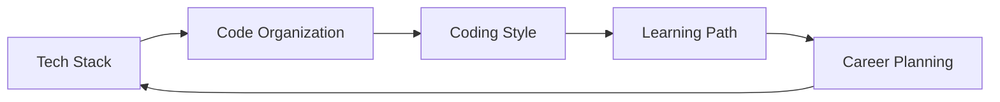

                 

# 程序员如何构建个人知识体系

> 关键词：个人知识体系, 软件架构, 技术栈, 代码组织, 编程风格, 学习路径, 职业规划

## 1. 背景介绍

### 1.1 问题由来

作为一名软件开发者，你是否经常感到知识体系凌乱、技能点分散？面对瞬息万变的技术领域，是否感到学习压力和焦虑？如何构建一个系统化的知识体系，以应对职业发展的各个阶段，是每位开发者必须面对的挑战。

### 1.2 问题核心关键点

一个良好的个人知识体系，可以帮助你快速定位学习方向，提升技术水平，优化工作效能，并为职业发展提供明确规划。核心关键点包括：

- **技术栈构建**：选择哪些技术栈，如何搭配使用？
- **代码组织习惯**：如何管理项目代码，保持整洁高效？
- **编程风格规范**：编写代码的基本规范是什么？
- **学习路径规划**：如何制定一个高效的学习计划，系统提升能力？
- **职业规划与实践**：如何制定职业目标，并在实践中不断积累经验？

## 2. 核心概念与联系

### 2.1 核心概念概述

为构建个人知识体系，我们先要理解几个关键概念：

- **技术栈 (Tech Stack)**：指的是一个项目或团队中使用的技术集合，包括编程语言、框架、库、工具等。
- **代码组织 (Code Organization)**：指通过目录、模块、包等方式组织和管理代码的方式，以保证代码的可读性、可维护性和可扩展性。
- **编程风格 (Coding Style)**：指编写代码时的编码规范和最佳实践，旨在提高代码的可读性、可维护性和可扩展性。
- **学习路径 (Learning Path)**：指针对某一技能或技术的学习路线图，包括基础理论、实践应用和高级技巧等。
- **职业规划 (Career Planning)**：指根据自身兴趣、能力和市场需求，制定的职业发展路线和目标。

这些概念之间存在紧密联系：技术栈决定了项目实现的手段，代码组织和编程风格直接影响项目质量和开发效率，学习路径为技术提升提供了系统化的规划，职业规划则指明了个人发展的方向和目标。

### 2.2 核心概念原理和架构的 Mermaid 流程图(Mermaid 流程节点中不要有括号、逗号等特殊字符)

## 3. 核心算法原理 & 具体操作步骤

### 3.1 算法原理概述

构建个人知识体系的过程，本质上是一个优化问题，目标是在有限的时间内，最大化个人技术能力和职业竞争力。算法原理可以简单概括为：

1. **目标设定**：明确个人职业目标和技术需求。
2. **选择路径**：根据目标选择合适的技术栈和课程。
3. **资源配置**：分配学习时间和精力，优化学习路径。
4. **实践应用**：通过实际项目或案例，积累经验并优化技术栈。
5. **持续迭代**：根据技术发展和职业需求，不断更新和优化知识体系。

### 3.2 算法步骤详解

#### 3.2.1 目标设定

- **职业目标**：明确个人职业方向，如Web开发、数据科学、人工智能等。
- **技术需求**：确定达到职业目标所需掌握的技术，如编程语言、框架、库、工具等。

#### 3.2.2 选择路径

- **技术栈选择**：根据职业目标和需求，选择最适合的技术栈。
- **学习资源选择**：筛选和获取合适的学习资源，如在线课程、书籍、文档、社区等。
- **课程安排**：制定一个系统的学习计划，包括基础、进阶、实践等阶段。

#### 3.2.3 资源配置

- **时间分配**：根据个人情况，合理分配学习和实践的时间。
- **精力投入**：集中精力攻克难题和瓶颈，避免浅尝辄止。

#### 3.2.4 实践应用

- **项目实战**：选择或创建真实项目，实践所学技术。
- **案例分析**：通过案例分析，理解技术的实际应用场景。
- **代码实践**：持续编码练习，提升编码能力。

#### 3.2.5 持续迭代

- **技术跟踪**：关注技术发展和社区动态，更新知识体系。
- **经验总结**：总结学习经验和实践案例，形成知识积累。
- **职业发展**：根据职业目标和技术需求，调整学习路径和实践方向。

### 3.3 算法优缺点

#### 3.3.1 优点

- **系统性**：构建的知识体系有明确的逻辑和结构，能够系统性地提升技术水平。
- **针对性**：根据职业目标和需求，选择最合适的技术和资源，避免浪费时间和精力。
- **高效性**：通过实践和迭代，不断优化知识体系，提升学习效率和效果。

#### 3.3.2 缺点

- **复杂性**：构建和维护一个系统的知识体系需要一定的时间和精力。
- **适应性**：随着技术的发展和需求的变化，需要不断调整和优化知识体系。
- **灵活性**：系统化的学习路径可能缺乏灵活性，难以应对突发情况和新技术。

### 3.4 算法应用领域

个人知识体系的构建，不仅适用于软件开发领域，也适用于其他技术领域，如数据科学、人工智能、网络安全等。通过系统化的学习和实践，可以有效提升个人技术能力和职业竞争力。

## 4. 数学模型和公式 & 详细讲解 & 举例说明

### 4.1 数学模型构建

为更好地理解个人知识体系的构建过程，我们可以将其抽象为一个数学模型。

设 $T$ 为所需掌握的技术集，$S$ 为学习资源集，$P$ 为学习路径集，$C$ 为实践项目集，$D$ 为职业目标集。目标函数为：

$$
\max_{T, S, P, C, D} \sum_{t \in T} \sum_{s \in S} \sum_{p \in P} \sum_{c \in C} \sum_{d \in D} f(t, s, p, c, d)
$$

其中 $f$ 为评估函数，评估技术掌握度、学习效果、实践经验、职业发展等指标。

### 4.2 公式推导过程

#### 4.2.1 目标函数

目标函数 $f$ 可以细分为多个子函数，如技术掌握度 $t_{tach}$、学习效果 $t_{learn}$、实践经验 $t_{practice}$、职业发展 $t_{career}$ 等：

$$
f(t, s, p, c, d) = \alpha \cdot t_{tach} + \beta \cdot t_{learn} + \gamma \cdot t_{practice} + \delta \cdot t_{career}
$$

其中 $\alpha, \beta, \gamma, \delta$ 为权重系数，反映了不同指标的重要性。

#### 4.2.2 技术掌握度 $t_{tach}$

技术掌握度可以通过学习资源和实践项目来衡量：

$$
t_{tach} = \sum_{t \in T} \sum_{s \in S} \sum_{p \in P} \sum_{c \in C} \sum_{d \in D} \lambda \cdot l(t, s, p, c, d)
$$

其中 $\lambda$ 为系数，$l$ 为评估函数，评估技术掌握度的具体指标，如代码实现、算法理解、框架应用等。

#### 4.2.3 学习效果 $t_{learn}$

学习效果可以通过课程完成度、作业成绩、测试成绩等来衡量：

$$
t_{learn} = \sum_{t \in T} \sum_{s \in S} \sum_{p \in P} \sum_{c \in C} \sum_{d \in D} \eta \cdot l_{learn}(t, s, p, c, d)
$$

其中 $\eta$ 为系数，$l_{learn}$ 为评估函数，评估学习效果的指标，如考试成绩、作业质量、测试结果等。

#### 4.2.4 实践经验 $t_{practice}$

实践经验可以通过实践项目和案例分析来衡量：

$$
t_{practice} = \sum_{t \in T} \sum_{s \in S} \sum_{p \in P} \sum_{c \in C} \sum_{d \in D} \theta \cdot l_{practice}(t, s, p, c, d)
$$

其中 $\theta$ 为系数，$l_{practice}$ 为评估函数，评估实践经验的指标，如项目贡献、代码质量、问题解决能力等。

#### 4.2.5 职业发展 $t_{career}$

职业发展可以通过职业目标和实践项目来衡量：

$$
t_{career} = \sum_{t \in T} \sum_{s \in S} \sum_{p \in P} \sum_{c \in C} \sum_{d \in D} \phi \cdot l_{career}(t, s, p, c, d)
$$

其中 $\phi$ 为系数，$l_{career}$ 为评估函数，评估职业发展的指标，如职位晋升、项目经验、技能认证等。

### 4.3 案例分析与讲解

#### 4.3.1 案例分析

假设一位Web开发者，目标是成为一名高级前端工程师。

- **技术栈**：需要掌握HTML、CSS、JavaScript、React、Node.js等技术。
- **学习资源**：选择Coursera、Udacity、LeetCode等平台上的课程，选择GitHub上的开源项目。
- **学习路径**：分为基础阶段、进阶阶段和实践阶段。基础阶段学习HTML、CSS、JavaScript等基础技术；进阶阶段学习React、Node.js等框架；实践阶段参与开源项目，积累实战经验。
- **实践项目**：选择或创建真实项目，如电商网站、社交应用等，实践所学技术。
- **职业目标**：目标是成为一名高级前端工程师，需积累项目经验、获取认证等。

#### 4.3.2 计算公式

假设各项指标权重系数分别为 $\alpha = 0.3, \beta = 0.2, \gamma = 0.2, \delta = 0.3$，则目标函数为：

$$
f(t, s, p, c, d) = 0.3 \cdot l_{tach}(t, s, p, c, d) + 0.2 \cdot l_{learn}(t, s, p, c, d) + 0.2 \cdot l_{practice}(t, s, p, c, d) + 0.3 \cdot l_{career}(t, s, p, c, d)
$$

## 5. 项目实践：代码实例和详细解释说明

### 5.1 开发环境搭建

#### 5.1.1 开发工具安装

- **IDE**：选择Visual Studio Code、PyCharm等IDE工具。
- **版本控制**：安装Git、GitHub Desktop等版本控制工具。
- **代码编辑器**：安装Sublime Text、Atom等代码编辑器。
- **浏览器**：安装Chrome、Firefox等现代浏览器。

#### 5.1.2 代码仓库设置

- **仓库创建**：在GitHub上创建一个代码仓库，设置仓库名称和描述。
- **Git安装**：在本地安装Git，配置用户信息和密码。
- **远程仓库设置**：将本地仓库与远程仓库关联，进行代码上传和同步。

### 5.2 源代码详细实现

#### 5.2.1 项目框架搭建

- **项目结构**：定义项目目录结构，如src、test、docs等。
- **依赖管理**：使用npm、yarn等工具管理项目依赖，如React、Node.js等。
- **模块划分**：将项目划分为多个模块，如前端、后端、数据库等。

#### 5.2.2 代码编写与测试

- **代码编写**：按照代码规范编写代码，如命名规范、代码风格等。
- **单元测试**：编写单元测试用例，确保代码的正确性和稳定性。
- **集成测试**：编写集成测试用例，测试模块之间的交互和集成。

### 5.3 代码解读与分析

#### 5.3.1 代码规范

代码规范包括命名规范、缩进规范、注释规范等，提升代码的可读性和可维护性。

- **命名规范**：使用有意义的变量和函数名，避免使用无意义的缩写。
- **缩进规范**：统一使用空格或制表符进行缩进，避免混合使用。
- **注释规范**：在代码中插入有意义的注释，解释代码的功能和逻辑。

#### 5.3.2 代码组织

代码组织通过合理划分模块和包，提高代码的可读性和可维护性。

- **模块划分**：将代码划分为多个模块，如UI组件、业务逻辑、数据处理等。
- **包管理**：使用npm、yarn等工具管理代码包，确保代码的可复用性。
- **依赖管理**：合理选择和使用第三方库和工具，避免过度依赖。

#### 5.3.3 代码测试

代码测试通过编写测试用例，确保代码的正确性和稳定性。

- **单元测试**：针对单个函数或方法进行测试，确保其正确性和性能。
- **集成测试**：测试模块之间的交互和集成，确保系统整体的稳定性和可靠性。
- **端到端测试**：测试系统的完整流程，包括前端、后端和数据库。

### 5.4 运行结果展示

#### 5.4.1 代码运行

通过运行测试用例，确保代码的正确性和稳定性。

- **单元测试**：运行单元测试用例，检查函数或方法的输出是否符合预期。
- **集成测试**：运行集成测试用例，检查模块之间的交互是否正常。
- **端到端测试**：运行端到端测试用例，确保系统整体的稳定性和可靠性。

#### 5.4.2 性能分析

通过性能分析工具，检查代码的性能瓶颈和优化方向。

- **性能测试**：使用性能测试工具，如JMeter、Gatling等，测试系统的响应时间和吞吐量。
- **代码优化**：通过分析性能数据，优化代码实现，提升系统性能。

## 6. 实际应用场景

### 6.1 软件架构设计

#### 6.1.1 案例分析

假设某公司需要开发一个电商网站，技术栈选择React、Node.js、MongoDB等。

- **架构设计**：设计系统的整体架构，如前端、后端、数据库、缓存等。
- **模块划分**：将系统划分为多个模块，如用户管理、商品管理、订单管理等。
- **技术选型**：选择最适合的技术和工具，如React用于前端，MongoDB用于数据库。
- **代码实践**：根据架构设计和模块划分，编写代码实现。

#### 6.1.2 实际应用

- **架构实现**：根据架构设计，实现系统的各个模块，并进行集成测试。
- **性能优化**：根据性能分析结果，优化代码实现，提升系统性能。
- **扩展性设计**：设计系统架构，确保系统的可扩展性和可维护性。

### 6.2 技术栈选择与搭配

#### 6.2.1 案例分析

假设某团队需要开发一个数据管理平台，技术栈选择Spring Boot、React、MySQL等。

- **技术栈选择**：选择最适合的技术栈，如Spring Boot用于后端，React用于前端，MySQL用于数据库。
- **技术搭配**：合理搭配各个技术，确保系统的稳定性和可维护性。
- **代码实践**：根据技术栈选择，编写代码实现。

#### 6.2.2 实际应用

- **技术栈实现**：根据技术栈选择，实现系统的各个模块，并进行集成测试。
- **性能优化**：根据性能分析结果，优化代码实现，提升系统性能。
- **扩展性设计**：设计系统架构，确保系统的可扩展性和可维护性。

## 7. 工具和资源推荐

### 7.1 学习资源推荐

#### 7.1.1 在线课程

- **Coursera**：提供多种技术栈和课程，涵盖基础知识和高级技巧。
- **Udacity**：提供实战项目和课程，提升实战能力。
- **edX**：提供大学和企业的课程，覆盖多个技术领域。

#### 7.1.2 书籍推荐

- **《深入理解计算机系统》**：深入介绍计算机系统的基本原理和实现。
- **《Clean Code》**：介绍代码编写规范和最佳实践。
- **《JavaScript高级程序设计》**：详细介绍JavaScript语言和框架。

#### 7.1.3 社区资源

- **Stack Overflow**：技术问答社区，解决实际编程问题。
- **GitHub**：开源项目平台，学习优秀项目和代码实现。
- **Stack Exchange**：技术问答社区，覆盖多个技术领域。

### 7.2 开发工具推荐

#### 7.2.1 IDE工具

- **Visual Studio Code**：轻量级、功能强大的代码编辑器。
- **PyCharm**：Java和Python开发环境，提供强大的代码补全和调试功能。
- **Sublime Text**：轻量级、高效的代码编辑器。

#### 7.2.2 版本控制工具

- **Git**：最流行的版本控制工具，提供强大的分支管理功能。
- **GitHub Desktop**：GitHub的桌面客户端，方便代码管理和同步。
- **SVN**：Subversion版本控制工具，提供强大的分支管理功能。

#### 7.2.3 代码编辑器

- **Atom**：开源、可扩展的代码编辑器。
- **Sublime Text**：轻量级、高效的代码编辑器。
- **Visual Studio Code**：轻量级、功能强大的代码编辑器。

### 7.3 相关论文推荐

#### 7.3.1 经典论文

- **《On the Origins of Object-Oriented Programming》**：介绍面向对象编程的起源和基本原理。
- **《The Mythical Man-Month》**：介绍软件开发的经典著作，涵盖项目管理、团队协作等方面。
- **《Design Patterns》**：介绍设计模式的经典著作，涵盖软件设计的多个方面。

## 8. 总结：未来发展趋势与挑战

### 8.1 研究成果总结

通过构建个人知识体系，可以系统地提升技术能力和职业竞争力，推动软件开发和实践的进步。核心研究成果包括：

- **系统化学习路径**：构建系统的学习路径，涵盖基础知识、实践应用和高级技巧。
- **代码组织规范**：制定代码组织规范，提高代码的可读性和可维护性。
- **编程风格规范**：制定编程风格规范，提升代码的规范性和可扩展性。
- **职业规划与实践**：制定职业规划，并在实践中不断积累经验，推动职业发展。

### 8.2 未来发展趋势

未来，个人知识体系的构建将呈现以下发展趋势：

- **跨学科融合**：跨学科融合将成为主流趋势，技术栈选择将更加多样化。
- **云原生技术**：云原生技术将引领未来的软件开发，如Kubernetes、Docker等。
- **人工智能和机器学习**：人工智能和机器学习将广泛应用于软件开发，如自动化测试、智能开发等。
- **DevOps文化**：DevOps文化将推动软件开发和运维的协同，提升开发效率和质量。
- **远程工作与协作**：远程工作和协作将成为常态，技术栈选择将更加灵活和多样化。

### 8.3 面临的挑战

尽管个人知识体系构建取得了一定的成效，但仍面临诸多挑战：

- **技术更新速度快**：技术更新速度快，难以跟上最新的技术进展。
- **学习资源庞杂**：学习资源庞杂，难以选择最适合自己的学习路径。
- **实践机会少**：实践机会少，难以通过项目实战提升能力。
- **职业发展瓶颈**：职业发展瓶颈，难以突破技术瓶颈和职业天花板。
- **协作沟通困难**：协作沟通困难，难以在团队中高效协作。

### 8.4 研究展望

未来的研究方向在于：

- **自动化学习路径**：开发自动化学习路径推荐系统，根据用户情况推荐最佳学习路径。
- **智能化工具辅助**：开发智能化工具，如代码自动补全、智能调试等，提升开发效率和质量。
- **跨领域知识整合**：整合跨领域知识，提升系统的综合性和智能性。
- **社区协作平台**：构建社区协作平台，促进开发者之间的交流和合作。

## 9. 附录：常见问题与解答

### 9.1 常见问题

#### 9.1.1 问题1：如何构建系统化的学习路径？

**答案**：
构建系统化的学习路径，首先需要明确职业目标和技术需求。根据目标选择适合的技术栈，然后筛选和获取合适的学习资源。最后，制定一个系统的学习计划，涵盖基础、进阶和实践等阶段。

#### 9.1.2 问题2：如何管理项目代码？

**答案**：
管理项目代码，首先需要选择合适的版本控制工具，如Git。然后，合理划分模块和包，使用npm、yarn等工具管理代码包。最后，编写代码规范，提升代码的可读性和可维护性。

#### 9.1.3 问题3：如何选择最适合的技术栈？

**答案**：
选择最适合的技术栈，需要考虑多个因素，如项目需求、团队成员的技术背景、开发效率和维护成本等。一般来说，选择主流、成熟的技术栈，并合理搭配各个技术，确保系统的稳定性和可维护性。

#### 9.1.4 问题4：如何提高代码的可读性和可维护性？

**答案**：
提高代码的可读性和可维护性，需要编写规范的代码，如命名规范、缩进规范、注释规范等。同时，合理划分模块和包，使用版本控制工具管理代码，编写单元测试和集成测试，确保代码的正确性和稳定性。

#### 9.1.5 问题5：如何制定职业目标和发展路径？

**答案**：
制定职业目标和发展路径，需要根据自身兴趣、能力和市场需求，制定明确的职业目标，并制定详细的行动计划。需要不断学习和积累经验，逐步实现职业目标。

### 9.2 解答

通过以上系统化的学习和实践，可以构建一个高效的个人知识体系，提升技术能力和职业竞争力。希望本文能够为你的技术学习和职业发展提供有价值的指导和帮助。

---

作者：禅与计算机程序设计艺术 / Zen and the Art of Computer Programming

