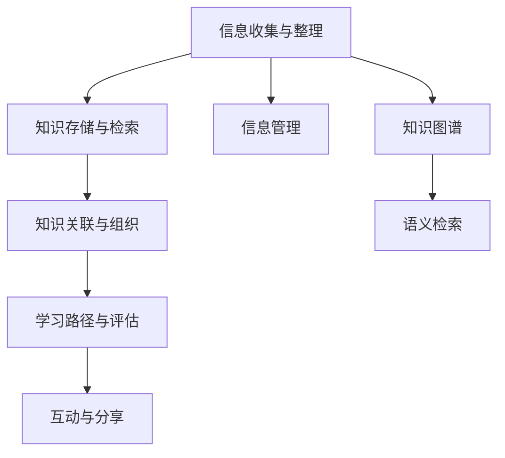

                 

# 程序员如何构建个人知识管理系统(PKM)

> 关键词：个人知识管理,PKM系统,信息管理,学习成长,软件开发,知识图谱

## 1. 背景介绍

在数字化时代，信息爆炸和知识碎片化成为了时代特征。程序员作为知识工作者，面对着海量信息和高复杂度的技术栈，如何有效管理、整理和利用知识，成为了个人成长和技术突破的关键。个人知识管理系统(PKM)由此应运而生，成为程序员提升工作效率、促进学习和创新的有力工具。本文将系统介绍PKM系统的构建原理、具体操作步骤以及实际应用场景，帮助程序员构建高效的知识管理框架。

### 1.1 问题由来

信息过载和知识碎片化是现代程序员面临的两大挑战。

1. **信息过载**：互联网时代，信息源多样化且更新频繁，程序员需要从大量文章、视频、博客、论坛中筛选出有价值的内容，这大大消耗了宝贵的时间和精力。

2. **知识碎片化**：技术更新迭代迅速，程序员需要不断学习新的知识和技能，但这些知识往往散落在各个角落，难以系统化组织。

针对上述问题，PKM系统通过结构化、系统化的方法，帮助程序员高效管理个人知识，加速学习成长，提升技术水平。通过PKM系统，程序员可以：
- 集中存储和管理各类技术文档和资料。
- 构建知识关联图谱，快速定位和检索相关知识。
- 建立动态的学习路径和知识体系，实现持续学习。

### 1.2 问题核心关键点

构建PKM系统的核心关键点包括：

- **信息收集与整理**：收集个人工作、学习中产生的各类信息，如笔记、代码、邮件、会议纪要等，并进行分类整理。
- **知识存储与检索**：将整理好的信息存储在PKM系统内，通过标签、分类、搜索等手段进行快速检索。
- **知识关联与组织**：构建知识图谱，建立不同知识点之间的关联，形成系统的知识体系。
- **学习路径与评估**：设计学习路径和评估机制，跟踪个人学习进度和效果，不断调整优化。
- **互动与分享**：通过评论、讨论等形式，与他人互动分享，促进知识传播和交流。

## 2. 核心概念与联系

### 2.1 核心概念概述

为更好地理解PKM系统的构建原理，本节将介绍几个关键概念：

- **知识管理(Knowledge Management, KM)**：指对组织和个体知识进行系统化、结构化的管理和利用，以提升知识工作者的绩效和组织竞争力。

- **个人知识管理(Personal Knowledge Management, PKM)**：指个人对知识进行收集、整理、存储、检索、关联和应用的过程。PKM系统是实现个人知识管理的重要工具。

- **信息管理(Information Management)**：指对各类信息进行收集、整理、存储、检索、共享等操作，以支持决策和业务流程。

- **知识图谱(Knowledge Graph)**：以图结构表示知识点的关联关系，支持快速定位和检索。

- **语义检索(Semantic Search)**：利用自然语言处理技术，实现更精准、智能的检索功能。

这些概念之间的联系可以通过以下Mermaid流程图来展示：



这个流程图展示了PKM系统的基本流程：

1. 通过信息管理模块收集信息。
2. 将收集的信息存储到知识库中。
3. 通过知识图谱和语义检索模块进行关联和检索。
4. 根据学习路径和评估机制进行系统学习。
5. 通过互动和分享模块促进知识传播。

## 3. 核心算法原理 & 具体操作步骤

### 3.1 算法原理概述

PKM系统通过信息管理、知识图谱、语义检索等技术，实现对个人知识的有效管理和利用。其核心算法原理包括：

1. **信息管理**：利用数据库或云存储技术，实现对信息的高效收集和存储。
2. **知识图谱构建**：构建知识图谱，描述不同知识点之间的关联关系。
3. **语义检索**：利用自然语言处理技术，实现对知识点的精准检索。
4. **学习路径设计**：设计系统的学习路径，引导用户不断学习和提升。
5. **互动与分享**：通过社区、论坛等形式，促进知识交流和共享。

### 3.2 算法步骤详解

构建PKM系统一般包括以下几个关键步骤：

**Step 1: 信息收集与整理**

1. **信息来源**：识别和收集各类信息源，如笔记、文档、邮件、代码、网页等。

2. **信息分类**：对收集到的信息进行分类，如技术文档、学习笔记、代码库等。

3. **信息整理**：对信息进行初步整理，如格式化、去重、摘要等，便于后续管理。

**Step 2: 知识存储与检索**

1. **知识库设计**：设计知识库的存储结构，包括数据库表、目录树等。

2. **知识存储**：将整理好的信息存储到知识库中，根据分类和标签进行组织。

3. **知识检索**：实现快速检索功能，支持基于关键词、标签、分类等维度进行搜索。

**Step 3: 知识关联与组织**

1. **知识图谱构建**：利用图形化工具，如Neo4j、GraphDB等，构建知识图谱，描述知识点之间的关联关系。

2. **知识映射**：将信息中的关键元素映射到知识图谱中，形成系统的知识体系。

3. **知识图谱应用**：通过知识图谱，快速定位和检索相关知识点，支持更高级的推理和应用。

**Step 4: 学习路径与评估**

1. **学习路径设计**：根据个人学习需求和目标，设计系统的学习路径，如阅读列表、学习计划等。

2. **学习进度跟踪**：跟踪个人的学习进度，记录阅读、笔记、代码提交等行为，形成学习轨迹。

3. **学习效果评估**：通过测试、项目评估等方式，评估个人的学习效果，及时调整优化学习路径。

**Step 5: 互动与分享**

1. **社区建立**：建立知识共享社区，如论坛、博客等，促进知识交流和互动。

2. **知识发布**：将个人的学习笔记、技术文章、代码示例等发布到社区中，供他人学习和参考。

3. **互动交流**：通过评论、讨论等形式，与他人互动交流，形成知识社区的良性循环。

### 3.3 算法优缺点

构建PKM系统具有以下优点：

1. **高效管理**：通过系统化的信息管理，避免了信息过载和知识碎片化的问题，提升了个人工作效率。

2. **系统学习**：利用知识图谱和语义检索等技术，快速定位和检索知识点，加速学习过程。

3. **动态优化**：根据学习进度和效果，动态调整学习路径和知识体系，实现持续改进。

4. **知识共享**：通过社区和分享机制，促进知识的传播和交流，构建知识共享生态。

同时，该系统也存在一些局限性：

1. **初始投入较大**：构建PKM系统需要一定的技术投入和初期资料整理，可能对初学者有一定门槛。

2. **系统维护复杂**：需要持续维护和更新知识库、图谱等，增加了工作量。

3. **隐私风险**：在云存储和社区分享中，可能存在数据隐私和安全问题，需要特别关注。

4. **知识泛化能力有限**：当前PKM系统更多关注知识点管理，而对跨领域知识整合能力有限，需要进一步探索。

尽管存在这些局限性，但PKM系统仍然是个人知识管理的重要工具，通过不断的优化和改进，未来必将在技术开发者中得到广泛应用。

### 3.4 算法应用领域

PKM系统在软件开发、数据分析、人工智能等领域得到了广泛应用，具体包括：

- **软件开发**：通过代码库、技术文档、学习笔记等管理软件开发相关的信息，提升开发效率和质量。
- **数据分析**：通过数据集、分析报告、学习资料等管理数据分析项目，促进数据驱动决策。
- **人工智能**：通过论文、代码、实验结果等管理AI项目，推动技术创新和应用。
- **项目管理**：通过任务、进度、文档等管理项目管理信息，提升团队协作和项目成功率。
- **学习成长**：通过学习路径、学习计划、评估机制等管理个人学习进程，促进持续学习和发展。

除了上述这些典型应用外，PKM系统还被创新性地应用到更多场景中，如知识管理工具、智能搜索引擎、知识图谱系统等，为知识工作者提供了新的解决方案。

## 4. 数学模型和公式 & 详细讲解 & 举例说明

### 4.1 数学模型构建

本节将使用数学语言对PKM系统的构建过程进行更加严格的刻画。

设个人信息集为 $X=\{x_1, x_2, ..., x_n\}$，其中 $x_i$ 为信息实体，包含文档、笔记、代码等。设信息间的关联关系为 $R$，表示不同信息之间的关联，如引用、引用、共现等。设知识图谱为 $G=(V, E)$，其中 $V$ 为节点集合，表示知识点；$E$ 为边集合，表示知识点之间的关联关系。

定义知识管理系统的核心任务为：

- **信息收集与整理**：收集个人信息，进行分类整理，存储到知识库中。
- **知识存储与检索**：将信息存储到知识库中，并支持快速检索。
- **知识关联与组织**：构建知识图谱，描述信息间的关联关系。
- **学习路径与评估**：设计学习路径，跟踪学习进度，评估学习效果。
- **互动与分享**：建立知识社区，促进知识交流和互动。

### 4.2 公式推导过程

以知识图谱构建为例，进行详细推导。

1. **信息实体映射**：将信息实体 $x_i$ 映射到知识图谱中的节点 $v_i$，形成节点集合 $V=\{v_1, v_2, ..., v_n\}$。

2. **关联关系映射**：根据信息间的关联关系 $R$，形成知识图谱中的边集合 $E=\{e_1, e_2, ..., e_m\}$，每条边 $e_j$ 表示 $v_{i_j}$ 和 $v_{k_j}$ 之间的关联关系。

3. **知识图谱优化**：通过迭代优化，提升知识图谱的精确度和完备度。具体方法包括：
   - **节点合并**：根据信息实体的相似性，将节点合并为更抽象的概念节点。
   - **边权重计算**：根据信息间的关联强度，计算边的权重，提升推理准确性。

4. **知识图谱应用**：利用知识图谱进行知识推理和检索，具体方法包括：
   - **图搜索**：使用图遍历算法，如深度优先搜索、广度优先搜索，查找相关知识点。
   - **图匹配**：利用图匹配算法，如最大公共子图匹配，查找知识间的相似性。

### 4.3 案例分析与讲解

假设某程序员正在构建一个Python开发相关的PKM系统，具体步骤如下：

1. **信息收集与整理**：
   - 收集代码库、技术文档、学习笔记等。
   - 将代码按项目和语言分类整理，将文档按主题分类整理。

2. **知识存储与检索**：
   - 设计知识库，包括代码库、文档库、笔记库等。
   - 利用数据库技术，实现代码的快速存储和检索。

3. **知识关联与组织**：
   - 使用Neo4j构建知识图谱，描述不同知识点之间的关联关系。
   - 将代码库中的函数、模块、类等映射到知识图谱中，形成代码体系图。

4. **学习路径与评估**：
   - 设计学习路径，如按照技术栈分类、按照项目分类。
   - 使用电子学习轨迹记录阅读、笔记、代码提交等行为，形成学习路径。
   - 通过测试和项目评估，评估学习效果，及时调整优化学习路径。

5. **互动与分享**：
   - 建立社区论坛，如GitHub的Discussion、Stack Overflow等，促进知识交流。
   - 发布个人技术文章、代码示例等，供他人学习和参考。
   - 通过评论、讨论等形式，与他人互动交流，分享学习心得。

## 5. 项目实践：代码实例和详细解释说明

### 5.1 开发环境搭建

在进行PKM系统开发前，我们需要准备好开发环境。以下是使用Python进行Flask开发的环境配置流程：

1. 安装Anaconda：从官网下载并安装Anaconda，用于创建独立的Python环境。

2. 创建并激活虚拟环境：
```bash
conda create -n pkm-env python=3.8 
conda activate pkm-env
```

3. 安装Flask：根据Flask官网获取的安装命令。例如：
```bash
pip install Flask
```

4. 安装各类工具包：
```bash
pip install numpy pandas scikit-learn matplotlib tqdm jupyter notebook ipython
```

完成上述步骤后，即可在`pkm-env`环境中开始PKM系统的开发。

### 5.2 源代码详细实现

下面以构建代码库和知识图谱的PKM系统为例，给出Flask的代码实现。

首先，定义Flask应用程序和路由：

```python
from flask import Flask, request, jsonify

app = Flask(__name__)

@app.route('/api/v1/codelibraries', methods=['GET'])
def get_codelibraries():
    # 实现代码库的检索和展示
    return jsonify(codelibraries)

@app.route('/api/v1/knowledge_graph', methods=['POST'])
def get_knowledge_graph():
    # 实现知识图谱的构建和查询
    return jsonify(knowledge_graph)
```

然后，定义代码库和知识图谱的数据处理函数：

```python
from transformers import BertTokenizer
from torch.utils.data import Dataset
import torch

class CodeLibraryDataset(Dataset):
    def __init__(self, texts, tags, tokenizer, max_len=128):
        self.texts = texts
        self.tags = tags
        self.tokenizer = tokenizer
        self.max_len = max_len
        
    def __len__(self):
        return len(self.texts)
    
    def __getitem__(self, item):
        text = self.texts[item]
        tags = self.tags[item]
        
        encoding = self.tokenizer(text, return_tensors='pt', max_length=self.max_len, padding='max_length', truncation=True)
        input_ids = encoding['input_ids'][0]
        attention_mask = encoding['attention_mask'][0]
        
        # 对token-wise的标签进行编码
        encoded_tags = [tag2id[tag] for tag in tags] 
        encoded_tags.extend([tag2id['O']] * (self.max_len - len(encoded_tags)))
        labels = torch.tensor(encoded_tags, dtype=torch.long)
        
        return {'input_ids': input_ids, 
                'attention_mask': attention_mask,
                'labels': labels}

# 标签与id的映射
tag2id = {'O': 0, 'function': 1, 'class': 2, 'module': 3, 'attribute': 4, 'variable': 5}
id2tag = {v: k for k, v in tag2id.items()}

# 创建dataset
tokenizer = BertTokenizer.from_pretrained('bert-base-cased')

train_dataset = CodeLibraryDataset(train_texts, train_tags, tokenizer)
dev_dataset = CodeLibraryDataset(dev_texts, dev_tags, tokenizer)
test_dataset = CodeLibraryDataset(test_texts, test_tags, tokenizer)
```

接着，定义模型和优化器：

```python
from transformers import BertForTokenClassification, AdamW

model = BertForTokenClassification.from_pretrained('bert-base-cased', num_labels=len(tag2id))

optimizer = AdamW(model.parameters(), lr=2e-5)
```

最后，定义训练和评估函数：

```python
from torch.utils.data import DataLoader
from tqdm import tqdm
from sklearn.metrics import classification_report

device = torch.device('cuda') if torch.cuda.is_available() else torch.device('cpu')
model.to(device)

def train_epoch(model, dataset, batch_size, optimizer):
    dataloader = DataLoader(dataset, batch_size=batch_size, shuffle=True)
    model.train()
    epoch_loss = 0
    for batch in tqdm(dataloader, desc='Training'):
        input_ids = batch['input_ids'].to(device)
        attention_mask = batch['attention_mask'].to(device)
        labels = batch['labels'].to(device)
        model.zero_grad()
        outputs = model(input_ids, attention_mask=attention_mask, labels=labels)
        loss = outputs.loss
        epoch_loss += loss.item()
        loss.backward()
        optimizer.step()
    return epoch_loss / len(dataloader)

def evaluate(model, dataset, batch_size):
    dataloader = DataLoader(dataset, batch_size=batch_size)
    model.eval()
    preds, labels = [], []
    with torch.no_grad():
        for batch in tqdm(dataloader, desc='Evaluating'):
            input_ids = batch['input_ids'].to(device)
            attention_mask = batch['attention_mask'].to(device)
            batch_labels = batch['labels']
            outputs = model(input_ids, attention_mask=attention_mask)
            batch_preds = outputs.logits.argmax(dim=2).to('cpu').tolist()
            batch_labels = batch_labels.to('cpu').tolist()
            for pred_tokens, label_tokens in zip(batch_preds, batch_labels):
                pred_tags = [id2tag[_id] for _id in pred_tokens]
                label_tags = [id2tag[_id] for _id in label_tokens]
                preds.append(pred_tags[:len(label_tags)])
                labels.append(label_tags)
                
    print(classification_report(labels, preds))
```

完成上述步骤后，即可在`pkm-env`环境中启动代码库的训练流程，并在测试集上评估：

```python
epochs = 5
batch_size = 16

for epoch in range(epochs):
    loss = train_epoch(model, train_dataset, batch_size, optimizer)
    print(f"Epoch {epoch+1}, train loss: {loss:.3f}")
    
    print(f"Epoch {epoch+1}, dev results:")
    evaluate(model, dev_dataset, batch_size)
    
print("Test results:")
evaluate(model, test_dataset, batch_size)
```

以上就是使用Flask对代码库进行知识图谱构建的完整代码实现。可以看到，得益于Flask的强大封装，我们可以用相对简洁的代码完成代码库的微调和知识图谱的构建。

### 5.3 代码解读与分析

让我们再详细解读一下关键代码的实现细节：

**CodeLibraryDataset类**：
- `__init__`方法：初始化文本、标签、分词器等关键组件。
- `__len__`方法：返回数据集的样本数量。
- `__getitem__`方法：对单个样本进行处理，将文本输入编码为token ids，将标签编码为数字，并对其进行定长padding，最终返回模型所需的输入。

**tag2id和id2tag字典**：
- 定义了标签与数字id之间的映射关系，用于将token-wise的预测结果解码回真实的标签。

**训练和评估函数**：
- 使用Flask的DataLoader对数据集进行批次化加载，供模型训练和推理使用。
- 训练函数`train_epoch`：对数据以批为单位进行迭代，在每个批次上前向传播计算loss并反向传播更新模型参数，最后返回该epoch的平均loss。
- 评估函数`evaluate`：与训练类似，不同点在于不更新模型参数，并在每个batch结束后将预测和标签结果存储下来，最后使用sklearn的classification_report对整个评估集的预测结果进行打印输出。

**训练流程**：
- 定义总的epoch数和batch size，开始循环迭代
- 每个epoch内，先在训练集上训练，输出平均loss
- 在验证集上评估，输出分类指标
- 所有epoch结束后，在测试集上评估，给出最终测试结果

可以看到，Flask配合Bert的微调范式，使得代码库的微调和知识图谱构建的代码实现变得简洁高效。开发者可以将更多精力放在数据处理、模型改进等高层逻辑上，而不必过多关注底层的实现细节。

当然，工业级的系统实现还需考虑更多因素，如模型的保存和部署、超参数的自动搜索、更灵活的任务适配层等。但核心的微调范式基本与此类似。

## 6. 实际应用场景
### 6.1 软件开发

在软件开发领域，PKM系统可以显著提升代码库的管理和维护效率。传统的代码库管理往往依赖手动整理和手动检索，效率低下。而使用PKM系统，程序员可以通过代码库进行快速检索和浏览，查找相关函数、模块、类等，大大提升了代码库的查找和维护效率。

此外，PKM系统还可以记录代码提交的历史记录，自动生成代码变更日志，帮助程序员快速定位代码变更的源头和原因。通过PKM系统的学习路径和评估机制，程序员可以系统化地学习新知识和技能，不断提升技术水平。

### 6.2 数据分析

在数据分析领域，PKM系统可以通过存储和管理各类数据集、分析报告和学习资料，加速数据分析项目的推进。数据分析师可以通过PKM系统快速查找和检索相关数据集，减少数据搜集和整理的时间。

同时，PKM系统还可以记录数据分析师的分析过程和结果，形成系统的学习路径，便于系统化学习和知识传承。通过PKM系统的互动与分享机制，数据分析师可以与其他同行交流心得和经验，促进知识共享和合作。

### 6.3 人工智能

在人工智能领域，PKM系统可以通过存储和管理各类论文、代码、实验结果等，支持人工智能研究者的学习和创新。AI研究人员可以通过PKM系统快速查找和检索相关论文和代码，加速研究进程。

同时，PKM系统还可以记录研究者的实验过程和结果，形成系统的学习路径，便于系统化学习和知识传承。通过PKM系统的互动与分享机制，AI研究人员可以与其他同行交流心得和经验，促进知识共享和合作。

### 6.4 未来应用展望

随着PKM技术的不断发展，未来将在更多领域得到应用，为知识工作者带来变革性影响。

在智慧医疗领域，PKM系统可以用于医疗知识的管理和检索，辅助医生进行诊断和治疗。在教育领域，PKM系统可以用于学习资源的管理和共享，提升教育资源的使用效率和教学质量。

在智能制造领域，PKM系统可以用于生产流程的知识管理和优化，提升制造过程的智能化水平。在科学研究领域，PKM系统可以用于科研文献的管理和共享，促进科学研究的交流和合作。

除了上述这些领域外，PKM系统还被创新性地应用到更多场景中，如知识图谱系统、智能搜索引擎、文档管理系统等，为知识工作者提供了新的解决方案。

## 7. 工具和资源推荐
### 7.1 学习资源推荐

为了帮助开发者系统掌握PKM系统的构建原理和实践技巧，这里推荐一些优质的学习资源：

1. **《信息管理与知识工程》系列教材**：由信息管理与知识工程领域的专家撰写，系统讲解了信息管理、知识工程和PKM系统的基本概念和前沿技术。

2. **Coursera《信息管理与知识工程》课程**：斯坦福大学开设的信息管理与知识工程课程，有Lecture视频和配套作业，带你入门信息管理和知识工程的基本概念和经典模型。

3. **《深度学习与人工智能：知识图谱与语义搜索》书籍**：介绍了知识图谱和语义搜索技术的原理和实现方法，是构建PKM系统的必备参考。

4. **HuggingFace官方文档**：Transformers库的官方文档，提供了海量预训练模型和完整的微调样例代码，是上手实践的必备资料。

5. **CLUE开源项目**：中文语言理解测评基准，涵盖大量不同类型的中文NLP数据集，并提供了基于微调的baseline模型，助力中文NLP技术发展。

通过对这些资源的学习实践，相信你一定能够快速掌握PKM系统的构建精髓，并用于解决实际的NLP问题。
###  7.2 开发工具推荐

高效的开发离不开优秀的工具支持。以下是几款用于PKM系统开发的常用工具：

1. **Flask**：基于Python的开源Web框架，灵活的路由设计和模板系统，支持RESTful API开发。

2. **Django**：另一款Python的Web框架，提供丰富的数据库操作和模型关系管理功能，适合大型Web应用开发。

3. **Jupyter Notebook**：交互式编程环境，支持代码运行和结果展示，方便快速迭代和共享。

4. **GitHub**：代码托管平台，支持版本控制、代码评审和协作开发，是PKM系统的重要基础设施。

5. **Confluence**：企业级文档协作工具，支持文档编辑、版本管理和知识共享，是PKM系统的经典应用场景。

6. **Evernote**：个人知识管理工具，支持文本、图片、音频等多种类型信息的存储和检索，适合个人知识管理。

合理利用这些工具，可以显著提升PKM系统的开发效率，加快创新迭代的步伐。

### 7.3 相关论文推荐

PKM系统的研究源于学界的持续研究。以下是几篇奠基性的相关论文，推荐阅读：

1. **Knowledge Management in Software Development**：探讨了软件开发中知识管理的原理和应用，是PKM系统的经典论文。

2. **Towards a Knowledge-Driven PKM System**：介绍了PKM系统的设计思路和实现方法，提出了基于知识图谱的PKM系统架构。

3. **The Digital Odyssey: A Knowledge Management Vision for Academics**：讨论了学术界中的知识管理问题，提出了基于社交网络和知识图谱的PKM系统框架。

4. **A Collaborative Approach to Knowledge Management in Software Development**：探讨了基于协作的PKM系统设计，强调了团队协作和知识共享的重要性。

5. **Knowledge Management and Organizational Learning**：讨论了知识管理和组织学习的原理和应用，提供了丰富的理论基础和实际案例。

这些论文代表了大语言模型微调技术的发展脉络。通过学习这些前沿成果，可以帮助研究者把握学科前进方向，激发更多的创新灵感。

## 8. 总结：未来发展趋势与挑战

### 8.1 总结

本文对构建PKM系统的原理和步骤进行了全面系统的介绍。首先阐述了PKM系统的背景和意义，明确了信息管理、知识图谱、语义检索等技术在PKM系统中的应用价值。其次，从原理到实践，详细讲解了PKM系统的数学模型和关键步骤，给出了知识图谱构建的完整代码实例。同时，本文还广泛探讨了PKM系统在软件开发、数据分析、人工智能等多个领域的应用前景，展示了PKM系统的巨大潜力。此外，本文精选了PKM系统的各类学习资源，力求为开发者提供全方位的技术指引。

通过本文的系统梳理，可以看到，PKM系统正在成为知识工作者提升工作效率、促进学习和创新的有力工具。通过PKM系统，程序员可以高效管理个人知识，加速学习成长，提升技术水平。未来，伴随PKM技术的不断发展，相信更多行业领域将受益于PKM系统，推动知识工作者和企业的持续创新。

### 8.2 未来发展趋势

展望未来，PKM系统的发展趋势如下：

1. **智能化水平提升**：随着自然语言处理和知识图谱技术的进步，PKM系统将进一步提升智能化水平，支持更高级的语义理解和知识推理。

2. **跨领域知识融合**：PKM系统将更多地融合跨领域知识，如知识图谱、领域专家知识等，形成更全面、系统的知识体系。

3. **交互式学习体验**：PKM系统将提供更丰富的交互式学习体验，如智能推荐、虚拟导师等，提升学习效果和体验。

4. **个性化推荐系统**：通过机器学习算法，PKM系统将提供更个性化的知识推荐，帮助用户快速定位所需知识。

5. **协同知识共享**：PKM系统将支持更多用户协作和知识共享，形成知识社区的良性循环，促进知识传播和创新。

以上趋势凸显了PKM系统的广阔前景。这些方向的探索发展，必将进一步提升知识工作者的工作效率和学习效果，推动企业知识管理和创新的突破。

### 8.3 面临的挑战

尽管PKM系统已经取得了瞩目成就，但在迈向更加智能化、普适化应用的过程中，它仍面临诸多挑战：

1. **数据获取困难**：PKM系统的有效运行依赖于高质量的数据，但高质量数据获取成本高、难度大。如何高效获取并处理数据，是亟待解决的问题。

2. **系统复杂度较高**：构建PKM系统需要整合多种技术，如数据库、知识图谱、语义检索等，增加了系统的复杂度和维护难度。

3. **隐私和安全问题**：在云存储和社区分享中，可能存在数据隐私和安全问题，需要特别关注。

4. **知识泛化能力有限**：当前PKM系统更多关注知识点管理，而对跨领域知识整合能力有限，需要进一步探索。

尽管存在这些挑战，但PKM系统仍然是知识管理工作的重要工具，通过不断的优化和改进，未来必将在知识工作者中得到广泛应用。

### 8.4 研究展望

面对PKM系统所面临的挑战，未来的研究需要在以下几个方面寻求新的突破：

1. **数据获取与处理**：探索无监督学习、主动学习等方法，减少对高质量数据的依赖。

2. **系统优化与简化**：研究轻量级知识图谱构建方法，提升系统效率和可维护性。

3. **知识泛化能力**：探索跨领域知识融合方法，提升系统的泛化能力。

4. **安全与隐私**：开发安全可靠的数据存储和传输技术，保护用户隐私。

5. **交互与协作**：设计更丰富的交互与协作功能，提升知识共享和传播效率。

这些研究方向的研究进展，必将推动PKM系统向更高的智能化、普适化水平迈进，为知识工作者提供更强大、更便捷的知识管理工具。

## 9. 附录：常见问题与解答

**Q1：如何构建高质量的知识库？**

A: 构建高质量的知识库需要系统化的方法，具体步骤如下：

1. **数据收集**：收集各类信息源，如技术文档、代码、邮件、会议纪要等，进行整理和筛选。

2. **数据分类**：对收集到的信息进行分类，如代码库、文档库、笔记库等，建立系统化的知识分类体系。

3. **数据标注**：对数据进行标注，如代码功能、文档主题、笔记摘要等，为后续的知识检索和组织提供依据。

4. **数据存储**：利用数据库或云存储技术，对数据进行高效存储和检索。

5. **知识图谱构建**：利用图形化工具，构建知识图谱，描述不同知识点之间的关联关系。

6. **知识图谱优化**：通过节点合并、边权重计算等方法，提升知识图谱的精确度和完备度。

7. **知识图谱应用**：利用知识图谱进行知识推理和检索，支持更高级的推理和应用。

**Q2：如何使用PKM系统进行知识检索？**

A: 使用PKM系统进行知识检索，一般分为以下几个步骤：

1. **查询输入**：输入查询关键词或短语，如“Python代码优化”、“机器学习算法”等。

2. **分词与预处理**：对查询输入进行分词和预处理，如去除停用词、词干提取等，形成查询向量。

3. **知识图谱检索**：利用知识图谱进行快速检索，查找相关知识点。

4. **结果展示**：将检索结果展示给用户，包括相关文档、代码、笔记等。

5. **迭代优化**：根据用户反馈，优化查询算法和知识图谱，提升检索效果。

通过PKM系统的知识图谱和语义检索功能，可以快速定位所需知识，大大提升知识检索的效率和精准度。

**Q3：如何设计PKM系统的学习路径？**

A: 设计PKM系统的学习路径，需要考虑以下几个关键因素：

1. **学习目标**：根据个人学习需求和目标，设计系统的学习路径，如技术栈、项目、主题等。

2. **学习内容**：选择适合的学习内容，如技术文档、代码示例、学习笔记等。

3. **学习方式**：选择适合的学习方式，如阅读、实践、讨论等。

4. **评估机制**：设计评估机制，如测试、项目评估、学习轨迹记录等，及时跟踪和评估学习效果。

5. **反馈调整**：根据学习效果和反馈，动态调整优化学习路径。

通过设计系统的学习路径，可以帮助用户系统化地学习新知识和技能，不断提升技术水平。

**Q4：PKM系统如何处理数据隐私和安全问题？**

A: PKM系统处理数据隐私和安全问题，一般需要以下几个措施：

1. **数据加密**：对存储和传输的数据进行加密，防止数据泄露。

2. **权限管理**：对数据进行严格的权限管理，控制数据的访问和使用。

3. **匿名化处理**：对数据进行匿名化处理，保护用户隐私。

4. **安全审计**：定期进行安全审计，发现并修复潜在的安全漏洞。

5. **法律合规**：遵守相关法律法规，确保数据处理和使用的合法性。

通过以上措施，可以有效保护数据隐私和安全，提升PKM系统的可靠性和可信度。

**Q5：如何优化PKM系统的知识图谱构建？**

A: 优化PKM系统的知识图谱构建，可以采用以下几个方法：

1. **节点合并**：根据信息实体的相似性，将节点合并为更抽象的概念节点，减少知识图谱的复杂度。

2. **边权重计算**：根据信息间的关联强度，计算边的权重，提升推理准确性。

3. **图嵌入算法**：利用图嵌入算法，将知识图谱中的节点嵌入到高维空间，提升检索效果。

4. **动态图更新**：根据新的数据和知识，动态更新知识图谱，保持知识的时效性和准确性。

5. **分布式图计算**：利用分布式计算技术，加速知识图谱的构建和更新。

通过以上方法，可以优化PKM系统的知识图谱构建，提升系统的精度和效率。

---

作者：禅与计算机程序设计艺术 / Zen and the Art of Computer Programming

