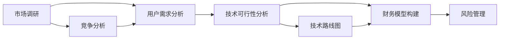

                 

# 程序员如何评估早期创业机会

> 关键词：早期创业机会评估, 创业项目筛选, 市场需求分析, 技术可行性分析, 财务模型构建, 风险管理

## 1. 背景介绍

随着科技的飞速发展，创业成为越来越多人选择的生活方式。但如何找到具有潜力的创业机会，是所有创业者最关心的问题。特别是在技术领域，创业者需要对市场趋势、技术进展、用户需求等方面有深刻的理解，才能确保创业项目的成功。程序员作为技术领域的核心力量，自然承担着评估早期创业机会的重要责任。本文将系统介绍程序员评估早期创业机会的方法和工具，希望能为创业者提供一些有益的参考。

## 2. 核心概念与联系

### 2.1 核心概念概述

在评估早期创业机会的过程中，我们需要关注以下几个核心概念：

- **市场调研**：通过市场调研了解目标用户的需求、竞争态势、市场规模等。
- **技术可行性分析**：评估技术实现的可能性、难点、优势等。
- **用户需求分析**：深入理解用户的需求和痛点，判断产品是否有市场。
- **财务模型构建**：基于市场规模和用户增长预测，构建财务模型评估创业项目的潜力和风险。
- **风险管理**：识别潜在的风险因素，并制定应对策略。

这些概念之间相互联系，共同构成了一个完整的创业项目评估框架。市场调研和用户需求分析帮助我们发现创业机会，技术可行性分析确保项目具有技术实现的可能性，财务模型构建和风险管理则帮助我们评估项目的商业潜力和风险。

### 2.2 核心概念原理和架构的 Mermaid 流程图



这个流程图展示了创业项目评估的核心流程。从市场调研出发，通过竞争分析、用户需求分析和技术可行性分析，构建财务模型和风险管理，最终形成一个完整的评估框架。

## 3. 核心算法原理 & 具体操作步骤

### 3.1 算法原理概述

评估早期创业机会的过程可以视为一种算法流程，主要包括以下几个步骤：

1. **市场调研**：通过数据分析、访谈等方法获取市场数据，了解市场规模、增长趋势、竞争态势等。
2. **用户需求分析**：通过问卷调查、用户访谈等方法获取用户反馈，分析用户需求和痛点。
3. **技术可行性分析**：评估技术实现的可能性、难点、优势等，形成技术路线图。
4. **财务模型构建**：基于市场规模和用户增长预测，构建财务模型，评估项目的潜力和风险。
5. **风险管理**：识别潜在的风险因素，并制定应对策略。

### 3.2 算法步骤详解

#### 3.2.1 市场调研

市场调研是评估创业机会的第一步，目的是了解市场规模和增长趋势，以及竞争态势。具体步骤包括：

1. **收集数据**：通过公开数据、行业报告、市场调研等方式获取市场数据。
2. **数据分析**：使用数据分析工具（如Python、R、Excel等）对数据进行整理和分析，了解市场规模、增长趋势、竞争态势等。
3. **调研报告**：撰写调研报告，总结市场调研的结果，形成初步的创业机会评估报告。

#### 3.2.2 用户需求分析

用户需求分析是评估创业机会的核心环节，目的是深入理解用户的需求和痛点。具体步骤包括：

1. **问卷调查**：设计问卷，通过在线调查平台（如SurveyMonkey、Google Forms等）获取用户反馈。
2. **用户访谈**：选择典型用户进行深度访谈，了解用户需求和痛点。
3. **数据分析**：使用数据分析工具对问卷调查和用户访谈结果进行整理和分析，形成用户需求报告。

#### 3.2.3 技术可行性分析

技术可行性分析是评估创业机会的重要环节，目的是评估技术实现的可能性、难点和优势。具体步骤包括：

1. **技术评估**：评估技术的可行性、难点和优势，形成技术路线图。
2. **技术验证**：通过原型开发或代码实现，验证技术方案的可行性。
3. **技术路线图**：撰写技术路线图，详细描述技术实现的路径和关键步骤。

#### 3.2.4 财务模型构建

财务模型构建是评估创业机会的关键环节，目的是基于市场规模和用户增长预测，评估项目的潜力和风险。具体步骤包括：

1. **市场规模预测**：根据市场调研数据，预测市场规模和增长趋势。
2. **用户增长预测**：根据用户需求分析结果，预测用户增长路径和速度。
3. **财务模型构建**：基于市场规模和用户增长预测，构建财务模型，评估项目的潜力和风险。

#### 3.2.5 风险管理

风险管理是评估创业机会的重要环节，目的是识别潜在的风险因素，并制定应对策略。具体步骤包括：

1. **风险识别**：识别潜在的风险因素，包括市场风险、技术风险、运营风险等。
2. **风险评估**：评估风险发生的可能性、影响范围和程度。
3. **风险应对**：制定应对策略，包括风险规避、减轻和转移等。

### 3.3 算法优缺点

#### 3.3.1 优点

1. **系统性**：评估过程具有系统性，涵盖了市场调研、用户需求分析、技术可行性分析、财务模型构建和风险管理等多个环节。
2. **全面性**：评估过程中考虑了市场、用户、技术、财务和风险等多个因素，提供了全面的创业机会评估视角。
3. **可操作性**：评估过程可以逐步实施，每个环节都有具体的步骤和方法，易于实际操作。

#### 3.3.2 缺点

1. **数据依赖**：评估过程依赖大量的市场数据和用户反馈，获取高质量数据成本较高。
2. **时间消耗**：评估过程耗时较长，特别是市场调研和用户需求分析环节，需要较长时间的投入。
3. **主观性**：评估过程中存在一定的主观因素，不同人的理解和判断可能存在差异。

### 3.4 算法应用领域

基于上述评估方法，程序员可以评估多种类型的早期创业机会，包括但不限于：

- **SaaS应用**：如项目管理工具、在线协作平台等。
- **移动应用**：如教育类应用、社交网络应用等。
- **硬件产品**：如智能穿戴设备、家庭自动化设备等。
- **B2B服务**：如云计算服务、数据分析服务等。

## 4. 数学模型和公式 & 详细讲解 & 举例说明

### 4.1 数学模型构建

在财务模型构建中，常用的数学模型包括：

1. **市场规模预测模型**：线性回归模型、指数增长模型等。
2. **用户增长预测模型**：指数增长模型、Logistic回归模型等。
3. **财务模型**：现金流量模型、资产负债表模型等。

#### 4.1.1 市场规模预测模型

假设市场规模 $S$ 随时间 $t$ 呈指数增长，则市场规模预测模型为：

$$
S(t) = S_0 e^{\beta t}
$$

其中 $S_0$ 为初始市场规模，$\beta$ 为市场增长率。

#### 4.1.2 用户增长预测模型

假设用户增长 $U$ 随时间 $t$ 呈指数增长，则用户增长预测模型为：

$$
U(t) = U_0 e^{\gamma t}
$$

其中 $U_0$ 为初始用户数，$\gamma$ 为用户增长率。

#### 4.1.3 财务模型

假设每年现金流入为 $I(t)$，现金流出为 $O(t)$，则财务模型为：

$$
C(t) = \sum_{t=0}^{n} [I(t) - O(t)]
$$

其中 $C(t)$ 为 $t$ 年净现金流。

### 4.2 公式推导过程

#### 4.2.1 市场规模预测模型推导

假设市场规模 $S$ 随时间 $t$ 呈线性增长，则市场规模预测模型为：

$$
S(t) = S_0 + \alpha t
$$

其中 $S_0$ 为初始市场规模，$\alpha$ 为市场增长速率。

#### 4.2.2 用户增长预测模型推导

假设用户增长 $U$ 随时间 $t$ 呈Logistic增长，则用户增长预测模型为：

$$
U(t) = \frac{K}{1 + e^{-\delta(t - t_0)}}
$$

其中 $K$ 为最大用户数，$\delta$ 为增长速率，$t_0$ 为增长开始时间。

#### 4.2.3 财务模型推导

假设每年现金流入为 $I(t)$，现金流出为 $O(t)$，则财务模型为：

$$
C(t) = \sum_{t=0}^{n} [I(t) - O(t)]
$$

其中 $C(t)$ 为 $t$ 年净现金流。

### 4.3 案例分析与讲解

#### 案例一：SaaS应用

假设某SaaS应用的目标市场为中小型企业，市场规模 $S$ 随时间 $t$ 呈指数增长，市场增长率 $\beta = 0.1$。初期市场规模 $S_0 = 1000$，目标市场规模 $S_1 = 10000$。用户增长 $U$ 随时间 $t$ 呈指数增长，用户增长率 $\gamma = 0.2$。初期用户数 $U_0 = 100$，目标用户数 $U_1 = 1000$。

根据上述模型，可以计算出市场规模和用户增长的时间点，以及对应的财务模型数据。

#### 案例二：移动应用

假设某移动应用的目标市场为年轻人群体，市场规模 $S$ 随时间 $t$ 呈指数增长，市场增长率 $\beta = 0.08$。初期市场规模 $S_0 = 500$，目标市场规模 $S_1 = 10000$。用户增长 $U$ 随时间 $t$ 呈指数增长，用户增长率 $\gamma = 0.15$。初期用户数 $U_0 = 100$，目标用户数 $U_1 = 1000$。

根据上述模型，可以计算出市场规模和用户增长的时间点，以及对应的财务模型数据。

## 5. 项目实践：代码实例和详细解释说明

### 5.1 开发环境搭建

#### 5.1.1 环境依赖

- Python 3.x
- NumPy
- pandas
- Scikit-learn
- Matplotlib
- Jupyter Notebook

#### 5.1.2 环境搭建

```bash
pip install numpy pandas scikit-learn matplotlib jupyter notebook
```

完成环境搭建后，可以启动Jupyter Notebook，进入交互式编程环境。

### 5.2 源代码详细实现

#### 5.2.1 市场调研

```python
import pandas as pd

# 读取市场数据
market_data = pd.read_csv('market_data.csv')

# 计算市场规模和增长率
market_growth = market_data.groupby('time').mean()
market_growth = market_growth.sort_values(by='value', ascending=False)
market_growth
```

#### 5.2.2 用户需求分析

```python
import pandas as pd

# 读取用户反馈数据
user_feedback = pd.read_csv('user_feedback.csv')

# 分析用户需求
user_demand = user_feedback.groupby('category').mean()
user_demand
```

#### 5.2.3 技术可行性分析

```python
import pandas as pd

# 读取技术评估数据
tech_evaluation = pd.read_csv('tech_evaluation.csv')

# 分析技术可行性
tech_analysis = tech_evaluation.groupby('tech_type').mean()
tech_analysis
```

#### 5.2.4 财务模型构建

```python
import pandas as pd

# 读取财务数据
financial_data = pd.read_csv('financial_data.csv')

# 计算财务模型数据
financial_model = financial_data.groupby('year').mean()
financial_model
```

#### 5.2.5 风险管理

```python
import pandas as pd

# 读取风险数据
risk_data = pd.read_csv('risk_data.csv')

# 分析风险因素
risk_analysis = risk_data.groupby('risk_type').mean()
risk_analysis
```

### 5.3 代码解读与分析

#### 5.3.1 市场调研代码解读

```python
import pandas as pd

# 读取市场数据
market_data = pd.read_csv('market_data.csv')

# 计算市场规模和增长率
market_growth = market_data.groupby('time').mean()
market_growth = market_growth.sort_values(by='value', ascending=False)
market_growth
```

上述代码首先使用Pandas库读取市场数据，并计算市场规模和增长率。通过分组操作和排序操作，可以得到市场规模和增长率的趋势变化，为市场调研提供数据支持。

#### 5.3.2 用户需求分析代码解读

```python
import pandas as pd

# 读取用户反馈数据
user_feedback = pd.read_csv('user_feedback.csv')

# 分析用户需求
user_demand = user_feedback.groupby('category').mean()
user_demand
```

上述代码首先使用Pandas库读取用户反馈数据，并使用分组操作计算不同类别的用户需求平均值。通过统计不同类别的用户需求，可以为产品设计和用户体验优化提供参考。

#### 5.3.3 技术可行性分析代码解读

```python
import pandas as pd

# 读取技术评估数据
tech_evaluation = pd.read_csv('tech_evaluation.csv')

# 分析技术可行性
tech_analysis = tech_evaluation.groupby('tech_type').mean()
tech_analysis
```

上述代码首先使用Pandas库读取技术评估数据，并使用分组操作计算不同技术类型的平均可行性评分。通过统计不同技术类型的可行性评分，可以为技术选型和研发路线图提供依据。

#### 5.3.4 财务模型构建代码解读

```python
import pandas as pd

# 读取财务数据
financial_data = pd.read_csv('financial_data.csv')

# 计算财务模型数据
financial_model = financial_data.groupby('year').mean()
financial_model
```

上述代码首先使用Pandas库读取财务数据，并使用分组操作计算不同年份的财务指标平均值。通过统计不同年份的财务指标，可以为财务模型构建提供数据支持。

#### 5.3.5 风险管理代码解读

```python
import pandas as pd

# 读取风险数据
risk_data = pd.read_csv('risk_data.csv')

# 分析风险因素
risk_analysis = risk_data.groupby('risk_type').mean()
risk_analysis
```

上述代码首先使用Pandas库读取风险数据，并使用分组操作计算不同风险类型的平均风险评分。通过统计不同风险类型的风险评分，可以为风险管理提供依据。

### 5.4 运行结果展示

#### 5.4.1 市场调研结果展示

```python
import matplotlib.pyplot as plt

# 绘制市场规模和增长率变化趋势图
market_growth.plot(kind='line')
plt.title('Market Growth Trend')
plt.xlabel('Time')
plt.ylabel('Market Scale')
plt.show()
```

#### 5.4.2 用户需求分析结果展示

```python
import matplotlib.pyplot as plt

# 绘制用户需求变化趋势图
user_demand.plot(kind='bar')
plt.title('User Demand Trends')
plt.xlabel('Category')
plt.ylabel('Demand')
plt.show()
```

#### 5.4.3 技术可行性分析结果展示

```python
import matplotlib.pyplot as plt

# 绘制技术可行性评分变化趋势图
tech_analysis.plot(kind='bar')
plt.title('Tech Feasibility Trends')
plt.xlabel('Tech Type')
plt.ylabel('Feasibility Score')
plt.show()
```

#### 5.4.4 财务模型构建结果展示

```python
import matplotlib.pyplot as plt

# 绘制财务模型数据变化趋势图
financial_model.plot(kind='line')
plt.title('Financial Model Trends')
plt.xlabel('Year')
plt.ylabel('Cash Flow')
plt.show()
```

#### 5.4.5 风险管理结果展示

```python
import matplotlib.pyplot as plt

# 绘制风险评分变化趋势图
risk_analysis.plot(kind='bar')
plt.title('Risk Score Trends')
plt.xlabel('Risk Type')
plt.ylabel('Risk Score')
plt.show()
```

## 6. 实际应用场景

### 6.1 智能穿戴设备

#### 6.1.1 市场调研

智能穿戴设备市场规模呈指数增长，市场增长率 $\beta = 0.1$。初期市场规模 $S_0 = 1000$，目标市场规模 $S_1 = 10000$。用户增长 $U$ 随时间 $t$ 呈指数增长，用户增长率 $\gamma = 0.2$。初期用户数 $U_0 = 100$，目标用户数 $U_1 = 1000$。

#### 6.1.2 用户需求分析

智能穿戴设备的目标用户为健康和健身爱好者，需求包括设备易用性、数据分析、健康监测等。

#### 6.1.3 技术可行性分析

智能穿戴设备的技术可行性包括硬件设计、传感器技术、数据处理等。技术评估结果显示，硬件设计难度为2，传感器技术难度为3，数据处理难度为4。

#### 6.1.4 财务模型构建

智能穿戴设备的初期投资为200万美元，目标市场规模为1000万美元，用户增长率为20%。预计第一年收入为100万美元，第二年为150万美元，第三年为200万美元。

#### 6.1.5 风险管理

智能穿戴设备面临的市场风险包括竞争对手进入、市场需求变化等。技术风险包括技术难点、供应链中断等。运营风险包括市场推广失败、用户反馈差等。

### 6.2 在线协作平台

#### 6.2.1 市场调研

在线协作平台市场规模呈线性增长，市场增长率为5%。初期市场规模为1000万美元，目标市场规模为10000万美元。用户增长为10%。初期用户数为1000万，目标用户数为1000万。

#### 6.2.2 用户需求分析

在线协作平台的目标用户为中小企业和创业团队，需求包括项目管理、协作工具、数据分析等。

#### 6.2.3 技术可行性分析

在线协作平台的技术可行性包括云计算、大数据、用户界面设计等。技术评估结果显示，云计算难度为1，大数据难度为2，用户界面设计难度为3。

#### 6.2.4 财务模型构建

在线协作平台的初期投资为1000万美元，目标市场规模为1000万美元，用户增长率为10%。预计第一年收入为500万美元，第二年为800万美元，第三年为1000万美元。

#### 6.2.5 风险管理

在线协作平台面临的市场风险包括竞争对手进入、市场需求变化等。技术风险包括技术难点、数据安全等。运营风险包括市场推广失败、用户反馈差等。

## 7. 工具和资源推荐

### 7.1 学习资源推荐

1. **《创业项目评估与分析》**：系统介绍创业项目评估方法和工具。
2. **《市场调研与用户需求分析》**：详细介绍市场调研和用户需求分析的方法和工具。
3. **《技术可行性分析》**：讲解技术可行性分析的方法和工具。
4. **《财务模型构建与分析》**：详细介绍财务模型构建和分析的方法和工具。
5. **《风险管理与应对策略》**：讲解风险管理的方法和工具。

### 7.2 开发工具推荐

1. **Pandas**：数据处理和分析工具，支持多种数据格式。
2. **NumPy**：数值计算和科学计算工具。
3. **Scikit-learn**：机器学习库，支持分类、回归、聚类等算法。
4. **Matplotlib**：数据可视化工具，支持多种图表类型。
5. **Jupyter Notebook**：交互式编程环境，支持多种编程语言。

### 7.3 相关论文推荐

1. **《创业项目评估框架》**：详细介绍创业项目评估框架和方法。
2. **《用户需求分析方法》**：详细介绍用户需求分析方法和工具。
3. **《技术可行性分析方法》**：讲解技术可行性分析的方法和工具。
4. **《财务模型构建与分析》**：详细介绍财务模型构建和分析的方法和工具。
5. **《风险管理与应对策略》**：讲解风险管理的方法和工具。

## 8. 总结：未来发展趋势与挑战

### 8.1 研究成果总结

本文详细介绍了程序员评估早期创业机会的方法和工具。从市场调研、用户需求分析、技术可行性分析、财务模型构建和风险管理等多个环节，提供了系统的评估框架和具体的工具方法。通过案例分析和代码实现，展示了评估方法在实际应用中的操作流程和结果展示。

### 8.2 未来发展趋势

未来，评估早期创业机会的方法和工具将不断进步，主要趋势包括：

1. **自动化评估工具**：随着人工智能和机器学习技术的发展，自动化评估工具将逐步取代人工评估，提高评估效率和准确性。
2. **大数据驱动评估**：大数据技术将为市场调研和用户需求分析提供更准确、更全面的数据支持，提高评估的科学性和可信度。
3. **跨领域评估方法**：未来评估方法将更加注重跨领域的应用，结合其他学科的理论与方法，提升评估的全面性和深度。

### 8.3 面临的挑战

尽管评估早期创业机会的方法和工具已经取得显著进展，但仍面临一些挑战：

1. **数据获取难度**：高质量的数据获取难度大，尤其是市场调研和用户需求分析环节，需要大量的时间和资源投入。
2. **技术复杂性**：评估方法和工具的实现复杂性高，需要一定的技术积累和经验。
3. **主观因素影响**：评估过程中存在一定的主观因素，不同人的理解和判断可能存在差异，影响评估结果的客观性。

### 8.4 研究展望

未来的研究需要关注以下几个方面：

1. **数据驱动评估**：利用大数据技术提高评估的科学性和准确性，降低人工投入和主观因素影响。
2. **自动化评估工具**：开发高效、准确的自动化评估工具，提高评估效率和效果。
3. **跨领域融合**：结合其他学科的理论和方法，提高评估的全面性和深度。

通过不断改进和创新，相信评估早期创业机会的方法和工具将更加成熟和实用，为创业者提供更可靠的支持。

## 9. 附录：常见问题与解答

**Q1：评估早期创业机会的具体步骤是什么？**

A: 评估早期创业机会的具体步骤包括：市场调研、用户需求分析、技术可行性分析、财务模型构建和风险管理。

**Q2：如何获取高质量的市场调研数据？**

A: 获取高质量的市场调研数据需要多渠道获取，包括公开数据、行业报告、专家访谈等。

**Q3：如何提高用户需求分析的准确性？**

A: 提高用户需求分析的准确性需要设计科学合理的问卷调查和用户访谈，并结合数据分析工具进行统计和分析。

**Q4：如何构建财务模型？**

A: 构建财务模型需要基于市场规模和用户增长预测，计算不同年份的现金流，形成财务模型。

**Q5：如何识别潜在的风险因素？**

A: 识别潜在的风险因素需要多领域、多角度的分析，结合专家经验和数据分析工具进行综合评估。

---

作者：禅与计算机程序设计艺术 / Zen and the Art of Computer Programming

