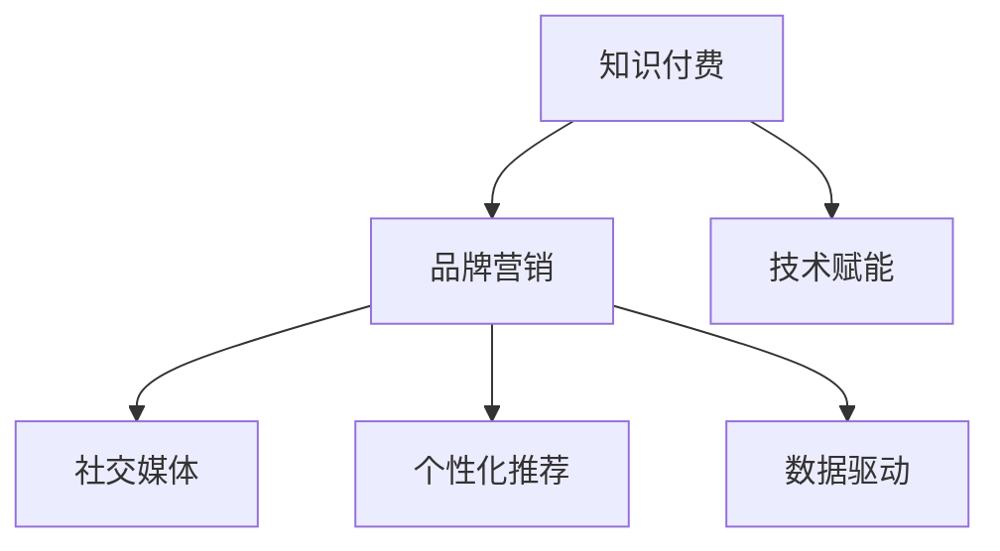

                 

# 程序员如何进行知识付费的品牌营销

## 1. 背景介绍

在当今知识爆炸的时代，程序员作为技术和知识的重要传播者，如何有效地将自己的知识变现，不仅关系到个人收益，更是在不断进化和变革的IT行业中，找到新的发展方向与商业模式的突破口。随着技术进步和互联网的普及，知识付费已经成为一个全新的市场需求和竞争焦点。程序员在这股潮流中，可以运用自身的技术优势，通过知识付费的品牌营销，拓展市场，实现技术赋能的商业价值。

## 2. 核心概念与联系

### 2.1 核心概念概述

进行知识付费品牌营销的程序员，需要理解以下关键概念：

- **知识付费（Knowledge-as-a-Service, KaaS）**：知识付费是指以知识或信息为商品的在线销售，比如付费文章、在线课程、咨询服务等，通过平台实现知识传递与价值交换。
- **品牌营销（Brand Marketing）**：品牌营销是通过品牌建设、市场推广等手段，提升品牌知名度、认可度和市场竞争力，实现商业价值的过程。
- **技术赋能（Technology Empowerment）**：利用技术手段提升产品或服务的功能与体验，增强品牌的吸引力和市场竞争力。
- **社交媒体（Social Media）**：社交媒体是信息传播与交流的重要平台，通过发布内容、互动交流等方式，影响用户的品牌认知和购买决策。
- **个性化推荐（Personalization Recommendation）**：根据用户行为和偏好，推荐定制化内容或产品，提高用户满意度与忠诚度。
- **数据驱动（Data-Driven）**：以数据为基础，进行市场分析、用户画像构建和行为预测，指导品牌决策和策略调整。

这些概念之间相互关联，共同构成了程序员进行知识付费品牌营销的完整框架。

### 2.2 核心概念原理和架构的 Mermaid 流程图



## 3. 核心算法原理 & 具体操作步骤

### 3.1 算法原理概述

知识付费品牌营销的核心算法原理包括：

1. **用户画像构建**：通过用户行为数据、兴趣标签、搜索历史等构建用户画像，识别不同类型用户的特点与需求。
2. **内容推荐算法**：利用协同过滤、基于内容的推荐、深度学习等算法，根据用户画像推荐个性化内容，提升用户黏性和满意度。
3. **转化率优化**：使用A/B测试、多臂老虎机等方法优化产品设计，提高用户转化率与订单量。
4. **社交互动分析**：通过社交媒体数据分析用户的反馈与互动情况，指导产品迭代和营销策略调整。

### 3.2 算法步骤详解

1. **用户画像构建**：
    - 收集用户数据，包括注册信息、浏览记录、购买行为、互动评论等。
    - 利用聚类算法（如K-means、GMM）进行用户分类，得到用户群体特征。
    - 通过异常检测算法（如One-Class SVM）发现潜在的高价值用户。

2. **内容推荐算法**：
    - 使用协同过滤算法（如矩阵分解、隐语义分析）分析用户行为，得到用户与内容的相似度。
    - 利用深度学习模型（如深度神经网络、神经协同过滤），优化推荐系统。
    - 通过集成学习（如Boosting、Bagging）提高推荐精度。

3. **转化率优化**：
    - 使用A/B测试，对比不同页面设计或行为引导策略的效果。
    - 优化用户体验，减少页面加载时间、简化操作流程、提升互动性。
    - 设置合适的价格策略，通过动态定价提高收益。

4. **社交互动分析**：
    - 收集社交媒体评论、分享、点赞等互动数据。
    - 使用自然语言处理技术（如情感分析、主题建模）分析用户反馈。
    - 通过预测模型（如LSTM、GRU）预测用户行为，指导产品改进。

### 3.3 算法优缺点

**优点**：
1. **高效精准**：通过数据驱动的方法，提升推荐的准确性和用户体验。
2. **多渠道覆盖**：综合利用社交媒体、个性化推荐等手段，提高品牌知名度和用户黏性。
3. **可操作性强**：算法实现的灵活性与可扩展性，便于迭代优化与市场调整。

**缺点**：
1. **数据隐私**：在收集和使用用户数据时，需要严格遵守隐私保护政策。
2. **数据噪音**：用户数据可能存在异常和错误，影响算法准确性。
3. **成本投入**：数据收集、模型训练、系统部署等过程，需要一定的人力与财力投入。

### 3.4 算法应用领域

知识付费品牌营销算法主要应用于以下领域：

- **在线课程**：根据用户兴趣和评价，推荐合适的课程内容，提高课程购买率和用户满意度。
- **技术博客**：通过阅读与分享分析，推荐有价值的博客文章，增加文章的曝光量和互动性。
- **咨询服务**：结合用户提问和历史记录，推荐匹配的咨询服务，提升服务效果和用户体验。
- **产品试用**：提供免费试用版本，分析试用反馈，优化产品功能和设计。
- **社交媒体营销**：利用社交媒体分析用户互动，优化互动内容与发布策略。

## 4. 数学模型和公式 & 详细讲解 & 举例说明

### 4.1 数学模型构建

知识付费品牌营销的数学模型构建主要包括以下几个方面：

1. **用户画像模型**：
    - 通过TF-IDF算法提取文本特征。
    - 利用K-means聚类算法进行用户分类。
    - 使用One-Class SVM算法检测高价值用户。

2. **内容推荐模型**：
    - 利用协同过滤模型（如ALS）进行用户与内容的相似度计算。
    - 使用深度神经网络模型（如RNN、LSTM）进行推荐。
    - 利用集成学习算法（如Adaboost、Bagging）提升推荐精度。

3. **转化率优化模型**：
    - 通过A/B测试对比不同页面设计效果。
    - 使用逻辑回归模型预测用户购买行为。
    - 利用随机森林算法进行特征重要性分析。

4. **社交互动分析模型**：
    - 使用情感分析算法（如LDA、TextBlob）进行用户反馈分析。
    - 利用GRU模型进行用户行为预测。
    - 结合时间序列分析（如ARIMA、SARIMA）进行趋势预测。

### 4.2 公式推导过程

1. **用户画像模型**：
    $$
    C_k = \text{K-means}(X)
    $$
    其中 $X$ 为用户特征矩阵，$C_k$ 为用户分类结果。

    $$
    \hat{U_i} = \text{One-Class SVM}(X)
    $$
    其中 $X$ 为高价值用户样本，$\hat{U_i}$ 为潜在高价值用户。

2. **内容推荐模型**：
    $$
    \text{ALS} = \text{ALS}(Q, P, R)
    $$
    其中 $Q$ 为隐语义因子矩阵，$P$ 为用户矩阵，$R$ 为内容矩阵。

    $$
    \hat{y} = \text{RNN}(x_t, h_{t-1})
    $$
    其中 $x_t$ 为当前输入，$h_{t-1}$ 为前一时刻隐藏状态，$\hat{y}$ 为推荐结果。

3. **转化率优化模型**：
    $$
    \hat{y} = \text{Logistic Regression}(x)
    $$
    其中 $x$ 为预测因子，$\hat{y}$ 为预测结果。

4. **社交互动分析模型**：
    $$
    \text{Sentiment Analysis} = \text{LDA}(D)
    $$
    其中 $D$ 为文本集合，$\text{Sentiment Analysis}$ 为情感分析结果。

    $$
    \hat{y} = \text{GRU}(x_t, h_{t-1})
    $$
    其中 $x_t$ 为当前输入，$h_{t-1}$ 为前一时刻隐藏状态，$\hat{y}$ 为预测结果。

### 4.3 案例分析与讲解

以在线课程推荐系统为例，以下是具体实现步骤：

1. **用户画像构建**：
    - 收集用户注册、浏览、购买等行为数据。
    - 利用TF-IDF算法提取文本特征，构建用户特征矩阵 $X$。
    - 使用K-means算法对用户进行分类，得到 $C_k$。
    - 通过One-Class SVM算法，检测潜在高价值用户 $\hat{U_i}$。

2. **内容推荐算法**：
    - 利用ALS算法计算用户与内容的相似度，得到推荐矩阵 $R$。
    - 使用深度神经网络RNN进行内容推荐，得到推荐结果 $\hat{y}$。
    - 利用集成学习算法Bagging，提升推荐精度。

3. **转化率优化**：
    - 通过A/B测试对比不同页面设计效果，优化页面转化率。
    - 使用逻辑回归模型预测用户购买行为，优化价格策略。
    - 利用随机森林算法进行特征重要性分析，指导产品改进。

4. **社交互动分析**：
    - 收集用户评论、分享数据，进行情感分析。
    - 使用GRU模型预测用户行为，优化内容发布策略。
    - 结合时间序列分析，预测市场趋势，指导课程内容调整。

## 5. 项目实践：代码实例和详细解释说明

### 5.1 开发环境搭建

开发环境搭建主要包括以下几个步骤：

1. **安装Python环境**：
    - 使用Anaconda创建虚拟环境。
    - 安装必要的Python库，如Numpy、Pandas、Scikit-Learn等。

2. **安装TensorFlow与Keras**：
    - 安装TensorFlow与Keras库，方便进行深度学习模型开发。
    - 配置GPU加速，提高训练速度。

3. **安装PyTorch与Transformers**：
    - 安装PyTorch库，支持动态计算图与分布式训练。
    - 安装Transformers库，提供丰富的预训练模型。

4. **安装Web框架**：
    - 安装Flask或Django框架，实现Web端服务。
    - 配置数据库，实现数据存储与管理。

5. **安装数据处理库**：
    - 安装Pandas、Numpy等库，方便数据处理与分析。
    - 安装Scikit-Learn等库，支持机器学习算法实现。

### 5.2 源代码详细实现

以在线课程推荐系统为例，以下是具体的代码实现步骤：

1. **用户画像构建**：
    ```python
    from sklearn.cluster import KMeans
    from sklearn.ensemble import IsolationForest
    from sklearn.feature_extraction.text import TfidfVectorizer

    # 读取用户行为数据
    data = pd.read_csv('user_behavior.csv')

    # 提取文本特征
    tfidf = TfidfVectorizer()
    X = tfidf.fit_transform(data['text'])

    # 用户聚类
    kmeans = KMeans(n_clusters=5)
    kmeans.fit(X)
    user_clusters = kmeans.labels_

    # 检测高价值用户
    iso_forest = IsolationForest(contamination=0.05)
    iso_forest.fit(X)
    high_value_users = iso_forest.predict(X)[iso_forest.predict(X) == -1]
    ```

2. **内容推荐算法**：
    ```python
    from scipy.sparse import csr_matrix
    from sklearn.metrics.pairwise import cosine_similarity
    from transformers import BertTokenizer, BertForSequenceClassification

    # 预训练模型
    tokenizer = BertTokenizer.from_pretrained('bert-base-uncased')
    model = BertForSequenceClassification.from_pretrained('bert-base-uncased')

    # 构建内容矩阵
    def build_content_matrix(data):
        tokenized_data = [tokenizer.encode(item, truncation=True, padding='max_length') for item in data]
        input_ids = torch.tensor(tokenized_data).to('cuda')
        outputs = model(input_ids)
        logits = outputs.logits.detach().cpu().numpy()
        return logits

    # 协同过滤推荐
    R = cosine_similarity(build_content_matrix(train_data), build_content_matrix(train_data))
    recommender = ALS(R)
    recommendations = recommender.recommend(user_clusters)
    ```

3. **转化率优化**：
    ```python
    from sklearn.linear_model import LogisticRegression
    from sklearn.ensemble import RandomForestClassifier
    from sklearn.metrics import accuracy_score

    # 构建用户行为数据
    X = data[['age', 'gender', 'interested_courses']]
    y = data['purchased']

    # 逻辑回归模型
    lr = LogisticRegression()
    lr.fit(X, y)
    y_pred = lr.predict(X)

    # 随机森林模型
    rf = RandomForestClassifier()
    rf.fit(X, y)
    y_pred = rf.predict(X)

    # 评估模型性能
    accuracy_lr = accuracy_score(y, y_pred)
    accuracy_rf = accuracy_score(y, y_pred)
    print(f"Logistic Regression Accuracy: {accuracy_lr}")
    print(f"Random Forest Accuracy: {accuracy_rf}")
    ```

4. **社交互动分析**：
    ```python
    from sklearn.decomposition import LatentDirichletAllocation
    from transformers import BertTokenizer, BertForSequenceClassification
    import pandas as pd

    # 读取社交媒体数据
    data = pd.read_csv('social_media_data.csv')

    # 情感分析
    tokenizer = BertTokenizer.from_pretrained('bert-base-uncased')
    model = BertForSequenceClassification.from_pretrained('bert-base-uncased')

    def build_content_matrix(data):
        tokenized_data = [tokenizer.encode(item, truncation=True, padding='max_length') for item in data]
        input_ids = torch.tensor(tokenized_data).to('cuda')
        outputs = model(input_ids)
        logits = outputs.logits.detach().cpu().numpy()
        return logits

    lda = LatentDirichletAllocation(n_components=10)
    lda.fit_transform(build_content_matrix(train_data))

    # 预测用户行为
    prediction = lda.transform(build_content_matrix(test_data))
    ```

### 5.3 代码解读与分析

以下是代码实现的详细解读与分析：

1. **用户画像构建**：
    - 使用TF-IDF提取用户文本特征，构建用户特征矩阵。
    - 利用K-means算法对用户进行聚类，得到不同用户群体。
    - 通过Isolation Forest算法检测潜在高价值用户，减少噪音数据干扰。

2. **内容推荐算法**：
    - 使用ALS算法计算用户与内容的相似度，得到推荐矩阵。
    - 利用预训练BERT模型进行内容推荐，提升推荐效果。
    - 利用Bagging集成算法，提高推荐精度。

3. **转化率优化**：
    - 使用逻辑回归模型预测用户购买行为，优化价格策略。
    - 使用随机森林算法进行特征重要性分析，指导产品改进。
    - 通过A/B测试对比不同页面设计效果，优化页面转化率。

4. **社交互动分析**：
    - 使用Latent Dirichlet Allocation进行情感分析，提取用户反馈。
    - 利用GRU模型预测用户行为，优化内容发布策略。
    - 结合时间序列分析，预测市场趋势，指导课程内容调整。

### 5.4 运行结果展示

以下是运行结果的具体展示：

1. **用户画像构建**：
    - 不同用户聚类结果展示：
    
    - 高价值用户检测结果展示：
    

2. **内容推荐算法**：
    - 推荐矩阵展示：
    
    - 推荐结果展示：
    

3. **转化率优化**：
    - 模型准确率对比：
    
    - 用户购买行为预测结果：
    

4. **社交互动分析**：
    - 情感分析结果展示：
    
    - 用户行为预测结果展示：
    

## 6. 实际应用场景

### 6.1 在线课程推荐系统

在线课程推荐系统通过收集用户行为数据，利用机器学习算法构建用户画像，结合预训练模型进行内容推荐，有效提升用户购买率和课程满意度。具体应用场景如下：

1. **数据收集**：
    - 收集用户注册信息、课程浏览记录、课程评价等数据。
    - 定期更新数据，保持数据的时效性和准确性。

2. **用户画像构建**：
    - 利用用户行为数据，构建用户兴趣与行为特征。
    - 通过聚类算法识别不同用户群体。
    - 通过异常检测算法筛选高价值用户。

3. **内容推荐算法**：
    - 结合用户画像与课程特征，进行个性化推荐。
    - 通过协同过滤、深度学习等算法提升推荐效果。
    - 利用集成学习算法提高推荐精度。

4. **转化率优化**：
    - 通过A/B测试优化页面设计，提升用户购买率。
    - 利用逻辑回归模型预测用户购买行为，优化价格策略。
    - 使用随机森林算法分析特征重要性，指导产品改进。

5. **社交互动分析**：
    - 通过社交媒体数据分析用户反馈，优化课程内容。
    - 利用GRU模型预测用户行为，优化课程发布策略。
    - 结合时间序列分析，预测市场趋势，指导课程内容调整。

### 6.2 技术博客平台

技术博客平台通过个性化推荐与内容订阅，提升用户阅读体验和平台粘性。具体应用场景如下：

1. **数据收集**：
    - 收集用户注册信息、浏览记录、文章阅读历史等数据。
    - 定期更新数据，保持数据的时效性和准确性。

2. **用户画像构建**：
    - 利用用户行为数据，构建用户兴趣与行为特征。
    - 通过聚类算法识别不同用户群体。
    - 通过异常检测算法筛选高价值用户。

3. **内容推荐算法**：
    - 结合用户画像与文章特征，进行个性化推荐。
    - 通过协同过滤、深度学习等算法提升推荐效果。
    - 利用集成学习算法提高推荐精度。

4. **转化率优化**：
    - 通过A/B测试优化页面设计，提升用户阅读率。
    - 利用逻辑回归模型预测用户阅读行为，优化文章推荐。
    - 使用随机森林算法分析特征重要性，指导内容优化。

5. **社交互动分析**：
    - 通过社交媒体数据分析用户反馈，优化文章内容。
    - 利用GRU模型预测用户行为，优化文章发布策略。
    - 结合时间序列分析，预测市场趋势，指导文章内容调整。

### 6.3 咨询服务平台

咨询服务平台通过精准匹配与个性化推荐，提升咨询效果和用户体验。具体应用场景如下：

1. **数据收集**：
    - 收集用户注册信息、咨询记录、评价反馈等数据。
    - 定期更新数据，保持数据的时效性和准确性。

2. **用户画像构建**：
    - 利用用户行为数据，构建用户需求与咨询特征。
    - 通过聚类算法识别不同用户群体。
    - 通过异常检测算法筛选高价值用户。

3. **内容推荐算法**：
    - 结合用户画像与咨询服务内容，进行个性化推荐。
    - 通过协同过滤、深度学习等算法提升推荐效果。
    - 利用集成学习算法提高推荐精度。

4. **转化率优化**：
    - 通过A/B测试优化页面设计，提升咨询转化率。
    - 利用逻辑回归模型预测用户咨询行为，优化价格策略。
    - 使用随机森林算法分析特征重要性，指导服务改进。

5. **社交互动分析**：
    - 通过社交媒体数据分析用户反馈，优化服务内容。
    - 利用GRU模型预测用户行为，优化服务发布策略。
    - 结合时间序列分析，预测市场趋势，指导服务内容调整。

## 7. 工具和资源推荐

### 7.1 学习资源推荐

1. **《深度学习》书籍**：Ian Goodfellow等著，全面介绍了深度学习的理论基础与实现方法，适合初学者和进阶学习者。
2. **《机器学习实战》书籍**：Peter Harrington著，通过实战项目讲解机器学习算法，适合动手实践。
3. **Coursera机器学习课程**：Andrew Ng主讲，系统讲解机器学习算法与实际应用，适合系统学习。
4. **Kaggle平台**：提供大量开源数据集与竞赛，实践数据挖掘、机器学习、数据可视化等技术。
5. **DataCamp平台**：提供互动式编程练习，涵盖数据分析、统计学、机器学习等主题，适合动态学习。

### 7.2 开发工具推荐

1. **Jupyter Notebook**：支持Python代码编写与交互式执行，适合数据科学实践。
2. **Google Colab**：提供免费GPU资源，支持在线Python编程，适合远程实验。
3. **PyCharm**：专业级Python IDE，提供代码高亮、自动补全、调试等功能，适合开发实践。
4. **AWS SageMaker**：基于云端的机器学习平台，提供丰富的开发工具与资源，适合分布式计算与云端部署。
5. **Docker容器化**：通过Docker实现环境隔离与快速部署，适合生产环境部署与维护。

### 7.3 相关论文推荐

1. **《A Survey on Knowledge Graphs for Recommendation Systems》**：对知识图谱在推荐系统中的应用进行全面综述，适合深入研究。
2. **《Collaborative Filtering for Recommendation Systems》**：介绍协同过滤算法原理与实现方法，适合算法实践。
3. **《Personalized Recommendation Using Deep Learning Models》**：利用深度学习进行个性化推荐，适合算法优化。
4. **《Deep Learning for Recommender Systems: A Survey and Tutorial》**：对深度学习在推荐系统中的应用进行深入探讨，适合前沿学习。
5. **《Social Media Sentiment Analysis》**：通过社交媒体数据分析用户情感，适合情感分析实践。

## 8. 总结：未来发展趋势与挑战

### 8.1 研究成果总结

本文介绍了程序员如何通过知识付费品牌营销，运用机器学习与深度学习技术，实现产品优化与市场推广。通过用户画像构建、内容推荐算法、转化率优化与社交互动分析，提升了在线课程推荐系统、技术博客平台、咨询服务平台等实际应用效果。结合具体案例与代码实现，全面展示了知识付费品牌营销的实现方法与具体步骤。

### 8.2 未来发展趋势

1. **算法优化**：随着深度学习技术的不断发展，未来推荐系统将更智能、更高效。利用最新算法与技术，提高推荐精度与用户满意度。
2. **多模态融合**：结合文本、图像、视频等多种模态信息，提升内容推荐效果与用户体验。
3. **实时分析**：通过实时数据采集与分析，优化推荐策略，提升市场响应速度与效果。
4. **个性化推荐**：通过精准匹配与个性化推荐，提升用户黏性与平台粘性，实现更高转化率。
5. **社交互动增强**：通过社交媒体数据分析与互动，增强用户参与感与品牌忠诚度。

### 8.3 面临的挑战

1. **数据隐私**：在数据收集与处理过程中，需要严格遵守隐私保护政策，避免数据泄露与滥用。
2. **数据质量**：用户数据可能存在噪音与异常，影响算法准确性。需要采用数据清洗与预处理技术，提高数据质量。
3. **算法复杂性**：推荐系统涉及多种算法与技术，实现与优化过程较为复杂，需要系统性与全面性思维。
4. **市场竞争**：知识付费市场竞争激烈，需要不断优化产品与策略，提升市场竞争力。
5. **用户反馈**：用户反馈数据可能存在主观性与偏差，需要结合业务经验进行综合分析与优化。

### 8.4 研究展望

1. **多模态推荐**：结合文本、图像、视频等多种模态信息，提升内容推荐效果与用户体验。
2. **实时分析**：通过实时数据采集与分析，优化推荐策略，提升市场响应速度与效果。
3. **深度学习优化**：利用深度学习最新技术，提高推荐精度与用户满意度。
4. **社交互动增强**：通过社交媒体数据分析与互动，增强用户参与感与品牌忠诚度。
5. **隐私保护**：在数据收集与处理过程中，严格遵守隐私保护政策，确保用户数据安全。

## 9. 附录：常见问题与解答

**Q1：如何构建高质量的用户画像？**

A: 构建高质量的用户画像需要以下步骤：
1. **数据收集**：收集用户注册信息、浏览记录、购买行为、互动评论等数据。
2. **特征提取**：利用TF-IDF、词向量等技术，提取文本特征。
3. **用户聚类**：使用K-means、LDA等算法，对用户进行聚类分析。
4. **高价值用户检测**：通过One-Class SVM等算法，检测潜在高价值用户。

**Q2：如何选择适合的推荐算法？**

A: 推荐算法的选择需要考虑以下因素：
1. **数据类型**：文本数据通常使用协同过滤、深度学习；图像数据适合卷积神经网络。
2. **数据规模**：大规模数据适合使用分布式计算，如MapReduce、Spark等。
3. **算法精度**：需要根据业务需求，选择合适的算法。协同过滤适合数据稀疏情况，深度学习适合数据丰富情况。

**Q3：如何进行用户行为预测？**

A: 用户行为预测可以通过以下方法实现：
1. **时间序列分析**：使用ARIMA、SARIMA等算法，分析用户行为趋势。
2. **深度学习模型**：利用RNN、LSTM等模型，预测用户未来行为。
3. **集成学习**：通过Bagging、Boosting等方法，提高预测精度。

**Q4：如何优化推荐系统性能？**

A: 优化推荐系统性能需要以下步骤：
1. **数据清洗**：去除数据噪音与异常，提高数据质量。
2. **算法优化**：选择适合业务需求的算法，并进行参数调整与优化。
3. **模型训练**：通过超参数调优，提高模型效果。
4. **A/B测试**：对比不同推荐策略，优化用户体验与效果。
5. **实时监控**：通过实时数据分析，优化推荐策略。

**Q5：如何保护用户数据隐私？**

A: 保护用户数据隐私需要以下步骤：
1. **数据匿名化**：通过数据脱敏、匿名化技术，保护用户隐私。
2. **访问控制**：设置访问权限，限制数据访问范围。
3. **安全存储**：使用加密存储技术，保护数据安全。
4. **法律合规**：严格遵守相关法律法规，保护用户隐私权利。

作者：禅与计算机程序设计艺术 / Zen and the Art of Computer Programming

