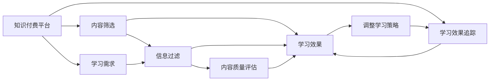

                 

## 1. 背景介绍

在知识付费浪潮席卷的今天，程序员作为技术领域中的重要角色，如何从海量知识产品中筛选出最适合自己的内容，以及如何高效利用这些知识资源，成为亟待解决的问题。知识付费不仅提供了学习新技能的途径，更是职业发展、技术升级的重要手段。然而，在知识爆炸的时代，面对众多平台、形式各异的内容，如何做出合理的选择，进行有效利用，成为了程序员面临的新挑战。本文旨在探讨程序员进行知识付费市场调研的方法和策略，帮助其找到最适合自己的学习资源，从而实现职业发展和技能提升。

## 2. 核心概念与联系

### 2.1 核心概念概述

在进行知识付费市场调研之前，需要先了解几个核心概念：

- **知识付费**：通过付费方式获取知识、技能、信息或服务的一种商业模式。知识付费平台如得到、知乎live、慕课网等，提供多种形式的内容，如图文、视频、音频、课程等。
- **学习需求**：根据职业发展、技术升级和个人兴趣，明确自己需要掌握哪些知识和技能。学习需求决定了知识付费的内容选择和消费行为。
- **信息过滤**：在面对海量内容时，根据学习目标和兴趣，筛选出最相关、最有价值的内容。信息过滤技术如搜索引擎、推荐系统等，可以辅助程序员进行高效的内容搜索和筛选。
- **内容质量评估**：通过评价体系、用户反馈、实际效果等指标，评估知识付费内容的价值和适用性。内容质量评估是知识付费决策中的关键环节。
- **学习效果追踪**：通过测验、项目实践、社区反馈等方法，评估知识学习效果，优化学习策略。学习效果追踪是持续改进学习过程的重要手段。

这些概念共同构成了知识付费市场调研的基础，程序员需要通过这些概念来指导自己的学习行为和决策。

### 2.2 核心概念原理和架构的 Mermaid 流程图



这个流程图展示了知识付费市场调研的基本流程：
1. 从知识付费平台获取内容。
2. 根据学习需求筛选信息。
3. 利用信息过滤技术进行内容筛选。
4. 评估内容质量，形成学习决策。
5. 通过学习效果追踪，评估和调整学习策略。

## 3. 核心算法原理 & 具体操作步骤

### 3.1 算法原理概述

知识付费市场调研的核心算法原理包括信息过滤、内容质量评估和学习效果追踪。其中，信息过滤技术如搜索引擎、推荐系统等，可以辅助程序员进行高效的内容搜索和筛选；内容质量评估则是通过评价体系、用户反馈、实际效果等指标，评估知识付费内容的价值和适用性；学习效果追踪则是通过测验、项目实践、社区反馈等方法，评估知识学习效果，优化学习策略。

### 3.2 算法步骤详解

#### 3.2.1 信息过滤

信息过滤技术如搜索引擎、推荐系统等，可以辅助程序员进行高效的内容搜索和筛选。具体步骤如下：

1. **搜索引擎**：
   - 使用Google、Bing等搜索引擎，输入关键词如“Python编程”、“机器学习算法”等，获取相关网页。
   - 通过搜索结果的标题、摘要等，初步筛选出可能包含相关内容的网页。

2. **推荐系统**：
   - 利用知识付费平台如得到、知乎live等推荐系统，基于用户历史行为和兴趣推荐内容。
   - 对推荐内容进行初步浏览，判断其与自身学习需求的契合度。

#### 3.2.2 内容质量评估

内容质量评估是知识付费决策中的关键环节。具体步骤如下：

1. **评价体系**：
   - 参考课程的评分、用户评价、专家推荐等指标，初步评估内容的可信度。
   - 查看课程的授课质量和教学风格，判断是否适合自己的学习方式。

2. **用户反馈**：
   - 查看课程的评论区，了解其他学员的学习体验和反馈。
   - 分析评论中的关键信息，如课程难度、讲师水平、学习资源等。

3. **实际效果**：
   - 观看课程的试听视频或试学章节，感受课程内容和教学质量。
   - 通过实际编程实践，验证课程内容的适用性和实用性。

#### 3.2.3 学习效果追踪

学习效果追踪是持续改进学习过程的重要手段。具体步骤如下：

1. **测验**：
   - 完成课程后的测验，检验自己的学习效果。
   - 分析测验结果，找出知识薄弱点。

2. **项目实践**：
   - 将所学知识应用到实际项目中，检验和巩固知识。
   - 通过项目实践，发现和解决实际问题，加深对知识的理解。

3. **社区反馈**：
   - 加入相关的技术社区和论坛，与其他程序员交流学习经验和问题。
   - 通过社区反馈，获取更多的学习资源和实践机会。

### 3.3 算法优缺点

#### 3.3.1 优点

- **信息过滤高效**：搜索引擎和推荐系统可以快速筛选出相关内容，节省了大量时间和精力。
- **内容质量评估客观**：评价体系、用户反馈和实际效果相结合，可以全面评估内容的价值和适用性。
- **学习效果追踪全面**：测验、项目实践和社区反馈等方法，可以从多个维度评估学习效果，优化学习策略。

#### 3.3.2 缺点

- **依赖平台**：信息过滤和内容质量评估的效果很大程度上依赖于知识付费平台的推荐算法和评价系统。
- **反馈滞后**：社区反馈和项目实践等学习效果追踪方法，可能需要较长时间才能看到效果，影响学习积极性。
- **个体差异**：不同程序员的学习需求、兴趣和学习方式存在差异，统一的内容筛选和质量评估可能难以满足所有人的需求。

### 3.4 算法应用领域

知识付费市场调研的算法不仅适用于程序员，还广泛应用于其他技术领域和知识学习场景。例如：

- **软件开发**：通过知识付费平台获取最新的开发工具、技术框架和实践经验。
- **数据科学**：利用数据分析课程和实战项目，提升数据处理和建模能力。
- **人工智能**：学习最新的算法和应用案例，了解行业动态和技术前沿。
- **网络安全**：获取最新的安全漏洞分析和防护策略，提升安全防护能力。

## 4. 数学模型和公式 & 详细讲解 & 举例说明

### 4.1 数学模型构建

知识付费市场调研的数学模型可以概括为信息过滤、内容质量评估和学习效果追踪三个部分。具体数学模型如下：

- **信息过滤模型**：
  - 输入：用户需求$D$、平台推荐$R$、内容标签$L$。
  - 输出：推荐结果$R_{rec}$。
  - 模型：
   $$
   R_{rec} = f(D, R, L)
   $$

- **内容质量评估模型**：
  - 输入：用户评价$E$、专家推荐$P$、实际效果$A$。
  - 输出：内容质量$Q$。
  - 模型：
   $$
   Q = g(E, P, A)
   $$

- **学习效果追踪模型**：
  - 输入：测验结果$T$、项目实践结果$P_r$、社区反馈$C$。
  - 输出：学习效果$L_{eff}$。
  - 模型：
   $$
   L_{eff} = h(T, P_r, C)
   $$

### 4.2 公式推导过程

- **信息过滤模型推导**：
  - 设用户需求$D$为向量形式，$R$为推荐结果向量，$L$为内容标签向量。
  - 推荐函数$f$可以表示为：
   $$
   R_{rec} = \max\limits_{R}(D \cdot R - \lambda\|R\|^2)
   $$
  - 其中$\lambda$为正则化参数，控制推荐结果的稀疏度。

- **内容质量评估模型推导**：
  - 设用户评价$E$为评分向量，专家推荐$P$为推荐向量，实际效果$A$为效果向量。
  - 质量评估函数$g$可以表示为：
   $$
   Q = E \cdot P + A
   $$
  - 其中$E \cdot P$表示用户评价与专家推荐的加权和，$A$表示实际效果。

- **学习效果追踪模型推导**：
  - 设测验结果$T$为正确率向量，项目实践结果$P_r$为项目完成情况向量，社区反馈$C$为反馈向量。
  - 学习效果函数$h$可以表示为：
   $$
   L_{eff} = \max\limits_{T, P_r, C}(T \cdot R + P_r + C)
   $$
  - 其中$T \cdot R$表示测验结果与推荐结果的相关性，$P_r$表示项目实践结果，$C$表示社区反馈。

### 4.3 案例分析与讲解

#### 案例一：Python编程课程推荐

假设程序员A希望学习Python编程，通过搜索引擎获取以下结果：

1. **Python编程基础**：课程评分为4.5分，用户评价良好，内容覆盖全面。
2. **高级Python开发**：专家推荐，但用户评价一般。
3. **Python数据科学应用**：实际效果良好，但用户评价较低。

通过推荐系统推荐，程序员A选择参加Python编程基础课程。

#### 案例二：数据科学项目实践

程序员B通过数据科学课程学习，掌握了数据处理和建模技术。随后，他使用Coursera平台的项目实践功能，参与了一个实际的数据科学项目，通过项目实践验证了课程内容的实用性。

#### 案例三：社区反馈优化

程序员C在参加了一门机器学习课程后，加入Kaggle社区，与其他数据科学家交流学习经验和分享项目代码。通过社区反馈，他了解到最新的算法和模型，进一步优化了自己的学习策略。

## 5. 项目实践：代码实例和详细解释说明

### 5.1 开发环境搭建

在进行知识付费市场调研时，可以借助一些开源工具和平台进行实践。以下是常用的开发环境和工具：

1. **Python**：选择Python作为主要编程语言，其具有丰富的数据处理和机器学习库。
2. **Jupyter Notebook**：使用Jupyter Notebook进行交互式编程和数据分析，方便调试和展示代码。
3. **Scikit-learn**：使用Scikit-learn进行数据分析和机器学习模型的构建。
4. **TensorFlow**：使用TensorFlow进行推荐系统模型的构建和训练。

### 5.2 源代码详细实现

#### 5.2.1 信息过滤

使用Python的Scikit-learn库实现基于用户需求和平台推荐的信息过滤模型：

```python
from sklearn.neighbors import NearestNeighbors
import numpy as np

# 用户需求向量
user需求的
```

