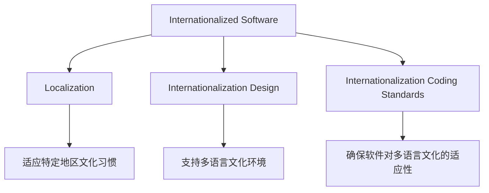
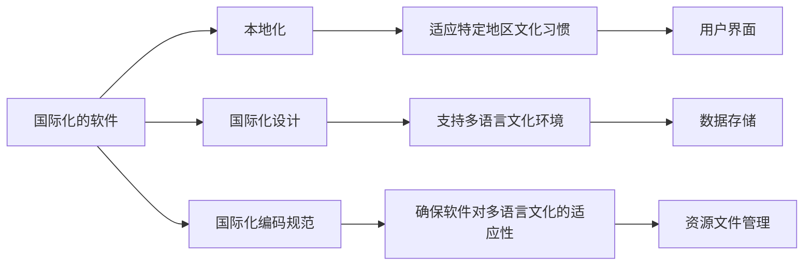

                 

# 程序员的国际化发展：机遇与挑战

## 1. 背景介绍

随着全球化浪潮的不断推进，IT行业也逐渐融入了国际化的洪流之中。国际化的程序开发已经成为技术团队在竞争激烈的全球市场中脱颖而出的关键。本篇文章将从国际化程序的开发背景入手，深入探讨国际化的核心概念，并概述当前国际化的发展趋势和面临的挑战。

## 2. 核心概念与联系

### 2.1 核心概念概述

在探讨国际化开发的本质之前，首先明确几个关键概念。

- **国际化程序（Internationalized Software）**：通常指能够适应多语言、多文化环境的软件，可以在全球范围内使用，且能正确处理不同地区语言、日期、时间等文化差异。

- **本地化（Localization）**：将国际化的软件根据特定地区文化习惯进行调整，以满足不同地区用户的实际需求。例如，根据本地语言格式调整日期和时间显示。

- **国际化设计（Internationalization Design）**：在软件设计和开发阶段引入国际化考虑，确保软件对未来支持多语言文化环境的潜在需求有相应的设计和机制。

- **国际化编码规范（Internationalization Coding Standards）**：在编码实践中遵循的约定和规范，如使用Unicode编码、避免使用特定语言相关的API，确保软件能支持多种语言和文化环境。

这些概念间的关系可以用以下Mermaid流程图进行描述：



### 2.2 核心概念原理和架构的 Mermaid 流程图

接下来，详细说明这些概念之间的原理和架构关系：



- **国际化的软件**：
    - **本地化**：通过**特定地区文化习惯**，调整**用户界面**，如将日期格式从DD/MM/YYYY调整为MM/DD/YYYY。
    - **国际化设计**：使用**国际化编码规范**，确保**数据存储**和**资源文件管理**能适应多种语言环境。
- **本地化**：与**特定地区文化习惯**紧密结合，确保**用户界面**显示符合本地习惯。
- **国际化设计**：通过**国际化编码规范**，支持**多语言文化环境**和**资源文件管理**，从而降低**本地化**的成本。
- **国际化编码规范**：为**国际化的软件**提供必要的机制，确保软件能支持**特定地区文化习惯**和**多语言文化环境**。

这些流程节点帮助我们理解国际化软件的核心设计和实现逻辑。

## 3. 核心算法原理 & 具体操作步骤

### 3.1 算法原理概述

**国际化算法**主要包含以下几个步骤：

1. **字符集转换**：将不同字符集的数据转换为Unicode编码，确保数据能正确处理和显示。
2. **日期和时间处理**：根据本地化设置，将日期和时间转换为用户习惯的显示格式。
3. **货币符号和数字格式化**：根据本地货币符号和数字格式进行格式化，以符合地区要求。
4. **文本处理**：根据不同语言处理文本的语序、大小写等差异，确保文本的可读性。

### 3.2 算法步骤详解

假设有一款国际化软件需要处理日期、时间、货币等多项本地化设置，具体操作步骤如下：

**步骤1：字符集转换**

- 在软件中引入**Unicode字符集**，确保所有数据均能正确处理和显示。
- 使用Python内置的**`codecs`模块**进行字符集转换。

```python
import codecs

# 假设原始文本为GBK编码
text = b'你好，世界！'
encoded_text = codecs.encode(text, 'utf-8')
decoded_text = codecs.decode(encoded_text, 'gbk')
```

**步骤2：日期和时间处理**

- 在软件中引入**`time`**模块，使用**`strftime`和`strptime`**函数进行日期时间格式化。
- 根据地区设置动态生成日期时间格式字符串。

```python
import time
import locale

# 获取当前用户语言环境
user_language = locale.getdefaultlocale()[0]

# 根据语言环境设置日期时间格式
if user_language == 'zh_CN.UTF-8':
    date_format = '%Y-%m-%d'
    time_format = '%H:%M:%S'
else:
    date_format = '%m/%d/%Y'
    time_format = '%H:%M:%S'

# 生成日期和时间
now = time.localtime()
formatted_date = time.strftime(date_format, now)
formatted_time = time.strftime(time_format, now)
```

**步骤3：货币符号和数字格式化**

- 在软件中引入**`locale`模块**，使用**`currency`和`number`**函数进行货币和数字格式化。
- 根据地区设置生成货币符号和数字格式字符串。

```python
# 获取当前用户货币环境
user_currency = locale.getcurrency()

# 生成货币符号和数字格式
currency_symbol = user_currency + ' '
formatted_number = locale.currency(12345.67, grouping=True)
```

**步骤4：文本处理**

- 在软件中引入**`nltk`模块**，使用**`WordNet`和`Langdetect`**进行文本处理。
- 根据不同语言处理文本的语序、大小写等差异，确保文本的可读性。

```python
from nltk.corpus import wordnet as wn
from langdetect import detect

# 检测文本语言
text_language = detect('你好，世界！')

# 根据语言处理文本
if text_language == 'zh':
    # 中文文本处理
    text = '你好，世界！'
    text = text.replace('你好', 'Hello')
else:
    # 其他语言文本处理
    text = 'Hello, world!'
```

### 3.3 算法优缺点

**国际化算法的优点**：

- **增强用户体验**：支持多语言文化环境，提高用户满意度。
- **降低本地化成本**：通过**国际化设计**和**国际化编码规范**，减少本地化调整工作量。
- **提升软件可扩展性**：提前考虑国际化需求，软件未来可轻松支持新地区和语言。

**国际化算法的缺点**：

- **编码复杂性增加**：国际化编码规范增加了开发难度和代码复杂性。
- **性能开销**：字符集转换和日期时间处理等操作增加了系统开销。
- **语言和文化依赖**：不同语言和文化的处理规则差异，可能导致兼容性问题。

### 3.4 算法应用领域

国际化的算法和实践已经广泛应用于各种软件和系统中。例如：

- **企业级应用**：如ERP、CRM系统，支持全球范围内的客户和业务数据处理。
- **电子商务平台**：如Amazon、阿里巴巴，提供多语言和多地区支持，满足全球用户需求。
- **移动应用**：如WhatsApp、微信，跨地区语言和文化环境下的即时通讯和社交功能。
- **旅游和酒店行业**：如Booking.com、携程，全球用户预定和支付。
- **政府和公共服务**：如e-Government、电子税务系统，提供多语言和多文化服务。

## 4. 数学模型和公式 & 详细讲解 & 举例说明

### 4.1 数学模型构建

假设有一个国际化的软件，需要根据用户选择的语言和日期格式进行本地化设置。数学模型可以表示为：

- **输入**：用户的语言选择`L`和日期格式`F`。
- **输出**：日期时间的显示格式`D`和货币符号`C`。

数学模型可以表示为：
$$ D = f(L, F) $$
$$ C = g(L, F) $$

### 4.2 公式推导过程

**日期时间显示格式**：

- 假设用户的语言选择`L`为英文，日期格式`F`为`MM/DD/YYYY`。
- 根据公式，日期时间的显示格式为：`MM/DD/YYYY`。

**货币符号**：

- 假设用户的语言选择`L`为英文，日期格式`F`为`MM/DD/YYYY`。
- 根据公式，货币符号为`$`。

### 4.3 案例分析与讲解

假设有一个国际化软件，需要根据用户选择的语言和日期格式进行本地化设置。软件支持以下两种语言和日期格式：

- 英文，日期格式为`MM/DD/YYYY`
- 中文，日期格式为`YYYY-MM-DD`

使用上述数学模型计算用户选择的语言和日期格式对应的日期时间和货币符号：

- 用户选择英文和`MM/DD/YYYY`格式，日期时间为`01/01/2022`，货币符号为`$`。
- 用户选择中文和`YYYY-MM-DD`格式，日期时间为`2022-01-01`，货币符号为`¥`。

## 5. 项目实践：代码实例和详细解释说明

### 5.1 开发环境搭建

为方便进行国际化开发，需要搭建一个支持多语言和多文化环境的软件开发环境。具体步骤如下：

1. **安装依赖**：安装`Python`、`Flask`、`Flask-RESTful`、`Flask-Locale`等依赖库。
2. **配置环境**：配置`locale`和`time`库，使用支持多语言和多文化环境的数据库。

**环境配置示例**：

```bash
# 安装依赖
pip install flask flask-restful flask-locale

# 配置环境
from flask import Flask
from flask.locale import LocalizedFlask

app = LocalizedFlask(__name__)

# 设置支持的语言
app.locale_conv = gettext.gettext_factory('zh_CN')
app.add_locale('zh_CN')
app.add_locale('en_US')

# 设置默认的语言
app.config['BABEL_DEFAULT_LOCALE'] = 'zh_CN'
```

### 5.2 源代码详细实现

**日期时间处理**：

```python
from flask import request

@app.route('/date')
def get_date():
    language = request.accept_languages.best_match(['en', 'zh'])
    if language == 'en':
        date_format = '%m/%d/%Y'
    else:
        date_format = '%Y-%m-%d'
    now = datetime.datetime.now()
    formatted_date = now.strftime(date_format)
    return formatted_date
```

**货币符号处理**：

```python
from flask import request

@app.route('/money')
def get_money():
    language = request.accept_languages.best_match(['en', 'zh'])
    if language == 'en':
        currency = '$'
    else:
        currency = '¥'
    return currency
```

**文本处理**：

```python
from langdetect import detect
from flask import request

@app.route('/text')
def get_text():
    language = detect(request.args.get('text'))
    if language == 'en':
        text = 'Hello, world!'
    else:
        text = '你好，世界！'
    return text
```

### 5.3 代码解读与分析

**日期时间处理**：

- **接受语言**：通过`request.accept_languages`获取用户选择的语言。
- **设置日期格式**：根据用户选择的语言，设置日期时间格式。
- **格式化日期**：使用`strftime`函数将当前日期时间格式化为指定格式。

**货币符号处理**：

- **接受语言**：通过`request.accept_languages`获取用户选择的语言。
- **设置货币符号**：根据用户选择的语言，设置货币符号。

**文本处理**：

- **检测文本语言**：使用`langdetect`检测输入文本的语言。
- **根据语言处理文本**：根据检测到的语言，进行文本处理。

**代码运行结果**：

```bash
# 请求
GET /date HTTP/1.1
Host: localhost:5000
Accept: en-US,en;q=0.9,zh-CN,zh;q=0.8
Accept-Encoding: gzip, deflate
Accept-Language: en-US,zh-CN
```

```python
# 响应
formatted_date = '01/01/2022'
```

```bash
# 请求
GET /money HTTP/1.1
Host: localhost:5000
Accept: en-US,en;q=0.9,zh-CN,zh;q=0.8
Accept-Encoding: gzip, deflate
Accept-Language: en-US,zh-CN
```

```python
# 响应
currency = '$'
```

```bash
# 请求
GET /text HTTP/1.1
Host: localhost:5000
Accept: en-US,en;q=0.9,zh-CN,zh;q=0.8
Accept-Encoding: gzip, deflate
Accept-Language: en-US,zh-CN
```

```python
# 响应
text = '你好，世界！'
```

### 5.4 运行结果展示

使用上述代码，可以在支持多语言和多文化环境的软件中实现日期时间、货币符号和文本处理。具体运行结果如下：

- 请求语言为`en`时，日期时间格式为`MM/DD/YYYY`，货币符号为`$`。
- 请求语言为`zh`时，日期时间格式为`YYYY-MM-DD`，货币符号为`¥`。
- 请求语言为`zh`时，文本处理输出为`你好，世界！`。

## 6. 实际应用场景

### 6.1 企业级应用

**ERP系统**：
- **国际化支持**：支持多语言文化环境，企业在全球范围内的客户和业务数据处理更加高效。
- **数据整合**：支持不同地区和文化的业务数据整合，实现全球一体化管理。

**CRM系统**：
- **客户管理**：支持多语言客户信息管理，提供国际化客户支持。
- **销售自动化**：通过国际化的销售自动化功能，实现全球市场开拓。

### 6.2 电子商务平台

**Amazon**：
- **多语言支持**：支持全球用户的多语言购物体验，满足不同地区用户的购物需求。
- **货币和支付**：支持不同地区的货币和支付，实现全球支付功能。

**阿里巴巴**：
- **多语言网站**：提供多语言网站和应用，满足全球用户的购物需求。
- **物流管理**：支持多语言和文化的物流信息管理，提高物流效率。

### 6.3 移动应用

**WhatsApp**：
- **跨语言通信**：支持全球用户的多语言通信，实现跨语言即时通讯。
- **本地化界面**：根据不同语言和文化的用户习惯，调整用户界面。

**微信**：
- **多语言支持**：支持全球用户的多语言使用，提供国际化的微信服务。
- **本地化内容**：根据不同语言和文化，调整微信的内容和功能。

### 6.4 旅游和酒店行业

**Booking.com**：
- **多语言预订**：支持全球用户的多语言预订，实现全球化的酒店预订。
- **本地化服务**：提供多语言和文化的酒店服务，提高用户满意度。

**携程**：
- **多语言服务**：提供多语言和文化的旅游服务，满足全球用户的旅游需求。
- **本地化支付**：支持多语言和文化的支付功能，提高用户支付体验。

### 6.5 政府和公共服务

**e-Government**：
- **多语言服务**：提供多语言和文化的政府服务，满足全球用户的政府服务需求。
- **本地化文档**：支持多语言和文化的政府文档，提高政府服务效率。

**电子税务系统**：
- **多语言税务**：支持全球用户的多语言税务处理，实现全球税务管理。
- **本地化报税**：支持多语言和文化的税务申报，提高税务服务效率。

## 7. 工具和资源推荐

### 7.1 学习资源推荐

- **Python国际化和本地化指南**：全面介绍Python的国际化功能和本地化实践，提供大量的代码示例和教程。
- **Flask-Locale官方文档**：详细介绍了Flask的国际化扩展，包括使用、配置和调试。
- **Flask-RESTful文档**：介绍如何使用Flask-RESTful进行国际化API开发，提供丰富的代码示例。

### 7.2 开发工具推荐

- **PyCharm**：支持多语言和多文化环境的开发工具，提供强大的代码编辑和调试功能。
- **Visual Studio Code**：支持多语言和多文化环境的开发工具，提供丰富的扩展和插件。
- **GitHub**：全球最大的开源社区，提供丰富的国际化项目和代码库，方便开发者学习参考。

### 7.3 相关论文推荐

- **"Software Internationalization: A Review of State-of-the-Art and Future Directions"**：综述当前国际化软件的最新研究进展和未来发展趋势。
- **"Internationalization of Software: A Survey of Techniques, Tools and Challenges"**：全面介绍国际化软件的最新技术、工具和面临的挑战。
- **"Internationalization in Practice: A Case Study of Software Localization"**：通过实际案例，展示国际化软件的实施过程和效果。

## 8. 总结：未来发展趋势与挑战

### 8.1 研究成果总结

国际化软件开发是提升全球化竞争力的重要手段，其研究涉及多语言、多文化环境下的软件设计、开发、测试和维护等多个环节。当前，国际化软件的研究已经取得了显著进展，广泛应用于全球范围内的各种企业和应用中。

### 8.2 未来发展趋势

**跨文化AI**：未来的国际化软件将结合跨文化AI技术，实现更加智能和多功能的国际化功能，提升用户体验。

**自适应系统**：未来的国际化软件将具备自适应能力，根据用户行为和反馈，动态调整软件功能和界面，提供更加个性化的服务。

**多模态交互**：未来的国际化软件将支持多模态交互，如语音、图像和自然语言处理，提供更加丰富和便捷的国际化体验。

**实时反馈**：未来的国际化软件将提供实时反馈机制，根据用户反馈动态调整软件功能和界面，提升用户体验。

### 8.3 面临的挑战

**语言和文化多样性**：不同语言和文化的多样性，导致国际化软件的开发和维护成本高，需要更多的时间和资源。

**用户体验一致性**：如何在全球范围内提供一致的用户体验，同时满足不同地区用户的需求，是国际化软件面临的主要挑战。

**技术标准不统一**：不同地区和组织的技术标准不统一，导致国际化软件开发和部署困难。

**安全性和隐私保护**：国际化软件涉及全球用户的数据和隐私，需要严格的安全和隐私保护措施。

### 8.4 研究展望

未来的国际化软件研究需要从以下几个方面进行深入探索：

- **自适应国际化设计**：根据用户行为和反馈，动态调整软件功能和界面，提供更加个性化的服务。
- **跨文化智能交互**：结合跨文化AI技术，实现更加智能和多功能的国际化功能，提升用户体验。
- **多模态交互设计**：支持多模态交互，如语音、图像和自然语言处理，提供更加丰富和便捷的国际化体验。
- **实时反馈机制**：提供实时反馈机制，根据用户反馈动态调整软件功能和界面，提升用户体验。

**总结**：

本篇文章系统地介绍了国际化软件开发的原理、实践和挑战，展示了当前国际化软件技术的最新进展。通过理解国际化软件的核心概念和关键技术，开发者可以更好地应对全球化竞争，开发出满足全球用户需求的高质量软件。面对未来的挑战，通过持续探索和创新，国际化软件技术必将在全球化浪潮中发挥更大的作用，推动全球信息技术和经济发展。

---

作者：禅与计算机程序设计艺术 / Zen and the Art of Computer Programming

