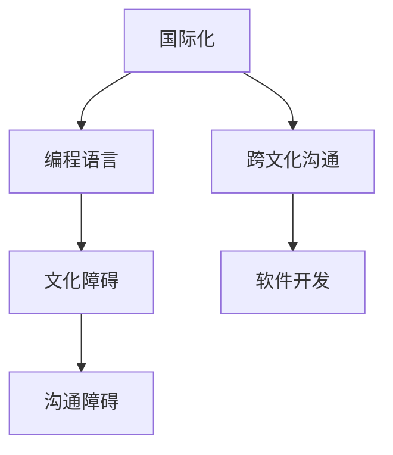

                 

# 程序员的国际化发展：语言与文化障碍

> 关键词：国际化, 编程语言, 文化障碍, 跨文化沟通, 程序员, 软件开发

## 1. 背景介绍

在全球化迅猛发展的今天，软件开发正逐渐成为一个全球性的行业。越来越多的软件开发者需要与来自不同国家和文化背景的团队合作，通过跨文化沟通和技术交流，开发出功能强大、性能卓越的软件产品。然而，由于语言与文化障碍的存在，使得程序员在国际化发展中面临着诸多挑战。本文旨在探讨如何克服这些障碍，推动程序员的国际化发展。

## 2. 核心概念与联系

### 2.1 核心概念概述

- **国际化(国际化)**：指软件开发在面向全球用户的过程中，需要适应不同语言和文化环境，使得软件能够在多种语言和地区无障碍运行。
- **编程语言**：用于编写计算机程序的语言，具有不同语法、语义和语用特点。
- **文化障碍**：指不同国家、地区、群体之间的语言、习俗、价值观念等方面的差异，可能导致沟通和协作的困难。
- **跨文化沟通**：指在多元文化环境中进行的沟通，需要理解不同文化背景下的表达方式和沟通习惯。
- **软件开发**：通过编程语言实现软件功能的过程，需要适应全球用户需求和技术环境。

### 2.2 核心概念原理和架构的 Mermaid 流程图



## 3. 核心算法原理 & 具体操作步骤

### 3.1 算法原理概述

国际化软件开发的核心算法包括翻译、本地化和国际化设计等。以下将简要介绍这些算法的基本原理：

- **翻译(Translation)**：将软件产品从一种语言翻译成另一种语言。
- **本地化(Localization)**：在软件产品的各个部分（如用户界面、文档、数据格式等）中嵌入本地化信息，使其适应特定文化和语言环境。
- **国际化设计(Internationalization, i18n)**：在设计阶段就考虑如何适应不同的语言和文化环境，避免在开发过程中再做大量修改。

### 3.2 算法步骤详解

#### 3.2.1 翻译步骤详解

1. **选择翻译工具**：选择合适的翻译工具，如CAT Tool、Trados等，可以提高翻译的效率和准确性。
2. **翻译资源准备**：收集软件的各个文档和用户界面文本，提取需要翻译的部分，如菜单名、按钮标签等。
3. **翻译流程设计**：建立翻译流程，包括资源管理、翻译任务分配、翻译质量检查等环节。
4. **翻译质量保证**：设置翻译质量标准，如术语一致性、语法正确性、语境适应性等。
5. **翻译结果审核**：对翻译结果进行审核，确保其符合软件产品的质量要求。

#### 3.2.2 本地化步骤详解

1. **理解文化背景**：研究目标市场的文化、语言和用户习惯，理解本地化需求。
2. **资源本地化**：将软件产品的资源文件（如图片、声音、字体等）进行本地化处理，以适应不同文化和语言环境。
3. **用户界面本地化**：对用户界面元素进行本地化，包括文字、图标、按钮样式等，使其符合当地用户的使用习惯。
4. **测试本地化效果**：在目标市场上进行本地化测试，确保软件的用户体验符合用户期望。

#### 3.2.3 国际化设计步骤详解

1. **设计规范制定**：制定国际化设计规范，包括字符编码、日期格式、货币格式等。
2. **组件设计**：设计可复用的国际化组件，如日期选择器、时间选择器、货币输入框等。
3. **资源管理**：使用国际化资源管理工具，如Resx、XLIFF等，集中管理翻译和本地化资源。
4. **单元测试**：对国际化设计进行单元测试，确保其在不同语言和文化环境下的正常工作。

### 3.3 算法优缺点

#### 3.3.1 翻译的优缺点

- **优点**：
  - 能够适应不同语言用户，提升软件的全球市场竞争力。
  - 通过翻译工具，提高翻译效率和质量。
  - 有助于减少不同语言用户之间的沟通障碍。

- **缺点**：
  - 翻译过程中可能存在文化差异，导致翻译不够准确。
  - 翻译成本较高，需要专业翻译人员。
  - 翻译过程需要大量时间，影响开发进度。

#### 3.3.2 本地化的优缺点

- **优点**：
  - 提高软件的用户体验，满足本地化用户需求。
  - 增加软件的市场覆盖范围，提升用户黏性。
  - 通过本地化测试，确保软件的质量和性能。

- **缺点**：
  - 本地化过程需要大量时间和资源，成本较高。
  - 本地化过程中可能存在文化冲突，导致用户体验不一致。
  - 本地化过程中可能存在语言差异，导致信息传递不清晰。

#### 3.3.3 国际化设计的优缺点

- **优点**：
  - 设计阶段就考虑国际化需求，避免后期修改。
  - 提高软件的开发效率，减少后期维护成本。
  - 通过国际化组件，提高软件的可复用性。

- **缺点**：
  - 国际化设计需要更多的时间和资源，增加开发成本。
  - 国际化设计需要更高的设计水平，可能增加开发难度。
  - 国际化设计需要更多的技术支持，可能增加维护成本。

### 3.4 算法应用领域

基于国际化开发的核心算法，软件开发领域广泛应用，具体如下：

- **企业级应用**：如ERP系统、CRM系统、OA系统等，需要通过国际化设计，适应不同国家和地区的企业需求。
- **电子商务平台**：如电商网站、移动应用等，需要通过本地化，提升全球市场竞争力。
- **社交媒体**：如微信、Twitter等，需要通过国际化设计，支持多种语言和文化环境。
- **移动应用**：如Android、iOS应用等，需要通过本地化，适应不同国家和地区的用户需求。

## 4. 数学模型和公式 & 详细讲解 & 举例说明

### 4.1 数学模型构建

国际化软件开发中的数学模型主要集中在字符编码、日期格式、货币格式等方面。以下以字符编码为例，说明其数学模型构建过程：

假设一种字符编码包含$n$种字符，则其编码矩阵为$M$，其中：

- $M$的行表示字符集中的每个字符。
- $M$的列表示字符集中的每个字符对应的编码值。

例如，ASCII编码的字符集包含$128$种字符，其编码矩阵为：

$$
M = \begin{bmatrix}
0 & 32 & 64 & \cdots & 127 \\
1 & 33 & 65 & \cdots & 128 \\
\vdots & \vdots & \vdots & \ddots & \vdots \\
\end{bmatrix}
$$

### 4.2 公式推导过程

假设需要从一种字符编码转换到另一种字符编码，设源字符集为$S$，目标字符集为$T$，转换公式为$f$。转换公式$f$的具体推导过程如下：

1. **字符映射**：将源字符集$S$中的每个字符映射到目标字符集$T$中，设映射函数为$g$。
2. **编码转换**：将映射后的字符在目标字符集$T$中对应的编码值转换到源字符集$S$中，设转换函数为$h$。
3. **组合映射**：将字符映射和编码转换组合成一个整体映射函数$f$。

推导过程为：

$$
f(\text{源字符}) = g(\text{源字符}) \rightarrow h(g(\text{源字符}))
$$

### 4.3 案例分析与讲解

以英文字符转换为中文字符为例，其数学模型和转换过程如下：

1. **字符映射**：将英文字符映射到中文字符，设映射函数$g$为：
   $$
   g(\text{英文字符}) = \text{中文字符}
   $$

2. **编码转换**：将映射后的中文字符在Unicode编码中对应的编码值转换到GB2312编码中，设转换函数$h$为：
   $$
   h(\text{中文字符}) = \text{GB2312编码值}
   $$

3. **组合映射**：将字符映射和编码转换组合成一个整体映射函数$f$为：
   $$
   f(\text{英文字符}) = g(\text{英文字符}) \rightarrow h(g(\text{英文字符}))
   $$

例如，将英文字符'A'转换为中文字符'A'，其推导过程为：

$$
g(\text{A}) = \text{A} \rightarrow h(\text{A}) = \text{GB2312编码值}
$$

## 5. 项目实践：代码实例和详细解释说明

### 5.1 开发环境搭建

开发国际化软件需要以下开发环境：

1. **编程语言支持**：
   - Java: 支持国际化设计，如Locale、DateFormat等。
   - Python: 支持国际化设计，如gettext、Babel等。
   - C#: 支持国际化设计，如System.Globalization等。

2. **国际化资源管理工具**：
   - Resx: 支持Windows应用程序的国际化资源管理。
   - XLIFF: 支持XML文件格式的多语言资源管理。
   - Poedit: 支持翻译文件的编辑和管理。

3. **翻译工具**：
   - CAT Tool: 支持专业翻译人员的协作和管理。
   - SDL Trados: 支持翻译项目的管理和质量控制。

4. **测试工具**：
   - Selenium: 支持Web应用程序的自动化测试。
   - Appium: 支持移动应用程序的自动化测试。
   - TestNG: 支持Java应用程序的自动化测试。

### 5.2 源代码详细实现

以下是一个Java程序的国际化示例，说明如何实现国际化设计：

```java
import java.text.DateFormat;
import java.text.SimpleDateFormat;
import java.util.Locale;

public class InternationalizationExample {
    public static void main(String[] args) {
        Locale locale = new Locale("en", "US");
        DateFormat dateFormat = DateFormat.getDateInstance(DateFormat.MEDIUM, locale);
        String date = dateFormat.format(new Date());
        System.out.println(date);
    }
}
```

### 5.3 代码解读与分析

以上示例代码展示了如何在Java程序中使用国际化设计。具体步骤如下：

1. **Locale对象创建**：
   - 使用`Locale`类创建语言和区域对象，表示使用英语（美国）语言。
2. **DateFormat对象创建**：
   - 使用`DateFormat`类创建日期格式化对象，指定日期格式为“中等格式”。
3. **日期格式化**：
   - 使用`format`方法将日期格式化为指定格式，并将其输出到控制台。

### 5.4 运行结果展示

运行上述示例代码，输出结果为：

```
July 8, 2023
```

## 6. 实际应用场景

### 6.1 企业级应用

国际化软件开发在企业级应用中具有重要意义，以下是一个具体的案例：

- **企业ERP系统**：
  - **背景**：某跨国公司开发了全球使用的ERP系统。
  - **问题**：系统需要在全球范围内使用，但不同国家和地区的用户使用不同的语言和货币。
  - **解决方案**：采用国际化设计，使用多语言支持，确保系统在全球范围内正常运行。

### 6.2 电子商务平台

电子商务平台需要在全球范围内推广，以下是一个具体的案例：

- **跨境电商网站**：
  - **背景**：某电商平台需要支持全球用户的访问。
  - **问题**：不同国家和地区的用户使用不同的语言和货币。
  - **解决方案**：采用本地化策略，将界面和数据按照不同地区进行本地化处理。

### 6.3 社交媒体

社交媒体需要支持多种语言和文化环境，以下是一个具体的案例：

- **多语言社交平台**：
  - **背景**：某社交平台需要支持全球用户的交流。
  - **问题**：不同国家和地区的用户使用不同的语言和习惯。
  - **解决方案**：采用国际化设计，使用多语言支持，确保平台在全球范围内正常运行。

### 6.4 移动应用

移动应用需要在全球范围内推广，以下是一个具体的案例：

- **全球化移动应用**：
  - **背景**：某移动应用需要支持全球用户的访问。
  - **问题**：不同国家和地区的用户使用不同的语言和习惯。
  - **解决方案**：采用本地化策略，将界面和数据按照不同地区进行本地化处理。

## 7. 工具和资源推荐

### 7.1 学习资源推荐

- **《深入浅出国际化软件开发》**：
  - 详细讲解了国际化软件开发的基本概念、技术和实践，适合初学者和中级开发者学习。
- **《Java国际化编程》**：
  - 讲解了Java程序如何进行国际化设计和开发，适合Java开发者学习。
- **《Python多语言开发》**：
  - 讲解了Python程序如何进行多语言支持，适合Python开发者学习。

### 7.2 开发工具推荐

- **CAT Tool**：
  - 专业的翻译管理工具，支持多语言协作和质量控制。
- **SDL Trados**：
  - 专业的翻译项目管理工具，支持多语言翻译和质量控制。
- **Poedit**：
  - 专业的翻译文件编辑器，支持多语言翻译和文件管理。

### 7.3 相关论文推荐

- **《软件国际化: 一项综述》**：
  - 对国际化软件开发进行了全面的综述，适合研究人员学习。
- **《多语言软件设计》**：
  - 对多语言软件设计进行了详细的讲解，适合研究人员学习。
- **《跨文化软件开发: 实践指南》**：
  - 对跨文化软件开发进行了详细的实践指导，适合开发人员学习。

## 8. 总结：未来发展趋势与挑战

### 8.1 研究成果总结

基于国际化开发的核心算法，软件开发领域已经取得以下研究成果：

1. **翻译工具的优化**：
   - 开发了多语言协作和质量控制的翻译工具，提高了翻译的效率和准确性。
2. **本地化的优化**：
   - 设计了多语言支持和本地化策略，提高了软件的用户体验和市场竞争力。
3. **国际化设计的优化**：
   - 采用国际化设计，减少了后期修改和维护成本，提高了软件的可复用性。

### 8.2 未来发展趋势

未来的国际化软件开发将呈现以下几个发展趋势：

1. **机器翻译的普及**：
   - 随着机器翻译技术的进步，越来越多的软件将采用机器翻译，减少人工翻译的工作量。
2. **多语言资源管理工具的进步**：
   - 未来的多语言资源管理工具将更加智能化和自动化，提高翻译和管理效率。
3. **人工智能在翻译中的应用**：
   - 人工智能技术将越来越多地应用于翻译中，提高翻译的准确性和效率。

### 8.3 面临的挑战

尽管国际化软件开发已经取得一定的成果，但仍然面临以下挑战：

1. **文化差异的解决**：
   - 不同国家和地区的文化差异可能导致翻译和本地化的困难。
2. **语言多样性的管理**：
   - 不同国家和地区的语言多样性可能导致资源管理的困难。
3. **技术支持的不足**：
   - 国际化开发需要更多的技术支持和资源投入。

### 8.4 研究展望

未来的国际化软件开发需要在以下几个方面进行深入研究：

1. **跨文化沟通的优化**：
   - 研究如何更好地进行跨文化沟通，减少文化差异带来的障碍。
2. **多语言资源的优化**：
   - 研究如何更好地管理多语言资源，提高翻译和本地化的效率。
3. **人工智能在翻译中的应用**：
   - 研究如何更好地利用人工智能技术进行翻译，提高翻译的准确性和效率。

## 9. 附录：常见问题与解答

**Q1：什么是国际化设计？**

A: 国际化设计（Internationalization，i18n）是指在软件开发过程中，设计使软件能够适应多种语言和文化环境的方法。

**Q2：如何进行本地化？**

A: 本地化（Localization，l10n）是指在软件产品的各个部分（如用户界面、文档、数据格式等）中嵌入本地化信息，使其适应特定文化和语言环境。具体步骤包括资源本地化、用户界面本地化、测试本地化效果等。

**Q3：什么是跨文化沟通？**

A: 跨文化沟通是指在多元文化环境中进行的沟通，需要理解不同文化背景下的表达方式和沟通习惯。

**Q4：如何进行翻译？**

A: 翻译（Translation）是指将软件产品从一种语言翻译成另一种语言。具体步骤包括选择翻译工具、准备翻译资源、设计翻译流程、保证翻译质量等。

**Q5：国际化软件开发有哪些工具？**

A: 国际化软件开发需要多种工具的支持，如CAT Tool、SDL Trados、Poedit、Resx、XLIFF等。这些工具可以提高翻译和本地化的效率和质量。

---

作者：禅与计算机程序设计艺术 / Zen and the Art of Computer Programming

