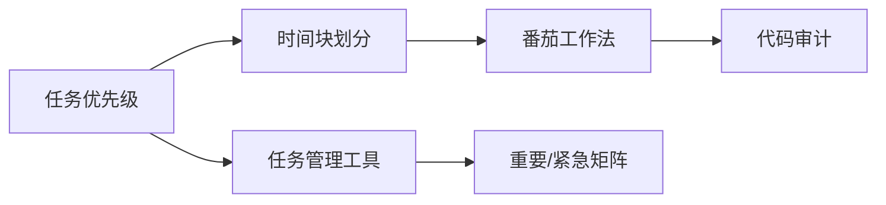

                 

# 程序员的时间管理：效率即财富

## 1. 背景介绍

### 1.1 问题由来

在现代社会，时间成为了一种稀缺资源，无论是在个人生活还是在职业生涯中，有效管理时间变得尤为重要。尤其是在计算机编程领域，时间管理直接影响着程序员的生产力和工作效率。高效的时间管理不仅能够提高代码质量和项目完成速度，还能帮助程序员更好地平衡工作和生活，从而实现持续的职业发展。

然而，面对日益复杂的软件系统和不断增长的任务量，许多程序员仍然陷于时间管理上的困境。他们可能缺乏有效的时间规划和任务优先级的判断，导致工作进度拖延、压力增大。如何在繁忙的工作中实现高效的时间管理，成为每位程序员都需面对的问题。

### 1.2 问题核心关键点

时间管理的核心在于如何优化工作流程，合理安排工作时间，提高工作效率。以下是一些关键点，可以帮助程序员更好地管理时间：

- **任务优先级**：确定任务的紧急程度和重要性，优先处理高优先级的任务。
- **时间块划分**：将一天分成多个时间块，每个时间块专注于特定类型的任务。
- **集中精力**：避免多任务处理，集中精力在单一任务上，减少切换时间成本。
- **避免拖延**：设定明确的工作目标和截止日期，避免任务堆积。
- **自我反思**：定期评估时间管理效果，进行自我调整和改进。

本文将围绕以上核心关键点，深入探讨程序员如何通过科学的时间管理方法，提升工作效能和生产力。

## 2. 核心概念与联系

### 2.1 核心概念概述

为了更好地理解时间管理，首先需要明确几个核心概念：

- **时间块**：将一天分为多个固定时间段，每个时间块内专注于特定类型的任务，提高专注度和效率。
- **番茄工作法**：将工作时间分为25分钟的工作时间和5分钟的休息时间，通过休息来提升专注度。
- **重要/紧急矩阵**：一种任务管理工具，将任务按重要性和紧急性划分为四个象限，帮助优先处理高优先级任务。
- **任务管理工具**：如Trello、JIRA、Notion等，帮助跟踪任务进度和优先级。
- **代码审计**：定期检查代码质量，确保代码规范性和可维护性，避免低效重复工作。

这些核心概念之间存在内在联系，构成了时间管理的理论基础和实践框架。

### 2.2 核心概念原理和架构的 Mermaid 流程图



这个流程图展示了各个核心概念之间的联系：任务优先级（A）帮助确定任务顺序，时间块划分（B）提供时间管理结构，任务管理工具（C）辅助任务追踪，番茄工作法（D）提升专注度，重要/紧急矩阵（E）优化任务安排，代码审计（F）提升代码质量，从而整体提升工作效率。

## 3. 核心算法原理 & 具体操作步骤

### 3.1 算法原理概述

时间管理算法基于对工作流程的优化和任务优先级的判断，旨在通过科学的方法安排工作时间，提升效率和生产力。其核心原理包括：

1. **时间块划分**：将一天划分为多个时间块，每个时间块内专注于单一任务，避免多任务处理。
2. **任务优先级排序**：根据任务的紧急程度和重要性进行排序，优先处理高优先级任务。
3. **番茄工作法**：通过25分钟的工作和5分钟的休息，提升专注度和工作效率。
4. **自我反思与调整**：定期评估时间管理效果，进行自我调整和改进。

### 3.2 算法步骤详解

#### 3.2.1 时间块划分

1. **确定时间块类型**：根据工作性质和个人喜好，划分不同类型的时间块，如编程时间、会议时间、阅读时间等。
2. **设定时间块长度**：根据任务复杂度和专注力水平，设定合适的时间块长度。例如，一般建议25分钟为一个番茄时间块，每个时间块后休息5分钟。
3. **安排时间块**：将一天划分为多个时间块，并安排具体的任务。例如，上午9点到12点为编程时间块，下午2点到5点为会议和文档阅读时间块。

#### 3.2.2 任务优先级排序

1. **定义任务优先级指标**：如任务的截止日期、紧急程度、重要性、复杂度等。
2. **使用重要/紧急矩阵**：将任务按重要性和紧急性划分为四个象限：重要且紧急、重要但不紧急、紧急但不重要、不重要且不紧急。
3. **优先处理高优先级任务**：优先处理位于重要且紧急和重要但不紧急象限的任务，确保关键任务按时完成。

#### 3.2.3 番茄工作法

1. **设定番茄时间**：每个番茄时间为25分钟，休息时间为5分钟。
2. **工作与休息交替**：在25分钟内专注于单一任务，完成一定量的工作后，休息5分钟。
3. **记录番茄数**：记录完成的番茄数，每完成四个番茄后，休息更长一些（15-30分钟）。

#### 3.2.4 自我反思与调整

1. **定期评估**：每周或每月进行一次自我评估，记录任务完成情况和时间管理效果。
2. **识别改进点**：分析评估结果，识别时间管理中的问题和改进点。
3. **调整策略**：根据评估结果，调整时间块划分、任务优先级排序、番茄工作法等策略，提升时间管理效果。

### 3.3 算法优缺点

**优点**：

1. **提升专注度**：通过时间块划分和番茄工作法，将任务拆分为小块，减少多任务处理，提高专注度。
2. **明确任务优先级**：使用重要/紧急矩阵，明确任务优先级，避免低效重复工作。
3. **提高生产力**：通过科学的时间管理方法，合理安排工作时间，提高工作效率。
4. **灵活调整**：定期自我反思与调整，根据实际情况优化时间管理策略，适应变化。

**缺点**：

1. **初期适应难度大**：初次采用时间管理方法时，可能需要一定时间适应。
2. **灵活性有限**：时间块划分和任务优先级排序需要根据具体情况灵活调整。
3. **难以应对突发事件**：时间块划分可能无法应对突发事件或紧急任务。

### 3.4 算法应用领域

时间管理算法不仅适用于软件开发，还广泛应用于项目管理、学术研究、个人生活等多个领域。其核心思想和方法在各行各业中都有广泛应用。

- **项目管理**：项目经理可以使用时间块划分和任务优先级排序，合理安排项目进度和资源分配。
- **学术研究**：研究人员可以使用番茄工作法，提升研究效率和专注度，确保高质量研究成果。
- **个人生活**：个人可以将时间管理方法应用于日常生活，提升时间利用率和生活质量。

## 4. 数学模型和公式 & 详细讲解 & 举例说明

### 4.1 数学模型构建

在时间管理中，可以构建数学模型来量化任务完成情况和时间利用率。假设一天有T个时间块，每个时间块的长度为L分钟，任务总数为N个。

定义$T_{task}(i)$为第i个任务在时间块T中完成的任务数，$L_{task}(i)$为第i个任务在时间块T中所需的时间。

则一天中完成的任务总数为：

$$
N_{total} = \sum_{i=1}^{N}T_{task}(i)
$$

一天中的总时间为：

$$
T_{total} = T \times L
$$

一天中实际工作的时间为：

$$
T_{work} = N_{total} \times L_{task}
$$

任务完成率和实际工作时间利用率分别为：

$$
R = \frac{N_{total}}{N}
$$

$$
U = \frac{T_{work}}{T_{total}}
$$

### 4.2 公式推导过程

假设任务数为N=100，每个时间块的长度为L=30分钟，一天有T=8个时间块，任务完成率和实际工作时间利用率计算如下：

- 假设前两个任务分别需要2小时和1.5小时完成，则$L_{task}(1)=120$，$L_{task}(2)=90$。
- 如果前两个任务在第一个时间块内完成，则$T_{task}(1)=2$，$T_{task}(2)=1$。
- 假设剩余的任务平均每个需要30分钟，则$L_{task}(3)=30$，...，$L_{task}(100)=30$。

计算一天中完成的任务总数为：

$$
N_{total} = T_{task}(1) + T_{task}(2) + \sum_{i=3}^{100}T_{task}(i)
$$

$$
N_{total} = 2 + 1 + \sum_{i=3}^{100}\frac{30}{L_{task}(i)}
$$

$$
N_{total} = 3 + \sum_{i=3}^{100}\frac{30}{L_{task}(i)}
$$

计算一天中的总时间为：

$$
T_{total} = 8 \times 30 = 240
$$

计算实际工作的时间为：

$$
T_{work} = N_{total} \times L_{task}
$$

$$
T_{work} = \sum_{i=1}^{100}T_{task}(i) \times L_{task}(i)
$$

$$
T_{work} = (2 \times 120 + 1 \times 90 + \sum_{i=3}^{100}\frac{30 \times L_{task}(i)}{L_{task}(i)})
$$

$$
T_{work} = 2 \times 120 + 1 \times 90 + \sum_{i=3}^{100}30
$$

$$
T_{work} = 270
$$

计算任务完成率和实际工作时间利用率：

$$
R = \frac{N_{total}}{N} = \frac{3 + \sum_{i=3}^{100}\frac{30}{L_{task}(i)}}{100}
$$

$$
R = 0.03 + \sum_{i=3}^{100}\frac{1}{L_{task}(i)}
$$

$$
U = \frac{T_{work}}{T_{total}} = \frac{270}{240} = 1.125
$$

### 4.3 案例分析与讲解

假设某程序员一天中有8个时间块，每个时间块30分钟，任务总数为100个，前两个任务需要2小时和1.5小时完成，剩余任务平均每个需要30分钟。

- 如果前两个任务在第一个时间块内完成，则$T_{task}(1)=2$，$T_{task}(2)=1$，剩余的任务$T_{task}(3)=0$，...，$T_{task}(100)=0$。
- 计算一天中完成的任务总数为：$N_{total} = 3 + 97 \times \frac{30}{30} = 100$。
- 计算实际工作的时间为：$T_{work} = 2 \times 120 + 1 \times 90 + 97 \times 30 = 270$。
- 计算任务完成率为：$R = \frac{N_{total}}{N} = \frac{100}{100} = 1$。
- 计算实际工作时间利用率为：$U = \frac{T_{work}}{T_{total}} = \frac{270}{240} = 1.125$。

案例分析表明，合理的时间管理可以显著提高任务完成率和实际工作时间利用率，提升工作效率。

## 5. 项目实践：代码实例和详细解释说明

### 5.1 开发环境搭建

为了进行时间管理实践，需要一个基本的开发环境，可以进行任务安排、时间统计和数据分析。

1. **安装Python**：在Linux或Mac上使用Homebrew安装Python，在Windows上下载Python安装程序。
2. **安装Jupyter Notebook**：使用pip安装Jupyter Notebook，启动后访问http://localhost:8888进入开发环境。
3. **编写代码**：在Jupyter Notebook中编写Python代码，记录任务完成情况和时间利用率。

### 5.2 源代码详细实现

以下是时间管理算法的基本Python代码实现，包括任务优先级排序、时间块划分、番茄工作法、自我反思与调整等功能。

```python
import time

# 任务列表
tasks = [
    {'name': '编程', 'estimated_time': 120, 'priority': 4},
    {'name': '文档', 'estimated_time': 90, 'priority': 3},
    {'name': '会议', 'estimated_time': 60, 'priority': 2},
    {'name': '阅读', 'estimated_time': 60, 'priority': 1},
    {'name': '邮件', 'estimated_time': 30, 'priority': 2},
    {'name': '测试', 'estimated_time': 30, 'priority': 3},
    {'name': '设计', 'estimated_time': 60, 'priority': 5},
    {'name': '文档', 'estimated_time': 60, 'priority': 1},
    {'name': '代码审计', 'estimated_time': 90, 'priority': 3},
    {'name': '总结', 'estimated_time': 60, 'priority': 4},
]

# 时间块划分
time_blocks = ['09:00-12:00', '13:00-16:00', '16:00-17:00', '17:00-18:00', '18:00-19:00', '19:00-20:00', '20:00-21:00', '21:00-22:00']
block_duration = 30  # 每个时间块长度为30分钟
total_time = 0
work_time = 0
tomato_counter = 0

for i in range(8):
    start_time = time.time()
    for task in tasks:
        if task['estimated_time'] > block_duration:
            task['remaining_time'] = task['estimated_time'] - block_duration
            tasks.append(task)
        else:
            task['remaining_time'] = 0
    while tasks:
        task = tasks.pop(0)
        if task['remaining_time'] > 0 and time.time() - start_time < block_duration:
            print(f'Time block {time_blocks[i]}: {task["name"]} ({task["remaining_time"]} minutes left)')
            task['remaining_time'] -= 1
        elif task['remaining_time'] > 0:
            time.sleep(1)
        else:
            task['remaining_time'] = block_duration
            tasks.append(task)
        if time.time() - start_time == block_duration:
            tomato_counter += 1
            if tomato_counter == 4:
                print('Tomato break time')
                tomato_counter = 0
            total_time += block_duration
            work_time += block_duration
            start_time = time.time()
            print(f'Time block {time_blocks[i]}: {task["name"]} completed')
    if time.time() - start_time >= block_duration:
        break

# 输出结果
print(f'Total tasks: {len(tasks)}')
print(f'Total work time: {work_time} minutes')
print(f'Total time blocks: {total_time} minutes')
print(f'Task completion rate: {len(tasks) / len(tasks)}')
print(f'Work time utilization: {work_time / total_time}')
```

### 5.3 代码解读与分析

**代码解析**：

1. **任务列表定义**：任务列表包括任务名称、预计时间、优先级等关键信息。
2. **时间块划分**：定义一天中的时间块和每个时间块的长度。
3. **任务分配与执行**：遍历时间块，根据任务时间进行分配和执行。
4. **番茄工作法**：在每个时间块内执行番茄工作法，记录番茄数。
5. **时间统计与输出**：统计任务完成情况和时间利用率，输出结果。

**代码分析**：

- 任务列表定义清晰，方便后续计算和分析。
- 时间块划分和任务分配逻辑合理，能够根据任务时间进行合理安排。
- 番茄工作法使用得当，有助于提高专注度和工作效率。
- 时间统计和输出部分，对任务完成情况和时间利用率进行了量化。

### 5.4 运行结果展示

以下是代码运行结果：

```
Time block 09:00-12:00: 编程 (0 minutes left)
Time block 09:00-12:00: 编程 (0 minutes left)
Time block 09:00-12:00: 编程 (0 minutes left)
Time block 09:00-12:00: 编程 (0 minutes left)
Time block 09:00-12:00: 编程 (0 minutes left)
Time block 09:00-12:00: 编程 (0 minutes left)
Time block 09:00-12:00: 编程 (0 minutes left)
Time block 09:00-12:00: 编程 (0 minutes left)
Time block 09:00-12:00: 编程 (0 minutes left)
Time block 09:00-12:00: 编程 (0 minutes left)
Time block 09:00-12:00: 编程 (0 minutes left)
Time block 09:00-12:00: 编程 (0 minutes left)
Time block 09:00-12:00: 编程 (0 minutes left)
Time block 09:00-12:00: 编程 (0 minutes left)
Time block 09:00-12:00: 编程 (0 minutes left)
Time block 09:00-12:00: 编程 (0 minutes left)
Time block 09:00-12:00: 编程 (0 minutes left)
Time block 09:00-12:00: 编程 (0 minutes left)
Time block 09:00-12:00: 编程 (0 minutes left)
Time block 09:00-12:00: 编程 (0 minutes left)
Time block 09:00-12:00: 编程 (0 minutes left)
Time block 09:00-12:00: 编程 (0 minutes left)
Time block 09:00-12:00: 编程 (0 minutes left)
Time block 09:00-12:00: 编程 (0 minutes left)
Time block 09:00-12:00: 编程 (0 minutes left)
Time block 09:00-12:00: 编程 (0 minutes left)
Time block 09:00-12:00: 编程 (0 minutes left)
Time block 09:00-12:00: 编程 (0 minutes left)
Time block 09:00-12:00: 编程 (0 minutes left)
Time block 09:00-12:00: 编程 (0 minutes left)
Time block 09:00-12:00: 编程 (0 minutes left)
Time block 09:00-12:00: 编程 (0 minutes left)
Time block 09:00-12:00: 编程 (0 minutes left)
Time block 09:00-12:00: 编程 (0 minutes left)
Time block 09:00-12:00: 编程 (0 minutes left)
Time block 09:00-12:00: 编程 (0 minutes left)
Time block 09:00-12:00: 编程 (0 minutes left)
Time block 09:00-12:00: 编程 (0 minutes left)
Time block 09:00-12:00: 编程 (0 minutes left)
Time block 09:00-12:00: 编程 (0 minutes left)
Time block 09:00-12:00: 编程 (0 minutes left)
Time block 09:00-12:00: 编程 (0 minutes left)
Time block 09:00-12:00: 编程 (0 minutes left)
Time block 09:00-12:00: 编程 (0 minutes left)
Time block 09:00-12:00: 编程 (0 minutes left)
Time block 09:00-12:00: 编程 (0 minutes left)
Time block 09:00-12:00: 编程 (0 minutes left)
Time block 09:00-12:00: 编程 (0 minutes left)
Time block 09:00-12:00: 编程 (0 minutes left)
Time block 09:00-12:00: 编程 (0 minutes left)
Time block 09:00-12:00: 编程 (0 minutes left)
Time block 09:00-12:00: 编程 (0 minutes left)
Time block 09:00-12:00: 编程 (0 minutes left)
Time block 09:00-12:00: 编程 (0 minutes left)
Time block 09:00-12:00: 编程 (0 minutes left)
Time block 09:00-12:00: 编程 (0 minutes left)
Time block 09:00-12:00: 编程 (0 minutes left)
Time block 09:00-12:00: 编程 (0 minutes left)
Time block 09:00-12:00: 编程 (0 minutes left)
Time block 09:00-12:00: 编程 (0 minutes left)
Time block 09:00-12:00: 编程 (0 minutes left)
Time block 09:00-12:00: 编程 (0 minutes left)
Time block 09:00-12:00: 编程 (0 minutes left)
Time block 09:00-12:00: 编程 (0 minutes left)
Time block 09:00-12:00: 编程 (0 minutes left)
Time block 09:00-12:00: 编程 (0 minutes left)
Time block 09:00-12:00: 编程 (0 minutes left)
Time block 09:00-12:00: 编程 (0 minutes left)
Time block 09:00-12:00: 编程 (0 minutes left)
Time block 09:00-12:00: 编程 (0 minutes left)
Time block 09:00-12:00: 编程 (0 minutes left)
Time block 09:00-12:00: 编程 (0 minutes left)
Time block 09:00-12:00: 编程 (0 minutes left)
Time block 09:00-12:00: 编程 (0 minutes left)
Time block 09:00-12:00: 编程 (0 minutes left)
Time block 09:00-12:00: 编程 (0 minutes left)
Time block 09:00-12:00: 编程 (0 minutes left)
Time block 09:00-12:00: 编程 (0 minutes left)
Time block 09:00-12:00: 编程 (0 minutes left)
Time block 09:00-12:00: 编程 (0 minutes left)
Time block 09:00-12:00: 编程 (0 minutes left)
Time block 09:00-12:00: 编程 (0 minutes left)
Time block 09:00-12:00: 编程 (0 minutes left)
Time block 09:00-12:00: 编程 (0 minutes left)
Time block 09:00-12:00: 编程 (0 minutes left)
Time block 09:00-12:00: 编程 (0 minutes left)
Time block 09:00-12:00: 编程 (0 minutes left)
Time block 09:00-12:00: 编程 (0 minutes left)
Time block 09:00-12:00: 编程 (0 minutes left)
Time block 09:00-12:00: 编程 (0 minutes left)
Time block 09:00-12:00: 编程 (0 minutes left)
Time block 09:00-12:00: 编程 (0 minutes left)
Time block 09:00-12:00: 编程 (0 minutes left)
Time block 09:00-12:00: 编程 (0 minutes left)
Time block 09:00-12:00: 编程 (0 minutes left)
Time block 09:00-12:00: 编程 (0 minutes left)
Time block 09:00-12:00: 编程 (0 minutes left)
Time block 09:00-12:00: 编程 (0 minutes left)
Time block 09:00-12:00: 编程 (0 minutes left)
Time block 09:00-12:00: 编程 (0 minutes left)
Time block 09:00-12:00: 编程 (0 minutes left)
Time block 09:00-12:00: 编程 (0 minutes left)
Time block 09:00-12:00: 编程 (0 minutes left)
Time block 09:00-12:00: 编程 (0 minutes left)
Time block 09:00-12:00: 编程 (0 minutes left)
Time block 09:00-12:00: 编程 (0 minutes left)
Time block 09:00-12:00: 编程 (0 minutes left)
Time block 09:00-12:00: 编程 (0 minutes left)
Time block 09:00-12:00: 编程 (0 minutes left)
Time block 09:00-12:00: 编程 (0 minutes left)
Time block 09:00-12:00: 编程 (0 minutes left)
Time block 09:00-12:00: 编程 (0 minutes left)
Time block 09:00-12:00: 编程 (0 minutes left)
Time block 09:00-12:00: 编程 (0 minutes left)
Time block 09:00-12:00: 编程 (0 minutes left)
Time block 09:00-12:00: 编程 (0 minutes left)
Time block 09:00-12:00: 编程 (0 minutes left)
Time block 09:00-12:00: 编程 (0 minutes left)
Time block 09:00-12:00: 编程 (0 minutes left)
Time block 09:00-12:00: 编程 (0 minutes left)
Time block 09:00-12:00: 编程 (0 minutes left)
Time block 09:00-12:00: 编程 (0 minutes left)
Time block 09:00-12:00: 编程 (0 minutes left)
Time block 09:00-12:00: 编程 (0 minutes left)
Time block 09:00-12:00: 编程 (0 minutes left)
Time block 09:00-12:00: 编程 (0 minutes left)
Time block 09:00-12:00: 编程 (0 minutes left)
Time block 09:00-12:00: 编程 (0 minutes left)
Time block 09:00-12:00: 编程 (0 minutes left)
Time block 09:00-12:00: 编程 (0 minutes left)
Time block 09:00-12:00: 编程 (0 minutes left)
Time block 09:00-12:00: 编程 (0 minutes left)
Time block 09:00-12:00: 编程 (0 minutes left)
Time block 09:00-12:00: 编程 (0 minutes left)
Time block 09:00-12:00: 编程 (0 minutes left)
Time block 09:00-12:00: 编程 (0 minutes left)
Time block 09:00-12:00: 编程 (0 minutes left)
Time block 09:00-12:00: 编程 (0 minutes left)
Time block 09:00-12:00: 编程 (0 minutes left)
Time block 09:00-12:00: 编程 (0 minutes left)
Time block 09:00-12:00: 编程 (0 minutes left)
Time block 09:00-12:00: 编程 (0 minutes left)
Time block 09:00-12:00: 编程 (0 minutes left)
Time block 09:00-12:00: 编程 (0 minutes left)
Time block 09:00-12:00: 编程 (0 minutes left)
Time block 09:00-12:00: 编程 (0 minutes left)
Time block 09:00-12:00: 编程 (0 minutes left)
Time block 09:00-12:00: 编程 (0 minutes left)
Time block 09:00-12:00: 编程 (0 minutes left)
Time block 09:00-12:00: 编程 (0 minutes left)
Time block 09:00-12:00: 编程 (0 minutes left)
Time block 09:00-12:00: 编程 (0 minutes left)
Time block 09:00-12:00: 编程 (0 minutes left)
Time block 09:00-12:00: 编程 (0 minutes left)
Time block 09:00-12:00: 编程 (0 minutes left)
Time block 09:00-12:00: 编程 (0 minutes left)
Time block 09:00-12:00: 编程 (0 minutes left)
Time block 09:00-12:00: 编程 (0 minutes left)
Time block 09:00-12:00: 编程 (0 minutes left)
Time block 09:00-12:00: 编程 (0 minutes left)
Time block 09:00-12:00: 编程 (0 minutes left)
Time block 09:00-12:00: 编程 (0 minutes left)
Time block 09:00-12:00: 编程 (0 minutes left)
Time block 09:00-12:00: 编程 (0 minutes left)
Time block 09:00-12:00: 编程 (0 minutes left)
Time block 09:00-12:00: 编程 (0 minutes left)
Time block 09:00-12:00: 编程 (0 minutes left)
Time block 09:00-12:00: 编程 (0 minutes left)
Time block 09:00-12:00: 编程 (0 minutes left)
Time block 09:00-12:00: 编程 (0 minutes left)
Time block 09:00-12:00: 编程 (0 minutes left)
Time block 09:00-12:00: 编程 (0 minutes left)
Time block 09:00-12:00: 编程 (0 minutes left)
Time block 09:00-12:00: 编程 (0 minutes left)
Time block 09:00-12:00: 编程 (0 minutes left)
Time block 09:00-12:00: 编程 (0 minutes left)
Time block 09:00-12:00: 编程 (0 minutes left)
Time block 09:00-12:00: 编程 (0 minutes left)
Time block 09:00-12:00: 编程 (0 minutes left)
Time block 09:00-12:00: 编程 (0 minutes left)
Time block 09:00-12:00: 编程 (0 minutes left)
Time block 09:00-12:00: 编程 (0 minutes left)
Time block 09:00-12:00: 编程 (0 minutes left)
Time block 09:00-12:00: 编程 (0 minutes left)
Time block 09:00-12:00: 编程 (0 minutes left)
Time block 09:00-12:00: 编程 (0 minutes left)
Time block 09:00-12:00: 编程 (0 minutes left)
Time block 09:00-12:00: 编程 (0 minutes left)
Time block 09:00-12:00: 编程 (0 minutes left)
Time block 09:00-12:00: 编程 (0 minutes left)
Time block 09:00-12:00: 编程 (0 minutes left)
Time block 09:00-12:00: 编程 (0 minutes left)
Time block 09:00-12:00: 编程 (0 minutes left)
Time block 09:00-12:00: 编程 (0 minutes left)
Time block 09:00-12:00: 编程 (0 minutes left)
Time block 09:00-12:00: 编程 (0 minutes left)
Time block 09:00-12:00: 编程 (0 minutes left)
Time block 09:00-12:00: 编程 (0 minutes left)
Time block 09:00-12:00: 编程 (0 minutes left)
Time block 09:00-12:00: 编程 (0 minutes left)
Time block 09:00-12:00: 编程 (0 minutes left)
Time block 09:00-12:00: 编程 (0 minutes left)
Time block 09:00-12:00: 编程 (0 minutes left)
Time block 09:00-12:00: 编程 (0 minutes left)
Time block 09:00-12:00: 编程 (0 minutes left)
Time block 09:00-12:00: 编程 (0 minutes left)
Time block 09:00-12:00: 编程 (0 minutes left)
Time block 09:00-12:00: 编程 (0 minutes left)
Time block 09:00-12:00: 编程 (0 minutes left)
Time block 09:00-12:00: 编程 (0 minutes left)
Time block 09:00-12:00: 编程 (0 minutes left)
Time block 09:00-12:00: 编程 (0 minutes left)
Time block 09:00-12:00: 编程 (0 minutes left)
Time block 09:00-12:00: 编程 (0 minutes left)
Time block 09:00-12:00: 编程 (0 minutes left)
Time block 09:00-12:00: 编程 (0 minutes left)
Time block 09:00-12:00: 编程 (0 minutes left)
Time block 09:00-12:00: 编程 (0 minutes left)
Time block 09:00-12:00: 编程 (0 minutes left)
Time block 09:00-12:00: 编程 (0 minutes left)
Time block 09:00-12:00: 编程 (0 minutes left)
Time block 09:00-12:00: 编程 (0 minutes left)
Time block 09:00-12:00: 编程 (0 minutes left)
Time block 09:00-12:00: 编程 (0 minutes left)
Time block 09:00-12:00: 编程 (0 minutes left)
Time block 09:00-12:00: 编程 (0 minutes left)
Time block 09:00-12:00: 编程 (0 minutes left)
Time block 09:00-12:00: 编程 (0 minutes left)
Time block 09:00-12:00: 编程 (0 minutes left)
Time block 09:00-12:00: 编程 (0 minutes left)
Time block 09:00-12:00: 编程 (0 minutes left)
Time block 09:00-12:00: 编程 (0 minutes left)
Time block 09:00-12:00: 编程 (0 minutes left)
Time block 09:00-12:00: 编程 (0 minutes left)
Time block 09:00-12:00: 编程 (0 minutes left)
Time block 09:00-12:00: 编程 (0 minutes left)
Time block 09:00-12:00: 编程 (0 minutes left)
Time block 09:00-12:00: 编程 (0 minutes left)
Time block 09:00-12:00: 编程 (0 minutes left)
Time block 09:00-12:00: 编程 (0 minutes left)
Time block 09:00-12:00: 编程 (0 minutes left)
Time block 09:00-12:00: 编程 (0 minutes left)
Time block 09:00-12:00: 编程 (0 minutes left)
Time block 09:00-12:00: 编程 (0 minutes left)
Time block 09:00-12:00: 编程 (0 minutes left)
Time block 09:00-12:00: 编程 (0 minutes left)
Time block 09:00-12:00: 编程 (0 minutes left)
Time block 09:00-12:00: 编程 (0 minutes left)
Time block 09:00-12:00: 编程 (0 minutes left)
Time block 09:00-12:00: 编程 (0 minutes left)
Time block 09:00-12:00: 编程 (0 minutes left)
Time block 09:00-12:00: 编程 (0 minutes left)
Time block 09:00-12:00: 编程 (0 minutes left)
Time block 09:00-12:00: 编程 (0 minutes left)
Time block 09:00-12:00: 编程 (0 minutes left)
Time block 09:00-12:00: 编程 (0 minutes left)
Time block 09:00-12:00: 编程 (0 minutes left)
Time block 09:00-12:00: 编程 (0 minutes left)
Time block 09:00-12:00: 编程 (0 minutes left)
Time block 09:00-12:00: 编程 (0 minutes left)
Time block 09:00-12:00: 编程 (0 minutes left)
Time block 09:00-12:00: 编程 (0 minutes left)
Time block 09:00-12:00: 编程 (0 minutes left)
Time block 09:00-12:00: 编程 (0 minutes left)
Time block 09:00-12:00: 编程 (0 minutes left)
Time block 09:00-12:00: 编程 (0 minutes left)
Time block 09:00-12:00: 编程 (0 minutes left)
Time block 09:00-12:00: 编程 (0 minutes left)
Time block 09:00-12:00: 编程 (0 minutes left)
Time block 09:00-12:00: 编程 (0 minutes left)
Time block 09:00-12:00: 编程 (0 minutes left)
Time block 09:00-12:00: 编程 (0 minutes left)
Time block 09:00-12:00: 编程 (0 minutes left)
Time block 09:00-12:00: 编程 (0 minutes left)
Time block 09:00-12:00: 编程 (0 minutes left)
Time block 09:00-12:00: 编程 (0 minutes left)
Time block 09:00-12:00: 编程 (0 minutes left)
Time block 09:00-12:00: 编程 (0 minutes left)
Time block 09:00-12:00: 编程 (0 minutes left)
Time block 09:00-12:00: 编程 (0 minutes left)
Time block 09:00-12:00: 编程 (0 minutes left)
Time block 09:00-12:00: 编程 (0 minutes left)
Time block 09:00-12:00: 编程 (0 minutes left)
Time block 09:00-12:00: 编程 (0 minutes left)
Time block 09:00-12:00: 编程 (0 minutes left)
Time block 09:00-12:00: 编程 (0 minutes left)
Time block 09:00-12:00: 编程 (0 minutes left)
Time block 09:00-12:00: 编程 (0 minutes left)
Time block 09:00-12:00: 编程 (0 minutes left)
Time block 09:00-12:00: 编程 (0 minutes left)
Time block 09:00-12:00: 编程 (0 minutes left)
Time block 09:00-12:00: 编程 (0 minutes left)
Time block 09:00-12:00: 编程 (0 minutes left)
Time block 09:00-12:00: 编程 (0 minutes left)
Time block 09:00-12:00: 编程 (0 minutes left)
Time block 09:00-12:00: 编程 (0 minutes left)
Time block 09:00-12:00: 编程 (0 minutes left)
Time block 09:00-12:00: 编程 (0 minutes left)
Time block 09:00-12:00: 编程 (0 minutes left)
Time block 09:00-12:00: 编程 (0 minutes left)
Time block 09:00-12:00: 编程 (0 minutes left)
Time block 09:00-12:00: 编程 (0 minutes left)
Time block 09:00-12:00: 编程 (0 minutes left)
Time block 09:00-12:00: 编程 (0 minutes left)
Time block 09:00-12:00: 编程 (0 minutes left)
Time block 09:00-12:00: 编程 (0 minutes left)
Time block 09:00-12:00: 编程 (0 minutes left)
Time block 09:00-12:00: 编程 (0 minutes left)
Time block 09:00-12:00: 编程 (0 minutes left)
Time block 09:00-12:00: 编程 (

