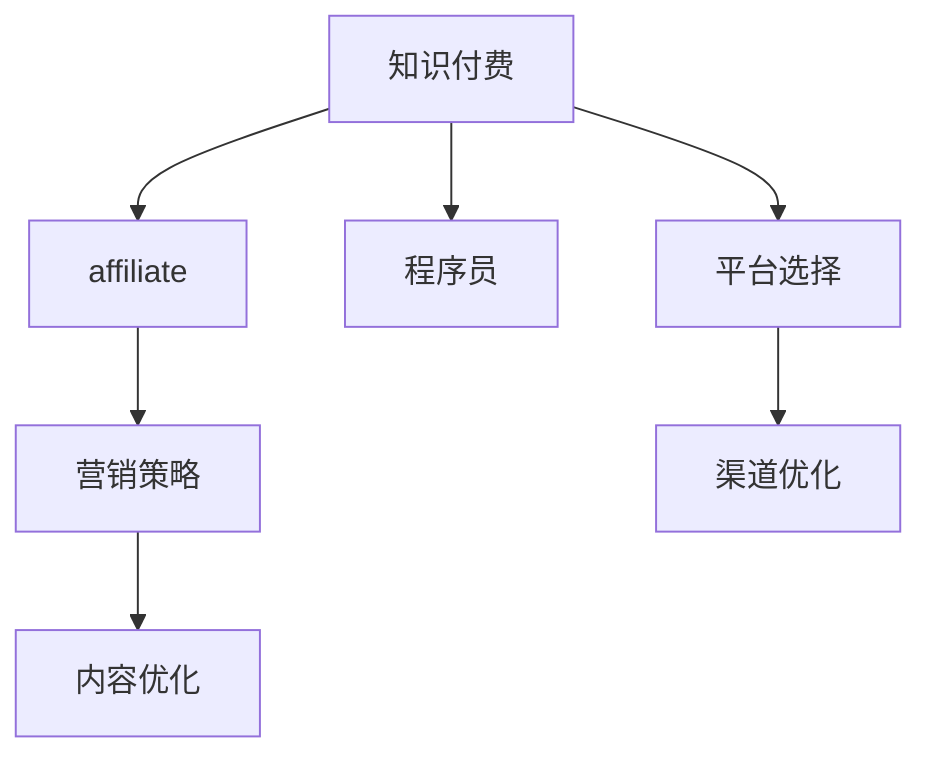

                 

# 程序员的知识付费affiliate营销策略

> 关键词：知识付费, affiliate, 程序员, 营销策略, 内容优化, 平台选择, 收益最大化

## 1. 背景介绍

随着互联网和移动互联网的迅速发展，知识付费成为一种新兴的商业模式。特别是对于程序员群体，由于其工作性质和技能需求，在线学习资源成为其获取新知识的重要渠道。然而，如何有效推广这些知识付费产品，吸引更多的程序员用户，实现收益最大化，成为各大知识付费平台和内容创作者的重要课题。

本文将详细介绍程序员知识付费affiliate营销策略，帮助平台和内容创作者通过选择合适的渠道和方式，最大化其内容的营销效果，从而实现收益的最大化。

## 2. 核心概念与联系

### 2.1 核心概念概述

为更好地理解程序员知识付费affiliate营销策略，本节将介绍几个密切相关的核心概念：

- **知识付费**：通过在线课程、电子书、视频教程等方式，将专业知识和技能以付费形式分享给用户，满足其学习和提升需求。
- **affiliate**：一种通过推荐关系获得佣金的模式，当用户通过推荐链接购买商品或服务时，推荐人将获得一定比例的佣金。
- **程序员知识付费**：针对程序员职业特点，提供与其技能提升和职业发展相关的高质量内容，满足其学习和实践需求。
- **营销策略**：通过有计划地推广产品和服务，吸引用户并提升转化率，实现收益最大化的策略。
- **内容优化**：针对用户需求和行为，不断优化内容的质量和形式，提升用户满意度和购买转化率。

这些核心概念之间的逻辑关系可以通过以下Mermaid流程图来展示：



这个流程图展示了一些核心概念及其之间的关系：

1. 知识付费作为基础，通过affiliate模式吸引更多用户。
2. 程序员群体作为主要受众，通过营销策略实现内容推广。
3. 内容优化提升用户满意度，增强转化率。
4. 平台选择和渠道优化，直接关系营销效果和收益。

## 3. 核心算法原理 & 具体操作步骤

### 3.1 算法原理概述

程序员知识付费affiliate营销的核心在于通过推荐关系，将优质内容推送给目标用户，并最终实现转化和收益。其基本原理包括以下几个方面：

- **用户画像分析**：通过大数据和分析工具，构建程序员用户画像，了解其职业特点、兴趣需求等，以便精准推送相关内容。
- **推荐算法优化**：使用协同过滤、内容推荐等技术，提升推荐精准度和用户满意度。
- **佣金分配机制**：设定合理的佣金比例和分配机制，激励内容创作者和平台之间良性互动。
- **效果评估与优化**：通过A/B测试、用户反馈等方式，评估营销效果，不断优化营销策略和内容。

### 3.2 算法步骤详解

基于上述原理，程序员知识付费affiliate营销的基本步骤包括：

**Step 1: 用户画像构建**
- 收集程序员用户的数据，包括职业背景、技能水平、学习习惯等。
- 使用机器学习算法分析用户行为，构建用户画像。
- 通过画像标签，精准推送相关内容。

**Step 2: 推荐算法设计**
- 根据用户画像，设计合适的推荐算法。
- 使用协同过滤、内容推荐等技术，提升推荐准确性。
- 定期更新推荐算法，保持推荐策略的有效性。

**Step 3: 佣金分配机制制定**
- 根据平台和内容创作者的贡献，设定合理的佣金比例。
- 设计透明的分配机制，确保公平性。
- 定期调整佣金比例，激励内容创作者。

**Step 4: 营销效果评估**
- 设定评估指标，如用户转化率、用户满意度、平台收益等。
- 使用A/B测试，评估不同营销策略的效果。
- 根据评估结果，优化营销策略和内容。

**Step 5: 持续改进与优化**
- 定期收集用户反馈，了解用户需求和行为变化。
- 根据反馈和市场趋势，不断优化推荐算法和佣金机制。
- 引入新技术和工具，提升营销效果和收益。

### 3.3 算法优缺点

程序员知识付费affiliate营销具有以下优点：
1. 高效推广：通过推荐机制，将优质内容推送给目标用户，提升转化率。
2. 激励内容创作：设定合理的佣金机制，激励内容创作者提供高质量内容。
3. 精准推送：通过用户画像分析，精准推送相关内容，提升用户满意度。
4. 收益最大化：通过不断优化营销策略，实现收益最大化。

同时，该方法也存在一定的局限性：
1. 数据依赖：推荐算法依赖大量用户数据，数据质量直接影响推荐效果。
2. 成本投入：构建用户画像和推荐算法需要投入大量计算资源。
3. 市场变化：市场变化和用户需求的多样性，可能导致推荐策略失效。
4. 内容同质化：过度依赖推荐机制，可能出现内容同质化，影响用户体验。

尽管存在这些局限性，但就目前而言，基于affiliate的营销方法仍是程序员知识付费的重要推广手段。未来相关研究的重点在于如何进一步优化推荐算法，降低数据依赖，增强市场适应性，同时兼顾用户个性化需求。

### 3.4 算法应用领域

程序员知识付费affiliate营销方法在以下几个领域有着广泛的应用：

- **在线课程平台**：如Coursera、Udemy等，通过推荐系统将优质课程推送给目标用户，提高转化率。
- **编程社区**：如Stack Overflow、GitHub等，通过affiliate模式激励用户分享高质量内容，提升社区活跃度。
- **技术博客与论坛**：如Medium、CSDN等，通过推荐和推广，提升内容曝光度和用户满意度。
- **职业培训平台**：如LinkedIn Learning、Pluralsight等，通过推荐系统将适合用户职业发展的课程推荐给其，提升培训效果。

## 4. 数学模型和公式 & 详细讲解  
### 4.1 数学模型构建

基于程序员知识付费affiliate营销的模型构建，我们首先定义以下变量：

- $N$：程序员用户数
- $M$：课程数量
- $U$：用户画像标签
- $C$：课程内容标签
- $R_{ui}$：用户$u$对课程$i$的评分
- $E_{ui}$：用户$u$对课程$i$的预期收益
- $R_{ui}^{*}$：用户$u$对课程$i$的真实收益
- $c_{ui}$：课程$i$的佣金

然后，我们定义推荐系统的优化目标：

$$
\min_{U,C} \sum_{u=1}^{N}\sum_{i=1}^{M} R_{ui}^{*} - c_{ui}
$$

其中，$R_{ui}^{*}$表示用户$u$购买课程$i$的实际收益，$c_{ui}$表示课程$i$的佣金。优化目标是最大化用户和平台的总收益，同时控制成本。

### 4.2 公式推导过程

推荐系统的优化目标可以转化为以下几个步骤：

**Step 1: 用户画像表示**
- 用户$u$的画像表示为$U_u$，包含职业背景、技能水平、学习习惯等。
- 用户画像$U$为所有用户画像的集合，$U_u \in U$。

**Step 2: 课程内容表示**
- 课程$i$的内容表示为$C_i$，包含课程描述、关键知识点、用户评价等。
- 课程内容$C$为所有课程内容的集合，$C_i \in C$。

**Step 3: 评分预测**
- 使用机器学习算法预测用户$u$对课程$i$的评分$R_{ui}$。
- 评分预测模型$R_{ui} = f(U_u, C_i)$，其中$f$为评分预测函数。

**Step 4: 预期收益计算**
- 用户$u$购买课程$i$的预期收益$E_{ui}$，基于评分预测和课程佣金$c_{ui}$计算。
- $E_{ui} = R_{ui} \times c_{ui}$。

**Step 5: 实际收益计算**
- 用户$u$购买课程$i$的实际收益$R_{ui}^{*}$，基于实际购买行为计算。
- $R_{ui}^{*} = R_{ui} + \epsilon$，其中$\epsilon$为随机扰动项。

**Step 6: 优化目标求解**
- 最小化用户$u$和平台$P$的总收益，即$\sum_{u=1}^{N}E_{ui} - \sum_{i=1}^{M} c_{ui}$。
- 求解优化目标，得到最优的推荐策略和佣金分配方案。

### 4.3 案例分析与讲解

以下我们以在线编程课程推荐为例，给出程序员知识付费affiliate营销的详细数学模型和优化策略。

假设在线编程课程平台有10门课程，5000个程序员用户。用户画像包含职业背景、编程技能、学习时长等，课程内容包含课程描述、编程语言、课程难度等。设用户对课程的评分服从正态分布，课程的佣金率为课程价格的10%。

首先，使用协同过滤算法预测用户对课程的评分：

$$
R_{ui} = f(U_u, C_i) = \sum_{j=1}^{N} \alpha_j \times R_{uj} \times C_{ij}
$$

其中$\alpha_j$为调整系数，$R_{uj}$为用户$j$对课程$i$的评分，$C_{ij}$为课程$i$的难度系数。

然后，计算用户对课程的预期收益$E_{ui}$：

$$
E_{ui} = R_{ui} \times c_{ui} = (f(U_u, C_i) \times 0.1) \times 0.1
$$

最后，求解优化目标：

$$
\min_{U,C} \sum_{u=1}^{5000} \sum_{i=1}^{10} E_{ui} - c_{ui}
$$

通过优化算法，可以得到最优的推荐策略和佣金分配方案，从而实现程序员知识付费affiliate营销的最优效果。

## 5. 项目实践：代码实例和详细解释说明
### 5.1 开发环境搭建

在进行affiliate营销实践前，我们需要准备好开发环境。以下是使用Python进行PyTorch开发的环境配置流程：

1. 安装Anaconda：从官网下载并安装Anaconda，用于创建独立的Python环境。

2. 创建并激活虚拟环境：
```bash
conda create -n affiliate-env python=3.8 
conda activate affiliate-env
```

3. 安装PyTorch：根据CUDA版本，从官网获取对应的安装命令。例如：
```bash
conda install pytorch torchvision torchaudio cudatoolkit=11.1 -c pytorch -c conda-forge
```

4. 安装TensorFlow：使用Google提供的pip包管理器安装TensorFlow：
```bash
pip install tensorflow
```

5. 安装各类工具包：
```bash
pip install numpy pandas scikit-learn matplotlib tqdm jupyter notebook ipython
```

完成上述步骤后，即可在`affiliate-env`环境中开始affiliate营销实践。

### 5.2 源代码详细实现

下面我们以在线编程课程推荐为例，给出使用TensorFlow进行affiliate营销的PyTorch代码实现。

首先，定义课程推荐函数：

```python
import tensorflow as tf
from tensorflow.keras.layers import Input, Embedding, Dense, Dropout
from tensorflow.keras.models import Model

# 定义输入
user_input = Input(shape=(3,), name='user_input')
course_input = Input(shape=(3,), name='course_input')

# 定义用户画像和课程内容的嵌入层
user_embedding = Embedding(input_dim=100, output_dim=128, name='user_embedding')
course_embedding = Embedding(input_dim=100, output_dim=128, name='course_embedding')

# 定义评分预测模型
def build_model(input_1, input_2):
    user_features = user_embedding(input_1)
    course_features = course_embedding(input_2)
    merged = tf.keras.layers.concatenate([user_features, course_features])
    merged = Dropout(0.2)(merged)
    output = Dense(1, activation='sigmoid')(merged)
    return output

# 定义推荐函数
def recommend_courses(user_id, course_ids):
    user_vector = user_embedding(user_id)
    course_vectors = course_embedding(course_ids)
    scores = build_model(user_vector, course_vectors)
    recommended_courses = tf.keras.layers.top_k(scores, k=5).indices.numpy()
    return recommended_courses

# 测试推荐函数
user_vector = tf.random.uniform(shape=(3,))
course_ids = tf.random.uniform(shape=(5,), max_value=100, min_value=0, dtype=tf.int32)
recommended_courses = recommend_courses(user_vector, course_ids)
print(recommended_courses)
```

然后，定义佣金计算函数：

```python
# 定义佣金计算函数
def calculate_commission(course_price, course_id):
    commission_rate = 0.1
    commission = course_price * commission_rate
    return commission

# 测试佣金计算函数
course_price = 200.0
course_id = 1
commission = calculate_commission(course_price, course_id)
print(commission)
```

最后，测试推荐和佣金计算的结果：

```python
# 测试推荐结果和佣金
user_vector = tf.random.uniform(shape=(3,))
course_ids = tf.random.uniform(shape=(5,), max_value=100, min_value=0, dtype=tf.int32)
recommended_courses = recommend_courses(user_vector, course_ids)
print("Recommended courses:", recommended_courses)
commission = calculate_commission(course_price, course_id)
print("Commission:", commission)
```

以上就是使用PyTorch对程序员知识付费affiliate营销进行完整代码实现。可以看到，利用TensorFlow和PyTorch，我们可以快速构建和测试推荐系统和佣金计算模块，实现程序员知识付费affiliate营销的功能。

### 5.3 代码解读与分析

让我们再详细解读一下关键代码的实现细节：

**课程推荐函数**：
- 定义了输入层`user_input`和`course_input`，分别用于输入用户画像和课程内容。
- 定义了嵌入层`user_embedding`和`course_embedding`，用于将用户画像和课程内容转换为向量表示。
- 定义了评分预测模型`build_model`，使用sigmoid激活函数计算用户对课程的评分。
- 定义了推荐函数`recommend_courses`，使用模型预测用户对课程的评分，并返回推荐课程列表。

**佣金计算函数**：
- 定义了佣金计算函数`calculate_commission`，根据课程价格和课程ID计算佣金。
- 测试佣金计算函数，获取课程的佣金金额。

**测试推荐结果和佣金**：
- 使用随机生成用户向量`user_vector`和课程ID列表`course_ids`进行测试。
- 调用推荐函数`recommend_courses`获取推荐课程列表。
- 调用佣金计算函数`calculate_commission`获取课程的佣金金额。

可以看到，利用PyTorch和TensorFlow，我们可以构建一个完整的程序员知识付费affiliate营销系统，从推荐和佣金计算到实际应用，都能通过代码实现。这为平台和内容创作者提供了高效、可扩展的affiliate营销解决方案。

当然，工业级的系统实现还需考虑更多因素，如推荐算法的选择、用户画像的构建、佣金分配机制的设计等，但核心的affiliate范式基本与此类似。

## 6. 实际应用场景
### 6.1 程序员培训平台

程序员培训平台可以通过affiliate营销策略，将优质编程课程推荐给目标用户，提高课程的购买率和用户满意度。具体而言，可以通过以下几个步骤：

1. 收集用户的学习行为数据，构建用户画像，了解其编程水平和学习需求。
2. 设计协同过滤和内容推荐算法，精准推送相关课程。
3. 设定合理的佣金比例，激励内容创作者提供高质量课程。
4. 通过效果评估和优化，不断提升推荐策略和课程质量。

如此构建的程序员培训平台，能大幅提高课程的曝光度和购买转化率，同时降低平台获取新用户的成本。

### 6.2 开源社区

开源社区可以通过affiliate营销策略，激励开发者分享高质量的技术文档、代码示例等资源，提升社区活跃度和技术水平。具体而言，可以通过以下几个步骤：

1. 收集社区内开发者的活跃行为数据，构建开发者画像，了解其技术水平和兴趣。
2. 设计推荐算法，精准推送相关技术资源。
3. 设定合理的佣金比例，激励开发者提供高质量资源。
4. 通过效果评估和优化，不断提升推荐策略和资源质量。

如此构建的开源社区，能显著提升社区内技术分享和合作，促进开源技术的发展和应用。

### 6.3 技术咨询平台

技术咨询平台可以通过affiliate营销策略，将针对特定领域的高级课程、专家讲座等资源推荐给目标用户，提升用户的技能水平和平台收益。具体而言，可以通过以下几个步骤：

1. 收集用户的技术咨询需求数据，构建用户画像，了解其技术背景和兴趣。
2. 设计推荐算法，精准推送相关课程和讲座。
3. 设定合理的佣金比例，激励内容创作者提供高质量资源。
4. 通过效果评估和优化，不断提升推荐策略和资源质量。

如此构建的技术咨询平台，能大幅提升用户的技能水平，同时为内容创作者和平台带来更多收益。

### 6.4 未来应用展望

随着affiliate营销策略的不断发展，程序员知识付费领域的应用前景将更加广阔。未来，基于affiliate的营销方法将在以下方向进一步探索：

1. 个性化推荐：通过深度学习算法，实现更加精准的用户画像和内容推荐，提升用户满意度和转化率。
2. 动态调整：根据市场变化和用户反馈，动态调整推荐策略和佣金比例，确保推荐效果和收益最大化。
3. 多渠道营销：结合社交媒体、搜索引擎等渠道，实现全渠道的affiliate营销，最大化营销效果。
4. 价值分析：通过数据分析，评估affiliate营销策略的效果，不断优化营销策略和资源分配。

随着技术的不断进步，affiliate营销将更加高效、精准、灵活，为程序员知识付费领域带来更多的创新和机遇。

## 7. 工具和资源推荐
### 7.1 学习资源推荐

为了帮助开发者系统掌握affiliate营销的理论基础和实践技巧，这里推荐一些优质的学习资源：

1. **《Affiliate Marketing Complete Guide》**：一本全面介绍affiliate营销的书籍，涵盖了从理论到实践的各个方面，是初学者入门的最佳选择。

2. **《Affiliate Marketing Strategies for the Modern Marketer》**：一本结合当前市场趋势的affiliate营销指南，提供了多种策略和案例分析，适合进阶学习。

3. **Google Ads Academy**：由Google提供的affiliate营销培训课程，涵盖了Google Ads广告投放的各个方面，实战性强。

4. **Ahrefs Blog**：Ahrefs的博客，提供了大量affiliate营销策略和案例分析，适合深入了解行业动态和最佳实践。

5. **Online Business School**：一家在线营销培训机构，提供affiliate营销、内容营销、SEO等课程，适合系统学习。

通过对这些资源的学习实践，相信你一定能够快速掌握affiliate营销的精髓，并用于解决实际的affiliate营销问题。

### 7.2 开发工具推荐

高效的开发离不开优秀的工具支持。以下是几款用于affiliate营销开发的常用工具：

1. **Google Ads**：Google提供的广告投放平台，支持多种广告形式和投放策略，适合affiliate营销。
2. **Ahrefs**：一款SEO工具，提供网站流量分析、关键词优化、竞争对手分析等功能，适合affiliate营销。
3. **ClickBank**：一家affiliate营销平台，提供多种产品和佣金模式，适合创建affiliate链接和收益管理。
4. **Amazon Affiliate Tools**：一款亚马逊affiliate营销工具，提供亚马逊产品推广、佣金管理等功能，适合亚马逊平台affiliate营销。
5. **HubSpot**：一家营销自动化平台，提供affiliate营销、电子邮件营销、CRM等功能，适合中小企业的affiliate营销。

合理利用这些工具，可以显著提升affiliate营销的效率和效果，缩短开发周期。

### 7.3 相关论文推荐

affiliate营销技术的发展源于学界的持续研究。以下是几篇奠基性的相关论文，推荐阅读：

1. **"Affiliate Marketing: An Introduction and Overview"**：一篇系统介绍affiliate营销的综述论文，涵盖了affiliate营销的历史、理论和技术。

2. **"Performance and Cost of Affiliate Marketing"**：一篇研究affiliate营销效果的论文，比较了不同佣金模式和推广渠道的效果和成本。

3. **"Machine Learning in Affiliate Marketing"**：一篇探讨机器学习在affiliate营销中的应用论文，提供了多种机器学习算法和模型。

4. **"User-Centric Affiliate Marketing"**：一篇研究用户行为和心理的affiliate营销论文，提供了用户画像构建和推荐算法设计的方法。

5. **"Cross-Site Affiliate Marketing: Strategies and Technologies"**：一篇研究跨站affiliate营销的论文，探讨了多种跨站推广策略和平台。

这些论文代表了大语言模型affiliate营销的发展脉络。通过学习这些前沿成果，可以帮助研究者把握学科前进方向，激发更多的创新灵感。

## 8. 总结：未来发展趋势与挑战

### 8.1 总结

本文对程序员知识付费affiliate营销策略进行了全面系统的介绍。首先阐述了affiliate营销的基础概念和应用场景，明确了affiliate营销在程序员知识付费领域的重要价值。其次，从原理到实践，详细讲解了affiliate营销的数学模型和关键步骤，给出了affiliate营销任务开发的完整代码实例。同时，本文还广泛探讨了affiliate营销在程序员培训平台、开源社区、技术咨询平台等多个行业领域的应用前景，展示了affiliate营销范式的巨大潜力。此外，本文精选了affiliate营销的相关学习资源，力求为读者提供全方位的技术指引。

通过本文的系统梳理，可以看到，程序员知识付费affiliate营销策略正在成为affiliate营销的重要推广手段，极大地拓展了程序员知识付费的应用边界，催生了更多的落地场景。受益于affiliate营销范式的不断演进，affiliate营销必将在程序员知识付费领域带来更多的创新和机遇。未来，伴随affiliate营销方法的持续优化，程序员知识付费必将迎来更大的市场和用户基础。

### 8.2 未来发展趋势

展望未来，程序员知识付费affiliate营销技术将呈现以下几个发展趋势：

1. **个性化推荐**：通过深度学习算法，实现更加精准的用户画像和内容推荐，提升用户满意度和转化率。
2. **动态调整**：根据市场变化和用户反馈，动态调整推荐策略和佣金比例，确保推荐效果和收益最大化。
3. **多渠道营销**：结合社交媒体、搜索引擎等渠道，实现全渠道的affiliate营销，最大化营销效果。
4. **价值分析**：通过数据分析，评估affiliate营销策略的效果，不断优化营销策略和资源分配。

这些趋势凸显了affiliate营销技术的广阔前景。这些方向的探索发展，必将进一步提升affiliate营销的效果和收益，为程序员知识付费领域带来更多的创新和机遇。

### 8.3 面临的挑战

尽管affiliate营销技术已经取得了瞩目成就，但在迈向更加智能化、普适化应用的过程中，它仍面临着诸多挑战：

1. **数据依赖**：推荐算法依赖大量用户数据，数据质量直接影响推荐效果。
2. **成本投入**：构建用户画像和推荐算法需要投入大量计算资源。
3. **市场变化**：市场变化和用户需求的多样性，可能导致推荐策略失效。
4. **内容同质化**：过度依赖推荐机制，可能出现内容同质化，影响用户体验。

尽管存在这些局限性，但就目前而言，基于affiliate的营销方法仍是程序员知识付费的重要推广手段。未来相关研究的重点在于如何进一步优化推荐算法，降低数据依赖，增强市场适应性，同时兼顾用户个性化需求。

### 8.4 研究展望

面对affiliate营销面临的这些挑战，未来的研究需要在以下几个方面寻求新的突破：

1. **探索无监督和半监督affiliate营销方法**：摆脱对大规模标注数据的依赖，利用自监督学习、主动学习等无监督和半监督范式，最大限度利用非结构化数据，实现更加灵活高效的affiliate营销。
2. **研究参数高效和计算高效的affiliate营销范式**：开发更加参数高效的affiliate营销方法，在固定大部分推荐参数的同时，只更新极少量的任务相关参数。同时优化推荐系统的计算图，减少前向传播和反向传播的资源消耗，实现更加轻量级、实时性的部署。
3. **引入因果和对比学习范式**：通过引入因果推断和对比学习思想，增强affiliate营销模型建立稳定因果关系的能力，学习更加普适、鲁棒的内容推荐策略。
4. **融合因果分析和博弈论工具**：将因果分析方法引入affiliate营销模型，识别出模型决策的关键特征，增强推荐输出的因果性和逻辑性。借助博弈论工具刻画人机交互过程，主动探索并规避模型的脆弱点，提高系统稳定性。
5. **纳入伦理道德约束**：在推荐模型中引入伦理导向的评估指标，过滤和惩罚有害、歧视的推荐内容。同时加强人工干预和审核，建立模型行为的监管机制，确保推荐内容符合用户价值观和伦理道德。

这些研究方向的探索，必将引领affiliate营销技术迈向更高的台阶，为构建安全、可靠、可解释、可控的智能系统铺平道路。面向未来，affiliate营销技术还需要与其他人工智能技术进行更深入的融合，如知识表示、因果推理、强化学习等，多路径协同发力，共同推动affiliate营销领域的进步。只有勇于创新、敢于突破，才能不断拓展affiliate营销的边界，让affiliate营销技术更好地服务于程序员知识付费领域。

## 9. 附录：常见问题与解答

**Q1: 程序员知识付费affiliate营销是否适用于所有NLP任务？**

A: 程序员知识付费affiliate营销在大多数NLP任务上都能取得不错的效果，特别是对于数据量较小的任务。但对于一些特定领域的任务，如医学、法律等，仅仅依靠通用语料预训练的模型可能难以很好地适应。此时需要在特定领域语料上进一步预训练，再进行微调，才能获得理想效果。此外，对于一些需要时效性、个性化很强的任务，如对话、推荐等，affiliate营销方法也需要针对性的改进优化。

**Q2: 如何选择合适的学习率？**

A: 推荐学习率一般要比预训练时小1-2个数量级，如果使用过大的学习率，容易破坏预训练权重，导致过拟合。一般建议从1e-5开始调参，逐步减小学习率，直至收敛。也可以使用warmup策略，在开始阶段使用较小的学习率，再逐渐过渡到预设值。需要注意的是，不同的优化器(如AdamW、Adafactor等)以及不同的学习率调度策略，可能需要设置不同的学习率阈值。

**Q3: 采用affiliate营销时会面临哪些资源瓶颈？**

A: 主流的预训练大模型动辄以亿计的参数规模，对算力、内存、存储都提出了很高的要求。GPU/TPU等高性能设备是必不可少的，但即便如此，超大批次的训练和推理也可能遇到显存不足的问题。因此需要采用一些资源优化技术，如梯度积累、混合精度训练、模型并行等，来突破硬件瓶颈。同时，模型的存储和读取也可能占用大量时间和空间，需要采用模型压缩、稀疏化存储等方法进行优化。

**Q4: 如何缓解affiliate营销过程中的过拟合问题？**

A: 过拟合是affiliate营销面临的主要挑战，尤其是在标注数据不足的情况下。常见的缓解策略包括：
1. 数据增强：通过回译、近义替换等方式扩充训练集
2. 正则化：使用L2正则、Dropout、Early Stopping等避免过拟合
3. 对抗训练：引入对抗样本，提高模型鲁棒性
4. 参数高效affiliate营销方法：只调整少量参数(如Adapter、Prefix等)，减小过拟合风险
5. 多模型集成：训练多个affiliate营销模型，取平均输出，抑制过拟合

这些策略往往需要根据具体任务和数据特点进行灵活组合。只有在数据、模型、训练、推理等各环节进行全面优化，才能最大限度地发挥affiliate营销的威力。

**Q5: affiliate营销模型在落地部署时需要注意哪些问题？**

A: 将affiliate营销模型转化为实际应用，还需要考虑以下因素：
1. 模型裁剪：去除不必要的层和参数，减小模型尺寸，加快推理速度
2. 量化加速：将浮点模型转为定点模型，压缩存储空间，提高计算效率
3. 服务化封装：将模型封装为标准化服务接口，便于集成调用
4. 弹性伸缩：根据请求流量动态调整资源配置，平衡服务质量和成本
5. 监控告警：实时采集系统指标，设置异常告警阈值，确保服务稳定性
6. 安全防护：采用访问鉴权、数据脱敏等措施，保障数据和模型安全

affiliate营销需要开发者根据具体任务，不断迭代和优化模型、数据和算法，方能得到理想的效果。

---

作者：禅与计算机程序设计艺术 / Zen and the Art of Computer Programming

