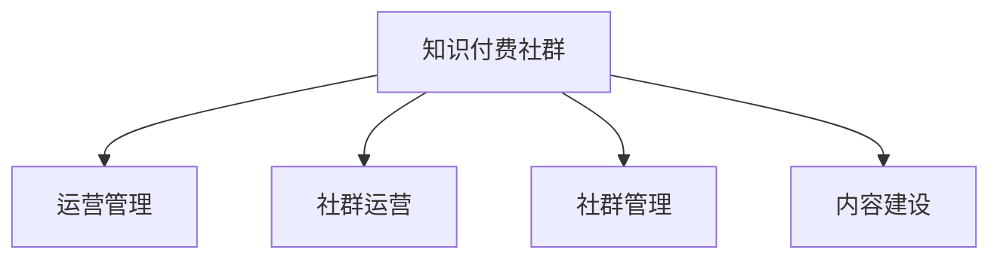

                 

# 程序员的知识付费社群运营与管理

> 关键词：知识付费社群, 运营管理, 社群运营, 社群管理, 知识付费

## 1. 背景介绍

### 1.1 问题由来

随着互联网技术的发展和普及，在线教育、知识付费等新模式开始兴起。知识付费社群以其高效、便捷、专业等特点，逐渐成为程序员学习、交流和获取知识的重要渠道。然而，由于知识付费社群数量众多，质量参差不齐，用户如何选择合适的社群，如何保证社群内容的高质量，如何运营管理社群，成为亟待解决的问题。本文将深入探讨知识付费社群的运营与管理，为程序员提供全面、系统、实用的指导。

### 1.2 问题核心关键点

知识付费社群的核心在于其高质量内容和有效运营管理。核心关键点包括：
- 高质量内容建设：如何筛选、策划和制作优质课程和文章，吸引和保留用户。
- 社群运营策略：如何通过多渠道营销、互动和反馈机制，提升社群活跃度和用户黏性。
- 社群管理制度：如何建立合理的管理机制，防止内容侵权、广告滥发等不良行为，保障用户权益。
- 用户需求分析：如何通过用户调研和数据分析，精准把握用户需求，提供定制化服务。
- 技术支持保障：如何通过有效的技术手段，如自动化工具、数据监控，提升社群运营效率。

## 2. 核心概念与联系

### 2.1 核心概念概述

为更好地理解知识付费社群的运营与管理，本节将介绍几个密切相关的核心概念：

- **知识付费社群**：指通过收费机制，为用户提供优质、高效、系统的知识和技能培训的在线社群。
- **运营管理**：指对社群进行多方面管理，包括用户管理、内容管理、活动管理等，确保社群健康、有序、高效运行。
- **社群运营**：指通过互动、引导、激励等手段，提升社群用户参与度，增强社群粘性和活力。
- **社群管理**：指建立并执行合理的管理制度，保障社群秩序，维护用户权益。
- **内容建设**：指精心策划、筛选、制作高质量内容，吸引和满足用户需求。

这些核心概念之间的逻辑关系可以通过以下Mermaid流程图来展示：



这个流程图展示知识付费社群的核心概念及其之间的关系：

1. 知识付费社群是运营与管理的主体，其中运营与内容建设是核心要素。
2. 运营管理包含社群运营和社群管理，提升社群活力和秩序。
3. 社群运营通过互动、激励等手段，增强用户参与度和社群粘性。
4. 社群管理通过合理的制度保障，维护社群秩序，保护用户权益。

这些概念共同构成了知识付费社群的运营与管理框架，为其健康、有序、高效运行提供了基础。

## 3. 核心算法原理 & 具体操作步骤
### 3.1 算法原理概述

知识付费社群的运营与管理，本质上是数据驱动的社群管理过程。其核心算法原理可以总结如下：

1. **数据采集与分析**：通过用户行为数据、内容反馈数据等，分析用户需求和内容效果，为运营管理提供依据。
2. **内容推荐系统**：利用推荐算法，精准匹配用户需求与内容，提升内容曝光率和用户满意度。
3. **用户行为预测**：通过机器学习模型，预测用户行为，优化运营策略，提升用户黏性。
4. **自动化工具应用**：引入自动化工具，提升内容生产、发布、互动等环节的效率，降低运营成本。

### 3.2 算法步骤详解

知识付费社群的运营与管理，一般包括以下关键步骤：

**Step 1: 数据采集与分析**

- 收集社群内用户行为数据，包括但不限于浏览、点赞、评论、分享等。
- 收集内容反馈数据，如课程评分、评论、文章点赞等。
- 使用数据分析工具，对数据进行统计、分析和可视化，生成用户画像和内容效果报告。

**Step 2: 内容推荐系统建设**

- 设计推荐算法模型，如协同过滤、基于内容的推荐、矩阵分解等。
- 训练模型，使用历史行为数据和内容特征，预测用户可能感兴趣的内容。
- 集成推荐算法到社群平台，自动推荐用户相关内容。

**Step 3: 用户行为预测与分析**

- 收集用户行为数据，如用户注册信息、学习时长、互动频率等。
- 使用机器学习模型，如逻辑回归、随机森林、神经网络等，预测用户流失、行为转化等。
- 根据预测结果，及时调整运营策略，提升用户留存和转化率。

**Step 4: 自动化工具应用**

- 引入自动化工具，如内容生成工具、数据监控工具、用户互动工具等，提升运营效率。
- 使用自动化脚本，批量处理内容发布、用户互动等任务，减少人工操作。
- 实时监控社群运行状态，及时发现并解决运营问题。

### 3.3 算法优缺点

知识付费社群的运营与管理，具有以下优点：

1. 数据驱动：通过数据采集与分析，实现精确、动态的运营管理，提升运营效果。
2. 个性化服务：利用推荐算法，为每位用户提供个性化的内容推荐，满足多样化需求。
3. 高效运营：引入自动化工具，提升运营效率，降低运营成本。
4. 精准决策：通过用户行为预测，及时调整运营策略，提升用户留存和转化率。

同时，该方法也存在一定的局限性：

1. 数据隐私问题：大量用户数据的收集和使用，可能引发隐私和安全问题，需要严格的数据保护措施。
2. 内容侵权风险：自动推荐可能导致侵权内容传播，需要建立严格的版权审查机制。
3. 算法偏见问题：推荐算法可能存在数据偏见，需要定期优化和校准。
4. 用户信任缺失：自动化运营可能导致用户对社群的信任度下降，需要平衡自动化和人工干预。

尽管存在这些局限性，但就目前而言，数据驱动的运营与管理方法仍是知识付费社群的主要范式。未来相关研究的重点在于如何进一步提升数据保护、版权审查和算法优化等方面的技术水平。

### 3.4 算法应用领域

知识付费社群的运营与管理方法，已在多个领域得到广泛应用，如教育培训、职业发展、技术分享等。具体如下：

- **教育培训**：通过知识付费社群，提供系统化的课程培训，满足各类职业技能和知识需求。如编程课程、数据分析课程、机器学习课程等。
- **职业发展**：提供职业规划、简历指导、面试培训等内容，帮助用户提升就业竞争力。
- **技术分享**：组织技术分享会、编程竞赛、开源项目等活动，促进技术交流和创新。
- **行业资讯**：提供行业动态、趋势分析、专家讲座等，帮助用户掌握最新行业信息。
- **兴趣爱好**：建立各类兴趣社群，提供兴趣培养、交友交流等，满足个性化需求。

除了上述这些经典应用外，知识付费社群还被创新性地应用到更多场景中，如企业培训、医疗健康、文娱传媒等，为各行各业带来新的学习和交流方式。随着知识付费社群的不断发展，相信其应用范围将不断拓展，为各类学习需求提供更加多样、高效、专业的服务。

## 4. 数学模型和公式 & 详细讲解 & 举例说明

### 4.1 数学模型构建

本节将使用数学语言对知识付费社群的运营与管理过程进行更加严格的刻画。

记知识付费社群用户集合为 $U=\{u_1, u_2, ..., u_N\}$，内容集合为 $C=\{c_1, c_2, ..., c_M\}$，用户行为数据为 $\mathcal{D}=\{(d_{u_i, c_j})_{i=1}^N\}$，其中 $d_{u_i, c_j} \in \{0, 1\}$ 表示用户 $u_i$ 是否浏览内容 $c_j$。内容推荐系统模型的输入为 $\mathcal{D}$，输出为推荐结果 $\hat{r}_{u_i, c_j} \in [0, 1]$，表示用户 $u_i$ 对内容 $c_j$ 的兴趣程度。

### 4.2 公式推导过程

以下我们以协同过滤推荐算法为例，推导推荐结果的计算公式。

协同过滤推荐算法基于用户历史行为数据，计算用户对内容的兴趣程度。假设有两个用户 $u_i$ 和 $u_j$，他们分别对内容 $c_k$ 和 $c_l$ 产生了兴趣，记为 $d_{u_i, c_k}=1$ 和 $d_{u_j, c_l}=1$。基于协同过滤的推荐公式为：

$$
\hat{r}_{u_i, c_j} = \frac{1}{1 + \sqrt{\sum_{k,l}d_{u_i, c_k}d_{u_j, c_l}^2 / (\sum_{k,l}d_{u_i, c_k}^2\sum_{k,l}d_{u_j, c_l}^2)}
$$

其中，$d_{u_i, c_k}d_{u_j, c_l}^2$ 表示用户 $u_i$ 和 $u_j$ 对内容 $c_k$ 和 $c_l$ 的兴趣程度，$\sum_{k,l}d_{u_i, c_k}^2\sum_{k,l}d_{u_j, c_l}^2$ 表示用户 $u_i$ 和 $u_j$ 对所有内容的兴趣程度之和。

将上述公式应用到推荐系统，可以得到用户 $u_i$ 对内容 $c_j$ 的推荐兴趣度 $\hat{r}_{u_i, c_j}$，根据兴趣度大小进行内容排序推荐，即可满足用户个性化需求。

### 4.3 案例分析与讲解

下面我们以教育培训社群为例，分析协同过滤推荐算法在课程推荐中的应用。

假设某教育培训社群内有10万名用户，每名用户平均学习过50门课程，每门课程包含50个课时。利用协同过滤算法，计算每位用户对其他课程的兴趣度，并根据兴趣度进行推荐。具体步骤如下：

1. 收集每位用户对所有课程的学习记录，构建用户-课程矩阵 $\mathbf{D} \in \mathbb{R}^{100,000 \times 50}$，其中 $d_{i,j}=1$ 表示用户 $u_i$ 学习过课程 $c_j$。
2. 计算用户 $u_i$ 和用户 $u_j$ 对所有课程的兴趣度，计算公式如上。
3. 根据兴趣度大小对课程进行排序，推荐给用户 $u_i$。

通过协同过滤推荐算法，可以实现课程内容的精准匹配，提升用户的学习体验和满意度。

## 5. 项目实践：代码实例和详细解释说明
### 5.1 开发环境搭建

在进行知识付费社群运营与管理的项目实践前，我们需要准备好开发环境。以下是使用Python进行Flask开发的开发环境配置流程：

1. 安装Anaconda：从官网下载并安装Anaconda，用于创建独立的Python环境。

2. 创建并激活虚拟环境：
```bash
conda create -n flask-env python=3.8 
conda activate flask-env
```

3. 安装Flask：
```bash
pip install Flask
```

4. 安装Gunicorn：
```bash
pip install gunicorn
```

5. 安装SQLAlchemy：
```bash
pip install SQLAlchemy
```

6. 安装Flask-SQLAlchemy：
```bash
pip install Flask-SQLAlchemy
```

7. 安装Flask-WTF：
```bash
pip install Flask-WTF
```

完成上述步骤后，即可在`flask-env`环境中开始知识付费社群运营与管理的实践。

### 5.2 源代码详细实现

下面我们以课程推荐系统为例，给出使用Flask进行知识付费社群运营的PyTorch代码实现。

首先，定义Flask应用，并连接数据库：

```python
from flask import Flask, render_template, request
from flask_sqlalchemy import SQLAlchemy

app = Flask(__name__)
app.config['SQLALCHEMY_DATABASE_URI'] = 'sqlite:///user_data.db'
db = SQLAlchemy(app)
```

然后，定义用户、课程和行为数据模型：

```python
class User(db.Model):
    id = db.Column(db.Integer, primary_key=True)
    name = db.Column(db.String(50), unique=True)

class Course(db.Model):
    id = db.Column(db.Integer, primary_key=True)
    name = db.Column(db.String(50))
    courses = db.relationship('UserCourse', backref='user', lazy=True)

class UserCourse(db.Model):
    id = db.Column(db.Integer, primary_key=True)
    user_id = db.Column(db.Integer, db.ForeignKey('user.id'))
    course_id = db.Column(db.Integer, db.ForeignKey('course.id'))
```

接着，定义推荐系统：

```python
from sklearn.metrics.pairwise import cosine_similarity

class RecommendationSystem:
    def __init__(self, matrix):
        self.matrix = matrix
    
    def fit(self, matrix):
        self.matrix = matrix
    
    def predict(self, user_id):
        user_vector = self.matrix[user_id, :]
        similarity_matrix = cosine_similarity(user_vector, self.matrix)
        similarity_matrix = similarity_matrix[1:, :]
        return similarity_matrix
```

最后，定义推荐页面和相关函数：

```python
@app.route('/')
def index():
    return render_template('index.html')

@app.route('/recommend', methods=['POST'])
def recommend():
    user_id = request.form['user_id']
    matrix = get_matrix(user_id)
    recommendation = RecommendationSystem(matrix)
    recommendation.fit(matrix)
    result = recommendation.predict(user_id)
    return render_template('recommend.html', result=result)
```

以上代码实现了一个简单的课程推荐系统，通过Flask框架搭建Web应用，利用SQLAlchemy连接数据库，使用协同过滤算法进行推荐。

### 5.3 代码解读与分析

让我们再详细解读一下关键代码的实现细节：

**Flask应用定义**：
- 使用Flask框架搭建Web应用，通过`app`对象实现路由、视图等操作。
- 配置数据库连接参数，使用SQLAlchemy作为ORM工具，连接SQLite数据库。

**模型定义**：
- 使用SQLAlchemy定义用户、课程和行为数据模型，使用关系型数据库存储。
- 用户模型存储用户基本信息，课程模型存储课程信息，行为数据模型存储用户对课程的学习记录。

**推荐系统实现**：
- 使用Scikit-learn的cosine_similarity函数计算相似度矩阵。
- 实现RecommendationSystem类，用于封装相似度计算和推荐逻辑。
- fit方法用于拟合相似度矩阵，predict方法用于预测推荐结果。

**路由定义**：
- 定义首页路由，返回模板文件。
- 定义推荐路由，接收用户ID，从数据库中获取行为数据矩阵，调用推荐系统进行预测，返回推荐结果页面。

通过上述代码实现，我们可以看到Flask和SQLAlchemy在知识付费社群运营与管理中的应用，通过简单的代码即可搭建起一个完整的推荐系统。

当然，实际应用中还需要考虑更多因素，如数据模型设计、推荐算法优化、UI/UX设计等。但核心的知识付费社群运营与管理流程基本与此类似。

## 6. 实际应用场景

### 6.1 教育培训

教育培训是知识付费社群的重要应用场景之一。通过知识付费社群，教育机构可以提供高质量课程，满足各类职业技能和知识需求。

具体而言，教育培训机构可以建立线上知识付费社群，吸引各类学习者。通过微课、直播、答疑等方式，提供系统化的课程培训。同时，还可以建立知识社区，让用户之间互相交流、分享经验，提升学习效果。

### 6.2 职业发展

职业发展是知识付费社群的另一大应用场景。通过知识付费社群，职业培训机构可以提供就业指导、简历撰写、面试培训等内容，帮助用户提升就业竞争力。

具体而言，职业培训机构可以在知识付费社群中，提供各类职业技能培训课程。同时，还可以邀请知名企业HR专家，进行线上讲座、模拟面试等，帮助用户更好地准备面试。

### 6.3 技术分享

技术分享是知识付费社群的重要应用场景之一。通过知识付费社群，技术人员可以分享技术经验、交流技术心得，提升技术水平。

具体而言，技术人员可以在知识付费社群中，发布技术文章、代码、项目等，供其他技术爱好者学习和讨论。同时，还可以组织技术分享会、编程竞赛、开源项目等活动，促进技术交流和创新。

### 6.4 未来应用展望

随着知识付费社群的不断发展，其在更多领域的应用前景将更加广阔。

在智慧医疗领域，知识付费社群可以提供医疗知识、技能培训、在线咨询等服务，帮助医疗工作者提升专业能力，为患者提供更优质的医疗服务。

在智能教育领域，知识付费社群可以提供个性化学习、智能推荐、在线辅导等服务，帮助学生提高学习效率，促进教育公平。

在智慧城市治理中，知识付费社群可以提供城市管理、交通规划、环境保护等内容，帮助市民了解城市动态，参与城市管理，提升城市治理水平。

此外，在企业培训、社会治理、文娱传媒等众多领域，知识付费社群的应用也将不断涌现，为各行各业带来新的学习和交流方式。相信随着技术的日益成熟，知识付费社群必将在构建人机协同的智能时代中扮演越来越重要的角色。

## 7. 工具和资源推荐
### 7.1 学习资源推荐

为了帮助开发者系统掌握知识付费社群的运营与管理理论基础和实践技巧，这里推荐一些优质的学习资源：

1. **《知识付费社群运营手册》**：本书系统介绍了知识付费社群的运营策略、用户管理、内容管理等核心内容，是入门学习的必备资料。

2. **《知识付费社群管理实践》**：本书通过具体案例，深入分析了知识付费社群的运营与管理挑战，提供了实用的解决方案。

3. **《知识付费社群运营实战》**：本书详细介绍了知识付费社群的营销、互动、反馈机制等，为社群运营提供了全面的指导。

4. **《知识付费社群技术架构》**：本书介绍了知识付费社群的架构设计、技术选型、数据库设计等，是技术实现的实用指南。

5. **《知识付费社群数据科学》**：本书系统介绍了知识付费社群的数据采集、分析、推荐等，为数据驱动的运营提供了理论基础。

通过对这些资源的学习实践，相信你一定能够快速掌握知识付费社群的运营与管理精髓，并用于解决实际的社群运营问题。

### 7.2 开发工具推荐

高效的开发离不开优秀的工具支持。以下是几款用于知识付费社群运营与管理的常用工具：

1. **Flask**：基于Python的开源Web框架，灵活易用，适用于快速迭代的研究和开发。

2. **SQLAlchemy**：Python的ORM工具，支持多种数据库，便于数据管理和操作。

3. **Scikit-learn**：Python的机器学习库，提供了丰富的推荐算法和数据处理工具。

4. **Gunicorn**：Python的WSGI服务器，支持异步处理，适用于高并发环境。

5. **Jupyter Notebook**：交互式编程环境，便于数据探索和算法验证。

6. **TensorBoard**：TensorFlow配套的可视化工具，实时监测模型训练状态，提供丰富的图表呈现方式。

7. **ELK Stack**：日志管理、监控、数据分析工具，便于分析和排查运营问题。

合理利用这些工具，可以显著提升知识付费社群的开发效率，加快创新迭代的步伐。

### 7.3 相关论文推荐

知识付费社群的运营与管理发展源于学界的持续研究。以下是几篇奠基性的相关论文，推荐阅读：

1. **《知识付费社群用户行为分析》**：研究知识付费社群的用户行为特征，提供用户画像和行为预测模型。

2. **《知识付费社群推荐系统研究》**：探讨协同过滤、基于内容的推荐等推荐算法在知识付费社群中的应用。

3. **《知识付费社群运营策略分析》**：通过实证分析，提出知识付费社群的运营管理策略，提升运营效果。

4. **《知识付费社群技术架构设计》**：介绍知识付费社群的架构设计、技术选型、数据库设计等。

5. **《知识付费社群数据科学应用》**：研究知识付费社群的数据采集、分析、推荐等技术方法，提供实用指导。

这些论文代表了大语言模型微调技术的发展脉络。通过学习这些前沿成果，可以帮助研究者把握学科前进方向，激发更多的创新灵感。

## 8. 总结：未来发展趋势与挑战

### 8.1 总结

本文对知识付费社群的运营与管理进行了全面系统的介绍。首先阐述了知识付费社群的研究背景和意义，明确了运营管理在社群健康、有序、高效运行中的核心作用。其次，从理论到实践，详细讲解了运营管理的核心算法原理和具体操作步骤，给出了知识付费社群运营与管理的完整代码实例。同时，本文还广泛探讨了知识付费社群在教育培训、职业发展、技术分享等多个领域的应用前景，展示了知识付费社群的巨大潜力。此外，本文精选了运营管理的各类学习资源，力求为开发者提供全方位的技术指引。

通过本文的系统梳理，可以看到，知识付费社群的运营与管理技术正在成为知识付费的重要范式，极大地拓展了教育培训、职业发展、技术分享等社群的应用边界，推动了知识付费技术的产业化进程。未来，伴随技术的不断发展，知识付费社群必将在更多领域得到应用，为各类学习需求提供更加多样、高效、专业的服务。

### 8.2 未来发展趋势

展望未来，知识付费社群的运营与管理技术将呈现以下几个发展趋势：

1. **智能化程度提升**：利用人工智能技术，提升内容推荐、用户行为预测等环节的智能化程度，提升运营效率。

2. **个性化服务增强**：通过个性化推荐、智能辅导等手段，提供更加贴合用户需求的服务，提升用户满意度。

3. **数据驱动运营**：进一步提升数据采集、分析和应用能力，实现精准的运营管理，提升运营效果。

4. **社区管理优化**：建立更加严格、公正的管理制度，防止内容侵权、广告滥发等不良行为，保障用户权益。

5. **跨平台协同**：实现社群内的多平台协同，提升用户体验和活跃度，促进内容分享和交流。

6. **国际化拓展**：拓展知识付费社群的国际市场，提供多语言支持和国际化运营，提升全球影响力。

以上趋势凸显了知识付费社群的运营与管理技术的广阔前景。这些方向的探索发展，必将进一步提升知识付费社群的运营效果，为各类学习需求提供更加多样化、高效、专业的服务。

### 8.3 面临的挑战

尽管知识付费社群的运营与管理技术已经取得了瞩目成就，但在迈向更加智能化、普适化应用的过程中，它仍面临着诸多挑战：

1. **数据隐私问题**：大量用户数据的收集和使用，可能引发隐私和安全问题，需要严格的数据保护措施。

2. **内容侵权风险**：自动推荐可能导致侵权内容传播，需要建立严格的版权审查机制。

3. **算法偏见问题**：推荐算法可能存在数据偏见，需要定期优化和校准。

4. **用户信任缺失**：自动化运营可能导致用户对社群的信任度下降，需要平衡自动化和人工干预。

5. **社区管理难度**：社群规模扩大后，管理难度增加，需要引入更多智能手段和人工监管。

6. **国际化拓展挑战**：拓展国际市场需要解决多语言支持、文化差异等问题，需要更多的资源投入。

正视知识付费社群运营与管理面临的这些挑战，积极应对并寻求突破，将是知识付费社群走向成熟的关键。相信随着学界和产业界的共同努力，这些挑战终将一一被克服，知识付费社群必将在构建人机协同的智能时代中扮演越来越重要的角色。

### 8.4 研究展望

面对知识付费社群运营与管理所面临的挑战，未来的研究需要在以下几个方面寻求新的突破：

1. **智能化运营**：探索更多智能技术，如自然语言处理、计算机视觉等，提升知识付费社群的智能化程度。

2. **个性化推荐**：研究个性化推荐算法，提供更加贴合用户需求的服务，提升用户满意度。

3. **数据安全保护**：加强数据隐私保护，建立完善的数据保护机制，保障用户隐私安全。

4. **社区治理优化**：建立更加公正、透明的管理制度，防止内容侵权、广告滥发等不良行为，保障用户权益。

5. **国际化运营**：拓展知识付费社群的国际市场，提供多语言支持和国际化运营，提升全球影响力。

这些研究方向的探索，必将引领知识付费社群的运营与管理技术迈向更高的台阶，为各类学习需求提供更加多样、高效、专业的服务。面向未来，知识付费社群需要与其他人工智能技术进行更深入的融合，如知识表示、因果推理、强化学习等，多路径协同发力，共同推动智能社区的发展。

## 9. 附录：常见问题与解答

**Q1：知识付费社群如何筛选高质量课程？**

A: 高质量课程的筛选主要从以下几个方面进行：

1. **专家评审**：邀请行业专家、知名教师对课程内容进行评审，确保课程内容科学、准确。

2. **用户反馈**：收集用户对课程的评价和反馈，及时调整课程内容，优化教学效果。

3. **数据驱动**：利用用户行为数据和推荐算法，分析课程的关注度和受欢迎程度，筛选出高关注度课程。

**Q2：知识付费社群如何提升用户黏性？**

A: 提升用户黏性主要通过以下几个方面进行：

1. **个性化推荐**：通过协同过滤、基于内容的推荐等算法，提供个性化课程推荐，满足用户多样化需求。

2. **互动交流**：建立用户之间的交流平台，促进互动和讨论，增强社群活跃度。

3. **奖励机制**：设计合理的奖励机制，如课程折扣、免费试用等，激励用户参与和学习。

4. **持续学习**：定期推出新课程和活动，保持社群内容的更新和多样性，增强用户黏性。

**Q3：知识付费社群如何建立完善的社区管理制度？**

A: 建立完善的社区管理制度主要从以下几个方面进行：

1. **内容审核**：建立严格的内容审核机制，防止侵权内容传播，保障用户权益。

2. **用户行为监管**：监控用户行为，防止广告滥发、虚假宣传等不良行为，保障社群秩序。

3. **投诉机制**：建立用户投诉机制，及时处理用户举报的问题，维护社群公平和正义。

4. **社区规则**：制定清晰的社区规则，引导用户行为，提升社群文明程度。

**Q4：知识付费社群如何进行数据隐私保护？**

A: 数据隐私保护主要从以下几个方面进行：

1. **数据匿名化**：对用户数据进行匿名化处理，保护用户隐私。

2. **数据加密**：采用数据加密技术，防止数据泄露和滥用。

3. **权限控制**：设置严格的权限控制机制，防止未经授权的数据访问和修改。

4. **法律合规**：遵守相关法律法规，确保数据隐私保护符合法律要求。

---

作者：禅与计算机程序设计艺术 / Zen and the Art of Computer Programming

