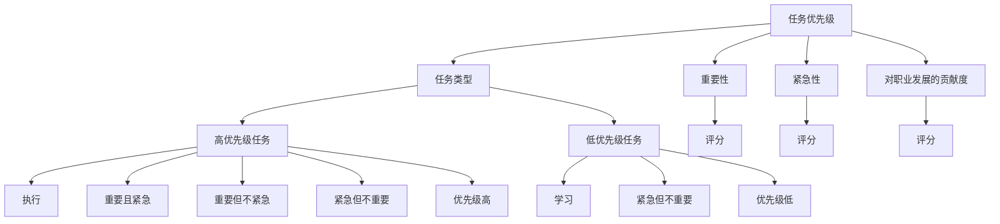

                 

# 程序员的知识变现时间管理

在当今数字化时代，程序员不仅需要具备技术上的专业能力，还应具备时间管理上的卓越技能。对程序员而言，如何高效利用时间，将知识转化为经济效益，是一项重要的能力。本文将从背景介绍、核心概念与联系、核心算法原理、数学模型和公式推导、项目实践、实际应用场景、工具和资源推荐、总结与未来发展趋势等多个维度，系统探讨程序员的知识变现时间管理。

## 1. 背景介绍

### 1.1 问题由来
现代软件开发往往涉及复杂的项目管理、跨团队协作以及多任务处理，这对程序员的时间管理能力提出了更高的要求。而高效的时间管理不仅可以提升个人工作效率，还能有效降低项目延期风险，增加知识变现的机会。

然而，由于程序员工作环境的特殊性，长时间面对电脑和代码，容易产生职业倦怠，同时技术更新速度快，也给时间管理带来了挑战。如何兼顾工作与生活，同时不断更新知识以适应技术发展，成为许多程序员面临的难题。

### 1.2 问题核心关键点
程序员的知识变现时间管理，主要包括几个关键点：

- **任务优先级划分**：明确不同任务的优先级，优先处理高价值和高优先级任务。
- **时间块管理**：将一天划分为不同时间块，专注于不同类型的任务。
- **任务与学习的平衡**：合理安排学习和工作时间，保持知识更新与项目交付的平衡。
- **工具与技术的应用**：利用时间管理工具和技术，提高效率。
- **自我驱动与目标设定**：设定清晰的目标，保持自我驱动和持续学习。

## 2. 核心概念与联系

### 2.1 核心概念概述

为更好地理解程序员的知识变现时间管理，本节将介绍几个核心概念：

- **任务优先级**：根据任务的重要性、紧急性和对个人职业发展的贡献度，对任务进行优先级排序。
- **时间块管理**：将一天划分为固定的时间块，每个时间块专注于处理特定类型的任务。
- **专注力**：保持专注，避免多任务处理，提高工作效率。
- **知识管理**：记录、整理和应用新知识，持续更新自己的知识体系。
- **时间日志**：记录和分析时间分配，识别时间管理中的瓶颈和改进点。

### 2.2 核心概念原理和架构的 Mermaid 流程图



此流程图展示了任务优先级划分的逻辑：

1. 根据任务的重要性、紧急性以及对职业发展的贡献度，对任务进行优先级排序。
2. 高优先级任务包括重要且紧急的任务、重要但不紧急的任务。
3. 低优先级任务包括紧急但不重要的任务。
4. 重要且紧急的任务优先级最高，次之是重要但不紧急的任务。

## 3. 核心算法原理 & 具体操作步骤

### 3.1 算法原理概述

程序员的知识变现时间管理，本质上是一个任务调度和优先级管理的过程。其核心思想是：将一天划分为固定的时间块，对任务进行优先级排序，并根据优先级分配时间块，以提高工作效率和知识变现能力。

形式化地，假设一天有 $T$ 个时间块，每个时间块长度为 $t$，任务集合为 $S$。设任务 $s_i$ 的优先级为 $p_i$，则时间管理的目标是找到最优的任务分配策略 $\pi$，使得：

$$
\pi = \mathop{\arg\max}_{\pi} \sum_{i=1}^{|S|} p_i t_{\pi(i)}
$$

其中 $\pi$ 为任务分配策略，$t_{\pi(i)}$ 为任务 $s_i$ 在时间块 $\pi$ 中的分配时长。

### 3.2 算法步骤详解

基于任务优先级的时间管理方法，一般包括以下几个关键步骤：

**Step 1: 准备任务列表**
- 列出一天需要完成的所有任务，包括工作任务和自主学习任务。
- 评估每个任务的优先级，定义其重要性、紧急性以及职业发展贡献度。

**Step 2: 划分时间块**
- 根据任务类型，将一天划分为不同的时间块，如集中处理高优先级任务的时间块、集中学习新知识的时间块。
- 时间块的长度可以根据任务难度和工作状态进行调整，如上午效率较高，时间块长度可适当缩短。

**Step 3: 分配任务**
- 将任务按照优先级排序，优先处理高优先级任务。
- 将任务分配到不同的时间块中，确保高优先级任务得到足够的时间保障。

**Step 4: 执行与调整**
- 按照分配的时间块进行任务执行。
- 记录每个任务实际执行时间，与计划时间进行对比，根据实际情况进行调整。

**Step 5: 评估与优化**
- 定期评估时间管理效果，分析任务执行情况和时间分配的合理性。
- 根据评估结果，调整时间块划分和任务分配策略。

### 3.3 算法优缺点

基于任务优先级的时间管理方法，具有以下优点：

- 提高效率：优先处理高优先级任务，确保重要工作的优先完成。
- 避免拖延：将任务分解为小时间块，减少拖延的可能性。
- 提升专注力：专注于单个任务，避免多任务处理带来的效率下降。

但该方法也存在一定的局限性：

- 灵活性不足：时间块划分过于固定，可能导致应对突发情况时灵活性不够。
- 忽视低优先级任务：如果低优先级任务被忽略，长期可能导致工作失衡。
- 主观性强：任务的优先级划分可能存在主观偏见。

### 3.4 算法应用领域

基于任务优先级的时间管理方法，在软件开发、项目管理和知识更新等多个领域都有广泛应用：

- **软件开发**：对每日任务进行优先级划分，确保高价值功能的优先开发。
- **项目管理**：合理分配团队成员的时间，优先处理关键任务，确保项目进度。
- **知识更新**：将时间块分配给学习和阅读，保持技术能力的持续提升。

此外，该方法还可以应用于个人生活管理，如健身、娱乐等，提升整体生活质量。

## 4. 数学模型和公式 & 详细讲解

### 4.1 数学模型构建

考虑一个简单的单任务模型，假设一天有 $T$ 个时间块，每个时间块长度为 $t$，任务 $s$ 的优先级为 $p$，时间管理的目标是找到最优的时间块分配策略 $\pi$，使得任务 $s$ 的执行时长最大化。

设 $\pi$ 为任务 $s$ 在时间块 $\pi$ 中的分配时长，则目标函数为：

$$
\mathop{\max}_{\pi} \sum_{i=1}^T \pi_i t
$$

满足约束条件：

$$
\sum_{i=1}^T \pi_i = p \quad \text{和} \quad \pi_i \geq 0 \quad \text{对于} \quad i=1,2,\dots,T
$$

### 4.2 公式推导过程

将目标函数和约束条件带入拉格朗日乘子法中，求解该优化问题。

令拉格朗日函数为：

$$
\mathcal{L}(\pi,\lambda,\mu) = \sum_{i=1}^T \pi_i t + \lambda (\sum_{i=1}^T \pi_i - p) + \mu (\pi_i \geq 0 \quad \text{对于} \quad i=1,2,\dots,T)
$$

对 $\pi$、$\lambda$、$\mu$ 求偏导，得到：

$$
\frac{\partial \mathcal{L}}{\partial \pi_i} = t + \lambda + \mu \frac{\partial \pi_i}{\partial \pi} = 0
$$

$$
\frac{\partial \mathcal{L}}{\partial \lambda} = \sum_{i=1}^T \pi_i - p = 0
$$

$$
\frac{\partial \mathcal{L}}{\partial \mu} = \pi_i = 0
$$

由此可得：

$$
\pi_i = \min\left(1,\frac{t p}{\sum_{i=1}^T t}\right)
$$

因此，最优分配策略为：

$$
\pi_i = \begin{cases}
\frac{t p}{\sum_{i=1}^T t}, & \text{如果} \quad i=1,2,\dots,T \\
0, & \text{如果} \quad i=T+1,\dots,T'
\end{cases}
$$

其中 $T'$ 为实际可用时间块数，$p$ 为任务 $s$ 的优先级。

### 4.3 案例分析与讲解

假设有一个程序员，一天有8个时间块，每个时间块长度为1小时，共有4个任务 $A$、$B$、$C$、$D$，它们的优先级分别为 $p_A=0.4$、$p_B=0.3$、$p_C=0.2$、$p_D=0.1$。按照上述公式计算每个任务的分配时间：

$$
\pi_A = \frac{8 \times 0.4}{8} = 0.4
$$

$$
\pi_B = \frac{8 \times 0.3}{8} = 0.3
$$

$$
\pi_C = \frac{8 \times 0.2}{8} = 0.2
$$

$$
\pi_D = \frac{8 \times 0.1}{8} = 0.1
$$

因此，任务 $A$ 应分配到4个时间块中，任务 $B$ 应分配到2.4个时间块中，任务 $C$ 应分配到1.6个时间块中，任务 $D$ 应分配到0.8个时间块中。

通过此案例，可以看到任务优先级和分配策略对时间管理的重要影响。合理分配时间块，可以有效提升工作效率，确保高价值任务得到充分处理。

## 5. 项目实践：代码实例和详细解释说明

### 5.1 开发环境搭建

在进行时间管理实践前，我们需要准备好开发环境。以下是使用Python进行开发的环境配置流程：

1. 安装Anaconda：从官网下载并安装Anaconda，用于创建独立的Python环境。

2. 创建并激活虚拟环境：
```bash
conda create -n time-manage python=3.8 
conda activate time-manage
```

3. 安装Python相关工具包：
```bash
pip install numpy pandas matplotlib
```

4. 安装Google Calendar API：
```bash
pip install google-api-python-client
```

### 5.2 源代码详细实现

下面我们以任务优先级和时间块管理为例，给出使用Python实现时间管理的代码。

首先，定义一个任务类，包含任务的基本信息：

```python
class Task:
    def __init__(self, name, priority, duration):
        self.name = name
        self.priority = priority
        self.duration = duration
        
    def __repr__(self):
        return f"Task({self.name}, {self.priority}, {self.duration})"
```

然后，定义时间块管理类，实现时间块划分和任务分配：

```python
class TimeManager:
    def __init__(self, tasks, block_duration):
        self.tasks = tasks
        self.block_duration = block_duration
        self.blocks = {}
        self.total_blocks = sum(task.duration for task in tasks)
        self.block_counter = 0
        self.block_index = 0
        
    def allocate_tasks(self):
        for task in self.tasks:
            block_count = int(task.priority * self.total_blocks / self.block_duration)
            self.blocks[task.name] = block_count
            self.block_counter += block_count
            self.block_index += 1
            
    def display_tasks(self):
        for task, count in self.blocks.items():
            print(f"{task}: {count} blocks")
            
    def display_time(self):
        print(f"Total time blocks: {self.total_blocks}")
        print(f"Available time blocks: {self.block_counter}")
```

最后，定义一个示例，展示如何创建一个时间管理器并分配任务：

```python
# 创建任务
task1 = Task("Task1", 0.4, 4)
task2 = Task("Task2", 0.3, 3)
task3 = Task("Task3", 0.2, 2)
task4 = Task("Task4", 0.1, 1)

# 创建时间管理器
manager = TimeManager([task1, task2, task3, task4], 1)

# 分配任务
manager.allocate_tasks()

# 输出任务分配结果
manager.display_tasks()
manager.display_time()
```

### 5.3 代码解读与分析

让我们再详细解读一下关键代码的实现细节：

**Task类**：
- `__init__`方法：初始化任务的基本信息，包括任务名称、优先级和执行时间。
- `__repr__`方法：返回任务的字符串表示。

**TimeManager类**：
- `__init__`方法：初始化时间管理器的基本参数，包括任务列表、时间块长度、已分配的时间块数量、可用时间块数量。
- `allocate_tasks`方法：遍历所有任务，根据优先级分配时间块。
- `display_tasks`方法：输出每个任务分配的时间块数量。
- `display_time`方法：输出总时间块数和可用时间块数。

**示例代码**：
- 创建四个任务，优先级分别为0.4、0.3、0.2、0.1，执行时间分别为4、3、2、1。
- 创建一个时间管理器，时间块长度为1，开始分配任务。
- 输出任务分配结果和时间块统计信息。

可以看到，通过Python代码实现任务优先级和时间块管理，可以更加直观地展示时间管理的效果。开发者可以基于此代码，进一步扩展功能，如记录实际执行时间、自动调整时间块等。

## 6. 实际应用场景

### 6.1 软件开发

基于任务优先级的时间管理方法，在软件开发中具有广泛应用。软件开发过程中，任务繁多，且常常需要跨团队协作。如何高效分配任务，确保项目按时交付，是软件开发团队面临的重大挑战。

具体应用场景包括：
- **项目规划**：根据项目需求和进度，制定每日、每周任务计划，确保关键功能优先开发。
- **任务拆分**：将复杂任务拆分为小任务，便于并行处理，提升开发效率。
- **团队协作**：明确每个团队成员的任务优先级，协调资源，避免资源浪费。

### 6.2 项目管理

项目管理的核心在于时间管理，合理分配时间和资源，确保项目顺利进行。基于任务优先级的时间管理方法，可以帮助项目管理团队高效处理各类任务，提升项目成功率。

具体应用场景包括：
- **任务优先级排序**：根据任务的重要性和紧急性，制定优先级排序。
- **资源分配**：根据任务优先级分配团队资源，确保高价值任务得到优先保障。
- **进度跟踪**：实时跟踪任务进度，及时调整计划，避免项目延期。

### 6.3 知识更新

在快速发展的技术领域，程序员需要不断学习新知识以保持竞争力。基于任务优先级的时间管理方法，可以帮助程序员合理分配学习时间，确保知识更新与工作任务之间保持平衡。

具体应用场景包括：
- **学习计划**：根据工作量和知识需求，制定学习计划，确保定期更新知识。
- **知识记录**：记录学习过程中的关键知识点和心得体会，方便后续复习和应用。
- **技能提升**：将学习时间分配到高效学习场景，如在线课程、书籍阅读等，提升技术能力。

### 6.4 未来应用展望

随着技术的发展和应用的深入，基于任务优先级的时间管理方法将不断演进，呈现以下趋势：

1. **智能调度**：引入人工智能算法，自动调整任务优先级和时间块划分，提升时间管理效率。
2. **自动化工具**：开发更多自动化的工具和插件，辅助任务管理和时间记录。
3. **多设备同步**：实现跨设备、跨平台的时间管理，提升工作的灵活性和便利性。
4. **个性化定制**：根据个人工作习惯和任务类型，定制个性化的时间管理方案。

## 7. 工具和资源推荐

### 7.1 学习资源推荐

为了帮助开发者系统掌握时间管理理论基础和实践技巧，这里推荐一些优质的学习资源：

1. **《深度工作》（Deep Work）**：作者Cal Newport提出，通过深度工作（即高度集中注意力、无干扰的工作状态）来提升个人效率和创造力。
2. **《番茄工作法图解》**：介绍番茄工作法，通过短暂的高强度工作和休息，提升工作效率。
3. **Coursera时间管理课程**：提供系统的时间管理课程，涵盖任务优先级、时间块管理、多任务处理等多个方面。
4. **Google Calendar API**：用于时间管理的应用程序开发，提供时间块管理和任务调度等功能。

通过对这些资源的学习实践，相信你一定能够快速掌握时间管理技巧，并将知识转化为实际效益。

### 7.2 开发工具推荐

高效的开发离不开优秀的工具支持。以下是几款用于时间管理开发的常用工具：

1. **Trello**：项目管理工具，通过看板和列表的形式，直观展示任务进度和优先级。
2. **Notion**：笔记和任务管理工具，支持多种任务类型，提供丰富的模板和插件。
3. **JIRA**：企业级项目管理工具，支持复杂的任务和问题跟踪，适用于大型团队协作。
4. **Google Calendar**：时间管理工具，支持时间块管理和任务提醒，集成Google Drive和Gmail等功能。
5. **Todoist**：任务管理工具，支持多平台同步，提供丰富的任务优先级和提醒功能。

合理利用这些工具，可以显著提升时间管理的效率，加速工作进度和知识变现。

### 7.3 相关论文推荐

时间管理技术的发展源于学界的持续研究。以下是几篇奠基性的相关论文，推荐阅读：

1. **《时间管理：理论与实践》（Time Management: Theory and Practice）**：对时间管理理论和方法进行了系统综述，提供了丰富的实践案例。
2. **《番茄工作法：一个高效的工作法》（The Pomodoro Technique: A Productive System for Personal and Professional Development）**：介绍番茄工作法，通过短暂的休息间隔提升工作效率。
3. **《任务管理：提高个人和团队效率》（Task Management: Boosting Productivity for Individuals and Teams）**：探讨了任务管理对个人和团队效率的影响，提供了实用的时间管理策略。
4. **《深度工作：分心时代的专注力》（Deep Work: Rules for Focused Success in a Distracted World）**：深度探讨了深度工作对个人效率和创造力的提升作用，提供了实用的时间管理建议。

这些论文代表了大语言模型微调技术的发展脉络。通过学习这些前沿成果，可以帮助研究者把握学科前进方向，激发更多的创新灵感。

## 8. 总结：未来发展趋势与挑战

### 8.1 总结

本文对基于任务优先级的时间管理方法进行了全面系统的介绍。首先阐述了时间管理在程序员工作中的重要性，明确了任务优先级和时间块管理的关键点。其次，从原理到实践，详细讲解了任务优先级划分和时间块分配的数学模型和实现方法，给出了时间管理任务开发的完整代码实例。同时，本文还广泛探讨了时间管理方法在软件开发、项目管理、知识更新等多个领域的应用前景，展示了时间管理范式的巨大潜力。

通过本文的系统梳理，可以看到，基于任务优先级的时间管理方法正在成为程序员时间管理的重要范式，极大地提升了个人工作效率和知识变现能力。未来，伴随技术的发展和应用的深入，时间管理技术还将不断演进，为程序员和开发团队带来更多创新和突破。

### 8.2 未来发展趋势

展望未来，时间管理技术将呈现以下几个发展趋势：

1. **智能化调度**：引入人工智能算法，自动调整任务优先级和时间块划分，提升时间管理效率。
2. **自动化工具**：开发更多自动化的工具和插件，辅助任务管理和时间记录。
3. **多设备同步**：实现跨设备、跨平台的时间管理，提升工作的灵活性和便利性。
4. **个性化定制**：根据个人工作习惯和任务类型，定制个性化的时间管理方案。

这些趋势凸显了时间管理技术的广阔前景。这些方向的探索发展，必将进一步提升时间管理的效率和灵活性，为程序员和开发团队带来更多创新和突破。

### 8.3 面临的挑战

尽管时间管理技术已经取得了一定的成果，但在迈向更加智能化、自动化、个性化应用的过程中，它仍面临诸多挑战：

1. **灵活性不足**：时间块划分过于固定，可能导致应对突发情况时灵活性不够。
2. **主观性强**：任务的优先级划分可能存在主观偏见。
3. **技术依赖**：过度依赖自动化工具可能影响个人的主动性和创造力。
4. **个性化需求**：不同团队和个人的个性化需求难以统一，导致工具的适用性不足。
5. **数据隐私**：时间管理工具需要处理大量个人数据，数据隐私和安全问题需要高度重视。

### 8.4 研究展望

面对时间管理面临的这些挑战，未来的研究需要在以下几个方面寻求新的突破：

1. **自适应算法**：开发自适应算法，根据实时工作状态和任务难度，动态调整任务优先级和时间块划分。
2. **个性化推荐**：引入个性化推荐技术，根据个人工作习惯和任务类型，提供定制化的时间管理建议。
3. **多模态数据融合**：将多种时间管理工具和数据源进行融合，提升时间管理决策的全面性和准确性。
4. **隐私保护技术**：开发隐私保护技术，确保时间管理工具的数据安全性和用户隐私。
5. **用户体验设计**：提升时间管理工具的用户体验，使其更加直观、易用、可靠。

这些研究方向的探索，必将引领时间管理技术迈向更高的台阶，为程序员和开发团队带来更多创新和突破。面向未来，时间管理技术还需要与其他人工智能技术进行更深入的融合，如自然语言处理、情感计算等，多路径协同发力，共同推动时间管理系统的进步。

## 9. 附录：常见问题与解答

**Q1：如何合理安排学习时间？**

A: 合理安排学习时间，需要综合考虑工作任务和个人兴趣。

1. **任务优先级排序**：根据任务的重要性和紧急性，制定每日学习计划。
2. **时间块管理**：将学习时间分配到高效学习场景，如在线课程、书籍阅读等。
3. **目标设定**：设定明确的学习目标，保持持续学习的动力。

**Q2：如何选择适合自己的时间管理工具？**

A: 选择适合自己的时间管理工具，需要考虑个人的工作习惯和任务类型。

1. **工具功能**：选择工具应具有任务优先级排序、时间块管理、多平台同步等功能。
2. **用户界面**：界面应简洁明了，易用性好，符合个人的使用习惯。
3. **社区支持**：选择有活跃社区支持的工具，便于获取使用技巧和解决方案。

**Q3：如何提高时间管理的灵活性？**

A: 提高时间管理的灵活性，需要引入自适应算法和智能调度。

1. **自适应算法**：开发自适应算法，根据实时工作状态和任务难度，动态调整任务优先级和时间块划分。
2. **智能调度**：引入人工智能算法，自动调整任务优先级和时间块划分，提升时间管理效率。

**Q4：如何平衡工作与生活？**

A: 平衡工作与生活，需要设定明确的工作时间和生活时间，并严格执行。

1. **工作时间**：明确工作时间，避免工作侵占生活时间。
2. **生活时间**：设定固定的生活时间，如健身、娱乐等，保持身心健康。
3. **时间记录**：记录工作和生活时间，定期评估时间分配的合理性，进行调整。

通过合理选择时间管理工具，不断优化时间管理策略，相信你一定能够实现高效的工作与生活的平衡。

---

作者：禅与计算机程序设计艺术 / Zen and the Art of Computer Programming

