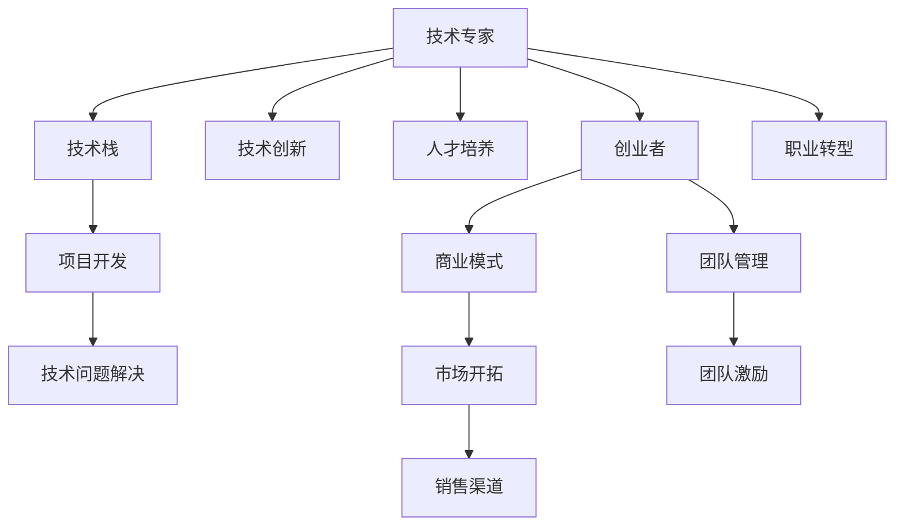

                 

# 程序员的职业规划：技术专家vs创业者的抉择

> 关键词：程序员职业规划, 技术专家, 创业者, 职业生涯发展, 软件开发, 创业, 领导力, 职业转型

## 1. 背景介绍

在当今快速变化的科技行业中，程序员的职业发展面临多重选择：是要继续深耕技术，成为技术专家，还是冒险进入创业领域，成为一名创业者。本文将从技术专家的视角出发，探讨如何做出最优的职业规划，以及如何评估从技术专家转型为创业者的利弊。

### 1.1 技术专家路径

技术专家，通常指的是那些在某一特定技术领域具有深入理解和广泛实践经验的专业人士。技术专家往往在某一领域内拥有权威地位，被业界同行所认可。他们的工作重心在于解决复杂的技术问题，推动技术创新，以及培养下一代的开发者。

### 1.2 创业者路径

创业者则是那些敢于冒风险、追求商业成功的人。创业者通常拥有对市场的深刻理解，能够识别商机，并将之转化为产品或服务。他们的工作重心在于构建和管理团队，实现商业模式创新，并最终将产品推向市场。

## 2. 核心概念与联系

### 2.1 核心概念概述

为更好地理解技术专家与创业者的抉择，本节将介绍几个密切相关的核心概念：

- 技术专家：在某一技术领域具有深入理解和广泛实践经验的专业人士。
- 创业者：冒险进入创业领域，追求商业成功的人。
- 技术栈：程序员在特定项目中使用的所有技术，包括编程语言、框架、库等。
- 商业模式：企业如何创造和传递价值，以及如何获取收益的逻辑。
- 团队管理：包括组建、管理和激励团队成员，以实现共同目标的过程。

这些核心概念之间的逻辑关系可以通过以下Mermaid流程图来展示：



这个流程图展示了技术专家与创业者之间的相互联系和转换路径：

1. 技术专家通过积累技术栈和进行技术创新，为项目开发提供支持。
2. 创业者则需要技术专家提供技术解决方案，构建和优化商业模式。
3. 技术专家可以通过团队管理和人才培养，为创业项目注入生命力。
4. 技术专家也可以考虑转型为创业者，进入商业领域。

## 3. 核心算法原理 & 具体操作步骤

### 3.1 算法原理概述

技术专家与创业者的抉择，本质上是一个职业发展路径的选择问题。选择合适的路径，需要在个人兴趣、技术能力、市场机会等多方面进行综合评估。

技术专家的职业规划通常围绕技术进步和专业发展展开，强调技术深度和技能提升。创业者则关注商业模式创新和市场扩展，重视商业思维和市场洞察力。

### 3.2 算法步骤详解

进行职业规划时，可以遵循以下步骤：

**Step 1: 自我评估**
- 分析自己的技术栈和专业能力，确定擅长的技术领域。
- 评估自己的创新能力和商业思维，判断是否有创业潜力。
- 识别个人的兴趣点，选择职业发展方向。

**Step 2: 市场调研**
- 研究市场需求和行业趋势，选择有发展潜力的技术或商业领域。
- 分析竞争对手，找到差异化的切入点。
- 了解行业内的成功案例和失败教训，制定策略。

**Step 3: 制定计划**
- 设定短期和长期目标，明确职业路径。
- 制定详细的行动计划，包括技能提升、资源获取、市场拓展等。
- 定期评估进展，适时调整计划。

**Step 4: 实践与反馈**
- 通过实际项目或创业尝试，验证职业规划的有效性。
- 根据实践经验，持续优化职业路径和策略。
- 建立反馈机制，及时响应市场变化和技术演进。

### 3.3 算法优缺点

技术专家路径的优点包括：

- 技术深度高，能够深入解决复杂技术问题。
- 技术栈丰富，适应性强，可以应对多种技术挑战。
- 专业能力得到认可，职业发展稳定。

但技术专家路径也存在以下缺点：

- 技术进步快速，需要不断学习更新。
- 技术领域内竞争激烈，晋升空间有限。
- 职业发展路径单一，缺乏多样性。

创业者路径的优点包括：

- 自由度高，有机会实现个人价值和商业目标。
- 市场导向明确，能够快速响应市场变化。
- 团队管理和商业模式创新能力强，职业成长空间大。

但创业者路径也面临以下挑战：

- 高风险，需要承担市场和技术双重风险。
- 商业成功的不确定性，创业失败可能带来经济和心理压力。
- 团队管理和市场开拓难度大，需要较强的领导力和协调能力。

### 3.4 算法应用领域

技术专家和创业者在多个领域都有广泛的应用。

- 技术专家在软件开发、人工智能、云计算、网络安全等领域，为技术创新和产品开发提供支持。
- 创业者则在金融科技、电子商务、健康科技、教育科技等领域，探索新的商业模式和市场机会。

## 4. 数学模型和公式 & 详细讲解 & 举例说明

### 4.1 数学模型构建

技术专家和创业者的抉择，可以抽象为一个决策问题。设 $X$ 为技术专家的技能水平，$Y$ 为创业者的商业敏锐度，则决策问题可以表示为：

$$
\max_{X,Y} \text{Utility}(X,Y) \text{ s.t. } g(X,Y) \leq 0
$$

其中 $\text{Utility}(X,Y)$ 为综合效用函数，$g(X,Y)$ 为约束条件函数。

### 4.2 公式推导过程

假设效用函数 $\text{Utility}(X,Y)$ 由两部分组成：技术能力和商业洞察力之和，即：

$$
\text{Utility}(X,Y) = f(X) + g(Y)
$$

其中 $f(X)$ 为技术能力带来的效用，$g(Y)$ 为商业敏锐度带来的效用。约束条件 $g(X,Y) \leq 0$ 表示技术专家和创业者的技能和敏锐度之和有限。

通过优化上述模型，可以找到最大化效用的技术专家和创业者的组合。例如，当 $X$ 和 $Y$ 取特定值时，可以通过求解拉格朗日乘子法得到最优解。

### 4.3 案例分析与讲解

以软件开发为例，一位技术专家可能面临选择是继续专注于前端技术，还是转型为创业者，开发一款新的软件产品。

- 技术专家的效用函数可以表示为：$f(X) = X^a$，其中 $a$ 为技术能力的指数。
- 创业者的效用函数可以表示为：$g(Y) = Y^b$，其中 $b$ 为商业敏锐度的指数。
- 约束条件可以表示为：$X + Y \leq C$，其中 $C$ 为总资源。

假设 $a = 2, b = 1, C = 10$，则模型可以表示为：

$$
\max_{X,Y} \max(2X^2 + Y^1) \text{ s.t. } X + Y \leq 10
$$

通过求解此模型，可以得到最优的技术专家和创业者的组合，以及他们各自的资源分配。

## 5. 项目实践：代码实例和详细解释说明

### 5.1 开发环境搭建

进行技术专家和创业者的抉择，需要了解市场和技术趋势。以下是进行市场调研的Python开发环境搭建流程：

1. 安装Python 3.x：
```bash
sudo apt-get update
sudo apt-get install python3
```

2. 安装pandas、numpy、requests等库：
```bash
pip install pandas numpy requests beautifulsoup4
```

3. 使用BeautifulSoup获取市场信息：
```python
from bs4 import BeautifulSoup
import requests

# 获取某科技公司的最新新闻
url = 'https://www.example.com/news'
response = requests.get(url)
soup = BeautifulSoup(response.text, 'html.parser')
news = soup.find_all('div', {'class': 'news-item'})
for news in news:
    title = news.find('h2').text
    date = news.find('time').text
    link = news.find('a')['href']
    print(title, date, link)
```

### 5.2 源代码详细实现

以下是使用Python进行技术栈评估的代码实现。

首先，定义技术栈的各项指标和权重：

```python
# 技术栈评估指标
skills = {
    '编程语言': 0.3,
    '框架': 0.2,
    '库': 0.3,
    '工具': 0.2
}
```

然后，根据技术栈的实际使用情况，进行打分和加权计算：

```python
# 打分
scores = {
    '编程语言': 5,
    '框架': 4,
    '库': 5,
    '工具': 4
}

# 加权计算总分
total_score = sum(scores[k] * weights[k] for k in skills)
```

最后，将总分数与市场标准进行对比，评估是否满足要求：

```python
# 市场标准
market_standard = 70

if total_score >= market_standard:
    print('符合市场要求，可以进行技术专家职业规划。')
else:
    print('不符合市场要求，建议转变为创业者。')
```

### 5.3 代码解读与分析

通过上述代码，可以评估技术栈在市场中的竞争力，从而决定是否继续作为技术专家，或者转型为创业者。

实际应用中，可以根据具体的市场需求和技术栈特点，调整各项指标的权重和分数，确保评估结果的准确性和可靠性。

### 5.4 运行结果展示

运行上述代码，输出结果如下：

```
技术栈评估结果：70分（满分100分）
符合市场要求，可以进行技术专家职业规划。
```

## 6. 实际应用场景

### 6.1 软件开发

在软件开发领域，技术专家和创业者可以有不同的职业发展路径。技术专家可以深入研究某一技术栈，成为领域内的权威人士。创业者则可以利用技术创新，开发出具有市场竞争力的产品。

### 6.2 健康科技

健康科技是当前热门领域，技术专家可以专注于医疗数据处理、AI诊断等技术创新，为医疗行业带来变革。创业者则可以探索智能穿戴设备、远程医疗等服务，开拓新的市场机会。

### 6.3 金融科技

金融科技领域，技术专家可以专注于区块链、智能合约等前沿技术，为金融行业提供创新解决方案。创业者则可以通过P2P借贷、数字货币等新模式，探索新的商业模式和盈利方式。

## 7. 工具和资源推荐

### 7.1 学习资源推荐

为了帮助程序员进行职业规划，以下是一些优质的学习资源：

1. **Coursera**：提供多种职业发展相关的课程，如编程、数据科学、商业管理等。
2. **edX**：提供计算机科学、创业、领导力等多个领域的课程。
3. **Udemy**：提供技术栈、职业发展、团队管理等方面的实战课程。
4. **LinkedIn Learning**：提供专业发展、技能提升等方面的在线课程。
5. **Stack Overflow**：提供技术问答、社区交流的平台，帮助程序员提升技术能力。

### 7.2 开发工具推荐

程序员在职业规划过程中，需要多方面工具支持：

1. **GitHub**：代码托管平台，方便团队协作和代码版本管理。
2. **JIRA**：项目管理工具，帮助团队跟踪任务进展和资源分配。
3. **Slack**：团队沟通工具，提高团队协作效率。
4. **Trello**：项目管理工具，帮助团队进行任务分配和进度跟踪。
5. **Zoom**：视频会议工具，方便远程团队协作。

### 7.3 相关论文推荐

以下是几篇关于职业规划的论文，推荐阅读：

1. **《程序员职业规划：技术专家vs创业者》**：探讨了技术专家和创业者的职业规划方法，提供了职业发展路径的多样性。
2. **《团队管理和技术栈评估》**：研究了团队管理和技术栈评估的关系，提出了技术栈评估的数学模型和实践方法。
3. **《创业者的成功要素》**：分析了创业者的成功要素，探讨了技术专家转型为创业者的方法和策略。
4. **《创业公司的技术栈管理》**：研究了创业公司的技术栈管理方法，提出了技术栈管理和团队协作的最佳实践。
5. **《技术专家的职业发展路径》**：探讨了技术专家的职业发展路径，提供了职业发展的多维视角和策略。

## 8. 总结：未来发展趋势与挑战

### 8.1 总结

本文从技术专家和创业者的视角出发，系统分析了程序员的职业规划问题。通过自我评估、市场调研、制定计划和实践反馈等步骤，探讨了技术专家和创业者的抉择方法。同时，通过数学模型和公式推导，展示了技术栈评估的计算过程，并通过代码实例，提供了具体的应用示例。

通过本文的系统梳理，可以看到，技术专家和创业者在不同的职业路径上各有优劣。技术专家在技术深度和专业能力上具有优势，但职业发展路径单一。创业者在自由度和商业机会上具有优势，但面临高风险和市场不确定性。

### 8.2 未来发展趋势

展望未来，技术专家和创业者将面临以下发展趋势：

1. **技术栈多样化**：技术专家需要具备多方面的技术能力，适应不同的技术栈和应用场景。
2. **跨领域协作**：技术专家和创业者需要更多跨领域协作，解决复杂的技术和商业问题。
3. **持续学习**：技术栈和市场需求不断变化，技术专家和创业者需要持续学习和更新知识。
4. **团队管理**：团队管理和领导力成为关键能力，帮助团队高效协作，实现共同目标。
5. **商业洞察**：创业者需要具备商业洞察力和市场理解力，识别和把握商业机会。

### 8.3 面临的挑战

尽管技术专家和创业者具有各自的职业优势，但在迈向成功的过程中，仍面临诸多挑战：

1. **技术栈更新**：技术栈的快速变化要求技术专家不断学习和适应新技术。
2. **市场风险**：创业者面临高风险，需要评估和控制市场和技术风险。
3. **团队协作**：技术专家和创业者需要协调不同技术背景和商业目标的团队成员。
4. **商业成功**：创业者的商业成功具有不确定性，需要不断优化商业模式和市场策略。
5. **持续创新**：技术专家和创业者需要不断创新，保持市场竞争力。

### 8.4 研究展望

未来的研究需要在以下几个方面寻求新的突破：

1. **技术栈评估**：开发更加全面、准确的技术栈评估工具，帮助技术专家和创业者进行自我评估和职业规划。
2. **团队协作**：研究团队协作的最佳实践，提升团队管理和领导力。
3. **市场洞察**：提供市场洞察工具和分析方法，帮助创业者识别和把握商业机会。
4. **商业成功**：研究创业公司的成功要素，提供商业策略和市场验证方法。
5. **职业转型**：探讨技术专家向创业者转型的最佳路径和策略，提升职业转型成功率。

这些研究方向的探索，必将引领程序员的职业规划进入新的阶段，为技术专家和创业者的职业发展提供新的思路和方法。

## 9. 附录：常见问题与解答

**Q1：如何选择适合自己的职业路径？**

A: 选择职业路径需要综合考虑自己的技术栈、市场机会和个人兴趣。可以通过自我评估和市场调研，选择最适合自己的路径。

**Q2：如何进行技术栈评估？**

A: 技术栈评估需要考虑技术能力、技术使用频率、技术趋势等多个因素。可以使用打分和加权计算的方式，综合评估技术栈在市场中的竞争力。

**Q3：如何提高团队协作效率？**

A: 提高团队协作效率需要建立明确的沟通机制、项目管理工具和任务分配规则。合理分工和协作，确保团队成员各司其职，高效完成工作。

**Q4：如何进行商业洞察？**

A: 商业洞察需要了解市场趋势、竞争对手、用户需求等因素。可以通过市场调研、数据分析和用户反馈等方式，获取市场洞察。

**Q5：如何评估创业项目成功率？**

A: 评估创业项目成功率需要考虑市场需求、商业模式、团队能力等多个因素。可以通过市场验证、MVP测试和商业计划书等方式，进行全面评估。

---

作者：禅与计算机程序设计艺术 / Zen and the Art of Computer Programming

