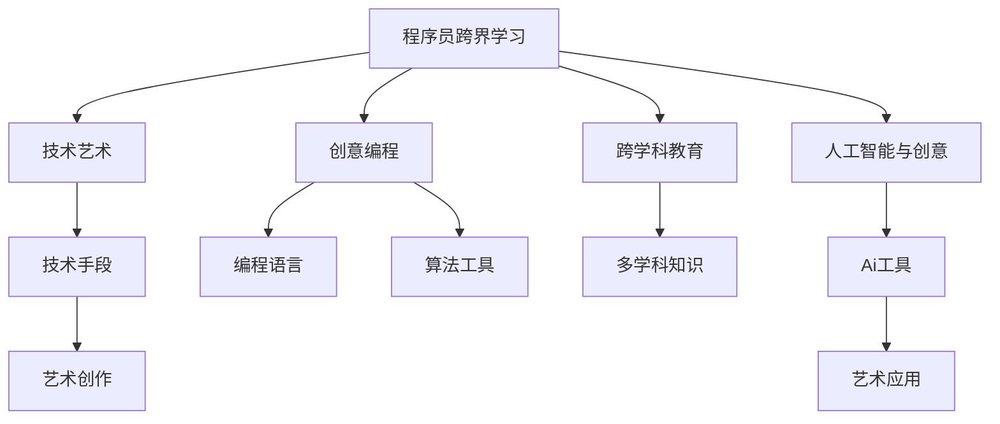

                 

# 程序员的跨界学习：融合艺术与科技的财富机会

> 关键词：程序员跨界学习,艺术与科技融合,技术艺术,创意编程,跨学科教育

## 1. 背景介绍

### 1.1 问题由来

在科技迅猛发展的今天，程序员已不再是单一的代码编写者，而是更加复合型的人才。他们需要掌握多种技能，能够在不同领域之间自如切换。与此同时，艺术与科技的融合也在不断加深，艺术领域逐渐引入技术手段，而科技领域也越来越多地呈现出艺术化趋势。这一背景下，程序员的跨界学习已成为一种新的趋势。

### 1.2 问题核心关键点

程序员跨界学习的核心关键点在于：

- **技术基础**：掌握扎实的编程和算法知识，这是跨界学习的基础。
- **艺术素养**：培养对美的理解、对形式和风格的敏感度，以及对创意思维的培养。
- **交叉应用**：能够在不同领域之间灵活应用所学技术，解决问题。
- **持续创新**：不断学习和创新，提升自我竞争力。

## 2. 核心概念与联系

### 2.1 核心概念概述

为更好地理解程序员跨界学习，本节将介绍几个密切相关的核心概念：

- **程序员跨界学习**：程序员通过学习艺术领域的知识和技能，来提升自身在技术和创意方面的综合能力。

- **技术艺术**：技术手段与艺术创作的结合，旨在通过技术实现艺术表达，或通过艺术提升技术产品的艺术价值。

- **创意编程**：利用编程语言和技术工具实现创意和艺术表达，推动技术在艺术创作中的创新应用。

- **跨学科教育**：在教育过程中跨越不同学科的界限，综合运用多种学科知识和方法。

- **人工智能与创意**：AI技术在艺术创作、交互设计、内容生成等方面的应用，拓展了艺术创作的可能性。

这些核心概念之间的逻辑关系可以通过以下Mermaid流程图来展示：



这个流程图展示程序员跨界学习中的几个核心概念及其之间的关系：

1. 程序员通过学习技术艺术、创意编程、跨学科教育及人工智能等概念，提升自身技能。
2. 技术艺术主要强调技术手段在艺术创作中的应用。
3. 创意编程利用编程语言和算法工具，实现创意和艺术表达。
4. 跨学科教育强调跨越不同学科界限，综合运用多种学科知识。
5. 人工智能与创意结合，推动技术在艺术创作中的创新应用。

## 3. 核心算法原理 & 具体操作步骤

### 3.1 算法原理概述

程序员跨界学习主要基于以下原理：

- **技术艺术原理**：将编程技术应用于艺术创作，利用算法生成艺术作品，或通过技术改进艺术创作流程。
- **创意编程原理**：将创意和想象融入编程过程，通过代码实现艺术效果，探索新的创作方式。
- **跨学科教育原理**：在教育和培训过程中，结合不同学科的知识和方法，培养复合型人才。
- **人工智能与创意融合**：通过AI技术，实现自动生成艺术作品、智能交互设计等应用，拓展创作空间。

### 3.2 算法步骤详解

程序员跨界学习的一般步骤如下：

**Step 1: 确定学习目标**

1. 明确自己的学习目标，确定需要掌握哪些艺术和技术知识。
2. 列出所需学习的技能和工具，如编程语言、设计软件、艺术理论等。

**Step 2: 学习基础知识**

1. 学习基本的艺术理论，如色彩、构图、光影等。
2. 掌握编程基础，如Python、JavaScript等。
3. 了解常用的创意编程工具和框架，如Processing、Unity等。

**Step 3: 实践与创作**

1. 通过实践，将所学知识应用到艺术创作中。
2. 尝试不同的创作形式和风格，如生成艺术、交互设计等。
3. 参与艺术项目和创作比赛，提升实战经验。

**Step 4: 跨学科应用**

1. 将所学技能应用于其他领域，如教育、医学、商业等。
2. 结合不同领域的知识，创造新的应用场景。

**Step 5: 持续创新**

1. 关注最新的技术发展，不断学习新知识和工具。
2. 探索新的创作方式和技术应用，保持创新动力。

### 3.3 算法优缺点

程序员跨界学习的优点在于：

1. **提升综合能力**：通过学习艺术知识，程序员能够提升自身在创意和表达方面的能力，成为更加全面的技术人才。
2. **开拓应用场景**：跨界学习使得程序员能够掌握更多跨学科技能，开拓新的应用场景，提高市场竞争力。
3. **增强创新能力**：艺术与技术的融合，能够激发创意思维，帮助程序员提出新的解决方案，推动技术创新。

同时，跨界学习也存在一些局限：

1. **时间成本高**：学习新技术和艺术知识需要大量时间，可能会影响日常工作。
2. **资源需求大**：需要高额的资金和设备投入，如高性能计算机、专业软件等。
3. **技能难度大**：艺术和技术都需要较高的专业水平，初学者可能需要较长时间才能达到一定水准。
4. **理论与实践脱节**：理论知识丰富，但实际操作中可能会出现理论与实践的脱节。

尽管存在这些局限性，但跨界学习仍为程序员带来了巨大的职业发展机会，成为技术领域中的一个重要趋势。

### 3.4 算法应用领域

程序员跨界学习的应用领域广泛，涵盖多个领域，例如：

- **创意编程与交互设计**：利用编程语言和技术工具，实现创意和艺术表达，提升用户体验。
- **数据可视化**：通过编程技术，将数据转换为直观、美观的图形，帮助分析和展示数据。
- **艺术生成**：利用AI算法，自动生成艺术作品，推动艺术创作的创新。
- **教育与培训**：在教育过程中融合艺术与技术，培养学生的创新思维和实践能力。
- **数字媒体与游戏设计**：利用编程技术和创意工具，设计和开发数字媒体产品，提升游戏和互动体验。

## 4. 数学模型和公式 & 详细讲解 & 举例说明

### 4.1 数学模型构建

本节将使用数学语言对程序员跨界学习的过程进行更加严格的刻画。

设程序员初始掌握的技术能力为 $T_0$，艺术素养为 $A_0$，跨界学习后的技术能力为 $T$，艺术素养为 $A$。跨界学习的效果可以通过以下模型描述：

$$
T = f_1(T_0, A_0)
$$

$$
A = f_2(T_0, A_0)
$$

其中 $f_1$ 和 $f_2$ 分别表示技术能力和艺术素养的变化函数。

### 4.2 公式推导过程

在实践中，跨界学习的效果可以通过以下步骤推导：

1. **技术能力提升**：通过学习编程技术和算法，技术能力 $T$ 得到提升。
2. **艺术素养提升**：通过学习艺术理论，艺术素养 $A$ 得到提升。
3. **跨界应用**：将技术能力和艺术素养相结合，进行创意编程和艺术创作。

以创意编程为例，设创意编程的效果为 $C$，则有：

$$
C = g(T, A)
$$

其中 $g$ 表示创意编程的效果函数。

### 4.3 案例分析与讲解

以下以数据可视化为例，介绍程序员跨界学习在实际应用中的具体实现：

1. 学习基本的数据可视化知识，如数据类型、可视化图表等。
2. 掌握编程语言和工具，如D3.js、Tableau等。
3. 通过实践，将所学知识应用于数据集，生成可视化图表。
4. 不断迭代和优化，提升可视化效果，探索新的创意。

## 5. 项目实践：代码实例和详细解释说明

### 5.1 开发环境搭建

在进行跨界学习项目实践前，我们需要准备好开发环境。以下是使用Python进行项目开发的Python虚拟环境配置流程：

1. 安装Anaconda：从官网下载并安装Anaconda，用于创建独立的Python环境。

2. 创建并激活虚拟环境：
```bash
conda create -n myenv python=3.8 
conda activate myenv
```

3. 安装相关工具包：
```bash
pip install numpy pandas matplotlib scikit-learn
```

完成上述步骤后，即可在`myenv`环境中开始跨界学习实践。

### 5.2 源代码详细实现

这里我们以数据可视化项目为例，给出使用Python的代码实现。

```python
import pandas as pd
import matplotlib.pyplot as plt

# 加载数据集
data = pd.read_csv('data.csv')

# 数据清洗和预处理
data = data.dropna()
data = data[(data['age'] > 18) & (data['income'] > 0)]

# 数据可视化
plt.scatter(data['age'], data['income'])
plt.xlabel('Age')
plt.ylabel('Income')
plt.title('Income vs. Age')
plt.show()
```

这是一个简单的数据可视化项目，展示如何通过编程技术实现数据的可视化。可以看到，通过Python和Matplotlib等工具，程序员能够快速实现数据图表的生成。

### 5.3 代码解读与分析

让我们再详细解读一下关键代码的实现细节：

**数据加载和预处理**：
- 使用Pandas加载CSV文件，进行数据清洗和预处理，去除缺失值和异常数据。

**可视化实现**：
- 使用Matplotlib库，绘制散点图，显示年龄和收入之间的关系。

**图表展示**：
- 通过plt.show()命令，将图表展示给用户。

可以看到，通过跨界学习，程序员能够掌握数据可视化的技能，将技术应用于艺术创作中。这不仅提升了自己的技术能力，还开拓了新的应用场景。

## 6. 实际应用场景

### 6.1 创意编程与交互设计

创意编程在交互设计中的应用，使得交互界面更加生动有趣，提升用户体验。例如，可以利用Processing库，通过代码实现动态图像和互动装置，为用户提供更加直观的交互体验。

### 6.2 数据可视化

数据可视化在商业分析、科学研究、公共政策等多个领域有着广泛应用。程序员通过学习数据可视化技术，能够帮助组织和机构更好地理解数据，做出科学决策。

### 6.3 艺术生成

利用AI算法，程序员可以实现艺术作品的自动生成，推动艺术创作的创新。例如，通过GAN模型，自动生成抽象艺术作品，或在绘画中生成人脸图像，提升艺术创作的多样性。

### 6.4 未来应用展望

随着技术的不断发展，程序员跨界学习的应用场景将更加广阔，带来更多创新的机会。未来，跨界学习将推动艺术与技术更深入的融合，产生更多跨学科的创新应用，推动社会发展。

## 7. 工具和资源推荐

### 7.1 学习资源推荐

为了帮助程序员系统掌握跨界学习的理论基础和实践技巧，这里推荐一些优质的学习资源：

1. 《Art in Code》：介绍编程技术在艺术创作中的应用，提供了大量创意编程实例和项目案例。

2. Code.org《编程的艺术》课程：融合编程和艺术，通过趣味项目引导学生学习编程，培养创意思维。

3. Creative Coding：提供大量创意编程教程和资源，涵盖Processing、p5.js等多种工具。

4. Coursera《Design Thinking for Innovation》课程：结合设计思维和编程技术，提升创新能力。

5. The Programmer's Art：探讨编程和艺术的关系，介绍编程在艺术创作中的多种应用。

通过对这些资源的学习实践，相信你一定能够快速掌握程序员跨界学习的精髓，并用于解决实际的艺术和技术问题。

### 7.2 开发工具推荐

高效的开发离不开优秀的工具支持。以下是几款用于跨界学习开发的常用工具：

1. Python：作为编程和数据分析的通用语言，Python是程序员跨界学习的首选。

2. Visual Studio Code：轻量级的编辑器，支持多种语言和插件，便于跨界学习过程中的代码编辑和调试。

3. Adobe Creative Cloud：包含Photoshop、Illustrator等创意工具，提供强大的设计功能。

4. Blender：开源的三维建模和动画软件，支持编程驱动的创意设计。

5. Unity：流行的游戏开发引擎，支持跨平台开发，适用于创意编程和互动设计。

合理利用这些工具，可以显著提升程序员跨界学习的效率，加速创新迭代的步伐。

### 7.3 相关论文推荐

跨界学习的相关研究文献众多，以下是几篇具有代表性的论文，推荐阅读：

1. “Designing for the Next Generation of Art and Design Education”：探讨跨学科教育在艺术设计教育中的应用，提出新的教育模式。

2. “Artistic Visualization: Visualization for Artists, Designers and Scientists”：介绍艺术可视化在艺术创作和科学研究中的应用，提供大量案例和工具。

3. “Art and Programming”：讨论编程技术在艺术创作中的应用，分析技术和艺术的关系。

4. “Creative Coding and the Future of Art”：探讨创意编程在艺术创作中的趋势和前景，提出新的创作形式和应用场景。

5. “The Art of Designing AI”：探讨AI在艺术设计中的应用，提出新的设计方法和工具。

这些论文代表了大跨界学习的发展脉络，通过学习这些前沿成果，可以帮助程序员更好地把握学科前进方向，激发更多的创新灵感。

## 8. 总结：未来发展趋势与挑战

### 8.1 总结

本文对程序员跨界学习进行了全面系统的介绍。首先阐述了跨界学习的重要性和核心关键点，明确了技术艺术、创意编程、跨学科教育等概念之间的关系。其次，从原理到实践，详细讲解了跨界学习的数学模型和操作步骤，给出了具体的代码实例。同时，本文还广泛探讨了跨界学习在创意编程、数据可视化、艺术生成等多个行业领域的应用前景，展示了跨界学习的巨大潜力。最后，本文精选了跨界学习的各类学习资源，力求为读者提供全方位的技术指引。

通过本文的系统梳理，可以看到，程序员跨界学习不仅能够提升自身技能，还能拓展应用领域，带来更多创新机会。未来，随着技术的不断进步和跨界学习的持续发展，跨界学习将进一步推动艺术与技术的融合，为社会发展注入新的动力。

### 8.2 未来发展趋势

展望未来，程序员跨界学习将呈现以下几个发展趋势：

1. **技术艺术化**：技术手段在艺术创作中的应用将更加广泛，推动艺术创作方式的创新。
2. **创意编程普及**：创意编程工具和平台的普及，使得更多程序员能够快速掌握创意编程技术。
3. **跨学科教育融合**：跨学科教育将成为一种新的教育模式，培养更多综合型人才。
4. **人工智能与创意结合**：AI技术在艺术创作中的应用将更加深入，推动创意和技术的融合。

这些趋势凸显了程序员跨界学习的广阔前景，未来将有更多跨界学习项目和应用，推动艺术与技术的深度融合。

### 8.3 面临的挑战

尽管程序员跨界学习带来了诸多好处，但在迈向更加智能化、普适化应用的过程中，它仍面临诸多挑战：

1. **时间成本高**：学习新技术和艺术知识需要大量时间，可能会影响日常工作。
2. **资源需求大**：需要高额的资金和设备投入，如高性能计算机、专业软件等。
3. **技能难度大**：艺术和技术都需要较高的专业水平，初学者可能需要较长时间才能达到一定水准。
4. **理论与实践脱节**：理论知识丰富，但实际操作中可能会出现理论与实践的脱节。

尽管存在这些挑战，但跨界学习仍为程序员带来了巨大的职业发展机会，成为技术领域中的一个重要趋势。相信随着学界和产业界的共同努力，这些挑战终将一一被克服，程序员跨界学习必将在构建人机协同的智能时代中扮演越来越重要的角色。

### 8.4 研究展望

面对程序员跨界学习所面临的种种挑战，未来的研究需要在以下几个方面寻求新的突破：

1. **跨学科融合教育**：开发跨学科融合的教育课程和项目，培养复合型人才。
2. **创意编程工具优化**：开发更多易学易用的创意编程工具，降低学习门槛。
3. **AI与创意结合**：研究AI技术在艺术创作中的应用，提升创意编程的创作能力。
4. **技术艺术应用**：探索技术手段在艺术创作中的新应用场景，推动艺术创作的创新。
5. **持续学习和创新**：建立持续学习机制，帮助程序员不断提升技能，跟上技术发展的步伐。

这些研究方向的探索，必将引领程序员跨界学习技术迈向更高的台阶，为构建安全、可靠、可解释、可控的智能系统铺平道路。面向未来，跨界学习需要开发者根据具体任务，不断迭代和优化技术、艺术和算法，方能得到理想的效果。

## 9. 附录：常见问题与解答

**Q1：如何平衡跨界学习与日常工作？**

A: 在跨界学习过程中，可以采用分阶段学习和模块化学习的方式，将学习任务分解为小块，逐步掌握。同时，利用业余时间进行学习和实践，逐步提升技能。

**Q2：跨界学习有哪些资源可以推荐？**

A: 以下是几本跨界学习的经典书籍和在线课程：
1. 《Art in Code》：介绍编程技术在艺术创作中的应用，提供了大量创意编程实例和项目案例。
2. Code.org《编程的艺术》课程：融合编程和艺术，通过趣味项目引导学生学习编程，培养创意思维。
3. Creative Coding：提供大量创意编程教程和资源，涵盖Processing、p5.js等多种工具。

**Q3：跨界学习是否需要购买昂贵的设备？**

A: 大多数跨界学习项目可以使用免费的开源软件进行开发，如Python、Processing等。一些高质量的软件和硬件可能需要投入一定的资金，但总体来说，跨界学习的成本相对较低。

**Q4：跨界学习对职业生涯有什么影响？**

A: 跨界学习能够提升程序员的综合素质，增强其创新能力，提升竞争力。在职场中，具备跨界技能的程序员更容易获得晋升机会，进入更高层次的项目团队。

**Q5：跨界学习是否需要具备一定的艺术基础？**

A: 跨界学习可以不需要具备扎实的艺术基础，但需要对美学的基本理解，以及对创意思维的培养。通过学习，逐步提升艺术素养和技术能力，实现综合提升。

通过本文的系统梳理，可以看到，程序员跨界学习不仅能够提升自身技能，还能拓展应用领域，带来更多创新机会。未来，随着技术的不断进步和跨界学习的持续发展，跨界学习将进一步推动艺术与技术的融合，为社会发展注入新的动力。

---

作者：禅与计算机程序设计艺术 / Zen and the Art of Computer Programming

