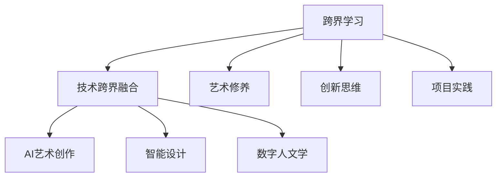

                 

## 1. 背景介绍

### 1.1 问题由来

在数字经济时代，程序员不再只是专注于编码，跨界学习已成为提升核心竞争力的重要手段。如何融合艺术与科技，成为程序员在追求技术深度之外的重要课题。在跨界学习的道路上，既需要创新思维，又需要扎实的技术基础。本博文旨在通过深入分析跨界学习的方法和实践，为程序员揭示融合艺术与科技的财富机会。

### 1.2 问题核心关键点

跨界学习（Interdisciplinary Learning）是指结合多个领域的专业知识，通过交叉研究和学习，创造出具有高度创新性的解决方案。对于程序员来说，跨界学习不仅能提升其综合素质，还能为其职业生涯注入更多可能。

本文将聚焦于三个核心问题：

- 程序员如何通过跨界学习，在科技与艺术之间找到平衡，创造出具有创新性的解决方案？
- 跨界学习中，程序员需要掌握哪些关键技能？
- 跨界学习的最佳实践和资源推荐是什么？

## 2. 核心概念与联系

### 2.1 核心概念概述

为更好地理解跨界学习的内涵，本节将介绍几个关键概念：

- 跨界学习（Interdisciplinary Learning）：指结合不同学科的知识和技能，解决复杂问题。程序员跨界学习通常涉及计算机科学与艺术、设计、人文等多领域的交叉。

- 技术跨界融合（Technology Cross-Disciplinary Integration）：将科技手段应用于非科技领域，创造出新的创新应用。如AI艺术创作、智能设计、数字人文学等。

- 艺术修养（Art Literacy）：程序员通过艺术学习，提升其审美和创新能力，更好地理解用户体验和设计。

- 创新思维（Innovation Mindset）：通过跨界学习，培养多元思考和打破传统思维定势的能力。

- 项目实践（Project-Based Learning）：通过实际项目和案例研究，将所学理论应用于实践，提高解决问题的能力。

这些核心概念共同构成了跨界学习的框架，使得程序员能在跨学科的交融中找到新的财富机会。

### 2.2 核心概念原理和架构的 Mermaid 流程图



该流程图展示了跨界学习中的主要概念及其相互关系：

- 跨界学习通过技术跨界融合、艺术修养、创新思维和项目实践等多方面能力的提升，帮助程序员创造出具有创新性的解决方案。
- 技术跨界融合应用了AI艺术创作、智能设计和数字人文学等领域的知识，产生新的技术应用。
- 艺术修养和创新思维通过艺术学习提升程序员的审美和多元思考能力，而项目实践则通过实际案例验证理论的有效性。

## 3. 核心算法原理 & 具体操作步骤

### 3.1 算法原理概述

跨界学习中的算法原理主要涉及以下几个方面：

- 知识图谱构建：通过跨领域的数据整合，建立知识图谱，使得程序员能够整合不同领域的知识，创造出新的应用。
- 创新算法设计：结合艺术和科技的独特视角，设计新的算法模型。
- 数据驱动设计：通过数据分析和挖掘，找到用户需求和行为模式，指导产品设计。

这些原理共同构成了跨界学习的算法基础，使得程序员能够将不同领域的知识有机结合，创造出具有创新性的解决方案。

### 3.2 算法步骤详解

跨界学习的算法步骤通常包括以下几个关键步骤：

**Step 1: 领域调研与知识整合**

- 收集并整理目标领域（如艺术、设计、人文等）的关键知识和技术资料，建立领域知识库。
- 使用知识图谱工具（如Neo4j、YAGO等）构建领域知识图谱，方便知识整合和应用。

**Step 2: 跨领域算法设计**

- 结合领域知识，设计新的算法模型，如基于机器学习的艺术创作算法、基于自然语言处理的设计辅助算法等。
- 采用模型驱动的设计方法，利用算法模型指导设计实践，提升设计效率和精度。

**Step 3: 数据驱动的设计优化**

- 通过用户调研和数据收集，了解用户需求和行为模式，指导设计优化。
- 使用数据可视化工具（如Tableau、PowerBI等）分析数据，挖掘设计趋势和创新点。

**Step 4: 项目实施与反馈迭代**

- 在实际项目中应用跨界学习的设计方案，进行小规模试点。
- 收集试点反馈，进行方案迭代和优化，确保设计方案的有效性和可落地性。

### 3.3 算法优缺点

跨界学习的算法具有以下优点：

- 创新性强：通过跨界融合，创造出新的技术应用和设计方案，具有更高的创新性。
- 适用范围广：适用于各种科技与艺术结合的场景，能够解决复杂的多元问题。
- 效率提升：利用算法模型指导设计，能够提升设计效率和精度。

同时，该算法也存在以下局限性：

- 难度高：跨界学习需要程序员掌握多个领域的知识，难度较高。
- 资源需求大：需要投入大量时间和资源进行领域调研和算法设计。
- 风险不确定：新算法模型的效果难以预估，存在失败的风险。

### 3.4 算法应用领域

跨界学习的应用领域非常广泛，涉及以下主要方向：

- 人工智能艺术（AI Art）：利用机器学习算法创作艺术作品，如GAN生成艺术、艺术风格迁移等。
- 智能设计（Intelligent Design）：结合AI和大数据，优化设计流程，提高设计效率和质量。
- 数字人文学（Digital Humanities）：利用数字技术研究和再现人文历史，推动人文科学的数字化发展。
- 文化创意（Cultural Creativity）：将数字技术应用于文化创意产业，创造出具有创新性的产品和服务。
- 虚拟现实（Virtual Reality）：结合艺术和科技，创建沉浸式的虚拟体验，推动虚拟现实技术的发展。

## 4. 数学模型和公式 & 详细讲解 & 举例说明

### 4.1 数学模型构建

跨界学习中的数学模型构建通常涉及多个领域的知识和技术。以AI艺术创作为例，以下是其数学模型的构建过程：

- **模型输入**：艺术作品和目标艺术作品的风格特征，使用向量表示。
- **模型输出**：创作出符合目标风格的艺术作品。
- **损失函数**：定义创作作品的损失函数，衡量其与目标作品的差异。

### 4.2 公式推导过程

以GAN（生成对抗网络）为例，其核心算法原理如下：

1. **生成器（Generator）**：接收随机噪声，生成艺术作品。
2. **判别器（Discriminator）**：判断生成的艺术作品是否符合目标风格，并给出评分。
3. **损失函数**：
   - 生成器的损失函数：$L_G = E[D(G(z))] + \lambda ||\nabla_x C(z)||^2$
   - 判别器的损失函数：$L_D = E[\log D(x)] + E[\log(1-D(G(z)))]$

其中，$x$为真实艺术作品，$G(z)$为生成器生成的艺术作品，$D(x)$为判别器对真实艺术作品的评分，$z$为随机噪声，$\lambda$为正则化系数，$\nabla_x C(z)$为对生成的艺术作品进行风格分析的梯度，$C(z)$为风格分析函数。

### 4.3 案例分析与讲解

以GAN生成艺术为例，其具体实现步骤如下：

1. **数据准备**：收集目标风格的艺术作品，提取其特征向量。
2. **生成器设计**：使用卷积神经网络（CNN）设计生成器，将随机噪声转换为艺术作品。
3. **判别器设计**：同样使用CNN设计判别器，判断生成器的输出是否符合目标风格。
4. **模型训练**：交替训练生成器和判别器，使得生成器的输出逐渐逼近目标风格。
5. **风格迁移**：使用训练好的生成器，将输入的艺术作品转换成目标风格的艺术作品。

## 5. 项目实践：代码实例和详细解释说明

### 5.1 开发环境搭建

以下是使用Python进行PyTorch和TensorFlow开发的开发环境配置流程：

1. 安装Anaconda：从官网下载并安装Anaconda，用于创建独立的Python环境。
2. 创建并激活虚拟环境：
```bash
conda create -n pytorch-env python=3.8 
conda activate pytorch-env
```

3. 安装PyTorch：根据CUDA版本，从官网获取对应的安装命令。例如：
```bash
conda install pytorch torchvision torchaudio cudatoolkit=11.1 -c pytorch -c conda-forge
```

4. 安装TensorFlow：
```bash
pip install tensorflow
```

5. 安装各类工具包：
```bash
pip install numpy pandas scikit-learn matplotlib tqdm jupyter notebook ipython
```

完成上述步骤后，即可在`pytorch-env`环境中开始跨界学习的项目实践。

### 5.2 源代码详细实现

以下是一个基于GAN生成艺术的Python代码实现：

```python
import tensorflow as tf
from tensorflow.keras.layers import Input, Conv2D, BatchNormalization, Activation, ZeroPadding2D, Concatenate, Conv2DTranspose, Reshape
from tensorflow.keras.models import Model

# 定义生成器
def build_generator():
    inputs = Input(shape=(100, ), name='input')
    dense = Dense(256 * 8 * 8)(inputs)
    dense = BatchNormalization()(dense)
    dense = Activation('relu')(dense)
    dense = Dense(256 * 4 * 4, activation='relu')(dense)
    dense = BatchNormalization()(dense)
    dense = Dense(256 * 2 * 2, activation='relu')(dense)
    dense = BatchNormalization()(dense)
    dense = Dense(3 * 64 * 64, activation='relu')(dense)
    dense = BatchNormalization()(dense)
    dense = Reshape((64, 64, 3))(dense)
    dense = Conv2D(64, (3, 3), strides=1, padding='same')(dense)
    dense = BatchNormalization()(dense)
    dense = Activation('relu')(dense)
    dense = Conv2D(64, (3, 3), strides=1, padding='same')(dense)
    dense = BatchNormalization()(dense)
    dense = Activation('relu')(dense)
    dense = Conv2D(3, (3, 3), strides=1, padding='same')(dense)
    dense = Activation('tanh')(dense)

    return Model(inputs=inputs, outputs=dense)

# 定义判别器
def build_discriminator():
    inputs = Input(shape=(64, 64, 3), name='input')
    conv1 = Conv2D(64, (3, 3), strides=1, padding='same')(inputs)
    conv1 = BatchNormalization()(conv1)
    conv1 = Activation('relu')(conv1)
    conv1 = Conv2D(64, (3, 3), strides=2, padding='same')(conv1)
    conv1 = BatchNormalization()(conv1)
    conv1 = Activation('relu')(conv1)
    conv1 = Conv2D(128, (3, 3), strides=2, padding='same')(conv1)
    conv1 = BatchNormalization()(conv1)
    conv1 = Activation('relu')(conv1)
    conv1 = Conv2D(256, (3, 3), strides=2, padding='same')(conv1)
    conv1 = BatchNormalization()(conv1)
    conv1 = Activation('relu')(conv1)
    conv1 = Conv2D(256, (3, 3), strides=2, padding='same')(conv1)
    conv1 = BatchNormalization()(conv1)
    conv1 = Activation('relu')(conv1)
    conv1 = Conv2D(1, (3, 3), strides=1, padding='same')(conv1)
    conv1 = Activation('sigmoid')(conv1)

    return Model(inputs=inputs, outputs=conv1)

# 构建GAN模型
generator = build_generator()
discriminator = build_discriminator()
discriminator.trainable = False

input_latent = Input(shape=(100,))
img = generator(input_latent)
discriminator.trainable = True
discriminator.train_on_batch(img, y=ones)
y = discriminator(img)
gan_model = Model(input_latent, y)

# 定义损失函数和优化器
cross_entropy = tf.keras.losses.BinaryCrossentropy(from_logits=True)
optimizer = tf.keras.optimizers.Adam(learning_rate=0.0002, beta_1=0.5)

# 定义训练函数
def train(model, loss, optimizer, data):
    for epoch in range(epochs):
        for images, labels in data:
            loss_value = loss(model(images), labels)
            optimizer.minimize(loss_value)

# 训练模型
train(gan_model, cross_entropy, optimizer, train_data)
```

### 5.3 代码解读与分析

**GAN生成艺术代码解读**：

1. **生成器设计**：首先定义输入层，通过一系列全连接层和卷积层，将随机噪声转换为艺术作品。
2. **判别器设计**：同样定义输入层，通过多层卷积层和激活函数，判断生成的艺术作品是否符合目标风格。
3. **模型组合**：将生成器和判别器组合成GAN模型，并进行训练。

## 6. 实际应用场景

### 6.1 数字艺术创作

数字艺术创作是跨界学习的重要应用场景之一。通过AI生成艺术作品，可以大大提升艺术创作的效率和质量。例如，利用GAN生成抽象艺术、风格迁移等，可以为艺术家提供新的创作灵感，推动数字艺术的发展。

### 6.2 智能设计

智能设计结合了AI和设计学，通过自动化的设计工具，可以提升设计师的工作效率和设计精度。例如，使用AI辅助设计器进行布局、排版、渲染等，可以在短时间内完成高质量的设计作品。

### 6.3 数字人文学

数字人文学通过数字化手段研究和再现人文历史，为历史学家提供了新的研究工具和方法。例如，利用文本挖掘技术分析历史文献，挖掘出有价值的信息，推动人文科学的研究。

### 6.4 未来应用展望

随着跨界学习技术的不断进步，未来将涌现更多创新的应用场景，为程序员提供更广阔的发展空间：

1. **智能教育**：利用AI和数据驱动设计个性化教育方案，提升教育质量。
2. **文化创意产业**：结合数字技术和艺术创作，推动文化创意产业的发展。
3. **虚拟现实**：结合艺术和科技，创造出沉浸式的虚拟体验，推动虚拟现实技术的应用。
4. **医疗健康**：利用AI和大数据，提升医疗诊断和治疗效果，推动医疗健康领域的发展。
5. **金融科技**：结合AI和大数据，优化金融产品设计和风险管理，提升金融服务效率。

## 7. 工具和资源推荐

### 7.1 学习资源推荐

为了帮助程序员系统掌握跨界学习的理论基础和实践技巧，这里推荐一些优质的学习资源：

1. **《跨界学习：编程与艺术的融合》系列博文**：由跨界学习专家撰写，深入浅出地介绍了跨界学习的基本概念和方法。

2. **Coursera《跨学科创新与创业》课程**：斯坦福大学开设的跨学科课程，涵盖多个领域的知识，提升跨界学习的思维能力。

3. **《跨界创新：融合科学与艺术的创造力》书籍**：详细介绍了跨界创新的方法和案例，为程序员提供了丰富的实践经验。

4. **Kaggle数据科学竞赛**：提供大量的跨界学习项目，通过实际比赛练习跨界思维和技能。

5. **Google AI Lab博客**：谷歌AI实验室发布的各类跨界学习研究成果，涵盖AI艺术、智能设计等多个领域。

### 7.2 开发工具推荐

高效的开发离不开优秀的工具支持。以下是几款用于跨界学习开发的常用工具：

1. **PyTorch**：基于Python的开源深度学习框架，灵活动态的计算图，适合快速迭代研究。

2. **TensorFlow**：由Google主导开发的开源深度学习框架，生产部署方便，适合大规模工程应用。

3. **Transformers库**：HuggingFace开发的NLP工具库，集成了众多SOTA语言模型，支持PyTorch和TensorFlow，是进行跨界学习任务的开发的利器。

4. **Weights & Biases**：模型训练的实验跟踪工具，可以记录和可视化模型训练过程中的各项指标，方便对比和调优。

5. **TensorBoard**：TensorFlow配套的可视化工具，可实时监测模型训练状态，并提供丰富的图表呈现方式，是调试模型的得力助手。

### 7.3 相关论文推荐

跨界学习技术的发展源于学界的持续研究。以下是几篇奠基性的相关论文，推荐阅读：

1. **《跨学科学习：从多个角度理解复杂问题》（Interdisciplinary Learning: Understanding Complex Problems from Multiple Perspectives）**：介绍了跨学科学习的基本方法和实践，推动跨界学习的发展。

2. **《跨学科创新：融合科学与艺术的创造力》（Interdisciplinary Innovation: Combining Science and Art to Create）**：探讨了跨学科创新在艺术、设计等领域的应用，提出了跨界创新的方法论。

3. **《AI艺术创作：基于深度学习的艺术生成》（AI Art Creation: Generating Art with Deep Learning）**：介绍了AI艺术创作的基本原理和实现方法，为程序员提供了丰富的技术灵感。

4. **《智能设计：结合AI和设计学的创新应用》（Intelligent Design: An Innovative Application of AI and Design）**：详细介绍了智能设计的原理和实践，为程序员提供了跨界学习的具体案例。

## 8. 总结：未来发展趋势与挑战

### 8.1 研究成果总结

本文对跨界学习的方法和实践进行了全面系统的介绍。首先阐述了跨界学习的基本概念和应用场景，明确了跨界学习在程序员跨学科融合中的重要价值。其次，从原理到实践，详细讲解了跨界学习的数学模型和具体实现步骤，给出了跨界学习任务开发的完整代码实例。同时，本文还广泛探讨了跨界学习在数字艺术创作、智能设计、数字人文学等多个领域的应用前景，展示了跨界学习的巨大潜力。此外，本文精选了跨界学习的各类学习资源，力求为程序员提供全方位的技术指引。

通过本文的系统梳理，可以看到，跨界学习在程序员的跨学科融合中扮演了重要角色，不仅提升了程序员的综合素质，还为其职业生涯带来了新的机遇。未来，随着跨界学习技术的不断进步，程序员将能够在跨学科的交融中找到更多的财富机会，创造出更具创新性的解决方案。

### 8.2 未来发展趋势

展望未来，跨界学习将呈现以下几个发展趋势：

1. **技术深度与广度的融合**：未来跨界学习将更加注重技术深度与广度的结合，使得程序员能够掌握跨学科的知识，提升综合素质。
2. **多模态融合**：结合视觉、语音、文本等多种模态，创造出更具创新性的设计方案。
3. **跨领域协作**：加强跨领域团队的协作，推动跨界学习技术的落地应用。
4. **智能化设计**：结合AI和设计学，提升设计效率和精度，推动设计行业的变革。
5. **文化创意产业**：结合数字技术和艺术创作，推动文化创意产业的发展。
6. **教育技术**：结合AI和大数据，提升教育质量，推动教育技术的进步。

### 8.3 面临的挑战

尽管跨界学习技术已经取得了瞩目成就，但在迈向更加智能化、普适化应用的过程中，它仍面临着诸多挑战：

1. **技术难度高**：跨界学习需要程序员掌握多个领域的知识，难度较高。
2. **资源需求大**：需要投入大量时间和资源进行领域调研和算法设计。
3. **风险不确定**：新算法模型的效果难以预估，存在失败的风险。
4. **多学科融合难度大**：不同学科的知识体系和方法论差异较大，融合难度大。
5. **伦理和法律问题**：跨界学习中涉及隐私保护、版权等问题，需要制定相应的伦理和法律规范。

### 8.4 研究展望

面对跨界学习所面临的种种挑战，未来的研究需要在以下几个方面寻求新的突破：

1. **跨学科方法论**：探索跨学科方法论，推动跨界学习的系统化和规范化。
2. **跨领域知识库**：构建跨领域知识库，方便程序员查找和应用不同领域的知识。
3. **跨界学习工具**：开发跨界学习工具，提升跨界学习的效率和便捷性。
4. **跨学科评估标准**：制定跨学科评估标准，推动跨界学习的规范化应用。
5. **跨界学习平台**：搭建跨界学习平台，促进跨领域团队的协作。

这些研究方向的探索，将引领跨界学习技术的不断进步，为程序员提供更广阔的发展空间，推动跨界学习在各个领域的应用。总之，跨界学习需要程序员不断学习和实践，掌握多学科知识，才能在数字经济时代中占据一席之地。

---

作者：禅与计算机程序设计艺术 / Zen and the Art of Computer Programming

