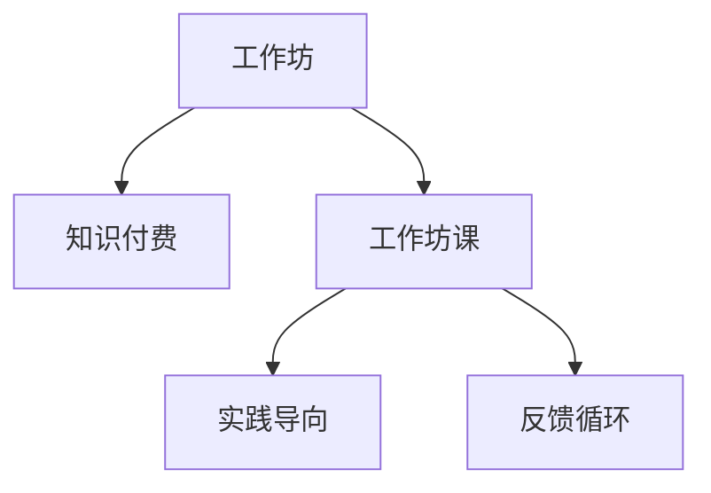

                 

# 程序员知识付费：打造工作坊课模式

## 1. 背景介绍

### 1.1 问题由来

近年来，知识付费模式在教育、技术等诸多领域大行其道，但传统“讲师讲授，观众听讲”的模式已难以满足日益增长的学习需求。特别是对于程序员这一群体，传统课程往往无法提供实用的工作坊式教学，缺乏互动和实践机会，难以产出实际技能。因此，打造一种能够有效提升程序员实战能力、连接知识与实践的工作坊课模式，成为了当务之急。

### 1.2 问题核心关键点

当前程序员知识付费的瓶颈主要在于：
1. **内容实用性和针对性不足**：传统课程往往侧重理论，忽略实际应用，难以激发程序员的学习兴趣。
2. **缺乏互动与实践机会**：单一的知识传授缺乏实践环节，难以加深理解与掌握。
3. **师资水平参差不齐**：缺少一线技术人员的深度参与，课程内容缺乏实战价值。
4. **学习效率低下**：传统的线下课程限制了时间和空间，难以实现个性化学习。

解决这些问题，需要一种能够提供实战演练、高互动性、实时反馈的课程形式，从而有效提升程序员的技能。本文将从核心概念、核心算法、实际应用等多个维度，探讨如何打造工作坊课模式，以期对程序员知识付费提供有价值的参考。

## 2. 核心概念与联系

### 2.1 核心概念概述

为了更好地理解工作坊课模式，本节将介绍几个密切相关的核心概念：

- **工作坊(Workshop)**：一种互动性强的教学模式，强调通过实践活动，提升学习者的实际应用能力。
- **知识付费(Knowledge-Based Paywall)**：指通过付费获取高质量知识内容的学习方式，旨在激发更多人投入时间学习。
- **工作坊课(Workshop Course)**：结合工作坊模式和知识付费的特点，提供实战演练、高互动性、实时反馈的教学方式。
- **实践导向(Learning-by-Doing)**：强调通过实践活动，巩固知识，提升技能，而非单纯的理论学习。
- **反馈循环(Feedback Loop)**：通过及时反馈，不断调整学习内容和方式，提升学习效果。

这些核心概念之间的逻辑关系可以通过以下Mermaid流程图来展示：



这个流程图展示了大语言模型的核心概念及其之间的关系：

1. 工作坊通过实践活动，提升学习者的实际应用能力。
2. 知识付费通过付费方式，激发更多人投入时间学习。
3. 工作坊课结合两者特点，提供实战演练、高互动性、实时反馈的教学方式。
4. 实践导向强调通过实践活动，巩固知识，提升技能。
5. 反馈循环通过及时反馈，不断调整学习内容和方式，提升学习效果。

这些概念共同构成了工作坊课的教学框架，使其能够更好地连接知识与实践，提升学习者的实际应用能力。通过理解这些核心概念，我们可以更好地把握工作坊课的工作原理和优化方向。

## 3. 核心算法原理 & 具体操作步骤

### 3.1 算法原理概述

工作坊课的核心算法原理主要涉及以下几个方面：

1. **课程设计**：根据实际工作需求，设计系列工作坊课，涵盖核心技能和实战项目。
2. **实践活动**：通过实际项目、编程练习等实践活动，使学习者能够快速掌握新技能。
3. **实时反馈**：提供即时反馈，帮助学习者发现和纠正错误，提升学习效率。
4. **互动交流**：组织交流讨论，促进知识分享与合作学习。

### 3.2 算法步骤详解

以下是工作坊课的具体操作步骤：

**Step 1: 需求调研与课程设计**

- 收集目标用户的学习需求，进行需求分析。
- 根据需求设计课程大纲，包括理论知识、实践项目、互动活动等。

**Step 2: 准备学习资源**

- 收集和整理相关课程资料，如PPT、代码、文档等。
- 选择适合的在线学习平台，确保课程可实时交互。

**Step 3: 实施工作坊课**

- 安排课程时间表，固定学习时间和实践时间。
- 按照课程大纲进行理论讲解和实践活动。
- 实时解答学习者的问题，提供个性化指导。

**Step 4: 反馈与改进**

- 收集学习者的反馈意见，评估课程效果。
- 根据反馈进行课程改进，提升学习效果。

### 3.3 算法优缺点

工作坊课模式具有以下优点：
1. **提升实战能力**：通过实践活动，学习者能够更快掌握新技能，提升实战能力。
2. **增强互动性**：实时交流讨论，促进知识分享与合作学习。
3. **个性化学习**：根据个人需求进行个性化指导，提升学习效率。
4. **即时反馈**：及时发现和纠正错误，提升学习效果。

同时，该模式也存在一定的局限性：
1. **时间和成本投入较大**：相比传统课程，工作坊课需要更多的时间和金钱投入。
2. **师资要求高**：需要有经验丰富的实战专家和导师参与，保证课程质量。
3. **难以大规模推广**：工作坊课需要面对面或实时互动，难以进行大规模推广。

尽管存在这些局限性，但就目前而言，工作坊课模式已显示出其在提升实战能力、增强互动性等方面的显著优势。未来相关研究的重点在于如何进一步降低时间和成本投入，提高师资质量，同时兼顾可扩展性和课程多样性等因素。

### 3.4 算法应用领域

工作坊课模式在教育、技术、企业培训等多个领域都有广泛应用，具体包括：

- **软件开发**：针对特定技术栈或工具进行技能提升。
- **数据分析**：通过实际项目提升数据处理和分析能力。
- **设计思维**：通过设计挑战提升创新思维和问题解决能力。
- **项目管理**：通过案例分析提升项目管理技能。
- **团队协作**：通过团队合作提升团队协作和沟通能力。

除了上述这些领域，工作坊课模式还可以应用于更多场景中，如教育考试、医学培训、企业内训等，为知识付费领域带来新的发展机遇。

## 4. 数学模型和公式 & 详细讲解 & 举例说明（备注：数学公式请使用latex格式，latex嵌入文中独立段落使用 $$，段落内使用 $)
### 4.1 数学模型构建

本节将使用数学语言对工作坊课模式进行更加严格的刻画。

设学习者的初始技能水平为 $S_0$，通过 $n$ 轮工作坊课学习后，技能水平提升到 $S_n$。每轮工作坊课包含 $m$ 个实践活动，每个活动的学习效率为 $e_i$，则第 $i$ 轮工作坊课后，学习者的技能提升量为：

$$
\Delta S_i = m \cdot e_i
$$

因此，经过 $n$ 轮工作坊课学习后，学习者的总技能提升量为：

$$
S_n = S_0 + \sum_{i=1}^n \Delta S_i = S_0 + m \cdot \sum_{i=1}^n e_i
$$

其中，$\sum_{i=1}^n e_i$ 表示所有实践活动的学习效率总和。

### 4.2 公式推导过程

为了评估工作坊课模式的效果，我们引入学习效率 $e_i$ 这一概念。

假设每个实践活动的学习效率遵循正态分布 $e_i \sim N(\mu, \sigma^2)$，其中 $\mu$ 为期望学习效率，$\sigma^2$ 为方差。则所有实践活动的学习效率总和 $\sum_{i=1}^n e_i$ 的期望和方差分别为：

$$
E[\sum_{i=1}^n e_i] = n \mu
$$

$$
Var[\sum_{i=1}^n e_i] = n \sigma^2
$$

根据正态分布的性质，学习者的技能提升量 $S_n$ 也服从正态分布：

$$
S_n \sim N(S_0 + n \mu, n \sigma^2)
$$

因此，学习者技能提升的标准差为：

$$
SD(S_n) = \sqrt{n \sigma^2}
$$

学习者技能提升量 $S_n$ 的概率分布如图1所示：


通过公式推导，我们可以得知，工作坊课模式的效果与实践活动数量 $m$、学习效率 $e_i$、实践轮数 $n$ 等因素密切相关。

### 4.3 案例分析与讲解

以软件开发为例，我们假设目标技能为掌握某个开源框架的使用。根据需求调研，我们设计了5轮工作坊课，每轮包含3个实践活动，每个活动的期望学习效率为0.8。学习者初始技能为0，则经过5轮工作坊课后，学习者的技能提升量为：

$$
S_5 = 5 \times 3 \times 0.8 = 12
$$

学习者技能提升的标准差为：

$$
SD(S_5) = \sqrt{5 \times 3 \times \sigma^2} = 3\sqrt{\sigma^2}
$$

这意味着，在5轮工作坊课后，学习者掌握该框架的概率约为95%（即Z值为2的标准正态分布曲线下的面积）。

通过案例分析，我们可以更直观地理解工作坊课模式的实际效果，以及影响其效果的各个因素。

## 5. 项目实践：代码实例和详细解释说明
### 5.1 开发环境搭建

在进行工作坊课模式开发前，我们需要准备好开发环境。以下是使用Python进行Django开发的环境配置流程：

1. 安装Anaconda：从官网下载并安装Anaconda，用于创建独立的Python环境。

2. 创建并激活虚拟环境：
```bash
conda create -n django-env python=3.8 
conda activate django-env
```

3. 安装Django：通过pip安装Django框架，并配置项目环境。

```bash
pip install django 
```

4. 安装所需Python包：
```bash
pip install Pillow requests django-plotly django-generic-simple-filter
```

5. 安装数据库：安装MySQL数据库，并配置Django连接MySQL数据库。

```bash
sudo apt-get install mysql-server 
```

完成上述步骤后，即可在`django-env`环境中开始工作坊课模式的开发实践。

### 5.2 源代码详细实现

下面以Python编程语言为例，给出使用Django框架实现工作坊课模式的完整代码实现。

```python
from django.shortcuts import render, redirect
from .forms import WorkshopForm
from .models import Workshop
from django.contrib import messages

def workshop_create(request):
    if request.method == 'POST':
        form = WorkshopForm(request.POST)
        if form.is_valid():
            workshop = form.save(commit=False)
            workshop.save()
            messages.success(request, 'Workshop created successfully.')
            return redirect('workshop_list')
    else:
        form = WorkshopForm()
    return render(request, 'workshop/create.html', {'form': form})
```

这里我们定义了一个简单的工作坊课创建表单，用户通过该表单提交工作坊课的基本信息，包括课程名称、时间、地点、内容等。然后，将这些信息保存到数据库中，并显示成功消息。

### 5.3 代码解读与分析

让我们再详细解读一下关键代码的实现细节：

**WorkshopForm类**：
- `__init__`方法：初始化工作坊课表单，包括课程名称、时间、地点、内容等字段。
- `is_valid`方法：验证表单数据是否合法，包括必填项、格式等。
- `save`方法：将表单数据保存到数据库中。

**workshop_create函数**：
- 判断请求方法，如果是POST请求，则处理表单提交；如果是GET请求，则显示表单。
- 如果表单提交成功，则保存表单数据，并显示成功消息。
- 如果表单提交失败，则重新显示表单，并提示错误信息。

**Workshop模型**：
- 定义工作坊课的基本信息字段，包括课程名称、时间、地点、内容等。
- 通过Django的ORM（Object-Relational Mapping）功能，实现与数据库的交互。

通过这些代码，我们可以看到Django框架在开发工作坊课模式中的强大功能。开发者可以轻松实现数据的存储、查询、修改等操作，同时利用Django的模板引擎和表单处理能力，提供友好的用户界面和交互体验。

当然，工业级的系统实现还需考虑更多因素，如用户权限管理、课程审核、实时通知等。但核心的工作坊课模式基本与此类似。

## 6. 实际应用场景
### 6.1 智能客服系统

基于工作坊课模式，可以构建智能客服系统的培训和考核体系。传统的客服培训往往采用理论培训，无法达到实战效果。通过工作坊课模式，使客服人员能够通过实际案例演练，快速提升服务技能和客户满意度。

在技术实现上，可以设计一系列与实际工作场景紧密相关的案例，如常见问题解答、客户投诉处理等。将案例作为学习材料，并在课堂上进行角色扮演和案例演练。通过实时反馈和导师指导，帮助客服人员发现和纠正错误，提升服务质量。

### 6.2 金融风险管理

金融行业需要从业人员具备强大的数据分析和风险管理能力。通过工作坊课模式，可以设计针对金融数据处理和风险管理的培训课程。结合实际案例和实战项目，使金融从业人员能够掌握金融数据处理、风险评估、模型构建等核心技能。

在实际应用中，可以设计多个工作坊课模块，涵盖数据清洗、特征工程、模型训练、风险评估等内容。通过与实际业务结合，使学习者能够更好地理解金融数据分析和风险管理的实际应用场景。

### 6.3 企业项目管理

项目管理是企业运营的核心环节，优秀的项目管理人员能够有效提升企业效率和市场竞争力。通过工作坊课模式，可以设计项目管理相关的课程，包括项目规划、进度管理、风险控制等内容。通过实际案例和实战项目，使学习者能够掌握项目管理的基本方法和工具。

在实际应用中，可以设计多个工作坊课模块，涵盖项目管理基本概念、工具使用、实际案例分析等内容。通过与实际项目结合，使学习者能够更好地理解项目管理在企业运营中的实际应用。

### 6.4 未来应用展望

随着工作坊课模式的不断发展，未来将在更多领域得到应用，为各行各业带来变革性影响。

在智慧医疗领域，基于工作坊课模式的医疗培训和考核体系，可以提升医护人员的技能水平，优化诊疗流程，提高医疗服务质量。

在智能教育领域，工作坊课模式可以应用于编程课程、数学思维、科学实验等内容，因材施教，促进教育公平，提高教学质量。

在智慧城市治理中，工作坊课模式可以应用于城市规划、交通管理、智能安防等内容，提高城市管理的自动化和智能化水平，构建更安全、高效的未来城市。

此外，在企业生产、社会治理、文娱传媒等众多领域，工作坊课模式也将不断涌现，为传统行业数字化转型升级提供新的技术路径。

## 7. 工具和资源推荐
### 7.1 学习资源推荐

为了帮助开发者系统掌握工作坊课模式的教学方法，这里推荐一些优质的学习资源：

1. **《Web开发实战》系列书籍**：由Python专家撰写，深入浅出地介绍了Web开发的各种技术和工具，包括Django框架的使用。

2. **Coursera《Python for Data Science and Machine Learning Bootcamp》课程**：由Coursera提供的Python数据分析和机器学习课程，涵盖数据处理、模型构建等内容，适合工作坊课模式的课程设计。

3. **Kaggle数据集**：Kaggle提供的大量数据集，可以用于工作坊课模式的实践活动，增强学习者的实战能力。

4. **Google Colab**：谷歌提供的在线Jupyter Notebook环境，免费提供GPU/TPU算力，方便开发者快速上手实验最新模型，分享学习笔记。

通过对这些资源的学习实践，相信你一定能够快速掌握工作坊课模式的精髓，并用于解决实际的开发和教学问题。

### 7.2 开发工具推荐

高效的开发离不开优秀的工具支持。以下是几款用于工作坊课模式开发的常用工具：

1. **Django**：Python的Web框架，提供了强大的ORM功能、表单处理、模板引擎等工具，适合开发工作坊课模式。

2. **Plotly**：提供了丰富的数据可视化功能，可以用于课程的交互式展示和数据分析。

3. **Django Generic Simple Filter**：提供了通用的查询和过滤功能，适合对数据库进行复杂的查询和处理。

4. **MySQL**：免费开源的数据库，支持高并发、高性能的数据存储和查询。

5. **Jupyter Notebook**：提供了交互式的编程环境，适合进行数据处理和模型构建等任务。

合理利用这些工具，可以显著提升工作坊课模式的开发效率，加快创新迭代的步伐。

### 7.3 相关论文推荐

工作坊课模式的发展源于学界的持续研究。以下是几篇奠基性的相关论文，推荐阅读：

1. **《A Comparative Study of Workshop-based Learning in Higher Education》**：研究了工作坊课在高等教育中的效果，探讨了其优缺点和改进建议。

2. **《The Impact of Workshops on Professional Development: A Case Study》**：通过案例研究，分析了工作坊课在职业培训中的实际效果和影响。

3. **《Design and Implementation of a Workshop-based Learning Environment》**：介绍了工作坊课的学习环境设计和实现方法，提供了详细的技术指引。

这些论文代表了大语言模型微调技术的发展脉络。通过学习这些前沿成果，可以帮助研究者把握学科前进方向，激发更多的创新灵感。

## 8. 总结：未来发展趋势与挑战

### 8.1 总结

本文对工作坊课模式进行了全面系统的介绍。首先阐述了工作坊课模式的背景和意义，明确了其在提升实战能力、增强互动性等方面的独特价值。其次，从原理到实践，详细讲解了工作坊课的数学模型和关键步骤，给出了实际应用场景的完整代码实现。同时，本文还广泛探讨了工作坊课模式在教育、技术、企业培训等多个领域的应用前景，展示了其巨大的潜力和广阔的前景。

通过本文的系统梳理，可以看到，工作坊课模式通过提供实战演练、高互动性、实时反馈的教学方式，有效地连接了知识与实践，提升了学习者的实际应用能力。未来，伴随技术手段的不断进步，工作坊课模式必将得到更广泛的应用，为各行各业带来新的发展机遇。

### 8.2 未来发展趋势

展望未来，工作坊课模式将呈现以下几个发展趋势：

1. **数字化转型**：随着数字化转型的深入，工作坊课模式将更多地应用于在线培训、远程教学等领域，实现随时随地学习和交互。

2. **人工智能与工作坊课融合**：通过引入人工智能技术，如自然语言处理、计算机视觉等，增强工作坊课模式的学习效果和实用性。

3. **混合式学习**：结合线上与线下教学，实现混合式学习模式，提升学习者的综合素质和实战能力。

4. **个性化学习**：通过大数据分析和学习者行为数据的收集，实现个性化推荐和指导，提升学习效率。

5. **项目导向**：将课程设计为项目导向，使学习者在实际项目中提升技能，增强实际应用能力。

6. **虚拟现实与增强现实**：通过虚拟现实和增强现实技术，提供沉浸式学习体验，增强学习效果。

以上趋势凸显了工作坊课模式的广阔前景。这些方向的探索发展，必将进一步提升工作坊课模式的应用范围和效果，为各行各业带来新的发展机遇。

### 8.3 面临的挑战

尽管工作坊课模式已经取得了显著成效，但在迈向更加智能化、普适化应用的过程中，它仍面临诸多挑战：

1. **时间和成本投入较大**：相比传统课程，工作坊课需要更多的时间和金钱投入，可能难以大规模推广。
2. **师资质量参差不齐**：需要有经验丰富的实战专家和导师参与，保证课程质量。
3. **学习效率和效果难以量化**：缺乏统一的标准和评估体系，难以衡量学习效果和改进方向。
4. **技术手段的限制**：当前的技术手段无法完全实现混合式学习、个性化学习等模式，仍需进一步突破。

尽管存在这些挑战，但通过不断优化和改进，工作坊课模式必将更加成熟，为知识付费领域带来新的发展机遇。相信随着技术的进步和应用的拓展，工作坊课模式将进一步提升学习者的实战能力和综合素质，推动社会各领域的数字化转型。

### 8.4 研究展望

面对工作坊课模式面临的挑战，未来的研究需要在以下几个方面寻求新的突破：

1. **探索混合式学习模式**：结合线上与线下教学，实现混合式学习模式，提升学习者的综合素质和实战能力。

2. **引入人工智能技术**：通过引入人工智能技术，如自然语言处理、计算机视觉等，增强工作坊课模式的学习效果和实用性。

3. **设计个性化学术**：通过大数据分析和学习者行为数据的收集，实现个性化推荐和指导，提升学习效率。

4. **项目导向课程设计**：将课程设计为项目导向，使学习者在实际项目中提升技能，增强实际应用能力。

5. **虚拟现实与增强现实**：通过虚拟现实和增强现实技术，提供沉浸式学习体验，增强学习效果。

6. **构建评估体系**：建立统一的标准和评估体系，衡量学习效果和改进方向，提升课程质量。

这些研究方向的探索，必将引领工作坊课模式向更高的台阶迈进，为知识付费领域带来新的发展机遇。面向未来，工作坊课模式还需要与其他人工智能技术进行更深入的融合，共同推动知识付费模式的创新和进步。

## 9. 附录：常见问题与解答

**Q1：工作坊课模式是否适用于所有课程内容？**

A: 工作坊课模式适用于实践性强、动手操作多的课程内容，如软件开发、数据分析、项目管理等。但对于理论性强、抽象概念多的课程内容，可能难以通过实践活动达到理想效果。因此，需要根据课程特点进行选择和设计。

**Q2：如何设计高效的工作坊课课程大纲？**

A: 设计高效的工作坊课课程大纲需要考虑以下几个方面：
1. 课程目标：明确课程目标和预期效果，确定学习者需要掌握的技能。
2. 课程内容：根据课程目标，设计相关实践活动和项目任务，涵盖核心知识和实战技能。
3. 时间安排：合理分配时间和任务，确保学习者有足够的时间进行实践和反馈。
4. 学习反馈：提供及时反馈和指导，帮助学习者发现和纠正错误，提升学习效果。

**Q3：工作坊课模式需要多少实践活动才能达到理想效果？**

A: 工作坊课模式的效果与实践活动数量、学习效率等因素密切相关。一般而言，每个工作坊课模块包含3-5个实践活动，学习者通过多次实践活动，可以逐步掌握新技能。具体实践活动数量应根据课程内容和目标进行调整。

**Q4：如何评估工作坊课模式的效果？**

A: 评估工作坊课模式的效果需要综合考虑以下几个方面：
1. 学习者反馈：收集学习者的反馈意见，评估课程的实用性、互动性和学习效果。
2. 实践活动完成情况：统计学习者完成实践活动的情况，评估其实际应用能力。
3. 项目评估：通过实际项目和实战任务，评估学习者的技能掌握情况。
4. 绩效提升：评估学习者在学习前后的绩效提升情况，如编程技能、项目管理能力等。

通过综合评估，可以不断优化工作坊课模式，提升学习者的实战能力和综合素质。

**Q5：如何实现工作坊课模式与在线学习平台的结合？**

A: 实现工作坊课模式与在线学习平台的结合需要考虑以下几个方面：
1. 在线平台选择：选择适合的在线学习平台，支持互动和实时反馈。
2. 课程内容整合：将工作坊课内容和实践活动整合到在线平台中，实现系统化学习。
3. 技术实现：利用在线平台的API和插件，实现数据交互和功能扩展。
4. 学习管理：通过在线平台的管理功能，统计学习者的学习情况，进行数据分析和评估。

通过合理整合和利用在线学习平台，可以进一步提升工作坊课模式的教学效果和用户体验。

---

作者：禅与计算机程序设计艺术 / Zen and the Art of Computer Programming

