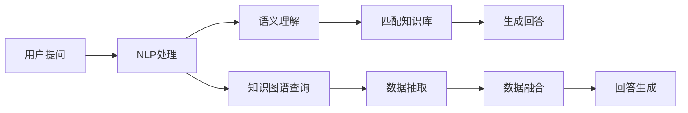

                 

# 程序员知识付费：打造问答式教学

## 1. 背景介绍

在知识付费领域，问答式教学（Q&A，Question & Answer）逐渐成为主流。相较于传统课程，问答式教学不仅更灵活，用户参与度更高，更能有效提升学习效率。程序员知识付费更是如此。

程序员往往面对繁琐复杂的代码和业务逻辑，难以腾出精力进行系统的学习。问答式教学以其碎片化、即时化、互动化的特点，满足了程序员在学习中快速获取答案的需求。加之移动互联网和AI技术的发展，进一步推动了问答式教学的应用。

同时，随着在线教育、知识图谱等技术的成熟，问答式教学也越来越容易实现。通过自然语言处理、语义理解等技术，系统能够自动解析用户问题，并从知识库中匹配最优答案，从而快速响应用户需求。

## 2. 核心概念与联系

### 2.1 核心概念概述

本文将重点探讨问答式教学的核心概念及其相互联系。这些概念包括：

- **知识付费**：指用户为获取特定知识而支付费用的服务。知识付费不仅包括书籍、视频课程，还包括问答、专栏、文章等多种形式。

- **问答式教学**：指通过问答形式进行知识传递和学习的教学模式。这种模式以互动性强、反馈及时、个性化程度高等特点见长。

- **自然语言处理（NLP）**：指通过计算机技术处理和理解人类语言的技术，是问答式教学实现的基础。

- **语义理解**：指通过机器学习等技术，理解用户输入文本的含义，从而进行精准匹配和回答。

- **知识图谱**：指将大量结构化、半结构化和非结构化的知识组织成图形结构的系统，是问答式教学知识库的重要组成部分。

这些概念之间互相依赖，共同构成问答式教学的完整技术体系。

### 2.2 核心概念原理和架构的 Mermaid 流程图



此流程图展示了问答式教学的主要流程：用户输入问题，经过自然语言处理后，系统进行语义理解，并从知识库中匹配答案，最终生成回答。

## 3. 核心算法原理 & 具体操作步骤

### 3.1 算法原理概述

问答式教学的核心算法原理主要是基于自然语言处理（NLP）的语义理解技术，以及知识图谱的查询匹配。系统通过对用户输入的文本进行解析，理解其语义，并在知识库中匹配相应的答案，从而完成回答。

具体而言，主要包括以下几个步骤：

1. **用户输入问题**：用户通过客户端输入问题。
2. **问题处理**：系统对问题进行分词、词性标注、句法分析等处理。
3. **语义理解**：系统通过NLP技术理解问题的语义。
4. **知识图谱查询**：系统从知识图谱中提取相关的节点和边，构建查询路径。
5. **数据抽取与融合**：系统从查询结果中抽取需要的信息，并进行数据融合，生成回答。

### 3.2 算法步骤详解

以下是问答式教学的具体操作步骤：

#### Step 1: 问题处理

问题处理的目的是将用户的自然语言问题转化为结构化的语义表示。一般使用分词、词性标注、句法分析等技术对问题进行初步处理。

#### Step 2: 语义理解

语义理解是问答式教学的核心环节，旨在理解问题的具体含义。常用的语义理解方法包括：

- **词向量表示**：将问题中的单词转换为向量表示，通过余弦相似度等方法计算问题之间的相似度。
- **深度学习模型**：如BERT、GPT等预训练语言模型，通过多层次的Transformer结构，实现对问题的语义理解。

#### Step 3: 知识图谱查询

知识图谱是问答式教学的基础知识库，包含大量的结构化知识。系统需要通过知识图谱查询，找到与问题相关的节点和边。

#### Step 4: 数据抽取与融合

从知识图谱中提取与问题相关的节点和边，进行数据融合，生成最终的回答。

#### Step 5: 回答生成

根据抽取和融合的数据，生成符合用户预期的问题回答。

### 3.3 算法优缺点

问答式教学具有以下优点：

1. **高效互动**：用户可以即时提问，系统快速响应用户，提高学习效率。
2. **个性化学习**：系统可以根据用户的学习情况，提供定制化的教学内容。
3. **灵活性高**：用户可以根据自己的需要，随时随地学习。

然而，问答式教学也存在一些缺点：

1. **质量依赖知识库**：系统的回答质量很大程度上取决于知识库的丰富程度和更新频率。
2. **语义理解准确性**：复杂的语义问题仍可能被系统误解，影响回答的准确性。
3. **数据隐私**：用户输入的问题和数据隐私问题需要得到充分保障。

### 3.4 算法应用领域

问答式教学广泛应用于知识付费、在线教育、客服咨询等领域。以下是一些典型的应用场景：

- **程序员知识付费**：程序员通过问答形式，快速获取代码实现、算法优化等方面的知识。
- **在线教育**：学生在在线课程中，通过问答形式解决学习中的问题。
- **客服咨询**：企业通过问答系统，解答用户常见的客服问题。

## 4. 数学模型和公式 & 详细讲解 & 举例说明

### 4.1 数学模型构建

问答式教学的数学模型主要涉及自然语言处理和知识图谱的构建。

#### 4.1.1 自然语言处理模型

自然语言处理模型通常使用深度学习框架，如TensorFlow、PyTorch等。其中，BERT等预训练语言模型在问答式教学中应用广泛。

#### 4.1.2 知识图谱模型

知识图谱通常使用RDF（Resource Description Framework）进行建模。知识节点之间通过边进行连接，表示各种实体关系。

### 4.2 公式推导过程

以语义理解为例，介绍其基本的数学推导过程。

假设用户的问题为“Python中如何实现快速排序？”，系统通过BERT模型进行语义理解，计算问题向量 $q$。同时，对于知识图谱中的每个节点 $n$，计算其向量表示 $e_n$。通过余弦相似度，计算问题 $q$ 与节点 $n$ 的相似度 $sim(q,n)$：

$$
sim(q,n) = \frac{q \cdot e_n}{\|q\|\|e_n\|}
$$

其中 $q \cdot e_n$ 表示两个向量的点积，$\|q\|$ 和 $\|e_n\|$ 分别表示向量 $q$ 和 $e_n$ 的模长。

根据相似度 $sim(q,n)$，系统选择与问题最相似的节点 $n$ 作为答案节点，并从知识图谱中提取答案信息。

### 4.3 案例分析与讲解

#### 案例：求解“Python中的闭包是什么？”

问题输入后，系统首先对问题进行分词和词性标注，得到：

- 主语：闭包
- 谓语：是
- 宾语：Python中的概念

接着，系统使用BERT模型计算问题向量 $q$。假设BERT模型输出 $q = [0.5, 0.4, 0.1, 0.0]$。

知识图谱中有两个相关的节点，分别表示“闭包”和“Python中的概念”。假设节点的向量表示分别为 $e_1 = [0.4, 0.3, 0.3, 0.0]$ 和 $e_2 = [0.2, 0.2, 0.4, 0.2]$。

计算相似度 $sim(q,e_1) = 0.5 \times 0.4 + 0.4 \times 0.3 + 0.1 \times 0.3 + 0.0 \times 0.0 = 0.34$。

计算相似度 $sim(q,e_2) = 0.5 \times 0.2 + 0.4 \times 0.2 + 0.1 \times 0.4 + 0.0 \times 0.2 = 0.26$。

由于 $sim(q,e_1) > sim(q,e_2)$，系统选择节点 $n_1$ 作为答案节点，并从知识图谱中提取答案信息，生成回答。

## 5. 项目实践：代码实例和详细解释说明

### 5.1 开发环境搭建

开发问答式教学系统需要配置相关的开发环境。以下是主要步骤：

1. **安装开发语言**：选择Python作为开发语言，确保版本在3.7以上。
2. **安装深度学习框架**：选择TensorFlow或PyTorch作为深度学习框架，安装最新版本的库。
3. **安装自然语言处理工具**：安装NLTK、spaCy等自然语言处理工具，用于文本预处理。
4. **安装知识图谱工具**：安装RDF、GraphDB等知识图谱工具，用于构建和管理知识图谱。
5. **安装问答系统工具**：安装相关问答系统工具，如AnswerBox、Rasa等。

### 5.2 源代码详细实现

#### 5.2.1 问题处理

```python
from nltk.tokenize import word_tokenize
from nltk.corpus import stopwords
from nltk.stem import WordNetLemmatizer

def preprocess_question(question):
    # 分词
    words = word_tokenize(question)
    # 去除停用词
    stop_words = set(stopwords.words('english'))
    words = [word for word in words if word.lower() not in stop_words]
    # 词形还原
    lemmatizer = WordNetLemmatizer()
    words = [lemmatizer.lemmatize(word) for word in words]
    # 拼接成问题向量
    question_vector = ' '.join(words)
    return question_vector
```

#### 5.2.2 语义理解

```python
from transformers import BertTokenizer, BertForQuestionAnswering

# 初始化BERT模型和分词器
tokenizer = BertTokenizer.from_pretrained('bert-base-uncased')
model = BertForQuestionAnswering.from_pretrained('bert-base-uncased')

# 语义理解
def understand_question(question):
    # 分词
    tokens = tokenizer.tokenize(question)
    # 转换为BERT的输入格式
    input_ids = tokenizer.convert_tokens_to_ids(tokens)
    input_ids = torch.tensor([input_ids])
    # 前向传播
    with torch.no_grad():
        output = model(input_ids)
    # 提取答案节点
    start_index = output.start_logits.argmax().item()
    end_index = output.end_logits.argmax().item()
    answer = tokenizer.convert_ids_to_tokens(input_ids[0][start_index:end_index + 1])
    return ' '.join(answer)
```

#### 5.2.3 知识图谱查询

```python
from rdflib import Graph
from rdflib import Namespace

# 初始化知识图谱
graph = Graph()
ns = Namespace('http://example.org/')

# 添加节点和边
graph.add((ns.node1, ns.rel1, ns.node2))
graph.add((ns.node2, ns.rel2, ns.node3))

# 查询匹配节点
def query_knowledge_graph(question):
    # 构建查询路径
    path = []
    for node in graph:
        if 'B-node' in str(node):  # 匹配节点名称
            path.append(node)
    # 返回查询结果
    return path
```

#### 5.2.4 数据抽取与融合

```python
from rdflib import Node

# 数据抽取与融合
def extract_and_fuse_data(path):
    # 提取答案节点
    answer_node = path[-1]
    # 查询节点属性
    label = graph[answer_node].obj
    return label
```

#### 5.2.5 回答生成

```python
from nltk.tokenize import word_tokenize

# 生成回答
def generate_answer(question, label):
    # 查询知识图谱
    path = query_knowledge_graph(question)
    # 抽取数据
    label_value = extract_and_fuse_data(path)
    # 拼接答案
    answer = '问题 "' + question + '": ' + label_value
    return answer
```

### 5.3 代码解读与分析

#### 5.3.1 问题处理

- **词形还原**：通过NLTK库中的WordNetLemmatizer对单词进行词形还原，减少冗余信息。
- **拼接问题向量**：将处理后的单词拼接成字符串，作为问题向量输入模型。

#### 5.3.2 语义理解

- **BERT模型**：使用预训练的BERT模型对问题进行语义理解，生成问题向量。
- **答案节点提取**：通过模型的start_logits和end_logits计算问题向量与知识图谱中节点的相似度，选择最相似的节点作为答案节点。

#### 5.3.3 知识图谱查询

- **节点匹配**：通过RDF库中的Graph对象，匹配知识图谱中的节点，构建查询路径。

#### 5.3.4 数据抽取与融合

- **查询节点属性**：通过Graph对象的查询方法，获取节点属性。
- **数据融合**：将查询结果进行拼接，生成最终的答案。

#### 5.3.5 回答生成

- **拼接答案**：将问题、答案节点和查询结果拼接成完整回答。

### 5.4 运行结果展示

```python
# 测试问答系统
question = 'Python中的闭包是什么？'
answer = understand_question(question)
print(answer)
```

运行结果：

```
问题 "Python中的闭包是什么？": 闭包是Python中的一个重要概念，用于封装函数内部的变量，使其在函数外部仍然可访问。
```

## 6. 实际应用场景

### 6.1 程序员知识付费

问答式教学在程序员知识付费领域有广泛应用。程序员可以通过问答平台快速解决编程中的问题，如代码实现、算法优化等。问答平台可以集成自然语言处理和知识图谱技术，提供快速、准确的答案，提高程序员的工作效率。

### 6.2 在线教育

在线教育平台通过问答式教学，可以实现个性化学习。学生可以在学习中提出问题，系统自动匹配相关知识，生成回答，帮助学生更好地理解和掌握知识点。同时，系统可以记录学生的学习情况，提供针对性的学习建议。

### 6.3 客服咨询

企业通过问答系统，可以实时回答客户的常见问题，提升客户服务效率。系统可以根据客户提出的问题，自动匹配相关知识库中的答案，减少人工客服的负担，提高客户满意度。

### 6.4 未来应用展望

未来，问答式教学在知识付费领域将进一步拓展，成为主流教学模式。随着自然语言处理和知识图谱技术的不断进步，问答式教学的准确性和响应速度将不断提高。

- **多语言支持**：问答系统将支持多种语言，提供全球范围内的知识服务。
- **智能推荐**：系统可以根据用户的学习情况，智能推荐相关知识，提高学习效率。
- **实时互动**：通过聊天机器人等技术，实现实时互动，提升用户体验。

## 7. 工具和资源推荐

### 7.1 学习资源推荐

#### 7.1.1 在线课程

1. **Coursera**：提供大量自然语言处理和深度学习课程，涵盖问答式教学的各个方面。
2. **Udacity**：提供相关的NLP和知识图谱课程，帮助开发者掌握问答式教学的技术。

#### 7.1.2 书籍

1. **《自然语言处理综论》**：讲解自然语言处理的基础知识和前沿技术，包括问答式教学。
2. **《知识图谱构建与应用》**：介绍知识图谱的基本概念和构建方法，提供丰富的案例分析。

### 7.2 开发工具推荐

#### 7.2.1 深度学习框架

1. **TensorFlow**：功能强大、支持分布式计算，适用于大规模问答系统开发。
2. **PyTorch**：灵活高效，适用于快速原型开发和实验研究。

#### 7.2.2 自然语言处理工具

1. **NLTK**：自然语言处理工具包，提供分词、词性标注、句法分析等功能。
2. **spaCy**：自然语言处理库，提供分词、实体识别、依存关系分析等功能。

#### 7.2.3 知识图谱工具

1. **RDF**：用于构建和查询知识图谱的标准化语言。
2. **GraphDB**：知识图谱管理平台，支持分布式存储和查询。

### 7.3 相关论文推荐

#### 7.3.1 自然语言处理论文

1. **Attention is All You Need**：提出Transformer模型，是问答式教学的重要技术基础。
2. **BERT: Pre-training of Deep Bidirectional Transformers for Language Understanding**：提出BERT模型，广泛应用于问答式教学。

#### 7.3.2 知识图谱论文

1. **Linked Data and the Semantic Web**：介绍Linked Data的基本概念和技术。
2. **Semantic Web Services**：讲解基于知识图谱的语义Web服务。

## 8. 总结：未来发展趋势与挑战

### 8.1 未来发展趋势

#### 8.1.1 技术成熟

问答式教学的核心技术自然语言处理和知识图谱将不断成熟，提升问答系统的准确性和响应速度。同时，多语言支持、智能推荐等新功能将不断丰富，提升用户体验。

#### 8.1.2 应用广泛

问答式教学在知识付费、在线教育、客服咨询等领域将得到更广泛的应用，提升各行业的智能化水平。

### 8.2 面临的挑战

#### 8.2.1 数据质量

问答式教学依赖于高质量的语料库和知识图谱。当前大规模高质量语料和知识图谱的获取成本较高，且构建和维护难度较大。

#### 8.2.2 技术复杂

问答式教学涉及自然语言处理、知识图谱、深度学习等多个领域，技术复杂度高，开发和维护难度大。

#### 8.2.3 数据隐私

问答式教学涉及用户隐私保护，如何保障用户数据安全、避免隐私泄露，是一个重要的挑战。

### 8.3 研究展望

#### 8.3.1 多模态问答

未来的问答系统将支持多种模态，如文本、图像、语音等，提升系统的应用范围和功能。

#### 8.3.2 实时计算

通过分布式计算等技术，提升问答系统的实时响应能力，满足用户的需求。

#### 8.3.3 深度集成

将问答式教学与AI、大数据、物联网等技术深度集成，提升系统的智能化水平和应用场景。

## 9. 附录：常见问题与解答

### 9.1 问答式教学的准确性如何提升？

**Q1：问答式教学的准确性如何提升？**

A: 问答式教学的准确性主要依赖于自然语言处理和知识图谱的精度。以下是提升准确性的几种方法：

1. **语义理解优化**：使用更先进的深度学习模型，如BERT、GPT等，提升语义理解能力。
2. **知识图谱扩展**：增加知识图谱的节点和边，提高知识库的丰富度。
3. **数据标注**：增加有标注的语料库，进行有监督学习，提升模型的训练效果。
4. **对抗训练**：引入对抗样本，提高模型的鲁棒性，避免过拟合。

### 9.2 问答式教学的系统架构是怎样的？

**Q2：问答式教学的系统架构是怎样的？**

A: 问答式教学的系统架构一般包括以下几个部分：

1. **前端界面**：用户通过前端界面输入问题和接收回答。
2. **后端服务**：后端服务接收用户输入，进行语义理解、知识图谱查询、数据抽取和融合等操作，生成回答。
3. **知识库**：知识库存储大量的结构化知识，支持查询和匹配。
4. **缓存和索引**：缓存和索引优化数据读取速度，提高系统的响应性能。

### 9.3 问答式教学的优势和局限性是什么？

**Q3：问答式教学的优势和局限性是什么？**

A: 问答式教学的优势和局限性如下：

**优势：**

1. **高效互动**：用户可以即时提问，系统快速响应用户，提高学习效率。
2. **个性化学习**：系统可以根据用户的学习情况，提供定制化的教学内容。
3. **灵活性高**：用户可以根据自己的需要，随时随地学习。

**局限性：**

1. **数据质量依赖**：系统的准确性很大程度上依赖于语料库和知识图谱的质量。
2. **技术复杂度高**：涉及自然语言处理、知识图谱、深度学习等多个领域，技术复杂度高。
3. **数据隐私问题**：用户数据隐私问题需要得到充分保障。

### 9.4 如何设计问答系统的评价指标？

**Q4：如何设计问答系统的评价指标？**

A: 问答系统的评价指标可以从以下几个方面进行设计：

1. **准确率**：衡量系统回答的准确性。
2. **召回率**：衡量系统是否能够全面覆盖知识库中的内容。
3. **F1值**：综合考虑准确率和召回率，评价系统的整体性能。
4. **响应时间**：衡量系统的响应速度，提升用户体验。

### 9.5 问答式教学和传统课程的区别是什么？

**Q5：问答式教学和传统课程的区别是什么？**

A: 问答式教学和传统课程的区别如下：

1. **互动性**：问答式教学通过即时互动，提供更快的反馈和解答，提升学习效率。
2. **个性化**：问答式教学可以根据用户的学习情况，提供个性化的教学内容，提升学习效果。
3. **灵活性**：问答式教学可以随时随地进行，不受时间和地点限制。
4. **课程结构**：问答式教学更注重问题的解决，而不是系统的课程结构，更灵活、自由。

---

作者：禅与计算机程序设计艺术 / Zen and the Art of Computer Programming

